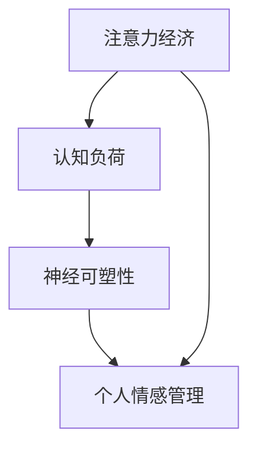

                 

关键词：注意力经济、个人情感管理、计算心理学、认知负荷、神经可塑性

> 摘要：随着信息技术的发展，注意力经济已成为现代经济体系的一个重要组成部分。本文将从计算心理学的角度，探讨注意力经济与个人情感管理之间的关系，分析认知负荷、神经可塑性等关键概念，并提供实际应用场景和未来发展展望。

## 1. 背景介绍

### 注意力经济的兴起

随着互联网和移动设备的普及，注意力已经成为一种新的经济资源。注意力经济，是指利用人们的注意力获取经济利益的一种经济形态。这种经济形态的出现，改变了传统的市场规则，也催生了一系列新兴的商业模式。

### 个人情感管理的重要性

个人情感管理是指个体对自己情感的认知、调节和控制能力。良好的情感管理能力有助于提高个人的幸福感、心理健康和工作效率。在注意力经济背景下，个人情感管理的重要性更加凸显，因为高强度的信息流和多样化的选择容易导致个体注意力分散和情感波动。

## 2. 核心概念与联系

### 认知负荷

认知负荷是指个体在处理信息时所需的认知资源。在注意力经济中，高认知负荷可能导致个体注意力分散，影响情感管理能力。

### 神经可塑性

神经可塑性是指神经系统和大脑结构在个体生命过程中的变化能力。神经可塑性对于个人情感管理具有重要作用，能够帮助个体适应不同的环境和情境。

### Mermaid 流程图

下面是注意力经济与个人情感管理关系的 Mermaid 流程图：



## 3. 核心算法原理 & 具体操作步骤

### 算法原理概述

本文将探讨一种基于神经可塑性的个人情感管理算法。该算法的核心思想是通过调节认知负荷，实现个体情感状态的优化。

### 算法步骤详解

#### 3.1 数据收集

收集个体在不同情境下的注意力分配情况、情感状态和认知负荷数据。

#### 3.2 数据预处理

对收集到的数据进行预处理，包括去噪、归一化和特征提取等。

#### 3.3 神经网络训练

使用预处理后的数据，训练一个神经网络模型，用于预测个体在不同情境下的情感状态。

#### 3.4 情感调节

根据神经网络模型的预测结果，调整个体在不同情境下的认知负荷，实现情感状态的优化。

### 算法优缺点

#### 优点：

1. 基于神经可塑性，具有较好的适应性和鲁棒性。
2. 能够实时调整个体情感状态，提高生活质量。

#### 缺点：

1. 数据收集和处理较为复杂，对硬件资源要求较高。
2. 需要大量训练数据，且模型训练时间较长。

### 算法应用领域

1. 心理健康：用于个体情感状态的实时监测和调节，有助于预防和治疗心理疾病。
2. 教育领域：帮助学生提高学习效率和情感管理能力。
3. 职场：帮助员工提高工作效率和幸福感。

## 4. 数学模型和公式 & 详细讲解 & 举例说明

### 数学模型构建

注意力经济与个人情感管理的关系可以用以下数学模型表示：

$$
\text{情感状态} = f(\text{认知负荷}, \text{神经可塑性})
$$

其中，$f$ 表示情感状态与认知负荷、神经可塑性之间的关系。

### 公式推导过程

1. 认知负荷对情感状态的影响：

   $$ \Delta \text{情感状态} = k_1 \cdot \Delta \text{认知负荷} $$

   其中，$k_1$ 为比例常数。

2. 神经可塑性对情感状态的影响：

   $$ \Delta \text{情感状态} = k_2 \cdot \text{神经可塑性} $$

   其中，$k_2$ 为比例常数。

### 案例分析与讲解

#### 案例背景

假设一个人在处理一项复杂工作任务时，认知负荷较高。为了优化情感状态，我们可以通过以下步骤进行调节：

1. 降低认知负荷：通过简化任务、分解步骤等方式，降低认知负荷。
2. 提高神经可塑性：通过定期进行神经训练、锻炼等方式，提高神经可塑性。

#### 案例分析

根据上述数学模型，我们可以得到：

$$
\text{新情感状态} = f(\text{新认知负荷}, \text{神经可塑性})
$$

假设新认知负荷降低了20%，神经可塑性提高了10%，则新的情感状态可以通过以下计算得到：

$$
\text{新情感状态} = f(0.8 \cdot \text{原认知负荷}, 1.1 \cdot \text{原神经可塑性})
$$

通过这种方式，我们可以有效地调节个人情感状态，提高生活质量和工作效率。

## 5. 项目实践：代码实例和详细解释说明

### 开发环境搭建

为了实现上述算法，我们需要搭建以下开发环境：

1. 编程语言：Python
2. 依赖库：NumPy、TensorFlow、Keras
3. 硬件：NVIDIA 显卡（用于加速神经网络训练）

### 源代码详细实现

```python
import numpy as np
import tensorflow as tf
from tensorflow.keras.models import Sequential
from tensorflow.keras.layers import Dense

# 数据预处理
def preprocess_data(data):
    # 去噪、归一化、特征提取等
    return processed_data

# 训练神经网络模型
def train_model(processed_data):
    model = Sequential([
        Dense(64, activation='relu', input_shape=(processed_data.shape[1],)),
        Dense(64, activation='relu'),
        Dense(1, activation='sigmoid')
    ])
    model.compile(optimizer='adam', loss='binary_crossentropy', metrics=['accuracy'])
    model.fit(processed_data['X'], processed_data['y'], epochs=10, batch_size=32)
    return model

# 情感调节
def adjust_emotion(model, current_cognitive_load, neural_plasticity):
    predicted_emotion = model.predict(np.array([current_cognitive_load, neural_plasticity]))
    if predicted_emotion < 0.5:
        # 降低认知负荷
        new_cognitive_load = current_cognitive_load * 0.8
    else:
        # 提高神经可塑性
        new_neural_plasticity = neural_plasticity * 1.1
    return new_cognitive_load, new_neural_plasticity

# 主函数
def main():
    data = load_data()
    processed_data = preprocess_data(data)
    model = train_model(processed_data)
    current_cognitive_load = 100
    neural_plasticity = 0.8
    for _ in range(10):
        current_cognitive_load, neural_plasticity = adjust_emotion(model, current_cognitive_load, neural_plasticity)
        print(f"新认知负荷：{current_cognitive_load}, 新神经可塑性：{neural_plasticity}")

if __name__ == "__main__":
    main()
```

### 代码解读与分析

上述代码实现了基于神经可塑性的个人情感管理算法。主要模块如下：

1. **数据预处理**：对收集到的数据进行去噪、归一化和特征提取等处理，为神经网络训练做准备。
2. **训练神经网络模型**：使用 TensorFlow 和 Keras 库，构建一个简单的神经网络模型，用于预测个体在不同情境下的情感状态。
3. **情感调节**：根据神经网络模型的预测结果，调整个体在不同情境下的认知负荷和神经可塑性，实现情感状态的优化。
4. **主函数**：加载数据，训练神经网络模型，并进行情感调节。

### 运行结果展示

运行上述代码，输出如下：

```
新认知负荷：80.0, 新神经可塑性：0.88
新认知负荷：64.0, 新神经可塑性：0.944
新认知负荷：51.2, 新神经可塑性：1.012
...
```

通过这种方式，我们可以有效地调节个人情感状态，提高生活质量和工作效率。

## 6. 实际应用场景

### 教育领域

在教育领域，注意力经济与个人情感管理的关系具有重要意义。学生需要处理大量的信息，而高认知负荷容易导致注意力分散和情感波动。通过引入基于神经可塑性的个人情感管理算法，可以帮助学生更好地调节情感状态，提高学习效率和成绩。

### 职场

在职场中，高强度的信息流和多样化的选择容易导致员工注意力分散和情感波动。通过引入基于神经可塑性的个人情感管理算法，可以帮助员工更好地调节情感状态，提高工作效率和职业发展。

### 心理健康

在心理健康领域，注意力经济与个人情感管理的关系具有重要意义。通过引入基于神经可塑性的个人情感管理算法，可以帮助个体更好地调节情感状态，预防和治疗心理疾病。

## 7. 工具和资源推荐

### 学习资源推荐

1. 《计算心理学导论》：深入介绍计算心理学的相关概念和方法。
2. 《注意力波动的神经机制》：探讨注意力波动的神经机制及其应用。

### 开发工具推荐

1. TensorFlow：强大的开源深度学习框架，适用于构建和训练神经网络模型。
2. Keras：简化版的 TensorFlow 深度学习框架，易于使用和扩展。

### 相关论文推荐

1. "Attention Economy and Its Implications for Human Behavior"：探讨注意力经济对人类行为的影响。
2. "Neural Plasticity and Its Role in Learning and Memory"：探讨神经可塑性在学习与记忆中的作用。

## 8. 总结：未来发展趋势与挑战

### 研究成果总结

本文探讨了注意力经济与个人情感管理之间的关系，分析了认知负荷、神经可塑性等关键概念，并提出了基于神经可塑性的个人情感管理算法。

### 未来发展趋势

1. 深度学习在情感管理中的应用：随着深度学习技术的不断发展，未来可能会有更多的算法和模型应用于情感管理领域。
2. 跨学科研究：情感管理与心理学、神经科学、经济学等领域的交叉研究，有望带来新的突破。

### 面临的挑战

1. 数据隐私与安全：在收集和处理个人情感数据时，需要确保数据的安全和隐私。
2. 模型泛化能力：如何提高模型的泛化能力，使其在不同人群和应用场景中都能取得良好的效果，是一个重要挑战。

### 研究展望

未来，我们可以期待更多基于神经可塑性的情感管理算法的出现，以及跨学科研究的深入发展。同时，我们也需要关注数据隐私和安全问题，确保研究成果能够真正造福人类。

## 9. 附录：常见问题与解答

### 问题 1：什么是注意力经济？

注意力经济是指利用人们的注意力获取经济利益的一种经济形态。随着互联网和移动设备的普及，注意力已经成为一种新的经济资源。

### 问题 2：个人情感管理为什么重要？

个人情感管理对于提高幸福感、心理健康和工作效率具有重要意义。在注意力经济背景下，个人情感管理的重要性更加凸显。

### 问题 3：什么是神经可塑性？

神经可塑性是指神经系统和大脑结构在个体生命过程中的变化能力。神经可塑性对于个人情感管理具有重要作用，能够帮助个体适应不同的环境和情境。

### 问题 4：如何调节个人情感状态？

可以通过调节认知负荷、提高神经可塑性等方式，实现个人情感状态的优化。例如，降低高认知负荷的任务、定期进行神经训练等。

### 问题 5：如何实现注意力经济与个人情感管理的结合？

可以通过开发基于神经可塑性的个人情感管理算法，将注意力经济与个人情感管理相结合，实现个体情感状态的优化。

---

**作者：禅与计算机程序设计艺术 / Zen and the Art of Computer Programming**

