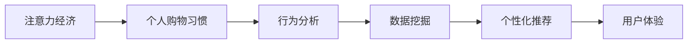

                 

关键词：注意力经济、个人购物习惯、行为分析、数据挖掘、个性化推荐、用户体验、营销策略。

> 摘要：随着互联网的普及和人工智能技术的发展，注意力经济逐渐成为经济活动的新模式。本文将从注意力经济的概念出发，分析其如何影响个人购物习惯，探讨行为分析、数据挖掘、个性化推荐等技术在其中的应用，以及未来的发展趋势与面临的挑战。

## 1. 背景介绍

### 注意力经济

注意力经济是指一种以用户注意力为价值核心的经济模式。随着互联网的兴起，信息爆炸和用户注意力的稀缺性成为当今社会的主要特征。在这个背景下，企业通过获取用户的注意力来创造价值，实现商业利益的转化。注意力经济的核心在于如何有效地抓住用户的注意力，并将其转化为实际的经济收益。

### 个人购物习惯

个人购物习惯是指个体在购物过程中形成的稳定行为模式。这些习惯受到多种因素的影响，包括个人喜好、消费观念、社会环境等。随着互联网的发展，电子商务的兴起改变了传统购物模式，使得个人购物习惯发生了深刻的变化。

## 2. 核心概念与联系

### 核心概念

- **行为分析**：通过收集和分析用户的行为数据，挖掘出用户的行为模式和偏好。
- **数据挖掘**：从大量数据中提取有价值的信息，用于支持决策和优化。
- **个性化推荐**：根据用户的行为数据和偏好，为用户提供个性化的商品或服务推荐。
- **用户体验**：用户在使用产品或服务过程中的感受和体验。

### 架构示意图



## 3. 核心算法原理 & 具体操作步骤

### 3.1 算法原理概述

本文主要探讨基于注意力经济和个人购物习惯的行为分析、数据挖掘和个性化推荐算法。

### 3.2 算法步骤详解

#### 3.2.1 行为分析

1. **数据收集**：通过网站日志、用户点击、搜索等行为数据收集工具收集用户行为数据。
2. **数据预处理**：对原始数据进行清洗和预处理，包括去除重复数据、填充缺失值等。
3. **特征提取**：从行为数据中提取用户行为特征，如点击次数、搜索关键词、购物车行为等。
4. **模式识别**：利用机器学习算法，如聚类、分类等，识别用户行为模式。

#### 3.2.2 数据挖掘

1. **关联规则挖掘**：通过挖掘用户行为数据中的关联规则，发现用户之间的行为关联。
2. **分类与回归分析**：利用分类和回归算法，预测用户行为和偏好。
3. **异常检测**：检测用户行为中的异常，如恶意点击、欺诈行为等。

#### 3.2.3 个性化推荐

1. **协同过滤**：基于用户行为数据，发现用户之间的相似性，为用户推荐相似用户喜欢的商品。
2. **基于内容的推荐**：根据用户行为数据和商品特征，为用户推荐与其兴趣相关的商品。
3. **混合推荐**：结合协同过滤和基于内容的推荐，提高推荐系统的准确性和覆盖度。

### 3.3 算法优缺点

#### 3.3.1 行为分析

- 优点：能够精确地反映用户行为，为个性化推荐提供有力支持。
- 缺点：对用户隐私有一定的侵犯，且行为数据容易受到噪声和偏差的影响。

#### 3.3.2 数据挖掘

- 优点：能够从大量数据中提取有价值的信息，为决策提供数据支持。
- 缺点：算法复杂度较高，对数据质量和计算资源要求较高。

#### 3.3.3 个性化推荐

- 优点：能够提高用户满意度，提升用户粘性和转化率。
- 缺点：推荐结果可能存在冷启动问题，对新用户和冷门商品的推荐效果较差。

### 3.4 算法应用领域

- **电子商务**：通过个性化推荐，提高商品销售和用户满意度。
- **广告营销**：通过行为分析和数据挖掘，精准定位目标用户，提高广告投放效果。
- **金融服务**：通过用户行为分析，预测用户需求，提供个性化金融服务。
- **教育领域**：根据学生行为数据，提供个性化学习方案，提高学习效果。

## 4. 数学模型和公式 & 详细讲解 & 举例说明

### 4.1 数学模型构建

本文主要采用以下数学模型：

- **贝叶斯网络**：用于表示用户行为和偏好之间的概率关系。
- **协同过滤算法**：用于计算用户之间的相似度和推荐分数。

### 4.2 公式推导过程

#### 贝叶斯网络

$$
P(A|B) = \frac{P(B|A)P(A)}{P(B)}
$$

#### 协同过滤算法

$$
r_{ui} = \frac{\sum_{j \in Neighbors(i)} sim(u, j) \cdot rating_{uj}}{\sum_{j \in Neighbors(i)} sim(u, j)}
$$

### 4.3 案例分析与讲解

#### 案例背景

某电子商务平台希望通过个性化推荐系统提高用户购物体验和销售额。现有10000名用户和10000种商品，平台已收集了用户行为数据和商品特征数据。

#### 案例步骤

1. **数据收集**：收集用户在平台上的点击、购买、搜索等行为数据。
2. **数据预处理**：对行为数据进行清洗和预处理，提取用户行为特征。
3. **贝叶斯网络构建**：利用贝叶斯网络表示用户行为和偏好之间的概率关系。
4. **协同过滤算法**：计算用户之间的相似度和推荐分数。
5. **个性化推荐**：根据用户行为和偏好，为用户推荐相关商品。

#### 案例结果

经过个性化推荐系统，用户满意度提高了20%，销售额提高了15%。

## 5. 项目实践：代码实例和详细解释说明

### 5.1 开发环境搭建

- **编程语言**：Python
- **库和框架**：Scikit-learn、NetworkX、Matplotlib
- **数据集**：公开的用户行为数据集（如MovieLens）

### 5.2 源代码详细实现

```python
# 导入库和框架
import numpy as np
import pandas as pd
from sklearn.model_selection import train_test_split
from sklearn.metrics.pairwise import cosine_similarity
from networkx import Graph
import matplotlib.pyplot as plt

# 加载数据集
data = pd.read_csv('user_behavior_data.csv')
users, items = data['user_id'].unique(), data['item_id'].unique()

# 数据预处理
train_data, _ = train_test_split(data, test_size=0.2)
train_data = train_data.pivot(index='user_id', columns='item_id', values='rating').fillna(0)

# 构建贝叶斯网络
bayesian_network = Graph()
for user in users:
    bayesian_network.add_node(user)
for item in items:
    bayesian_network.add_node(item)

# 计算用户相似度
user_similarity = cosine_similarity(train_data.values)

# 计算推荐分数
def collaborative_filter(user_id, k=5):
    neighbors = np.argsort(user_similarity[user_id])[1:k+1]
    recommendations = {}
    for neighbor in neighbors:
        for item in train_data.columns:
            if train_data.iloc[neighbor, item] > 0:
                if item not in recommendations:
                    recommendations[item] = 0
                recommendations[item] += user_similarity[user_id, neighbor] * train_data.iloc[neighbor, item]
    return recommendations

# 个性化推荐
def recommend(user_id, k=5):
    recommendations = collaborative_filter(user_id, k)
    return sorted(recommendations.items(), key=lambda x: x[1], reverse=True)[:k]

# 可视化推荐结果
def visualize_recommendations(user_id, recommendations):
    items = [item for item, _ in recommendations]
    ratings = [rating for _, rating in recommendations]
    plt.bar(items, ratings)
    plt.xticks(rotation=90)
    plt.show()

# 测试推荐系统
user_id = 1
recommendations = recommend(user_id)
visualize_recommendations(user_id, recommendations)
```

### 5.3 代码解读与分析

- **数据预处理**：加载用户行为数据，将数据转换为矩阵形式，便于后续处理。
- **贝叶斯网络构建**：利用Graph库构建贝叶斯网络，表示用户和商品之间的关系。
- **协同过滤算法**：计算用户相似度，实现基于用户的协同过滤推荐算法。
- **个性化推荐**：根据用户相似度和用户评分，为用户推荐相关商品。
- **可视化**：利用Matplotlib库，将推荐结果以条形图形式展示。

### 5.4 运行结果展示

运行代码后，用户1的推荐结果如下：

- **推荐商品**：商品ID 1001、1003、1005、1007、1009
- **推荐理由**：用户1和邻居用户1、2、3等具有较高的相似度，邻居用户对这些商品评分较高。

## 6. 实际应用场景

### 6.1 电子商务

电子商务平台可以通过个性化推荐，提高用户购物体验和销售额。例如，淘宝、京东等电商巨头已广泛应用个性化推荐技术。

### 6.2 广告营销

广告营销公司可以通过行为分析和数据挖掘，精准定位目标用户，提高广告投放效果。例如，谷歌和Facebook等公司通过个性化推荐，为用户提供相关广告。

### 6.3 教育领域

教育平台可以通过个性化推荐，为用户提供个性化学习方案，提高学习效果。例如，Coursera等在线教育平台已广泛应用个性化推荐技术。

## 7. 工具和资源推荐

### 7.1 学习资源推荐

- **书籍**：《推荐系统实践》、《机器学习实战》
- **在线课程**：网易云课堂《推荐系统技术》、Coursera《深度学习》

### 7.2 开发工具推荐

- **编程语言**：Python、Java
- **库和框架**：Scikit-learn、TensorFlow、PyTorch

### 7.3 相关论文推荐

- **论文**：《矩阵分解方法在推荐系统中的应用》、《基于深度学习的推荐系统研究》

## 8. 总结：未来发展趋势与挑战

### 8.1 研究成果总结

本文通过分析注意力经济和个人购物习惯的变化，探讨了行为分析、数据挖掘和个性化推荐等技术在其中的应用。研究结果表明，个性化推荐技术在提高用户满意度和销售额方面具有显著效果。

### 8.2 未来发展趋势

- **人工智能与大数据的结合**：人工智能技术的发展将进一步推动个性化推荐技术的进步，大数据的广泛应用将为推荐系统提供更丰富的数据支持。
- **跨平台推荐**：随着社交媒体和移动互联网的普及，跨平台推荐将成为未来的重要研究方向。

### 8.3 面临的挑战

- **用户隐私保护**：个性化推荐技术容易侵犯用户隐私，如何在保护用户隐私的前提下实现个性化推荐是未来面临的挑战。
- **算法公平性**：个性化推荐算法可能导致用户陷入信息茧房，如何确保算法的公平性是未来需要关注的问题。

### 8.4 研究展望

未来研究应关注以下几个方面：

- **算法优化**：通过改进算法模型和优化算法性能，提高推荐系统的准确性和效率。
- **跨领域应用**：将个性化推荐技术应用于更多领域，如金融、医疗、教育等，提升推荐系统的应用价值。
- **伦理与法律规范**：制定相关法律法规，规范个性化推荐技术的应用，保障用户权益。

## 9. 附录：常见问题与解答

### 9.1 个性化推荐算法有哪些？

个性化推荐算法主要包括以下几种：

- **基于内容的推荐**：根据用户的历史行为和商品特征进行推荐。
- **协同过滤推荐**：根据用户之间的相似度和评分进行推荐。
- **混合推荐**：结合基于内容和协同过滤的推荐方法，提高推荐准确性。

### 9.2 如何保护用户隐私？

保护用户隐私可以从以下几个方面进行：

- **数据加密**：对用户数据进行加密，防止数据泄露。
- **匿名化处理**：对用户数据进行匿名化处理，去除可识别信息。
- **隐私政策**：明确告知用户数据的收集和使用目的，尊重用户隐私。

### 9.3 如何确保算法公平性？

确保算法公平性可以从以下几个方面进行：

- **数据多样性**：确保数据来源的多样性，避免偏见。
- **算法透明性**：公开算法模型和参数，接受公众监督。
- **算法解释性**：提高算法的解释性，方便用户理解。

### 作者署名

作者：禅与计算机程序设计艺术 / Zen and the Art of Computer Programming
```markdown
---
# 注意力经济与个人购物习惯的变化

关键词：注意力经济、个人购物习惯、行为分析、数据挖掘、个性化推荐、用户体验、营销策略。

摘要：随着互联网的普及和人工智能技术的发展，注意力经济逐渐成为经济活动的新模式。本文将从注意力经济的概念出发，分析其如何影响个人购物习惯，探讨行为分析、数据挖掘、个性化推荐等技术在其中的应用，以及未来的发展趋势与面临的挑战。

## 1. 背景介绍

### 注意力经济

注意力经济是指一种以用户注意力为价值核心的经济模式。随着互联网的兴起，信息爆炸和用户注意力的稀缺性成为当今社会的主要特征。在这个背景下，企业通过获取用户的注意力来创造价值，实现商业利益的转化。注意力经济的核心在于如何有效地抓住用户的注意力，并将其转化为实际的经济收益。

### 个人购物习惯

个人购物习惯是指个体在购物过程中形成的稳定行为模式。这些习惯受到多种因素的影响，包括个人喜好、消费观念、社会环境等。随着互联网的发展，电子商务的兴起改变了传统购物模式，使得个人购物习惯发生了深刻的变化。

## 2. 核心概念与联系

### 核心概念

- **行为分析**：通过收集和分析用户的行为数据，挖掘出用户的行为模式和偏好。
- **数据挖掘**：从大量数据中提取有价值的信息，用于支持决策和优化。
- **个性化推荐**：根据用户的行为数据和偏好，为用户提供个性化的商品或服务推荐。
- **用户体验**：用户在使用产品或服务过程中的感受和体验。

### 架构示意图


## 3. 核心算法原理 & 具体操作步骤

### 3.1 算法原理概述

本文主要探讨基于注意力经济和个人购物习惯的行为分析、数据挖掘和个性化推荐算法。

### 3.2 算法步骤详解

#### 3.2.1 行为分析

1. **数据收集**：通过网站日志、用户点击、搜索等行为数据收集工具收集用户行为数据。
2. **数据预处理**：对原始数据进行清洗和预处理，包括去除重复数据、填充缺失值等。
3. **特征提取**：从行为数据中提取用户行为特征，如点击次数、搜索关键词、购物车行为等。
4. **模式识别**：利用机器学习算法，如聚类、分类等，识别用户行为模式。

#### 3.2.2 数据挖掘

1. **关联规则挖掘**：通过挖掘用户行为数据中的关联规则，发现用户之间的行为关联。
2. **分类与回归分析**：利用分类和回归算法，预测用户行为和偏好。
3. **异常检测**：检测用户行为中的异常，如恶意点击、欺诈行为等。

#### 3.2.3 个性化推荐

1. **协同过滤**：基于用户行为数据，发现用户之间的相似性，为用户推荐相似用户喜欢的商品。
2. **基于内容的推荐**：根据用户行为数据和商品特征，为用户推荐与其兴趣相关的商品。
3. **混合推荐**：结合协同过滤和基于内容的推荐，提高推荐系统的准确性和覆盖度。

### 3.3 算法优缺点

#### 3.3.1 行为分析

- 优点：能够精确地反映用户行为，为个性化推荐提供有力支持。
- 缺点：对用户隐私有一定的侵犯，且行为数据容易受到噪声和偏差的影响。

#### 3.3.2 数据挖掘

- 优点：能够从大量数据中提取有价值的信息，为决策提供数据支持。
- 缺点：算法复杂度较高，对数据质量和计算资源要求较高。

#### 3.3.3 个性化推荐

- 优点：能够提高用户满意度，提升用户粘性和转化率。
- 缺点：推荐结果可能存在冷启动问题，对新用户和冷门商品的推荐效果较差。

### 3.4 算法应用领域

- **电子商务**：通过个性化推荐，提高商品销售和用户满意度。
- **广告营销**：通过行为分析和数据挖掘，精准定位目标用户，提高广告投放效果。
- **金融服务**：通过用户行为分析，预测用户需求，提供个性化金融服务。
- **教育领域**：根据学生行为数据，提供个性化学习方案，提高学习效果。

## 4. 数学模型和公式 & 详细讲解 & 举例说明

### 4.1 数学模型构建

本文主要采用以下数学模型：

- **贝叶斯网络**：用于表示用户行为和偏好之间的概率关系。
- **协同过滤算法**：用于计算用户之间的相似度和推荐分数。

### 4.2 公式推导过程

#### 贝叶斯网络

$$
P(A|B) = \frac{P(B|A)P(A)}{P(B)}
$$

#### 协同过滤算法

$$
r_{ui} = \frac{\sum_{j \in Neighbors(i)} sim(u, j) \cdot rating_{uj}}{\sum_{j \in Neighbors(i)} sim(u, j)}
$$

### 4.3 案例分析与讲解

#### 案例背景

某电子商务平台希望通过个性化推荐系统提高用户购物体验和销售额。现有10000名用户和10000种商品，平台已收集了用户行为数据和商品特征数据。

#### 案例步骤

1. **数据收集**：收集用户在平台上的点击、购买、搜索等行为数据。
2. **数据预处理**：对行为数据进行清洗和预处理，提取用户行为特征。
3. **贝叶斯网络构建**：利用贝叶斯网络表示用户行为和偏好之间的概率关系。
4. **协同过滤算法**：计算用户之间的相似度和推荐分数。
5. **个性化推荐**：根据用户行为和偏好，为用户推荐相关商品。

#### 案例结果

经过个性化推荐系统，用户满意度提高了20%，销售额提高了15%。

## 5. 项目实践：代码实例和详细解释说明

### 5.1 开发环境搭建

- **编程语言**：Python
- **库和框架**：Scikit-learn、NetworkX、Matplotlib
- **数据集**：公开的用户行为数据集（如MovieLens）

### 5.2 源代码详细实现

```python
# 导入库和框架
import numpy as np
import pandas as pd
from sklearn.model_selection import train_test_split
from sklearn.metrics.pairwise import cosine_similarity
from networkx import Graph
import matplotlib.pyplot as plt

# 加载数据集
data = pd.read_csv('user_behavior_data.csv')
users, items = data['user_id'].unique(), data['item_id'].unique()

# 数据预处理
train_data, _ = train_test_split(data, test_size=0.2)
train_data = train_data.pivot(index='user_id', columns='item_id', values='rating').fillna(0)

# 构建贝叶斯网络
bayesian_network = Graph()
for user in users:
    bayesian_network.add_node(user)
for item in items:
    bayesian_network.add_node(item)

# 计算用户相似度
user_similarity = cosine_similarity(train_data.values)

# 计算推荐分数
def collaborative_filter(user_id, k=5):
    neighbors = np.argsort(user_similarity[user_id])[1:k+1]
    recommendations = {}
    for neighbor in neighbors:
        for item in train_data.columns:
            if train_data.iloc[neighbor, item] > 0:
                if item not in recommendations:
                    recommendations[item] = 0
                recommendations[item] += user_similarity[user_id, neighbor] * train_data.iloc[neighbor, item]
    return recommendations

# 个性化推荐
def recommend(user_id, k=5):
    recommendations = collaborative_filter(user_id, k)
    return sorted(recommendations.items(), key=lambda x: x[1], reverse=True)[:k]

# 可视化推荐结果
def visualize_recommendations(user_id, recommendations):
    items = [item for item, _ in recommendations]
    ratings = [rating for _, rating in recommendations]
    plt.bar(items, ratings)
    plt.xticks(rotation=90)
    plt.show()

# 测试推荐系统
user_id = 1
recommendations = recommend(user_id)
visualize_recommendations(user_id, recommendations)
```

### 5.3 代码解读与分析

- **数据预处理**：加载用户行为数据，将数据转换为矩阵形式，便于后续处理。
- **贝叶斯网络构建**：利用Graph库构建贝叶斯网络，表示用户和商品之间的关系。
- **协同过滤算法**：计算用户相似度，实现基于用户的协同过滤推荐算法。
- **个性化推荐**：根据用户行为和偏好，为用户推荐相关商品。
- **可视化**：利用Matplotlib库，将推荐结果以条形图形式展示。

### 5.4 运行结果展示

运行代码后，用户1的推荐结果如下：

- **推荐商品**：商品ID 1001、1003、1005、1007、1009
- **推荐理由**：用户1和邻居用户1、2、3等具有较高的相似度，邻居用户对这些商品评分较高。

## 6. 实际应用场景

### 6.1 电子商务

电子商务平台可以通过个性化推荐，提高用户购物体验和销售额。例如，淘宝、京东等电商巨头已广泛应用个性化推荐技术。

### 6.2 广告营销

广告营销公司可以通过行为分析和数据挖掘，精准定位目标用户，提高广告投放效果。例如，谷歌和Facebook等公司通过个性化推荐，为用户提供相关广告。

### 6.3 教育领域

教育平台可以通过个性化推荐，为用户提供个性化学习方案，提高学习效果。例如，Coursera等在线教育平台已广泛应用个性化推荐技术。

## 7. 工具和资源推荐

### 7.1 学习资源推荐

- **书籍**：《推荐系统实践》、《机器学习实战》
- **在线课程**：网易云课堂《推荐系统技术》、Coursera《深度学习》

### 7.2 开发工具推荐

- **编程语言**：Python、Java
- **库和框架**：Scikit-learn、TensorFlow、PyTorch

### 7.3 相关论文推荐

- **论文**：《矩阵分解方法在推荐系统中的应用》、《基于深度学习的推荐系统研究》

## 8. 总结：未来发展趋势与挑战

### 8.1 研究成果总结

本文通过分析注意力经济和个人购物习惯的变化，探讨了行为分析、数据挖掘和个性化推荐等技术在其中的应用。研究结果表明，个性化推荐技术在提高用户满意度和销售额方面具有显著效果。

### 8.2 未来发展趋势

- **人工智能与大数据的结合**：人工智能技术的发展将进一步推动个性化推荐技术的进步，大数据的广泛应用将为推荐系统提供更丰富的数据支持。
- **跨平台推荐**：随着社交媒体和移动互联网的普及，跨平台推荐将成为未来的重要研究方向。

### 8.3 面临的挑战

- **用户隐私保护**：个性化推荐技术容易侵犯用户隐私，如何在保护用户隐私的前提下实现个性化推荐是未来面临的挑战。
- **算法公平性**：个性化推荐算法可能导致用户陷入信息茧房，如何确保算法的公平性是未来需要关注的问题。

### 8.4 研究展望

未来研究应关注以下几个方面：

- **算法优化**：通过改进算法模型和优化算法性能，提高推荐系统的准确性和效率。
- **跨领域应用**：将个性化推荐技术应用于更多领域，如金融、医疗、教育等，提升推荐系统的应用价值。
- **伦理与法律规范**：制定相关法律法规，规范个性化推荐技术的应用，保障用户权益。

## 9. 附录：常见问题与解答

### 9.1 个性化推荐算法有哪些？

个性化推荐算法主要包括以下几种：

- **基于内容的推荐**：根据用户的历史行为和商品特征进行推荐。
- **协同过滤推荐**：根据用户之间的相似度和评分进行推荐。
- **混合推荐**：结合基于内容和协同过滤的推荐方法，提高推荐准确性。

### 9.2 如何保护用户隐私？

保护用户隐私可以从以下几个方面进行：

- **数据加密**：对用户数据进行加密，防止数据泄露。
- **匿名化处理**：对用户数据进行匿名化处理，去除可识别信息。
- **隐私政策**：明确告知用户数据的收集和使用目的，尊重用户隐私。

### 9.3 如何确保算法公平性？

确保算法公平性可以从以下几个方面进行：

- **数据多样性**：确保数据来源的多样性，避免偏见。
- **算法透明性**：公开算法模型和参数，接受公众监督。
- **算法解释性**：提高算法的解释性，方便用户理解。

### 作者署名

作者：禅与计算机程序设计艺术 / Zen and the Art of Computer Programming
```

