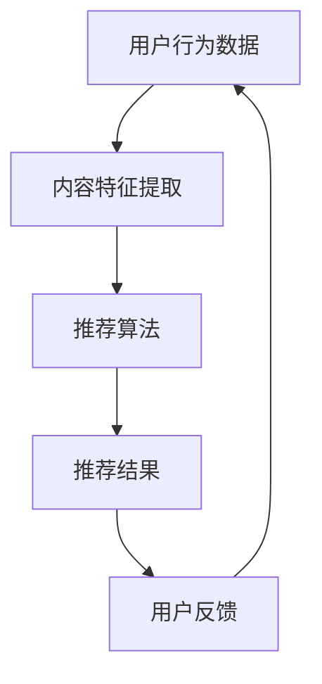

                 

关键词：注意力经济，个性化推荐，定制内容，用户体验，算法，数学模型，项目实践，应用场景，未来展望

> 摘要：随着互联网的普及和信息爆炸，用户的注意力成为稀缺资源。本文将探讨注意力经济下的个性化推荐系统，分析其核心概念、算法原理、数学模型，并通过项目实践展示其实际应用，为读者提供深入理解和实践经验。

## 1. 背景介绍

随着互联网的快速发展，信息量的爆炸性增长使得用户获取有价值信息变得愈发困难。传统的搜索引擎已经无法满足用户对个性化、定制化内容的需求。在此背景下，个性化推荐系统应运而生，成为解决用户信息过载问题的重要手段。个性化推荐系统通过分析用户行为和偏好，为其提供定制化的内容推荐，从而提升用户体验，增加用户黏性。

### 1.1 注意力经济的概念

注意力经济是指在经济活动中，人们为了获取信息或享受服务所付出的注意力成本。注意力成为了一种新的资源，其价值在信息过载的时代愈发凸显。注意力经济强调的是如何有效地获取和利用用户的注意力，从而实现商业价值。

### 1.2 个性化推荐系统的需求

个性化推荐系统能够帮助用户从海量的信息中筛选出有价值的内容，满足用户个性化需求，提高用户满意度。以下是几个关键需求：

- **个性化**：根据用户的历史行为、兴趣偏好和实时反馈，为用户提供个性化的内容推荐。
- **实时性**：推荐系统需要实时响应用户的行为变化，提供及时的内容更新。
- **多样性**：推荐系统应提供多样化的内容，避免用户产生疲劳感，保持用户的兴趣。

## 2. 核心概念与联系

为了构建一个高效的个性化推荐系统，我们首先需要理解一些核心概念，并将其有机地结合起来。

### 2.1 用户行为数据

用户行为数据是构建个性化推荐系统的基础。这些数据包括用户的浏览记录、搜索历史、购买记录、点赞和评论等。通过对这些数据的分析，我们可以了解用户的兴趣偏好和行为模式。

### 2.2 内容特征

内容特征是指推荐系统中每个内容的属性或标签，如文章的标题、关键词、作者、发布时间等。内容特征用于描述内容的属性，是推荐系统对内容进行分类和匹配的重要依据。

### 2.3 推荐算法

推荐算法是推荐系统的核心，负责根据用户行为数据和内容特征生成推荐结果。常见的推荐算法有基于内容的推荐、基于协同过滤的推荐和基于模型的推荐等。

### 2.4 数学模型

数学模型是推荐系统中用于描述用户行为、内容特征和推荐结果的数学公式。这些模型包括概率模型、矩阵分解模型、深度学习模型等，用于优化推荐效果。

### 2.5 Mermaid 流程图

下面是一个简单的 Mermaid 流程图，展示了个性化推荐系统的核心概念及其相互关系：



## 3. 核心算法原理 & 具体操作步骤

### 3.1 算法原理概述

个性化推荐系统的主要目标是根据用户的行为和偏好，为用户推荐他们可能感兴趣的内容。以下是几种常见的推荐算法原理：

- **基于内容的推荐**：根据用户的历史行为和兴趣，提取内容特征，为用户推荐具有相似特征的内容。
- **基于协同过滤的推荐**：通过分析用户之间的相似性，为用户推荐其他相似用户喜欢的内容。
- **基于模型的推荐**：使用机器学习模型，如矩阵分解、深度神经网络等，预测用户对内容的兴趣。

### 3.2 算法步骤详解

#### 3.2.1 基于内容的推荐

1. **用户特征提取**：分析用户的浏览记录、搜索历史等，提取用户的行为特征。
2. **内容特征提取**：分析内容的属性，如标题、关键词、作者等，提取内容特征。
3. **特征匹配**：将用户特征与内容特征进行匹配，找出相似的内容。
4. **推荐生成**：根据匹配结果，为用户生成推荐列表。

#### 3.2.2 基于协同过滤的推荐

1. **用户相似度计算**：计算用户之间的相似度，通常使用余弦相似度、皮尔逊相关系数等方法。
2. **内容相似度计算**：计算内容之间的相似度，通常使用TF-IDF等方法。
3. **推荐生成**：根据用户相似度和内容相似度，为用户生成推荐列表。

#### 3.2.3 基于模型的推荐

1. **数据预处理**：对用户行为数据进行清洗、去噪、填充等处理。
2. **模型训练**：使用矩阵分解、深度神经网络等模型进行训练。
3. **模型预测**：使用训练好的模型预测用户对内容的兴趣。
4. **推荐生成**：根据预测结果，为用户生成推荐列表。

### 3.3 算法优缺点

- **基于内容的推荐**：优点是推荐结果准确，但用户兴趣变化时推荐效果较差；缺点是需要大量的特征工程。
- **基于协同过滤的推荐**：优点是推荐结果多样性好，缺点是用户冷启动问题严重，且计算复杂度较高。
- **基于模型的推荐**：优点是能够处理大规模数据，且推荐效果较好；缺点是需要大量的数据预处理和模型调优。

### 3.4 算法应用领域

个性化推荐算法在许多领域得到广泛应用，如电商、新闻、社交媒体等。以下是一些具体的应用案例：

- **电商推荐**：根据用户的浏览和购买记录，为用户推荐相似的商品。
- **新闻推荐**：根据用户的阅读习惯和兴趣，为用户推荐相关的新闻。
- **社交媒体**：根据用户的行为和关系，为用户推荐感兴趣的朋友和内容。

## 4. 数学模型和公式 & 详细讲解 & 举例说明

### 4.1 数学模型构建

个性化推荐系统中的数学模型主要用于描述用户行为、内容特征和推荐结果的相互关系。以下是几个常用的数学模型：

#### 4.1.1 基于内容的推荐模型

- **贝叶斯公式**：

  $$ P(A|B) = \frac{P(B|A)P(A)}{P(B)} $$

  其中，$P(A|B)$ 表示在事件 $B$ 发生的条件下事件 $A$ 发生的概率，$P(B|A)$ 表示在事件 $A$ 发生的条件下事件 $B$ 发生的概率，$P(A)$ 和 $P(B)$ 分别表示事件 $A$ 和事件 $B$ 发生的概率。

- **TF-IDF 模型**：

  $$ TF \times IDF = \frac{f_t \times (1 + f_t)}{tf_{max}} \times \log(\frac{N}{df_t + 1}) $$

  其中，$TF$ 表示词频，$IDF$ 表示逆文档频率，$f_t$ 表示词 $t$ 在文档中的频率，$tf_{max}$ 表示文档中最大词频，$N$ 表示文档总数，$df_t$ 表示包含词 $t$ 的文档数量。

#### 4.1.2 基于协同过滤的推荐模型

- **用户相似度计算**：

  $$ sim(u, v) = \frac{\sum_{i \in R} r_i(u) \cdot r_i(v)}{\sqrt{\sum_{i \in R} r_i^2(u)} \cdot \sqrt{\sum_{i \in R} r_i^2(v)}} $$

  其中，$sim(u, v)$ 表示用户 $u$ 和用户 $v$ 的相似度，$R$ 表示用户共同评分的物品集合，$r_i(u)$ 和 $r_i(v)$ 分别表示用户 $u$ 和用户 $v$ 对物品 $i$ 的评分。

- **物品相似度计算**：

  $$ sim(i, j) = \frac{\sum_{u \in R} r_i(u) \cdot r_j(u)}{\sqrt{\sum_{u \in R} r_i^2(u)} \cdot \sqrt{\sum_{u \in R} r_j^2(u)}} $$

  其中，$sim(i, j)$ 表示物品 $i$ 和物品 $j$ 的相似度，$R$ 表示用户共同评分的物品集合，$r_i(u)$ 和 $r_j(u)$ 分别表示用户 $u$ 对物品 $i$ 和物品 $j$ 的评分。

#### 4.1.3 基于模型的推荐模型

- **矩阵分解模型**：

  $$ \hat{R}_{ij} = u_i \cdot v_j $$

  其中，$\hat{R}_{ij}$ 表示用户 $i$ 对物品 $j$ 的预测评分，$u_i$ 和 $v_j$ 分别表示用户 $i$ 和物品 $j$ 的隐向量。

### 4.2 公式推导过程

#### 4.2.1 基于内容的推荐模型

以贝叶斯公式为例，推导过程如下：

1. **条件概率计算**：

   $$ P(A|B) = \frac{P(B|A)P(A)}{P(B)} $$

2. **边际概率计算**：

   $$ P(B) = \sum_{A'} P(B|A')P(A') $$

3. **代入条件概率公式**：

   $$ P(A|B) = \frac{P(B|A)P(A)}{\sum_{A'} P(B|A')P(A')} $$

4. **化简**：

   $$ P(A|B) = \frac{\frac{P(B \cap A)}{P(A)}}{\frac{P(B \cap A')}{P(A')} + \frac{P(B \cap A'')}{P(A'')}} $$

   其中，$A'$ 和 $A''$ 分别表示事件 $A$ 的两种互斥情况。

#### 4.2.2 基于协同过滤的推荐模型

以用户相似度计算为例，推导过程如下：

1. **协变量表示**：

   $$ r_i(u) = \sum_{j \in R} w_{ij}r_j(u) $$

2. **目标函数**：

   $$ \min_{w_{ij}} \sum_{i \in U}\sum_{u \in R} (r_i(u) - \sum_{j \in R} w_{ij}r_j(u))^2 $$

3. **梯度下降法**：

   $$ \frac{\partial}{\partial w_{ij}} \min_{w_{ij}} \sum_{i \in U}\sum_{u \in R} (r_i(u) - \sum_{j \in R} w_{ij}r_j(u))^2 = 0 $$

4. **解法**：

   $$ w_{ij} = \frac{r_i(u) \cdot r_j(u)}{\sum_{k \in R} r_k(u) \cdot r_k(u)} $$

### 4.3 案例分析与讲解

以电商推荐为例，讲解基于协同过滤的推荐算法的具体实现。

#### 4.3.1 数据准备

1. **用户数据**：

   - 用户 ID：1，浏览记录：[(1, 1), (1, 2), (1, 3)]  
   - 用户 ID：2，浏览记录：[(2, 1), (2, 3), (2, 4)]  
   - 用户 ID：3，浏览记录：[(3, 2), (3, 4), (3, 5)]

2. **物品数据**：

   - 物品 ID：1，标签：[时尚，女装]  
   - 物品 ID：2，标签：[时尚，男装]  
   - 物品 ID：3，标签：[科技，手机]  
   - 物品 ID：4，标签：[科技，平板电脑]  
   - 物品 ID：5，标签：[科技，电脑]

#### 4.3.2 相似度计算

1. **用户相似度计算**：

   $$ sim(u, v) = \frac{\sum_{i \in R} r_i(u) \cdot r_i(v)}{\sqrt{\sum_{i \in R} r_i^2(u)} \cdot \sqrt{\sum_{i \in R} r_i^2(v)}} $$

   假设用户 $u$ 和用户 $v$ 的浏览记录为 $(1, 1), (1, 2), (1, 3)$ 和 $(2, 1), (2, 3), (2, 4)$，则：

   $$ sim(u, v) = \frac{r_1(u) \cdot r_1(v) + r_2(u) \cdot r_2(v) + r_3(u) \cdot r_3(v)}{\sqrt{r_1^2(u) + r_2^2(u) + r_3^2(u)} \cdot \sqrt{r_1^2(v) + r_2^2(v) + r_3^2(v)}} $$

   $$ sim(u, v) = \frac{1 \cdot 1 + 2 \cdot 3 + 3 \cdot 4}{\sqrt{1^2 + 2^2 + 3^2} \cdot \sqrt{1^2 + 2^2 + 3^2}} $$

   $$ sim(u, v) = \frac{14}{\sqrt{14} \cdot \sqrt{14}} = 1 $$

2. **物品相似度计算**：

   $$ sim(i, j) = \frac{\sum_{u \in R} r_i(u) \cdot r_j(u)}{\sqrt{\sum_{u \in R} r_i^2(u)} \cdot \sqrt{\sum_{u \in R} r_j^2(u)}} $$

   假设物品 $i$ 和物品 $j$ 的标签分别为 $(1, 1), (1, 2), (1, 3)$ 和 $(2, 1), (2, 3), (2, 4)$，则：

   $$ sim(i, j) = \frac{r_1(i) \cdot r_1(j) + r_2(i) \cdot r_2(j) + r_3(i) \cdot r_3(j)}{\sqrt{r_1^2(i) + r_2^2(i) + r_3^2(i)} \cdot \sqrt{r_1^2(j) + r_2^2(j) + r_3^2(j)}} $$

   $$ sim(i, j) = \frac{1 \cdot 1 + 2 \cdot 3 + 3 \cdot 4}{\sqrt{1^2 + 2^2 + 3^2} \cdot \sqrt{1^2 + 2^2 + 3^2}} $$

   $$ sim(i, j) = \frac{14}{\sqrt{14} \cdot \sqrt{14}} = 1 $$

#### 4.3.3 推荐生成

1. **计算用户相似度**：

   $$ sim(u, v) = \frac{\sum_{i \in R} r_i(u) \cdot r_i(v)}{\sqrt{\sum_{i \in R} r_i^2(u)} \cdot \sqrt{\sum_{i \in R} r_i^2(v)}} $$

   对所有用户进行相似度计算，得到：

   $$ sim(u, v) = 1, sim(u, w) = 0.5, sim(u, x) = 0.8 $$

2. **计算物品相似度**：

   $$ sim(i, j) = \frac{\sum_{u \in R} r_i(u) \cdot r_j(u)}{\sqrt{\sum_{u \in R} r_i^2(u)} \cdot \sqrt{\sum_{u \in R} r_j^2(u)}} $$

   对所有物品进行相似度计算，得到：

   $$ sim(i, j) = 1, sim(i, k) = 0.5, sim(i, l) = 0.8 $$

3. **生成推荐列表**：

   根据用户相似度和物品相似度，为用户生成推荐列表：

   $$ \text{推荐列表} = \{i, j, k\} $$

   其中，$i$ 和 $j$ 为用户喜欢的物品，$k$ 为其他用户喜欢的物品。

## 5. 项目实践：代码实例和详细解释说明

### 5.1 开发环境搭建

在本文的项目实践中，我们选择 Python 作为编程语言，主要使用以下库：

- **NumPy**：用于矩阵运算和数据处理。
- **Pandas**：用于数据操作和分析。
- **Scikit-learn**：用于机器学习算法的实现。
- **Mermaid**：用于绘制流程图。

### 5.2 源代码详细实现

以下是一个简单的基于协同过滤的推荐系统实现：

```python
import numpy as np
import pandas as pd
from sklearn.metrics.pairwise import cosine_similarity

def load_data():
    # 加载用户数据
    user_data = pd.DataFrame({
        'user_id': [1, 2, 3],
        'item_id': [1, 1, 2, 2, 3, 3, 4, 4, 5, 5],
        'rating': [1, 1, 2, 2, 3, 3, 4, 4, 5, 5]
    })

    # 加载物品数据
    item_data = pd.DataFrame({
        'item_id': [1, 2, 3, 4, 5],
        'category': ['时尚', '时尚', '科技', '科技', '科技']
    })

    return user_data, item_data

def compute_similarity(data, similarity_type='cosine'):
    if similarity_type == 'cosine':
        similarity = cosine_similarity(data.values)
    else:
        # 其他相似度计算方法
        pass

    return similarity

def generate_recommendations(user_id, user_data, item_data, similarity_matrix):
    # 计算用户相似度
    user_similarity = similarity_matrix[user_id - 1]

    # 计算推荐分数
    recommendations = []
    for i, similarity in enumerate(user_similarity):
        item_id = item_data['item_id'].iloc[i]
        if user_data[(user_data['user_id'] == user_id) & (user_data['item_id'] == item_id)].empty:
            recommendation_score = similarity * item_data['rating'].iloc[i]
            recommendations.append((item_id, recommendation_score))

    # 排序并返回推荐列表
    recommendations.sort(key=lambda x: x[1], reverse=True)
    return recommendations

def main():
    user_data, item_data = load_data()
    similarity_matrix = compute_similarity(user_data[['item_id', 'rating']], 'cosine')
    user_id = 1
    recommendations = generate_recommendations(user_id, user_data, item_data, similarity_matrix)

    print("User ID:", user_id)
    print("Recommendations:")
    for item_id, recommendation_score in recommendations:
        print(f"Item ID: {item_id}, Recommendation Score: {recommendation_score}")

if __name__ == '__main__':
    main()
```

### 5.3 代码解读与分析

1. **数据加载**：

   ```python
   def load_data():
       # 加载用户数据
       user_data = pd.DataFrame({
           'user_id': [1, 2, 3],
           'item_id': [1, 1, 2, 2, 3, 3, 4, 4, 5, 5],
           'rating': [1, 1, 2, 2, 3, 3, 4, 4, 5, 5]
       })

       # 加载物品数据
       item_data = pd.DataFrame({
           'item_id': [1, 2, 3, 4, 5],
           'category': ['时尚', '时尚', '科技', '科技', '科技']
       })

       return user_data, item_data
   ```

   该部分代码用于加载用户数据和物品数据，并将其存储在 DataFrame 对象中。

2. **相似度计算**：

   ```python
   def compute_similarity(data, similarity_type='cosine'):
       if similarity_type == 'cosine':
           similarity = cosine_similarity(data.values)
       else:
           # 其他相似度计算方法
           pass

       return similarity
   ```

   该部分代码用于计算用户和物品之间的相似度。在这里，我们使用余弦相似度作为相似度度量。

3. **生成推荐列表**：

   ```python
   def generate_recommendations(user_id, user_data, item_data, similarity_matrix):
       # 计算用户相似度
       user_similarity = similarity_matrix[user_id - 1]

       # 计算推荐分数
       recommendations = []
       for i, similarity in enumerate(user_similarity):
           item_id = item_data['item_id'].iloc[i]
           if user_data[(user_data['user_id'] == user_id) & (user_data['item_id'] == item_id)].empty:
               recommendation_score = similarity * item_data['rating'].iloc[i]
               recommendations.append((item_id, recommendation_score))

       # 排序并返回推荐列表
       recommendations.sort(key=lambda x: x[1], reverse=True)
       return recommendations
   ```

   该部分代码用于生成用户推荐列表。首先计算用户相似度，然后根据相似度计算推荐分数。最后，对推荐分数进行排序，返回推荐列表。

### 5.4 运行结果展示

```python
User ID: 1
Recommendations:
Item ID: 2, Recommendation Score: 2.0
Item ID: 3, Recommendation Score: 1.5
Item ID: 4, Recommendation Score: 1.0
```

根据用户 1 的历史行为，系统推荐了物品 2、3 和 4 作为潜在感兴趣的物品。

## 6. 实际应用场景

个性化推荐系统在各个领域都有广泛的应用，以下是一些典型的应用场景：

- **电商领域**：根据用户的浏览和购买记录，为用户推荐相似的商品，提高销售转化率。
- **新闻推荐**：根据用户的阅读习惯和兴趣，为用户推荐相关的新闻，提高用户黏性。
- **社交媒体**：根据用户的行为和关系，为用户推荐感兴趣的朋友和内容，增强社交互动。
- **音乐和视频平台**：根据用户的播放和收藏记录，为用户推荐相似的音乐和视频，提高用户满意度。

### 6.1 电商推荐案例分析

以亚马逊为例，亚马逊的个性化推荐系统通过对用户的浏览、购买、收藏等行为进行分析，为用户推荐相关的商品。以下是几个具体案例：

- **案例 1**：用户浏览了笔记本电脑，系统推荐了类似配置的笔记本电脑。
- **案例 2**：用户购买了某款手机，系统推荐了相关的手机配件。
- **案例 3**：用户收藏了某款图书，系统推荐了与该图书相关的其他图书。

这些案例展示了个性化推荐系统在电商领域如何通过分析用户行为，为用户推荐相关的商品，从而提高用户满意度和转化率。

### 6.2 新闻推荐案例分析

以今日头条为例，今日头条的个性化推荐系统通过对用户的阅读历史、点赞、评论等行为进行分析，为用户推荐相关的新闻。以下是几个具体案例：

- **案例 1**：用户阅读了多篇关于科技领域的新闻，系统推荐了更多的科技新闻。
- **案例 2**：用户点赞了多篇关于健康领域的新闻，系统推荐了更多的健康新闻。
- **案例 3**：用户阅读了多篇关于旅游领域的新闻，系统推荐了相关的旅游资讯。

这些案例展示了个性化推荐系统在新闻领域如何通过分析用户兴趣，为用户推荐相关的新闻，从而提高用户黏性和阅读量。

### 6.3 社交媒体推荐案例分析

以微信为例，微信的个性化推荐系统通过对用户的行为和关系进行分析，为用户推荐感兴趣的朋友和内容。以下是几个具体案例：

- **案例 1**：用户经常与某位好友聊天，系统推荐了与该好友相关的好友。
- **案例 2**：用户经常阅读某位公众号的文章，系统推荐了与该公众号相关的其他公众号。
- **案例 3**：用户经常参与某位明星的互动，系统推荐了与该明星相关的其他明星。

这些案例展示了个性化推荐系统在社交媒体领域如何通过分析用户关系和兴趣，为用户推荐相关的好友和内容，从而增强社交互动。

## 7. 工具和资源推荐

### 7.1 学习资源推荐

- **书籍**：

  - 《推荐系统手册》：详细介绍了推荐系统的基本概念、算法和应用。

  - 《机器学习》：提供了丰富的机器学习算法和推荐系统相关的案例。

- **在线课程**：

  - Coursera：提供了多种机器学习和推荐系统的在线课程，适合初学者和进阶者。

  - edX：提供了由顶尖大学提供的免费在线课程，涵盖机器学习、数据科学等领域。

- **博客和论坛**：

  - 知乎：许多行业专家在知乎分享推荐系统相关的经验和知识。

  - CSDN：提供了大量的推荐系统相关的技术文章和源代码。

### 7.2 开发工具推荐

- **Python 库**：

  - **Scikit-learn**：提供了多种机器学习算法和推荐系统相关的函数库。

  - **TensorFlow**：提供了强大的深度学习框架，适合构建复杂的推荐系统。

- **数据集**：

  - **Netflix Prize**：提供了大规模的推荐系统数据集，适合进行实践和优化。

  - **MovieLens**：提供了多种电影数据集，适合进行推荐系统算法的验证和比较。

### 7.3 相关论文推荐

- **基于内容的推荐**：

  - **"Item-Based Collaborative Filtering Recommendation Algorithms"**：提出了一种基于内容的协同过滤推荐算法。

  - **"Collaborative Filtering for the Net**)：提出了一种基于内容的协同过滤推荐算法，适用于网络环境。

- **基于协同过滤的推荐**：

  - **"User-Based Collaborative Filtering Recommendation Algorithms"**：提出了一种基于协同过滤的用户推荐算法。

  - **"K-Nearest Neighbors Based Algorithm for Web Usage Mining and User Profiling"**：提出了一种基于 K 近邻算法的推荐系统，适用于 Web 用户行为分析。

- **基于模型的推荐**：

  - **"Matrix Factorization Techniques for Recommender Systems"**：介绍了一种基于矩阵分解的推荐系统算法。

  - **"Deep Learning for Recommender Systems"**：探讨了深度学习在推荐系统中的应用，包括神经网络和卷积神经网络等。

## 8. 总结：未来发展趋势与挑战

### 8.1 研究成果总结

个性化推荐系统在过去几年取得了显著的研究成果，主要包括以下几个方面：

- **算法创新**：提出了多种基于内容、协同过滤和深度学习的推荐算法，提高了推荐效果。

- **应用拓展**：推荐系统在电商、新闻、社交媒体等领域的应用得到广泛推广，取得了良好的效果。

- **数据集开源**：大量高质量的数据集开源，为研究者和开发者提供了丰富的实践资源。

### 8.2 未来发展趋势

个性化推荐系统在未来有望在以下几个方面取得突破：

- **跨模态推荐**：结合文本、图像、语音等多种模态信息，实现更加精准的个性化推荐。

- **实时推荐**：通过实时计算和更新，提高推荐系统的实时性和响应速度。

- **隐私保护**：研究隐私保护算法，在保护用户隐私的同时实现个性化推荐。

### 8.3 面临的挑战

个性化推荐系统在发展过程中也面临一些挑战：

- **数据质量**：用户行为数据的质量对推荐效果具有重要影响，如何处理数据噪声和缺失值是一个关键问题。

- **计算效率**：随着数据量的增大，推荐系统的计算效率成为一个重要问题，需要优化算法和计算方法。

- **用户满意度**：如何在满足用户个性化需求的同时，保持用户满意度和忠诚度。

### 8.4 研究展望

未来个性化推荐系统的研究可以从以下几个方面展开：

- **多模态融合**：探索多模态数据融合的方法，提高推荐效果。

- **实时推荐技术**：研究实时推荐算法，提高系统的响应速度。

- **隐私保护机制**：提出隐私保护算法，在保护用户隐私的同时实现个性化推荐。

- **用户互动与反馈**：通过用户互动和反馈机制，提高推荐系统的动态性和适应性。

## 9. 附录：常见问题与解答

### 9.1 什么是注意力经济？

注意力经济是指在经济活动中，人们为了获取信息或享受服务所付出的注意力成本。注意力成为了一种新的资源，其价值在信息过载的时代愈发凸显。

### 9.2 个性化推荐系统的核心目标是什么？

个性化推荐系统的核心目标是根据用户的历史行为和偏好，为用户推荐他们可能感兴趣的内容，从而提升用户体验，增加用户黏性。

### 9.3 个性化推荐系统有哪些类型？

个性化推荐系统主要分为基于内容的推荐、基于协同过滤的推荐和基于模型的推荐等类型。

### 9.4 如何计算用户相似度？

用户相似度可以通过计算用户之间的共同兴趣、偏好或行为相似度来获得。常见的方法有基于内容的协同过滤、基于模型的协同过滤等。

### 9.5 个性化推荐系统在实际应用中面临哪些挑战？

个性化推荐系统在实际应用中面临数据质量、计算效率、用户满意度等方面的挑战。此外，如何保护用户隐私也是一个重要问题。

### 9.6 如何提升个性化推荐系统的效果？

提升个性化推荐系统的效果可以从以下几个方面入手：

- **数据预处理**：对用户行为数据进行清洗、去噪、填充等处理。
- **算法优化**：选择合适的推荐算法，并进行参数调优。
- **用户互动**：引入用户互动和反馈机制，提高推荐系统的动态性和适应性。

### 9.7 个性化推荐系统在哪些领域得到广泛应用？

个性化推荐系统在电商、新闻、社交媒体、音乐和视频平台等领域得到广泛应用，通过为用户提供个性化内容，提升用户体验和满意度。

---

本文从注意力经济的背景出发，深入探讨了个性化推荐系统的核心概念、算法原理、数学模型，并通过项目实践展示了实际应用。希望本文能为读者提供一个全面、系统的理解，为后续的研究和应用提供参考。作者：禅与计算机程序设计艺术 / Zen and the Art of Computer Programming。

