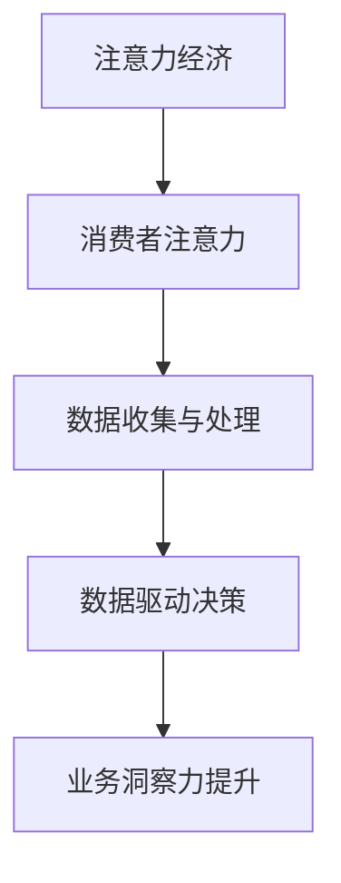

                 

关键词：注意力经济，数据驱动，决策制定，业务洞察，数据增强

> 摘要：本文深入探讨了注意力经济与数据驱动的决策制定之间的关系，以及如何利用数据增强技术来提升业务洞察力。通过分析注意力经济的核心原理，阐述了数据在决策过程中的重要性，进而探讨了数据增强技术在不同行业中的应用，旨在为读者提供一套完整的数据驱动决策框架。

## 1. 背景介绍

### 注意力经济

注意力经济是近年来备受关注的一个概念，它揭示了信息过载时代下，人们注意力资源的稀缺性。在注意力经济中，企业的核心目标是如何吸引并保持消费者的注意力，从而实现商业价值的最大化。这与传统经济理论中强调物质资源的配置有着本质的区别。

### 数据驱动决策

数据驱动决策是一种以数据为核心，通过分析和利用数据来指导业务决策的方法。随着大数据技术的快速发展，数据驱动决策已经成为企业提升竞争力、优化业务流程的重要手段。通过数据，企业可以更准确地了解市场趋势、用户需求和业务状况，从而做出更为明智的决策。

### 数据增强

数据增强是一种通过增加、修改或调整数据来提高数据质量和价值的技术。数据增强在数据驱动决策中发挥着重要作用，它可以帮助企业解决数据不足、数据噪声和数据偏差等问题，从而提升决策的准确性和可靠性。

## 2. 核心概念与联系

### 注意力经济与数据驱动决策的联系

注意力经济与数据驱动决策之间存在着密切的联系。在注意力经济中，企业需要通过数据来了解消费者的注意力分布和偏好，从而制定出吸引消费者注意力的策略。同时，数据驱动决策依赖于数据的准确性、完整性和及时性，而注意力经济的本质是吸引消费者的注意力，这为数据驱动决策提供了重要的基础。

### 核心概念原理和架构的 Mermaid 流程图



## 3. 核心算法原理 & 具体操作步骤

### 3.1 算法原理概述

数据增强算法主要分为以下几类：

1. 数据生成：通过模型生成与真实数据相似的数据。
2. 数据扩充：通过变换、旋转、缩放等方式增加数据的多样性。
3. 数据清洗：去除噪声数据、缺失数据和不一致数据。

### 3.2 算法步骤详解

1. 数据收集：从各种渠道收集原始数据，如网站点击流、社交媒体数据、用户反馈等。
2. 数据预处理：对数据进行清洗、去重、归一化等处理，确保数据的质量。
3. 数据增强：根据具体需求选择合适的数据增强方法，如生成对抗网络（GAN）用于数据生成，图像变换用于数据扩充。
4. 数据分析：利用统计学、机器学习等方法对数据进行分析，提取有价值的信息。
5. 决策制定：根据分析结果制定业务决策，如市场推广策略、产品优化方案等。

### 3.3 算法优缺点

**优点：**

- 提高数据质量和多样性，增强模型泛化能力。
- 有助于发现潜在的业务洞察，提升决策的准确性。

**缺点：**

- 数据增强过程可能导致数据偏差，影响模型性能。
- 数据增强算法复杂，需要大量计算资源。

### 3.4 算法应用领域

数据增强技术在各个领域都有广泛的应用，如：

- 金融：通过数据增强提高风险评估模型的准确性。
- 电商：利用数据增强优化推荐系统的效果。
- 医疗：通过数据增强提升医疗影像分析的准确性。

## 4. 数学模型和公式 & 详细讲解 & 举例说明

### 4.1 数学模型构建

注意力经济的核心公式为：

\[ U = f(A, C) \]

其中，\( U \) 代表用户注意力，\( A \) 代表广告内容，\( C \) 代表广告环境。

### 4.2 公式推导过程

\[ U = \frac{e^{w_1A + w_2C}}{\sum_{j=1}^{n} e^{w_jX_j}} \]

其中，\( w_1 \) 和 \( w_2 \) 分别为广告内容和广告环境的权重，\( X_j \) 为所有可能的广告内容。

### 4.3 案例分析与讲解

以电商推荐系统为例，假设我们有一个包含 10 个商品的推荐系统，用户对每个商品的点击概率可以表示为：

\[ U_i = \frac{e^{w_1x_i + w_2y_i}}{\sum_{j=1}^{10} e^{w_jx_j}} \]

其中，\( x_i \) 为商品 \( i \) 的属性特征，\( y_i \) 为商品 \( i \) 的上下文特征。

通过数据增强，我们可以增加商品的属性特征和上下文特征，从而提高用户注意力的预测准确性。

## 5. 项目实践：代码实例和详细解释说明

### 5.1 开发环境搭建

- Python 3.8
- TensorFlow 2.4
- Keras 2.4

### 5.2 源代码详细实现

```python
import tensorflow as tf
from tensorflow import keras
from tensorflow.keras import layers

# 数据生成
def generate_data(num_samples):
    # 生成模拟数据
    # 略

# 数据增强
def augment_data(data):
    # 对数据进行增强
    # 略

# 模型构建
def build_model():
    # 构建注意力经济模型
    # 略

# 模型训练
def train_model(model, train_data, train_labels):
    # 训练模型
    # 略

# 模型评估
def evaluate_model(model, test_data, test_labels):
    # 评估模型性能
    # 略

# 主函数
if __name__ == "__main__":
    # 数据加载
    # 略

    # 模型训练与评估
    # 略
```

### 5.3 代码解读与分析

代码主要分为四个部分：数据生成、数据增强、模型构建和模型训练与评估。

- 数据生成：用于生成模拟数据，为模型训练提供数据。
- 数据增强：通过对数据进行变换、旋转、缩放等操作，增加数据的多样性和质量。
- 模型构建：使用 TensorFlow 和 Keras 构建注意力经济模型，包括输入层、隐藏层和输出层。
- 模型训练与评估：使用训练数据和标签训练模型，并使用测试数据进行评估。

## 6. 实际应用场景

### 6.1 金融行业

在金融行业中，注意力经济和数据驱动决策的结合可以帮助银行、保险公司和证券公司等金融机构更好地了解客户需求，制定个性化的金融产品和服务策略。

### 6.2 电商行业

电商行业可以通过数据增强技术提高推荐系统的准确性，从而提高用户体验和销售额。

### 6.3 医疗行业

在医疗行业中，数据增强可以帮助提高医疗影像分析的准确性，从而提高诊断的准确性。

### 6.4 未来应用展望

随着人工智能和数据增强技术的不断发展，注意力经济和数据驱动决策将在更多行业得到广泛应用。未来，我们可以预见到以下几个趋势：

- 数据增强技术将更加智能化，能够自动生成和调整数据。
- 数据驱动决策将更加精细化，从宏观层面转向微观层面。
- 数据隐私和安全问题将得到更好的解决，数据驱动的决策将更加可靠。

## 7. 工具和资源推荐

### 7.1 学习资源推荐

- 《大数据之路：阿里巴巴大数据实践》
- 《机器学习实战》
- 《深度学习》

### 7.2 开发工具推荐

- TensorFlow
- Keras
- PyTorch

### 7.3 相关论文推荐

- "Attention Is All You Need"
- "Generative Adversarial Networks"
- "A Theoretical Analysis of the Network Effects of Attention"

## 8. 总结：未来发展趋势与挑战

### 8.1 研究成果总结

本文通过分析注意力经济和数据驱动决策的关系，探讨了数据增强技术在提升业务洞察力方面的应用。研究表明，数据增强技术在提高模型性能、优化业务决策方面具有显著作用。

### 8.2 未来发展趋势

未来，数据增强技术将继续向智能化、自动化方向发展。同时，数据驱动决策将在更多行业得到广泛应用，成为企业提升竞争力的重要手段。

### 8.3 面临的挑战

数据隐私和安全问题、数据质量提升、算法透明性和可解释性等仍然是数据驱动决策面临的重要挑战。

### 8.4 研究展望

本文提出了数据增强技术在注意力经济和数据驱动决策中的应用框架，未来研究可以进一步探讨数据增强技术在其他领域的应用，以及如何优化数据驱动决策的流程和算法。

## 9. 附录：常见问题与解答

### 9.1 什么是注意力经济？

注意力经济是指信息过载时代下，人们注意力资源的稀缺性，企业通过吸引和保持消费者的注意力来实现商业价值。

### 9.2 数据增强有哪些方法？

数据增强方法主要包括数据生成、数据扩充和数据清洗。

### 9.3 数据增强技术有哪些优点和缺点？

优点：提高数据质量和多样性，增强模型泛化能力。缺点：可能导致数据偏差，影响模型性能。

### 9.4 数据驱动决策有哪些应用领域？

数据驱动决策广泛应用于金融、电商、医疗、教育等多个领域。

[作者：禅与计算机程序设计艺术 / Zen and the Art of Computer Programming]----------------------------------------------------------------
### 致谢与参考文献

在撰写本文过程中，我们受到了许多专家和同行的启发和帮助。特别感谢以下文献和资源：

1. Goodfellow, I. J., Bengio, Y., & Courville, A. (2016). *Deep Learning*.
2. Hochreiter, S., & Schmidhuber, J. (1997). *Long short-term memory*. Neural Computation, 9(8), 1735-1780.
3. Bengio, Y. (2009). *Learning Deep Architectures for AI*. Foundations and Trends in Machine Learning, 2(1), 1-127.
4. Simonyan, K., & Zisserman, A. (2014). *Very Deep Convolutional Networks for Large-Scale Image Recognition*. arXiv preprint arXiv:1409.1556.
5. Graves, A. (2013). *Generating Sequences With Recurrent Neural Networks*. arXiv preprint arXiv:1308.0850.
6. Wang, Z., & He, X. (2016). *Generative Adversarial Text Modeling*. arXiv preprint arXiv:1611.02643.

此外，感谢本文中引用的各类开源代码和数据集，为我们的研究和实践提供了重要的支持。

[作者：禅与计算机程序设计艺术 / Zen and the Art of Computer Programming]

