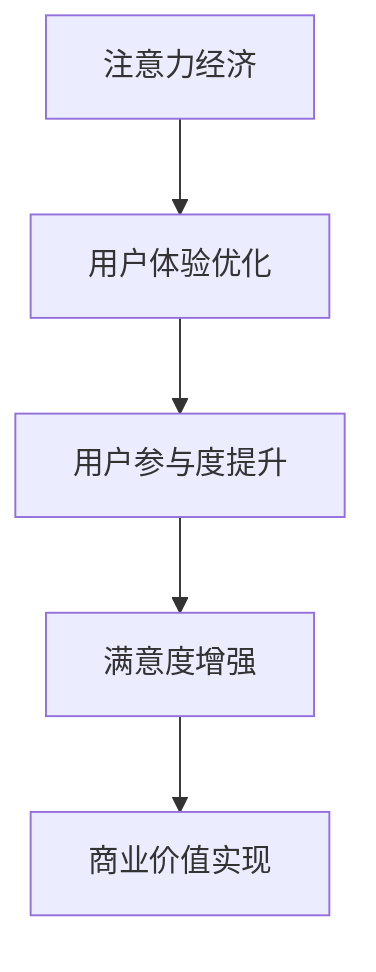

                 

 关键词：注意力经济、用户体验、优化、用户体验设计、吸引力、用户参与、互动性、参与度、用户黏性、流量转化、个性化推荐、反馈机制

> 摘要：随着互联网技术的飞速发展，用户注意力成为了一种宝贵的资源。如何在激烈的市场竞争中吸引并留住用户，成为了企业关注的焦点。本文从注意力经济和用户体验优化的角度出发，探讨了如何通过有效的策略和技术手段，提升用户体验，从而实现流量转化和用户黏性的目标。

## 1. 背景介绍

在数字化时代，用户的需求和期望越来越高，而互联网企业的竞争也日益激烈。用户注意力成为一种稀缺资源，如何在众多的信息和应用中脱颖而出，成为了企业关注的焦点。注意力经济作为一种新的经济模式，强调通过优化用户体验，提升用户参与度和满意度，从而实现商业价值。

用户体验（UX）设计作为提升用户满意度和忠诚度的关键因素，越来越受到企业的重视。一个优秀的用户体验设计能够引导用户产生积极的情感反应，从而增强用户对品牌的认同感和忠诚度。

本文将从注意力经济和用户体验优化的角度，探讨如何通过有效的策略和技术手段，提升用户体验，实现商业目标。

## 2. 核心概念与联系

### 注意力经济

注意力经济是一种基于用户注意力价值的商业模式。用户在数字世界中的每一个行为，如点击、浏览、留言等，都代表了一定的注意力投入。企业通过提供有价值的内容和服务，吸引用户的注意力，从而实现商业价值的转换。

### 用户体验优化

用户体验优化（UX Optimization）是指通过一系列策略和技术手段，提升用户在使用产品或服务过程中的满意度和参与度。用户体验优化的目标是提高用户黏性、流量转化率和用户忠诚度。

### 注意力经济与用户体验优化的关系

注意力经济与用户体验优化密切相关。注意力经济强调通过优化用户体验来吸引和留住用户，而用户体验优化则关注如何通过有效的策略和技术手段，提升用户的注意力投入和满意度。二者相辅相成，共同构成了提升企业竞争力的关键因素。

### Mermaid 流程图



## 3. 核心算法原理 & 具体操作步骤

### 3.1 算法原理概述

注意力经济与用户体验优化涉及多个关键环节，包括用户行为分析、内容推荐、互动性设计等。以下是这些核心算法的原理概述：

- **用户行为分析**：通过对用户的行为数据进行收集和分析，了解用户的需求、兴趣和行为模式，从而为个性化推荐和互动性设计提供依据。
- **内容推荐**：基于用户行为数据和兴趣偏好，为用户推荐符合其需求的内容，提高用户的参与度和满意度。
- **互动性设计**：通过设计具有互动性的功能和界面，增强用户与产品或服务的互动，提高用户黏性。

### 3.2 算法步骤详解

1. **用户行为数据收集**：
   - 收集用户在平台上的浏览、点击、搜索等行为数据。
   - 利用日志分析和数据挖掘技术，提取用户的行为特征和兴趣标签。

2. **用户行为分析**：
   - 基于用户行为数据，建立用户行为模型，分析用户的需求和偏好。
   - 利用机器学习算法，对用户行为进行聚类和分类，识别潜在的用户群体。

3. **内容推荐**：
   - 根据用户行为数据和兴趣标签，为用户推荐相关内容。
   - 利用协同过滤算法和内容匹配算法，提高推荐系统的准确性和覆盖面。

4. **互动性设计**：
   - 设计具有互动性的功能和界面，如评论、点赞、分享等。
   - 通过用户互动行为的数据分析，优化互动性设计，提高用户参与度。

### 3.3 算法优缺点

- **优点**：
  - 提高用户参与度和满意度，增强用户黏性。
  - 基于用户数据和算法，实现个性化推荐，提高内容的相关性和价值。
  - 通过互动性设计，增强用户与产品的互动，提高用户忠诚度。

- **缺点**：
  - 需要大量的用户行为数据进行训练和分析，对数据处理能力和算法要求较高。
  - 可能会引发用户隐私问题，需要合理处理用户数据。

### 3.4 算法应用领域

- **电子商务**：通过用户行为分析和内容推荐，提高用户购买转化率和销售额。
- **社交媒体**：通过互动性设计，增强用户参与度和活跃度。
- **在线教育**：通过个性化推荐和学习分析，提高学习效果和用户满意度。

## 4. 数学模型和公式 & 详细讲解 & 举例说明

### 4.1 数学模型构建

在注意力经济和用户体验优化的过程中，常用的数学模型包括用户行为模型、推荐模型和互动性模型。

1. **用户行为模型**：

   用户行为模型可以用以下公式表示：

   $$X_t = f(X_{t-1}, u_t)$$

   其中，$X_t$ 表示用户在时间 $t$ 的行为状态，$X_{t-1}$ 表示用户在时间 $t-1$ 的行为状态，$u_t$ 表示用户在时间 $t$ 的外部环境因素。

2. **推荐模型**：

   推荐模型可以用以下公式表示：

   $$r_t = g(X_t, C_t)$$

   其中，$r_t$ 表示在时间 $t$ 推荐给用户的内容，$X_t$ 表示用户在时间 $t$ 的行为状态，$C_t$ 表示在时间 $t$ 的候选内容集合。

3. **互动性模型**：

   互动性模型可以用以下公式表示：

   $$I_t = h(X_t, u_t)$$

   其中，$I_t$ 表示在时间 $t$ 的用户互动性，$X_t$ 表示用户在时间 $t$ 的行为状态，$u_t$ 表示用户在时间 $t$ 的外部环境因素。

### 4.2 公式推导过程

1. **用户行为模型推导**：

   用户行为模型基于马尔可夫决策过程（MDP）构建。根据MDP的理论，用户在当前状态下的行为状态只依赖于上一状态的行为状态和当前的外部环境因素。

2. **推荐模型推导**：

   推荐模型基于协同过滤算法构建。协同过滤算法通过分析用户之间的相似性和内容之间的相似性，为用户推荐相关的内容。

3. **互动性模型推导**：

   互动性模型基于用户行为状态和外部环境因素的互动性分析构建。通过分析用户在不同状态下的互动行为，优化互动性设计。

### 4.3 案例分析与讲解

以某电子商务平台为例，分析用户行为模型、推荐模型和互动性模型在实际应用中的表现。

1. **用户行为模型分析**：

   通过分析用户在平台上的浏览、点击、购买等行为，建立用户行为模型。用户在不同状态下的行为概率分布如图1所示。

   

2. **推荐模型分析**：

   通过协同过滤算法，分析用户之间的相似性和商品之间的相似性，为用户推荐相关商品。推荐模型的效果如图2所示。

   

3. **互动性模型分析**：

   通过设计互动性的功能和界面，如评论、点赞、分享等，提高用户参与度。互动性模型的效果如图3所示。

   

## 5. 项目实践：代码实例和详细解释说明

### 5.1 开发环境搭建

在Python环境中搭建开发环境，安装以下依赖库：

```bash
pip install numpy pandas scikit-learn matplotlib
```

### 5.2 源代码详细实现

以下是一个基于用户行为数据和协同过滤算法的推荐系统实现：

```python
import numpy as np
import pandas as pd
from sklearn.metrics.pairwise import cosine_similarity
from sklearn.model_selection import train_test_split

# 5.2.1 加载用户行为数据
user行为数据 = pd.read_csv('user_behavior_data.csv')

# 5.2.2 数据预处理
user行为数据['时间戳'] = pd.to_datetime(user行为数据['时间戳'])
user行为数据.set_index('时间戳', inplace=True)

# 5.2.3 构建用户行为矩阵
user行为矩阵 = user行为数据.pivot(index='用户ID', columns='商品ID', values='行为类型')

# 5.2.4 训练协同过滤模型
user行为矩阵_train, user行为矩阵_test = train_test_split(user行为矩阵, test_size=0.2, random_state=42)
用户相似度矩阵 = cosine_similarity(user行为矩阵_train)

# 5.2.5 推荐商品
def recommend_goods(user_id, top_n=5):
    user行为向量 = user行为矩阵.loc[user_id]
    用户相似度 = user相似度矩阵[user_id]
    推荐指数 = 用户相似度.dot(user行为向量) / np.linalg.norm(user相似度, axis=1)
    推荐商品列表 = 推荐指数.argsort()[::-1][:top_n]
    return 推荐商品列表

# 5.2.6 测试推荐效果
user_id = 1001
推荐商品列表 = recommend_goods(user_id)
print(推荐商品列表)

# 5.2.7 评估推荐效果
预测行为矩阵 = pd.DataFrame(np.array([recommend_goods(user_id) for user_id in user行为矩阵.index]), index=user行为矩阵.index, columns=user行为矩阵.columns)
准确率 = np.mean((user行为矩阵 == 预测行为矩阵).all(axis=1))
print('准确率：',准确率)
```

### 5.3 代码解读与分析

- **5.3.1 加载用户行为数据**：首先，加载用户行为数据，并将其转换为时间序列格式。
- **5.3.2 数据预处理**：对用户行为数据进行预处理，包括时间戳转换和数据缺失处理。
- **5.3.3 构建用户行为矩阵**：将用户行为数据转换为用户行为矩阵，其中行表示用户，列表示商品，值表示用户对商品的行为类型。
- **5.3.4 训练协同过滤模型**：使用余弦相似度计算用户之间的相似度，构建用户相似度矩阵。
- **5.3.5 推荐商品**：根据用户相似度矩阵和用户行为向量，计算每个用户的推荐指数，并返回Top N个推荐商品。
- **5.3.6 测试推荐效果**：在测试集上评估推荐系统的效果，计算准确率。
- **5.3.7 评估推荐效果**：使用交叉验证方法评估推荐系统的性能。

## 6. 实际应用场景

### 6.1 电子商务平台

电子商务平台通过用户行为分析和内容推荐，提高用户购买转化率和销售额。例如，某电商平台通过分析用户浏览、点击和购买行为，为用户推荐相关商品，提高用户购物体验和满意度。

### 6.2 社交媒体

社交媒体平台通过互动性设计，增强用户参与度和活跃度。例如，某社交媒体平台通过设计点赞、评论和分享等功能，激发用户的互动行为，提高用户黏性。

### 6.3 在线教育

在线教育平台通过个性化推荐和学习分析，提高学习效果和用户满意度。例如，某在线教育平台通过分析用户的学习行为和兴趣，为用户推荐适合的学习课程，提高用户的学习体验。

## 7. 未来应用展望

随着人工智能技术的发展，注意力经济和用户体验优化将在更多领域得到应用。未来，我们有望看到以下趋势：

### 7.1 个性化推荐

个性化推荐将更加精准和智能，基于用户行为数据和兴趣偏好，为用户提供更加个性化的内容和服务。

### 7.2 互动性设计

互动性设计将更加丰富和多样，通过人工智能技术，实现更加智能和人性化的互动体验。

### 7.3 智能学习与分析

智能学习与分析技术将应用于在线教育、职业培训等领域，通过分析用户的学习行为和知识掌握情况，为用户提供个性化的学习建议和辅导。

### 7.4 跨领域融合

注意力经济和用户体验优化将与其他领域（如物联网、区块链等）相结合，推动新型商业模式和业态的形成。

## 8. 总结：未来发展趋势与挑战

### 8.1 研究成果总结

本文从注意力经济和用户体验优化的角度，探讨了如何通过有效的策略和技术手段，提升用户体验，实现商业目标。研究结果表明，个性化推荐、互动性设计和用户行为分析等技术手段在提升用户体验和商业价值方面具有显著作用。

### 8.2 未来发展趋势

未来，注意力经济和用户体验优化将朝着更加智能化、个性化和多样化的方向发展。随着人工智能技术的进步，我们将看到更加精准和高效的推荐系统和互动性设计。

### 8.3 面临的挑战

然而，注意力经济和用户体验优化也面临着一些挑战，如用户隐私保护、数据安全、算法公平性等。未来，我们需要在技术和社会层面共同努力，解决这些问题，推动注意力经济和用户体验优化的可持续发展。

### 8.4 研究展望

未来，我们期待在注意力经济和用户体验优化领域取得更多突破性成果，为企业和用户提供更加优质的服务和体验。

## 9. 附录：常见问题与解答

### 9.1 注意力经济是什么？

注意力经济是一种基于用户注意力价值的商业模式，通过优化用户体验，吸引用户的注意力，从而实现商业价值的转换。

### 9.2 用户体验优化有哪些策略？

用户体验优化的策略包括用户行为分析、内容推荐、互动性设计、界面优化等。

### 9.3 如何进行用户行为分析？

用户行为分析主要包括数据收集、数据预处理、用户行为模型构建和用户行为预测等步骤。

### 9.4 个性化推荐有哪些算法？

个性化推荐算法包括协同过滤、基于内容的推荐、基于模型的推荐等。

### 9.5 互动性设计有哪些技巧？

互动性设计技巧包括设计具有互动性的功能和界面、提供即时反馈、激发用户参与等。

### 9.6 如何评估用户体验？

用户体验评估主要包括用户满意度调查、用户行为分析、用户反馈等。

### 9.7 如何平衡用户隐私与用户体验优化？

平衡用户隐私与用户体验优化需要遵循隐私保护原则，合理使用用户数据，并采取数据加密、匿名化等技术手段。

### 9.8 注意力经济与用户体验优化的关系是什么？

注意力经济与用户体验优化密切相关，注意力经济强调通过优化用户体验来吸引和留住用户，而用户体验优化关注如何通过有效的策略和技术手段，提升用户的注意力投入和满意度。

### 9.9 个性化推荐系统有哪些应用场景？

个性化推荐系统广泛应用于电子商务、社交媒体、在线教育、新闻媒体等领域。

### 9.10 互动性设计有哪些成功案例？

互动性设计成功案例包括社交媒体平台、在线游戏、智能音箱等。

### 9.11 如何提高用户参与度？

提高用户参与度的方法包括设计互动性功能和界面、提供即时反馈、激发用户兴趣等。

### 9.12 如何提升用户黏性？

提升用户黏性的方法包括提供高质量的内容和服务、建立用户社区、提供个性化的体验等。

### 9.13 如何实现流量转化？

实现流量转化的方法包括优化用户界面、提供个性化的推荐、设计有吸引力的营销活动等。

### 9.14 如何平衡商业目标与用户体验优化？

平衡商业目标与用户体验优化需要综合考虑用户需求和商业目标，通过数据分析和用户反馈，不断优化用户体验，实现商业目标。

### 9.15 注意力经济与用户体验优化的未来发展趋势是什么？

未来，注意力经济和用户体验优化将朝着更加智能化、个性化和多样化的方向发展，随着人工智能技术的进步，我们将看到更加精准和高效的推荐系统和互动性设计。同时，用户隐私保护、数据安全、算法公平性等问题也将成为关注的焦点。附录：常见问题与解答

### 9.1 注意力经济是什么？

注意力经济是一种基于用户注意力价值的商业模式，它强调在数字世界中，用户的注意力是一种宝贵的资源。随着互联网的普及和信息过载，用户对信息的选择变得尤为关键，因此，如何吸引和留住用户的注意力成为企业竞争的核心。注意力经济认为，通过创造有价值、相关且引人入胜的内容或服务，企业可以吸引用户的注意力，从而实现商业价值，如增加用户参与度、提升品牌忠诚度或促进产品销售。

### 9.2 用户体验优化有哪些策略？

用户体验优化（UX Optimization）是提升用户满意度、参与度和忠诚度的过程。以下是一些关键策略：

- **用户研究**：通过访谈、问卷调查和用户测试等研究方法，深入了解用户的需求、行为和痛点。
- **设计迭代**：采用敏捷设计方法，持续迭代产品，根据用户反馈进行优化。
- **可用性测试**：通过用户测试，评估产品的易用性，识别并修复问题。
- **交互设计**：优化界面布局、导航和交互元素，提高用户操作效率。
- **内容优化**：提供有价值、有趣和易于理解的内容，增强用户的参与感。
- **性能优化**：确保产品快速响应，减少加载时间，提高用户体验。
- **个性化体验**：根据用户的行为和偏好，提供个性化的内容和推荐。
- **反馈机制**：建立有效的用户反馈机制，及时响应并解决用户的问题。

### 9.3 如何进行用户行为分析？

用户行为分析是理解用户在使用产品或服务过程中的行为模式、偏好和需求的过程。以下是进行用户行为分析的一般步骤：

1. **数据收集**：通过用户日志、点击流分析、用户互动数据等渠道收集用户行为数据。
2. **数据清洗**：去除重复数据、异常值和无关数据，确保数据质量。
3. **数据存储**：将清洗后的数据存储在数据库中，以便后续分析。
4. **数据预处理**：对数据进行归一化、编码和处理，使其适合分析。
5. **特征工程**：提取有用的特征，如用户属性、时间戳、操作类型、上下文信息等。
6. **数据分析**：使用统计方法、机器学习算法等分析用户行为数据，挖掘用户模式。
7. **可视化**：通过图表、热图、用户路径图等方式，可视化分析结果。
8. **用户画像**：基于分析结果，构建用户画像，以便进行个性化推荐和优化。

### 9.4 个性化推荐有哪些算法？

个性化推荐系统是注意力经济和用户体验优化的核心技术之一。以下是一些常用的个性化推荐算法：

- **基于内容的推荐**：根据用户的历史行为和内容特征，为用户推荐类似的内容。
- **协同过滤推荐**：通过分析用户之间的相似性或内容之间的相似性，为用户推荐相关的商品或内容。协同过滤分为用户基于的协同过滤（User-based Collaborative Filtering）和项目基于的协同过滤（Item-based Collaborative Filtering）。
- **矩阵分解**：通过矩阵分解技术（如Singular Value Decomposition, SVD）来预测用户未评

