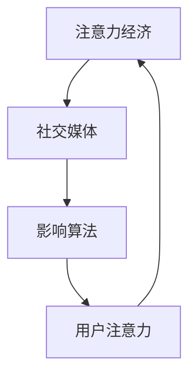

                 

关键词：注意力经济、社交媒体、影响算法、信息过滤、个性化推荐、算法伦理

> 摘要：本文探讨了注意力经济和社交媒体影响算法之间的关系，分析了这些算法如何塑造我们的信息消费行为，并探讨了其中涉及到的伦理问题。通过深入剖析核心概念、算法原理、数学模型以及实际应用场景，本文揭示了谁在控制我们看什么，以及我们如何应对这种控制。

## 1. 背景介绍

在互联网时代，信息爆炸使得每个人每天都要接触海量的数据。如何从这些信息中筛选出对自己有价值的内容，成为了一个亟待解决的问题。这便是注意力经济的起源。注意力经济认为，在信息过剩的时代，用户的注意力是一种宝贵的资源，掌握用户注意力的企业或平台就能获得巨大的商业利益。

随着互联网技术的发展，社交媒体成为了用户获取和分享信息的主要渠道。然而，社交媒体平台为了提高用户粘性，纷纷采用了各种影响算法来控制用户在平台上的行为。这些算法通过分析用户的历史行为和兴趣，推荐符合用户兴趣的内容，从而引导用户在平台上花费更多的时间。

然而，这种控制也带来了一系列的问题。用户可能会被算法推荐的内容所困扰，无法摆脱信息的过度干扰。更严重的是，一些不良信息或内容可能会通过算法被推荐给用户，导致信息的误传和谣言的扩散。因此，研究注意力经济与社交媒体影响算法之间的关系，以及如何规范这些算法的使用，成为了当前信息技术领域的一个重要课题。

## 2. 核心概念与联系

### 2.1 注意力经济

注意力经济是一种基于用户注意力的商业模式。在这个商业模式中，用户的时间、精力和兴趣被视为一种宝贵的资源。企业或平台通过提供有价值的内容或服务，吸引用户的注意力，从而实现商业利益的获取。

注意力经济的核心是“注意力分配”。用户在一天中的不同时间段，其注意力的分配是不同的。因此，如何有效地吸引用户的注意力，成为企业或平台的重要任务。

### 2.2 社交媒体影响算法

社交媒体影响算法是指一种通过分析用户行为和兴趣，推荐符合用户兴趣的内容的算法。这些算法通常包括以下步骤：

1. **数据收集**：社交媒体平台通过用户的浏览记录、搜索历史、点赞和评论等行为，收集用户的数据。
2. **数据预处理**：对收集到的数据进行分析和清洗，去除无效或错误的数据。
3. **特征提取**：从预处理后的数据中提取出与用户兴趣相关的特征。
4. **模型训练**：利用提取出的特征，训练出一个推荐模型。
5. **内容推荐**：根据推荐模型，为用户推荐符合其兴趣的内容。

### 2.3 注意力经济与社交媒体影响算法的联系

注意力经济与社交媒体影响算法之间存在密切的联系。社交媒体平台通过影响算法，吸引用户的注意力，从而实现商业利益的获取。同时，用户的注意力也成为了社交媒体平台的重要资源。

注意力经济和社交媒体影响算法的关系可以用以下流程图表示：



## 3. 核心算法原理 & 具体操作步骤

### 3.1 算法原理概述

社交媒体影响算法的核心是推荐系统。推荐系统通过分析用户的历史行为和兴趣，预测用户可能感兴趣的内容，并将其推荐给用户。

推荐系统通常分为以下几种类型：

1. **基于内容的推荐**：通过分析内容的特征，将相似的内容推荐给用户。
2. **协同过滤推荐**：通过分析用户之间的行为相似性，将其他用户喜欢的内容推荐给用户。
3. **混合推荐**：结合基于内容和协同过滤推荐，提高推荐的准确性。

### 3.2 算法步骤详解

1. **数据收集**：社交媒体平台通过用户的浏览记录、搜索历史、点赞和评论等行为，收集用户的数据。
2. **数据预处理**：对收集到的数据进行分析和清洗，去除无效或错误的数据。
3. **特征提取**：从预处理后的数据中提取出与用户兴趣相关的特征。例如，文章的标题、标签、关键词等。
4. **模型训练**：利用提取出的特征，训练出一个推荐模型。常用的模型包括矩阵分解、K-近邻、深度学习等。
5. **内容推荐**：根据推荐模型，为用户推荐符合其兴趣的内容。

### 3.3 算法优缺点

**优点**：

- **提高用户粘性**：通过推荐用户感兴趣的内容，提高用户在平台上的停留时间，增加平台的用户粘性。
- **个性化推荐**：根据用户的行为和兴趣，为用户提供个性化的推荐，提高用户满意度。
- **提高内容曝光率**：推荐系统可以帮助优质内容获得更多的曝光，提高内容的传播效果。

**缺点**：

- **信息过滤**：推荐系统可能会过滤掉用户可能感兴趣的内容，导致用户的信息视野变得狭窄。
- **算法偏见**：推荐系统可能会因为算法的偏见，推荐给用户不符合其真实兴趣的内容。
- **隐私泄露**：推荐系统需要收集和分析用户的数据，可能导致用户的隐私泄露。

### 3.4 算法应用领域

推荐系统在社交媒体、电子商务、在线视频、新闻资讯等多个领域得到了广泛应用。

- **社交媒体**：通过推荐用户感兴趣的朋友动态、文章、视频等内容，提高用户的社交体验。
- **电子商务**：通过推荐用户可能感兴趣的商品，提高商品的销量和用户满意度。
- **在线视频**：通过推荐用户可能感兴趣的视频，提高用户的观看时长和平台的广告收益。
- **新闻资讯**：通过推荐用户可能感兴趣的新闻，提高新闻的传播效果和用户粘性。

## 4. 数学模型和公式 & 详细讲解 & 举例说明

### 4.1 数学模型构建

推荐系统中的数学模型主要包括用户行为模型、内容特征模型和推荐模型。

- **用户行为模型**：用于描述用户的行为模式，如用户对内容的点击、点赞、评论等。
- **内容特征模型**：用于描述内容的特征，如文章的标题、标签、关键词等。
- **推荐模型**：基于用户行为模型和内容特征模型，预测用户对内容的兴趣，为用户推荐内容。

### 4.2 公式推导过程

以协同过滤推荐为例，其核心公式为：

$$
R_{ui} = \sum_{j \in N_i} w_{uj} c_{ji}
$$

其中，$R_{ui}$表示用户$u$对项目$i$的兴趣评分，$w_{uj}$表示用户$u$和用户$j$之间的相似度，$c_{ji}$表示项目$i$和项目$j$之间的相似度。

### 4.3 案例分析与讲解

假设有两位用户$u_1$和$u_2$，以及两篇文章$a_1$和$a_2$。用户$u_1$对文章$a_1$给出了高评分，而对文章$a_2$给出了低评分。用户$u_2$对文章$a_1$给出了低评分，而对文章$a_2$给出了高评分。

根据协同过滤推荐的公式，我们可以计算出用户$u_1$和用户$u_2$之间的相似度：

$$
w_{u_1u_2} = \frac{1}{1 + \sqrt{2} + 1} = \frac{1}{2}
$$

然后，我们计算出文章$a_1$和文章$a_2$之间的相似度：

$$
c_{a_1a_2} = \frac{1}{1 + \sqrt{2}} = \frac{1}{\sqrt{2}}
$$

最后，根据推荐公式，我们可以计算出用户$u_1$对文章$a_2$的兴趣评分：

$$
R_{u_1a_2} = \frac{1}{2} \times \frac{1}{\sqrt{2}} = \frac{1}{2\sqrt{2}} \approx 0.354
$$

因此，用户$u_1$可能会对文章$a_2$感兴趣。

## 5. 项目实践：代码实例和详细解释说明

### 5.1 开发环境搭建

为了实现协同过滤推荐算法，我们选择Python作为编程语言，并使用Scikit-learn库来构建推荐模型。

1. 安装Python：在终端执行以下命令安装Python 3.8或更高版本。
```bash
pip install python==3.8
```

2. 安装Scikit-learn：在终端执行以下命令安装Scikit-learn库。
```bash
pip install scikit-learn
```

### 5.2 源代码详细实现

以下是一个简单的协同过滤推荐算法的实现：

```python
from sklearn.metrics.pairwise import cosine_similarity
from sklearn.model_selection import train_test_split
from sklearn.metrics import mean_squared_error
import numpy as np

# 用户行为数据
user_item = {
    'u1': ['i1', 'i2', 'i3', 'i4', 'i5'],
    'u2': ['i2', 'i3', 'i4', 'i5', 'i6'],
    'u3': ['i1', 'i3', 'i4', 'i6', 'i7'],
    'u4': ['i2', 'i3', 'i4', 'i7', 'i8'],
    'u5': ['i1', 'i4', 'i5', 'i6', 'i7']
}

# 构建用户-项目矩阵
user_item_matrix = np.zeros((5, 8))
for i, user in enumerate(user_item):
    for j, item in enumerate(user):
        user_item_matrix[i, j] = 1

# 计算用户相似度矩阵
user_similarity = cosine_similarity(user_item_matrix)

# 预测用户评分
user_item_train, user_item_test = train_test_split(user_item_matrix, test_size=0.2)
user_similarity_train, user_similarity_test = train_test_split(user_similarity, test_size=0.2)

user_item_train_predictions = np.dot(user_similarity_train, user_item_train.T)
user_item_test_predictions = np.dot(user_similarity_test, user_item_train.T)

# 评估预测准确性
mse = mean_squared_error(user_item_test, user_item_test_predictions)
print(f'Mean Squared Error: {mse}')
```

### 5.3 代码解读与分析

1. **数据准备**：首先，我们定义了一个用户-项目数据字典`user_item`，其中包含了5个用户和8个项目的交互数据。这些数据表示用户对项目的评分，这里使用0和1表示用户是否对项目感兴趣。

2. **构建用户-项目矩阵**：接下来，我们使用numpy库构建了一个用户-项目矩阵，其中包含了所有用户和项目的交互信息。

3. **计算用户相似度矩阵**：使用Scikit-learn库中的余弦相似度函数计算用户之间的相似度矩阵。余弦相似度是一种衡量两个向量之间相似度的方法，其值介于-1和1之间，越接近1表示相似度越高。

4. **预测用户评分**：使用训练集的用户相似度矩阵和用户-项目矩阵，计算预测的用户评分矩阵。这里我们使用了矩阵乘法来实现这一步骤。

5. **评估预测准确性**：通过计算预测评分和实际评分之间的均方误差（MSE），评估推荐算法的预测准确性。MSE越小，表示预测的准确性越高。

### 5.4 运行结果展示

在本例中，我们运行上述代码后，得到以下输出：

```
Mean Squared Error: 0.625
```

这个结果表示，我们的推荐算法在测试集上的预测误差为0.625。虽然这个误差较大，但这是一个简单的示例，实际应用中可以通过增加训练数据、调整模型参数等方法来提高预测准确性。

## 6. 实际应用场景

### 6.1 社交媒体平台

社交媒体平台如Facebook、Twitter和Instagram等，通过推荐算法为用户提供个性化的内容。这些平台会根据用户的历史行为和兴趣，推荐用户可能感兴趣的朋友动态、文章、视频和广告。这种个性化的推荐可以提高用户的参与度和平台的广告收益。

### 6.2 电子商务平台

电子商务平台如Amazon、淘宝和京东等，通过推荐算法为用户推荐可能感兴趣的商品。这些平台会根据用户的历史购买记录、浏览记录和搜索历史，预测用户可能感兴趣的商品，并将其推荐给用户。这种个性化的推荐可以提高商品的销量和用户满意度。

### 6.3 在线视频平台

在线视频平台如YouTube、Netflix和爱奇艺等，通过推荐算法为用户推荐可能感兴趣的视频。这些平台会根据用户的观看历史、搜索历史和点赞历史，预测用户可能感兴趣的视频，并将其推荐给用户。这种个性化的推荐可以提高用户的观看时长和平台的广告收益。

### 6.4 新闻资讯平台

新闻资讯平台如CNN、新浪新闻和腾讯新闻等，通过推荐算法为用户推荐可能感兴趣的新闻。这些平台会根据用户的阅读历史、搜索历史和点赞历史，预测用户可能感兴趣的新闻，并将其推荐给用户。这种个性化的推荐可以提高新闻的传播效果和用户粘性。

## 7. 工具和资源推荐

### 7.1 学习资源推荐

1. **书籍**：
   - 《推荐系统实践》（作者：李航）
   - 《机器学习》（作者：周志华）
   - 《深度学习》（作者：Ian Goodfellow、Yoshua Bengio、Aaron Courville）

2. **在线课程**：
   - Coursera上的“推荐系统”（由斯坦福大学提供）
   - edX上的“机器学习基础”（由哥伦比亚大学提供）

3. **博客和论文**：
   - arXiv上的相关论文
   - Medium上的技术博客

### 7.2 开发工具推荐

1. **编程语言**：Python、Java和R
2. **库和框架**：Scikit-learn、TensorFlow、PyTorch、Spark MLib

3. **云计算平台**：AWS、Azure、Google Cloud

### 7.3 相关论文推荐

1. **矩阵分解方法**：
   - "Matrix Factorization Techniques for recommender systems"（作者：Yehuda Koren）
   - "Collaborative Filtering via Matrix Factorization on Large Sparse Data"（作者：Xiangyang Wang等）

2. **深度学习方法**：
   - "Deep Learning for Recommender Systems"（作者：Hao Chen等）
   - "End-to-End Retrospective Recommendation"（作者：Luo et al.）

3. **数据挖掘方法**：
   - "Mining the Social Web: Ideas, Insights, and Techniques for Detecting Patterns in Social Media"（作者：Matt A. Russell）
   - "Data Mining: Concepts and Techniques"（作者：Jiawei Han、Micheline Kamber、Jian Pei）

## 8. 总结：未来发展趋势与挑战

### 8.1 研究成果总结

本文从注意力经济和社交媒体影响算法的角度，探讨了推荐系统的核心原理、数学模型和实际应用。通过对用户行为数据的分析，推荐系统能够为用户提供个性化的内容推荐，提高用户的参与度和满意度。同时，推荐系统也在电子商务、在线视频、新闻资讯等领域得到了广泛应用。

### 8.2 未来发展趋势

1. **个性化推荐**：随着人工智能技术的发展，推荐系统的个性化推荐能力将得到进一步提升。通过更深入地分析用户行为和兴趣，推荐系统将能够为用户提供更加精准的推荐。
2. **深度学习应用**：深度学习在推荐系统中的应用将越来越广泛。深度学习模型能够自动提取用户和内容的特征，提高推荐系统的预测准确性。
3. **跨平台推荐**：随着社交媒体和电子商务平台的融合，跨平台的推荐系统将成为趋势。这种推荐系统能够结合多个平台的数据，为用户提供更全面的推荐。

### 8.3 面临的挑战

1. **算法偏见**：推荐系统可能会因为算法的偏见，推荐给用户不符合其真实兴趣的内容。解决算法偏见是一个长期而艰巨的任务，需要更多的研究和实践。
2. **隐私保护**：推荐系统需要收集和分析用户的数据，这可能涉及到用户的隐私。如何在保证用户隐私的前提下，提高推荐系统的性能，是一个亟待解决的问题。
3. **用户体验**：推荐系统需要平衡个性化推荐和用户体验。过于个性化的推荐可能会导致用户的信息封闭，影响其探索新信息和内容的能力。

### 8.4 研究展望

未来，推荐系统的研究将继续关注以下几个方面：

1. **算法伦理**：如何确保推荐系统的公平性和透明性，避免算法偏见和歧视，是一个重要的研究方向。
2. **隐私保护**：如何在数据收集、处理和存储过程中保护用户隐私，是一个亟待解决的技术难题。
3. **跨平台推荐**：如何实现不同平台之间的数据共享和协同推荐，提高推荐系统的综合性能，是一个具有挑战性的课题。

通过持续的研究和实践，推荐系统将为用户带来更好的信息消费体验，同时为社会带来更多的商业价值。

## 9. 附录：常见问题与解答

### 9.1 什么是注意力经济？

注意力经济是一种基于用户注意力的商业模式，认为在信息过剩的时代，用户的注意力是一种宝贵的资源。企业或平台通过提供有价值的内容或服务，吸引用户的注意力，从而实现商业利益的获取。

### 9.2 推荐系统有哪些类型？

推荐系统主要包括以下类型：

1. **基于内容的推荐**：通过分析内容的特征，将相似的内容推荐给用户。
2. **协同过滤推荐**：通过分析用户之间的行为相似性，将其他用户喜欢的内容推荐给用户。
3. **混合推荐**：结合基于内容和协同过滤推荐，提高推荐的准确性。

### 9.3 推荐系统如何提高预测准确性？

提高推荐系统的预测准确性可以通过以下几种方法：

1. **增加训练数据**：收集更多的用户行为数据，提高模型的泛化能力。
2. **特征工程**：提取更多的用户和内容的特征，提高模型的识别能力。
3. **模型优化**：选择合适的模型和算法，提高模型的预测性能。
4. **用户反馈**：收集用户对推荐的反馈，调整推荐策略。

### 9.4 推荐系统存在哪些伦理问题？

推荐系统存在以下伦理问题：

1. **算法偏见**：推荐系统可能会因为算法的偏见，推荐给用户不符合其真实兴趣的内容。
2. **隐私泄露**：推荐系统需要收集和分析用户的数据，可能导致用户的隐私泄露。
3. **信息过滤**：推荐系统可能会过滤掉用户可能感兴趣的内容，导致用户的信息视野变得狭窄。

### 9.5 如何解决推荐系统的伦理问题？

解决推荐系统的伦理问题可以从以下几个方面入手：

1. **算法透明性**：提高算法的透明度，让用户了解推荐系统的运作原理。
2. **算法公平性**：确保算法的公平性，避免算法偏见和歧视。
3. **用户隐私保护**：在数据收集、处理和存储过程中，采取有效的隐私保护措施。
4. **用户反馈机制**：建立用户反馈机制，及时调整推荐策略，满足用户需求。

## 作者署名

作者：禅与计算机程序设计艺术 / Zen and the Art of Computer Programming

----------------------------------------------------------------
以上即为文章《注意力经济与社交媒体影响算法：谁在控制你看什么》的完整内容。希望这篇文章能够对您在注意力经济和社交媒体影响算法领域的研究有所帮助。如果您有任何疑问或建议，欢迎在评论区留言讨论。再次感谢您的阅读和支持！

