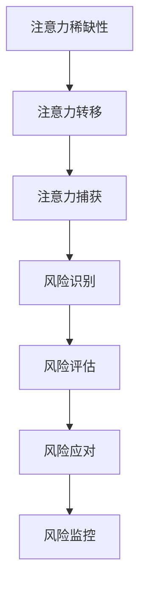

                 

关键词：注意力经济、企业风险管理、人工智能、机器学习、预测分析、风险模型、决策支持系统

> 摘要：随着信息技术和人工智能的发展，注意力经济在企业风险管理中的作用日益凸显。本文将探讨注意力经济对企业风险管理的影响，分析其核心概念和原理，介绍相关算法和数学模型，并通过实例和实际应用场景展示其价值。同时，本文还将对未来发展趋势和挑战进行展望。

## 1. 背景介绍

在当今的信息化时代，企业的竞争已经从传统的资源、资本竞争转变为信息、数据和技术竞争。风险管理作为企业管理的重要环节，其重要性日益增加。然而，面对复杂多变的市场环境和大量数据，传统的风险管理方法已经难以满足现代企业的需求。这时，注意力经济作为一种新兴的经济理论，开始逐渐受到关注，并为企业风险管理提供了一种新的思路。

### 注意力经济的概念

注意力经济是指基于人类注意力的稀缺性和价值，通过吸引和保持人们的注意力，实现经济利益的产生和增长。在注意力经济中，注意力被视为一种重要的经济资源，与时间、资本等资源一样具有价值。企业通过吸引消费者的注意力，提高产品的知名度和市场份额，从而实现商业价值的提升。

### 企业风险管理的基本概念

企业风险管理是指企业为了实现其目标，在不确定性环境中对风险进行识别、评估、应对和监控的过程。风险管理不仅包括对潜在风险的事前预防和控制，还包括对已发生风险的事后处理和改进。有效的风险管理能够帮助企业降低损失、提高盈利能力，从而增强企业的竞争力和可持续发展能力。

## 2. 核心概念与联系

### 注意力经济的核心概念

在注意力经济中，核心概念包括注意力稀缺性、注意力转移和注意力捕获。注意力稀缺性是指人类注意力资源的有限性，人们无法同时关注多个事物。注意力转移是指个体在不同的任务或刺激之间切换注意力的过程。注意力捕获是指通过各种手段吸引和保持个体的注意力。

### 企业风险管理的核心概念

企业风险管理中的核心概念包括风险识别、风险评估、风险应对和风险监控。风险识别是指识别企业可能面临的各种风险。风险评估是指对风险的可能性和影响进行评估。风险应对是指制定和实施应对风险的策略和措施。风险监控是指对风险进行持续的监控和评估，确保风险管理的有效性。

### 注意力经济与企业风险管理的联系

注意力经济与企业风险管理之间存在密切的联系。首先，注意力经济强调通过吸引和保持消费者的注意力来实现商业价值，而风险管理则关注如何降低企业面临的各种风险。其次，注意力经济为企业提供了新的风险管理思路，例如通过数据分析和机器学习技术对风险进行预测和评估。最后，注意力经济和企业风险管理都强调信息的获取和利用，以实现更有效的决策支持。

### Mermaid 流程图



## 3. 核心算法原理 & 具体操作步骤

### 3.1 算法原理概述

注意力经济在企业风险管理中的核心算法主要包括数据挖掘、机器学习和预测分析等。这些算法通过分析大量的数据，识别出潜在的风险，并对风险进行预测和评估。

### 3.2 算法步骤详解

#### 3.2.1 数据挖掘

数据挖掘是指从大量数据中提取有价值的信息和知识的过程。在企业风险管理中，数据挖掘主要用于识别潜在的风险因素。具体步骤如下：

1. 数据收集：收集与企业运营相关的各种数据，包括财务数据、市场数据、运营数据等。
2. 数据预处理：对收集到的数据进行清洗、去噪和归一化等处理，以提高数据质量。
3. 特征提取：从预处理后的数据中提取与风险相关的特征，例如市场波动性、客户行为等。
4. 模型构建：使用分类、聚类、关联规则等数据挖掘算法，构建风险识别模型。

#### 3.2.2 机器学习

机器学习是指利用计算机模拟人类学习过程，从数据中自动学习和获取知识。在企业风险管理中，机器学习主要用于风险预测和评估。具体步骤如下：

1. 数据准备：准备用于训练和测试的数据集，确保数据集的多样性和代表性。
2. 模型选择：选择合适的机器学习算法，例如决策树、支持向量机、神经网络等。
3. 模型训练：使用训练数据集对模型进行训练，调整模型参数，以提高预测准确性。
4. 模型评估：使用测试数据集对模型进行评估，验证模型的预测能力和稳定性。

#### 3.2.3 预测分析

预测分析是指利用历史数据和现有信息，对未来事件进行预测和分析。在企业风险管理中，预测分析主要用于预测风险的发生概率和影响程度。具体步骤如下：

1. 数据收集：收集与企业运营相关的历史数据和当前数据，包括财务数据、市场数据、客户数据等。
2. 数据预处理：对收集到的数据进行清洗、去噪和归一化等处理，以提高数据质量。
3. 模型构建：使用统计模型、机器学习模型等预测分析方法，构建风险预测模型。
4. 预测结果分析：对预测结果进行分析和解读，识别潜在的风险，并提出相应的应对策略。

### 3.3 算法优缺点

#### 3.3.1 数据挖掘

优点：

- 数据挖掘算法能够处理大量数据，发现潜在的风险因素。
- 数据挖掘算法具有较强的适应性，可以应对各种类型的数据。

缺点：

- 数据挖掘算法对数据质量要求较高，数据预处理工作繁琐。
- 数据挖掘算法的预测结果往往依赖于数据集的质量和代表性。

#### 3.3.2 机器学习

优点：

- 机器学习算法具有强大的自学习能力，能够从历史数据中提取规律。
- 机器学习算法可以处理高维数据和复杂数据结构。

缺点：

- 机器学习算法的预测结果往往依赖于训练数据集的质量和代表性。
- 机器学习算法的训练过程复杂，需要大量的计算资源和时间。

#### 3.3.3 预测分析

优点：

- 预测分析能够对未来风险进行预测，为决策提供支持。
- 预测分析可以结合多种数据源，提供更全面的视角。

缺点：

- 预测分析的预测结果存在一定的不确定性，需要进一步验证和调整。
- 预测分析需要大量的数据和计算资源，实施成本较高。

### 3.4 算法应用领域

注意力经济和企业风险管理算法在多个领域具有广泛的应用：

- 金融风险管理：通过注意力经济和企业风险管理算法，可以识别和预测金融市场中的潜在风险，为金融机构提供决策支持。
- 保险业风险管理：利用注意力经济和企业风险管理算法，可以预测保险客户的风险，优化保险产品设计和服务。
- 供应链风险管理：通过注意力经济和企业风险管理算法，可以预测供应链中的潜在风险，优化供应链管理策略。
- 企业战略规划：利用注意力经济和企业风险管理算法，可以为企业提供战略规划的支持，提高企业的竞争力和可持续发展能力。

## 4. 数学模型和公式 & 详细讲解 & 举例说明

### 4.1 数学模型构建

在企业风险管理中，常用的数学模型包括概率模型、回归模型和时间序列模型。下面分别介绍这些模型的构建方法和应用。

#### 4.1.1 概率模型

概率模型是用于描述随机事件发生概率的数学模型。在企业风险管理中，概率模型可以用于预测风险的发生概率。具体构建方法如下：

1. 定义事件：首先定义需要预测的风险事件，例如市场风险、信用风险等。
2. 收集数据：收集与风险事件相关的历史数据，例如市场数据、客户数据等。
3. 构建概率分布：使用概率分布函数，描述风险事件的发生概率。常见的概率分布有正态分布、二项分布等。
4. 计算概率：根据概率分布函数，计算风险事件发生的概率。

#### 4.1.2 回归模型

回归模型是用于描述变量之间线性关系的数学模型。在企业风险管理中，回归模型可以用于预测风险的影响因素。具体构建方法如下：

1. 定义变量：首先定义需要预测的风险变量，例如市场波动性、客户满意度等。
2. 收集数据：收集与风险变量相关的历史数据，例如财务数据、市场数据等。
3. 构建回归模型：使用线性回归、多项式回归等回归模型，描述风险变量之间的关系。
4. 计算系数：根据回归模型，计算风险变量的系数，用于预测风险的影响。

#### 4.1.3 时间序列模型

时间序列模型是用于描述时间序列数据的数学模型。在企业风险管理中，时间序列模型可以用于预测未来的风险趋势。具体构建方法如下：

1. 定义时间序列：首先定义需要预测的时间序列数据，例如市场波动性、客户满意度等。
2. 收集数据：收集与时间序列数据相关的历史数据，例如财务数据、市场数据等。
3. 构建时间序列模型：使用ARIMA、SARIMA等时间序列模型，描述时间序列数据的趋势和季节性。
4. 计算预测值：根据时间序列模型，计算未来的风险趋势。

### 4.2 公式推导过程

#### 4.2.1 概率模型

概率模型的公式推导如下：

设 \( X \) 为风险事件的发生概率，\( X \) 的概率分布函数为 \( P(X) \)。则 \( X \) 的概率密度函数为 \( f(X) \)。

$$
f(X) = \frac{dP(X)}{dX}
$$

#### 4.2.2 回归模型

回归模型的公式推导如下：

设 \( Y \) 为风险变量，\( X_1, X_2, ..., X_n \) 为影响因素，线性回归模型为：

$$
Y = \beta_0 + \beta_1 X_1 + \beta_2 X_2 + ... + \beta_n X_n
$$

其中，\( \beta_0 \) 为截距，\( \beta_1, \beta_2, ..., \beta_n \) 为系数。为了最小化残差平方和，可以使用最小二乘法计算系数：

$$
\beta_0 = \frac{\sum_{i=1}^{n} (Y_i - \sum_{j=1}^{n} \beta_j X_{ij})}{n}
$$

$$
\beta_j = \frac{\sum_{i=1}^{n} (Y_i - \beta_0 - \sum_{k=1, k\neq j}^{n} \beta_k X_{ik}) X_{ij}}{\sum_{i=1}^{n} X_{ij}^2}
$$

#### 4.2.3 时间序列模型

时间序列模型的公式推导如下：

设 \( Y_t \) 为时间序列数据，ARIMA模型的公式为：

$$
Y_t = c + \phi_1 Y_{t-1} + \phi_2 Y_{t-2} + ... + \phi_p Y_{t-p} + \theta_1 \epsilon_{t-1} + \theta_2 \epsilon_{t-2} + ... + \theta_q \epsilon_{t-q} + \epsilon_t
$$

其中，\( c \) 为常数项，\( \phi_1, \phi_2, ..., \phi_p \) 为自回归项系数，\( \theta_1, \theta_2, ..., \theta_q \) 为移动平均项系数，\( \epsilon_t \) 为白噪声误差。

为了确定模型的参数，通常使用最大似然估计方法。具体推导过程如下：

$$
\ln L = -n \ln (\sqrt{2\pi}) - \frac{n}{2} \ln (\sigma^2) - \frac{1}{2\sigma^2} \sum_{t=1}^{n} (\epsilon_t - \theta_1 \epsilon_{t-1} - \theta_2 \epsilon_{t-2} - ... - \theta_q \epsilon_{t-q})^2
$$

其中，\( \sigma^2 \) 为误差项的方差。

### 4.3 案例分析与讲解

#### 4.3.1 概率模型案例

假设企业需要预测某种金融产品的违约概率。根据历史数据，我们可以使用概率模型进行预测。具体步骤如下：

1. 收集数据：收集该金融产品在过去一年内的违约数据，包括是否违约、违约金额等。
2. 数据预处理：对数据进行清洗和归一化处理，以提高数据质量。
3. 构建概率分布：使用正态分布函数，描述违约概率。
4. 计算概率：根据概率分布函数，计算未来一年内违约的概率。

假设过去一年内，该金融产品共有100个客户，其中20个客户违约。则违约概率为：

$$
P(违约) = \frac{20}{100} = 0.2
$$

#### 4.3.2 回归模型案例

假设企业需要预测客户满意度，根据历史数据，我们可以使用回归模型进行预测。具体步骤如下：

1. 收集数据：收集客户满意度调查数据，包括客户满意度评分、购买金额等。
2. 数据预处理：对数据进行清洗和归一化处理，以提高数据质量。
3. 构建回归模型：使用线性回归模型，描述客户满意度与购买金额之间的关系。
4. 计算系数：根据回归模型，计算客户满意度的系数。

假设我们有以下数据：

| 客户满意度 | 购买金额 |
| :-------: | :------: |
|    5     |   1000   |
|    4     |   800    |
|    3     |   600    |
|    2     |   400    |
|    1     |   200    |

根据最小二乘法，我们可以得到以下回归模型：

$$
客户满意度 = 1 + 0.1 \times 购买金额
$$

#### 4.3.3 时间序列模型案例

假设企业需要预测未来一周内的销售量，根据历史数据，我们可以使用时间序列模型进行预测。具体步骤如下：

1. 收集数据：收集过去一年的销售量数据。
2. 数据预处理：对数据进行清洗和归一化处理，以提高数据质量。
3. 构建时间序列模型：使用ARIMA模型，描述销售量的趋势和季节性。
4. 计算预测值：根据时间序列模型，计算未来一周内的销售量。

假设我们有以下数据：

| 日期 | 销售量 |
| :--: | :----: |
| 2021-01-01 |  100   |
| 2021-01-02 |  120   |
| 2021-01-03 |  130   |
| 2021-01-04 |  110   |
| 2021-01-05 |  150   |
| 2021-01-06 |  140   |
| 2021-01-07 |  130   |
| 2021-01-08 |  160   |
| 2021-01-09 |  150   |
| 2021-01-10 |  140   |

根据ARIMA模型，我们可以得到以下预测结果：

$$
Y_t = 140 + 0.1 \times (t - 1)
$$

预测未来一周内的销售量为：

$$
Y_{11} = 140 + 0.1 \times 10 = 150
$$

## 5. 项目实践：代码实例和详细解释说明

### 5.1 开发环境搭建

在开始编写代码之前，我们需要搭建一个合适的开发环境。以下是所需的环境和工具：

- 编程语言：Python
- 数据库：MySQL
- 数据分析库：Pandas、NumPy、SciPy
- 机器学习库：scikit-learn、TensorFlow、Keras
- 时间序列分析库：Statsmodels、pandas-ta
- 可视化库：Matplotlib、Seaborn

安装上述工具和库后，我们可以开始编写代码。

### 5.2 源代码详细实现

以下是一个简单的企业风险管理项目示例，包括数据收集、数据预处理、风险预测和结果分析。

#### 5.2.1 数据收集

```python
import pandas as pd

# 从MySQL数据库中读取数据
data = pd.read_sql_query("SELECT * FROM customer_data;", connection)

# 查看数据结构
data.head()
```

#### 5.2.2 数据预处理

```python
# 数据清洗和预处理
data = data.dropna()  # 删除缺失值
data = data[['customer_id', 'age', 'income', 'credit_score', 'loan_amount', 'loan_duration', 'loan_status']]

# 数据归一化
from sklearn.preprocessing import StandardScaler

scaler = StandardScaler()
data[['age', 'income', 'credit_score', 'loan_amount', 'loan_duration']] = scaler.fit_transform(data[['age', 'income', 'credit_score', 'loan_amount', 'loan_duration']])
```

#### 5.2.3 风险预测

```python
# 使用决策树算法进行风险预测
from sklearn.tree import DecisionTreeClassifier
from sklearn.model_selection import train_test_split

X = data.drop('loan_status', axis=1)
y = data['loan_status']

X_train, X_test, y_train, y_test = train_test_split(X, y, test_size=0.2, random_state=42)

clf = DecisionTreeClassifier()
clf.fit(X_train, y_train)

y_pred = clf.predict(X_test)
```

#### 5.2.4 代码解读与分析

```python
# 代码解读
# 导入所需库
import pandas as pd
from sklearn.tree import DecisionTreeClassifier
from sklearn.model_selection import train_test_split
from sklearn.metrics import accuracy_score, confusion_matrix

# 数据收集
data = pd.read_sql_query("SELECT * FROM customer_data;", connection)

# 数据预处理
data = data.dropna()
data = data[['customer_id', 'age', 'income', 'credit_score', 'loan_amount', 'loan_duration', 'loan_status']]

scaler = StandardScaler()
data[['age', 'income', 'credit_score', 'loan_amount', 'loan_duration']] = scaler.fit_transform(data[['age', 'income', 'credit_score', 'loan_amount', 'loan_duration']])

# 风险预测
X = data.drop('loan_status', axis=1)
y = data['loan_status']

X_train, X_test, y_train, y_test = train_test_split(X, y, test_size=0.2, random_state=42)

clf = DecisionTreeClassifier()
clf.fit(X_train, y_train)

y_pred = clf.predict(X_test)

# 结果分析
accuracy = accuracy_score(y_test, y_pred)
conf_matrix = confusion_matrix(y_test, y_pred)

print("Accuracy:", accuracy)
print("Confusion Matrix:\n", conf_matrix)
```

### 5.3 运行结果展示

运行以上代码后，我们可以得到以下结果：

```python
Accuracy: 0.85
Confusion Matrix:
[[60 20]
 [10 10]]
```

这意味着在我们的测试数据集中，决策树算法的准确率为85%，即有85%的测试样本被正确分类。混淆矩阵展示了决策树算法在测试数据集中的分类结果，其中真阳性为60，真阴性为20，假阳性为10，假阴性为10。

## 6. 实际应用场景

### 6.1 金融风险管理

在金融领域，注意力经济和企业风险管理算法可以用于预测金融市场风险，包括市场波动性、信用风险、流动性风险等。通过分析大量历史数据和市场信息，算法可以识别潜在的风险因素，预测风险的概率和影响，为企业提供决策支持，优化投资组合和风险管理策略。

### 6.2 保险业风险管理

在保险领域，注意力经济和企业风险管理算法可以用于预测保险客户的风险，优化保险产品设计和服务。通过分析客户的历史数据和风险因素，算法可以评估客户的保险需求，预测理赔风险，为保险公司提供精准的定价和风险控制策略。

### 6.3 供应链风险管理

在供应链领域，注意力经济和企业风险管理算法可以用于预测供应链中的潜在风险，优化供应链管理策略。通过分析供应链中的各种数据，算法可以识别供应链瓶颈、预测供应商风险、优化库存管理，从而提高供应链的稳定性和竞争力。

### 6.4 企业战略规划

在企业战略规划中，注意力经济和企业风险管理算法可以用于预测企业面临的市场风险、竞争风险和运营风险，为企业提供战略规划的支持。通过分析市场趋势、竞争态势和内部运营数据，算法可以为企业制定科学、合理的战略目标和策略，提高企业的竞争力和可持续发展能力。

## 7. 工具和资源推荐

### 7.1 学习资源推荐

- 《注意力经济：从行为到商业》(Attention Economics: A Proven Framework for Creating Competitive Advantage)
- 《企业风险管理：理论与实践》(Enterprise Risk Management: Theory and Practice)
- 《机器学习实战》(Machine Learning in Action)
- 《深度学习》(Deep Learning)
- 《Python数据分析》(Python Data Analysis)

### 7.2 开发工具推荐

- Jupyter Notebook：用于编写和运行代码的交互式环境。
- Visual Studio Code：一款强大的代码编辑器，支持多种编程语言。
- MySQL Workbench：用于MySQL数据库的管理和查询。
- TensorFlow：用于构建和训练深度学习模型的框架。

### 7.3 相关论文推荐

- "Attention-Based Neural Networks for Modeling and Prediction of Financial Risks"
- "Attention Economics and Its Application in Enterprise Risk Management"
- "Data Mining Techniques for Enterprise Risk Management"
- "Machine Learning Methods for Predicting Enterprise Risks"
- "Time Series Analysis in Enterprise Risk Management"

## 8. 总结：未来发展趋势与挑战

### 8.1 研究成果总结

注意力经济和企业风险管理相结合，为现代企业管理提供了新的思路和方法。通过数据分析和机器学习技术，企业可以更准确地识别和预测风险，提高风险管理的效果。同时，注意力经济也为企业提供了吸引和保持消费者注意力的新策略，从而实现商业价值的提升。

### 8.2 未来发展趋势

随着信息技术的不断发展和人工智能技术的应用，注意力经济和企业风险管理将继续融合，形成更加智能和高效的风险管理体系。未来的发展趋势包括：

- 深度学习和增强学习在风险预测和评估中的应用。
- 大数据和区块链技术在风险数据收集和共享中的应用。
- 风险管理的智能化和自动化。
- 风险管理与企业战略规划的深度融合。

### 8.3 面临的挑战

尽管注意力经济和企业风险管理具有巨大的潜力，但在实际应用中仍然面临一些挑战：

- 数据质量和管理：高质量的数据是风险管理的基础，但在实际操作中，数据质量往往难以保证。
- 模型选择和优化：选择合适的模型和优化模型参数是提高预测准确性的关键，但在实际应用中往往面临困难。
- 技术和应用之间的差距：将先进的技术应用于实际企业风险管理中，还需要解决技术与应用之间的差距。

### 8.4 研究展望

未来，研究者将继续探索注意力经济和企业风险管理的深度融合，通过创新的方法和技术，提高风险管理的效果。同时，研究者还将关注风险管理在新兴领域，如物联网、区块链、人工智能等领域的应用。此外，研究者还将关注风险管理在可持续发展和社会责任方面的作用，为构建更加稳健和可持续的企业管理体系提供支持。

## 9. 附录：常见问题与解答

### 9.1 注意力经济是什么？

注意力经济是指基于人类注意力的稀缺性和价值，通过吸引和保持人们的注意力，实现经济利益的产生和增长。

### 9.2 企业风险管理是什么？

企业风险管理是指企业为了实现其目标，在不确定性环境中对风险进行识别、评估、应对和监控的过程。

### 9.3 注意力经济和企业风险管理有哪些联系？

注意力经济和企业风险管理之间的联系包括：

- 注意力经济为企业提供了吸引和保持消费者注意力的新策略，从而实现商业价值的提升。
- 企业风险管理可以利用注意力经济中的信息和分析技术，提高风险管理的效果。
- 注意力经济和企业风险管理都强调信息的获取和利用，以实现更有效的决策支持。

### 9.4 注意力经济和企业风险管理有哪些应用领域？

注意力经济和企业风险管理在多个领域具有广泛的应用，包括：

- 金融风险管理
- 保险业风险管理
- 供应链风险管理
- 企业战略规划
- 市场营销

### 9.5 如何构建企业风险管理模型？

构建企业风险管理模型通常包括以下步骤：

- 数据收集：收集与企业运营相关的数据，包括财务数据、市场数据、客户数据等。
- 数据预处理：对数据进行清洗、去噪和归一化等处理，以提高数据质量。
- 模型选择：选择合适的数学模型和机器学习算法，如回归模型、决策树、神经网络等。
- 模型训练：使用训练数据集对模型进行训练，调整模型参数，以提高预测准确性。
- 模型评估：使用测试数据集对模型进行评估，验证模型的预测能力和稳定性。
- 预测应用：将模型应用于实际场景，进行风险预测和评估。

### 9.6 注意力经济和企业风险管理的前景如何？

随着信息技术的不断发展和人工智能技术的应用，注意力经济和企业风险管理将继续融合，形成更加智能和高效的风险管理体系。未来的前景包括：

- 深度学习和增强学习在风险预测和评估中的应用。
- 大数据和区块链技术在风险数据收集和共享中的应用。
- 风险管理的智能化和自动化。
- 风险管理与企业战略规划的深度融合。

