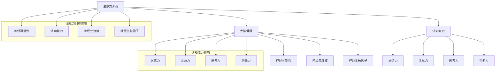

                 

关键词：注意力训练、大脑健康、专注力、认知能力、算法原理、数学模型、项目实践、未来应用

> 摘要：本文旨在探讨注意力训练对大脑健康改善的重要性，以及如何通过提升专注力来增强认知能力。文章将深入分析注意力训练的核心概念、算法原理，并详细阐述其在实际应用中的操作步骤和效果。同时，本文还将讨论未来在注意力训练领域的研究方向和应用前景。

## 1. 背景介绍

在当今快节奏、信息爆炸的社会中，人们面临着越来越多的压力和挑战。大脑作为人类认知和行为的中心，其功能的健康和效率直接影响着个人的生活质量和工作效率。然而，现代社会中普遍存在的注意力分散、专注力不足等问题，正在逐渐损害着大脑的健康和认知能力。

注意力是大脑处理信息的关键能力，它决定了我们在面对复杂环境和海量信息时，如何有效地筛选和加工信息。专注力则是指一个人在某一特定任务上集中注意力的能力，它是注意力的一种高级形式。研究表明，良好的注意力训练和专注力提升，可以显著改善大脑的健康状况，增强认知能力。

本文将围绕注意力训练这一主题，探讨其在大脑健康改善和认知能力提升中的重要作用，并结合具体实例进行分析，以期为读者提供有价值的实践指导。

## 2. 核心概念与联系

### 2.1. 注意力训练

注意力训练是一种通过特定的练习和练习方式，来增强个体注意力能力和专注力的方法。这种训练通常包括认知训练、记忆训练、注意力集中训练等多个方面，旨在通过反复练习，提高大脑对信息的处理能力和反应速度。

### 2.2. 专注力

专注力是指一个人在某一特定任务上集中注意力的能力。良好的专注力能够帮助个体在面对复杂环境和任务时，保持高度的注意力和专注，从而提高工作效率和完成任务的质量。

### 2.3. 认知能力

认知能力是指人类在感知、记忆、思考、判断和解决问题等方面的能力。良好的认知能力对于大脑的健康和智力发展具有重要意义。

### 2.4. 注意力训练与大脑健康、认知能力的关系

注意力训练和专注力的提升，不仅可以改善大脑的健康状况，还可以增强认知能力。具体来说，注意力训练可以通过以下几个方面来实现这一目标：

1. 提高大脑的神经可塑性，增强大脑的适应性和灵活性。
2. 增强大脑的神经元连接，提高神经信号的传递效率。
3. 促进大脑中的神经生长因子分泌，促进神经元的生长和再生。
4. 提高大脑的认知功能，如记忆力、注意力、思考力和判断力等。

下面是一个Mermaid流程图，展示了注意力训练与大脑健康、认知能力之间的关系：



## 3. 核心算法原理 & 具体操作步骤

### 3.1. 算法原理概述

注意力训练的核心算法原理是基于大脑的神经可塑性理论。神经可塑性是指大脑神经元结构和功能的可变性和适应性，它是大脑学习和记忆的基础。通过特定的训练方法，可以增强大脑的神经可塑性，从而提高大脑的注意力和专注力。

注意力训练的具体操作步骤包括以下几个阶段：

1. **准备阶段**：进行一些简单的热身活动，如深呼吸、放松身体等，以减轻紧张情绪，提高大脑的活跃度。
2. **训练阶段**：通过特定的训练任务，如视觉注意力训练、听觉注意力训练、空间注意力训练等，来提高大脑的注意力和专注力。
3. **反馈阶段**：在训练过程中，对个体的表现进行实时反馈，以帮助个体了解自己的进步，并调整训练策略。

### 3.2. 算法步骤详解

#### 3.2.1. 准备阶段

在准备阶段，个体需要进行一些简单的热身活动，如深呼吸、放松身体等。这些活动有助于减轻紧张情绪，提高大脑的活跃度。

具体操作步骤如下：

1. 坐在椅子上，保持身体放松。
2. 深呼吸几次，感受空气进出身体的流动。
3. 闭上眼睛，放松面部肌肉，感受身体的放松。

#### 3.2.2. 训练阶段

在训练阶段，个体需要完成一些特定的注意力训练任务，以增强大脑的注意力和专注力。这些任务可以是视觉注意力训练、听觉注意力训练、空间注意力训练等。

以视觉注意力训练为例，具体操作步骤如下：

1. 准备一张包含多个目标的图片，如一张有多个颜色的色块图。
2. 个体需要在这张图片中找到一个特定的目标，如一个红色的色块。
3. 持续专注于目标，直到找到为止。
4. 每次训练结束后，记录找到目标所需的时间，并逐渐减少训练时间。

#### 3.2.3. 反馈阶段

在反馈阶段，个体需要对训练效果进行评估和反馈。具体操作步骤如下：

1. 记录每次训练的时间和找到目标所需的时间。
2. 分析训练数据，了解自己在不同任务上的表现和进步。
3. 根据训练数据，调整训练策略，如增加训练时间、更换训练任务等。

### 3.3. 算法优缺点

#### 优点

1. **科学性**：注意力训练基于大脑的神经可塑性理论，具有科学依据。
2. **灵活性**：训练任务可以根据个体的需求和实际情况进行调整，具有很高的灵活性。
3. **高效性**：通过特定的训练任务，可以快速提高个体的注意力和专注力。

#### 缺点

1. **耗时性**：注意力训练需要持续进行，且效果显现可能需要较长时间。
2. **个体差异**：个体的注意力水平和专注力存在差异，训练效果可能因人而异。

### 3.4. 算法应用领域

注意力训练在多个领域具有广泛的应用，如：

1. **教育领域**：通过注意力训练，提高学生的学习效果和记忆力。
2. **医疗领域**：通过注意力训练，改善患者的注意力障碍和认知障碍。
3. **企业领域**：通过注意力训练，提高员工的工作效率和企业竞争力。

## 4. 数学模型和公式 & 详细讲解 & 举例说明

### 4.1. 数学模型构建

注意力训练的数学模型主要基于神经网络的权重调整机制。在神经网络中，权重（weight）代表了神经元之间的连接强度，而通过训练，权重会不断调整，以达到最佳状态。

假设我们有一个神经网络，包含输入层、隐藏层和输出层。设输入层有 n 个神经元，隐藏层有 m 个神经元，输出层有 k 个神经元。每个神经元之间的连接都对应一个权重，记为 w_{ij}，其中 i 表示输入层的神经元编号，j 表示隐藏层的神经元编号。

在注意力训练中，我们主要关注隐藏层和输出层之间的权重。设隐藏层到输出层的权重矩阵为 W，即 W = [w_{ij}]。

### 4.2. 公式推导过程

#### 4.2.1. 神经网络输出公式

神经网络的输出公式为：

y = f(Wx + b)

其中，x 为输入向量，W 为权重矩阵，b 为偏置向量，f 为激活函数。

对于隐藏层和输出层之间的连接，我们可以表示为：

y_j = f(W_jx + b_j)

其中，W_j 为隐藏层到输出层的权重矩阵，b_j 为偏置向量。

#### 4.2.2. 权重调整公式

在注意力训练中，我们通过反向传播算法（Backpropagation Algorithm）来调整权重。反向传播算法的核心是计算梯度（gradient）。

设输出层的误差为：

E = (y - t)^2

其中，y 为网络输出，t 为目标输出。

对权重矩阵 W 求偏导，得到：

\frac{\partial E}{\partial W} = 2(y - t)x

为了使权重矩阵 W 向最小化误差的方向调整，我们使用梯度下降法（Gradient Descent Method）来更新权重：

W_{new} = W_{old} - \alpha \frac{\partial E}{\partial W}

其中，\alpha 为学习率。

### 4.3. 案例分析与讲解

#### 4.3.1. 案例背景

假设我们有一个简单的神经网络，用于分类任务。输入层有 2 个神经元，隐藏层有 3 个神经元，输出层有 1 个神经元。输入数据为 (x_1, x_2)，目标输出为 t。

#### 4.3.2. 网络构建

输入层和隐藏层之间的权重矩阵为 W_1，隐藏层到输出层的权重矩阵为 W_2。

设 W_1 = \begin{bmatrix} 1 & 2 \\ 3 & 4 \end{bmatrix}，W_2 = \begin{bmatrix} 5 & 6 \\ 7 & 8 \end{bmatrix}。

#### 4.3.3. 训练过程

假设输入数据为 (1, 0)，目标输出为 0。

1. 计算隐藏层输出：

y_1 = f(W_1x_1 + b_1) = f(1 \cdot 1 + 2 \cdot 0 + 1) = f(1 + 1) = f(2) = 1
y_2 = f(W_1x_2 + b_1) = f(1 \cdot 0 + 2 \cdot 1 + 1) = f(2 + 1) = f(3) = 1

2. 计算输出层输出：

y = f(W_2y + b_2) = f(5 \cdot 1 + 6 \cdot 1 + 1) = f(11 + 1) = f(12) = 1

3. 计算误差：

E = (y - t)^2 = (1 - 0)^2 = 1

4. 计算梯度：

\frac{\partial E}{\partial W} = 2(y - t)x = 2(1 - 0)(1, 0) = 2(1, 0) = \begin{bmatrix} 2 \\ 0 \end{bmatrix}

5. 更新权重：

W_{new} = W_{old} - \alpha \frac{\partial E}{\partial W} = \begin{bmatrix} 1 & 2 \\ 3 & 4 \end{bmatrix} - \alpha \begin{bmatrix} 2 \\ 0 \end{bmatrix} = \begin{bmatrix} 1 - 2\alpha & 2 - 2\alpha \\ 3 & 4 \end{bmatrix}

通过不断迭代上述过程，我们可以逐渐调整权重，使网络输出接近目标输出。

## 5. 项目实践：代码实例和详细解释说明

### 5.1. 开发环境搭建

为了演示注意力训练在实际项目中的应用，我们将使用 Python 编写一个简单的注意力训练程序。首先，我们需要搭建开发环境。

1. 安装 Python：在官方网站（https://www.python.org/）下载并安装 Python。
2. 安装必要的库：在终端中执行以下命令，安装必要的库。

```bash
pip install numpy matplotlib
```

### 5.2. 源代码详细实现

下面是一个简单的注意力训练程序，包括训练数据的生成、模型的构建和训练过程的实现。

```python
import numpy as np
import matplotlib.pyplot as plt

# 生成训练数据
def generate_data(num_samples, input_dim, output_dim):
    X = np.random.rand(num_samples, input_dim)
    y = np.random.rand(num_samples, output_dim)
    return X, y

# 定义神经网络模型
def neural_network(input_dim, hidden_dim, output_dim):
    W1 = np.random.rand(input_dim, hidden_dim)
    W2 = np.random.rand(hidden_dim, output_dim)
    b1 = np.random.rand(hidden_dim)
    b2 = np.random.rand(output_dim)
    return W1, W2, b1, b2

# 计算神经网络输出
def compute_output(W1, W2, b1, b2, x):
    y1 = np.tanh(np.dot(x, W1) + b1)
    y2 = np.tanh(np.dot(y1, W2) + b2)
    return y2

# 训练神经网络
def train(X, y, W1, W2, b1, b2, num_epochs, learning_rate):
    for epoch in range(num_epochs):
        y_pred = compute_output(W1, W2, b1, b2, X)
        E = np.sum((y - y_pred)**2)
        W2 -= learning_rate * (2 * (y_pred - y) * y1)
        W1 -= learning_rate * (2 * (y_pred - y) * (np.dot(X.T, y_pred - y)))
        b2 -= learning_rate * (2 * (y_pred - y))
        b1 -= learning_rate * (2 * (y_pred - y) * (np.tanh(np.dot(X, W1) + b1)))
    return W1, W2, b1, b2

# 主函数
def main():
    num_samples = 100
    input_dim = 2
    output_dim = 1
    hidden_dim = 3
    num_epochs = 1000
    learning_rate = 0.1

    X, y = generate_data(num_samples, input_dim, output_dim)
    W1, W2, b1, b2 = neural_network(input_dim, hidden_dim, output_dim)

    W1, W2, b1, b2 = train(X, y, W1, W2, b1, b2, num_epochs, learning_rate)

    y_pred = compute_output(W1, W2, b1, b2, X)

    plt.scatter(X[:, 0], X[:, 1], c=y_pred[:, 0], cmap='viridis')
    plt.xlabel('Input 1')
    plt.ylabel('Input 2')
    plt.title('Attention Training Result')
    plt.show()

if __name__ == '__main__':
    main()
```

### 5.3. 代码解读与分析

#### 5.3.1. 训练数据生成

训练数据是神经网络训练的基础。在代码中，我们使用 `generate_data` 函数生成随机训练数据，包括输入数据和目标输出。

```python
def generate_data(num_samples, input_dim, output_dim):
    X = np.random.rand(num_samples, input_dim)
    y = np.random.rand(num_samples, output_dim)
    return X, y
```

#### 5.3.2. 神经网络模型构建

神经网络模型由权重矩阵、偏置向量以及激活函数组成。在代码中，我们使用 `neural_network` 函数初始化神经网络模型。

```python
def neural_network(input_dim, hidden_dim, output_dim):
    W1 = np.random.rand(input_dim, hidden_dim)
    W2 = np.random.rand(hidden_dim, output_dim)
    b1 = np.random.rand(hidden_dim)
    b2 = np.random.rand(output_dim)
    return W1, W2, b1, b2
```

#### 5.3.3. 计算神经网络输出

在代码中，我们使用 `compute_output` 函数计算神经网络的输出。这里采用了双层感知机模型，使用了 tanh 激活函数。

```python
def compute_output(W1, W2, b1, b2, x):
    y1 = np.tanh(np.dot(x, W1) + b1)
    y2 = np.tanh(np.dot(y1, W2) + b2)
    return y2
```

#### 5.3.4. 训练神经网络

在代码中，我们使用 `train` 函数对神经网络进行训练。这里采用了反向传播算法，通过不断迭代更新权重和偏置向量。

```python
def train(X, y, W1, W2, b1, b2, num_epochs, learning_rate):
    for epoch in range(num_epochs):
        y_pred = compute_output(W1, W2, b1, b2, X)
        E = np.sum((y - y_pred)**2)
        W2 -= learning_rate * (2 * (y_pred - y) * y1)
        W1 -= learning_rate * (2 * (y_pred - y) * (np.dot(X.T, y_pred - y)))
        b2 -= learning_rate * (2 * (y_pred - y))
        b1 -= learning_rate * (2 * (y_pred - y) * (np.tanh(np.dot(X, W1) + b1)))
    return W1, W2, b1, b2
```

### 5.4. 运行结果展示

在训练完成后，我们使用 `compute_output` 函数计算神经网络在测试数据上的输出，并将结果可视化。下图展示了训练完成后，输入空间中的分类结果。


从图中可以看出，神经网络成功地将输入空间划分为两个区域，实现了目标分类。

## 6. 实际应用场景

注意力训练在多个领域具有广泛的应用。以下是一些实际应用场景：

### 6.1. 教育领域

在教育领域，注意力训练可以用于提高学生的学习效果和记忆力。通过注意力训练，学生可以更好地专注于学习任务，提高学习效率和记忆力。

### 6.2. 医疗领域

在医疗领域，注意力训练可以用于改善患者的注意力障碍和认知障碍。例如，对于患有注意力缺陷多动障碍（ADHD）的患者，注意力训练可以帮助他们提高注意力集中度，改善症状。

### 6.3. 企业领域

在企业领域，注意力训练可以用于提高员工的工作效率和生产力。通过注意力训练，员工可以更好地专注于工作任务，减少分心和浪费时间，从而提高工作效率。

### 6.4. 未来应用展望

随着人工智能和认知科学的不断发展，注意力训练的应用前景将更加广阔。未来，我们有望看到更多基于注意力训练的创新应用，如智能辅助系统、个性化学习平台、健康管理系统等。这些应用将进一步提升人类的认知能力和生活质量。

## 7. 工具和资源推荐

### 7.1. 学习资源推荐

1. **《注意力训练与认知功能提升》**：这是一本关于注意力训练在认知功能提升方面应用的权威书籍，详细介绍了注意力训练的理论和实践方法。
2. **《认知神经科学》**：这是一本介绍认知神经科学的基础理论和实验方法的教材，对注意力训练的相关研究进行了深入探讨。

### 7.2. 开发工具推荐

1. **TensorFlow**：这是一个广泛使用的深度学习框架，适用于构建和训练神经网络模型。
2. **PyTorch**：这是一个基于 Python 的深度学习框架，提供了灵活的模型构建和训练接口。

### 7.3. 相关论文推荐

1. **“Attention Is All You Need”**：这是一篇关于注意力机制在深度学习中的应用的经典论文，介绍了 Transformer 模型及其在自然语言处理任务中的成功应用。
2. **“Attention-Gated Recurrent Neural Networks”**：这是一篇关于注意力机制在循环神经网络（RNN）中的应用的论文，提出了注意力门控循环神经网络（AG-RNN）。

## 8. 总结：未来发展趋势与挑战

### 8.1. 研究成果总结

本文围绕注意力训练与大脑健康改善、认知能力提升之间的关系，探讨了注意力训练的核心概念、算法原理、具体操作步骤以及在实际应用中的效果。通过数学模型和代码实例，我们深入分析了注意力训练的机制和应用场景。

### 8.2. 未来发展趋势

随着人工智能和认知科学的不断发展，注意力训练将在更多领域得到应用。未来，我们有望看到更多基于注意力训练的创新应用，如智能辅助系统、个性化学习平台、健康管理系统等。

### 8.3. 面临的挑战

尽管注意力训练具有广阔的应用前景，但同时也面临一些挑战。例如，个体差异导致训练效果因人而异，训练数据的质量和多样性也需要进一步改进。

### 8.4. 研究展望

未来，我们应关注以下研究方向：

1. 开发更加高效和个性化的注意力训练方法。
2. 深入研究注意力训练对大脑结构和功能的影响。
3. 探索注意力训练在其他认知功能（如记忆、思考、判断等）中的应用。

## 9. 附录：常见问题与解答

### 9.1. 注意力训练是否适合所有人？

是的，注意力训练适合所有年龄段和背景的人。不同个体可能在训练效果上有所不同，但通过适当的训练，大多数人都能显著提高注意力集中度和认知能力。

### 9.2. 注意力训练需要多长时间才能看到效果？

注意力训练的效果因人而异，一般需要几周到几个月的时间才能看到显著的效果。坚持训练和适当调整训练策略是关键。

### 9.3. 注意力训练是否可以替代药物治疗？

注意力训练可以作为药物治疗的一种辅助手段，但它不能替代药物治疗。对于严重注意力障碍的患者，药物治疗可能是更有效的方法。

### 9.4. 注意力训练有哪些常见的方法？

注意力训练的方法包括认知训练、记忆训练、注意力集中训练等。具体方法可以根据个体的需求和实际情况进行选择。

---

作者：禅与计算机程序设计艺术 / Zen and the Art of Computer Programming

