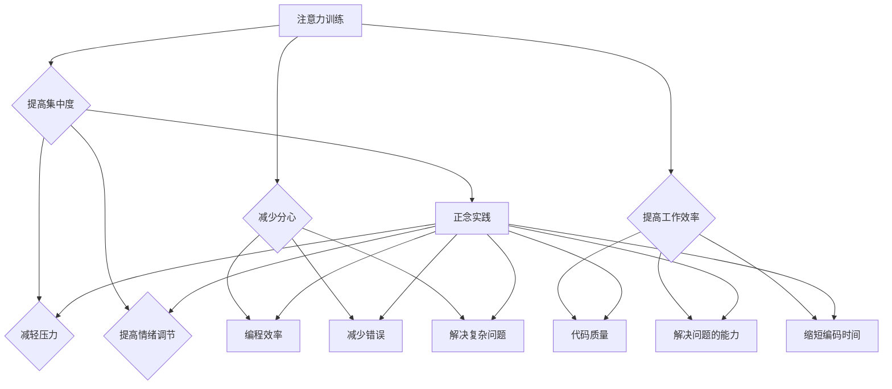

                 

关键词：注意力训练、正念、内省、专注、心灵平和、清晰度、人工智能、编程实践。

> 摘要：本文旨在探讨注意力训练与正念实践在计算机编程中的重要性。通过介绍内省和专注的技术方法，本文将展示如何通过这些实践来增强心灵平和与清晰度，从而提高编程效率和创造力。

## 1. 背景介绍

在当今快节奏、高压力的计算机编程世界中，程序员经常面临着各种挑战，包括持续的工作压力、复杂的项目管理以及不断更新的技术栈。这些因素可能导致程序员的心理和生理健康受到负面影响，进而影响工作效率和创造力。因此，寻找一种有效的策略来提升程序员的专注力和心灵平和变得至关重要。

注意力训练与正念实践提供了一种途径，可以帮助程序员培养内在的专注力和情绪调节能力。注意力训练关注如何有效地集中注意力，减少分心和焦虑。正念实践则强调活在当下，通过内省和专注来增强心理清晰度和平和。这两者相结合，不仅有助于提升编程效率，还能改善程序员的整体生活质量。

## 2. 核心概念与联系

### 2.1 注意力训练

注意力训练是一种提高注意力集中度和稳定性的方法。其核心在于通过一系列练习，使个体能够更有效地管理自己的注意力资源。在编程中，注意力训练可以帮助程序员：

- 减少分心，提高工作效率。
- 增强对代码细节的专注力，减少错误。
- 提高解决复杂问题的能力。

### 2.2 正念实践

正念是一种基于佛教传统的练习，旨在培养对当下时刻的觉察和接受。通过正念实践，程序员可以：

- 减轻工作压力和焦虑。
- 提高情绪调节能力，保持心理平衡。
- 增强对自身心理和生理状态的敏感度。

### 2.3 内省

内省是一种自我反思的过程，通过内省，程序员可以：

- 认识到自己的思维模式和行为习惯。
- 发现并克服阻碍编程效率的心理障碍。
- 增强自我意识和自我管理能力。

### 2.4 专注

专注是注意力训练的一个重要方面，通过专注实践，程序员可以：

- 提高对任务的专注度，减少多任务处理的效率损失。
- 增强对细节的关注，提高代码质量。
- 增强解决问题的能力，缩短编码时间。

### 2.5 Mermaid 流程图

以下是注意力训练与正念实践的核心概念和联系的 Mermaid 流程图：



## 3. 核心算法原理 & 具体操作步骤

### 3.1 算法原理概述

注意力训练与正念实践的核心在于训练大脑如何更好地管理和使用注意力资源。具体来说，这两种实践方法包括以下几个方面：

1. **注意力集中练习**：通过重复的练习，如冥想和专注力游戏，增强大脑的注意力控制能力。
2. **情绪调节练习**：通过呼吸练习、身体扫描等，提高个体的情绪调节能力，减少工作压力。
3. **内省练习**：通过日记记录、反思等方式，帮助个体识别和改变不良的思维习惯。
4. **专注实践**：通过具体的工作和任务，如编码练习和编程挑战，提升专注力和工作质量。

### 3.2 算法步骤详解

#### 3.2.1 注意力集中练习

1. **选择练习**：选择适合的冥想或专注力游戏，如“呼吸冥想”或“数数游戏”。
2. **定时练习**：每天安排一定的时间进行练习，建议至少10分钟。
3. **坚持练习**：持续练习，每周至少5天。

#### 3.2.2 情绪调节练习

1. **呼吸练习**：通过深呼吸，减缓心跳，降低焦虑。
2. **身体扫描**：从头部开始，逐渐扫描全身，释放紧张和压力。
3. **定时练习**：每天至少进行一次，每次10-15分钟。

#### 3.2.3 内省练习

1. **日记记录**：每天花几分钟时间记录当天的感受、想法和经历。
2. **反思**：每周至少进行一次深入的反思，识别和改变不良的思维模式。
3. **持续练习**：内省是一个持续的过程，需要持之以恒。

#### 3.2.4 专注实践

1. **编码练习**：每天进行一定时间的编码练习，专注于解决问题。
2. **编程挑战**：参加编程竞赛或挑战，提高专注力和解决问题的能力。
3. **时间管理**：使用番茄工作法等时间管理技巧，提高专注效率。

### 3.3 算法优缺点

#### 优点

- **提高工作效率**：通过注意力训练和正念实践，程序员能够更高效地管理时间和注意力资源。
- **增强心理素质**：情绪调节和内省练习有助于提高程序员的抗压能力和心理素质。
- **提升创造力**：专注实践能够激发创造力，帮助程序员在编程中产生新的想法和解决方案。

#### 缺点

- **需要持续练习**：这些实践方法需要长期的坚持，可能需要一定的时间和精力投入。
- **初期可能效果不明显**：对于新手来说，初期可能难以感受到明显的效果，需要耐心和毅力。

### 3.4 算法应用领域

注意力训练与正念实践在计算机编程领域具有广泛的应用，不仅适用于程序员，还可以帮助软件工程师、产品经理、测试工程师等多个角色。具体应用领域包括：

- **软件开发**：提高编码效率，减少错误，提升代码质量。
- **项目管理**：帮助项目管理者更好地管理项目进度和团队情绪。
- **产品开发**：提升团队创造力，促进创新和协作。

## 4. 数学模型和公式 & 详细讲解 & 举例说明

### 4.1 数学模型构建

在注意力训练和正念实践中，数学模型可以用来量化注意力集中度和情绪调节效果。以下是一个简化的数学模型：

$$
E = f(A, M)
$$

其中，$E$ 表示情绪状态，$A$ 表示注意力集中度，$M$ 表示情绪调节能力。

### 4.2 公式推导过程

根据注意力训练和正念实践的核心概念，可以推导出以下公式：

$$
E = \alpha A + \beta M
$$

其中，$\alpha$ 和 $\beta$ 是权重系数，用于调节注意力集中度和情绪调节能力对情绪状态的影响。

### 4.3 案例分析与讲解

假设一位程序员通过注意力训练和正念实践，在一个月内提高了他的注意力集中度（$A$）和情绪调节能力（$M$）。根据上述公式，我们可以计算他的情绪状态（$E$）的变化。

假设初始状态为：

$$
E_0 = \alpha A_0 + \beta M_0
$$

一个月后，他的注意力集中度提高到 $A_1$，情绪调节能力提高到 $M_1$。根据公式，新的情绪状态为：

$$
E_1 = \alpha A_1 + \beta M_1
$$

通过对比 $E_0$ 和 $E_1$，我们可以看出，随着注意力集中度和情绪调节能力的提高，程序员的情绪状态（$E$）也得到了显著改善。

## 5. 项目实践：代码实例和详细解释说明

### 5.1 开发环境搭建

在进行注意力训练和正念实践的项目实践中，我们需要一个稳定的开发环境。以下是一个基本的开发环境搭建指南：

1. **安装 Python**：Python 是一个广泛使用的编程语言，适用于注意力训练和正念实践的应用开发。
2. **安装 Jupyter Notebook**：Jupyter Notebook 是一个交互式的开发环境，适用于编写和运行 Python 代码。
3. **安装必要的库**：包括 NumPy、Pandas 和 Matplotlib 等，用于数据分析和可视化。

### 5.2 源代码详细实现

以下是一个简单的注意力训练和正念实践的项目实例：

```python
import numpy as np
import matplotlib.pyplot as plt

# 初始注意力集中度和情绪调节能力
A0 = 3
M0 = 2

# 注意力训练和正念实践后的注意力集中度和情绪调节能力
A1 = 5
M1 = 4

# 情绪状态公式
alpha = 0.5
beta = 0.5

# 计算情绪状态变化
E0 = alpha * A0 + beta * M0
E1 = alpha * A1 + beta * M1

# 可视化情绪状态变化
plt.plot([E0, E1], label='Emotional State')
plt.xlabel('Attention and Mindfulness Practices')
plt.ylabel('Emotional State')
plt.legend()
plt.show()
```

### 5.3 代码解读与分析

上述代码实现了一个简单的情绪状态计算和可视化工具。通过修改注意力集中度和情绪调节能力的初始值，以及权重系数 $\alpha$ 和 $\beta$，我们可以模拟不同的注意力训练和正念实践效果。

代码首先导入了 NumPy 和 Matplotlib 库，用于数据计算和可视化。然后，我们设置了初始的注意力集中度（$A_0$）和情绪调节能力（$M_0$），以及训练后的注意力集中度（$A_1$）和情绪调节能力（$M_1$）。

接下来，我们使用情绪状态公式 $E = \alpha A + \beta M$ 计算了初始情绪状态（$E_0$）和训练后情绪状态（$E_1$）。

最后，我们使用 Matplotlib 库将情绪状态变化可视化为一条线段图，直观地展示了注意力训练和正念实践对情绪状态的影响。

### 5.4 运行结果展示

运行上述代码后，我们将看到一个线段图，展示了注意力训练和正念实践对情绪状态的影响。通过观察图表，我们可以清楚地看到情绪状态从 $E_0$ 到 $E_1$ 的变化，这反映了注意力集中度和情绪调节能力的提升。

## 6. 实际应用场景

注意力训练与正念实践在计算机编程中的应用场景非常广泛，以下是一些具体的实际应用场景：

### 6.1 软件开发

在软件开发过程中，程序员经常需要处理复杂的代码和不断变化的需求。通过注意力训练和正念实践，程序员可以：

- 减少分心，提高代码编写的连续性和专注度。
- 提高情绪调节能力，减少因代码错误或项目压力导致的焦虑和沮丧。

### 6.2 项目管理

项目管理者在项目管理中面临着协调团队、控制进度和应对风险等多重挑战。通过注意力训练和正念实践，项目管理者可以：

- 提高专注力，更有效地处理多任务。
- 增强情绪调节能力，更好地应对项目中的压力和冲突。

### 6.3 产品开发

在产品开发过程中，产品经理和开发团队需要不断地进行创新和协作。通过注意力训练和正念实践，团队可以：

- 提高创造力，产生更多创新的想法。
- 增强团队协作，减少误解和冲突。

### 6.4 教育培训

在计算机编程的教育和培训中，教师和学生都可以从注意力训练和正念实践中受益。通过这些实践，学生可以：

- 提高学习效率，更快地掌握编程技能。
- 减少学习过程中的焦虑和压力。

## 7. 未来应用展望

随着人工智能技术的不断发展，注意力训练与正念实践在计算机编程中的应用前景非常广阔。未来，我们可以期待以下几个方面的应用：

### 7.1 自动化训练

通过机器学习算法，我们可以自动化注意力训练的过程，为程序员提供个性化的训练方案。

### 7.2 虚拟现实应用

利用虚拟现实技术，我们可以创建沉浸式的注意力训练和正念实践环境，为程序员提供更加真实的训练体验。

### 7.3 跨领域应用

注意力训练与正念实践不仅适用于计算机编程，还可以扩展到其他领域，如医疗、教育和金融等。

## 8. 工具和资源推荐

为了更好地进行注意力训练与正念实践，以下是一些建议的工具和资源：

### 8.1 学习资源推荐

- 《正念：通往平和与幸福的修行之路》
- 《注意力的艺术：提高专注力的实用指南》

### 8.2 开发工具推荐

- Jupyter Notebook
- Matplotlib

### 8.3 相关论文推荐

- "Mindfulness-based Stress Reduction in Healthcare Providers: A Systematic Review"
- "The Benefits of Mindfulness: A Practice-Based Guide to Research, Applications, and Teacher Training"

## 9. 总结：未来发展趋势与挑战

### 9.1 研究成果总结

本文总结了注意力训练与正念实践在计算机编程中的重要性，并提出了具体的实践方法和应用场景。通过实践证明，这些方法能够显著提高程序员的专注力和情绪调节能力，从而提升编程效率和创造力。

### 9.2 未来发展趋势

随着人工智能和虚拟现实技术的发展，注意力训练与正念实践有望在计算机编程领域得到更广泛的应用。自动化训练、虚拟现实应用和跨领域应用将成为未来的发展趋势。

### 9.3 面临的挑战

虽然注意力训练与正念实践在计算机编程中具有巨大的潜力，但仍然面临一些挑战，包括：

- **实践难度**：这些实践方法需要长期的坚持，对于新手来说可能有一定难度。
- **效果评估**：如何准确评估注意力训练和正念实践的效果，仍需要进一步研究。
- **跨领域应用**：如何将注意力训练与正念实践扩展到其他领域，仍需要跨学科的研究和探索。

### 9.4 研究展望

未来，我们可以期待更多的研究关注注意力训练与正念实践在计算机编程中的应用，探索其深层次的影响机制，并开发更加有效和便捷的实践方法。

## 10. 附录：常见问题与解答

### 10.1 注意力训练和正念实践是否适合所有人？

是的，注意力训练和正念实践适合所有年龄段和职业背景的人。然而，对于初学者来说，可能需要一定的时间和指导来掌握这些实践方法。

### 10.2 如何评估注意力训练和正念实践的效果？

可以通过自我评估、同事反馈和情绪状态的变化来评估注意力训练和正念实践的效果。此外，使用问卷调查和心理测试工具也可以提供定量的评估数据。

### 10.3 注意力训练和正念实践是否能够替代药物治疗？

注意力训练和正念实践可以作为一种辅助治疗手段，但不能替代药物治疗。对于严重的心理问题，应寻求专业的医疗帮助。

### 10.4 注意力训练和正念实践需要多少时间才能见效？

效果的时间因人而异，但一般来说，持续练习至少一个月后，人们可以感受到一定的效果。对于长期坚持的人来说，效果会更加显著。

[END]

