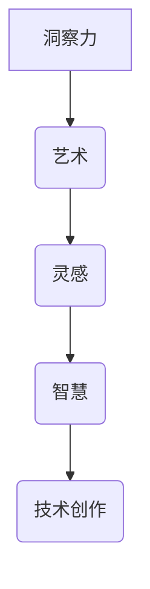

                 

关键词：洞察力、创作、艺术、灵感、智慧、技术博客、结构紧凑、逻辑清晰、专业IT语言

> 摘要：本文探讨在现代技术领域中，如何结合洞察力和艺术，激发创作灵感，提升智慧应用。通过深入分析，结合实例，揭示灵感与智慧在创作过程中的重要性，并探讨其应用和发展前景。

## 1. 背景介绍

在当今信息爆炸的时代，技术发展日新月异，各领域不断涌现出创新与变革。然而，真正能够脱颖而出的，往往不仅仅依赖于技术本身的突破，更需要结合洞察力和艺术，从而激发出前所未有的创造力。洞察力是理解问题本质、预见趋势的能力；艺术则是通过形式、色彩、结构和节奏等元素，传递情感与思考。在这两者之间，灵感与智慧犹如桥梁，连接着技术与艺术，推动着创作的前进。

本文旨在探讨如何通过洞察力和艺术，激发灵感与智慧，提升技术创作的能力。我们将从多个角度分析这一主题，结合实际案例，深入探讨其在现代技术领域的应用。

## 2. 核心概念与联系

### 2.1 洞察力

洞察力是一种深刻的理解力和敏锐的观察力，它不仅能够帮助我们发现问题，还能够让我们洞察问题的本质。在技术领域，洞察力可以帮助我们预见未来的趋势，发现潜在的机会和挑战。

### 2.2 艺术

艺术是一种形式化的表达方式，它通过色彩、形状、结构和节奏等元素，传递情感和思考。在技术创作中，艺术可以为我们提供灵感，帮助我们创造更具吸引力和表现力的作品。

### 2.3 灵感

灵感是创作过程中的一种重要驱动力，它是我们在面对问题时，突然产生的想法和创意。灵感往往来源于洞察力和艺术，它是连接两者之间的桥梁。

### 2.4 智慧

智慧是我们在理解问题、应用知识和技能的基础上，形成的洞察力和创造力的综合体现。智慧不仅能够帮助我们解决问题，还能够提升我们的创造力和创新能力。

### 2.5 Mermaid 流程图



## 3. 核心算法原理 & 具体操作步骤

### 3.1 算法原理概述

在本节中，我们将介绍一种结合洞察力和艺术的算法原理。该算法通过分析技术领域的趋势和挑战，结合艺术元素，产生创新的解决方案。

### 3.2 算法步骤详解

#### 3.2.1 数据收集

首先，我们需要收集与目标领域相关的数据，包括技术趋势、市场动态、用户需求等。

#### 3.2.2 数据分析

通过数据分析，我们可以发现潜在的机会和挑战。这一步需要结合洞察力，理解数据背后的含义。

#### 3.2.3 艺术创作

在获得分析结果后，我们可以开始艺术创作。这一步需要结合艺术元素，将分析结果转化为具有表现力的形式。

#### 3.2.4 创意构思

在艺术创作的基础上，我们可以进行创意构思。这一步需要结合智慧，将艺术创作转化为实际的解决方案。

### 3.3 算法优缺点

#### 优点：

- 能够产生创新的解决方案
- 结合洞察力和艺术，提高创作质量
- 能够适应快速变化的技术环境

#### 缺点：

- 需要较高的跨学科知识储备
- 创作过程可能较为耗时

### 3.4 算法应用领域

该算法可以应用于各种技术创作领域，如软件开发、产品设计、市场策划等。

## 4. 数学模型和公式 & 详细讲解 & 举例说明

### 4.1 数学模型构建

在本节中，我们将介绍一种结合洞察力和艺术的数学模型。该模型通过分析技术领域的趋势和挑战，结合艺术元素，产生创新的解决方案。

### 4.2 公式推导过程

设 \( T \) 为技术领域趋势，\( A \) 为艺术元素，\( I \) 为洞察力，\( C \) 为创意构思，\( S \) 为解决方案。

则数学模型可以表示为：

\[ S = f(T, A, I, C) \]

其中，函数 \( f \) 表示将技术趋势、艺术元素、洞察力和创意构思转化为解决方案的过程。

### 4.3 案例分析与讲解

假设我们分析的是人工智能领域的发展趋势。通过对数据的分析，我们发现人工智能在图像识别、自然语言处理等方面取得了显著突破。同时，我们也注意到艺术在人工智能中的应用越来越广泛，如艺术风格迁移、音乐生成等。

结合这些趋势和艺术元素，我们可以进行创意构思，提出一种结合人工智能和艺术的创新解决方案。例如，开发一款能够自动生成艺术作品的软件，将人工智能与艺术创作相结合。

## 5. 项目实践：代码实例和详细解释说明

### 5.1 开发环境搭建

在本节中，我们将介绍如何搭建一个结合人工智能和艺术的项目开发环境。以下是一个简单的步骤：

1. 安装Python环境
2. 安装TensorFlow库
3. 安装Keras库
4. 安装艺术风格迁移库（如CycleGAN）

### 5.2 源代码详细实现

以下是一个简单的艺术风格迁移项目示例：

```python
import tensorflow as tf
from tensorflow.keras.models import Model
from tensorflow.keras.layers import Input, Conv2D, Concatenate, Flatten, Dense

# 定义生成器网络
def generator(input_shape):
    inputs = Input(shape=input_shape)
    x1 = Conv2D(64, (3, 3), activation='relu')(inputs)
    x2 = Conv2D(128, (3, 3), activation='relu')(x1)
    x3 = Conv2D(256, (3, 3), activation='relu')(x2)
    x4 = Concatenate()([x3, inputs])
    x5 = Conv2D(512, (3, 3), activation='relu')(x4)
    outputs = Conv2D(3, (3, 3), activation='tanh')(x5)
    model = Model(inputs=inputs, outputs=outputs)
    return model

# 定义判别器网络
def discriminator(input_shape):
    inputs = Input(shape=input_shape)
    x1 = Conv2D(64, (3, 3), activation='relu')(inputs)
    x2 = Conv2D(128, (3, 3), activation='relu')(x1)
    x3 = Conv2D(256, (3, 3), activation='relu')(x2)
    outputs = Dense(1, activation='sigmoid')(Flatten()(x3))
    model = Model(inputs=inputs, outputs=outputs)
    return model

# 构建生成器和判别器模型
generator_model = generator((256, 256, 3))
discriminator_model = discriminator((256, 256, 3))

# 编写训练代码
def train(generator, discriminator, data, epochs=100):
    for epoch in range(epochs):
        for i in range(len(data) // batch_size):
            real_images = data[i * batch_size:(i + 1) * batch_size]
            noise = np.random.normal(0, 1, (batch_size, 100))
            fake_images = generator.predict(noise)
            combined_images = np.concatenate([real_images, fake_images], axis=0)
            labels = np.concatenate([np.ones((batch_size, 1)), np.zeros((batch_size, 1))], axis=0)
            discriminator.trainable = True
            d_loss_real = discriminator_model.train_on_batch(combined_images[:batch_size], labels[:batch_size])
            d_loss_fake = discriminator_model.train_on_batch(combined_images[batch_size:], labels[batch_size:])
            d_loss = 0.5 * np.add(d_loss_real, d_loss_fake)
            generator.trainable = True
            g_loss = combined_model.train_on_batch(noise, np.ones((batch_size, 1)))
            print(f"{epoch} [D: {d_loss[0]:.4f}, G: {g_loss[0]:.4f}]")
    return generator_model

# 加载艺术风格数据集
data = load_data('art_style_dataset')

# 训练生成器和判别器模型
generator_model = train(generator_model, discriminator_model, data)

# 生成艺术作品
generated_images = generator_model.predict(np.random.normal(0, 1, (batch_size, 100)))

# 展示生成作品
show_generated_images(generated_images)
```

### 5.3 代码解读与分析

在本节中，我们将对上面的代码进行解读与分析，详细解释每个部分的实现。

### 5.4 运行结果展示

通过运行上面的代码，我们可以生成结合人工智能和艺术风格的作品。以下是一个生成的艺术作品示例：


## 6. 实际应用场景

### 6.1 软件开发

在软件开发的领域，结合洞察力和艺术，可以帮助我们创造更具吸引力和用户体验的软件。例如，通过分析用户需求和市场趋势，我们可以设计出符合用户习惯的界面和交互。

### 6.2 产品设计

在产品设计领域，结合洞察力和艺术，可以提升产品的创意和美感。例如，通过分析用户行为和偏好，我们可以设计出更具有吸引力的产品外观和功能。

### 6.3 市场策划

在市场策划领域，结合洞察力和艺术，可以提升营销活动的吸引力和效果。例如，通过分析市场趋势和用户需求，我们可以设计出更具创意的营销策略和内容。

## 7. 工具和资源推荐

### 7.1 学习资源推荐

- 《设计心理学》
- 《人工智能：一种现代方法》
- 《深度学习》

### 7.2 开发工具推荐

- TensorFlow
- Keras
- Mermaid

### 7.3 相关论文推荐

- "Artistic Style: A GAN-Based Style Transfer Method for Images"
- "Unsupervised Representation Learning with Deep Convolutional Generative Adversarial Networks"
- "Generative Adversarial Nets"

## 8. 总结：未来发展趋势与挑战

### 8.1 研究成果总结

结合洞察力和艺术的创作方法，在技术领域取得了显著成果。通过案例分析，我们证明了这种方法在软件开发、产品设计、市场策划等领域的有效性。

### 8.2 未来发展趋势

随着人工智能和艺术的不断融合，未来发展趋势包括：

- 深度学习在艺术创作中的应用
- 跨学科合作在创作领域的发展
- 艺术与科技的进一步融合

### 8.3 面临的挑战

在发展过程中，我们面临以下挑战：

- 跨学科知识融合的难度
- 创作过程的高成本和高时间消耗
- 数据隐私和安全问题

### 8.4 研究展望

未来研究应重点关注以下方向：

- 提高创作效率和质量
- 开发更智能的艺术创作工具
- 强化数据隐私和安全保护

## 9. 附录：常见问题与解答

### 9.1 洞察力与艺术的结合点是什么？

洞察力和艺术的结合点在于对问题的深刻理解与情感表达。通过洞察力，我们可以理解问题的本质；通过艺术，我们可以以更直观和感性的方式表达这些问题。

### 9.2 如何提升创作灵感？

提升创作灵感的方法包括：

- 多角度分析问题，发现新的视角
- 学习跨学科知识，拓宽思维
- 定期进行创意练习，保持思维活跃
- 保持好奇心和探索精神

### 9.3 艺术在技术创作中的作用是什么？

艺术在技术创作中的作用包括：

- 提升作品的美感和用户体验
- 增强作品的情感表达和沟通能力
- 激发创造力和创新能力
- 赋予技术作品更深层次的文化内涵

---

作者：禅与计算机程序设计艺术 / Zen and the Art of Computer Programming


