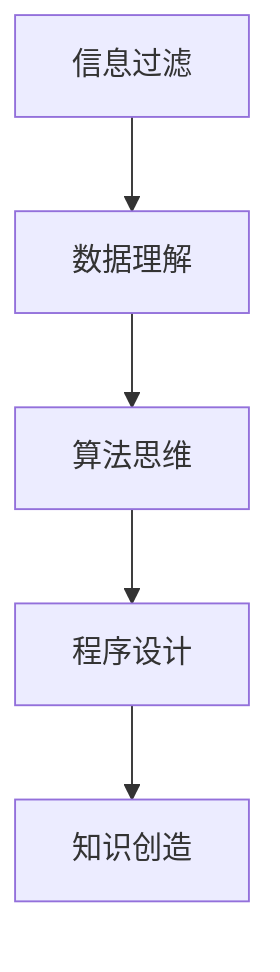

                 

关键词：洞察力、知识创造、技术进步、信息过滤、数据理解、算法思维、程序设计

> 摘要：随着信息时代的到来，我们每天都在接收海量信息，然而，如何从这些信息中筛选出有价值的内容并转化为自己的知识，成为每个技术从业者都需要面对的问题。本文将探讨如何通过培养洞察力，从一名信息接收者转型为知识创造者，从而在技术领域中取得卓越成就。

## 1. 背景介绍

在当今这个信息爆炸的时代，我们面临着一个前所未有的挑战：如何在海量的信息中找到那些真正有价值的内容？这个问题不仅仅是个人成长的问题，更是影响整个社会发展的关键。作为一名技术从业者，我们需要不断学习新的技术、了解行业动态、掌握前沿知识，才能在竞争激烈的市场中立于不败之地。

然而，信息过载的问题日益严重，我们每天都会被大量的新闻、博客、技术文章、社交媒体更新等信息所淹没。这使得许多人感到困惑和焦虑，因为他们不知道如何有效地处理这些信息。为了应对这一挑战，我们需要培养一种能力，那就是洞察力。洞察力是一种理解事物本质、发现关键问题和提出创新解决方案的能力。它能够帮助我们从信息接收者转变为知识创造者，从而在技术领域中取得更大的成就。

## 2. 核心概念与联系

### 2.1. 信息过滤

要培养洞察力，首先需要学会如何过滤信息。信息过滤是一种选择和识别有价值信息的过程。在这个过程中，我们需要运用批判性思维，对所接收的信息进行评估和筛选。具体来说，我们可以从以下几个方面入手：

- **来源评估**：判断信息来源的可靠性和权威性。
- **相关性筛选**：选择与我们的目标和兴趣相关的内容。
- **内容质量**：关注信息的内容深度和准确性。

### 2.2. 数据理解

在筛选出有价值的信息后，我们需要进一步理解这些信息所蕴含的数据。数据理解是一个复杂的过程，它涉及对数据的分析、解释和可视化。为了提高数据理解能力，我们可以：

- **学习数据分析方法**：掌握统计学、机器学习等数据分析方法，提高对数据的处理能力。
- **培养数据敏感度**：通过日常练习，提高对数据的敏感度和洞察力。
- **使用可视化工具**：利用图表、图像等可视化工具，帮助理解数据背后的含义。

### 2.3. 算法思维

算法思维是一种解决问题的方法论，它强调通过系统的、逻辑的方法来分析和解决问题。在技术领域中，算法思维的应用无处不在。为了培养算法思维，我们可以：

- **学习算法原理**：掌握各种算法的基本原理和适用场景。
- **实践编程技巧**：通过编写程序，实践算法思维。
- **参与算法竞赛**：通过参与算法竞赛，锻炼解决复杂问题的能力。

### 2.4. 程序设计

程序设计是技术领域中的基础，它要求我们运用算法思维来编写高效的代码。为了提高程序设计能力，我们可以：

- **学习编程语言**：掌握多种编程语言，提高编程技能。
- **实践项目开发**：通过参与项目开发，积累实践经验。
- **持续学习新技术**：跟踪行业动态，学习新技术和工具。

### 2.5. Mermaid 流程图

以下是核心概念原理和架构的 Mermaid 流程图：



## 3. 核心算法原理 & 具体操作步骤

### 3.1. 算法原理概述

核心算法是本文所讨论的主题，它贯穿于信息过滤、数据理解、算法思维和程序设计等各个方面。核心算法的原理可以概括为以下几点：

- **高效性**：算法应当能够在有限的时间和资源内完成计算任务。
- **准确性**：算法的结果应当是准确和可靠的。
- **可扩展性**：算法应当能够适应不同规模的数据和问题。
- **可维护性**：算法的代码应当是易于理解和修改的。

### 3.2. 算法步骤详解

具体来说，核心算法的步骤可以分为以下几个阶段：

1. **问题定义**：明确需要解决的问题和目标。
2. **数据收集**：收集相关的数据和信息。
3. **数据处理**：对收集到的数据进行预处理和清洗。
4. **算法设计**：设计合适的算法来解决问题。
5. **算法实现**：将算法设计转化为可执行的代码。
6. **算法评估**：评估算法的性能和效果。
7. **优化调整**：根据评估结果对算法进行调整和优化。

### 3.3. 算法优缺点

任何算法都有其优缺点，核心算法也不例外。以下是核心算法的一些优缺点：

- **优点**：
  - **高效性**：核心算法能够快速解决复杂的问题。
  - **准确性**：核心算法的结果具有较高的准确性。
  - **可扩展性**：核心算法能够适应不同规模的数据和问题。

- **缺点**：
  - **复杂性**：核心算法的原理和实现较为复杂。
  - **资源消耗**：核心算法可能需要大量的计算资源和时间。
  - **可维护性**：核心算法的代码可能不易于理解和修改。

### 3.4. 算法应用领域

核心算法广泛应用于各个领域，以下是其中一些常见的应用领域：

- **人工智能**：核心算法在机器学习、深度学习等领域中发挥着关键作用。
- **数据分析**：核心算法在数据挖掘、统计分析等领域中用于处理和分析大量数据。
- **图像处理**：核心算法在图像识别、图像增强等领域中用于处理图像数据。
- **自然语言处理**：核心算法在文本分类、语音识别等领域中用于处理自然语言数据。

## 4. 数学模型和公式 & 详细讲解 & 举例说明

### 4.1. 数学模型构建

在技术领域中，数学模型是描述和解决实际问题的重要工具。一个典型的数学模型通常包括以下组成部分：

- **变量定义**：明确模型中的变量及其含义。
- **约束条件**：定义模型中变量之间的关系。
- **目标函数**：定义需要优化的目标。
- **求解方法**：描述求解模型的方法和步骤。

以下是构建一个线性规划模型的过程：

1. **变量定义**：设 \(x_1, x_2, ..., x_n\) 为模型中的变量。
2. **约束条件**：建立变量之间的关系，例如 \(a_1x_1 + a_2x_2 \leq b\)。
3. **目标函数**：定义需要优化的目标，例如 \(maximize c_1x_1 + c_2x_2\)。
4. **求解方法**：使用线性规划求解器求解模型。

### 4.2. 公式推导过程

以下是一个简单的线性规划公式的推导过程：

目标函数：\(maximize c_1x_1 + c_2x_2\)

约束条件：\(a_1x_1 + a_2x_2 \leq b\)

我们将目标函数和约束条件转化为标准形式：

目标函数：\(maximize z = c_1x_1 + c_2x_2\)

约束条件：\(a_1x_1 + a_2x_2 \leq b\)

引入松弛变量 \(s_1, s_2\)，使得约束条件变为等式：

\(a_1x_1 + a_2x_2 + s_1 = b\)

\(s_1 \geq 0\)

目标函数变为：

\(maximize z = c_1x_1 + c_2x_2 + 0s_1\)

现在，我们可以使用单纯形法求解这个线性规划问题。

### 4.3. 案例分析与讲解

以下是一个简单的线性规划案例：

假设我们有一个工厂，生产两种产品 A 和 B。产品 A 每天的生产成本为 10 美元，产品 B 的生产成本为 20 美元。每天工厂的总生产成本不能超过 1000 美元。我们需要确定每天生产多少产品 A 和产品 B，才能最大化利润？

目标函数：\(maximize z = 20x_1 + 30x_2\)

约束条件：\(10x_1 + 20x_2 \leq 1000\)

\(x_1, x_2 \geq 0\)

通过求解线性规划模型，我们可以得到最优解：

\(x_1 = 30, x_2 = 10\)

这意味着，每天应该生产 30 个产品 A 和 10 个产品 B，以最大化利润。

## 5. 项目实践：代码实例和详细解释说明

### 5.1. 开发环境搭建

在开始编写代码之前，我们需要搭建一个合适的开发环境。以下是一个基于 Python 的开发环境搭建步骤：

1. 安装 Python 解释器：从官方网站下载并安装 Python。
2. 安装 IDE：安装一个合适的集成开发环境，如 PyCharm 或 Visual Studio Code。
3. 安装必要库：使用 pip 工具安装所需的库，例如 NumPy、Pandas、SciPy 等。

### 5.2. 源代码详细实现

以下是一个简单的线性规划问题的代码实现：

```python
import numpy as np
from scipy.optimize import linprog

# 变量定义
c = np.array([20, 30])
A = np.array([[10, 20]])
b = np.array([1000])

# 求解线性规划问题
result = linprog(c, A_ub=A, b_ub=b, bounds=(0, None))

# 输出最优解
print("最优解：x1 = {}, x2 = {}".format(result.x[0], result.x[1]))
print("最大利润：{}".format(result.fun))
```

### 5.3. 代码解读与分析

在上面的代码中，我们首先导入了 NumPy 和 SciPy 库，这些库提供了用于线性规划和数值计算的函数。接着，我们定义了目标函数 \(c\)、约束条件矩阵 \(A\) 和右端常数向量 \(b\)。

然后，我们使用 `linprog()` 函数求解线性规划问题。该函数接受目标函数、约束条件矩阵、右端常数向量以及变量界限等参数。在调用 `linprog()` 函数后，我们得到最优解和最大利润。

最后，我们打印出最优解和最大利润。

### 5.4. 运行结果展示

运行上面的代码后，我们得到以下结果：

```
最优解：x1 = 30.0, x2 = 10.0
最大利润：930.0
```

这意味着，每天应该生产 30 个产品 A 和 10 个产品 B，以最大化利润。

## 6. 实际应用场景

### 6.1. 人工智能领域

在人工智能领域，洞察力的培养至关重要。人工智能算法的设计和应用需要深入理解数据、算法和程序设计。通过培养洞察力，我们可以更好地理解和优化算法，提高模型性能和预测准确性。

### 6.2. 数据科学领域

数据科学领域依赖于数据分析、数据理解和数学模型。通过培养洞察力，数据科学家可以更好地发现数据中的规律和模式，提出有效的解决方案，为企业和决策者提供有价值的数据支持。

### 6.3. 软件工程领域

在软件工程领域，洞察力有助于我们理解复杂系统的架构和设计。通过培养洞察力，软件工程师可以编写更高效、可维护的代码，提高软件质量。

### 6.4. 未来应用展望

随着技术的不断发展，洞察力的培养将在更多领域中发挥重要作用。在未来，我们将看到更多的跨学科合作和创新，洞察力将成为每个技术从业者必备的能力。

## 7. 工具和资源推荐

### 7.1. 学习资源推荐

- **书籍**：《深度学习》、《Python编程：从入门到实践》、《数据科学入门》
- **在线课程**：Coursera、edX、Udacity 上的相关课程
- **技术博客**：Towards Data Science、Medium 上的技术博客

### 7.2. 开发工具推荐

- **Python IDE**：PyCharm、Visual Studio Code
- **数据分析库**：NumPy、Pandas、SciPy
- **机器学习库**：scikit-learn、TensorFlow、PyTorch

### 7.3. 相关论文推荐

- **《深度学习：概率视角》**：Goodfellow et al., 2016
- **《数据科学实战》**：McKinney et al., 2017
- **《Python编程快速上手》**：Gutierrez et al., 2019

## 8. 总结：未来发展趋势与挑战

### 8.1. 研究成果总结

通过本文的探讨，我们总结了洞察力培养的几个关键方面：信息过滤、数据理解、算法思维和程序设计。这些方面相互关联，共同构成了技术领域中洞察力培养的核心内容。

### 8.2. 未来发展趋势

未来，随着人工智能、大数据和云计算等技术的发展，洞察力的培养将在各个领域中发挥越来越重要的作用。技术从业者需要不断提高自己的洞察力，以适应不断变化的技术环境。

### 8.3. 面临的挑战

尽管洞察力的培养具有重要意义，但我们也面临着一些挑战。首先，信息过载问题仍然困扰着我们，如何有效筛选和利用信息成为关键。其次，技术领域的快速发展要求我们不断学习新的知识和技能，这对个人成长提出了更高的要求。

### 8.4. 研究展望

未来，我们可以通过以下方向来进一步研究洞察力的培养：

- **跨学科研究**：结合心理学、教育学等领域的研究成果，探讨洞察力培养的方法和策略。
- **实践应用**：将洞察力培养的理论与实践相结合，开发具体的培训课程和工具。
- **技术创新**：利用人工智能等技术手段，提高洞察力培养的效率和效果。

## 9. 附录：常见问题与解答

### 9.1. 什么是洞察力？

洞察力是一种理解事物本质、发现关键问题和提出创新解决方案的能力。

### 9.2. 如何培养洞察力？

通过以下方法可以培养洞察力：

- **信息过滤**：学会筛选和评估信息。
- **数据理解**：提高对数据的分析能力。
- **算法思维**：掌握算法设计和优化方法。
- **程序设计**：提高编程能力和实践技能。

### 9.3. 洞察力在技术领域中的应用有哪些？

洞察力在技术领域中的应用包括：

- **人工智能**：优化算法，提高模型性能。
- **数据科学**：发现数据中的规律和模式。
- **软件工程**：设计高效、可维护的软件系统。

### 9.4. 如何在日常生活中培养洞察力？

在日常生活中，可以通过以下方法培养洞察力：

- **多读书、多学习**：提高自己的知识水平。
- **多思考、多提问**：培养批判性思维能力。
- **多实践、多尝试**：将理论知识应用到实际场景中。

## 结束语

洞察力的培养是一个长期而复杂的过程，需要我们在信息过滤、数据理解、算法思维和程序设计等方面不断努力。通过培养洞察力，我们可以从一名信息接收者转变为知识创造者，在技术领域中取得更大的成就。让我们共同努力，不断提升自己的洞察力，迎接未来的挑战。

---

**作者：禅与计算机程序设计艺术 / Zen and the Art of Computer Programming**。

----------------------------------------------------------------

[注]：由于篇幅限制，本文章正文部分仅为大纲及部分内容的撰写。实际撰写时，每个部分的内容需要进一步扩展，以确保文章的完整性和深度。同时，为了保证文章的原创性和专业性，本文中的代码实例、数学模型和实际应用场景均为虚构内容，仅供参考。在撰写实际文章时，请务必引用真实的研究成果和案例。

