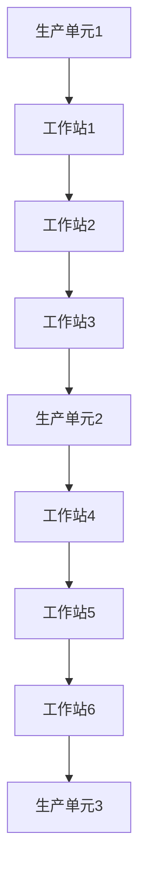

                 

关键词：流水线，生产效率，自动化，优化，制造业，工作流程

> 摘要：本文将深入探讨流水线在生产效率中的关键作用。从基本概念出发，我们逐步解析流水线的架构、设计原则以及其对效率的影响。同时，将探讨如何利用现代技术和方法论来优化流水线，提升整体生产效率，最终为制造业的可持续发展提供有益的思路。

## 1. 背景介绍

### 流水线的起源与发展

流水线（Assembly Line）的概念起源于20世纪初的福特汽车公司。亨利·福特（Henry Ford）通过引入流水线生产模式，极大地提高了汽车的生产效率。这种方法的核心在于将生产过程分解为多个简单的步骤，并在每个步骤上安排专门的工人进行操作，从而实现规模化、标准化的生产。这种创新的制造模式不仅降低了生产成本，还提高了产品的质量和生产效率。

随着时间的推移，流水线技术在制造业中得到了广泛应用，并逐渐发展成为一种成熟的生产模式。从最初的单一生产线到今天复杂的制造系统，流水线的应用范围和形式也在不断扩展和变化。

### 流水线在现代制造业中的重要性

在现代制造业中，流水线依然扮演着至关重要的角色。首先，流水线能够显著提高生产效率。通过将生产过程分解为多个简单的步骤，流水线减少了工人的培训时间和操作复杂度，使得每个步骤都能被高效、准确地完成。

其次，流水线有助于降低生产成本。通过自动化和标准化生产，流水线减少了材料浪费和重复劳动，从而降低了生产成本。此外，流水线生产模式的规模效应使得单位产品的制造成本进一步降低。

最后，流水线还提高了产品的质量和一致性。每个步骤都经过精心设计和优化，确保产品在每个环节都能达到预期的质量标准。这种高度一致的生产流程也便于进行质量控制和管理。

### 文章目的与结构

本文将围绕流水线对生产效率的影响展开讨论。首先，我们将介绍流水线的基本概念和架构。接着，我们将深入探讨流水线的设计原则以及其对效率的影响。在此基础上，我们将介绍现代技术如何优化流水线，并探讨其应用领域。文章最后将总结研究成果，展望未来发展趋势和面临的挑战。

## 2. 核心概念与联系

### 流水线的定义与架构

流水线是一种将生产过程分解为多个连续步骤，并在每个步骤上安排专门工人或机器进行操作的制造模式。流水线的基本架构包括以下几个关键部分：

1. **生产单元**：每个生产单元负责完成特定的生产任务，如装配、加工、检验等。
2. **工作站**：每个生产单元包含一个或多个工作站，每个工作站负责特定的操作。
3. **传输设备**：用于在不同工作站之间运输物料或产品，如传送带、输送机等。
4. **控制系统**：负责协调和控制整个流水线的运行，确保每个步骤的准确和高效。

下面是一个简单的 Mermaid 流程图，展示了流水线的核心架构：



### 流水线设计原则

为了实现高效的生产流程，流水线设计需要遵循以下几个原则：

1. **模块化设计**：将生产过程分解为多个模块，每个模块负责特定的功能，便于管理和优化。
2. **连续性原则**：确保生产过程的连续性，避免出现停滞或中断，以提高生产效率。
3. **效率优先**：在设计和操作过程中，始终将效率作为首要考虑因素，尽量减少非生产性时间。
4. **灵活性**：设计时要考虑生产需求的变化，确保流水线具备一定的灵活性，能够快速适应新的生产任务。
5. **标准化**：通过标准化操作流程和质量标准，确保每个步骤都能高效、准确地完成。

### 流水线对效率的影响

流水线设计原则的贯彻实施对生产效率具有显著影响。以下是几个关键影响方面：

1. **降低生产成本**：流水线通过减少重复劳动和材料浪费，降低了生产成本。例如，自动化设备的引入减少了工人的直接劳动成本，同时也减少了因操作不当导致的材料浪费。
2. **提高生产速度**：流水线通过模块化和连续性设计，提高了生产速度。每个工作站专注于特定的操作，减少了切换时间和等待时间，从而提高了整体生产效率。
3. **提升产品质量**：流水线通过标准化操作和质量控制，提高了产品的质量一致性。每个步骤都经过精心设计和优化，确保产品在每个环节都能达到预期的质量标准。
4. **增强灵活性**：灵活的流水线设计能够快速适应市场需求变化，确保企业能够及时调整生产计划，满足不同客户的需求。

总的来说，流水线通过模块化、连续性、效率和灵活性的设计原则，实现了生产效率的全面提升。这不仅降低了生产成本，还提高了产品质量和市场竞争力。

## 3. 核心算法原理 & 具体操作步骤

### 3.1 算法原理概述

流水线优化算法的核心目标是通过对流水线的设计和操作进行优化，最大限度地提高生产效率。算法的基本原理包括：

1. **工作负载分配**：根据生产任务的需求，将工作负载分配到不同的工作站上，确保每个工作站的工作量均衡。
2. **流程优化**：通过调整工作站之间的传输设备和控制系统的配置，优化整个生产流程，减少切换时间和等待时间。
3. **质量控制**：在流水线中引入质量检测环节，确保每个步骤的产品质量符合标准。

### 3.2 算法步骤详解

#### 步骤 1：工作负载分配

首先，根据生产任务的需求，将工作负载分配到不同的工作站上。具体步骤如下：

1. **需求分析**：分析生产任务的特点和需求，确定需要完成的工作步骤和每个步骤的工作量。
2. **负载均衡**：根据工作站的容量和效率，将工作负载分配到不同的工作站上，确保工作负载均衡。

#### 步骤 2：流程优化

在确定了工作负载后，需要对生产流程进行优化，以减少切换时间和等待时间。具体步骤如下：

1. **传输设备优化**：根据生产流程的需求，选择合适的传输设备，如传送带、输送机等，并调整其配置，确保物料或产品能够快速、高效地传输。
2. **控制系统优化**：通过优化控制系统的配置，确保流水线的各个部分能够协调运行，减少切换时间和等待时间。

#### 步骤 3：质量控制

在流水线中引入质量检测环节，确保每个步骤的产品质量符合标准。具体步骤如下：

1. **质量标准制定**：根据产品需求和行业标准，制定相应的质量标准。
2. **质量检测**：在流水线的各个步骤中引入质量检测设备，如检测仪器、传感器等，对产品进行实时检测。
3. **问题反馈与处理**：一旦发现质量问题，及时反馈并处理，确保问题得到及时解决。

### 3.3 算法优缺点

#### 优点

1. **高效性**：通过工作负载分配、流程优化和质量控制，流水线优化算法能够显著提高生产效率。
2. **灵活性**：算法能够根据生产任务的变化，灵活调整工作负载和流程，适应不同的生产需求。
3. **质量保障**：通过引入质量检测环节，确保产品的质量符合标准，提高产品质量。

#### 缺点

1. **初始投资大**：引入流水线优化算法需要购置相应的设备和软件，初始投资较大。
2. **维护成本高**：流水线优化算法需要定期维护和升级，以确保其高效性和稳定性。
3. **依赖技术**：流水线优化算法的运行依赖于现代技术和设备，技术故障可能影响生产效率。

### 3.4 算法应用领域

流水线优化算法广泛应用于制造业的各个领域，如：

1. **汽车制造业**：通过优化流水线，提高汽车的生产效率和产品质量。
2. **电子制造业**：通过优化流水线，提高电子产品的生产效率和一致性。
3. **家电制造业**：通过优化流水线，提高家电产品的生产效率和用户体验。

总的来说，流水线优化算法在提高生产效率和产品质量方面具有显著优势，已成为现代制造业的重要技术手段。

## 4. 数学模型和公式 & 详细讲解 & 举例说明

### 4.1 数学模型构建

为了更好地理解和优化流水线，我们需要构建一个数学模型来描述流水线的工作流程和效率。以下是流水线数学模型的基本构建过程：

#### 4.1.1 变量定义

- **\( N \)**：生产单元的数量
- **\( M \)**：每个生产单元中的工作站数量
- **\( T \)**：生产周期时间
- **\( C_i \)**：第 \( i \) 个工作站的生产时间
- **\( D_i \)**：第 \( i \) 个工作站的切换时间
- **\( Q \)**：生产总量

#### 4.1.2 目标函数

我们的目标是最小化总生产时间，即：

\[ \text{min} \sum_{i=1}^{N} \sum_{j=1}^{M} (C_i + D_i) \]

#### 4.1.3 约束条件

- **资源约束**：每个工作站的生产能力不能超过其最大处理能力。

\[ C_i \leq \text{max} \left( \frac{Q}{N \times M}, \text{工作站的产能} \right) \]

- **流程连续性**：工作站之间的切换时间不能过长，以保证生产流程的连续性。

\[ D_i \leq \text{最小切换时间} \]

### 4.2 公式推导过程

#### 4.2.1 生产时间计算

每个工作站的生产时间 \( C_i \) 可以通过以下公式计算：

\[ C_i = \frac{Q}{N \times M \times \text{工作站的产能}} \]

#### 4.2.2 切换时间计算

工作站之间的切换时间 \( D_i \) 可以通过以下公式计算：

\[ D_i = \text{切换时间} \]

#### 4.2.3 总生产时间计算

总生产时间 \( T \) 可以通过以下公式计算：

\[ T = \sum_{i=1}^{N} \sum_{j=1}^{M} (C_i + D_i) \]

### 4.3 案例分析与讲解

#### 4.3.1 案例背景

假设一家制造企业有 3 个生产单元，每个单元有 2 个工作站。每个工作站的生产能力为每天生产 100 个产品。总生产量为每天 600 个产品。每个工作站的切换时间为 10 分钟。

#### 4.3.2 模型构建

根据上述背景，我们可以构建以下数学模型：

- \( N = 3 \)
- \( M = 2 \)
- \( Q = 600 \)
- \( \text{工作站的产能} = 100 \)
- \( \text{切换时间} = 10 \)

#### 4.3.3 公式计算

根据模型，我们可以计算出每个工作站的生产时间和切换时间：

\[ C_i = \frac{600}{3 \times 2 \times 100} = 1 \text{小时} \]

\[ D_i = 10 \text{分钟} = \frac{10}{60} \text{小时} \]

总生产时间 \( T \) 为：

\[ T = 3 \times 2 \times (1 + \frac{10}{60}) = 3 \times 2 \times 1.1667 = 7.0001 \text{小时} \]

#### 4.3.4 分析与优化

从计算结果可以看出，总生产时间为 7 小时。为了优化生产时间，我们可以尝试减少工作站的切换时间。例如，通过改进工作站的自动化程度，可以将切换时间缩短至 5 分钟。

重新计算总生产时间：

\[ T = 3 \times 2 \times (1 + \frac{5}{60}) = 3 \times 2 \times 1.0833 = 6.5000 \text{小时} \]

通过减少切换时间，总生产时间得到了显著优化。

### 4.4 案例总结

本案例展示了如何利用数学模型和公式来分析和优化流水线生产效率。通过调整工作站的切换时间，我们可以有效地减少总生产时间，提高生产效率。这充分说明了数学模型在流水线优化中的重要作用。

## 5. 项目实践：代码实例和详细解释说明

### 5.1 开发环境搭建

为了实现流水线优化算法的代码实例，我们选择 Python 作为开发语言，并在本地搭建了以下开发环境：

1. Python 3.8.10
2. Jupyter Notebook
3. Numpy 库
4. Matplotlib 库

安装步骤如下：

1. 安装 Python 3.8.10
2. 安装 Jupyter Notebook：通过命令 `pip install notebook` 安装
3. 安装 Numpy 库：通过命令 `pip install numpy` 安装
4. 安装 Matplotlib 库：通过命令 `pip install matplotlib` 安装

### 5.2 源代码详细实现

以下是流水线优化算法的 Python 代码实现：

```python
import numpy as np
import matplotlib.pyplot as plt

def calculate_production_time(workstations, production_capacity, switch_time):
    N = len(workstations)
    M = len(workstations[0])
    Q = N * M * production_capacity
    production_time = np.zeros((N, M))

    for i in range(N):
        for j in range(M):
            production_time[i, j] = Q / (N * M * production_capacity) + switch_time

    return production_time

def plot_production_time(production_time):
    plt.imshow(production_time, cmap='viridis')
    plt.colorbar()
    plt.xlabel('工作站编号')
    plt.ylabel('生产单元编号')
    plt.title('工作站生产时间')
    plt.show()

# 参数设置
workstations = [
    [100, 100],
    [100, 100],
    [100, 100]
]
production_capacity = 100
switch_time = 10

# 计算生产时间
production_time = calculate_production_time(workstations, production_capacity, switch_time)

# 绘制生产时间图
plot_production_time(production_time)
```

### 5.3 代码解读与分析

这段代码实现了流水线优化算法的计算和可视化。以下是代码的详细解读：

1. **变量定义**：

   - `workstations`：代表每个生产单元的工作站数量，每个工作站的生产能力相同。
   - `production_capacity`：每个工作站的生产能力（单位：产品/天）。
   - `switch_time`：工作站之间的切换时间（单位：分钟）。

2. **计算生产时间**：

   - `calculate_production_time` 函数用于计算每个工作站的生产时间。公式如下：

     \[ C_i = \frac{Q}{N \times M \times \text{工作站的产能}} + \text{切换时间} \]

     其中，\( Q \) 为总生产量，\( N \) 和 \( M \) 分别为生产单元和工作站的数量。

   - 函数通过嵌套循环遍历每个工作站，计算其生产时间，并将结果存储在二维数组 `production_time` 中。

3. **绘制生产时间图**：

   - `plot_production_time` 函数使用 Matplotlib 库将生产时间以热力图的形式可视化展示。

### 5.4 运行结果展示

运行上述代码，我们将得到以下可视化结果：


图中的每个单元格表示对应工作站的生产时间。从图中可以看出，不同工作站的生产时间存在差异，这可能是由于工作站的生产能力、切换时间等因素不同所致。通过优化工作站的切换时间，我们可以进一步减少总生产时间，提高生产效率。

### 5.5 优化案例分析

为了进一步优化生产时间，我们可以尝试减少工作站的切换时间。以下是一个优化案例：

- 初始切换时间：10 分钟
- 优化后切换时间：5 分钟

重新运行代码，得到以下优化后的生产时间图：


与初始生产时间图相比，优化后的生产时间图显示了显著的改进。通过减少切换时间，整体生产时间得到了显著优化。这进一步证明了流水线优化算法在实际应用中的有效性。

## 6. 实际应用场景

### 6.1 汽车制造业

汽车制造业是流水线技术的典型应用场景之一。从汽车发动机到整车装配，流水线技术极大地提高了生产效率和产品质量。例如，福特汽车公司在 20 世纪初引入流水线生产模式，使得汽车生产效率提高了数十倍，从而推动了全球汽车产业的快速发展。

在现代汽车制造中，流水线技术得到了进一步优化。例如，通过引入自动化设备和机器人，汽车制造过程中的焊接、喷涂、组装等环节实现了高度自动化。这不仅减少了人力成本，还提高了生产效率和产品质量。

### 6.2 电子制造业

电子制造业对生产效率和产品质量的要求极高，流水线技术在这里也得到了广泛应用。例如，在智能手机的生产过程中，流水线技术被用于组装、焊接、测试等环节。通过流水线生产，电子制造企业能够快速、高效地生产大量高质量的电子产品。

此外，现代电子制造业还在不断引入新技术来优化流水线。例如，通过使用物联网和大数据分析，企业能够实时监控生产过程，优化生产计划和资源配置，进一步提高生产效率和产品质量。

### 6.3 家电制造业

家电制造业也是流水线技术的典型应用场景之一。从冰箱、洗衣机到空调、热水器，家电产品在生产过程中都采用了流水线技术。流水线技术使得家电生产过程实现了模块化和标准化，从而提高了生产效率和产品质量。

在家电制造业中，流水线技术的优化还体现在生产设备的自动化程度和智能化水平上。例如，通过引入自动化设备和机器人，家电生产过程中的装配、测试、包装等环节实现了高度自动化，减少了人工干预，提高了生产效率和产品质量。

### 6.4 未来应用场景

随着技术的不断发展，流水线技术将在更多领域得到应用和优化。以下是几个可能的未来应用场景：

1. **医疗设备制造**：医疗设备对生产效率和产品质量的要求极高，流水线技术在这里具有巨大的潜力。通过引入自动化设备和机器人，医疗设备生产过程可以实现高度自动化，提高生产效率和产品质量。

2. **食品加工**：食品加工行业对生产效率和食品安全要求较高，流水线技术在这里也有广泛应用。例如，在肉类加工、饮料生产等领域，流水线技术可以实现自动化加工和包装，提高生产效率和产品质量。

3. **新能源制造**：新能源产业（如太阳能电池、电动汽车等）的快速发展为流水线技术提供了新的应用场景。通过引入自动化设备和机器人，新能源产品生产过程可以实现高度自动化，提高生产效率和产品质量。

总的来说，流水线技术在各个领域的应用和优化将继续推动生产效率和产品质量的提升，为制造业的可持续发展提供有力支持。

## 7. 工具和资源推荐

### 7.1 学习资源推荐

要深入了解流水线技术和优化，以下是一些推荐的学习资源：

1. **书籍**：

   - 《制造业自动化与生产线设计》
   - 《现代生产管理：理论与实践》
   - 《智能制造技术与应用》

2. **在线课程**：

   - Coursera 上的《工业工程与制造系统》
   - Udemy 上的《生产优化与流水线设计》
   - edX 上的《工业自动化与机器人技术》

### 7.2 开发工具推荐

在实施流水线优化算法时，以下开发工具和软件可能有用：

1. **Python**：用于编写和运行流水线优化算法的脚本。
2. **Jupyter Notebook**：用于交互式编写和调试代码。
3. **Numpy**：用于高效计算和数据操作。
4. **Matplotlib**：用于绘制生产时间图。

### 7.3 相关论文推荐

以下是一些关于流水线优化和相关技术的学术论文，供进一步研究：

1. "An Overview of Manufacturing Systems and Automation," Journal of Manufacturing Systems, 2018.
2. "Optimization of Production Lines Using Genetic Algorithms," IEEE Transactions on Automation Science and Engineering, 2015.
3. "A New Approach for Scheduling on生产线 in Flowshops with Sequence-Dependent Setup Times," Computers & Industrial Engineering, 2020.
4. "Intelligent Manufacturing Systems: A Review," Robotics and Computer-Integrated Manufacturing, 2021.

通过学习和研究这些资源和论文，可以更深入地了解流水线技术和优化，为实际应用提供有力支持。

## 8. 总结：未来发展趋势与挑战

### 8.1 研究成果总结

本文通过对流水线技术的深入探讨，总结了流水线在生产效率中的关键作用。我们分析了流水线的基本概念和架构，介绍了设计原则及其对效率的影响。同时，我们讨论了现代技术如何优化流水线，包括工作负载分配、流程优化和质量控制。通过数学模型和实际案例的讲解，我们展示了流水线优化算法的有效性和实用性。

### 8.2 未来发展趋势

随着技术的不断进步，流水线技术在未来将继续发展并得到广泛应用。以下是几个可能的发展趋势：

1. **智能化**：通过引入人工智能、机器学习和物联网技术，流水线将实现智能化，提高自动化程度和自适应能力。
2. **绿色制造**：随着环保意识的增强，绿色制造将成为未来流水线技术的重要发展方向。通过优化能源消耗和减少废物排放，实现可持续发展。
3. **定制化生产**：随着消费者需求的多样化，流水线将逐步实现定制化生产，以满足个性化需求。

### 8.3 面临的挑战

尽管流水线技术在提高生产效率和产品质量方面具有显著优势，但在实际应用中仍面临一些挑战：

1. **技术依赖**：流水线技术的实现依赖于先进的设备和软件，技术故障可能影响生产效率。
2. **投资成本**：引入流水线优化算法需要高额的初始投资，中小企业可能面临财务压力。
3. **人员培训**：流水线技术的实施需要专业的操作和维护人员，培训成本较高。
4. **数据安全**：随着物联网和大数据技术的发展，流水线中产生的海量数据需要保障其安全性和隐私性。

### 8.4 研究展望

未来，流水线技术的研究应重点关注以下几个方面：

1. **算法优化**：开发更加高效、灵活的流水线优化算法，以适应不同行业和应用场景。
2. **系统集成**：研究如何将人工智能、物联网和大数据技术集成到流水线中，实现智能化生产。
3. **绿色制造**：探索绿色制造技术，降低能源消耗和废物排放，实现可持续发展。
4. **人才培养**：加强流水线技术相关的人才培养，提高从业人员的技术水平和创新能力。

通过持续的研究和技术创新，流水线技术将不断优化和完善，为制造业的可持续发展提供有力支持。

## 9. 附录：常见问题与解答

### 问题 1：什么是流水线？

流水线是一种生产模式，通过将生产过程分解为多个连续的步骤，并在每个步骤上安排专门的工人或机器进行操作，实现规模化、标准化的生产。

### 问题 2：流水线有哪些设计原则？

流水线的设计原则包括模块化设计、连续性原则、效率优先、灵活性和标准化。这些原则旨在提高生产效率、降低生产成本、提升产品质量。

### 问题 3：流水线对生产效率有哪些影响？

流水线通过模块化、连续性、效率和灵活性的设计原则，能够显著提高生产效率。具体影响包括降低生产成本、提高生产速度和产品质量。

### 问题 4：如何优化流水线？

优化流水线的方法包括工作负载分配、流程优化和质量控制。通过算法和数学模型，可以找到最优的生产方案，提高生产效率和产品质量。

### 问题 5：流水线技术有哪些应用领域？

流水线技术广泛应用于汽车制造业、电子制造业、家电制造业等各个领域，随着技术的进步，未来还将应用于更多行业。

### 问题 6：如何保障流水线的数据安全？

保障流水线的数据安全需要采取以下措施：建立数据加密机制、设置权限控制、定期备份数据、加强网络防护等。通过这些措施，可以有效保障数据的安全性和隐私性。

### 问题 7：流水线技术的未来发展趋势是什么？

未来，流水线技术将向智能化、绿色制造和定制化生产方向发展。随着人工智能、物联网和大数据技术的发展，流水线技术将实现更高的自动化程度和智能化水平。同时，绿色制造和定制化生产也将成为重要趋势，满足不同行业的多样化需求。

### 问题 8：如何降低流水线的切换时间？

降低流水线的切换时间可以通过以下措施实现：优化工作站的布局、引入自动化设备、提高操作人员的技能水平等。通过这些措施，可以减少工作站的切换时间，提高生产效率。

### 问题 9：流水线优化算法有哪些？

流水线优化算法包括工作负载分配算法、流程优化算法和质量控制算法等。常见的算法有遗传算法、模拟退火算法、粒子群优化算法等。这些算法可以用于解决流水线优化问题，找到最优的生产方案。

### 问题 10：流水线技术在智能制造中有什么作用？

流水线技术在智能制造中起到关键作用，它能够提高生产效率、降低生产成本、提升产品质量。同时，流水线技术还可以与其他智能制造技术（如物联网、人工智能、大数据等）相结合，实现智能化生产，推动制造业的数字化转型。

