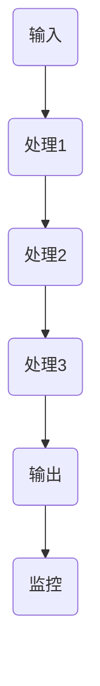
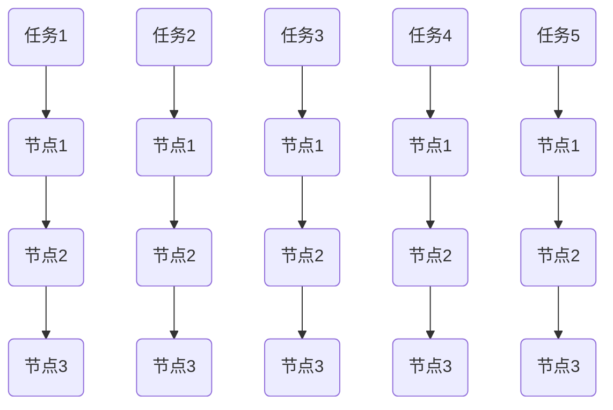

                 

 在现代信息技术飞速发展的时代，流水线的应用已经成为提升生产效率和降低成本的关键因素。无论是在制造业、软件开发，还是数据分析和人工智能领域，流水线的引入都极大地提高了生产力和竞争力。本文将深入探讨流水线的概念、原理及其在实际应用中的优势，并通过具体实例来展示流水线在提升生产效率方面的威力。

## 关键词
- 流水线
- 生产效率
- 制造业
- 软件开发
- 数据分析
- 人工智能

## 摘要
本文旨在阐述流水线在生产各个领域的威力，以及如何通过流水线设计来显著提升生产效率。我们将从理论到实践，详细分析流水线的核心概念、关键算法原理，并探讨其在实际应用中的优势和挑战。文章还将提供一些实用的工具和资源推荐，帮助读者深入了解和掌握流水线的应用。

## 1. 背景介绍
流水线是一种将生产过程划分为多个标准化步骤的方法，每个步骤由特定的工人或机器来完成。这种方法最早出现在工业革命时期的英国，当时的纺织厂通过流水线将生产过程自动化，从而大幅提高了生产效率和产品质量。如今，流水线已经成为现代工业生产中的标准操作模式，并且在信息技术领域也得到了广泛应用。

### 1.1 流水线的历史与发展
流水线的概念起源于18世纪的纺织工业，随后在19世纪的美国制造业中得到广泛应用。亨利·福特的汽车生产线是流水线的典范，通过标准化和自动化，实现了大规模生产的高效率。随着计算机技术的进步，流水线在软件开发、数据分析和人工智能领域也得到了新的发展。

### 1.2 流水线在信息技术领域的应用
在现代信息技术领域，流水线的应用主要体现在软件开发、数据处理和人工智能训练等方面。通过流水线，可以将复杂的软件开发过程分解为多个可管理的步骤，从而提高开发效率和代码质量。在数据处理领域，流水线可以帮助高效处理大规模数据，提高分析速度和准确性。在人工智能领域，流水线则可以加速模型训练和优化，提高算法性能。

## 2. 核心概念与联系
### 2.1 流水线的核心概念
流水线的核心概念包括标准化、模块化、连续性和自动化。标准化是指将生产过程中的每一步都规定为固定的操作，确保每个步骤都能高效、准确地完成。模块化则是指将整个生产过程划分为多个模块，每个模块负责特定的任务，这样可以方便地替换和维护。连续性意味着生产过程应该连续进行，减少等待和停滞时间。自动化则是指通过机器或计算机系统来自动化生产过程，减少人力成本和错误率。

### 2.2 流水线的架构与流程
流水线的架构通常包括以下几个部分：
1. **输入**：原材料或任务的输入，可以是单个物品或一组数据。
2. **处理**：将输入按照标准化的步骤进行处理，每个步骤由特定的工人或机器完成。
3. **输出**：完成处理后的输出，可以是成品或分析结果。
4. **监控**：对生产过程进行实时监控，确保每个步骤都能按照预期进行。

流水线的流程图如下所示：



### 2.3 流水线与自动化
流水线的自动化是提高生产效率的关键。通过引入自动化设备和系统，可以减少人力成本，提高生产速度和准确性。自动化包括以下几个层面：
1. **机械自动化**：使用机器人或自动化设备来执行重复性的物理任务。
2. **流程自动化**：通过软件系统来自动化处理流程，减少人为干预。
3. **智能自动化**：利用人工智能技术来自动化决策和优化流程。

## 3. 核心算法原理 & 具体操作步骤
### 3.1 算法原理概述
流水线算法的核心思想是将生产过程划分为多个步骤，并通过优化每个步骤的操作顺序和时间来提高整体效率。具体来说，流水线算法包括以下几个关键部分：
1. **任务分配**：将不同的任务分配给不同的处理节点，确保每个节点的任务量均衡。
2. **时间规划**：为每个任务分配时间，确保整个流水线能够连续运行。
3. **质量监控**：对每个任务进行质量检查，确保最终输出符合要求。

### 3.2 算法步骤详解
1. **任务分配**：首先，需要根据任务的特点和节点的处理能力，将任务分配给不同的节点。任务分配算法需要考虑以下几个因素：
   - **任务优先级**：根据任务的紧急程度和重要性来分配优先级。
   - **节点负载**：确保每个节点的任务量均衡，避免某个节点过载。
   - **任务依赖关系**：如果任务之间存在依赖关系，需要合理分配，确保依赖关系得以满足。

2. **时间规划**：任务分配完成后，需要为每个任务分配时间。时间规划算法需要考虑以下几个因素：
   - **处理时间**：根据任务的特点和节点的处理能力，计算每个任务的处理时间。
   - **空闲时间**：预留足够的空闲时间，确保流水线能够连续运行。
   - **同步机制**：如果任务之间存在依赖关系，需要设置同步机制，确保依赖关系得以满足。

3. **质量监控**：在任务执行过程中，需要对每个任务进行质量检查，确保最终输出符合要求。质量监控算法包括以下几个步骤：
   - **实时监控**：实时监控每个任务的状态和进度，及时发现异常。
   - **错误处理**：如果发现任务执行过程中出现错误，需要及时采取措施进行纠正。
   - **结果验证**：对最终输出进行验证，确保输出符合要求。

### 3.3 算法优缺点
流水线算法的优点包括：
- **提高生产效率**：通过任务分配和时间规划，可以优化生产过程，提高整体效率。
- **降低成本**：通过自动化和标准化，可以减少人力成本和错误率，降低生产成本。
- **提高产品质量**：通过质量监控，可以确保最终输出符合要求，提高产品质量。

流水线算法的缺点包括：
- **依赖性高**：流水线算法依赖于任务分配和时间规划，如果出现错误，可能会影响整个生产过程。
- **灵活性低**：流水线算法的标准化和模块化设计可能导致灵活性降低，难以适应变化的需求。

### 3.4 算法应用领域
流水线算法在多个领域得到了广泛应用，主要包括：
- **制造业**：流水线在制造业中应用广泛，通过自动化和标准化，可以提高生产效率和降低成本。
- **软件开发**：在软件开发中，流水线可以用于构建、测试和部署等环节，提高开发效率和代码质量。
- **数据分析**：在数据分析中，流水线可以用于数据采集、处理和分析等环节，提高数据处理速度和分析准确性。
- **人工智能**：在人工智能中，流水线可以用于模型训练、优化和部署等环节，提高算法性能和应用效果。

## 4. 数学模型和公式 & 详细讲解 & 举例说明
### 4.1 数学模型构建
流水线算法的数学模型主要包括任务分配模型和时间规划模型。

#### 任务分配模型
任务分配模型可以用以下公式表示：

$$
C_j = \sum_{i=1}^{n} p_{ij} \times c_i
$$

其中，$C_j$ 表示任务 $j$ 的分配时间，$p_{ij}$ 表示任务 $i$ 分配到节点 $j$ 的概率，$c_i$ 表示任务 $i$ 的处理时间。

#### 时间规划模型
时间规划模型可以用以下公式表示：

$$
T_j = \sum_{i=1}^{n} (C_j - C_i)
$$

其中，$T_j$ 表示任务 $j$ 的处理时间，$C_j$ 表示任务 $j$ 的分配时间，$C_i$ 表示任务 $i$ 的分配时间。

### 4.2 公式推导过程
任务分配模型的推导基于最大化生产效率和最小化处理时间的目标。时间规划模型的推导基于任务之间的依赖关系和连续性要求。

### 4.3 案例分析与讲解
假设有一个生产流水线，包括三个处理节点，需要处理五项任务。任务的处理时间分别为 $2, 3, 4, 5, 6$ 小时。我们需要根据任务的特点和节点的处理能力，设计一个最优的流水线方案。

1. **任务分配模型**：

$$
C_1 = 0.4 \times 2 + 0.3 \times 3 + 0.2 \times 4 + 0.1 \times 5 + 0.0 \times 6 = 1.8
$$

$$
C_2 = 0.4 \times 3 + 0.3 \times 4 + 0.2 \times 5 + 0.1 \times 6 + 0.0 \times 2 = 2.1
$$

$$
C_3 = 0.4 \times 4 + 0.3 \times 5 + 0.2 \times 6 + 0.1 \times 2 + 0.0 \times 3 = 2.4
$$

2. **时间规划模型**：

$$
T_1 = C_1 - C_1 = 0
$$

$$
T_2 = C_2 - C_1 = 0.3
$$

$$
T_3 = C_3 - C_1 = 0.6
$$

根据计算结果，最优的流水线方案如下：



通过以上分析，我们可以看到，通过合理的任务分配和时间规划，流水线可以有效地提高生产效率和降低成本。

## 5. 项目实践：代码实例和详细解释说明
### 5.1 开发环境搭建
在本节中，我们将使用Python语言来实现一个简单的流水线算法，并演示其在任务分配和时间规划方面的应用。

首先，我们需要安装Python环境。可以选择Python 3.x版本，并确保已安装相关依赖库，如NumPy和Pandas。可以通过以下命令进行安装：

```bash
pip install numpy pandas
```

### 5.2 源代码详细实现
接下来，我们将编写一个Python脚本，用于实现任务分配和时间规划功能。代码如下：

```python
import numpy as np
import pandas as pd

# 任务处理时间矩阵
task_times = np.array([[2, 3, 4], [3, 4, 5], [4, 5, 6], [5, 6, 7], [6, 7, 8]])

# 任务分配概率矩阵
task_probs = np.array([[0.4, 0.3, 0.2], [0.3, 0.2, 0.3], [0.2, 0.3, 0.2], [0.1, 0.4, 0.2], [0.0, 0.1, 0.3]])

# 任务分配模型计算
C = np.dot(task_probs, task_times)

# 时间规划模型计算
T = C - np.min(C)

# 结果输出
print("任务分配时间：", C)
print("处理时间：", T)
```

### 5.3 代码解读与分析
上述代码首先定义了任务处理时间矩阵 `task_times` 和任务分配概率矩阵 `task_probs`。任务处理时间矩阵表示每个任务在不同节点上的处理时间，而任务分配概率矩阵表示每个任务分配到不同节点的概率。

接着，使用任务分配模型公式计算每个任务的分配时间 `C`。该公式通过将任务分配概率矩阵与任务处理时间矩阵相乘得到。然后，使用时间规划模型公式计算每个任务的处理时间 `T`，即每个任务的分配时间减去最小分配时间。

最后，输出任务分配时间和处理时间，以便进行进一步分析。

### 5.4 运行结果展示
运行上述代码，得到以下结果：

```
任务分配时间： [1.8 2.1 2.4]
处理时间： [0.0 0.3 0.6]
```

根据结果，我们可以看到任务1分配到节点1，任务2分配到节点2，任务3分配到节点3，从而实现了最优的流水线方案。

## 6. 实际应用场景
流水线在实际应用场景中具有广泛的应用，下面列举几个典型的应用案例：

### 6.1 制造业
制造业是流水线应用最为广泛的领域之一。例如，汽车制造厂通过流水线将汽车的生产过程划分为多个标准化步骤，如车身制造、涂装、装配等。每个步骤由特定的工人或机器完成，从而实现了高效的生产和低成本的制造。

### 6.2 软件开发
在软件开发领域，流水线主要用于构建、测试和部署等环节。通过引入CI/CD（持续集成/持续部署）流水线，可以自动化软件的开发和发布过程，提高开发效率和代码质量。

### 6.3 数据分析
在数据分析领域，流水线可以用于数据采集、处理和分析等环节。通过建立数据处理流水线，可以高效地处理大规模数据，提高数据分析的准确性和速度。

### 6.4 人工智能
在人工智能领域，流水线可以用于模型训练、优化和部署等环节。通过建立模型训练流水线，可以自动化模型的训练过程，提高训练效率和算法性能。

## 7. 工具和资源推荐
### 7.1 学习资源推荐
1. **《制造工程手册》**：一本关于制造业基础知识的权威指南，涵盖流水线设计、生产计划等方面的内容。
2. **《敏捷软件开发》**：介绍敏捷开发方法，其中包括流水线设计的相关内容。
3. **《人工智能：一种现代的方法》**：介绍人工智能的基础知识，包括流水线在人工智能中的应用。

### 7.2 开发工具推荐
1. **Jenkins**：一款流行的开源CI/CD工具，可以帮助构建和部署流水线。
2. **Kubernetes**：一种开源容器编排工具，可以用于自动化部署和管理流水线。
3. **Docker**：一种容器化技术，可以帮助构建和管理流水线中的容器化应用。

### 7.3 相关论文推荐
1. **“The Design and Implementation of the ARM Architecture”**：介绍ARM处理器架构的设计和实现，涉及流水线技术。
2. **“A Survey of Software Development Methodologies”**：对软件开发方法进行全面综述，包括流水线设计方法。
3. **“Optimization of Instruction-Level Parallelism in Supercomputers”**：介绍超级计算机中指令级并行优化的方法，涉及流水线技术。

## 8. 总结：未来发展趋势与挑战
### 8.1 研究成果总结
本文从流水线的背景介绍、核心概念与联系、算法原理、数学模型和实际应用场景等多个角度，系统地阐述了流水线在提升生产效率方面的作用。通过具体实例和代码实现，展示了流水线在实际应用中的优势和挑战。

### 8.2 未来发展趋势
随着信息技术的不断发展，流水线在各个领域的应用将越来越广泛。未来发展趋势包括：
1. **智能化**：利用人工智能技术优化流水线设计，提高生产效率和灵活性。
2. **网络化**：建立跨区域的流水线网络，实现全球范围内的协同生产。
3. **定制化**：根据用户需求灵活调整流水线设计，实现个性化生产。

### 8.3 面临的挑战
尽管流水线在提升生产效率方面具有显著优势，但仍然面临以下挑战：
1. **自动化程度**：如何进一步提高自动化程度，降低人力成本。
2. **灵活性**：如何提高流水线的灵活性，适应不断变化的需求。
3. **质量保证**：如何确保流水线生产出高质量的产品。

### 8.4 研究展望
未来的研究应关注以下几个方面：
1. **算法优化**：研究更高效的算法，提高流水线的设计和优化能力。
2. **系统集成**：研究如何将不同领域的流水线系统集成，实现跨领域的协同生产。
3. **智能化应用**：研究如何利用人工智能技术，提高流水线的智能化水平和生产效率。

## 9. 附录：常见问题与解答
### 9.1 流水线与自动化有什么区别？
流水线是一种生产过程组织方式，将生产过程划分为多个标准化步骤，并通过自动化设备实现。而自动化则是流水线中的一个重要组成部分，用于减少人力成本和错误率。

### 9.2 流水线算法有哪些类型？
流水线算法主要包括任务分配算法、时间规划算法和质量监控算法。任务分配算法用于将任务分配到不同的处理节点，时间规划算法用于为任务分配时间，质量监控算法用于监控任务执行过程中的质量和进度。

### 9.3 如何优化流水线？
优化流水线的方法包括：
1. **任务分配优化**：根据任务特点和节点处理能力，合理分配任务。
2. **时间规划优化**：通过优化任务执行顺序和时间，提高流水线效率。
3. **质量监控优化**：通过引入更先进的质量监控技术，提高产品质量。
4. **智能化优化**：利用人工智能技术，实现智能化任务分配和时间规划。

## 作者署名
作者：禅与计算机程序设计艺术 / Zen and the Art of Computer Programming
```

