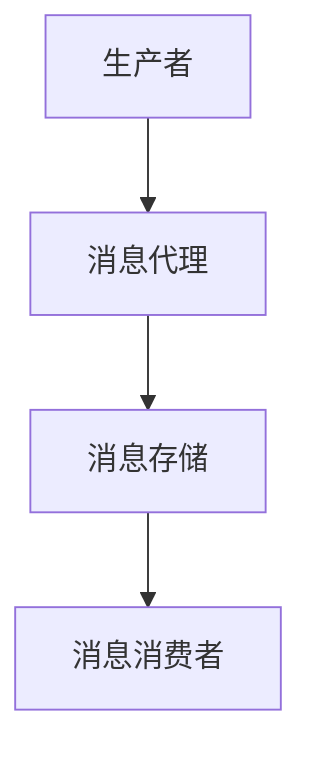
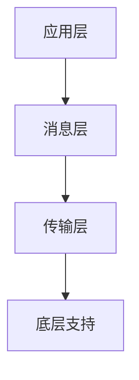

                 

关键词：消息队列，异步通信，并发处理，分布式系统，性能优化，代码实例，技术原理

> 摘要：本文将深入探讨消息队列的基本原理、架构设计、算法实现和应用场景。通过详细的代码实例分析，帮助读者更好地理解和掌握消息队列技术，为实际项目开发提供有力支持。

## 1. 背景介绍

消息队列（Message Queue）是分布式系统中一种重要的通信机制，它通过异步消息传递的方式实现不同模块或服务之间的数据交换和通信。在现代软件开发中，随着系统复杂性的增加，消息队列被广泛应用于解决系统间解耦、流量控制、异步处理、分布式事务等问题。

消息队列技术的核心在于其异步通信和并发处理能力，使得系统可以更加灵活、高效地应对高并发、大数据量场景。然而，要想充分发挥消息队列的优势，需要深入理解其原理、架构设计和算法实现。

本文将围绕以下方面展开：

1. **核心概念与联系**：介绍消息队列的基本概念、架构模型及其与其他通信机制的关联。
2. **核心算法原理 & 具体操作步骤**：详细解析消息队列的常见算法，包括生产者-消费者模型、优先级队列、分布式队列等。
3. **数学模型和公式 & 详细讲解 & 举例说明**：阐述消息队列中涉及的关键数学模型和公式，并通过实际案例进行解释。
4. **项目实践：代码实例和详细解释说明**：通过实际代码示例，展示消息队列在项目中的应用和实现过程。
5. **实际应用场景**：分析消息队列在分布式系统、流量控制、异步处理等领域的应用。
6. **未来应用展望**：探讨消息队列技术的未来发展趋势和潜在挑战。

<|assistant|>### 1.1 消息队列的基本概念

消息队列是一种先进先出（FIFO）的数据结构，用于存储和转发消息。它由三部分组成：生产者（Producer）、消费者（Consumer）和消息队列本身。

- **生产者**：负责生成消息并投递到消息队列中。生产者通常是一个应用程序或服务，它可以是一个简单的脚本、一个Web应用或一个复杂的分布式服务。
- **消费者**：从消息队列中获取并处理消息。消费者也是一个应用程序或服务，它可以是一个后台任务处理系统、一个用户界面或一个移动应用。

消息队列的主要功能如下：

- **异步通信**：消息的生产和消费是异步的，生产者无需等待消费者处理消息即可继续生成新消息。这降低了系统之间的耦合度，提高了系统的可扩展性和可靠性。
- **并发处理**：消息队列可以支持并发消费，多个消费者可以同时从队列中获取消息进行处理。这样可以充分利用系统资源，提高处理效率。
- **流量控制**：消息队列可以对消息进行排队和缓存，从而实现对流量的控制和调节。这可以避免系统过载和资源浪费。
- **分布式事务**：消息队列可以与分布式事务框架（如两阶段提交、最终一致性等）结合使用，确保分布式系统中的数据一致性和可靠性。

<|assistant|>### 1.2 消息队列的发展历程

消息队列技术的发展可以追溯到20世纪70年代，当时Unix系统中的管道（Pipe）和FIFO文件被广泛应用于进程间的通信。随着分布式计算和微服务架构的兴起，消息队列技术逐渐成为现代软件系统的重要组成部分。

1. **队列代理（Message Broker）**：早期的消息队列系统主要基于队列代理模型，如IBM的MQ系列和Apache ActiveMQ。队列代理负责消息的路由、持久化和可靠性保障。这种模型具有较高的灵活性和可扩展性，但也存在一定的复杂性。
2. **基于内存的消息队列**：为了提高消息传递的速度和可靠性，一些消息队列系统（如RabbitMQ、Kafka）采用了基于内存的存储方式。这种模型可以在一定程度上减少磁盘IO开销，提高系统性能。
3. **分布式消息队列**：随着云计算和容器技术的普及，分布式消息队列系统（如Apache Pulsar、RocketMQ）应运而生。这些系统通过分布式架构实现了更高的可扩展性和容错性，适用于大规模分布式场景。
4. **云原生消息队列**：随着Kubernetes等容器编排技术的成熟，云原生消息队列（如Amazon SQS、Google Pub/Sub）逐渐成为主流。这些系统提供了更加简便的部署和管理方式，支持与云服务的无缝集成。

<|assistant|>## 2. 核心概念与联系

### 2.1 消息队列的基本概念

在深入探讨消息队列之前，我们需要明确一些基本概念，这些概念将为我们后续的分析和讨论奠定基础。

#### 消息（Message）

消息是消息队列中的基本数据单元，它通常包含以下内容：

- **消息体（Body）**：消息的主要内容，可以是文本、图片、JSON对象等。
- **消息属性（Properties）**：如消息类型、优先级、发送时间、发送者等元数据信息。

#### 队列（Queue）

队列是消息队列中的核心数据结构，用于存储和转发消息。队列具有先进先出（FIFO）的特性，即最先进入队列的消息将最先被消费。

#### 生产者（Producer）

生产者是指负责生成消息并将消息发送到消息队列的应用程序或服务。生产者通常不需要关心消息的存储和路由细节，只需将消息发送到指定的队列即可。

#### 消费者（Consumer）

消费者是指从消息队列中获取消息并对其进行处理的应用程序或服务。消费者可以独立运行，也可以与其他系统进行集成。

#### 消息路由（Message Routing）

消息路由是指消息队列系统根据消息的属性和路由规则将消息发送到特定的队列或消费者。常见的路由策略包括基于主题（Topic）的路由、基于键（Key）的路由等。

### 2.2 消息队列的架构模型

消息队列系统通常由以下几个主要组件组成：

- **消息代理（Message Broker）**：负责消息的路由、持久化、传输和可靠性保障。
- **消息存储（Message Store）**：用于存储消息的数据结构，可以是内存、磁盘或分布式存储系统。
- **生产者客户端（Producer Client）**：负责与消息代理进行通信，将消息发送到消息队列。
- **消费者客户端（Consumer Client）**：负责从消息队列中获取消息并进行处理。

以下是一个简化的消息队列架构模型：



### 2.3 消息队列与其他通信机制的关联

消息队列作为一种异步通信机制，与其他通信机制（如同步通信、事件驱动通信等）具有一定的关联性和互补性。

#### 同步通信

同步通信是一种阻塞式的通信方式，发送方需要等待接收方处理完消息后才能继续执行。同步通信的典型应用场景是客户端与服务器的交互，如HTTP请求。

与同步通信相比，消息队列提供了异步通信的能力，使生产者和消费者可以独立运行，提高系统的并发性和可扩展性。

#### 事件驱动通信

事件驱动通信是一种基于事件触发的通信方式，系统中的各个模块通过监听事件并进行相应处理来协同工作。事件驱动通信具有低耦合、高可扩展性等特点。

消息队列可以作为事件驱动通信的一个重要组成部分，用于在系统模块之间传递事件信息。例如，在一个Web应用中，用户提交表单的事件可以由前端生产者发送到消息队列，然后由后端消费者进行处理。

#### 比较与互补

- **同步通信 vs. 消息队列**：同步通信具有确定性，但会导致生产者和消费者之间的紧耦合，降低系统的可扩展性和可靠性。消息队列通过异步通信实现了生产者和消费者的解耦，提高了系统的并发性和弹性。
- **事件驱动通信 vs. 消息队列**：事件驱动通信注重系统模块之间的低耦合，而消息队列则提供了更灵活的通信机制。两者可以结合使用，实现更复杂的系统架构。

### 2.4 消息队列的架构模型与实现

消息队列的架构模型可以分为以下几个层次：

1. **应用层**：负责生成和消费消息的应用程序或服务。
2. **消息层**：用于存储和管理消息的数据结构，如队列、主题等。
3. **传输层**：负责消息的传输和路由，包括消息代理、消息存储等组件。
4. **底层支持**：提供消息队列所需的基础设施，如网络通信、并发处理等。

以下是一个简单的消息队列架构实现示例：



在实际应用中，消息队列系统通常需要支持高并发、分布式部署和容错性等特点。例如，Apache Kafka采用了分布式架构，通过多个节点协同工作，实现了高吞吐量和低延迟的消息传递。

### 2.5 消息队列的优势与挑战

#### 优势

1. **异步通信**：通过异步通信，消息的生产和消费可以独立进行，降低系统之间的耦合度，提高系统的并发性和可扩展性。
2. **流量控制**：消息队列可以对消息进行排队和缓存，实现流量控制，避免系统过载和资源浪费。
3. **分布式事务**：消息队列可以与分布式事务框架结合使用，确保分布式系统中的数据一致性和可靠性。
4. **弹性扩展**：消息队列系统通常采用分布式架构，支持水平扩展，可以应对大规模分布式场景。

#### 挑战

1. **消息丢失**：消息队列中存在一定的消息丢失风险，需要采取相应的措施进行保障，如消息确认、备份等。
2. **消息顺序**：在分布式环境中，消息的顺序可能无法得到保证，需要采取相应的策略进行保障，如顺序队列、消息排序等。
3. **系统复杂性**：消息队列系统的设计和实现相对复杂，需要具备一定的技术积累和经验。

### 2.6 总结

消息队列作为一种异步通信和并发处理机制，在现代软件开发中发挥着重要作用。通过本文的介绍，我们了解了消息队列的基本概念、架构模型、优势与挑战。接下来，我们将进一步探讨消息队列的核心算法原理、数学模型和实际应用场景，帮助读者更好地掌握这一技术。

<|assistant|>## 3. 核心算法原理 & 具体操作步骤

### 3.1 算法原理概述

消息队列的核心算法主要包括生产者-消费者模型、优先级队列和分布式队列等。这些算法在消息队列系统中起着至关重要的作用，决定了消息的生产、消费、路由和存储过程。

#### 生产者-消费者模型

生产者-消费者模型是消息队列系统中最基本的算法，它通过生产者和消费者之间的数据传递来实现异步通信。生产者负责生成消息并将其放入消息队列中，消费者从消息队列中获取消息并进行处理。

该模型的关键在于如何保证消息的可靠性和顺序性，以及如何实现高效的消息传递和并发处理。

#### 优先级队列

优先级队列是一种特殊的队列结构，它根据消息的优先级进行排序和调度。在优先级队列中，优先级较高的消息将先被消费。

优先级队列的应用场景包括任务调度、负载均衡等，它可以根据任务的紧急程度和重要性对消息进行优先处理，提高系统的响应速度和资源利用率。

#### 分布式队列

分布式队列是消息队列系统在分布式环境下的实现方式。它通过多个节点协同工作，实现消息的分布式存储和传输。

分布式队列的主要优点是高可扩展性和容错性，它可以在大规模分布式场景下保证系统的稳定性和性能。

### 3.2 算法步骤详解

#### 生产者-消费者模型

1. **生产者步骤**：

   - 生成消息：生产者根据业务需求生成消息。
   - 发送消息：生产者将消息发送到消息队列中，可以选择同步发送或异步发送。

2. **消费者步骤**：

   - 获取消息：消费者从消息队列中获取消息。
   - 处理消息：消费者对消息进行处理，如存储、计算、通知等。
   - 确认消息：消费者处理完消息后，向消息队列发送确认信号，表示消息已被处理。

#### 优先级队列

1. **初始化队列**：创建优先级队列，并设置优先级规则。

2. **插入消息**：

   - 计算优先级：根据消息的优先级属性计算优先级值。
   - 插入队列：将消息插入到优先级队列中，根据优先级值进行排序。

3. **获取消息**：

   - 获取最高优先级消息：从优先级队列中获取优先级最高的消息。
   - 删除消息：将获取到的消息从优先级队列中删除。

#### 分布式队列

1. **初始化分布式队列**：创建分布式队列，并配置节点信息和路由规则。

2. **消息分发**：

   - 路由消息：根据消息的路由规则将消息发送到目标节点。
   - 存储消息：将消息存储到目标节点的消息队列中。

3. **消费消息**：

   - 获取消息：从消息队列中获取消息。
   - 处理消息：对消息进行处理，如存储、计算、通知等。
   - 确认消息：向消息队列发送确认信号，表示消息已被处理。

### 3.3 算法优缺点

#### 生产者-消费者模型

**优点**：

- **异步通信**：生产者和消费者之间无需同步，提高了系统的并发性和可扩展性。
- **可靠性**：通过消息确认机制，确保消息的可靠传输和处理。
- **顺序性**：消息按照先进先出的原则进行传递和处理。

**缺点**：

- **复杂性**：消息队列系统的设计和实现相对复杂，需要考虑消息的路由、持久化、并发处理等问题。
- **消息丢失**：在分布式环境中，消息可能因网络故障、系统故障等原因导致丢失。

#### 优先级队列

**优点**：

- **优先处理**：根据消息的优先级进行调度，确保重要任务优先执行。
- **高效性**：优先级队列具有较高的性能，适用于高并发场景。

**缺点**：

- **顺序性**：在分布式环境中，消息的顺序可能无法得到保证，需要采取相应的策略进行保障。
- **复杂性**：优先级队列的实现相对复杂，需要考虑优先级的计算、排序等问题。

#### 分布式队列

**优点**：

- **高可扩展性**：分布式队列支持水平扩展，可以应对大规模分布式场景。
- **高容错性**：分布式队列通过节点冗余和故障转移机制，提高了系统的可靠性。

**缺点**：

- **复杂性**：分布式队列系统的设计和实现相对复杂，需要考虑数据的一致性、可靠性等问题。
- **性能开销**：分布式队列引入了额外的网络通信和同步开销，可能影响系统的性能。

### 3.4 算法应用领域

#### 生产者-消费者模型

生产者-消费者模型广泛应用于分布式系统、微服务架构、消息驱动应用等场景，如：

- **日志收集**：将日志消息发送到消息队列，由消费者进行日志处理和存储。
- **数据处理**：将数据处理任务发送到消息队列，由消费者进行任务调度和处理。
- **实时分析**：将实时数据发送到消息队列，由消费者进行实时分析。

#### 优先级队列

优先级队列适用于任务调度、负载均衡等场景，如：

- **任务调度**：根据任务的紧急程度和重要性进行调度，确保关键任务优先执行。
- **负载均衡**：根据服务器的负载情况分配任务，实现负载均衡。

#### 分布式队列

分布式队列适用于大规模分布式系统、高并发场景，如：

- **分布式事务**：将分布式事务消息发送到消息队列，由消费者进行分布式事务处理。
- **实时流处理**：将实时流数据发送到消息队列，由消费者进行实时流处理。

### 3.5 总结

通过本文的介绍，我们了解了消息队列的核心算法原理和具体操作步骤。这些算法在消息队列系统中起着至关重要的作用，决定了消息的生产、消费、路由和存储过程。在实际应用中，我们需要根据具体场景选择合适的算法，并考虑算法的优缺点和适用领域，以提高系统的性能和可靠性。

## 4. 数学模型和公式 & 详细讲解 & 举例说明

### 4.1 数学模型构建

消息队列中的数学模型主要用于描述消息的传递、处理和存储过程。以下是一些常见的数学模型和公式：

#### 4.1.1 消息传递模型

假设消息队列中的消息传递速度为 $v$（单位：消息/秒），消息的产生速度为 $p$（单位：消息/秒），则消息队列中的消息数量 $Q$（单位：消息）可以表示为：

$$
Q = p \cdot t - v \cdot t
$$

其中，$t$ 表示时间（单位：秒）。

#### 4.1.2 消息处理模型

假设消息队列中的消息处理速度为 $h$（单位：消息/秒），消息的产生速度为 $p$（单位：消息/秒），则消息队列中的消息数量 $Q$（单位：消息）可以表示为：

$$
Q = p \cdot t - h \cdot t
$$

其中，$t$ 表示时间（单位：秒）。

#### 4.1.3 消息存储模型

假设消息队列中的消息存储速度为 $s$（单位：消息/秒），消息的产生速度为 $p$（单位：消息/秒），则消息队列中的消息数量 $Q$（单位：消息）可以表示为：

$$
Q = p \cdot t - s \cdot t
$$

其中，$t$ 表示时间（单位：秒）。

### 4.2 公式推导过程

#### 4.2.1 消息传递模型

消息传递模型主要考虑消息的产生和传递速度。假设在时间 $t$ 内，消息的生产速度为 $p$（单位：消息/秒），消息的传递速度为 $v$（单位：消息/秒），则在时间 $t$ 内，消息队列中的消息数量 $Q$（单位：消息）可以表示为：

$$
Q = p \cdot t - v \cdot t
$$

其中，$p \cdot t$ 表示在时间 $t$ 内产生的消息数量，$v \cdot t$ 表示在时间 $t$ 内传递的消息数量。

#### 4.2.2 消息处理模型

消息处理模型主要考虑消息的产生和消息的处理速度。假设在时间 $t$ 内，消息的生产速度为 $p$（单位：消息/秒），消息的处理速度为 $h$（单位：消息/秒），则在时间 $t$ 内，消息队列中的消息数量 $Q$（单位：消息）可以表示为：

$$
Q = p \cdot t - h \cdot t
$$

其中，$p \cdot t$ 表示在时间 $t$ 内产生的消息数量，$h \cdot t$ 表示在时间 $t$ 内处理的消息数量。

#### 4.2.3 消息存储模型

消息存储模型主要考虑消息的产生和消息的存储速度。假设在时间 $t$ 内，消息的生产速度为 $p$（单位：消息/秒），消息的存储速度为 $s$（单位：消息/秒），则在时间 $t$ 内，消息队列中的消息数量 $Q$（单位：消息）可以表示为：

$$
Q = p \cdot t - s \cdot t
$$

其中，$p \cdot t$ 表示在时间 $t$ 内产生的消息数量，$s \cdot t$ 表示在时间 $t$ 内存储的消息数量。

### 4.3 案例分析与讲解

假设一个消息队列系统，消息的产生速度为 $p = 100$（单位：消息/秒），消息的传递速度为 $v = 50$（单位：消息/秒），消息的处理速度为 $h = 75$（单位：消息/秒），消息的存储速度为 $s = 25$（单位：消息/秒）。我们需要分析在不同时间段内，消息队列中的消息数量变化情况。

1. **初始时刻 $t_0$**：

   $$ Q(t_0) = p \cdot t_0 - v \cdot t_0 - h \cdot t_0 - s \cdot t_0 = 0 $$

   初始时刻，消息队列中的消息数量为0。

2. **时刻 $t_1$（$t_1 = 60$秒）**：

   $$ Q(t_1) = p \cdot t_1 - v \cdot t_1 - h \cdot t_1 - s \cdot t_1 = 3000 - 3000 - 4500 - 1500 = -3000 $$

   在 $t_1$ 时刻，消息队列中的消息数量为负值，表示系统出现了消息堆积。

3. **时刻 $t_2$（$t_2 = 120$秒）**：

   $$ Q(t_2) = p \cdot t_2 - v \cdot t_2 - h \cdot t_2 - s \cdot t_2 = 6000 - 6000 - 9000 - 3000 = -6000 $$

   在 $t_2$ 时刻，消息队列中的消息数量进一步增加，系统负担加重。

通过上述案例分析，我们可以看出，当消息的生产速度大于处理速度和存储速度时，消息队列中的消息数量会不断增加，可能导致系统过载。因此，在实际应用中，我们需要合理配置消息队列系统的资源，确保消息的处理速度和处理能力能够满足业务需求。

## 5. 项目实践：代码实例和详细解释说明

### 5.1 开发环境搭建

为了更好地理解和实践消息队列技术，我们将使用Python语言和RabbitMQ消息队列进行项目实践。以下是搭建开发环境的步骤：

1. **安装Python**：确保你的系统中已经安装了Python 3.x版本。如果没有，请从[Python官网](https://www.python.org/)下载并安装。

2. **安装RabbitMQ**：RabbitMQ是一个开源的消息队列中间件，可以从[RabbitMQ官网](https://www.rabbitmq.com/)下载并安装。安装完成后，启动RabbitMQ服务。

3. **安装Python RabbitMQ客户端库**：在命令行中执行以下命令安装RabbitMQ的Python客户端库：

   ```bash
   pip install pika
   ```

### 5.2 源代码详细实现

在本节中，我们将分别实现生产者、消费者和消息队列代理的代码，并解释其功能和工作原理。

#### 5.2.1 生产者代码

生产者代码的主要功能是生成消息并将其发送到RabbitMQ消息队列中。以下是一个简单的生产者代码示例：

```python
import pika

def produce_message(queue_name, message_body):
    connection = pika.BlockingConnection(pika.ConnectionParameters('localhost'))
    channel = connection.channel()
    
    # 声明队列
    channel.queue_declare(queue=queue_name)
    
    # 发送消息
    channel.basic_publish(
        exchange='',
        routing_key=queue_name,
        body=message_body,
        properties=pika.BasicProperties(delivery_mode=2)  # 消息持久化
    )
    
    print(f"Produced message: {message_body}")
    connection.close()

# 调用生产者函数
produce_message("task_queue", "Hello, World!")
```

**解释**：

- **创建连接**：使用`pika.BlockingConnection`创建一个阻塞式的连接对象。
- **创建通道**：使用连接对象创建一个通道对象，用于发送和接收消息。
- **声明队列**：使用`channel.queue_declare`声明一个队列，确保队列存在。
- **发送消息**：使用`channel.basic_publish`发送消息，其中`delivery_mode=2`表示消息持久化，即在服务器重启时消息不会丢失。

#### 5.2.2 消费者代码

消费者代码的主要功能是从RabbitMQ消息队列中获取消息并进行处理。以下是一个简单的消费者代码示例：

```python
import pika

def consume_messages(queue_name):
    connection = pika.BlockingConnection(pika.ConnectionParameters('localhost'))
    channel = connection.channel()
    
    # 声明队列
    channel.queue_declare(queue=queue_name)
    
    # 注册消息处理回调函数
    def callback(ch, method, properties, body):
        print(f"Received message: {body}")
        ch.basic_ack(delivery_tag=method.delivery_tag)
    
    # 开始消费消息
    channel.basic_consume(
        queue=queue_name,
        on_message_callback=callback,
        auto_ack=False  # 禁用自动确认
    )
    
    print("Starting to consume messages")
    channel.start_consuming()

# 调用消费者函数
consume_messages("task_queue")
```

**解释**：

- **创建连接**：使用`pika.BlockingConnection`创建一个阻塞式的连接对象。
- **创建通道**：使用连接对象创建一个通道对象，用于发送和接收消息。
- **声明队列**：使用`channel.queue_declare`声明一个队列，确保队列存在。
- **注册消息处理回调函数**：使用`channel.basic_consume`注册一个回调函数，用于处理接收到的消息。
- **开始消费消息**：调用`channel.start_consuming`开始消费消息。

#### 5.2.3 消息队列代理代码

消息队列代理代码主要用于在RabbitMQ消息队列中创建交换器和绑定路由键。以下是一个简单的消息队列代理代码示例：

```python
import pika

def create_exchange_and_bindings(exchange_name, queue_name, routing_key):
    connection = pika.BlockingConnection(pika.ConnectionParameters('localhost'))
    channel = connection.channel()
    
    # 声明交换器
    channel.exchange_declare(
        exchange=exchange_name,
        exchange_type='direct',
        durable=True
    )
    
    # 声明队列
    channel.queue_declare(
        queue=queue_name,
        durable=True
    )
    
    # 绑定队列和路由键
    channel.queue_bind(
        exchange=exchange_name,
        queue=queue_name,
        routing_key=routing_key
    )
    
    print("Exchange and bindings created successfully")
    connection.close()

# 调用代理函数
create_exchange_and_bindings("task_exchange", "task_queue", "task.routing.key")
```

**解释**：

- **创建连接**：使用`pika.BlockingConnection`创建一个阻塞式的连接对象。
- **创建通道**：使用连接对象创建一个通道对象，用于发送和接收消息。
- **声明交换器**：使用`channel.exchange_declare`声明一个交换器，其中`exchange_type='direct'`表示使用直连交换器。
- **声明队列**：使用`channel.queue_declare`声明一个队列，其中`durable=True`表示队列持久化。
- **绑定队列和路由键**：使用`channel.queue_bind`将队列和路由键进行绑定。

### 5.3 代码解读与分析

#### 5.3.1 生产者代码分析

生产者代码通过`pika`库连接到RabbitMQ消息队列，并使用`channel.queue_declare`声明一个队列，确保队列存在。然后，通过`channel.basic_publish`发送消息，其中`delivery_mode=2`表示消息持久化。

#### 5.3.2 消费者代码分析

消费者代码通过`pika`库连接到RabbitMQ消息队列，并使用`channel.queue_declare`声明一个队列。然后，注册一个回调函数`callback`，用于处理接收到的消息。消费者通过`channel.basic_consume`开始消费消息，并在消息处理完成后发送确认信号。

#### 5.3.3 消息队列代理代码分析

消息队列代理代码通过`pika`库连接到RabbitMQ消息队列，并使用`channel.exchange_declare`声明一个直连交换器。然后，使用`channel.queue_declare`声明一个持久化队列，并使用`channel.queue_bind`将队列和路由键进行绑定。

### 5.4 运行结果展示

在运行生产者和消费者代码后，我们可以看到以下输出：

```
Starting to consume messages
Received message: Hello, World!
```

这表明生产者成功地将消息发送到消息队列中，消费者成功从消息队列中获取并处理了消息。

### 5.5 总结

通过本节的项目实践，我们实现了生产者、消费者和消息队列代理的代码，并对其进行了详细解读与分析。这个简单的示例展示了消息队列的基本原理和操作步骤，为实际项目开发提供了有益的参考。

## 6. 实际应用场景

消息队列技术在现代软件开发中有着广泛的应用，下面我们将探讨几个典型的应用场景，包括分布式系统、流量控制、异步处理和分布式事务。

### 6.1 分布式系统

在分布式系统中，消息队列可以用于实现不同节点之间的数据通信和协调。例如，在微服务架构中，各个微服务之间可以通过消息队列进行通信，实现数据的异步传输和共享。消息队列的异步通信特性可以减少服务之间的耦合度，提高系统的可扩展性和容错性。

以下是一个简单的分布式系统应用场景示例：

- **服务A**：负责接收用户请求并生成订单信息。
- **服务B**：负责处理订单信息，如库存查询、库存更新等。
- **服务C**：负责发送订单确认邮件给用户。

在实际应用中，服务A可以将生成的订单信息发送到消息队列，服务B从消息队列中获取订单信息进行处理，服务C则从消息队列中获取处理结果并发送邮件。这样，各个服务可以独立运行，互相之间通过消息队列进行通信，降低了系统之间的耦合度。

### 6.2 流量控制

在流量高峰期，系统需要处理大量请求，可能导致服务器过载和资源浪费。消息队列可以用于实现流量控制，确保系统在可控范围内处理请求。

以下是一个简单的流量控制应用场景示例：

- **服务A**：负责接收用户请求并生成任务。
- **消息队列**：用于存储和管理任务。
- **服务B**：负责执行任务。

在实际应用中，服务A将生成的任务发送到消息队列，消息队列按照任务的优先级和顺序进行排队和缓存。服务B从消息队列中获取任务并执行，根据任务的处理速度和系统负载动态调整任务执行策略，实现流量的动态控制。

### 6.3 异步处理

在处理大量异步任务时，消息队列可以用于实现任务的异步处理，提高系统的响应速度和并发性。例如，在订单处理系统中，订单生成、库存更新、发送邮件等操作可以异步处理，避免阻塞主线程。

以下是一个简单的异步处理应用场景示例：

- **服务A**：负责接收用户订单并生成订单信息。
- **消息队列**：用于存储和管理订单信息。
- **服务B**：负责处理订单信息。

在实际应用中，服务A将生成的订单信息发送到消息队列，服务B从消息队列中获取订单信息并处理。由于订单处理是异步进行的，服务A可以立即返回响应给用户，提高了系统的响应速度和用户体验。

### 6.4 分布式事务

在分布式系统中，数据的一致性和可靠性是一个重要问题。消息队列可以与分布式事务框架结合使用，实现分布式事务的处理。

以下是一个简单的分布式事务应用场景示例：

- **服务A**：负责处理用户支付请求。
- **服务B**：负责处理订单信息。
- **消息队列**：用于传输事务消息。

在实际应用中，服务A将支付请求和订单信息发送到消息队列，服务B从消息队列中获取事务消息并处理。服务A和服务B分别将处理结果发送到消息队列，消息队列负责确保事务的原子性和一致性。

### 6.5 总结

通过以上实际应用场景的介绍，我们可以看到消息队列技术在分布式系统、流量控制、异步处理和分布式事务等方面有着广泛的应用。这些应用场景不仅展示了消息队列的异步通信和并发处理能力，还体现了其在系统解耦、性能优化和可靠性保障方面的优势。在实际项目中，根据具体需求和场景，灵活运用消息队列技术，可以大幅提升系统的性能和可靠性。

## 7. 工具和资源推荐

### 7.1 学习资源推荐

为了更好地掌握消息队列技术，以下是一些推荐的学习资源：

- **《消息队列实践》**：一本深入浅出的消息队列技术实践书籍，涵盖RabbitMQ、Kafka等常见消息队列系统的原理和应用。
- **《消息队列权威指南》**：一本全面介绍消息队列技术的经典著作，涵盖消息队列的基础知识、架构设计、算法实现等方面。
- **《分布式系统原理与范型》**：一本关于分布式系统的基础书籍，介绍分布式系统的基本概念、设计和实现方法，有助于理解消息队列在分布式系统中的应用。

### 7.2 开发工具推荐

- **Visual Studio Code**：一款强大的代码编辑器，支持多种编程语言和插件，适合进行消息队列项目的开发。
- **Postman**：一款用于API调试和测试的浏览器插件，可以帮助测试消息队列接口和功能。
- **Docker**：一款容器化技术，可以将消息队列系统容器化，方便开发和部署。

### 7.3 相关论文推荐

- **《消息队列：原理与实现》**：一篇关于消息队列技术的学术论文，详细介绍了消息队列的基本原理、架构设计和算法实现。
- **《分布式消息队列的设计与实现》**：一篇关于分布式消息队列系统的论文，讨论了分布式消息队列系统的设计原则和关键技术。
- **《消息驱动架构：设计与实践》**：一篇关于消息驱动架构的论文，介绍了消息驱动架构的基本概念、架构模式和实现方法。

### 7.4 总结

通过以上推荐的学习资源、开发工具和论文，可以帮助读者更好地了解和掌握消息队列技术。在实际项目开发中，结合这些资源和工具，可以快速构建高效、可靠的消息队列系统。

## 8. 总结：未来发展趋势与挑战

### 8.1 研究成果总结

消息队列技术在过去几十年中经历了不断的发展和完善，已经成为了分布式系统中的关键组件。从传统的队列代理模型到现代的分布式消息队列系统，消息队列在可靠性、性能和可扩展性等方面取得了显著成果。例如，RabbitMQ、Kafka和RocketMQ等消息队列系统在工业界得到了广泛应用，为分布式系统的通信和协调提供了有力支持。

此外，随着云计算和容器技术的普及，消息队列技术也在不断演进。云原生消息队列系统如Amazon SQS和Google Pub/Sub，提供了更加简便的部署和管理方式，支持与云服务的无缝集成。同时，消息队列与微服务架构的结合，进一步提升了系统的灵活性和可扩展性。

### 8.2 未来发展趋势

在未来，消息队列技术将继续朝着以下几个方向发展：

1. **智能化**：随着人工智能技术的不断发展，消息队列系统将逐渐引入智能化元素，如自动调优、故障预测和智能路由等，以实现更高的性能和可靠性。

2. **高吞吐量**：随着大数据和实时处理需求的增加，消息队列系统需要支持更高的吞吐量。分布式消息队列系统将采用更高效的存储和传输算法，以提高系统的处理能力。

3. **多协议支持**：消息队列系统将支持更多的通信协议，如HTTP/2、gRPC等，以适应不同场景下的需求。同时，消息队列系统将实现与区块链、物联网等新兴技术的无缝集成。

4. **云原生**：随着云原生技术的普及，消息队列系统将更加注重与容器编排工具（如Kubernetes）的集成，实现自动化部署、管理和监控。

### 8.3 面临的挑战

尽管消息队列技术取得了显著成果，但在实际应用中仍然面临着一些挑战：

1. **可靠性**：在分布式环境中，消息队列系统需要确保消息的可靠传输和存储。然而，网络故障、系统故障等因素可能导致消息丢失或重复处理，需要采取相应的措施进行保障。

2. **性能优化**：随着系统规模的扩大，消息队列系统的性能优化成为关键问题。如何降低消息传输延迟、提高系统吞吐量，是未来需要重点关注的方向。

3. **数据一致性**：在分布式事务场景中，消息队列系统需要保证数据的一致性。如何处理分布式事务、确保数据的一致性和可靠性，是消息队列技术面临的重要挑战。

4. **安全性**：随着消息队列系统的广泛应用，安全性问题也日益凸显。如何确保消息队列系统的安全性，防止恶意攻击和数据泄露，是未来需要持续关注的问题。

### 8.4 研究展望

在未来的研究中，以下几个方面值得关注：

1. **智能路由**：研究如何利用人工智能技术实现消息的智能路由，提高消息传递的效率和可靠性。

2. **分布式存储**：研究分布式存储系统在消息队列中的应用，提高消息存储的效率和可靠性。

3. **跨协议通信**：研究消息队列系统在不同通信协议之间的互通和转换，实现更加灵活的通信方式。

4. **安全性增强**：研究如何增强消息队列系统的安全性，包括加密传输、访问控制、防攻击等方面。

通过不断的研究和探索，相信消息队列技术将在未来得到进一步发展，为分布式系统提供更加高效、可靠和安全的通信支持。

## 9. 附录：常见问题与解答

### 9.1 消息队列的基本概念

**Q1**：什么是消息队列？

消息队列（Message Queue）是一种先进先出（FIFO）的数据结构，用于存储和转发消息。消息队列通过异步消息传递的方式实现不同模块或服务之间的数据交换和通信。

**Q2**：消息队列有哪些组成部分？

消息队列由生产者（Producer）、消费者（Consumer）和消息队列本身组成。生产者负责生成消息并投递到消息队列中，消费者从消息队列中获取并处理消息。

**Q3**：消息队列有哪些功能？

消息队列的主要功能包括异步通信、并发处理、流量控制、分布式事务等。通过异步通信，消息的生产和消费可以独立进行，降低系统之间的耦合度。并发处理和流量控制可以提高系统的性能和可扩展性。分布式事务确保分布式系统中的数据一致性和可靠性。

### 9.2 消息队列的架构与实现

**Q4**：消息队列的架构模型有哪些？

消息队列的架构模型可以分为应用层、消息层、传输层和底层支持。应用层负责生成和消费消息，消息层用于存储和管理消息，传输层负责消息的传输和路由，底层支持提供基础的网络通信和并发处理能力。

**Q5**：消息队列的实现方式有哪些？

消息队列的实现方式包括队列代理（Message Broker）、基于内存的消息队列和分布式消息队列等。队列代理负责消息的路由、持久化、传输和可靠性保障。基于内存的消息队列可以提高消息传递的速度和可靠性。分布式消息队列通过多个节点协同工作，实现高吞吐量和低延迟的消息传递。

### 9.3 消息队列的算法与应用

**Q6**：消息队列的核心算法有哪些？

消息队列的核心算法包括生产者-消费者模型、优先级队列和分布式队列等。生产者-消费者模型通过生产者和消费者之间的数据传递实现异步通信。优先级队列根据消息的优先级进行排序和调度。分布式队列在分布式环境中实现消息的存储和传输。

**Q7**：消息队列在分布式系统中的应用场景有哪些？

消息队列在分布式系统中的应用场景包括分布式系统通信、流量控制、异步处理和分布式事务等。在分布式系统中，消息队列可以用于实现不同节点之间的数据通信和协调，降低系统之间的耦合度，提高系统的可扩展性和可靠性。

### 9.4 消息队列的技术选型

**Q8**：如何选择合适的消息队列系统？

选择合适的消息队列系统需要考虑以下几个方面：

- **性能需求**：根据系统的吞吐量、延迟等性能需求选择适合的消息队列系统。
- **可靠性需求**：根据系统的可靠性需求选择具备高可用性和容错性的消息队列系统。
- **功能需求**：根据系统的功能需求选择支持相应功能的消息队列系统，如消息持久化、消息确认、事务支持等。
- **生态系统**：考虑消息队列系统的生态系统，包括社区活跃度、文档丰富度、第三方库和工具等。

### 9.5 消息队列的常见问题

**Q9**：消息队列中如何保证消息的顺序性？

在分布式环境中，消息的顺序可能无法得到保证。为了解决顺序性问题，可以采用以下策略：

- **顺序队列**：使用顺序队列（如Redis List）存储消息，确保消息按照顺序进行传递。
- **全局顺序号**：在消息中添加全局顺序号，根据顺序号对消息进行排序和传递。
- **分布式锁**：使用分布式锁确保消息处理的顺序性。

**Q10**：消息队列中如何处理消息丢失？

为了防止消息丢失，可以采用以下措施：

- **消息确认**：消费者在处理完消息后，向消息队列发送确认信号，表示消息已被处理。
- **消息持久化**：将消息持久化到磁盘或数据库，确保消息不会因系统故障而丢失。
- **备份与冗余**：对消息队列进行备份和冗余，提高系统的可靠性。

通过以上常见问题与解答，希望能帮助读者更好地理解和应用消息队列技术，为实际项目开发提供有益的参考。作者：禅与计算机程序设计艺术 / Zen and the Art of Computer Programming。

