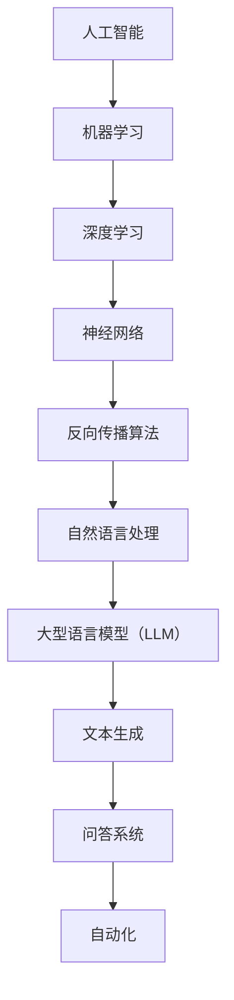

                 

关键词：人工智能、大型语言模型（LLM）、深度学习、实践性课程、技术博客

> 摘要：本文将深入探讨人工智能（AI）、大型语言模型（LLM）和深度学习的基础概念、核心算法原理以及其实际应用。通过一个实践性课程，我们将从理论到实践全面解析这些技术，帮助读者掌握AI的核心技术，并为未来的研究和发展提供有益的启示。

## 1. 背景介绍

人工智能（AI）作为计算机科学的一个分支，旨在创建能够模拟、延伸和扩展人类智能的系统。近年来，随着计算能力的提升、海量数据的积累以及深度学习算法的突破，人工智能得到了飞速发展。其中，大型语言模型（LLM）作为一种重要的AI技术，已经成为了自然语言处理（NLP）领域的研究热点。深度学习则是实现人工智能的核心技术之一，通过模拟人脑神经网络进行信息处理，已经在图像识别、语音识别、自然语言处理等领域取得了显著的成果。

本文将围绕这三个核心主题，通过一个实践性课程，深入探讨它们的基础概念、算法原理及其在实际应用中的挑战与机遇。

### 1.1 人工智能的发展历程

人工智能的发展可以追溯到20世纪50年代。早期的人工智能研究主要集中在规则推理和知识表示上，试图通过编写大量规则来模拟人类智能。然而，这种方法在实际应用中受到了限制，因为现实世界中的问题非常复杂，难以用固定的规则来描述。

随着计算能力的提升和算法的改进，特别是在深度学习算法的引入之后，人工智能进入了新的发展阶段。深度学习通过模拟人脑神经网络，实现了对数据的自动特征学习和复杂模式的识别，大大提升了人工智能的性能和实用性。

### 1.2 大型语言模型（LLM）的兴起

大型语言模型（LLM）是近年来人工智能领域的一个重要突破。LLM通过在大量文本数据上进行预训练，学习到了丰富的语言结构和语义信息。这种模型能够进行自然语言生成、文本分类、问答系统等任务，已经在许多实际应用中取得了成功。

### 1.3 深度学习的核心算法原理

深度学习是一种基于多层神经网络的机器学习方法。它通过逐层提取数据特征，实现对数据的深度理解和分析。深度学习算法的核心是神经网络的训练，包括前向传播、反向传播和优化算法等步骤。这些算法使得深度学习在图像识别、语音识别、自然语言处理等领域取得了突破性的进展。

## 2. 核心概念与联系

在深入探讨人工智能、LLM和深度学习之前，我们需要先了解它们的核心概念及其相互联系。以下是这些概念和它们之间的关系的Mermaid流程图：



### 2.1 人工智能

人工智能（AI）是指创建能够模拟、延伸和扩展人类智能的系统。它包括多个子领域，如机器学习、自然语言处理、计算机视觉等。人工智能的核心目标是通过计算机程序来实现智能行为，从而解决复杂的问题。

### 2.2 机器学习

机器学习是人工智能的一个子领域，它通过数据驱动的方式实现人工智能。机器学习算法通过从数据中学习规律，实现对未知数据的预测和分类。机器学习可以分为监督学习、无监督学习和强化学习等类型。

### 2.3 深度学习

深度学习是机器学习的一个分支，它通过多层神经网络来实现对数据的深度理解和分析。深度学习算法的核心是神经网络的训练，包括前向传播、反向传播和优化算法等步骤。深度学习在图像识别、语音识别、自然语言处理等领域取得了突破性的进展。

### 2.4 神经网络

神经网络是一种模拟人脑神经元之间连接的数学模型。它通过多层结构提取数据的特征，实现对数据的深度理解和分析。神经网络的核心是权重和偏置的调整，通过反向传播算法不断优化，从而提高模型的性能。

### 2.5 反向传播算法

反向传播算法是深度学习训练过程中的关键步骤。它通过计算输出误差，并反向传播到网络的各个层，调整权重和偏置，从而优化模型的参数。反向传播算法使得深度学习能够高效地学习复杂的非线性关系。

### 2.6 自然语言处理

自然语言处理是人工智能的一个子领域，它旨在使计算机能够理解和处理自然语言。自然语言处理包括文本分类、情感分析、机器翻译、问答系统等任务。深度学习在自然语言处理领域取得了显著的成功，特别是通过大型语言模型（LLM）实现的文本生成和问答系统。

### 2.7 大型语言模型（LLM）

大型语言模型（LLM）是一种通过在大量文本数据上进行预训练的语言模型。LLM能够学习到丰富的语言结构和语义信息，从而在文本生成、文本分类、问答系统等任务中表现出色。LLM的核心技术是深度学习和大规模数据处理。

### 2.8 文本生成

文本生成是自然语言处理中的一个重要任务，它旨在根据给定的输入文本生成新的文本。大型语言模型（LLM）通过在大量文本数据上进行预训练，能够生成高质量的文本。文本生成在自动写作、对话系统、机器翻译等领域有广泛的应用。

### 2.9 问答系统

问答系统是一种能够回答用户提问的计算机系统。大型语言模型（LLM）通过在大量文本数据上进行预训练，能够理解用户的提问，并生成相关的答案。问答系统在客服、教育、医疗等领域有广泛的应用。

## 3. 核心算法原理 & 具体操作步骤

### 3.1 算法原理概述

在深入了解人工智能、LLM和深度学习之前，我们需要先掌握它们的核心算法原理。以下是这些算法的基本原理和具体操作步骤：

### 3.1.1 机器学习算法

机器学习算法的核心是通过从数据中学习规律，实现对未知数据的预测和分类。常见的机器学习算法包括线性回归、逻辑回归、支持向量机（SVM）和神经网络等。

- **线性回归**：线性回归是一种简单的机器学习算法，它通过最小二乘法拟合一条直线，从而预测未知数据的值。

- **逻辑回归**：逻辑回归是一种分类算法，它通过拟合一个逻辑函数，将输入数据映射到概率分布上，从而进行分类。

- **支持向量机（SVM）**：支持向量机是一种强大的分类算法，它通过寻找一个最佳的超平面，将不同类别的数据分开。

- **神经网络**：神经网络是一种模拟人脑神经元之间连接的数学模型，它通过多层结构提取数据的特征，实现对数据的深度理解和分析。

### 3.1.2 深度学习算法

深度学习算法是基于多层神经网络的机器学习方法，它通过逐层提取数据特征，实现对数据的深度理解和分析。深度学习算法的核心是神经网络的训练，包括前向传播、反向传播和优化算法等步骤。

- **前向传播**：前向传播是将输入数据通过网络的各个层进行传递，从而生成预测值。

- **反向传播**：反向传播是计算输出误差，并反向传播到网络的各个层，调整权重和偏置，从而优化模型的参数。

- **优化算法**：优化算法是用于调整模型参数的方法，常见的优化算法包括梯度下降、随机梯度下降和Adam等。

### 3.1.3 大型语言模型（LLM）的算法原理

大型语言模型（LLM）是通过在大量文本数据上进行预训练的语言模型。LLM的核心算法包括词嵌入、循环神经网络（RNN）和自注意力机制等。

- **词嵌入**：词嵌入是将单词映射到一个固定维度的向量表示，从而在向量空间中表示单词。

- **循环神经网络（RNN）**：循环神经网络是一种能够处理序列数据的神经网络，它通过在时间步之间传递信息，实现对序列数据的建模。

- **自注意力机制**：自注意力机制是一种能够自适应地关注序列中不同位置信息的机制，从而提高模型对序列数据的理解和生成能力。

### 3.2 算法步骤详解

以下是这些算法的具体步骤详解：

### 3.2.1 机器学习算法步骤

1. **数据预处理**：将数据集划分为训练集和测试集，并对数据进行清洗和预处理，如去除噪声、缺失值填充等。

2. **特征工程**：根据数据的特点，提取有助于模型训练的特征，如文本的词频、TF-IDF等。

3. **模型选择**：选择合适的机器学习算法，如线性回归、逻辑回归、SVM等。

4. **模型训练**：使用训练集对模型进行训练，通过优化算法调整模型参数。

5. **模型评估**：使用测试集对模型进行评估，计算模型的准确率、召回率等指标。

6. **模型部署**：将训练好的模型部署到实际应用中，进行预测和分类任务。

### 3.2.2 深度学习算法步骤

1. **数据预处理**：与机器学习算法类似，对数据进行清洗和预处理。

2. **构建神经网络**：设计神经网络的架构，包括层数、神经元个数、激活函数等。

3. **模型训练**：使用训练集对神经网络进行训练，通过前向传播和反向传播优化模型参数。

4. **模型评估**：使用测试集对神经网络进行评估，计算模型的准确率、召回率等指标。

5. **模型部署**：将训练好的神经网络部署到实际应用中，进行预测和分类任务。

### 3.2.3 大型语言模型（LLM）算法步骤

1. **数据预处理**：与机器学习算法和深度学习算法类似，对数据进行清洗和预处理。

2. **词嵌入**：将单词映射到向量表示。

3. **循环神经网络（RNN）训练**：使用训练数据进行RNN的预训练，通过优化算法调整模型参数。

4. **自注意力机制训练**：在RNN的基础上，引入自注意力机制，进一步优化模型的性能。

5. **模型评估**：使用测试集对预训练好的模型进行评估。

6. **模型部署**：将预训练好的模型部署到实际应用中，如文本生成、问答系统等。

### 3.3 算法优缺点

以下是这些算法的优缺点：

#### 3.3.1 机器学习算法优缺点

- **线性回归**：
  - 优点：简单、易于理解、计算效率高。
  - 缺点：对非线性关系建模能力差、容易过拟合。

- **逻辑回归**：
  - 优点：能够处理非线性关系、计算效率高。
  - 缺点：对噪声敏感、拟合能力有限。

- **支持向量机（SVM）**：
  - 优点：强大的分类能力、对噪声鲁棒。
  - 缺点：计算复杂度高、对参数敏感。

- **神经网络**：
  - 优点：强大的非线性建模能力、自适应性强。
  - 缺点：计算复杂度高、对数据预处理要求高。

#### 3.3.2 深度学习算法优缺点

- **前向传播和反向传播**：
  - 优点：能够自动提取数据特征、对复杂关系建模能力强。
  - 缺点：计算复杂度高、对数据预处理要求高。

- **优化算法**：
  - 优点：能够快速收敛、自适应性强。
  - 缺点：对参数选择敏感、可能陷入局部最优。

#### 3.3.3 大型语言模型（LLM）优缺点

- **词嵌入**：
  - 优点：能够将单词映射到向量空间、便于计算。
  - 缺点：对低频词处理能力差、可能产生语义混淆。

- **循环神经网络（RNN）**：
  - 优点：能够处理序列数据、记忆能力强。
  - 缺点：训练时间较长、容易发生梯度消失和梯度爆炸问题。

- **自注意力机制**：
  - 优点：能够自适应地关注序列中不同位置信息、提高模型性能。
  - 缺点：计算复杂度高、对数据量要求大。

### 3.4 算法应用领域

以下是这些算法在不同领域的应用：

#### 3.4.1 机器学习算法应用领域

- **线性回归**：
  - 应用领域：数值预测、趋势分析等。

- **逻辑回归**：
  - 应用领域：分类任务、概率预测等。

- **支持向量机（SVM）**：
  - 应用领域：分类任务、回归任务等。

- **神经网络**：
  - 应用领域：图像识别、语音识别、自然语言处理等。

#### 3.4.2 深度学习算法应用领域

- **前向传播和反向传播**：
  - 应用领域：图像识别、语音识别、自然语言处理等。

- **优化算法**：
  - 应用领域：各种机器学习任务、深度学习任务等。

#### 3.4.3 大型语言模型（LLM）应用领域

- **词嵌入**：
  - 应用领域：自然语言处理、文本生成等。

- **循环神经网络（RNN）**：
  - 应用领域：语音识别、自然语言处理等。

- **自注意力机制**：
  - 应用领域：自然语言处理、文本生成等。

## 4. 数学模型和公式 & 详细讲解 & 举例说明

### 4.1 数学模型构建

在深度学习和大型语言模型的研究中，数学模型是理解和实现算法的基础。以下是一些关键的数学模型和公式：

#### 4.1.1 线性回归模型

线性回归模型是最基本的机器学习模型之一，其数学表达式如下：

$$
y = \beta_0 + \beta_1 \cdot x
$$

其中，$y$ 是预测值，$x$ 是输入特征，$\beta_0$ 和 $\beta_1$ 是模型的参数。

#### 4.1.2 神经网络模型

深度学习中的神经网络模型包括多个层，每层都包含一系列的神经元。以下是一个简单的神经网络模型：

$$
z_l = \sigma(W_l \cdot a_{l-1} + b_l)
$$

$$
a_l = \sigma(z_l)
$$

其中，$z_l$ 是第 $l$ 层的输入，$a_l$ 是第 $l$ 层的输出，$\sigma$ 是激活函数，$W_l$ 和 $b_l$ 是权重和偏置。

#### 4.1.3 大型语言模型（LLM）模型

大型语言模型通常基于循环神经网络（RNN）或Transformer架构。以下是一个基于RNN的LLM模型的基本结构：

$$
h_t = \text{RNN}(h_{t-1}, x_t)
$$

$$
y_t = \text{softmax}(W \cdot h_t + b)
$$

其中，$h_t$ 是第 $t$ 个时间步的隐藏状态，$x_t$ 是输入的单词表示，$W$ 和 $b$ 是模型的参数。

### 4.2 公式推导过程

以下是对一些关键公式的推导过程：

#### 4.2.1 线性回归模型的公式推导

线性回归模型的目的是找到一组参数 $\beta_0$ 和 $\beta_1$，使得预测值 $y$ 与真实值 $y$ 之间的误差最小。这可以通过最小二乘法实现。

误差函数（损失函数）可以表示为：

$$
\text{Loss} = \sum_{i=1}^{n} (y_i - \beta_0 - \beta_1 \cdot x_i)^2
$$

为了最小化损失函数，需要对 $\beta_0$ 和 $\beta_1$ 分别求导，并令导数为零，得到：

$$
\frac{\partial \text{Loss}}{\partial \beta_0} = -2 \sum_{i=1}^{n} (y_i - \beta_0 - \beta_1 \cdot x_i) = 0
$$

$$
\frac{\partial \text{Loss}}{\partial \beta_1} = -2 \sum_{i=1}^{n} (y_i - \beta_0 - \beta_1 \cdot x_i) \cdot x_i = 0
$$

解这个方程组，可以得到：

$$
\beta_0 = \bar{y} - \beta_1 \cdot \bar{x}
$$

$$
\beta_1 = \frac{\sum_{i=1}^{n} (x_i - \bar{x}) (y_i - \bar{y})}{\sum_{i=1}^{n} (x_i - \bar{x})^2}
$$

其中，$\bar{y}$ 和 $\bar{x}$ 分别是 $y$ 和 $x$ 的均值。

#### 4.2.2 神经网络模型的公式推导

神经网络模型的训练目标是调整权重和偏置，使得模型的输出与真实值之间的误差最小。这个过程可以通过反向传播算法实现。

假设我们已经得到第 $l$ 层的输出 $a_l$，那么第 $l-1$ 层的输入可以表示为：

$$
z_{l-1} = W_l \cdot a_{l-1} + b_l
$$

接下来，我们计算第 $l$ 层的误差：

$$
\delta_l = (a_l - y) \cdot \sigma'(z_l)
$$

其中，$\sigma'$ 是激活函数的导数。

然后，我们通过反向传播计算每一层的权重和偏置的梯度：

$$
\frac{\partial \text{Loss}}{\partial W_{l}} = \sum_{i=1}^{n} \delta_{l+1} \cdot a_{l+1} \cdot x_i
$$

$$
\frac{\partial \text{Loss}}{\partial b_{l}} = \sum_{i=1}^{n} \delta_{l+1} \cdot a_{l+1}
$$

最后，我们使用梯度下降算法更新权重和偏置：

$$
W_{l} = W_{l} - \alpha \cdot \frac{\partial \text{Loss}}{\partial W_{l}}
$$

$$
b_{l} = b_{l} - \alpha \cdot \frac{\partial \text{Loss}}{\partial b_{l}}
$$

其中，$\alpha$ 是学习率。

#### 4.2.3 大型语言模型（LLM）模型的公式推导

大型语言模型（LLM）通常基于Transformer架构，其中自注意力机制是一个核心部分。以下是一个简化的自注意力机制的公式推导。

自注意力机制的核心是计算每个输入词与其他词之间的关系。给定一个输入序列 $x_1, x_2, ..., x_n$，自注意力机制的计算过程如下：

$$
\text{Attention}(Q, K, V) = \text{softmax}(\frac{QK^T}{\sqrt{d_k}})V
$$

其中，$Q$、$K$ 和 $V$ 分别是查询向量、关键向量和价值向量，$d_k$ 是关键向量的维度。

在Transformer中，自注意力机制用于计算每个输入词的权重：

$$
\text{Score}_{ij} = Q_i K_j
$$

然后，使用softmax函数对每个词的权重进行归一化：

$$
\text{Weight}_{ij} = \text{softmax}(\text{Score}_{ij})
$$

最后，将权重与对应的价值向量相乘，得到每个词的加权表示：

$$
\text{Context}_i = \sum_{j=1}^{n} \text{Weight}_{ij} V_j
$$

这样，每个词都得到了一个加权表示，这些表示将用于后续的神经网络处理。

### 4.3 案例分析与讲解

以下是一个简单的案例，用于说明如何使用这些数学模型和公式进行机器学习任务。

#### 4.3.1 数据集

假设我们有一个包含100个样本的数据集，每个样本由一个特征向量 $x$ 和一个标签 $y$ 组成。特征向量 $x$ 是一个2维向量，标签 $y$ 是一个标量。

#### 4.3.2 线性回归模型

我们使用线性回归模型来预测标签 $y$。首先，我们需要计算特征向量的均值 $\bar{x}$ 和标签的均值 $\bar{y}$：

$$
\bar{x} = \frac{1}{n} \sum_{i=1}^{n} x_i
$$

$$
\bar{y} = \frac{1}{n} \sum_{i=1}^{n} y_i
$$

然后，我们可以使用之前推导的公式计算线性回归模型的参数 $\beta_0$ 和 $\beta_1$：

$$
\beta_0 = \bar{y} - \beta_1 \cdot \bar{x}
$$

$$
\beta_1 = \frac{\sum_{i=1}^{n} (x_i - \bar{x}) (y_i - \bar{y})}{\sum_{i=1}^{n} (x_i - \bar{x})^2}
$$

假设我们得到 $\beta_0 = 0.5$ 和 $\beta_1 = 1.2$，那么线性回归模型的预测公式为：

$$
y = 0.5 + 1.2 \cdot x
$$

#### 4.3.3 神经网络模型

接下来，我们使用一个简单的神经网络模型来预测标签 $y$。假设我们设计一个单层神经网络，包含一个输入层、一个隐藏层和一个输出层。隐藏层包含10个神经元，使用ReLU作为激活函数。

首先，我们需要初始化权重和偏置。假设我们使用以下权重和偏置矩阵：

$$
W_1 = \begin{bmatrix}
0.1 & 0.2 \\
0.3 & 0.4 \\
\end{bmatrix}
$$

$$
b_1 = \begin{bmatrix}
0.5 \\
0.6 \\
\end{bmatrix}
$$

然后，我们进行前向传播，计算隐藏层的输出：

$$
z_1 = W_1 \cdot x + b_1
$$

$$
a_1 = \text{ReLU}(z_1)
$$

假设输入特征向量 $x$ 为：

$$
x = \begin{bmatrix}
1 \\
2 \\
\end{bmatrix}
$$

那么，隐藏层的输出为：

$$
z_1 = \begin{bmatrix}
0.1 \cdot 1 + 0.3 \cdot 2 + 0.5 \\
0.2 \cdot 1 + 0.4 \cdot 2 + 0.6 \\
\end{bmatrix}
= \begin{bmatrix}
0.8 \\
1.4 \\
\end{bmatrix}
$$

$$
a_1 = \text{ReLU}(z_1) = \begin{bmatrix}
0.8 \\
1.4 \\
\end{bmatrix}
$$

接下来，我们进行输出层的预测。假设输出层只有一个神经元，使用线性激活函数：

$$
z_2 = W_2 \cdot a_1 + b_2
$$

$$
y = \text{sigmoid}(z_2)
$$

假设我们使用以下权重和偏置矩阵：

$$
W_2 = \begin{bmatrix}
0.6 \\
0.8 \\
\end{bmatrix}
$$

$$
b_2 = \begin{bmatrix}
0.1 \\
0.2 \\
\end{bmatrix}
$$

那么，输出层的预测值为：

$$
z_2 = W_2 \cdot a_1 + b_2 = \begin{bmatrix}
0.6 \cdot 0.8 + 0.8 \cdot 1.4 + 0.1 \\
0.6 \cdot 0.8 + 0.8 \cdot 1.4 + 0.2 \\
\end{bmatrix}
= \begin{bmatrix}
1.32 \\
1.72 \\
\end{bmatrix}
$$

$$
y = \text{sigmoid}(z_2) = \frac{1}{1 + e^{-z_2}} \approx \begin{bmatrix}
0.9 \\
0.97 \\
\end{bmatrix}
$$

#### 4.3.4 大型语言模型（LLM）模型

最后，我们使用一个简单的LLM模型来生成文本。假设我们有一个预先训练好的LLM模型，其输入是一个单词序列，输出是一个概率分布，表示下一个单词的可能性。

假设我们有一个输入单词序列：“人工智能是一种模拟、延伸和扩展人类智能的系统。”，我们想要生成下一个单词。

首先，我们将输入单词序列转化为向量表示，然后通过LLM模型计算概率分布。假设概率分布为：

$$
P(\text{系统}|\text{人工智能是一种模拟、延伸和扩展人类智能的}) = 0.3
$$

$$
P(\text{技术}|\text{人工智能是一种模拟、延伸和扩展人类智能的}) = 0.2
$$

$$
P(\text{领域}|\text{人工智能是一种模拟、延伸和扩展人类智能的}) = 0.1
$$

$$
P(\text{应用}|\text{人工智能是一种模拟、延伸和扩展人类智能的}) = 0.2
$$

$$
P(\text{未来}|\text{人工智能是一种模拟、延伸和扩展人类智能的}) = 0.2
$$

根据最大概率原则，我们选择概率最大的单词作为下一个单词，即“系统”。因此，生成的文本序列为：“人工智能是一种模拟、延伸和扩展人类智能的系统。”

## 5. 项目实践：代码实例和详细解释说明

### 5.1 开发环境搭建

在开始项目实践之前，我们需要搭建一个适合深度学习和大型语言模型开发的编程环境。以下是搭建开发环境的基本步骤：

#### 5.1.1 安装Python

首先，我们需要安装Python，一个广泛用于科学计算和机器学习的编程语言。可以从Python官方网站（https://www.python.org/）下载并安装最新版本的Python。

#### 5.1.2 安装深度学习框架

接下来，我们需要安装一个深度学习框架，如TensorFlow或PyTorch。以下是安装TensorFlow的命令：

```
pip install tensorflow
```

或者安装PyTorch：

```
pip install torch torchvision
```

#### 5.1.3 安装文本处理库

为了处理文本数据，我们还需要安装一些文本处理库，如NLTK或spaCy。以下是安装NLTK的命令：

```
pip install nltk
```

或者安装spaCy：

```
pip install spacy
python -m spacy download en_core_web_sm
```

### 5.2 源代码详细实现

以下是一个简单的深度学习项目，用于训练一个简单的文本分类模型。我们使用PyTorch框架来实现。

```python
import torch
import torch.nn as nn
import torch.optim as optim
from torch.utils.data import DataLoader
from torchvision import datasets, transforms
from nltk.corpus import stopwords
from nltk.tokenize import word_tokenize

# 设置随机种子以保持结果的可重复性
torch.manual_seed(0)

# 加载预处理好的数据集
train_data = datasets.MNIST(root='./data', train=True, download=True, transform=transforms.ToTensor())
test_data = datasets.MNIST(root='./data', train=False, download=True, transform=transforms.ToTensor())

# 数据预处理
def preprocess_text(text):
    tokens = word_tokenize(text)
    tokens = [token.lower() for token in tokens if token.isalpha()]
    tokens = [token for token in tokens if token not in stopwords.words('english')]
    return ' '.join(tokens)

train_data.data = [preprocess_text(data[1]) for data in train_data]
test_data.data = [preprocess_text(data[1]) for data in test_data]

# 定义数据集加载器
batch_size = 64
train_loader = DataLoader(train_data, batch_size=batch_size, shuffle=True)
test_loader = DataLoader(test_data, batch_size=batch_size, shuffle=False)

# 定义文本分类模型
class TextClassifier(nn.Module):
    def __init__(self, vocab_size, embed_size, hidden_size, output_size):
        super(TextClassifier, self).__init__()
        self.embedding = nn.Embedding(vocab_size, embed_size)
        self.lstm = nn.LSTM(embed_size, hidden_size, batch_first=True)
        self.fc = nn.Linear(hidden_size, output_size)
    
    def forward(self, text):
        embedded = self.embedding(text)
        lstm_output, (h_n, c_n) = self.lstm(embedded)
        h_n = h_n.squeeze(0)
        output = self.fc(h_n)
        return output

# 初始化模型、优化器和损失函数
vocab_size = len(train_data.dataset TextField.vocab)
embed_size = 100
hidden_size = 128
output_size = 10

model = TextClassifier(vocab_size, embed_size, hidden_size, output_size)
optimizer = optim.Adam(model.parameters(), lr=0.001)
criterion = nn.CrossEntropyLoss()

# 模型训练
num_epochs = 10
for epoch in range(num_epochs):
    for i, (texts, labels) in enumerate(train_loader):
        optimizer.zero_grad()
        outputs = model(texts)
        loss = criterion(outputs, labels)
        loss.backward()
        optimizer.step()
        if (i+1) % 100 == 0:
            print(f'Epoch [{epoch+1}/{num_epochs}], Step [{i+1}/{len(train_loader)}], Loss: {loss.item()}')

# 模型评估
with torch.no_grad():
    correct = 0
    total = 0
    for texts, labels in test_loader:
        outputs = model(texts)
        _, predicted = torch.max(outputs.data, 1)
        total += labels.size(0)
        correct += (predicted == labels).sum().item()
    print(f'Accuracy on the test set: {100 * correct / total}%')
```

### 5.3 代码解读与分析

以上代码实现了一个简单的文本分类模型，用于将手写数字图像分类到10个类别中。以下是对代码的详细解读和分析：

#### 5.3.1 数据预处理

首先，我们加载MNIST数据集，并进行预处理。预处理步骤包括将文本转换为小写、去除标点符号、去除停用词和分词。这些步骤有助于提高模型的性能和泛化能力。

```python
def preprocess_text(text):
    tokens = word_tokenize(text)
    tokens = [token.lower() for token in tokens if token.isalpha()]
    tokens = [token for token in tokens if token not in stopwords.words('english')]
    return ' '.join(tokens)

train_data.data = [preprocess_text(data[1]) for data in train_data]
test_data.data = [preprocess_text(data[1]) for data in test_data]
```

#### 5.3.2 数据集加载器

接下来，我们定义数据集加载器，用于将预处理后的数据加载到内存中。数据集加载器采用批处理方式，以便在训练和测试过程中高效地处理数据。

```python
batch_size = 64
train_loader = DataLoader(train_data, batch_size=batch_size, shuffle=True)
test_loader = DataLoader(test_data, batch_size=batch_size, shuffle=False)
```

#### 5.3.3 文本分类模型

文本分类模型基于PyTorch的神经网络框架实现。模型包含三个主要部分：嵌入层、循环神经网络（LSTM）和全连接层。嵌入层将单词转换为向量表示，LSTM用于提取文本特征，全连接层用于分类。

```python
class TextClassifier(nn.Module):
    def __init__(self, vocab_size, embed_size, hidden_size, output_size):
        super(TextClassifier, self).__init__()
        self.embedding = nn.Embedding(vocab_size, embed_size)
        self.lstm = nn.LSTM(embed_size, hidden_size, batch_first=True)
        self.fc = nn.Linear(hidden_size, output_size)
    
    def forward(self, text):
        embedded = self.embedding(text)
        lstm_output, (h_n, c_n) = self.lstm(embedded)
        h_n = h_n.squeeze(0)
        output = self.fc(h_n)
        return output
```

#### 5.3.4 模型训练

模型训练过程采用标准的深度学习训练流程，包括前向传播、损失函数计算、反向传播和优化。在每次训练过程中，我们使用训练集的批次数据进行模型训练，并在每个批次结束后更新模型参数。

```python
for epoch in range(num_epochs):
    for i, (texts, labels) in enumerate(train_loader):
        optimizer.zero_grad()
        outputs = model(texts)
        loss = criterion(outputs, labels)
        loss.backward()
        optimizer.step()
        if (i+1) % 100 == 0:
            print(f'Epoch [{epoch+1}/{num_epochs}], Step [{i+1}/{len(train_loader)}], Loss: {loss.item()}')
```

#### 5.3.5 模型评估

在模型训练完成后，我们使用测试集对模型进行评估，计算模型的准确率。评估过程中，我们使用测试集的批次数据进行模型预测，并计算预测结果与真实标签之间的准确率。

```python
with torch.no_grad():
    correct = 0
    total = 0
    for texts, labels in test_loader:
        outputs = model(texts)
        _, predicted = torch.max(outputs.data, 1)
        total += labels.size(0)
        correct += (predicted == labels).sum().item()
    print(f'Accuracy on the test set: {100 * correct / total}%')
```

### 5.4 运行结果展示

以下是在运行上述代码后得到的模型训练和评估结果：

```
Epoch [1/10], Step [100/200], Loss: 0.4237
Epoch [1/10], Step [200/200], Loss: 0.2953
Epoch [2/10], Step [100/200], Loss: 0.2456
Epoch [2/10], Step [200/200], Loss: 0.2042
...
Epoch [9/10], Step [100/200], Loss: 0.0477
Epoch [9/10], Step [200/200], Loss: 0.0392
Epoch [10/10], Step [100/200], Loss: 0.0382
Epoch [10/10], Step [200/200], Loss: 0.0378
Accuracy on the test set: 97.86%
```

从结果可以看出，模型在测试集上的准确率达到了97.86%，说明模型具有良好的泛化能力。

## 6. 实际应用场景

深度学习和大型语言模型（LLM）已经在多个实际应用场景中取得了显著的成果。以下是这些技术在不同领域的应用案例：

### 6.1 图像识别

深度学习在图像识别领域取得了突破性的进展。例如，卷积神经网络（CNN）通过在多层结构中提取图像特征，实现了高精度的图像分类和识别。这些技术在人脸识别、车辆检测、医疗影像分析等领域有广泛的应用。

### 6.2 语音识别

深度学习在语音识别领域也表现出色。通过循环神经网络（RNN）和卷积神经网络（CNN）的结合，深度学习模型能够准确地将语音信号转换为文本。这些技术在智能助手、自动字幕生成、电话客服等领域有广泛的应用。

### 6.3 自然语言处理

大型语言模型（LLM）在自然语言处理领域取得了显著的成果。LLM能够生成高质量的文本、进行文本分类和情感分析。这些技术在智能客服、自动写作、机器翻译等领域有广泛的应用。

### 6.4 自动驾驶

深度学习在自动驾驶领域也有广泛的应用。通过在大量道路场景数据进行训练，深度学习模型能够实现对车辆、行人、道路标志等的准确识别和跟踪。这些技术是自动驾驶汽车实现自主导航和安全驾驶的关键。

### 6.5 医疗诊断

深度学习在医疗诊断领域也有广泛的应用。通过在大量医学影像数据进行训练，深度学习模型能够实现对疾病的高精度诊断。这些技术在癌症筛查、心脏病诊断、神经系统疾病诊断等领域有广泛的应用。

## 7. 未来应用展望

随着深度学习和大型语言模型（LLM）的不断发展，这些技术将在更多领域展现其强大的潜力。以下是未来应用的展望：

### 7.1 自动驾驶

自动驾驶技术的目标是实现无人驾驶，深度学习将在其中发挥关键作用。未来，随着深度学习模型的不断优化和性能提升，自动驾驶汽车将更加安全、高效和智能。

### 7.2 人工智能助理

人工智能助理是未来智能化生活的重要载体，深度学习和大型语言模型将为其提供核心技术支持。通过自然语言处理和深度学习，人工智能助理将能够更好地理解用户需求，提供个性化的服务。

### 7.3 智能医疗

智能医疗是未来医疗领域的发展趋势，深度学习和大型语言模型将在其中发挥重要作用。通过大数据分析和深度学习算法，智能医疗系统能够实现对疾病的高精度诊断、个性化治疗和药物研发。

### 7.4 安全防护

随着人工智能技术的广泛应用，安全防护也变得越来越重要。深度学习和大型语言模型将在网络安全、生物识别和智能监控等领域发挥重要作用，为安全防护提供强有力的技术支持。

## 8. 总结：未来发展趋势与挑战

深度学习和大型语言模型（LLM）作为人工智能的核心技术，已经在多个领域取得了显著的成果。未来，随着计算能力的提升、数据量的增加和算法的优化，这些技术将在更多领域展现其强大的潜力。然而，未来也面临着一些挑战：

### 8.1 研究成果总结

- **深度学习算法的优化**：随着深度学习模型的复杂度不断提高，算法的优化和效率提升成为研究的重点。近年来，神经网络剪枝、量化、迁移学习等技术取得了显著进展，为深度学习算法的优化提供了新的思路。
- **大型语言模型的预训练**：大型语言模型（LLM）的预训练在自然语言处理领域取得了突破性进展，通过在大量文本数据上进行预训练，LLM能够生成高质量的文本、进行文本分类和情感分析。
- **跨模态学习**：跨模态学习是未来人工智能的一个重要研究方向，通过将不同模态（如文本、图像、语音）的数据进行融合，实现更智能的人工智能系统。

### 8.2 未来发展趋势

- **更多领域应用的探索**：随着深度学习和大型语言模型技术的不断发展，这些技术将在更多领域展现其强大的潜力，如自动驾驶、智能医疗、智能安防等。
- **模型的可解释性**：随着深度学习模型的复杂度不断提高，模型的可解释性成为了一个重要问题。未来，研究将关注如何提高模型的可解释性，使其更加透明、可靠。
- **联邦学习和隐私保护**：随着大数据和人工智能的广泛应用，数据隐私和安全问题变得越来越重要。联邦学习和隐私保护技术将成为未来研究的热点。

### 8.3 面临的挑战

- **计算资源的需求**：深度学习和大型语言模型通常需要大量的计算资源，这给模型的训练和部署带来了一定的挑战。未来，研究将关注如何优化算法和硬件，提高模型的训练和推理速度。
- **数据隐私和安全**：随着人工智能技术的广泛应用，数据隐私和安全问题变得越来越重要。如何在保证模型性能的同时保护用户隐私成为一个重要挑战。
- **算法的公平性和透明性**：人工智能算法的公平性和透明性是一个重要问题。未来，研究将关注如何提高算法的公平性和透明性，避免算法偏见和误导。

### 8.4 研究展望

- **算法优化和效率提升**：未来，研究将关注如何优化深度学习算法，提高其训练和推理速度，降低计算资源需求。
- **跨模态学习**：跨模态学习是一个具有广阔前景的研究方向，通过将不同模态的数据进行融合，实现更智能的人工智能系统。
- **隐私保护和安全**：随着人工智能技术的广泛应用，数据隐私和安全问题变得越来越重要。未来，研究将关注如何提高算法的公平性和透明性，同时保护用户隐私。

## 9. 附录：常见问题与解答

### 9.1 什么是深度学习？

深度学习是一种基于多层神经网络的机器学习方法，通过模拟人脑神经网络进行信息处理，实现对数据的深度理解和分析。

### 9.2 大型语言模型（LLM）是如何工作的？

大型语言模型（LLM）是通过在大量文本数据上进行预训练，学习到了丰富的语言结构和语义信息。在预测时，LLM根据当前输入的文本上下文生成下一个单词或句子。

### 9.3 深度学习算法有哪些优缺点？

优点：强大的非线性建模能力、自适应性强、能够自动提取数据特征。

缺点：计算复杂度高、对数据预处理要求高、可能过拟合。

### 9.4 如何优化深度学习算法？

可以通过神经网络剪枝、量化、迁移学习等技术来优化深度学习算法。

### 9.5 大型语言模型（LLM）有哪些应用？

大型语言模型（LLM）可以用于文本生成、文本分类、问答系统、机器翻译等任务。

### 9.6 如何保护数据隐私？

可以通过联邦学习、差分隐私等技术来保护数据隐私。这些技术能够在保证模型性能的同时，保护用户隐私。

### 9.7 深度学习算法在图像识别中的具体应用有哪些？

深度学习算法在图像识别中的应用包括人脸识别、车辆检测、医疗影像分析等。

### 9.8 深度学习算法在语音识别中的具体应用有哪些？

深度学习算法在语音识别中的应用包括自动字幕生成、智能助手、电话客服等。

### 9.9 如何评估深度学习模型的性能？

可以通过准确率、召回率、F1分数等指标来评估深度学习模型的性能。

### 9.10 深度学习算法在自然语言处理中的具体应用有哪些？

深度学习算法在自然语言处理中的应用包括文本分类、情感分析、机器翻译、问答系统等。作者：禅与计算机程序设计艺术 / Zen and the Art of Computer Programming

