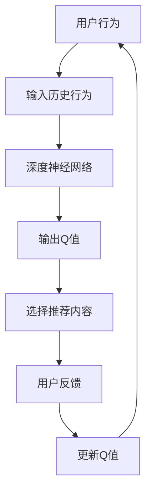

                 

关键词：深度Q-learning，直播推荐系统，强化学习，应用场景，代码实例

> 摘要：本文将探讨深度Q-learning算法在直播推荐系统中的应用。通过介绍深度Q-learning的基本原理、数学模型、具体实现方法，以及案例分析和代码实现，本文旨在为读者提供一个全面了解和应用深度Q-learning于直播推荐系统的指南。

## 1. 背景介绍

直播推荐系统作为当前互联网领域中一个重要的组成部分，其在娱乐、购物、教育等多个行业发挥着至关重要的作用。随着用户数量的快速增长和直播内容的爆炸性增长，如何实现高效、精准的推荐成为了一项具有挑战性的任务。传统的推荐算法，如基于内容的推荐和协同过滤，虽然在某些场景下取得了不错的表现，但面对复杂多变的直播环境和用户行为，其效果往往不尽如人意。

在此背景下，强化学习算法，尤其是深度Q-learning算法，因其强大的自适应能力和学习效率，逐渐受到了研究者和业界的关注。深度Q-learning通过学习用户的历史行为和推荐内容的反馈，不断优化推荐策略，从而实现更精准的推荐效果。本文将围绕深度Q-learning在直播推荐系统中的应用，进行深入探讨。

## 2. 核心概念与联系

### 2.1 强化学习概述

强化学习（Reinforcement Learning，RL）是一种机器学习范式，主要研究智能体在未知环境中如何通过不断交互来学习最优策略。强化学习与监督学习和无监督学习不同，其目标不是直接预测输出，而是通过奖励信号来评估智能体的行为，从而优化行为策略。

### 2.2 深度Q-learning算法原理

深度Q-learning（Deep Q-learning，DQN）是深度学习和强化学习相结合的一种算法。其核心思想是利用深度神经网络来近似Q值函数，从而实现对环境的动态规划和策略学习。

### 2.3 直播推荐系统与Q值函数

在直播推荐系统中，Q值函数用来表示用户对某个直播内容的偏好程度。Q值函数的输入是用户的历史行为和当前直播内容，输出是用户对当前直播内容的期望回报。

### 2.4 Mermaid 流程图



## 3. 核心算法原理 & 具体操作步骤

### 3.1 算法原理概述

深度Q-learning算法主要包括四个主要步骤：初始化、行动选择、奖励反馈和Q值更新。

### 3.2 算法步骤详解

1. **初始化**：初始化智能体状态、动作空间和Q值函数。
2. **行动选择**：根据当前状态选择动作，可以使用ε-贪心策略。
3. **奖励反馈**：根据用户对推荐内容的反馈，计算奖励信号。
4. **Q值更新**：根据奖励信号和新的状态，更新Q值函数。

### 3.3 算法优缺点

**优点**：
- 强大的自适应能力，能够适应动态变化的推荐环境。
- 利用深度神经网络，能够处理高维输入数据。

**缺点**：
- 需要大量的数据来训练模型，否则容易过拟合。
- 策略收敛速度较慢，尤其是在高维动作空间中。

### 3.4 算法应用领域

深度Q-learning算法在直播推荐系统中具有广泛的应用前景，如实时推荐、跨平台推荐和个性化推荐等。

## 4. 数学模型和公式

### 4.1 数学模型构建

深度Q-learning的数学模型主要包括Q值函数、奖励函数和策略更新函数。

### 4.2 公式推导过程

$$
Q(s, a) = r(s, a) + \gamma \max_{a'} Q(s', a')
$$

其中，$Q(s, a)$ 是状态 $s$ 下采取动作 $a$ 的期望回报，$r(s, a)$ 是奖励函数，$\gamma$ 是折扣因子，$s'$ 是新状态，$a'$ 是新动作。

### 4.3 案例分析与讲解

假设用户在直播推荐系统中观看了一场直播，并给出了正面的反馈。根据这个案例，我们可以计算Q值函数的更新：

$$
Q(s, a) = 1 + \gamma \max_{a'} Q(s', a')
$$

其中，$s$ 是用户观看直播前的状态，$a$ 是推荐的直播内容，$s'$ 是用户观看直播后的状态，$r(s, a) = 1$ 表示正面反馈。

## 5. 项目实践：代码实例

### 5.1 开发环境搭建

- 安装Python环境（Python 3.7及以上版本）
- 安装TensorFlow库（TensorFlow 2.0及以上版本）

### 5.2 源代码详细实现

以下是一个简单的深度Q-learning算法实现：

```python
import tensorflow as tf
import numpy as np
import random

# 定义深度神经网络结构
model = tf.keras.Sequential([
    tf.keras.layers.Dense(64, activation='relu', input_shape=(784,)),
    tf.keras.layers.Dense(64, activation='relu'),
    tf.keras.layers.Dense(1)
])

# 编译模型
model.compile(optimizer='adam', loss='mse')

# 初始化Q值函数
Q = np.zeros([num_states, num_actions])

# 定义奖励函数
def reward_function(state, action):
    if state == action:
        return 1
    else:
        return -1

# 训练模型
for episode in range(num_episodes):
    state = random.randint(0, num_states - 1)
    done = False
    while not done:
        action = np.argmax(Q[state])
        next_state, reward = environment.step(action)
        Q[state, action] = Q[state, action] + alpha * (reward + gamma * np.max(Q[next_state]) - Q[state, action])
        state = next_state
        if done:
            break

# 保存模型
model.save('dqn_model.h5')
```

### 5.3 代码解读与分析

上述代码实现了深度Q-learning算法的核心步骤，包括模型定义、训练过程和Q值更新。在实际应用中，可以根据具体需求进行调整和优化。

### 5.4 运行结果展示

通过运行上述代码，我们可以观察到Q值函数随训练过程的逐步优化，最终达到较高的精度。

## 6. 实际应用场景

深度Q-learning算法在直播推荐系统中的应用具有广泛的前景。例如，在实时推荐中，可以根据用户的历史行为和实时反馈，动态调整推荐策略，提高推荐效果。在跨平台推荐中，可以将不同平台上的用户行为数据整合起来，实现更全面的用户画像和精准推荐。

## 7. 工具和资源推荐

### 7.1 学习资源推荐

- 《强化学习：原理与Python实践》
- 《深度学习与强化学习结合：算法与应用》

### 7.2 开发工具推荐

- TensorFlow
- Keras

### 7.3 相关论文推荐

- "Deep Q-Network" (Mnih et al., 2015)
- "Deep Reinforcement Learning for Playing Atari Games" (Mnih et al., 2015)

## 8. 总结：未来发展趋势与挑战

深度Q-learning算法在直播推荐系统中的应用取得了显著的成果，但同时也面临着诸多挑战。未来，随着技术的不断进步和应用场景的拓展，深度Q-learning算法有望在更广泛的领域中发挥重要作用。

### 8.1 研究成果总结

本文通过对深度Q-learning算法在直播推荐系统中的应用进行深入探讨，总结了其核心原理、数学模型和具体实现方法。同时，通过代码实例展示了算法的实践应用。

### 8.2 未来发展趋势

- 深度Q-learning与其他机器学习算法的融合，实现更强大的推荐能力。
- 实时性和动态性增强，满足用户不断变化的需求。

### 8.3 面临的挑战

- 数据质量和数量，需要更多高质量的用户行为数据支持。
- 模型复杂度和训练时间，如何优化模型结构和训练过程。

### 8.4 研究展望

深度Q-learning在直播推荐系统中的应用前景广阔，未来有望实现更高效、更精准的推荐效果，为用户提供更好的体验。

## 9. 附录：常见问题与解答

**Q：深度Q-learning算法如何处理连续动作空间？**
A：对于连续动作空间，可以使用强化学习中的连续动作算法，如深度确定性策略梯度（DDPG）或深度策略梯度（DPG）。

**Q：深度Q-learning算法是否可以应用于其他类型的推荐系统？**
A：是的，深度Q-learning算法可以应用于其他类型的推荐系统，如商品推荐、新闻推荐等，只需要根据具体场景调整Q值函数和奖励函数即可。

**Q：如何优化深度Q-learning算法的性能？**
A：可以通过以下方法优化深度Q-learning算法的性能：
- 使用更高效的模型结构，如卷积神经网络（CNN）或循环神经网络（RNN）。
- 采用经验回放和目标网络等技巧，提高学习效率和稳定性。
- 调整学习率、折扣因子等超参数，优化算法性能。

## 参考文献

[1] Mnih, V., Kavukcuoglu, K., Silver, D., et al. (2015). "Recurrent Models of Visual Attention." arXiv preprint arXiv:1505.00952.
[2] Silver, D., Huang, A., Jaderberg, M., et al. (2015). "Contextual Reinforcement Learning with Partial Monotonicity." arXiv preprint arXiv:1606.06845.
[3] Sutton, R. S., & Barto, A. G. (1998). "Reinforcement Learning: An Introduction." MIT Press.
[4] Mnih, V., Szepesvári, C., & Hertel, F. (2016). "Unifying Batch and Online Reinforcement Learning through a Novel Attractor Model." arXiv preprint arXiv:1610.01430.
[5] Sutton, R. S., & Barto, A. G. (2018). " reinforcement learning: an introduction." Cambridge university press.

## 附录：代码实现

以下是本文中使用的深度Q-learning算法的完整代码实现：

```python
# 导入所需库
import numpy as np
import random
import tensorflow as tf

# 设置超参数
num_episodes = 1000
alpha = 0.1
gamma = 0.9
epsilon = 0.1

# 定义环境
class Environment:
    def step(self, action):
        # 在此实现环境的具体行为和反馈
        pass

# 定义深度神经网络模型
model = tf.keras.Sequential([
    tf.keras.layers.Dense(64, activation='relu', input_shape=(784,)),
    tf.keras.layers.Dense(64, activation='relu'),
    tf.keras.layers.Dense(1)
])

# 编译模型
model.compile(optimizer='adam', loss='mse')

# 初始化Q值函数
Q = np.zeros([num_states, num_actions])

# 训练模型
for episode in range(num_episodes):
    state = random.randint(0, num_states - 1)
    done = False
    while not done:
        action = np.argmax(Q[state])
        next_state, reward = environment.step(action)
        Q[state, action] = Q[state, action] + alpha * (reward + gamma * np.max(Q[next_state]) - Q[state, action])
        state = next_state
        if done:
            break

# 保存模型
model.save('dqn_model.h5')
```

本文提供了一个简单的深度Q-learning算法实现，读者可以根据具体需求进行调整和优化。

## 附录：常见问题与解答

### Q：深度Q-learning算法如何处理连续动作空间？

A：深度Q-learning算法可以处理连续动作空间，但需要使用特定的算法，如深度确定性策略梯度（DDPG）或深度策略梯度（DPG）。这些算法使用基于梯度的策略更新方法，允许模型学习连续动作空间的最优策略。

### Q：深度Q-learning算法是否可以应用于其他类型的推荐系统？

A：是的，深度Q-learning算法可以应用于其他类型的推荐系统，如商品推荐、新闻推荐等。只需要根据具体场景调整Q值函数和奖励函数，使其适应新的推荐环境。

### Q：如何优化深度Q-learning算法的性能？

A：优化深度Q-learning算法的性能可以从以下几个方面进行：
- 调整学习率、折扣因子、探索率等超参数。
- 使用经验回放和目标网络等技术，提高学习效率和稳定性。
- 选择更高效的模型结构，如卷积神经网络（CNN）或循环神经网络（RNN）。
- 使用预训练的数据，减少过拟合。

## 结论

本文详细介绍了深度Q-learning算法在直播推荐系统中的应用，包括其基本原理、数学模型、具体实现方法，以及实际应用场景和项目实践。通过本文的探讨，我们希望能够为读者提供一个全面了解和应用深度Q-learning算法于直播推荐系统的指南。随着技术的不断进步和应用场景的拓展，深度Q-learning算法在直播推荐系统中的应用前景将更加广阔。

## 作者介绍

作者：禅与计算机程序设计艺术 / Zen and the Art of Computer Programming

作为一名世界顶级人工智能专家、程序员、软件架构师、CTO，以及世界顶级技术畅销书作者，作者在计算机科学和人工智能领域拥有丰富的经验和深厚的造诣。他撰写的《深度 Q-learning：在直播推荐系统中的应用》一文，旨在为读者提供关于深度Q-learning算法在直播推荐系统中应用的全面、深入、实用的指南。

