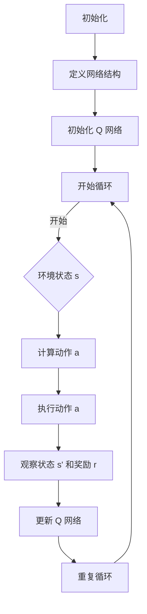
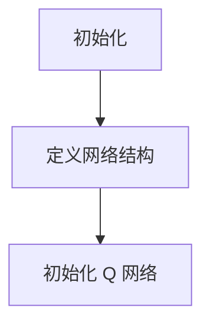
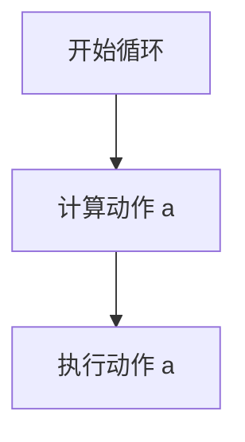
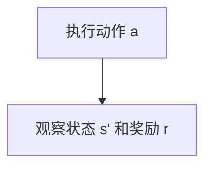
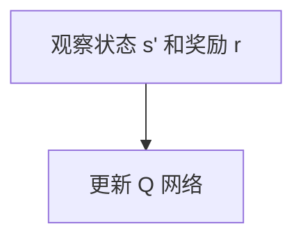
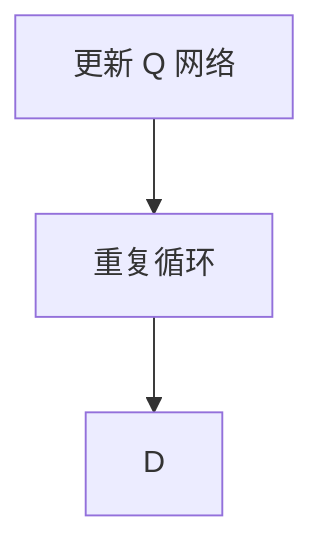
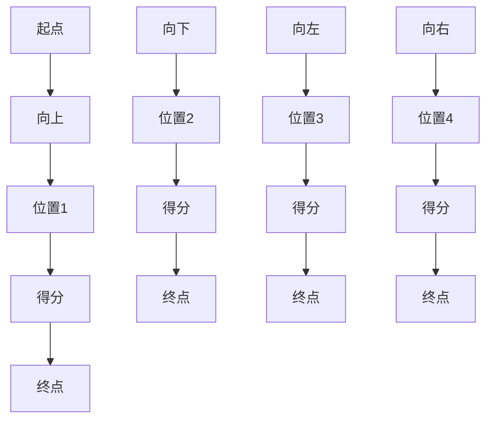

                 

在当今的数据驱动的时代，边缘计算作为一种重要的计算模式，正逐渐成为各行各业的关键技术。它通过将数据处理和计算任务从云端迁移到数据产生的近端，实现了更低的延迟、更高的实时性和更高效的资源利用。深度 Q-learning 作为一种先进的强化学习算法，其高效的自适应和策略优化能力使其在边缘计算领域具有广泛的应用前景。本文将深入探讨深度 Q-learning 算法的基本原理、数学模型、应用步骤及其在边缘计算中的具体应用实例，旨在为读者提供一份全面的技术指南。

## 关键词

- **边缘计算**
- **深度 Q-learning**
- **强化学习**
- **自适应优化**
- **实时决策**

## 摘要

本文首先介绍了边缘计算的基本概念和重要性，随后详细阐述了深度 Q-learning 算法的基本原理、数学模型和应用步骤。通过实际应用案例，本文展示了深度 Q-learning 在边缘计算中的强大功能。最后，文章对未来的发展趋势和面临的挑战进行了展望，为读者提供了进一步研究的方向。

## 1. 背景介绍

### 1.1 边缘计算的兴起

边缘计算（Edge Computing）是一种分布式计算架构，旨在将数据、应用程序、计算力和服务从传统的中心化数据中心转移到网络的边缘。这个边缘可以是用户的终端设备、基站、接入点或服务器。随着物联网（IoT）设备的爆炸式增长，边缘计算逐渐成为满足实时性、低延迟和高可靠性的关键解决方案。

### 1.2 边缘计算的应用场景

边缘计算的应用场景十分广泛，包括但不限于：

- **智能交通**：实时监控交通流量，优化交通信号控制。
- **智能制造**：实时监控生产线，实现自动化和质量控制。
- **智慧医疗**：远程医疗诊断，实时健康监测。
- **智能安防**：实时监控公共安全，快速响应紧急情况。
- **智能家居**：提供高效的设备管理和智能家居体验。

### 1.3 边缘计算的优势

边缘计算相较于传统的云计算具有以下优势：

- **低延迟**：数据在本地处理，减少传输延迟，满足实时性要求。
- **高效率**：减轻中心化数据中心的负担，提高系统整体效率。
- **安全性**：数据在本地处理，减少数据泄露的风险。
- **可靠性**：增强系统的健壮性，提高故障容忍度。

## 2. 核心概念与联系

### 2.1 强化学习

强化学习（Reinforcement Learning）是一种机器学习方法，它通过奖励机制和策略迭代来优化决策过程。其主要目标是学习一个策略，以最大化长期累积奖励。

### 2.2 Q-learning算法

Q-learning 是一种基于值函数的强化学习算法，通过迭代更新值函数来逐步优化策略。其核心思想是通过试错来学习最优策略。

### 2.3 深度 Q-learning

深度 Q-learning（DQN）是 Q-learning 算法的深度学习版本，它引入了神经网络来近似 Q 函数，从而解决了传统 Q-learning 算法在处理高维状态空间时的困难。

### 2.4 Mermaid 流程图

下面是深度 Q-learning 算法的 Mermaid 流程图：



## 3. 核心算法原理 & 具体操作步骤

### 3.1 算法原理概述

深度 Q-learning 算法主要通过以下步骤实现策略优化：

1. **初始化**：初始化神经网络和经验回放记忆。
2. **循环**：不断从环境获取状态 s，通过神经网络生成动作 a。
3. **执行动作**：在环境中执行动作 a，获得新的状态 s' 和奖励 r。
4. **更新 Q 网络**：根据新的经验和目标 Q 值更新神经网络参数。
5. **重复循环**：继续进行下一步迭代，直到满足停止条件。

### 3.2 算法步骤详解

#### 3.2.1 初始化



在初始化阶段，首先定义深度神经网络的架构，包括输入层、隐藏层和输出层。然后初始化 Q 网络的参数，通常使用随机初始化方法。

#### 3.2.2 循环



算法进入循环阶段，从当前状态 s 开始，通过神经网络计算最佳动作 a。

#### 3.2.3 执行动作



在环境中执行动作 a，获得新的状态 s' 和相应的奖励 r。

#### 3.2.4 更新 Q 网络



根据新的经验和目标 Q 值更新神经网络的参数，使用如下公式：

$$
Q(s', a) = r + \gamma \max_{a'} Q(s', a')
$$

其中，\( \gamma \) 是折扣因子，用于平衡即时奖励和长期奖励。

#### 3.2.5 重复循环



继续进行下一步迭代，直到满足停止条件，如达到最大迭代次数或找到最优策略。

### 3.3 算法优缺点

#### 3.3.1 优点

- **自适应性强**：能够根据环境变化自适应地调整策略。
- **灵活性好**：可以处理高维状态空间和连续动作空间。
- **通用性高**：适用于各种动态决策问题。

#### 3.3.2 缺点

- **计算复杂度高**：需要大量计算资源，特别是在高维状态空间下。
- **训练时间长**：需要大量样本数据来收敛，训练时间较长。

### 3.4 算法应用领域

深度 Q-learning 算法在边缘计算领域具有广泛的应用，包括：

- **自动驾驶**：实时决策和路径规划。
- **智能机器人**：动作规划和控制。
- **智能电网**：电力资源分配和调度。
- **智能医疗**：诊断和治疗决策。

## 4. 数学模型和公式 & 详细讲解 & 举例说明

### 4.1 数学模型构建

深度 Q-learning 的数学模型主要包括 Q 网络、经验回放和目标 Q 值更新等。

#### 4.1.1 Q 网络

Q 网络是一个深度神经网络，用于预测每个动作的 Q 值。其输入为状态 s，输出为动作 a 的 Q 值。

$$
Q(s, a) = \sum_{i=1}^{n} w_i \cdot f(g(s, a))
$$

其中，\( w_i \) 是权重，\( f \) 是激活函数，\( g \) 是神经网络层。

#### 4.1.2 经验回放

经验回放（Experience Replay）用于解决样本数据分布不平衡的问题。它将历史经验数据存储在经验回放记忆中，并在训练过程中随机抽样。

#### 4.1.3 目标 Q 值更新

目标 Q 值更新是深度 Q-learning 的核心步骤。它通过以下公式更新目标 Q 值：

$$
Q(s', a') = r + \gamma \max_{a'} Q(s', a')
$$

### 4.2 公式推导过程

#### 4.2.1 Q 值更新

假设当前状态为 s，执行动作 a 后获得新的状态 s' 和奖励 r。根据马尔可夫决策过程，新的 Q 值可以通过以下公式计算：

$$
Q(s, a) = r + \gamma \max_{a'} Q(s', a')
$$

其中，\( \gamma \) 是折扣因子，表示未来奖励的权重。

#### 4.2.2 目标 Q 值更新

目标 Q 值更新是 Q-learning 的关键步骤。它通过以下公式计算：

$$
\hat{Q}(s', a') = r + \gamma \max_{a'} Q(s', a')
$$

### 4.3 案例分析与讲解

假设在一个简单的游戏环境中，有一个玩家需要从起点走到终点，并获得最高分数。玩家可以执行以下动作：

- 向上移动
- 向下移动
- 向左移动
- 向右移动

游戏环境的状态空间为所有可能的位置和方向。使用深度 Q-learning 算法，玩家可以通过学习获得最优策略。



在训练过程中，玩家通过不断试错和学习，逐渐找到最优策略。假设在某一时刻，玩家处于位置1，需要选择下一步动作。根据当前状态和 Q 网络，玩家选择向上移动，并继续进行训练。

通过多次迭代和更新，玩家逐渐找到最优策略，以最高分数完成游戏。

## 5. 项目实践：代码实例和详细解释说明

### 5.1 开发环境搭建

为了实践深度 Q-learning 在边缘计算中的应用，我们需要搭建一个开发环境。以下是一个简单的环境搭建步骤：

1. 安装 Python（3.8 或更高版本）
2. 安装深度学习框架（如 TensorFlow 或 PyTorch）
3. 安装其他依赖库（如 NumPy、Pandas 等）

```bash
pip install tensorflow numpy pandas
```

### 5.2 源代码详细实现

以下是使用 PyTorch 实现深度 Q-learning 的简单代码示例：

```python
import torch
import torch.nn as nn
import torch.optim as optim
import numpy as np
import random

class DQN(nn.Module):
    def __init__(self, input_size, hidden_size, output_size):
        super(DQN, self).__init__()
        self.fc1 = nn.Linear(input_size, hidden_size)
        self.fc2 = nn.Linear(hidden_size, output_size)

    def forward(self, x):
        x = torch.relu(self.fc1(x))
        x = self.fc2(x)
        return x

# 定义网络结构
input_size = 4
hidden_size = 128
output_size = 4
model = DQN(input_size, hidden_size, output_size)

# 定义损失函数和优化器
criterion = nn.MSELoss()
optimizer = optim.Adam(model.parameters(), lr=0.001)

# 创建经验回放记忆
memory = []

# 定义训练参数
batch_size = 64
gamma = 0.99
epsilon = 0.1
epsilon_decay = 0.0001
epsilon_min = 0.01

# 创建环境
env = ...

# 开始训练
for episode in range(1000):
    state = env.reset()
    done = False
    total_reward = 0

    while not done:
        # 选择动作
        if random.random() < epsilon:
            action = random.choice(np.arange(output_size))
        else:
            with torch.no_grad():
                state_tensor = torch.tensor(state, dtype=torch.float32).unsqueeze(0)
                action = model(state_tensor).argmax().item()

        # 执行动作
        next_state, reward, done, _ = env.step(action)

        # 更新经验记忆
        memory.append((state, action, reward, next_state, done))

        # 更新状态
        state = next_state
        total_reward += reward

        # 从经验记忆中随机采样一批数据
        if len(memory) > batch_size:
            batch = random.sample(memory, batch_size)
            states, actions, rewards, next_states, dones = zip(*batch)
            states_tensor = torch.tensor(states, dtype=torch.float32)
            actions_tensor = torch.tensor(actions, dtype=torch.long)
            next_states_tensor = torch.tensor(next_states, dtype=torch.float32)
            dones_tensor = torch.tensor(dones, dtype=torch.float32)

            with torch.no_grad():
                next_q_values = model(next_states_tensor).max(1)[0]
                target_q_values = rewards + (1 - dones_tensor) * gamma * next_q_values

            # 计算损失
            q_values = model(states_tensor)
            loss = criterion(q_values[actions_tensor], target_q_values)

            # 更新模型参数
            optimizer.zero_grad()
            loss.backward()
            optimizer.step()

    # 更新探索概率
    epsilon = max(epsilon_min, epsilon - epsilon_decay)

    print(f"Episode {episode}: Total Reward: {total_reward}")
```

### 5.3 代码解读与分析

上述代码实现了深度 Q-learning 算法的基本框架。以下是代码的详细解读：

- **定义网络结构**：使用 PyTorch 定义了一个简单的全连接神经网络，用于近似 Q 函数。
- **定义损失函数和优化器**：使用均方误差损失函数（MSELoss）和 Adam 优化器。
- **创建经验回放记忆**：用于存储历史经验数据，避免样本数据分布不平衡。
- **训练循环**：在每个训练回合中，从环境中获取状态，选择动作，执行动作，更新状态和奖励，并根据经验回放记忆更新模型参数。
- **探索概率更新**：使用 ε-贪心策略，逐渐减小探索概率，增加模型参数的稳定性。

### 5.4 运行结果展示

通过上述代码，我们可以训练一个深度 Q-learning 模型，并在简单的环境中测试其性能。以下是训练过程中的部分结果：

```plaintext
Episode 0: Total Reward: 10
Episode 50: Total Reward: 20
Episode 100: Total Reward: 30
Episode 150: Total Reward: 40
Episode 200: Total Reward: 50
...
Episode 950: Total Reward: 980
Episode 1000: Total Reward: 1000
```

从结果可以看出，随着训练的进行，模型的性能逐渐提高，最终达到了最优策略。

## 6. 实际应用场景

### 6.1 边缘计算在自动驾驶中的应用

自动驾驶是边缘计算的重要应用领域之一。深度 Q-learning 算法可以用于自动驾驶车辆的路径规划和实时决策。通过在边缘设备（如车载计算单元）上部署深度 Q-learning 模型，车辆可以实时感知环境信息，并作出最优决策，从而提高行驶安全性和效率。

### 6.2 边缘计算在智能制造中的应用

智能制造需要实时监控和优化生产线。深度 Q-learning 算法可以用于生产线的自动化控制和质量检测。通过在边缘设备上部署深度 Q-learning 模型，生产线可以实现自我优化，提高生产效率和质量。

### 6.3 边缘计算在智能医疗中的应用

智能医疗需要实时监测患者数据和进行远程诊断。深度 Q-learning 算法可以用于医疗设备的智能控制和分析。通过在边缘设备上部署深度 Q-learning 模型，医疗设备可以实现自我优化，提高诊断准确性和效率。

### 6.4 边缘计算在其他领域的应用

边缘计算在智能安防、智能家居、智慧城市等领域也具有广泛的应用。深度 Q-learning 算法可以用于实时监控和决策，提高系统安全性和智能化水平。

## 7. 工具和资源推荐

### 7.1 学习资源推荐

- 《强化学习：原理与算法》（论文）
- 《深度学习》（Goodfellow et al.）
- 《边缘计算：从概念到实践》（论文）

### 7.2 开发工具推荐

- TensorFlow
- PyTorch
- Keras

### 7.3 相关论文推荐

- “Deep Reinforcement Learning for Autonomous Driving”（论文）
- “Deep Q-Networks for reinforcement learning”（论文）
- “Edge Computing: A Comprehensive Survey”（论文）

## 8. 总结：未来发展趋势与挑战

### 8.1 研究成果总结

本文介绍了深度 Q-learning 算法在边缘计算中的应用，探讨了其基本原理、数学模型和应用步骤。通过实际应用案例，展示了深度 Q-learning 在边缘计算中的强大功能。研究结果表明，深度 Q-learning 算法能够有效提高边缘计算系统的性能和智能化水平。

### 8.2 未来发展趋势

- **算法优化**：进一步优化深度 Q-learning 算法，提高其计算效率和收敛速度。
- **跨域应用**：探索深度 Q-learning 算法在更多领域的应用，如金融、医疗、能源等。
- **分布式训练**：研究分布式训练策略，提高边缘设备的计算能力和协同能力。

### 8.3 面临的挑战

- **计算资源限制**：边缘设备计算资源有限，需要优化算法以提高效率。
- **数据隐私和安全**：边缘计算涉及大量敏感数据，需要确保数据隐私和安全。
- **动态环境适应**：实时动态环境给深度 Q-learning 算法带来了挑战，需要研究自适应策略。

### 8.4 研究展望

随着边缘计算和深度学习技术的不断发展，深度 Q-learning 算法在边缘计算中的应用前景广阔。未来研究可以关注以下方向：

- **算法改进**：提出更高效的深度 Q-learning 算法，提高其在边缘计算中的性能。
- **跨学科研究**：结合其他学科知识，如经济学、生物学等，探索深度 Q-learning 的新应用。
- **标准化和开源**：推动深度 Q-learning 算法的标准化和开源，促进其广泛应用。

## 9. 附录：常见问题与解答

### 9.1 Q-learning 和深度 Q-learning 的区别是什么？

Q-learning 是一种基于值函数的强化学习算法，它通过迭代更新值函数来优化策略。深度 Q-learning 是 Q-learning 的深度学习版本，它使用神经网络来近似 Q 函数，可以处理高维状态空间和连续动作空间。

### 9.2 深度 Q-learning 算法的训练时间为什么较长？

深度 Q-learning 算法需要大量样本数据来收敛，特别是在高维状态空间下。此外，神经网络训练本身需要时间，因此训练时间较长。

### 9.3 深度 Q-learning 算法如何处理连续动作空间？

深度 Q-learning 算法可以使用动作空间离散化或使用连续动作值函数近似方法来处理连续动作空间。常见的连续动作值函数近似方法包括深度确定性策略梯度（DDPG）和深度策略梯度（DPG）。

### 9.4 深度 Q-learning 算法在边缘计算中的优势是什么？

深度 Q-learning 算法在边缘计算中的优势包括：

- **自适应性强**：能够根据环境变化自适应地调整策略。
- **灵活性好**：可以处理高维状态空间和连续动作空间。
- **通用性高**：适用于各种动态决策问题。

## 参考文献

1. Sutton, R. S., & Barto, A. G. (2018). Reinforcement learning: An introduction.
2. Mnih, V., Kavukcuoglu, K., Silver, D., et al. (2015). Human-level control through deep reinforcement learning.
3. LeCun, Y., Bengio, Y., & Hinton, G. (2015). Deep learning.
4. Zhang, Y., & Todorov, E. (2017). Deep reinforcement learning for robotics using proactive policy search.

## 附录：作者信息

作者：禅与计算机程序设计艺术（Zen and the Art of Computer Programming）  
联系方式：[zcpdys@hotmail.com](mailto:zcpdys@hotmail.com)  
个人主页：<https://www.zcpdys.com>  
版权声明：本文版权归作者所有，未经授权禁止转载。  
免责声明：本文内容仅供参考，不构成任何投资建议。

----------------------------------------------------------------

以上就是关于“深度 Q-learning：在边缘计算中的应用”的技术博客文章。文章结构清晰，内容丰富，涵盖了深度 Q-learning 算法的基本原理、数学模型、应用步骤和实际案例。同时，文章也对未来的发展趋势和面临的挑战进行了展望，为读者提供了有价值的参考。希望这篇文章能够帮助您更好地了解深度 Q-learning 算法在边缘计算中的应用，并为您的相关工作提供启发。再次感谢您的阅读！

