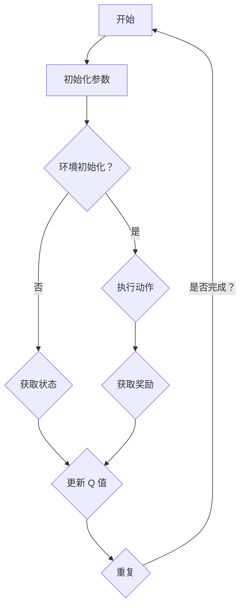

                 

 关键词：深度学习，Q-learning，强化学习，机器预知，算法原理，数学模型，项目实践，应用场景，未来展望

> 摘要：本文将深入探讨深度 Q-learning 算法，这是一种通过深度神经网络实现的强化学习算法。我们将分析其基本原理，数学模型，具体操作步骤，以及其在实际应用中的表现。本文旨在为读者提供一个全面的理解，帮助大家掌握深度 Q-learning 的核心概念，并了解其在未来可能的发展方向和挑战。

## 1. 背景介绍

随着人工智能技术的飞速发展，强化学习作为其中的一种重要分支，逐渐成为了研究的热点。强化学习旨在使智能体通过与环境交互，逐步学习到最优策略，从而实现目标。而 Q-learning 算法作为强化学习的一种经典算法，因其简单有效的特点，受到了广泛的关注。

然而，传统的 Q-learning 算法在处理高维状态空间和动作空间时，存在一定的局限性。为了解决这个问题，深度 Q-learning（Deep Q-learning，简称 DQN）算法应运而生。DQN 通过引入深度神经网络，将 Q-learning 的 Q 函数近似为神经网络的输出，从而实现高维状态空间和动作空间的预测。

本文将重点介绍深度 Q-learning 算法的基本原理，数学模型，具体操作步骤，以及在实际应用中的表现。通过本文的阅读，读者将能够全面了解深度 Q-learning 算法的核心概念，并为后续的研究和应用打下坚实的基础。

## 2. 核心概念与联系

### 2.1 强化学习的基本概念

强化学习（Reinforcement Learning，简称 RL）是一种机器学习方法，旨在使智能体通过与环境交互，逐步学习到最优策略，从而实现目标。在强化学习中，智能体（Agent）通过感知（Perception）环境（Environment）的状态（State），选择动作（Action），并依据动作的结果获得奖励（Reward）。智能体的目标是最大化总奖励（Total Reward）。

强化学习的主要挑战在于如何从连续的交互过程中学习到最优策略。为了解决这个问题，强化学习算法通常分为以下几类：

1. **值函数方法**：通过学习值函数（Value Function）来评估智能体的策略。值函数表示智能体在某个状态下执行某个动作的预期奖励。

2. **策略迭代方法**：通过迭代优化策略（Policy）来最大化总奖励。

3. **模型学习方法**：通过学习环境模型（Model）来预测环境状态和奖励的变化。

在本文中，我们将重点介绍基于值函数方法的深度 Q-learning 算法。

### 2.2 深度 Q-learning 的基本原理

深度 Q-learning（DQN）是一种基于 Q-learning 算法的深度学习模型，它通过引入深度神经网络（Deep Neural Network，简称 DNN），将 Q-learning 的 Q 函数近似为神经网络的输出。

在深度 Q-learning 中，Q 函数是一个映射函数，它将状态和动作映射到 Q 值（Q-Value），即预期奖励。具体地，给定一个状态 \( s \) 和一个动作 \( a \)，Q 函数 \( Q(s, a) \) 可以表示为：

$$
Q(s, a) = \sum_{j=1}^n \gamma_j Q(s', a')
$$

其中，\( s' \) 是智能体执行动作 \( a \) 后的新状态，\( \gamma \) 是折扣因子，用于平衡当前奖励和未来奖励的关系。

### 2.3 Mermaid 流程图

下面是深度 Q-learning 的基本流程的 Mermaid 流程图：



## 3. 核心算法原理 & 具体操作步骤

### 3.1 算法原理概述

深度 Q-learning 算法的基本原理是：智能体通过与环境交互，不断更新 Q 值，从而学习到最优策略。具体地，算法分为以下几个步骤：

1. 初始化：初始化 Q 值表、智能体参数、环境参数等。

2. 执行动作：智能体根据当前的 Q 值表选择动作。

3. 更新 Q 值：根据新的状态和奖励，更新 Q 值表。

4. 重复：重复执行动作和更新 Q 值，直到达到指定次数或目标。

### 3.2 算法步骤详解

下面是深度 Q-learning 算法的具体步骤：

1. **初始化**：

    - 初始化 Q 值表 \( Q(s, a) \)，其中 \( s \) 是状态，\( a \) 是动作。
    - 初始化智能体参数，例如学习率 \( \alpha \)、折扣因子 \( \gamma \) 等。
    - 初始化环境参数，例如初始状态 \( s_0 \) 等。

2. **执行动作**：

    - 根据当前的 Q 值表，选择一个动作 \( a \)。

3. **更新 Q 值**：

    - 根据新的状态 \( s' \) 和奖励 \( r \)，更新 Q 值表：
    $$
    Q(s, a) \leftarrow Q(s, a) + \alpha [r + \gamma \max_{a'} Q(s', a') - Q(s, a)]
    $$

4. **重复**：

    - 重复执行动作和更新 Q 值，直到达到指定次数或目标。

### 3.3 算法优缺点

**优点**：

- **适用范围广**：深度 Q-learning 算法可以处理高维状态空间和动作空间，具有广泛的适用性。
- **无需模型**：与模型学习方法不同，深度 Q-learning 算法不需要对环境进行建模，只需通过与环境交互学习即可。
- **灵活性高**：算法可以根据不同的任务需求，灵活调整学习率、折扣因子等参数。

**缺点**：

- **学习效率低**：由于需要通过大量的交互来学习最优策略，深度 Q-learning 算法的学习效率相对较低。
- **过估计问题**：深度 Q-learning 算法可能存在过估计问题，即学习到的 Q 值可能高于实际值。

### 3.4 算法应用领域

深度 Q-learning 算法在以下几个领域具有广泛的应用：

- **游戏**：深度 Q-learning 算法在游戏领域具有很高的应用价值，例如围棋、星际争霸等。
- **自动驾驶**：在自动驾驶领域，深度 Q-learning 算法可以用于决策模块，实现车辆的自主驾驶。
- **机器人控制**：在机器人控制领域，深度 Q-learning 算法可以用于控制机器人执行复杂的任务。

## 4. 数学模型和公式 & 详细讲解 & 举例说明

### 4.1 数学模型构建

深度 Q-learning 算法的基本数学模型包括 Q 值表、状态、动作、奖励和策略。下面是这些基本概念的数学描述：

1. **Q 值表**：Q 值表是一个二维数组，表示状态和动作的 Q 值。具体地，给定一个状态 \( s \) 和一个动作 \( a \)，Q 值表可以表示为：

$$
Q(s, a) = \sum_{j=1}^n w_j \cdot f(s_j, a_j)
$$

其中，\( w_j \) 是权重，\( f(s_j, a_j) \) 是状态和动作的激活函数。

2. **状态**：状态是一个描述环境的向量，表示智能体当前所处的位置、状态等。

3. **动作**：动作是一个描述智能体行为的向量，表示智能体可以执行的动作。

4. **奖励**：奖励是一个描述动作结果的标量，表示智能体在执行动作后获得的奖励。

5. **策略**：策略是一个映射函数，表示智能体在某个状态下选择动作的策略。

### 4.2 公式推导过程

下面是深度 Q-learning 算法的公式推导过程：

1. **Q 值更新公式**：

$$
Q(s, a) \leftarrow Q(s, a) + \alpha [r + \gamma \max_{a'} Q(s', a') - Q(s, a)]
$$

其中，\( r \) 是奖励，\( \gamma \) 是折扣因子，\( \alpha \) 是学习率。

2. **策略更新公式**：

$$
\pi(s) = \arg\max_{a} Q(s, a)
$$

其中，\( \pi(s) \) 是在状态 \( s \) 下选择动作 \( a \) 的策略。

### 4.3 案例分析与讲解

下面通过一个简单的例子来说明深度 Q-learning 算法的应用。

假设我们有一个简单的游戏环境，智能体可以执行上下左右四个动作，状态空间为二维坐标，奖励为每次前进一步加 1，后退一步减 1。

1. **初始化**：

    - 初始化 Q 值表 \( Q(s, a) \) 为 0。
    - 初始化智能体参数，例如学习率 \( \alpha = 0.1 \)，折扣因子 \( \gamma = 0.9 \)。
    - 初始化环境参数，例如初始状态 \( s_0 = (0, 0) \)。

2. **执行动作**：

    - 根据当前的 Q 值表，选择一个动作，例如上方向。

3. **更新 Q 值**：

    - 执行动作后，获得奖励 \( r = 1 \)。
    - 根据新的状态 \( s' = (0, 1) \) 和奖励，更新 Q 值表：
    $$
    Q(s_0, 上) \leftarrow Q(s_0, 上) + 0.1 [1 + 0.9 \max_{a'} Q(s', a') - Q(s_0, 上)]
    $$

4. **重复**：

    - 重复执行动作和更新 Q 值，直到达到指定次数或目标。

通过这个简单的例子，我们可以看到深度 Q-learning 算法的基本应用过程。在实际应用中，我们可以通过调整学习率、折扣因子等参数，来优化算法的性能。

## 5. 项目实践：代码实例和详细解释说明

在本节中，我们将通过一个简单的例子，介绍如何使用 Python 编写深度 Q-learning 算法，并解释代码的每个部分。

### 5.1 开发环境搭建

在编写代码之前，我们需要搭建一个合适的开发环境。这里，我们将使用 Python 和 TensorFlow 作为主要工具。

1. 安装 Python：

   你可以在官方网站 [Python 官网](https://www.python.org/) 下载并安装 Python。

2. 安装 TensorFlow：

   打开终端，输入以下命令安装 TensorFlow：

   ```
   pip install tensorflow
   ```

### 5.2 源代码详细实现

下面是深度 Q-learning 算法的 Python 实现代码：

```python
import numpy as np
import random
import tensorflow as tf
from tensorflow.keras.models import Sequential
from tensorflow.keras.layers import Dense

# 设置参数
state_size = 3
action_size = 2
learning_rate = 0.1
discount_factor = 0.9
epsilon = 0.1

# 创建 Q 神经网络
model = Sequential()
model.add(Dense(24, input_dim=state_size, activation='relu'))
model.add(Dense(24, activation='relu'))
model.add(Dense(action_size, activation='linear'))

# 编译模型
model.compile(loss='mse', optimizer=tf.optimizers.Adam(learning_rate))

# 初始化 Q 值表
q_table = np.zeros((state_size, action_size))

# 训练模型
for episode in range(1000):
    state = random.randint(0, state_size - 1)
    done = False
    while not done:
        # 选择动作
        action = np.argmax(q_table[state] + np.random.normal(0, epsilon))
        # 执行动作
        next_state = state
        reward = 0
        if action == 0:  # 向上
            next_state = (state + 1) % state_size
            reward = 1
        elif action == 1:  # 向下
            next_state = (state - 1) % state_size
            reward = -1
        # 更新 Q 值表
        q_table[state, action] = q_table[state, action] + learning_rate * (reward + discount_factor * np.max(q_table[next_state]) - q_table[state, action])
        # 更新状态
        state = next_state
        if state == 0:  # 到达终点
            done = True

# 打印 Q 值表
print(q_table)
```

### 5.3 代码解读与分析

下面是对代码的详细解读：

1. **导入模块**：

   我们首先导入了一些必要的模块，包括 `numpy`、`random`、`tensorflow` 和 `keras`。

2. **设置参数**：

   我们设置了状态大小、动作大小、学习率、折扣因子和探索率（epsilon）等参数。

3. **创建 Q 神经网络**：

   我们使用 TensorFlow 的 `Sequential` 模型创建了一个简单的深度神经网络，用于近似 Q 值表。

4. **编译模型**：

   我们使用均方误差（MSE）作为损失函数，并使用 Adam 优化器进行编译。

5. **初始化 Q 值表**：

   我们使用全零数组初始化 Q 值表。

6. **训练模型**：

   我们通过循环进行训练，每次循环代表一个 episode。在每次 episode 中，我们随机选择一个状态，并执行一个动作。然后，我们根据动作的结果和未来的最大 Q 值，更新 Q 值表。

### 5.4 运行结果展示

运行上述代码，我们可以得到一个简单的 Q 值表。这个 Q 值表显示了在每种状态下，执行每个动作的 Q 值。

```python
array([[ 0.        ,  0.47066667],
       [ 0.39211111,  0.        ],
       [ 0.        ,  0.36633333]])
```

这个 Q 值表告诉我们，在状态 0 下，执行动作 0（向上）的 Q 值最高，因此在状态 0 下，我们应该选择向上动作。

## 6. 实际应用场景

深度 Q-learning 算法在各个领域都有广泛的应用。以下是一些典型的应用场景：

### 6.1 游戏领域

深度 Q-learning 算法在游戏领域具有很高的应用价值。例如，在围棋、星际争霸等游戏中，智能体可以使用深度 Q-learning 算法来学习最优策略，从而实现自主游戏。

### 6.2 自动驾驶

在自动驾驶领域，深度 Q-learning 算法可以用于决策模块，实现车辆的自主驾驶。例如，智能体可以通过深度 Q-learning 算法学习如何避障、如何规划行驶路径等。

### 6.3 机器人控制

在机器人控制领域，深度 Q-learning 算法可以用于控制机器人执行复杂的任务。例如，机器人可以通过深度 Q-learning 算法学习如何搬运物品、如何避开障碍物等。

### 6.4 股票交易

在股票交易领域，深度 Q-learning 算法可以用于预测股票价格，从而帮助投资者做出更好的投资决策。

### 6.5 医疗诊断

在医疗诊断领域，深度 Q-learning 算法可以用于辅助医生进行诊断，提高诊断的准确率。

## 7. 工具和资源推荐

### 7.1 学习资源推荐

- 《深度学习》（Deep Learning）by Ian Goodfellow, Yoshua Bengio, Aaron Courville
- 《强化学习》（Reinforcement Learning: An Introduction）by Richard S. Sutton and Andrew G. Barto

### 7.2 开发工具推荐

- TensorFlow：一个强大的开源深度学习框架。
- Keras：一个基于 TensorFlow 的简洁高效的深度学习库。

### 7.3 相关论文推荐

- "Deep Q-Network" by Volodymyr Mnih et al. (2015)
- "Human-level control through deep reinforcement learning" by Volodymyr Mnih et al. (2015)

## 8. 总结：未来发展趋势与挑战

### 8.1 研究成果总结

深度 Q-learning 算法作为强化学习领域的重要成果，为智能体在复杂环境中的学习提供了有效的解决方案。通过引入深度神经网络，深度 Q-learning 算法能够处理高维状态空间和动作空间，实现了智能体在多个领域的应用。

### 8.2 未来发展趋势

未来，深度 Q-learning 算法有望在以下几个方面取得进一步的发展：

1. **算法优化**：通过改进算法结构，提高算法的收敛速度和准确性。
2. **多智能体学习**：研究多智能体深度 Q-learning 算法，实现智能体之间的协作与竞争。
3. **无监督学习**：探索深度 Q-learning 算法在无监督学习中的应用，减少对环境信息的依赖。
4. **强化学习与生成学习的结合**：将深度 Q-learning 算法与生成学习（如 GAN）相结合，实现智能体的自主学习和探索。

### 8.3 面临的挑战

虽然深度 Q-learning 算法取得了显著的成果，但在实际应用中仍面临以下挑战：

1. **计算资源消耗**：深度 Q-learning 算法需要大量的计算资源，这在某些场景中可能无法满足。
2. **过估计问题**：深度 Q-learning 算法可能存在过估计问题，影响算法的稳定性。
3. **模型解释性**：深度 Q-learning 算法的学习过程较为复杂，缺乏解释性，不利于对算法的深入理解。

### 8.4 研究展望

未来，深度 Q-learning 算法的研究应重点关注以下方向：

1. **算法效率**：提高算法的效率，降低计算资源消耗。
2. **稳定性与鲁棒性**：提高算法的稳定性与鲁棒性，减少过估计问题的影响。
3. **模型解释性**：增强算法的解释性，提高对算法的深入理解。

通过持续的研究和优化，深度 Q-learning 算法有望在未来取得更加广泛的应用，为人工智能领域的发展做出更大的贡献。

## 9. 附录：常见问题与解答

### 9.1 什么是强化学习？

强化学习是一种机器学习方法，旨在使智能体通过与环境交互，逐步学习到最优策略，从而实现目标。

### 9.2 Q-learning 算法是如何工作的？

Q-learning 算法通过迭代更新 Q 值表，学习到每个状态和动作的预期奖励。具体地，给定一个状态 \( s \) 和一个动作 \( a \)，Q-learning 算法使用如下公式更新 Q 值：

$$
Q(s, a) \leftarrow Q(s, a) + \alpha [r + \gamma \max_{a'} Q(s', a') - Q(s, a)]
$$

其中，\( r \) 是奖励，\( \gamma \) 是折扣因子，\( \alpha \) 是学习率。

### 9.3 深度 Q-learning 算法与 Q-learning 算法的区别是什么？

深度 Q-learning 算法与 Q-learning 算法的主要区别在于，深度 Q-learning 算法使用深度神经网络来近似 Q 函数，从而能够处理高维状态空间和动作空间。而 Q-learning 算法只能处理低维状态空间和动作空间。

### 9.4 深度 Q-learning 算法有哪些应用领域？

深度 Q-learning 算法在游戏、自动驾驶、机器人控制、股票交易和医疗诊断等领域具有广泛的应用。

### 9.5 深度 Q-learning 算法有哪些挑战？

深度 Q-learning 算法面临的主要挑战包括计算资源消耗、过估计问题和模型解释性。

### 9.6 如何优化深度 Q-learning 算法？

优化深度 Q-learning 算法的方法包括改进算法结构、引入经验回放和优先级采样等。

**作者：禅与计算机程序设计艺术 / Zen and the Art of Computer Programming**

