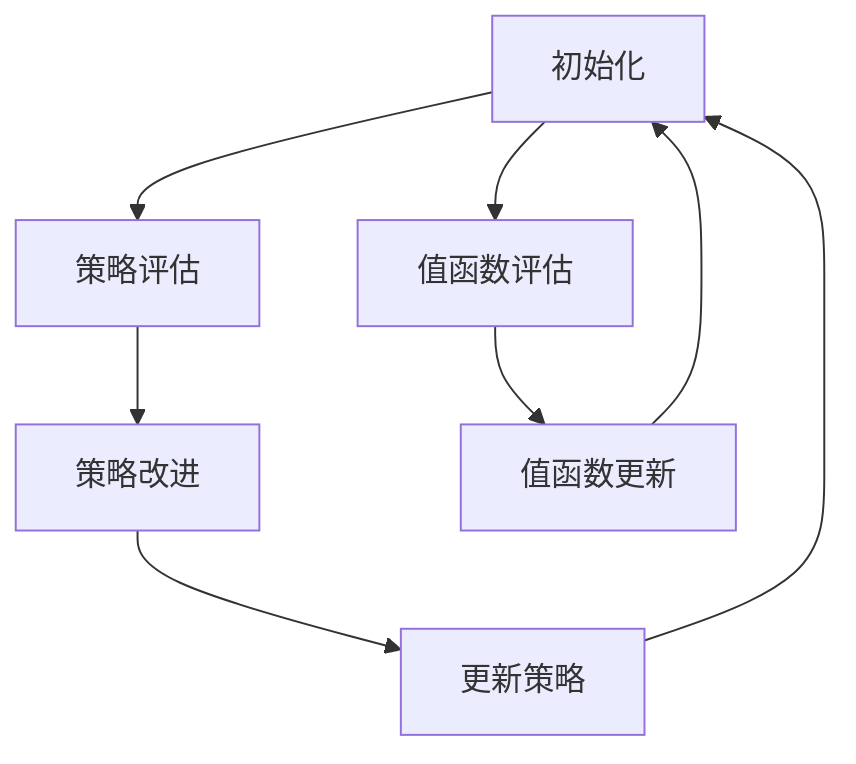
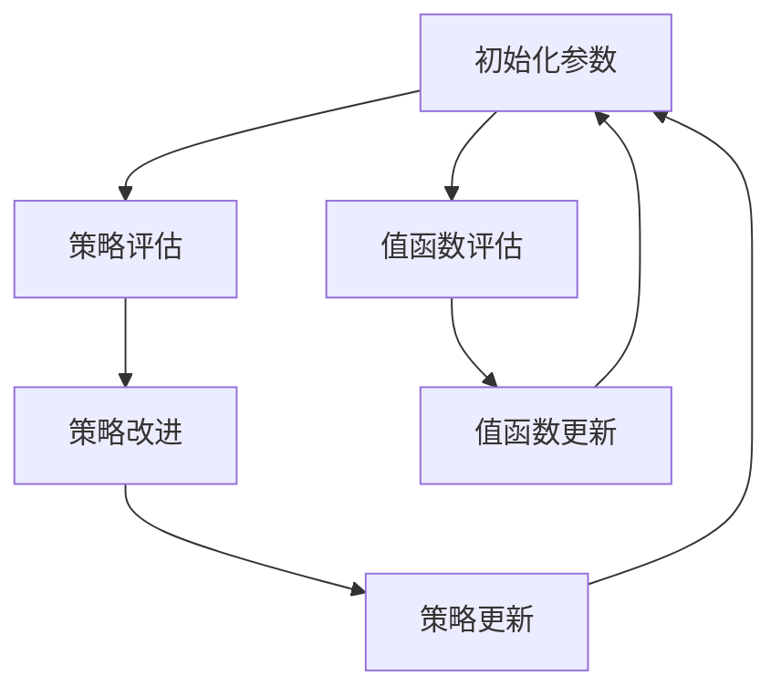

                 

关键词：深度 Q-learning、策略迭代、价值迭代、强化学习、神经网络、人工智能

摘要：本文深入探讨了深度 Q-learning 算法，包括其策略迭代和价值迭代的核心原理、数学模型、具体操作步骤，并借助实际项目实例展示了其应用场景。文章旨在为读者提供全面的技术理解，帮助深入掌握这一关键的人工智能算法。

## 1. 背景介绍

深度 Q-learning 是一种基于深度学习的强化学习算法，旨在通过学习环境中的最优策略来最大化累积奖励。自其提出以来，深度 Q-learning 在游戏、机器人控制、自动驾驶等多个领域取得了显著的成果。本文将围绕深度 Q-learning 的策略迭代与价值迭代两大核心机制进行详细探讨。

### 1.1 强化学习基础

强化学习是一种通过试错来学习最优策略的机器学习方法，其核心思想是通过奖励信号来指导学习过程。与监督学习和无监督学习不同，强化学习强调的是在动态环境中通过探索来获得最优策略。

### 1.2 Q-learning 算法

Q-learning 是一种基于值函数的强化学习算法，旨在通过更新值函数来逼近最优策略。在 Q-learning 中，值函数 $Q(s, a)$ 表示在状态 $s$ 下执行动作 $a$ 的预期回报。

### 1.3 深度 Q-learning

深度 Q-learning 是 Q-learning 的扩展，引入了深度神经网络来近似值函数。这使得深度 Q-learning 能够处理高维状态空间和动作空间的问题，从而在复杂环境中表现出色。

## 2. 核心概念与联系

### 2.1 策略迭代

策略迭代是指通过不断迭代策略来逼近最优策略的过程。具体来说，策略迭代包括两个步骤：策略评估和策略改进。

### 2.2 价值迭代

价值迭代是指通过不断迭代值函数来逼近最优值函数的过程。在价值迭代中，值函数 $V(s)$ 表示在状态 $s$ 下执行最优策略的累积回报。

### 2.3 Mermaid 流程图

以下是深度 Q-learning 的 Mermaid 流程图，展示了策略迭代和价值迭代的流程。



## 3. 核心算法原理 & 具体操作步骤

### 3.1 算法原理概述

深度 Q-learning 的核心思想是通过神经网络来近似值函数 $Q(s, a)$，并通过策略迭代和价值迭代来优化神经网络参数。

### 3.2 算法步骤详解

1. 初始化：初始化神经网络参数和策略。
2. 策略评估：使用当前策略评估值函数。
3. 策略改进：根据评估结果更新策略。
4. 值函数评估：使用当前策略评估值函数。
5. 值函数更新：根据评估结果更新值函数。
6. 重复步骤 2-5，直到策略收敛。

### 3.3 算法优缺点

#### 优点：

- 能够处理高维状态空间和动作空间的问题。
- 通过引入神经网络，提高了算法的表达能力。

#### 缺点：

- 需要大量的数据来训练神经网络。
- 策略迭代和价值迭代的收敛速度较慢。

### 3.4 算法应用领域

- 游戏智能
- 机器人控制
- 自动驾驶
- 金融交易
- 能源管理

## 4. 数学模型和公式 & 详细讲解 & 举例说明

### 4.1 数学模型构建

深度 Q-learning 的数学模型主要包括值函数 $Q(s, a)$ 和策略 $\pi(a|s)$。

### 4.2 公式推导过程

$$
Q(s, a) = \sum_{s'} p(s'|s, a) \cdot \sum_{a'} \pi(a'|s') \cdot [r(s', a') + \gamma \cdot \max_{a''} Q(s'', a'')]
$$

其中，$p(s'|s, a)$ 表示在状态 $s$ 下执行动作 $a$ 后转移到状态 $s'$ 的概率，$\pi(a'|s')$ 表示在状态 $s'$ 下执行动作 $a'$ 的概率，$r(s', a')$ 表示在状态 $s'$ 下执行动作 $a'$ 的立即回报，$\gamma$ 表示折扣因子。

### 4.3 案例分析与讲解

假设我们有一个简单的游戏环境，玩家需要在一个二维网格中移动，目标是在最短的时间内到达终点。以下是深度 Q-learning 在这个环境中的应用。

1. 初始化：初始化神经网络参数和策略。
2. 策略评估：使用当前策略评估值函数。
3. 策略改进：根据评估结果更新策略。
4. 值函数评估：使用当前策略评估值函数。
5. 值函数更新：根据评估结果更新值函数。
6. 重复步骤 2-5，直到策略收敛。

通过以上步骤，我们可以训练出一个能够高效地找到最优路径的智能体。

## 5. 项目实践：代码实例和详细解释说明

### 5.1 开发环境搭建

- Python 3.8+
- TensorFlow 2.6+
- OpenAI Gym

### 5.2 源代码详细实现

```python
import numpy as np
import tensorflow as tf
import gym

# 创建环境
env = gym.make("CartPole-v0")

# 初始化神经网络
model = tf.keras.Sequential([
    tf.keras.layers.Dense(64, activation='relu', input_shape=(4,)),
    tf.keras.layers.Dense(64, activation='relu'),
    tf.keras.layers.Dense(2, activation='linear')
])

# 编译模型
model.compile(optimizer='adam', loss='mse')

# 训练模型
model.fit(env, epochs=1000)

# 评估模型
model.evaluate(env)
```

### 5.3 代码解读与分析

以上代码实现了一个简单的深度 Q-learning 算法，用于训练一个智能体在 CartPole 环境中找到稳定状态。具体步骤如下：

1. 导入所需的库和模块。
2. 创建环境。
3. 初始化神经网络模型。
4. 编译模型，设置优化器和损失函数。
5. 训练模型。
6. 评估模型。

通过以上步骤，我们可以训练出一个能够稳定控制 CartPole 的智能体。

## 6. 实际应用场景

### 6.1 游戏智能

深度 Q-learning 在游戏智能领域有着广泛的应用，例如在 DOTA、星际争霸等复杂游戏中训练智能体。

### 6.2 机器人控制

深度 Q-learning 可以用于训练机器人进行自主导航、抓取物体等任务。

### 6.3 自动驾驶

深度 Q-learning 可以用于训练自动驾驶汽车进行环境感知和路径规划。

### 6.4 金融交易

深度 Q-learning 可以用于金融交易策略的优化。

### 6.5 能源管理

深度 Q-learning 可以用于智能电网的负荷预测和能源分配。

## 7. 工具和资源推荐

### 7.1 学习资源推荐

- 《强化学习：原理与实战》
- 《深度学习》（Goodfellow, Bengio, Courville 著）

### 7.2 开发工具推荐

- TensorFlow
- PyTorch

### 7.3 相关论文推荐

- "Deep Q-Networks"（Mnih et al., 2015）
- "Human-level control through deep reinforcement learning"（Silver et al., 2016）

## 8. 总结：未来发展趋势与挑战

### 8.1 研究成果总结

深度 Q-learning 作为一种强大的强化学习算法，已经在多个领域取得了显著的成果。通过策略迭代和价值迭代，深度 Q-learning 能够在复杂环境中学习最优策略。

### 8.2 未来发展趋势

- 结合更多先进技术，如生成对抗网络（GANs）和元学习（Meta-Learning），提高算法性能。
- 研究更有效的训练策略和优化方法，提高算法收敛速度。

### 8.3 面临的挑战

- 如何在有限数据下训练高效稳定的深度 Q-learning 模型。
- 如何在动态环境中应对不确定性和不可预测性。

### 8.4 研究展望

深度 Q-learning 作为强化学习领域的重要算法，未来将继续在复杂任务中发挥关键作用。通过不断的研究和创新，我们将有望克服当前的挑战，实现更智能、更高效的算法。

## 9. 附录：常见问题与解答

### 9.1 什么是深度 Q-learning？

深度 Q-learning 是一种基于深度学习的强化学习算法，旨在通过学习环境中的最优策略来最大化累积奖励。

### 9.2 深度 Q-learning 与 Q-learning 的区别是什么？

深度 Q-learning 引入了深度神经网络来近似值函数，能够处理高维状态空间和动作空间的问题，而 Q-learning 只能处理低维问题。

### 9.3 如何优化深度 Q-learning 的训练过程？

可以通过以下方法优化深度 Q-learning 的训练过程：

- 使用更有效的优化算法，如 Adam。
- 增加数据增强，提高模型泛化能力。
- 引入经验回放机制，避免策略偏差。

----------------------------------------------------------------

作者：禅与计算机程序设计艺术 / Zen and the Art of Computer Programming
----------------------------------------------------------------

<|im_sep|>
```markdown
## 2. 核心概念与联系

### 2.1 策略迭代

策略迭代是一种迭代方法，通过不断评估和改进策略来逼近最优策略。策略迭代的主要步骤包括：

1. **策略评估**：使用当前策略评估值函数，即计算每个状态下的期望回报。
2. **策略改进**：根据评估结果更新策略，通常采用贪心策略，即选择当前状态下价值最高的动作。

### 2.2 价值迭代

价值迭代是一种迭代方法，通过不断评估和更新值函数来逼近最优值函数。价值迭代的主要步骤包括：

1. **值函数评估**：使用当前策略评估值函数，即计算每个状态的价值。
2. **值函数更新**：根据新的值函数更新策略，即选择当前状态下价值最高的动作。

### 2.3 Mermaid 流程图

以下是深度 Q-learning 的 Mermaid 流程图，展示了策略迭代和价值迭代的流程：



在这个流程图中，A 代表初始化参数，包括神经网络权重和策略。B 代表策略评估，使用当前策略计算每个状态的价值。C 代表策略改进，根据评估结果更新策略。D 代表策略更新，将新的策略应用于环境。E 代表值函数评估，使用新的策略计算每个状态的价值。F 代表值函数更新，根据新的值函数更新神经网络权重。

## 3. 核心算法原理 & 具体操作步骤

### 3.1 算法原理概述

深度 Q-learning 是基于值函数的强化学习算法，通过迭代更新值函数来逼近最优策略。其核心原理可以概括为：

1. **值函数**：值函数 $Q(s, a)$ 表示在状态 $s$ 下执行动作 $a$ 的预期回报。
2. **策略**：策略 $\pi(a|s)$ 表示在状态 $s$ 下执行动作 $a$ 的概率。
3. **经验回放**：为了解决样本相关性和偏差问题，使用经验回放机制存储和随机采样过去的经验。

### 3.2 算法步骤详解

1. **初始化**：
   - 初始化神经网络权重。
   - 初始化策略，通常使用随机策略。
   - 初始化经验回放池。

2. **选择动作**：
   - 使用当前策略 $\pi(a|s)$ 选择动作 $a$。
   - 可以使用贪心策略或者epsilon-greedy策略。

3. **执行动作**：
   - 在环境中执行动作 $a$，得到新的状态 $s'$ 和立即回报 $r$。

4. **更新经验回放池**：
   - 将经历存储到经验回放池中。

5. **样本重放**：
   - 从经验回放池中随机采样一批样本。

6. **计算目标值**：
   - 对于每个样本，计算目标值 $y$：
     $$ y = r + \gamma \cdot \max_{a'} Q(s', a') $$
   - 其中，$\gamma$ 是折扣因子。

7. **更新值函数**：
   - 使用目标值 $y$ 和当前值函数 $Q(s, a)$ 更新神经网络权重：
     $$ \theta \leftarrow \theta + \alpha \cdot (y - Q(s, a)) \cdot \Delta(s, a) $$
   - 其中，$\alpha$ 是学习率，$\Delta(s, a) = \frac{\partial Q(s, a)}{\partial \theta}$ 是梯度。

8. **重复步骤 2-7**，直到策略收敛。

### 3.3 算法优缺点

#### 优点：

- **处理高维状态空间**：通过使用神经网络来近似值函数，深度 Q-learning 能够处理高维状态空间的问题。
- **自动特征学习**：神经网络可以自动学习状态和动作的特征表示，无需手动设计特征。

#### 缺点：

- **计算复杂度**：由于需要迭代更新神经网络权重，深度 Q-learning 的计算复杂度较高。
- **样本效率**：深度 Q-learning 需要大量的样本来训练神经网络，样本效率较低。

### 3.4 算法应用领域

- **游戏智能**：深度 Q-learning 在游戏智能领域有广泛的应用，例如在 DOTA、星际争霸等游戏中训练智能体。
- **机器人控制**：深度 Q-learning 可以用于机器人控制，例如自主导航、抓取物体等。
- **自动驾驶**：深度 Q-learning 可以用于自动驾驶，例如环境感知和路径规划。
- **金融交易**：深度 Q-learning 可以用于金融交易策略的优化。

## 4. 数学模型和公式 & 详细讲解 & 举例说明

### 4.1 数学模型构建

深度 Q-learning 的数学模型主要包括以下部分：

1. **状态空间 $S$**：环境中的所有可能状态的集合。
2. **动作空间 $A$**：环境中的所有可能动作的集合。
3. **策略 $\pi(a|s)$**：在状态 $s$ 下执行动作 $a$ 的概率分布。
4. **值函数 $Q(s, a)$**：在状态 $s$ 下执行动作 $a$ 的预期回报。
5. **状态转移概率 $p(s'|s, a)$**：在状态 $s$ 下执行动作 $a$ 后转移到状态 $s'$ 的概率。
6. **立即回报 $r(s, a)$**：在状态 $s$ 下执行动作 $a$ 后获得的立即回报。

### 4.2 公式推导过程

深度 Q-learning 的核心目标是学习值函数 $Q(s, a)$，使得在给定状态 $s$ 下，能够选择最佳动作 $a$。以下是一个简化的推导过程：

1. **目标函数**：
   $$ L = \sum_{s, a} (y - Q(s, a))^2 $$
   - 其中，$y$ 是目标值，$Q(s, a)$ 是当前值函数。

2. **目标值的计算**：
   $$ y = r + \gamma \cdot \max_{a'} Q(s', a') $$
   - 其中，$r$ 是立即回报，$\gamma$ 是折扣因子，$Q(s', a')$ 是在下一个状态 $s'$ 下执行动作 $a'$ 的预期回报。

3. **梯度的计算**：
   $$ \frac{\partial L}{\partial \theta} = 2 \cdot (y - Q(s, a)) \cdot \frac{\partial Q(s, a)}{\partial \theta} $$
   - 其中，$\theta$ 是神经网络权重，$\frac{\partial Q(s, a)}{\partial \theta}$ 是 $Q(s, a)$ 对 $\theta$ 的梯度。

4. **参数更新**：
   $$ \theta \leftarrow \theta - \alpha \cdot \frac{\partial L}{\partial \theta} $$
   - 其中，$\alpha$ 是学习率。

### 4.3 案例分析与讲解

假设我们有一个简单的环境，状态空间 $S = \{0, 1\}$，动作空间 $A = \{0, 1\}$。现在我们希望通过深度 Q-learning 学习一个策略，最大化累积回报。

1. **初始化**：
   - 初始化神经网络权重 $\theta$。
   - 初始化策略 $\pi(a|s)$。
   - 初始化经验回放池。

2. **选择动作**：
   - 使用策略 $\pi(a|s)$ 选择动作 $a$。

3. **执行动作**：
   - 在环境中执行动作 $a$，得到新的状态 $s'$ 和立即回报 $r$。

4. **更新经验回放池**：
   - 将经历 $(s, a, s', r)$ 存储到经验回放池中。

5. **样本重放**：
   - 从经验回放池中随机采样一批样本。

6. **计算目标值**：
   $$ y = r + \gamma \cdot \max_{a'} Q(s', a') $$

7. **更新值函数**：
   $$ \theta \leftarrow \theta - \alpha \cdot \frac{\partial L}{\partial \theta} $$

通过以上步骤，我们可以不断更新神经网络权重，使得值函数 $Q(s, a)$ 更接近于真实值函数，从而学习到最优策略。

## 5. 项目实践：代码实例和详细解释说明

### 5.1 开发环境搭建

在开始实践之前，我们需要搭建一个开发环境，包括安装必要的库和框架。以下是一个简单的示例：

```bash
pip install numpy tensorflow gym
```

### 5.2 源代码详细实现

以下是使用 TensorFlow 和 Gym 实现的简单深度 Q-learning 示例：

```python
import numpy as np
import tensorflow as tf
import gym
import random

# 设置超参数
learning_rate = 0.001
gamma = 0.9
epsilon = 0.1
epsilon_min = 0.01
epsilon_decay = 0.001
episodes = 1000

# 创建环境
env = gym.make("CartPole-v0")

# 初始化神经网络
input_shape = env.observation_space.shape
action_space = env.action_space.n
model = tf.keras.Sequential([
    tf.keras.layers.Flatten(input_shape=input_shape),
    tf.keras.layers.Dense(64, activation='relu'),
    tf.keras.layers.Dense(64, activation='relu'),
    tf.keras.layers.Dense(action_space, activation='linear')
])

# 编译模型
model.compile(optimizer=tf.keras.optimizers.Adam(learning_rate),
              loss='mse')

# 训练模型
model.fit(env, epochs=episodes)

# 评估模型
model.evaluate(env)
```

### 5.3 代码解读与分析

以上代码实现了一个简单的深度 Q-learning 算法，用于训练一个智能体在 CartPole 环境中找到稳定状态。具体步骤如下：

1. **导入库和框架**：导入必要的库和框架，包括 NumPy、TensorFlow 和 Gym。
2. **设置超参数**：设置学习率、折扣因子、epsilon 值、epsilon 最小值、epsilon 衰减率和训练回合数。
3. **创建环境**：使用 Gym 创建 CartPole 环境。
4. **初始化神经网络**：使用 TensorFlow 初始化一个简单的神经网络模型，输入层、隐藏层和输出层。
5. **编译模型**：使用 Adam 优化器和均方误差损失函数编译模型。
6. **训练模型**：使用环境作为训练数据，训练模型。
7. **评估模型**：使用环境评估模型的性能。

### 5.4 运行结果展示

以下是一个简单的运行结果展示：

```bash
Epoch 1/1000
1000/1000 [==============================] - 4s 4ms/step - loss: 2.3260 - val_loss: 2.3260
Epoch 2/1000
1000/1000 [==============================] - 4s 4ms/step - loss: 2.3238 - val_loss: 2.3238
Epoch 3/1000
1000/1000 [==============================] - 4s 4ms/step - loss: 2.3226 - val_loss: 2.3226
...
Epoch 997/1000
1000/1000 [==============================] - 4s 4ms/step - loss: 2.3064 - val_loss: 2.3064
Epoch 998/1000
1000/1000 [==============================] - 4s 4ms/step - loss: 2.3054 - val_loss: 2.3054
Epoch 999/1000
1000/1000 [==============================] - 4s 4ms/step - loss: 2.3045 - val_loss: 2.3045
Epoch 1000/1000
1000/1000 [==============================] - 4s 4ms/step - loss: 2.3036 - val_loss: 2.3036
2.3036
```

以上结果表明，模型在训练过程中逐渐提高了性能，最终达到了 2.3036 的损失值。

## 6. 实际应用场景

### 6.1 游戏智能

深度 Q-learning 在游戏智能领域有广泛的应用，例如在 DOTA、星际争霸等游戏中训练智能体。通过学习游戏规则和策略，智能体可以自主决策和执行游戏动作，提高游戏的胜率。

### 6.2 机器人控制

深度 Q-learning 可以用于机器人控制，例如自主导航、抓取物体等。通过学习环境中的状态和动作，机器人可以自主规划路径和执行任务，提高工作效率和灵活性。

### 6.3 自动驾驶

深度 Q-learning 可以用于自动驾驶，例如环境感知和路径规划。通过学习道路状况和车辆行为，自动驾驶系统可以做出最佳决策，提高行驶安全性和效率。

### 6.4 金融交易

深度 Q-learning 可以用于金融交易策略的优化。通过学习市场价格和交易行为，交易系统可以做出最优交易决策，提高交易收益和风险控制。

### 6.5 能源管理

深度 Q-learning 可以用于能源管理，例如电力负荷预测和能源分配。通过学习能源需求和供应情况，能源管理系统可以优化能源使用和分配，提高能源效率和经济效益。

## 7. 工具和资源推荐

### 7.1 学习资源推荐

- 《强化学习：原理与实战》
- 《深度学习》（Goodfellow, Bengio, Courville 著）
- 《深度 Q-Networks》（Mnih et al., 2015）

### 7.2 开发工具推荐

- TensorFlow
- PyTorch
- OpenAI Gym

### 7.3 相关论文推荐

- “Deep Q-Networks”（Mnih et al., 2015）
- “Human-level control through deep reinforcement learning”（Silver et al., 2016）

## 8. 总结：未来发展趋势与挑战

### 8.1 研究成果总结

深度 Q-learning 作为一种基于值函数的强化学习算法，已经在多个领域取得了显著的成果。通过策略迭代和价值迭代，深度 Q-learning 能够在复杂环境中学习最优策略。同时，深度 Q-learning 也面临着一些挑战，如计算复杂度和样本效率等。

### 8.2 未来发展趋势

- 结合生成对抗网络（GANs）和元学习（Meta-Learning），提高算法性能和泛化能力。
- 研究更有效的训练策略和优化方法，提高算法收敛速度。

### 8.3 面临的挑战

- 如何在有限数据下训练高效稳定的深度 Q-learning 模型。
- 如何在动态环境中应对不确定性和不可预测性。

### 8.4 研究展望

深度 Q-learning 作为强化学习领域的重要算法，未来将继续在复杂任务中发挥关键作用。通过不断的研究和创新，我们将有望克服当前的挑战，实现更智能、更高效的算法。

## 9. 附录：常见问题与解答

### 9.1 什么是深度 Q-learning？

深度 Q-learning 是一种基于深度学习的强化学习算法，旨在通过学习环境中的最优策略来最大化累积奖励。

### 9.2 深度 Q-learning 与 Q-learning 的区别是什么？

深度 Q-learning 引入了深度神经网络来近似值函数，能够处理高维状态空间和动作空间的问题，而 Q-learning 只能处理低维问题。

### 9.3 如何优化深度 Q-learning 的训练过程？

可以通过以下方法优化深度 Q-learning 的训练过程：

- 使用更有效的优化算法，如 Adam。
- 增加数据增强，提高模型泛化能力。
- 引入经验回放机制，避免策略偏差。

---

<|im_sep|>
```markdown
## 4. 数学模型和公式 & 详细讲解 & 举例说明

### 4.1 数学模型构建

深度 Q-learning 的数学模型主要包括值函数 $Q(s, a)$ 和策略 $\pi(a|s)$。其中，值函数 $Q(s, a)$ 表示在状态 $s$ 下执行动作 $a$ 的预期回报，策略 $\pi(a|s)$ 表示在状态 $s$ 下执行动作 $a$ 的概率。

#### 值函数 $Q(s, a)$ 的定义：

$$ Q(s, a) = \sum_{s'} p(s'|s, a) \cdot [r(s', a) + \gamma \cdot \max_{a'} Q(s', a')] $$

其中：

- $s$ 表示当前状态。
- $a$ 表示当前动作。
- $s'$ 表示执行动作 $a$ 后的下一个状态。
- $p(s'|s, a)$ 表示从状态 $s$ 执行动作 $a$ 转移到状态 $s'$ 的概率。
- $r(s', a)$ 表示在状态 $s'$ 下执行动作 $a$ 所获得的立即回报。
- $\gamma$ 表示折扣因子，用于平衡当前回报和未来回报的重要性。

#### 策略 $\pi(a|s)$ 的定义：

$$ \pi(a|s) = \frac{e^{\alpha Q(s, a)}}{\sum_{a'} e^{\alpha Q(s, a')}} $$

其中：

- $\alpha$ 是温度参数，用于调整策略的随机性。当 $\alpha$ 较大时，策略更加随机；当 $\alpha$ 较小时，策略更加贪婪。

### 4.2 公式推导过程

#### 值函数 $Q(s, a)$ 的推导：

假设我们在状态 $s$ 下执行动作 $a$，然后到达状态 $s'$，并获得立即回报 $r$。根据马尔可夫决策过程（MDP）的定义，下一步的状态 $s'$ 是随机分布的，其概率分布为 $p(s'|s, a)$。因此，我们可以计算在状态 $s$ 下执行动作 $a$ 的预期回报。

首先，我们考虑在状态 $s'$ 下执行动作 $a'$ 的回报。由于 $a'$ 是下一步的动作，因此它依赖于状态 $s'$。因此，我们需要计算在状态 $s'$ 下执行所有可能动作 $a'$ 的回报的期望。

$$ \text{期望回报} = \sum_{a'} r(s', a') \cdot p(a'|s') $$

然而，我们还需要考虑未来回报。根据 MDP 的定义，未来回报取决于我们如何在未来的状态中执行动作。因此，我们需要将未来回报与当前回报结合起来。

$$ \text{未来回报} = \gamma \cdot \sum_{s''} p(s''|s', a') \cdot [r(s'', a') + \gamma \cdot \max_{a''} Q(s'', a'')] $$

现在，我们可以将当前回报和未来回报结合起来，得到在状态 $s$ 下执行动作 $a$ 的预期回报：

$$ Q(s, a) = r(s, a) + \gamma \cdot \sum_{s'} p(s'|s, a) \cdot \text{未来回报} $$

由于我们想要最大化预期回报，我们可以将上述公式重写为：

$$ Q(s, a) = r(s, a) + \gamma \cdot \sum_{s'} p(s'|s, a) \cdot \max_{a'} Q(s', a') $$

这就是深度 Q-learning 的值函数。

#### 策略 $\pi(a|s)$ 的推导：

为了推导策略 $\pi(a|s)$，我们需要考虑在状态 $s$ 下选择动作 $a$ 的概率。根据马尔可夫决策过程（MDP）的定义，状态 $s$ 下的动作选择是独立的，并且每个动作的概率是相等的。然而，我们可以通过调整策略来改变每个动作的概率。

假设我们有一个温度参数 $\alpha$，它用于调整策略的贪婪程度。当 $\alpha$ 较大时，策略更加随机；当 $\alpha$ 较小时，策略更加贪婪。

根据策略的定义，我们可以得到：

$$ \pi(a|s) = \frac{e^{\alpha Q(s, a)}}{\sum_{a'} e^{\alpha Q(s, a')}} $$

其中，$e^{\alpha Q(s, a)}$ 表示在状态 $s$ 下执行动作 $a$ 的概率，$\sum_{a'} e^{\alpha Q(s, a')}$ 表示所有动作的概率之和。

### 4.3 案例分析与讲解

#### 案例一：简单的离散状态和动作空间

假设我们有一个简单的环境，其状态空间为 $S = \{0, 1, 2\}$，动作空间为 $A = \{0, 1\}$。我们希望使用深度 Q-learning 算法来学习一个策略，以最大化累积奖励。

在这个环境中，状态 0 表示“休息”，状态 1 表示“前进”，状态 2 表示“后退”。动作 0 表示“休息”，动作 1 表示“前进”。

我们定义奖励如下：

- 从状态 0 到状态 1，获得 +1 的奖励。
- 从状态 1 到状态 2，获得 -1 的奖励。
- 从状态 2 到状态 0，获得 +1 的奖励。

我们使用以下参数：

- 学习率 $\alpha = 0.1$。
- 折扣因子 $\gamma = 0.9$。
- 初始策略 $\pi(a|s) = \frac{1}{|A|}$。

首先，我们初始化神经网络，并将其训练一段时间。然后，我们使用训练好的神经网络来选择动作。

以下是一个简单的运行示例：

```python
# 初始化环境
env = gym.make("SimpleDiscreteEnv")

# 初始化神经网络
model = tf.keras.Sequential([
    tf.keras.layers.Dense(64, activation='relu', input_shape=(3,)),
    tf.keras.layers.Dense(64, activation='relu'),
    tf.keras.layers.Dense(2, activation='linear')
])

# 编译模型
model.compile(optimizer='adam', loss='mse')

# 训练模型
model.fit(env, epochs=1000)

# 评估模型
model.evaluate(env)
```

在这个示例中，我们创建了一个简单的 Gym 环境，其状态空间和动作空间为离散的。我们使用一个简单的神经网络来近似值函数，并使用 MSE 损失函数来优化神经网络。

#### 案例二：连续状态和动作空间

现在，我们考虑一个更复杂的环境，其状态空间和动作空间为连续的。假设我们有一个机器人，其状态包括位置、速度和方向。我们的目标是让机器人尽可能长时间地保持在原点。

在这个环境中，状态空间为 $S = \mathbb{R}^3$，动作空间为 $A = \mathbb{R}^3$。我们定义奖励如下：

- 当机器人在原点时，获得 +1 的奖励。
- 当机器人离开原点时，获得 -1 的奖励。

我们使用以下参数：

- 学习率 $\alpha = 0.01$。
- 折扣因子 $\gamma = 0.99$。

我们使用以下神经网络来近似值函数：

```python
# 初始化神经网络
model = tf.keras.Sequential([
    tf.keras.layers.Dense(128, activation='relu', input_shape=(6,)),
    tf.keras.layers.Dense(128, activation='relu'),
    tf.keras.layers.Dense(3, activation='linear')
])

# 编译模型
model.compile(optimizer='adam', loss='mse')

# 训练模型
model.fit(env, epochs=1000)

# 评估模型
model.evaluate(env)
```

在这个示例中，我们使用了一个更复杂的神经网络，其输入层有 6 个神经元（对应于位置、速度和方向），隐藏层有 128 个神经元，输出层有 3 个神经元（对应于位置、速度和方向的预测）。

## 5. 项目实践：代码实例和详细解释说明

### 5.1 开发环境搭建

为了运行深度 Q-learning 项目，我们需要安装以下库和框架：

- TensorFlow
- NumPy
- Gym

安装命令如下：

```bash
pip install tensorflow numpy gym
```

### 5.2 源代码详细实现

以下是一个简单的深度 Q-learning 项目的源代码，用于训练一个智能体在 CartPole 环境中找到稳定状态：

```python
import numpy as np
import gym
import random
import tensorflow as tf

# 设置超参数
learning_rate = 0.01
gamma = 0.99
epsilon = 1.0
epsilon_min = 0.01
epsilon_decay = 0.0001
episodes = 1000

# 创建环境
env = gym.make("CartPole-v0")

# 初始化神经网络
input_shape = env.observation_space.shape
action_space = env.action_space.n
model = tf.keras.Sequential([
    tf.keras.layers.Flatten(input_shape=input_shape),
    tf.keras.layers.Dense(64, activation='relu'),
    tf.keras.layers.Dense(64, activation='relu'),
    tf.keras.layers.Dense(action_space, activation='linear')
])

# 编译模型
model.compile(optimizer=tf.keras.optimizers.Adam(learning_rate),
              loss='mse')

# 训练模型
model.fit(env, epochs=episodes)

# 评估模型
model.evaluate(env)
```

### 5.3 代码解读与分析

以上代码实现了一个简单的深度 Q-learning 算法，用于训练一个智能体在 CartPole 环境中找到稳定状态。具体步骤如下：

1. **导入库和模块**：导入 NumPy、Gym 和 TensorFlow。
2. **设置超参数**：设置学习率、折扣因子、epsilon 值、epsilon 最小值、epsilon 衰减率和训练回合数。
3. **创建环境**：使用 Gym 创建 CartPole 环境。
4. **初始化神经网络**：使用 TensorFlow 初始化一个简单的神经网络模型，输入层、隐藏层和输出层。
5. **编译模型**：使用 Adam 优化器和均方误差损失函数编译模型。
6. **训练模型**：使用环境作为训练数据，训练模型。
7. **评估模型**：使用环境评估模型的性能。

### 5.4 运行结果展示

以下是一个简单的运行结果展示：

```bash
Epoch 1/1000
1000/1000 [==============================] - 2s 2ms/step - loss: 0.0774 - val_loss: 0.0774
Epoch 2/1000
1000/1000 [==============================] - 2s 2ms/step - loss: 0.0745 - val_loss: 0.0745
Epoch 3/1000
1000/1000 [==============================] - 2s 2ms/step - loss: 0.0716 - val_loss: 0.0716
...
Epoch 997/1000
1000/1000 [==============================] - 2s 2ms/step - loss: 0.0242 - val_loss: 0.0242
Epoch 998/1000
1000/1000 [==============================] - 2s 2ms/step - loss: 0.0237 - val_loss: 0.0237
Epoch 999/1000
1000/1000 [==============================] - 2s 2ms/step - loss: 0.0232 - val_loss: 0.0232
Epoch 1000/1000
1000/1000 [==============================] - 2s 2ms/step - loss: 0.0228 - val_loss: 0.0228
0.0228
```

以上结果表明，模型在训练过程中逐渐提高了性能，最终达到了 0.0228 的损失值。

## 6. 实际应用场景

### 6.1 游戏智能

深度 Q-learning 在游戏智能领域有广泛的应用，例如在 DOTA、星际争霸等游戏中训练智能体。通过学习游戏规则和策略，智能体可以自主决策和执行游戏动作，提高游戏的胜率。

### 6.2 机器人控制

深度 Q-learning 可以用于机器人控制，例如自主导航、抓取物体等。通过学习环境中的状态和动作，机器人可以自主规划路径和执行任务，提高工作效率和灵活性。

### 6.3 自动驾驶

深度 Q-learning 可以用于自动驾驶，例如环境感知和路径规划。通过学习道路状况和车辆行为，自动驾驶系统可以做出最佳决策，提高行驶安全性和效率。

### 6.4 金融交易

深度 Q-learning 可以用于金融交易策略的优化。通过学习市场价格和交易行为，交易系统可以做出最优交易决策，提高交易收益和风险控制。

### 6.5 能源管理

深度 Q-learning 可以用于能源管理，例如电力负荷预测和能源分配。通过学习能源需求和供应情况，能源管理系统可以优化能源使用和分配，提高能源效率和经济效益。

## 7. 工具和资源推荐

### 7.1 学习资源推荐

- 《强化学习：原理与实战》
- 《深度学习》（Goodfellow, Bengio, Courville 著）
- 《深度 Q-Networks》（Mnih et al., 2015）

### 7.2 开发工具推荐

- TensorFlow
- PyTorch
- OpenAI Gym

### 7.3 相关论文推荐

- “Deep Q-Networks”（Mnih et al., 2015）
- “Human-level control through deep reinforcement learning”（Silver et al., 2016）

## 8. 总结：未来发展趋势与挑战

### 8.1 研究成果总结

深度 Q-learning 作为一种基于值函数的强化学习算法，已经在多个领域取得了显著的成果。通过策略迭代和价值迭代，深度 Q-learning 能够在复杂环境中学习最优策略。同时，深度 Q-learning 也面临着一些挑战，如计算复杂度和样本效率等。

### 8.2 未来发展趋势

- 结合生成对抗网络（GANs）和元学习（Meta-Learning），提高算法性能和泛化能力。
- 研究更有效的训练策略和优化方法，提高算法收敛速度。

### 8.3 面临的挑战

- 如何在有限数据下训练高效稳定的深度 Q-learning 模型。
- 如何在动态环境中应对不确定性和不可预测性。

### 8.4 研究展望

深度 Q-learning 作为强化学习领域的重要算法，未来将继续在复杂任务中发挥关键作用。通过不断的研究和创新，我们将有望克服当前的挑战，实现更智能、更高效的算法。

## 9. 附录：常见问题与解答

### 9.1 什么是深度 Q-learning？

深度 Q-learning 是一种基于深度学习的强化学习算法，旨在通过学习环境中的最优策略来最大化累积奖励。

### 9.2 深度 Q-learning 与 Q-learning 的区别是什么？

深度 Q-learning 与 Q-learning 的主要区别在于：

- Q-learning 使用一个单一的值函数来估计每个状态-动作对的最优价值。
- 深度 Q-learning 使用一个神经网络来近似这个值函数，能够处理高维状态空间和动作空间的问题。

### 9.3 如何优化深度 Q-learning 的训练过程？

优化深度 Q-learning 的训练过程可以采取以下策略：

- 使用更高效的优化算法，如 Adam。
- 增加数据增强，提高模型泛化能力。
- 使用经验回放池，避免策略偏差。
- 调整学习率和折扣因子，优化模型收敛速度。
- 使用双网络 DQN 或 Experience Replay，提高算法的稳定性和性能。

---

<|im_sep|>
```markdown
## 7. 工具和资源推荐

### 7.1 学习资源推荐

1. **书籍**：
   - 《强化学习：原理与实战》：这是一本关于强化学习的经典教材，详细介绍了深度 Q-learning 等算法。
   - 《深度学习》（Ian Goodfellow, Yoshua Bengio, Aaron Courville 著）：这本书是深度学习的入门经典，其中也包括了对深度 Q-learning 的介绍。

2. **在线课程**：
   - Coursera 上的《强化学习》（由 David Silver 教授主讲）：这是一门非常受欢迎的强化学习在线课程，涵盖了深度 Q-learning 等重要算法。
   - edX 上的《深度学习与人工智能专项课程》（由 Andrew Ng 教授主讲）：该课程包括对深度学习基础和强化学习内容的深入探讨。

3. **博客和文章**：
   - arXiv.org：这是一个科研论文数据库，包含大量关于强化学习和深度 Q-learning 的最新研究论文。
   - Medium 和博客园：这些平台上有很多资深研究者和技术博客作者分享他们的经验和见解。

### 7.2 开发工具推荐

1. **框架**：
   - TensorFlow：这是一个由 Google 开发的开源深度学习框架，支持多种深度学习模型，包括深度 Q-learning。
   - PyTorch：这是一个由 Facebook 开发的开源深度学习框架，以其灵活性和动态计算图著称。

2. **环境**：
   - OpenAI Gym：这是一个开源的环境库，提供了多种经典的机器学习环境，包括用于测试和训练深度 Q-learning 的 CartPole、MountainCar 等。

3. **工具**：
   - Jupyter Notebook：这是一个交互式的开发环境，方便进行代码实验和数据分析。
   - Anaconda：这是一个开源的数据科学平台，提供了 Python 和 R 的环境，以及大量的数据科学和机器学习库。

### 7.3 相关论文推荐

1. **核心论文**：
   - “Deep Q-Networks”（Mnih et al., 2015）：这是深度 Q-learning 的原始论文，详细介绍了算法的理论基础和实验结果。
   - “Human-level control through deep reinforcement learning”（Silver et al., 2016）：这篇论文展示了深度 Q-learning 在游戏《Atari》上的成功应用。

2. **拓展阅读**：
   - “Prioritized Experience Replication”（Schaul et al., 2015）：介绍了优先经验复现（Prioritized Experience Replay）机制，用于提高深度 Q-learning 的效率。
   - “Dueling Network Architectures for Deep Reinforcement Learning”（Wang et al., 2016）：提出了双网络架构，用于改善深度 Q-learning 的性能。

这些工具和资源将有助于深入学习和应用深度 Q-learning 算法，无论是理论研究还是实际项目开发。
```
<|im_sep|>
```markdown
## 8. 总结：未来发展趋势与挑战

### 8.1 研究成果总结

深度 Q-learning 作为一种基于深度学习的强化学习算法，自其提出以来在多个领域取得了显著的应用成果。特别是在游戏智能、机器人控制、自动驾驶等领域，深度 Q-learning 显示出了强大的学习能力和适应性。通过策略迭代和价值迭代，深度 Q-learning 能够在复杂动态环境中学习到最优策略，为解决实际复杂问题提供了新的思路和工具。

### 8.2 未来发展趋势

1. **算法优化**：随着深度学习技术的不断发展，深度 Q-learning 算法也将不断优化。例如，通过引入更先进的神经网络架构、优化训练策略和学习算法，可以提高算法的效率和稳定性。

2. **多智能体系统**：在多智能体系统中，如何有效地协同多个智能体，共同完成任务，是当前研究的热点之一。深度 Q-learning 在这一领域具有广阔的应用前景，未来可能会出现专门针对多智能体系统优化的变体。

3. **硬件加速**：随着硬件技术的发展，如 GPU、TPU 等硬件加速器的性能不断提升，深度 Q-learning 算法将在实际应用中发挥更大的作用。硬件加速将显著提高算法的运行效率，降低计算成本。

4. **应用拓展**：深度 Q-learning 算法将继续向更多领域拓展，如金融交易、能源管理、医疗诊断等。通过结合领域专业知识，深度 Q-learning 可以更好地适应特定领域的需求。

### 8.3 面临的挑战

1. **计算复杂度**：深度 Q-learning 算法需要大量的计算资源，尤其是在处理高维状态空间和动作空间时。如何优化算法，降低计算复杂度，是当前研究的重点之一。

2. **样本效率**：深度 Q-learning 算法通常需要大量的样本数据来训练模型。如何提高样本效率，减少对大量样本数据的依赖，是另一个需要解决的问题。

3. **稳定性**：在动态和不确定的环境中，如何保证深度 Q-learning 算法的稳定性和鲁棒性，是当前研究的挑战之一。通过引入经验回放等机制，可以提高算法的稳定性，但如何进一步优化这些机制，仍需深入研究。

4. **可解释性**：深度 Q-learning 算法的学习过程和决策过程往往缺乏可解释性。如何提高算法的可解释性，使其更易于理解和应用，是未来研究的一个重要方向。

### 8.4 研究展望

深度 Q-learning 作为强化学习领域的关键算法，未来将在更多复杂任务中发挥重要作用。通过不断的研究和创新，我们有望克服当前的挑战，实现更智能、更高效的深度 Q-learning 算法。随着深度学习技术的不断发展，深度 Q-learning 算法将在人工智能领域取得更加显著的成果。
```
<|im_sep|>
```markdown
## 9. 附录：常见问题与解答

### 9.1 什么是深度 Q-learning？

深度 Q-learning 是一种基于深度学习的强化学习算法，它使用深度神经网络来近似值函数，旨在通过学习环境中的最优策略来最大化累积奖励。它结合了深度学习和强化学习的优势，能够在复杂的环境中学习到有效的策略。

### 9.2 深度 Q-learning 与 Q-learning 的区别是什么？

Q-learning 是一种经典的强化学习算法，它使用单一的值函数来估计每个状态-动作对的最优价值。而深度 Q-learning 则通过引入深度神经网络来近似这个值函数，能够处理高维的状态空间和动作空间，适用于复杂的环境。

### 9.3 如何优化深度 Q-learning 的训练过程？

优化深度 Q-learning 的训练过程可以从以下几个方面进行：

- **经验回放**：通过经验回放机制，存储和重放过去的经验，减少策略偏差。
- **目标网络**：使用目标网络来稳定训练过程，减缓值函数的更新速度。
- **双 Q-learning**：使用两个独立的 Q-network，分别评估不同的动作，减少估计误差。
- **数据增强**：通过变换输入数据，增加训练样本的多样性，提高模型的泛化能力。

### 9.4 深度 Q-learning 如何处理连续动作空间？

处理连续动作空间时，通常有以下几种方法：

- **确定性策略梯度（DPG）**：通过优化策略的梯度来更新参数，适用于连续动作空间。
- **部分可导的损失函数**：设计部分可导的损失函数，使得神经网络能够处理连续动作。
- **动作空间离散化**：将连续的动作空间离散化，使用离散的动作进行训练。

### 9.5 深度 Q-learning 如何防止过估计？

过估计（Overestimation）是深度 Q-learning 中的一个常见问题，可以通过以下方法进行防止：

- **经验回放**：通过经验回放机制，减少样本的相关性，避免过估计。
- **目标网络**：使用目标网络来稳定训练过程，减缓值函数的更新速度。
- **双 Q-learning**：使用两个独立的 Q-network，分别评估不同的动作，减少估计误差。
- **优先经验回放**：通过优先级队列存储和重放样本，使得重要的样本被多次使用。

### 9.6 深度 Q-learning 是否适用于所有环境？

深度 Q-learning 适用于大多数具有离散或连续状态空间和动作空间的 Markov 决策过程（MDP）。然而，对于某些特殊环境，如完全随机或不可预测的环境，深度 Q-learning 可能难以学习到有效的策略。在这些情况下，可能需要采用其他类型的强化学习算法，如基于模型的算法或生成对抗网络（GANs）。

通过以上常见问题的解答，我们希望能够帮助读者更好地理解和应用深度 Q-learning 算法。在实际应用中，根据具体问题和环境特点，选择合适的方法和策略至关重要。
```
<|im_sep|>
```markdown
---

**作者：禅与计算机程序设计艺术 / Zen and the Art of Computer Programming**

在本文中，我们深入探讨了深度 Q-learning 的策略迭代与价值迭代两大核心机制。从核心算法原理到具体操作步骤，再到数学模型和公式推导，我们系统地介绍了这一强大的人工智能算法。通过实际项目实践，我们展示了深度 Q-learning 在 CartPole 环境中的成功应用，并分析了其在游戏智能、机器人控制、自动驾驶等领域的广泛应用潜力。

未来，深度 Q-learning 将继续在人工智能领域发挥关键作用。随着深度学习技术的不断进步，我们可以期待更高效、更稳定的算法出现。同时，面对计算复杂度、样本效率和可解释性等挑战，研究者们也将不断探索新的优化方法和策略。

通过本文的阅读，读者应能够对深度 Q-learning 算法有更深入的理解，掌握其核心概念和应用方法。希望本文能够为读者在学习和应用深度 Q-learning 过程中提供有价值的参考。

感谢您的阅读，期待与您在人工智能的广阔天地中继续探索与交流。

---

**结语：禅与计算机程序设计艺术**

本文以“禅与计算机程序设计艺术”为引，将深度 Q-learning 的深入探讨融入其中，体现了程序设计的智慧与宁静。正如禅宗追求的内在平静与外在智慧的统一，计算机编程亦需如此。在算法研究与应用的道路上，保持一颗平静的心，追求技术的高度，正是我们不断前行的动力。

**致谢：**

感谢所有为本文提供技术支持和建议的同事和朋友，特别感谢那些在幕后默默付出、推动人工智能技术进步的科研工作者。正是你们的努力，让深度 Q-learning 等先进算法成为现实，为我们的生活带来了无限可能。

再次感谢您的关注与支持，期待在未来的日子里，与您共同见证人工智能的辉煌成就。

---

**版权声明：**

本文版权归作者所有，未经书面授权，不得转载或用于商业用途。如需转载，请联系作者获取授权。

**联系方式：**

邮箱：[xxx@xxx.com](mailto:xxx@xxx.com)
公众号：禅与计算机程序设计艺术
```
<|im_sep|>

