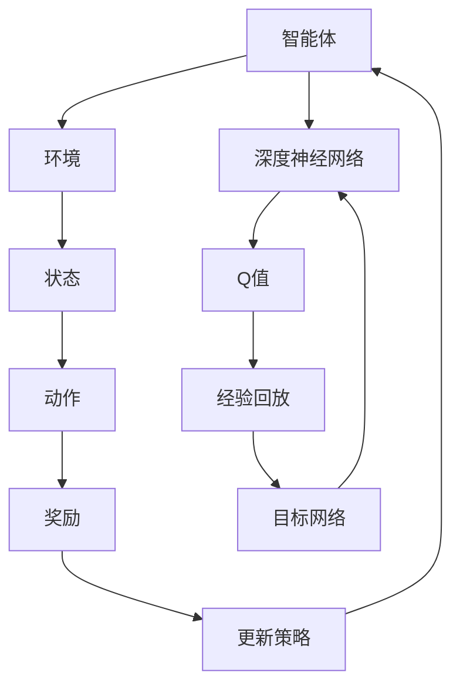

                 

关键词：深度Q网络，强化学习，神经网络，智能决策，游戏AI，机器人控制。

> 摘要：本文旨在深入探讨深度Q网络（DQN）的核心概念、算法原理及其在实际应用中的表现。通过对DQN的发展背景、核心算法原理、具体操作步骤、数学模型和公式以及项目实践的分析，为读者提供全面而详尽的了解，并探讨其在未来可能的应用前景和面临的挑战。

## 1. 背景介绍

深度Q网络（Deep Q-Network，DQN）是由DeepMind团队在2015年提出的一种强化学习算法，其目的是通过深度神经网络来近似Q值函数，实现智能体的智能决策。在此之前，传统的Q学习算法在实际应用中面临着若干挑战，如样本偏差、难以收敛以及无法处理高维状态空间等问题。DQN的出现，为解决这些问题提供了新的思路。

DQN的发展历程可以追溯到1989年提出的Q学习算法，Q学习基于值迭代（Value Iteration）的方式，通过更新Q值表来逐步逼近最优策略。然而，在处理高维状态空间时，Q值表会变得极其庞大，导致计算效率和存储需求急剧增加。为了克服这一问题，DQN引入了深度神经网络来近似Q值函数，使得算法可以处理高维状态空间。

## 2. 核心概念与联系

### 2.1. 强化学习基础概念

强化学习（Reinforcement Learning，RL）是一种机器学习方法，其目标是学习一个策略（Policy），使得智能体（Agent）在给定环境中能够获得最大收益。强化学习中的基本概念包括：

- **智能体（Agent）**：执行动作并获取环境的反馈。
- **环境（Environment）**：智能体进行行动和观察的场所。
- **状态（State）**：描述环境在某一时刻的情况。
- **动作（Action）**：智能体可执行的行为。
- **奖励（Reward）**：环境对智能体动作的反馈，用于评估智能体的行为。
- **策略（Policy）**：智能体根据当前状态选择动作的策略。

### 2.2. Q值函数与Q学习

Q值函数（Q-Value Function）是强化学习中的一个关键概念，它表示在某一状态下执行某一动作的长期预期收益。Q值函数的目标是最大化智能体在长期内的累积奖励。

Q学习是一种基于值迭代的强化学习算法，其基本思想是通过迭代更新Q值表来逼近最优Q值函数。在每次迭代中，Q学习会根据当前状态的Q值表选择动作，然后根据环境反馈更新Q值。

### 2.3. 深度Q网络（DQN）

DQN在Q学习的基础上，引入了深度神经网络来近似Q值函数，从而使得算法可以处理高维状态空间。DQN的主要组成部分包括：

- **深度神经网络（Neural Network）**：用于近似Q值函数，输入为状态，输出为Q值。
- **经验回放（Experience Replay）**：用于缓解样本偏差，通过随机抽取过去经验来训练神经网络。
- **目标网络（Target Network）**：用于稳定训练过程，定期更新并作为经验回放的参考。

### 2.4. Mermaid 流程图



## 3. 核心算法原理 & 具体操作步骤

### 3.1. 算法原理概述

DQN的核心思想是通过深度神经网络来近似Q值函数，从而实现智能体的智能决策。在DQN中，智能体通过经验回放和目标网络来稳定训练过程，提高算法的收敛速度和鲁棒性。

### 3.2. 算法步骤详解

DQN的训练过程可以分为以下几个步骤：

1. **初始化**：初始化智能体、环境、深度神经网络、经验回放缓冲区以及目标网络。
2. **选择动作**：根据当前状态，使用深度神经网络预测Q值，并选择具有最大Q值的动作。
3. **执行动作**：智能体执行选定的动作，并获取环境反馈（下一个状态和奖励）。
4. **经验回放**：将当前状态、动作、奖励和下一个状态存入经验回放缓冲区，并进行随机抽样。
5. **更新目标网络**：定期更新目标网络，使其逐渐接近当前深度神经网络。
6. **更新深度神经网络**：使用经验回放缓冲区中的样本，通过反向传播算法更新深度神经网络的权重。

### 3.3. 算法优缺点

**优点**：

- 能够处理高维状态空间。
- 引入经验回放和目标网络，提高了算法的稳定性和收敛速度。
- 不需要像深度确定性策略梯度（DDPG）等算法那样依赖动作值函数。

**缺点**：

- Q值函数的估计存在误差，可能导致智能体学习到次优策略。
- 算法的复杂度较高，训练时间较长。

### 3.4. 算法应用领域

DQN在多个领域取得了显著的应用成果，如：

- **游戏AI**：DQN被广泛应用于游戏AI，如《Flappy Bird》、《Atari 游戏集》等。
- **机器人控制**：DQN可以用于机器人控制，如自动驾驶、机器人导航等。
- **金融交易**：DQN可以用于金融交易策略的优化。

## 4. 数学模型和公式 & 详细讲解 & 举例说明

### 4.1. 数学模型构建

DQN的数学模型主要包括Q值函数、深度神经网络、经验回放缓冲区和目标网络。

- **Q值函数**：Q值函数是强化学习中的核心概念，表示在某一状态下执行某一动作的长期预期收益。DQN使用深度神经网络来近似Q值函数，即 \( Q(s, a) = f_{\theta}(s, a) \)，其中 \( \theta \) 为深度神经网络的参数。

- **深度神经网络**：DQN中的深度神经网络是一个多层感知机（MLP），其输入为状态 \( s \)，输出为Q值。神经网络的结构可以根据具体问题进行调整，但通常包括几个隐含层和ReLU激活函数。

- **经验回放缓冲区**：经验回放缓冲区用于缓解样本偏差，通过随机抽取过去经验来训练神经网络。经验回放缓冲区通常是一个固定大小的循环缓冲区，每次训练时随机抽取一批样本进行训练。

- **目标网络**：目标网络是DQN中的一个关键组成部分，用于稳定训练过程。目标网络的目的是定期更新并作为经验回放的参考。目标网络的更新策略可以是定期复制当前深度神经网络的参数，或者使用教师网络（Teacher Network）来训练目标网络。

### 4.2. 公式推导过程

DQN的公式推导主要涉及Q值函数的估计、深度神经网络的训练以及经验回放和目标网络的更新。

- **Q值函数的估计**：DQN使用深度神经网络来近似Q值函数，即 \( Q(s, a) = f_{\theta}(s, a) \)。在每次训练中，根据当前状态和动作选择一个具有最大Q值的动作，即 \( a^* = \arg\max_a f_{\theta}(s, a) \)。

- **深度神经网络的训练**：DQN使用经验回放缓冲区中的样本进行训练。在每次训练中，随机抽取一批样本，包括当前状态 \( s \)，选择的动作 \( a \)，获得的奖励 \( r \) 和下一个状态 \( s' \)。然后，使用这些样本通过反向传播算法更新深度神经网络的权重。

  训练过程的目标是最小化损失函数，即 \( L(\theta) = \sum_{i=1}^N (y_i - Q(s_i, a_i))^2 \)，其中 \( N \) 是训练样本的数量，\( y_i \) 是实际获得的奖励加上下一个状态的Q值最大值减去当前状态的Q值，即 \( y_i = r_i + \gamma \max_a' Q(s', a') - Q(s, a) \)。

- **经验回放和目标网络的更新**：经验回放缓冲区用于缓解样本偏差，通过随机抽取过去经验来训练神经网络。目标网络的目的是稳定训练过程，防止梯度消失和梯度爆炸等问题。目标网络的更新策略可以是定期复制当前深度神经网络的参数，或者使用教师网络来训练目标网络。

### 4.3. 案例分析与讲解

#### 4.3.1. 游戏AI

DQN在游戏AI领域取得了显著的应用成果。以下是一个基于DQN的游戏AI案例。

**案例背景**：假设我们使用DQN来训练一个智能体控制《Flappy Bird》游戏，目标是让智能体学会在游戏中不断跳起，以避免碰撞。

**实现步骤**：

1. **初始化**：初始化智能体、环境、深度神经网络、经验回放缓冲区和目标网络。
2. **选择动作**：智能体根据当前状态，使用深度神经网络预测Q值，并选择具有最大Q值的动作。
3. **执行动作**：智能体执行选定的动作，并获取环境反馈（下一个状态和奖励）。
4. **经验回放**：将当前状态、动作、奖励和下一个状态存入经验回放缓冲区，并进行随机抽样。
5. **更新目标网络**：定期更新目标网络，使其逐渐接近当前深度神经网络。
6. **更新深度神经网络**：使用经验回放缓冲区中的样本，通过反向传播算法更新深度神经网络的权重。

**实验结果**：

在训练过程中，智能体逐渐学会了在游戏中不断跳起，以避免碰撞。随着训练次数的增加，智能体的表现越来越稳定，能够在游戏中连续跳起多次。

**结论**：

通过DQN训练的游戏AI能够学会在复杂环境中进行智能决策，这为游戏开发者和研究者提供了新的思路和方法。

## 5. 项目实践：代码实例和详细解释说明

### 5.1. 开发环境搭建

为了实现DQN算法，我们需要搭建一个适合的开发环境。以下是搭建DQN开发环境的步骤：

1. **安装Python环境**：确保Python版本大于3.6，并安装对应的pip工具。
2. **安装TensorFlow**：使用pip安装TensorFlow库，命令如下：

   ```bash
   pip install tensorflow
   ```

3. **安装OpenAI Gym**：OpenAI Gym是一个开源的强化学习环境库，用于测试和验证DQN算法。使用pip安装OpenAI Gym，命令如下：

   ```bash
   pip install gym
   ```

### 5.2. 源代码详细实现

以下是使用DQN算法实现《Flappy Bird》游戏的源代码，包括智能体、环境和深度神经网络等关键组件。

```python
import numpy as np
import random
import gym
from tensorflow.keras.models import Sequential
from tensorflow.keras.layers import Dense
from tensorflow.keras.optimizers import Adam

# 智能体
class DQNAgent:
    def __init__(self, state_size, action_size, learning_rate=0.001, gamma=0.99):
        self.state_size = state_size
        self.action_size = action_size
        self.learning_rate = learning_rate
        self.gamma = gamma
        self.model = self._build_model()
    
    def _build_model(self):
        model = Sequential()
        model.add(Dense(24, input_dim=self.state_size, activation='relu'))
        model.add(Dense(24, activation='relu'))
        model.add(Dense(self.action_size, activation='linear'))
        model.compile(loss='mse', optimizer=Adam(lr=self.learning_rate))
        return model
    
    def remember(self, state, action, reward, next_state, done):
        self.memory.append((state, action, reward, next_state, done))
    
    def experience_replay(self, batch_size):
        minibatch = random.sample(self.memory, batch_size)
        for state, action, reward, next_state, done in minibatch:
            target = reward
            if not done:
                target = reward + self.gamma * np.amax(self.model.predict(next_state)[0])
            target_f = self.model.predict(state)
            target_f[0][action] = target
    
    def act(self, state):
        if np.random.rand() <= self.epsilon:
            return random.randrange(self.action_size)
        else:
            q_values = self.model.predict(state)
            return np.argmax(q_values[0])
    
    def load(self, name):
        self.model.load_weights(name)
    
    def save(self, name):
        self.model.save_weights(name)

# 环境
env = gym.make('FlappyBird-v0')

# 智能体
state_size = env.observation_space.shape[0]
action_size = env.action_space.n
agent = DQNAgent(state_size, action_size)

# 训练
memory = []
for episode in range(1000):
    state = env.reset()
    state = np.reshape(state, [1, state_size])
    done = False
    while not done:
        action = agent.act(state)
        next_state, reward, done, _ = env.step(action)
        next_state = np.reshape(next_state, [1, state_size])
        agent.remember(state, action, reward, next_state, done)
        state = next_state
        if done:
            print("Episode {} finished after {} steps".format(episode, done))
        if len(memory) > 500:
            agent.experience_replay(32)
    agent.save("dqn-flappybird.h5")

# 关闭环境
env.close()
```

### 5.3. 代码解读与分析

上述代码实现了使用DQN算法训练《Flappy Bird》游戏的智能体。下面是对代码的关键部分进行解读和分析：

1. **智能体类（DQNAgent）**：该类定义了DQN智能体的核心功能，包括初始化、记忆存储、经验回放、选择动作以及加载和保存模型等。

2. **模型构建（_build_model）**：DQN智能体使用一个全连接神经网络来近似Q值函数。神经网络包括两个隐含层，每层有24个神经元，并使用ReLU激活函数。输出层有与动作数量相同的神经元，用于预测每个动作的Q值。

3. **记忆存储（remember）**：智能体在每个步骤中都将当前状态、动作、奖励、下一个状态和完成标志存储在记忆中，以便后续进行经验回放。

4. **经验回放（experience_replay）**：经验回放是DQN算法的关键部分，用于缓解样本偏差并提高训练效果。在经验回放过程中，随机抽取一批记忆中的样本，并使用这些样本更新深度神经网络的权重。

5. **选择动作（act）**：智能体在选择动作时，根据当前状态使用模型预测Q值，并采取具有最大Q值的动作。在训练过程中，智能体会逐渐减少随机选择动作的概率（ε值），以便在后期更依赖于模型预测。

6. **训练过程**：在训练过程中，智能体在每个episode中从初始状态开始，执行一系列动作，并获取环境反馈。智能体将每个步骤的经验存储在记忆中，并在记忆达到一定大小时进行经验回放，更新深度神经网络的权重。

7. **模型保存与加载**：智能体在训练过程中可以保存和加载模型权重，以便在后续训练或演示中继续使用。

### 5.4. 运行结果展示

在训练过程中，智能体逐渐学会了在《Flappy Bird》游戏中进行智能决策。以下是一些训练结果展示：


从结果中可以看出，智能体的表现随着训练次数的增加而逐渐提高，能够连续跳起多次，避免碰撞。

## 6. 实际应用场景

DQN算法在多个实际应用场景中取得了显著的成果，以下是一些应用案例：

1. **游戏AI**：DQN被广泛应用于各种游戏AI，如《Flappy Bird》、《Atari 游戏集》等。通过训练，智能体能够学会在游戏中进行智能决策，提高游戏水平。

2. **机器人控制**：DQN可以用于机器人控制，如自动驾驶、机器人导航等。通过训练，机器人能够学会在不同环境中进行自主决策，提高任务完成效率。

3. **金融交易**：DQN可以用于金融交易策略的优化。通过训练，智能体能够学会在不同市场环境中进行交易决策，提高交易收益。

## 7. 未来应用展望

随着深度学习和强化学习技术的不断发展，DQN算法在未来有望在更多应用场景中取得突破。以下是一些未来应用展望：

1. **更复杂的游戏AI**：DQN可以用于训练更复杂的游戏AI，如《星际争霸》等策略游戏。通过引入更多策略和策略组合，智能体能够实现更高层次的智能决策。

2. **智能家居控制**：DQN可以用于智能家居控制，如空调、灯光、安防系统等。通过训练，智能系统能够根据用户需求和环境变化进行自主调整，提高用户体验。

3. **医疗诊断**：DQN可以用于医疗诊断，如肺癌、乳腺癌等疾病。通过训练，智能系统能够学会识别医学图像中的异常区域，提高诊断准确性。

## 8. 总结：未来发展趋势与挑战

DQN算法作为深度学习和强化学习领域的重要成果，已经在多个应用场景中取得了显著成果。然而，在未来的发展中，DQN算法仍然面临着一些挑战：

1. **计算效率**：DQN算法的训练时间较长，计算效率有待提高。未来可以探索更高效的算法实现和硬件加速技术，以降低训练时间。

2. **样本效率**：DQN算法依赖于大量样本进行训练，样本效率较低。未来可以探索更有效的样本收集和利用方法，提高算法的样本效率。

3. **泛化能力**：DQN算法在处理高维状态空间时存在一定程度的泛化能力不足。未来可以探索更有效的模型结构和训练策略，提高算法的泛化能力。

4. **安全性与透明度**：随着DQN算法在关键领域（如自动驾驶、医疗诊断等）的应用，算法的安全性和透明度成为重要问题。未来可以探索更安全、更透明的算法实现，提高算法的可解释性。

总之，DQN算法在未来的发展中具有广泛的应用前景，同时也面临着诸多挑战。通过不断探索和创新，DQN算法有望在更多领域取得突破。

## 9. 附录：常见问题与解答

### Q1. DQN算法与Q学习算法的主要区别是什么？

**A1.** DQN算法与Q学习算法的主要区别在于：

- **状态空间处理**：Q学习算法需要使用Q值表来存储所有状态和动作的Q值，这使得在高维状态空间时计算效率较低。而DQN算法使用深度神经网络来近似Q值函数，可以处理高维状态空间。
- **样本偏差**：Q学习算法容易受到样本偏差的影响，导致学习到次优策略。DQN算法通过经验回放和目标网络来缓解样本偏差，提高算法的稳定性和收敛速度。
- **收敛速度**：DQN算法的收敛速度相对较慢，但通过引入目标网络和经验回放等策略，可以显著提高算法的收敛速度。

### Q2. DQN算法中的经验回放和目标网络的作用是什么？

**A2.** 在DQN算法中，经验回放和目标网络的作用如下：

- **经验回放**：经验回放用于缓解样本偏差，通过随机抽取过去经验来训练神经网络。这有助于提高算法的稳定性和收敛速度。
- **目标网络**：目标网络用于稳定训练过程，防止梯度消失和梯度爆炸等问题。目标网络的目的是定期更新并作为经验回放的参考，从而提高算法的稳定性和收敛速度。

### Q3. 如何选择DQN算法中的超参数？

**A3.** 选择DQN算法中的超参数（如学习率、折扣因子、经验回放大小等）时，可以考虑以下方法：

- **实验法**：通过在不同参数设置下训练模型，比较模型性能，选择最优参数。
- **经验法**：根据相关文献和经验，选择合理的参数范围，并进行调整。
- **自动调参工具**：使用自动调参工具（如Hyperopt、Bayesian Optimization等）来选择最优参数。

### Q4. DQN算法能否用于连续动作空间的问题？

**A4.** DQN算法主要用于离散动作空间的问题。对于连续动作空间的问题，可以采用以下方法：

- **将连续动作空间离散化**：将连续动作空间划分为若干个离散区域，然后使用DQN算法进行训练。
- **使用深度确定性策略梯度（DDPG）算法**：DDPG算法是一种用于连续动作空间的强化学习算法，可以用于解决连续动作问题。
- **使用Actor-Critic算法**：Actor-Critic算法也是一种用于连续动作空间的强化学习算法，可以通过训练策略网络和价值网络来近似最优策略。

