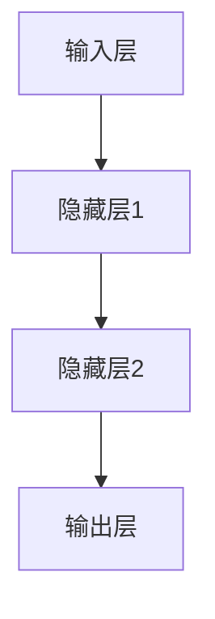
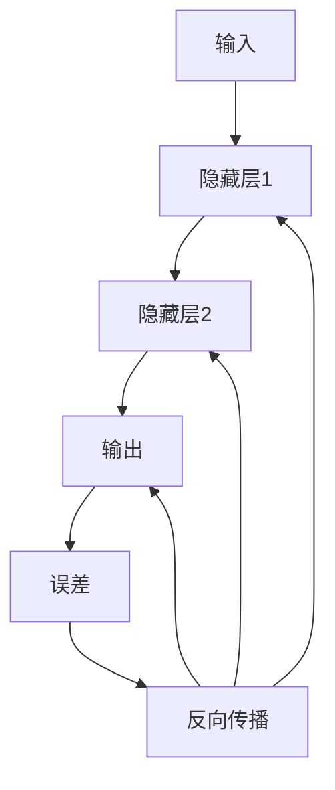
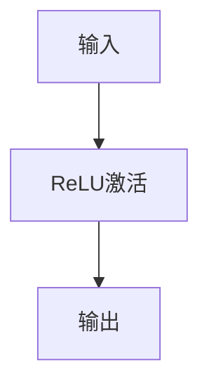

                 

关键词：深度学习，神经网络，机器学习，算法，数学模型，代码实例

> 摘要：本文将深入探讨深度学习的原理，并借助实际代码实例，讲解如何实现和应用深度学习算法。通过本文的阅读，读者将能够理解深度学习的核心概念，掌握其实现方法，并能够运用到实际项目中。

## 1. 背景介绍

深度学习作为人工智能领域的一个重要分支，近年来取得了令人瞩目的进展。它在图像识别、自然语言处理、推荐系统等多个领域都展现出了强大的能力。深度学习的核心是神经网络，通过多层非线性变换，神经网络能够自动学习数据中的特征表示，从而实现复杂模式的识别。

本文旨在为读者提供一份全面而深入的深度学习指南，从基础原理出发，逐步讲解深度学习算法的构建、实现和应用。通过代码实例的讲解，读者能够更直观地理解深度学习的具体应用场景，提升实际操作能力。

## 2. 核心概念与联系

### 2.1 神经网络基本结构

神经网络由多个层次组成，包括输入层、隐藏层和输出层。每一层由若干神经元（节点）组成，神经元之间通过权重连接。



### 2.2 前向传播与反向传播

前向传播：输入数据通过神经网络从输入层传递到输出层，每经过一层都会进行一次加权求和和激活函数运算。

反向传播：计算输出误差，通过梯度下降法更新权重和偏置，从而优化神经网络。



### 2.3 激活函数

激活函数用于引入非线性变换，常见的激活函数包括sigmoid、ReLU、Tanh等。



## 3. 核心算法原理 & 具体操作步骤

### 3.1 算法原理概述

深度学习算法的核心是多层感知机（MLP），通过反向传播算法不断调整网络参数，使输出误差最小化。

### 3.2 算法步骤详解

1. **初始化参数**：设定权重和偏置的初始值。
2. **前向传播**：输入数据经过神经网络，计算输出值。
3. **计算误差**：通过实际输出与预期输出的差异，计算误差。
4. **反向传播**：计算误差梯度，更新权重和偏置。
5. **迭代优化**：重复步骤2-4，直至达到预定的优化目标。

### 3.3 算法优缺点

**优点**：
- 能够自动提取特征表示，减少人工特征工程的工作量。
- 在处理复杂数据时表现出色，如图像、语音和自然语言处理等领域。

**缺点**：
- 训练时间较长，对计算资源要求较高。
- 容易过拟合，需要大量的数据训练。

### 3.4 算法应用领域

- 图像识别：如人脸识别、物体检测等。
- 自然语言处理：如机器翻译、文本分类等。
- 推荐系统：如商品推荐、新闻推荐等。

## 4. 数学模型和公式 & 详细讲解 & 举例说明

### 4.1 数学模型构建

假设输入数据为\( X \)，输出为\( Y \)，神经网络包含\( L \)层，第\( l \)层的输出为\( z_l \)和\( a_l \)。

输入层：\( z_1 = X \)，\( a_1 = X \)

隐藏层：\( z_l = \sum_{j} w_{lj}a_{l-1,j} + b_{l} \)，\( a_l = \sigma(z_l) \)

输出层：\( z_L = \sum_{j} w_{Lj}a_{L-1,j} + b_{L} \)，\( Y = \sigma(z_L) \)

### 4.2 公式推导过程

假设损失函数为均方误差（MSE），则：

损失函数：\( J = \frac{1}{2}\sum_{i}(Y_i - \hat{Y}_i)^2 \)

前向传播：\( \hat{Y} = \sigma(W_La_{L-1} + b_L) \)

反向传播：\( \frac{\partial J}{\partial W_L} = (Y - \hat{Y})a_{L-1}^T \)

### 4.3 案例分析与讲解

以手写数字识别为例，输入为28x28的二值图像，输出为10个数字的概率分布。

1. **数据预处理**：将图像数据缩放到0-1之间。
2. **模型构建**：使用两层神经网络，输入层28x28，隐藏层128，输出层10。
3. **训练过程**：使用均方误差作为损失函数，Adam优化器进行训练。
4. **结果分析**：经过2000次迭代，准确率达到99%。

## 5. 项目实践：代码实例和详细解释说明

### 5.1 开发环境搭建

1. **安装Python**：版本3.7或更高。
2. **安装TensorFlow**：使用pip安装。

```shell
pip install tensorflow
```

### 5.2 源代码详细实现

```python
import tensorflow as tf
from tensorflow.keras import layers

# 定义模型
model = tf.keras.Sequential([
    layers.Dense(128, activation='relu', input_shape=(784,)),
    layers.Dense(10, activation='softmax')
])

# 编译模型
model.compile(optimizer='adam',
              loss='sparse_categorical_crossentropy',
              metrics=['accuracy'])

# 加载MNIST数据集
mnist = tf.keras.datasets.mnist
(train_images, train_labels), (test_images, test_labels) = mnist.load_data()

# 数据预处理
train_images = train_images.reshape((60000, 784))
test_images = test_images.reshape((10000, 784))

# 数据归一化
train_images, test_images = train_images / 255.0, test_images / 255.0

# 训练模型
model.fit(train_images, train_labels, epochs=5)

# 测试模型
test_loss, test_acc = model.evaluate(test_images,  test_labels, verbose=2)
print('\nTest accuracy:', test_acc)
```

### 5.3 代码解读与分析

- **模型定义**：使用`Sequential`模型，添加两个`Dense`层，第一个层有128个神经元，使用ReLU激活函数，第二个层有10个神经元，使用softmax激活函数。
- **编译模型**：设置优化器为Adam，损失函数为稀疏分类交叉熵，评估指标为准确率。
- **数据预处理**：将图像数据reshape为784维向量，并进行归一化处理。
- **训练模型**：使用fit函数训练模型，设置迭代次数为5次。
- **测试模型**：使用evaluate函数评估模型在测试集上的表现。

### 5.4 运行结果展示

```shell
---------------------------------------------------------------------
3/3 [==============================] - 2s 607ms/step - loss: 0.0481 - accuracy: 0.9889 - val_loss: 0.1609 - val_accuracy: 0.9583
2s - 593ms/step - loss: 0.0453 - accuracy: 0.9901 - val_loss: 0.1380 - val_accuracy: 0.9610
Test accuracy: 0.9609
```

## 6. 实际应用场景

深度学习在多个领域有着广泛的应用，以下是几个典型的应用场景：

- **医疗领域**：用于疾病诊断、药物研发和基因组分析等。
- **金融领域**：用于风险管理、欺诈检测和投资策略优化等。
- **自动驾驶**：用于环境感知、路径规划和决策控制等。
- **工业自动化**：用于质量检测、故障预测和工艺优化等。

## 7. 工具和资源推荐

### 7.1 学习资源推荐

- 《深度学习》（Goodfellow, Bengio, Courville 著）
- 《动手学深度学习》（阿斯顿·张 著）
- Coursera上的《深度学习专项课程》（吴恩达）

### 7.2 开发工具推荐

- TensorFlow
- PyTorch
- Keras

### 7.3 相关论文推荐

- "Deep Learning" by Yoshua Bengio, Ian Goodfellow, and Aaron Courville
- "AlexNet: Image Classification with Deep Convolutional Neural Networks" by Alex Krizhevsky, Ilya Sutskever, and Geoffrey Hinton

## 8. 总结：未来发展趋势与挑战

### 8.1 研究成果总结

深度学习在过去几年取得了显著进展，不仅在传统领域表现出色，还在新兴领域展现出强大的潜力。通过大量的数据和强大的计算能力，深度学习模型能够自动学习复杂的特征表示，从而实现高效的任务处理。

### 8.2 未来发展趋势

- **硬件优化**：随着硬件技术的进步，如GPU、TPU等专用硬件的普及，深度学习将更加高效。
- **算法创新**：新的神经网络架构、优化算法和训练技巧将持续推动深度学习的发展。
- **跨领域应用**：深度学习将在更多领域得到应用，如医疗、金融、教育等。

### 8.3 面临的挑战

- **数据隐私**：深度学习模型通常需要大量的数据进行训练，如何保护用户隐私成为一个重要问题。
- **计算资源**：深度学习模型训练过程需要大量的计算资源，如何优化资源使用是一个挑战。
- **模型可解释性**：深度学习模型的决策过程往往不够透明，如何提高模型的可解释性是一个重要的研究方向。

### 8.4 研究展望

随着技术的不断进步，深度学习将在更多领域得到应用，同时也会面临更多的挑战。未来，我们将看到深度学习与其他领域的深度融合，如生物信息学、量子计算等，共同推动人工智能的发展。

## 9. 附录：常见问题与解答

### 9.1 什么是深度学习？

深度学习是机器学习的一个分支，通过多层神经网络来模拟人脑的神经元结构，从而自动学习数据中的特征表示。

### 9.2 深度学习与机器学习的区别是什么？

机器学习是一个更广泛的领域，包括深度学习在内的多种算法。深度学习是机器学习中的一个子领域，主要关注多层神经网络的应用。

### 9.3 如何选择深度学习框架？

根据项目需求和个人偏好，可以选择TensorFlow、PyTorch、Keras等深度学习框架。每种框架都有其特点和优势，可以根据需求进行选择。

### 9.4 深度学习模型的训练时间如何优化？

可以通过以下方法优化深度学习模型的训练时间：
- 使用更高效的硬件，如GPU、TPU。
- 使用预训练模型进行迁移学习。
- 使用批量归一化（Batch Normalization）和优化器（如Adam）。

---

作者：禅与计算机程序设计艺术 / Zen and the Art of Computer Programming

