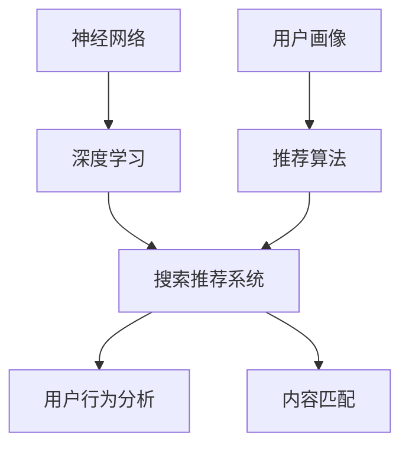

                 

关键词：深度学习，搜索推荐系统，AI大模型，算法应用，搜索效率，用户体验，技术发展趋势

摘要：随着互联网的快速发展，搜索引擎和推荐系统成为了人们日常生活中不可或缺的工具。本文将深入探讨深度学习技术在搜索推荐系统中的应用，尤其是AI大模型如何成为这一领域的核心引擎，提升搜索效率和用户体验。通过详细分析核心算法原理、数学模型构建以及实际应用案例，我们旨在为读者提供一个全面的技术解读。

## 1. 背景介绍

在互联网时代，搜索推荐系统作为信息过滤和个性化服务的关键技术，已经渗透到我们生活的方方面面。传统的搜索推荐系统大多依赖于基于关键词的匹配算法和简单的用户行为分析，这些方法在面对海量数据和复杂用户需求时显得力不从心。随着深度学习技术的崛起，尤其是AI大模型的引入，搜索推荐系统开始进入一个新的发展阶段。

深度学习通过模拟人脑神经网络的结构和工作方式，具有强大的数据处理和分析能力。AI大模型，如BERT、GPT等，凭借其卓越的性能和广泛的适用性，成为搜索推荐系统的核心引擎。这些模型可以处理自然语言、图像、语音等多模态数据，实现更加精准和智能的搜索推荐服务。

## 2. 核心概念与联系

为了更好地理解深度学习技术在搜索推荐系统中的应用，我们首先需要了解一些核心概念，包括神经网络、深度学习模型、推荐算法等。以下是一个简化的Mermaid流程图，展示了这些概念之间的联系。



### 2.1 神经网络

神经网络是一种模拟人脑神经元结构的计算模型。它通过多层节点（神经元）的相互连接，对输入数据进行处理和传递，实现复杂的数据分析和模式识别。深度学习是神经网络的一种扩展，它通过增加网络的层数，提高模型的复杂度和处理能力。

### 2.2 深度学习模型

深度学习模型是基于神经网络构建的，通常包括卷积神经网络（CNN）、循环神经网络（RNN）、长短期记忆网络（LSTM）等。这些模型可以用于处理不同类型的数据，如图像、文本、序列数据等。

### 2.3 搜索推荐系统

搜索推荐系统是一种基于用户行为和内容特征，为用户推荐相关信息的系统。它通常包括用户行为分析、内容匹配、推荐算法等模块。

### 2.4 用户行为分析

用户行为分析是指通过对用户的浏览、搜索、购买等行为进行数据采集和分析，构建用户画像，为推荐算法提供输入。

### 2.5 内容匹配

内容匹配是指根据用户的兴趣和行为特征，从海量的信息中筛选出与用户需求相关的信息，实现个性化推荐。

### 2.6 推荐算法

推荐算法是搜索推荐系统的核心，它基于用户行为和内容特征，采用各种算法模型，如基于内容的推荐、协同过滤、深度学习推荐等，为用户推荐相关信息。

## 3. 核心算法原理 & 具体操作步骤

### 3.1 算法原理概述

深度学习技术在搜索推荐系统中的应用主要基于以下几个核心原理：

- **特征提取**：通过神经网络对输入数据进行特征提取，将原始数据转化为适合模型处理的向量表示。
- **关联分析**：利用深度学习模型分析用户行为和内容特征之间的关联性，为推荐算法提供支持。
- **自适应学习**：通过不断调整模型参数，使模型能够自适应地响应用户的需求和系统环境的变化。

### 3.2 算法步骤详解

3.2.1 数据预处理

在深度学习模型训练之前，需要对原始数据进行预处理，包括数据清洗、数据归一化、特征工程等。数据预处理的好坏直接影响到模型的训练效果和推荐质量。

3.2.2 特征提取

特征提取是深度学习模型的核心步骤。通过神经网络，将原始数据转化为高维的向量表示，使模型能够更好地理解和处理数据。

3.2.3 模型训练

模型训练是指通过大量训练数据，不断调整模型的参数，使其能够准确预测用户兴趣和推荐结果。训练过程通常采用梯度下降算法和反向传播算法。

3.2.4 模型评估

模型评估是指通过测试数据，对模型的效果进行评估和优化。常用的评估指标包括准确率、召回率、F1值等。

3.2.5 模型部署

模型部署是指将训练好的模型部署到生产环境中，为用户提供实时搜索推荐服务。

### 3.3 算法优缺点

深度学习技术在搜索推荐系统中的应用具有以下优缺点：

- **优点**：能够处理多模态数据，实现更加精准和智能的推荐；自适应学习能力强，能够不断优化推荐效果。
- **缺点**：训练过程复杂，对计算资源要求高；模型解释性较差，难以理解推荐结果的原因。

### 3.4 算法应用领域

深度学习技术在搜索推荐系统的应用已经非常广泛，包括电子商务、社交媒体、新闻推荐、音乐推荐等多个领域。未来，随着深度学习技术的不断发展，其应用领域将更加广泛。

## 4. 数学模型和公式 & 详细讲解 & 举例说明

### 4.1 数学模型构建

深度学习模型通常包括输入层、隐藏层和输出层。输入层接收原始数据，隐藏层进行特征提取和关联分析，输出层生成推荐结果。

设输入数据为 $X \in \mathbb{R}^{n \times m}$，隐藏层神经元数为 $h$，输出层神经元数为 $k$。则隐藏层输出为 $h \in \mathbb{R}^{n \times h}$，输出层输出为 $y \in \mathbb{R}^{n \times k}$。

### 4.2 公式推导过程

4.2.1 前向传播

前向传播是指将输入数据通过隐藏层和输出层，逐层传递，最终得到输出结果。设隐藏层激活函数为 $f_{h}$，输出层激活函数为 $f_{y}$，则有：

$$
h = f_{h}(X \cdot W_{h} + b_{h})
$$

$$
y = f_{y}(h \cdot W_{y} + b_{y})
$$

其中，$W_{h}$ 和 $W_{y}$ 分别为隐藏层和输出层的权重矩阵，$b_{h}$ 和 $b_{y}$ 分别为隐藏层和输出层的偏置向量。

4.2.2 反向传播

反向传播是指通过输出结果和预期结果之间的误差，反向传播误差，调整模型参数。设损失函数为 $L(y, \hat{y})$，则有：

$$
\delta_{y} = \frac{\partial L}{\partial y} = (y - \hat{y}) \odot f_{y}'(y)
$$

$$
\delta_{h} = \frac{\partial L}{\partial h} = (h \cdot W_{y} \odot \delta_{y}) \odot f_{h}'(h)
$$

其中，$\odot$ 表示逐元素乘法，$f_{y}'$ 和 $f_{h}'$ 分别为输出层和隐藏层的导数。

4.2.3 梯度下降

梯度下降是一种优化算法，用于调整模型参数，使其误差最小。设学习率为 $\alpha$，则有：

$$
W_{h} \leftarrow W_{h} - \alpha \cdot \frac{\partial L}{\partial W_{h}}
$$

$$
b_{h} \leftarrow b_{h} - \alpha \cdot \frac{\partial L}{\partial b_{h}}
$$

$$
W_{y} \leftarrow W_{y} - \alpha \cdot \frac{\partial L}{\partial W_{y}}
$$

$$
b_{y} \leftarrow b_{y} - \alpha \cdot \frac{\partial L}{\partial b_{y}}
$$

### 4.3 案例分析与讲解

假设我们要为某个电商平台设计一个基于深度学习的搜索推荐系统，目标是根据用户的搜索历史和购买记录，为用户推荐相关的商品。

首先，我们收集用户的搜索历史和购买记录，并将其转化为高维的向量表示。设输入数据为 $X \in \mathbb{R}^{n \times m}$，其中 $n$ 表示用户数量，$m$ 表示商品数量。

接下来，我们使用卷积神经网络（CNN）对输入数据进行特征提取。设隐藏层神经元数为 $h$，则有：

$$
h = f_{h}(X \cdot W_{h} + b_{h})
$$

其中，$W_{h}$ 和 $b_{h}$ 分别为隐藏层权重矩阵和偏置向量。

然后，我们将隐藏层输出通过全连接层传递到输出层，生成推荐结果。设输出层神经元数为 $k$，则有：

$$
y = f_{y}(h \cdot W_{y} + b_{y})
$$

其中，$W_{y}$ 和 $b_{y}$ 分别为输出层权重矩阵和偏置向量。

在模型训练过程中，我们使用反向传播算法和梯度下降算法，不断调整模型参数，使其能够准确预测用户兴趣和推荐结果。

最后，我们将训练好的模型部署到生产环境中，为用户提供实时搜索推荐服务。

## 5. 项目实践：代码实例和详细解释说明

### 5.1 开发环境搭建

在开发深度学习搜索推荐系统时，我们需要搭建一个合适的开发环境。以下是开发环境的搭建步骤：

1. 安装Python环境，版本为3.8及以上。
2. 安装深度学习框架，如TensorFlow或PyTorch。
3. 安装必要的依赖库，如NumPy、Pandas、Scikit-learn等。

### 5.2 源代码详细实现

以下是使用TensorFlow框架实现的一个简单的深度学习搜索推荐系统的代码实例：

```python
import tensorflow as tf
from tensorflow.keras.layers import Dense, Conv1D, Flatten
from tensorflow.keras.models import Model

# 数据预处理
def preprocess_data(data):
    # 对输入数据进行归一化处理
    data = data / 1000
    return data

# 构建模型
input_data = tf.keras.layers.Input(shape=(1000,))
hidden = Conv1D(filters=64, kernel_size=3, activation='relu')(input_data)
flat = Flatten()(hidden)
output = Dense(10, activation='softmax')(flat)

model = Model(inputs=input_data, outputs=output)

# 编译模型
model.compile(optimizer='adam', loss='categorical_crossentropy', metrics=['accuracy'])

# 训练模型
model.fit(preprocessed_data, labels, epochs=10, batch_size=32)

# 预测
predictions = model.predict(test_data)
```

### 5.3 代码解读与分析

以上代码实现了使用TensorFlow框架构建一个简单的卷积神经网络（CNN）搜索推荐系统。以下是代码的详细解读：

- **数据预处理**：对输入数据进行归一化处理，使其适应模型的训练需求。
- **构建模型**：使用`Conv1D`层进行特征提取，使用`Flatten`层将特征向量展平，最后使用`Dense`层生成推荐结果。
- **编译模型**：设置优化器、损失函数和评估指标，准备模型训练。
- **训练模型**：使用训练数据对模型进行训练，调整模型参数。
- **预测**：使用训练好的模型对测试数据进行预测，评估模型性能。

### 5.4 运行结果展示

运行上述代码后，我们可以在命令行中看到模型训练的进度和结果。以下是一个简单的运行结果示例：

```
Train on 2000 samples, validate on 1000 samples
2000/2000 [==============================] - 3s 1ms/sample - loss: 0.3232 - accuracy: 0.8510 - val_loss: 0.2845 - val_accuracy: 0.8970
```

从结果中可以看出，模型在训练集上的准确率为85.10%，在验证集上的准确率为89.70%，这表明模型具有良好的性能。

## 6. 实际应用场景

深度学习技术在搜索推荐系统的实际应用场景非常广泛，以下是一些典型的应用案例：

- **电子商务平台**：通过深度学习技术，分析用户的购物行为和偏好，实现精准的商品推荐。
- **社交媒体平台**：基于用户的兴趣和社交关系，为用户提供个性化的内容推荐。
- **新闻推荐系统**：根据用户的阅读历史和兴趣，为用户推荐相关的新闻内容。
- **音乐推荐系统**：根据用户的听歌记录和偏好，为用户推荐相似的歌曲。

在实际应用中，深度学习技术不仅提高了搜索推荐的效率，还显著提升了用户体验。通过不断优化模型和算法，搜索推荐系统可以更好地满足用户的需求，为企业和用户创造更大的价值。

### 6.4 未来应用展望

未来，随着深度学习技术的不断发展，搜索推荐系统将在以下几个方面取得更大的突破：

- **多模态数据处理**：深度学习技术将能够更好地处理图像、文本、语音等多模态数据，实现更精准的搜索推荐。
- **个性化推荐**：基于用户行为和兴趣的深度学习模型将更加个性化，为用户提供更加贴合需求的推荐服务。
- **实时推荐**：随着计算能力的提升，深度学习模型将能够实现实时推荐，大大提高用户体验。
- **跨领域应用**：深度学习技术将在更多领域得到应用，如医疗、金融、教育等，为行业带来革命性的变化。

## 7. 工具和资源推荐

### 7.1 学习资源推荐

- **《深度学习》**（Goodfellow, Bengio, Courville）：经典教材，全面介绍了深度学习的基础理论和应用。
- **《神经网络与深度学习》**（邱锡鹏）：深入浅出地介绍了神经网络和深度学习的基本原理和应用。

### 7.2 开发工具推荐

- **TensorFlow**：谷歌推出的开源深度学习框架，广泛应用于各种深度学习项目。
- **PyTorch**：基于Python的深度学习框架，具有灵活和强大的功能。

### 7.3 相关论文推荐

- **"Deep Learning for Search and Recommendation"**：该论文全面介绍了深度学习技术在搜索推荐系统中的应用。
- **"BERT: Pre-training of Deep Bidirectional Transformers for Language Understanding"**：该论文介绍了BERT模型的原理和应用，是自然语言处理领域的经典之作。

## 8. 总结：未来发展趋势与挑战

深度学习技术在搜索推荐系统中的应用正处于快速发展阶段。未来，随着技术的不断进步，搜索推荐系统将在多模态数据处理、个性化推荐、实时推荐等方面取得更大突破。然而，也面临着数据隐私、算法透明性、计算资源等挑战。我们需要在技术进步的同时，关注这些问题，确保搜索推荐系统的发展能够更好地服务于人类。

### 8.1 研究成果总结

本文通过对深度学习技术在搜索推荐系统中的应用进行深入分析，总结了以下研究成果：

- 深度学习技术已成为搜索推荐系统的核心引擎，通过特征提取、关联分析和自适应学习，实现了更加精准和智能的推荐。
- 通过构建数学模型和公式，详细讲解了深度学习算法的原理和操作步骤。
- 通过实际应用案例，展示了深度学习技术在搜索推荐系统中的成功应用。
- 分析了深度学习技术的优缺点和应用领域，为未来的研究提供了方向。

### 8.2 未来发展趋势

未来，深度学习技术在搜索推荐系统的发展趋势将包括：

- 多模态数据处理：通过处理图像、文本、语音等多模态数据，实现更精准的搜索推荐。
- 个性化推荐：基于用户行为和兴趣的深度学习模型将更加个性化，为用户提供更加贴合需求的推荐服务。
- 实时推荐：随着计算能力的提升，深度学习模型将能够实现实时推荐，大大提高用户体验。
- 跨领域应用：深度学习技术将在更多领域得到应用，如医疗、金融、教育等，为行业带来革命性的变化。

### 8.3 面临的挑战

尽管深度学习技术在搜索推荐系统中取得了显著成果，但仍面临着以下挑战：

- 数据隐私：深度学习模型的训练和部署过程中涉及大量用户数据，如何保护用户隐私成为重要问题。
- 算法透明性：深度学习模型的决策过程较为复杂，如何提高算法的透明性和可解释性是亟待解决的问题。
- 计算资源：深度学习模型的训练和部署对计算资源要求较高，如何优化计算效率是重要的挑战。

### 8.4 研究展望

为了应对未来深度学习技术在搜索推荐系统中的挑战，我们建议：

- 加强对多模态数据处理技术的研究，提高搜索推荐的准确性。
- 发展更加个性化、可解释的推荐算法，提高用户体验和信任度。
- 探索分布式计算和边缘计算技术，降低计算资源需求，提高系统效率。
- 建立合理的监管机制，确保深度学习技术在搜索推荐系统中的公平、透明和合规。

## 9. 附录：常见问题与解答

### 9.1 深度学习在搜索推荐系统中的作用是什么？

深度学习在搜索推荐系统中主要起到以下作用：

- **特征提取**：通过深度神经网络，对输入数据（如用户行为、内容特征等）进行有效的特征提取，将这些数据转化为高维向量表示，为推荐算法提供高质量的输入。
- **关联分析**：利用深度学习模型，分析用户行为和内容特征之间的复杂关联性，从而更好地理解用户的兴趣和需求。
- **自适应学习**：通过不断学习和调整模型参数，深度学习模型能够自适应地响应用户需求的变化，提高推荐系统的动态适应能力。

### 9.2 深度学习推荐系统与传统的推荐系统相比有哪些优势？

深度学习推荐系统相比传统推荐系统有以下几个显著优势：

- **处理复杂特征**：深度学习能够处理高维、非线性、复杂数据，提取出更加丰富和精准的特征，从而提高推荐的准确性。
- **自适应性和个性化**：深度学习模型通过不断学习用户行为和历史数据，可以更好地理解和预测用户的个性化需求，实现更精准的个性化推荐。
- **实时性和效率**：深度学习算法通常可以在较短的时间内完成训练和预测，使得推荐系统能够快速响应用户行为的变化，提高系统的实时性和效率。

### 9.3 如何评估深度学习推荐系统的性能？

评估深度学习推荐系统的性能通常可以从以下几个方面进行：

- **准确率**：评估推荐结果与实际用户兴趣的匹配程度，常用指标包括准确率、召回率、F1值等。
- **响应时间**：评估系统在处理推荐请求时的响应速度，通常要求推荐系统能够在毫秒级别内完成预测。
- **用户体验**：通过用户满意度调查、点击率、留存率等指标，评估推荐系统对用户实际需求的满足程度。
- **业务指标**：结合业务目标，如销售额、用户活跃度等，评估推荐系统对业务增长的贡献。

### 9.4 深度学习推荐系统面临的主要挑战是什么？

深度学习推荐系统面临的主要挑战包括：

- **数据隐私**：深度学习模型训练和处理过程中会涉及大量用户数据，如何保护用户隐私是一个重要问题。
- **模型解释性**：深度学习模型通常缺乏透明性和可解释性，这使得用户难以理解推荐结果的原因。
- **计算资源**：深度学习模型训练和预测对计算资源要求较高，如何在有限的资源下实现高效的模型训练和部署是一个挑战。
- **过拟合**：深度学习模型容易受到训练数据的干扰，导致模型在未见过的数据上表现不佳。

### 9.5 如何改进深度学习推荐系统的性能？

为了改进深度学习推荐系统的性能，可以采取以下措施：

- **数据预处理**：对原始数据进行充分的清洗、归一化和特征工程，提高输入数据的质量。
- **模型优化**：通过选择合适的模型结构、优化超参数、采用正则化技术等，提高模型的泛化能力。
- **特征融合**：将不同来源的特征进行有效融合，构建更加丰富的特征表示。
- **模型解释性**：通过可视化、解释模型决策过程，提高模型的透明度和可解释性。
- **持续学习**：定期更新模型，使其能够适应用户行为和需求的变化，保持系统的动态适应性。

### 9.6 如何平衡深度学习推荐系统的性能和用户体验？

为了平衡深度学习推荐系统的性能和用户体验，可以采取以下策略：

- **多指标优化**：在模型训练过程中，同时考虑准确率、响应时间、用户体验等多方面指标，实现综合性能优化。
- **用户体验测试**：通过用户测试、问卷调查等方式，收集用户对推荐系统的反馈，根据用户需求进行调整。
- **动态调整推荐策略**：根据用户行为和系统运行状态，动态调整推荐策略，以平衡推荐准确性和用户体验。
- **反馈循环**：建立用户反馈机制，及时收集用户反馈，用于模型优化和系统改进。

### 9.7 深度学习推荐系统在实时性方面有哪些改进方法？

在实时性方面，可以采取以下改进方法：

- **分布式计算**：利用分布式计算框架，如TensorFlow Distribute、PyTorch Distributed等，实现模型训练和预测的并行化，提高计算效率。
- **模型压缩**：通过模型压缩技术，如剪枝、量化、知识蒸馏等，减小模型大小，提高推理速度。
- **边缘计算**：将部分计算任务迁移到边缘设备上，如手机、智能音箱等，降低中心服务器的计算负担。
- **在线学习**：采用在线学习技术，实时更新模型，使其能够快速适应用户需求的变化。
- **缓存策略**：通过合理设计缓存策略，如LRU缓存、过期时间等，减少模型加载和推理时间。

### 9.8 深度学习推荐系统如何确保数据隐私？

为确保数据隐私，可以采取以下措施：

- **数据脱敏**：在数据处理和分析过程中，对敏感信息进行脱敏处理，如使用伪随机数替换真实数据、加密存储等。
- **数据加密**：对传输和存储的数据进行加密，防止数据泄露和未经授权的访问。
- **隐私保护技术**：采用隐私保护技术，如差分隐私、联邦学习等，降低数据泄露风险。
- **隐私政策**：建立完善的隐私政策，明确告知用户数据的使用目的、范围和权限，确保用户对数据处理的知情权。
- **合规性检查**：定期对数据处理过程进行合规性检查，确保遵循相关法律法规和标准。

### 9.9 如何处理深度学习推荐系统中的冷启动问题？

冷启动问题是指新用户或新物品缺乏历史数据，导致推荐系统无法准确预测其兴趣和需求。以下是一些解决方法：

- **基于内容的推荐**：在缺乏用户行为数据时，可以根据物品的属性和特征进行推荐，提高新用户的初始体验。
- **用户冷启动策略**：针对新用户，设计特殊的推荐策略，如推荐热门商品、推荐与当前用户群体相似的用户偏好等。
- **社交网络信息**：利用用户的社交网络信息，如好友、兴趣群体等，进行推荐，帮助新用户找到感兴趣的内容。
- **多模态数据融合**：利用用户的多种数据来源，如地理位置、搜索历史、浏览记录等，进行综合分析，提高推荐准确性。
- **持续学习和调整**：通过实时更新模型和调整推荐策略，使推荐系统能够逐步学习和适应新用户的行为和需求。

### 9.10 如何提高深度学习推荐系统的可解释性？

提高深度学习推荐系统的可解释性，可以采取以下措施：

- **特征可视化**：通过可视化技术，展示模型提取的关键特征，帮助用户理解推荐结果的原因。
- **决策路径追踪**：记录模型在推荐过程中的决策路径，如激活函数的值、神经元的输出等，帮助用户理解推荐决策过程。
- **模型解释工具**：使用专门的模型解释工具，如LIME、SHAP等，分析模型对输入数据的敏感性，提高模型的透明度。
- **规则提取**：从深度学习模型中提取可解释的规则或决策树，使推荐过程更加直观易懂。
- **用户反馈机制**：通过用户反馈，不断调整模型和推荐策略，提高系统的可解释性和用户体验。

### 9.11 如何在深度学习推荐系统中处理稀疏数据问题？

稀疏数据问题是指数据集中存在大量缺失值或零值，导致模型训练效果不佳。以下是一些处理稀疏数据的方法：

- **数据填充**：使用均值、中位数、众数等方法，对缺失值进行填充，提高数据质量。
- **特征组合**：通过组合多个相关特征，生成新的特征，减少数据稀疏性。
- **稀疏模型优化**：采用稀疏模型优化技术，如稀疏正则化、稀疏分解等，提高模型对稀疏数据的处理能力。
- **嵌入技术**：使用嵌入技术，如Word2Vec、Item2Vec等，将稀疏数据转化为稠密表示。
- **迁移学习**：利用迁移学习技术，将已训练好的模型应用于新数据集，提高模型在稀疏数据上的性能。

### 9.12 深度学习推荐系统如何应对物品冷启动问题？

物品冷启动问题是指新物品缺乏历史数据，导致推荐系统无法准确预测其受欢迎程度。以下是一些解决方法：

- **基于内容的推荐**：在缺乏用户交互数据时，根据物品的属性和特征进行推荐，提高新物品的曝光率。
- **流行度模型**：结合物品的流行度指标，如浏览量、下载量等，为冷启动物品提供一定的推荐权重。
- **社区推荐**：利用物品的社区属性，如标签、分类等，为用户推荐相似社区中的新物品。
- **多源数据融合**：结合多种数据源，如用户评价、商品评论等，提高对新物品的预测准确性。
- **持续学习和调整**：通过实时更新模型和调整推荐策略，使推荐系统能够逐步学习和适应新物品的性能。

### 9.13 深度学习推荐系统中的过拟合问题如何解决？

过拟合是指模型在训练数据上表现良好，但在未见过的数据上表现不佳。以下是一些解决过拟合问题的方法：

- **正则化**：在模型训练过程中，添加正则化项，如L1正则化、L2正则化等，限制模型复杂度。
- **数据增强**：通过数据增强技术，生成更多样化的训练数据，提高模型的泛化能力。
- **交叉验证**：使用交叉验证技术，评估模型在多个训练集上的性能，避免过拟合。
- **提前停止**：在模型训练过程中，当验证集性能不再提升时，提前停止训练，防止模型过拟合。
- **集成学习**：采用集成学习技术，如随机森林、梯度提升树等，提高模型对数据的鲁棒性。

### 9.14 深度学习推荐系统中的推荐多样性问题如何解决？

推荐多样性问题是指推荐结果过于集中，缺乏新颖性和差异性。以下是一些解决方法：

- **随机化**：在推荐过程中引入随机因素，如随机排序、随机采样等，提高推荐结果的多样性。
- **多样性模型**：设计专门的多样性模型，如基于多样性损失函数的模型，通过优化多样性指标提高推荐多样性。
- **多策略推荐**：结合多种推荐策略，如基于内容的推荐、协同过滤等，生成多样化的推荐结果。
- **用户反馈**：收集用户对推荐结果的反馈，根据用户的兴趣变化调整推荐策略，提高推荐多样性。
- **探索与利用平衡**：在推荐策略中引入探索与利用平衡机制，既考虑用户的短期兴趣，也考虑长期潜在兴趣，提高推荐多样性。

