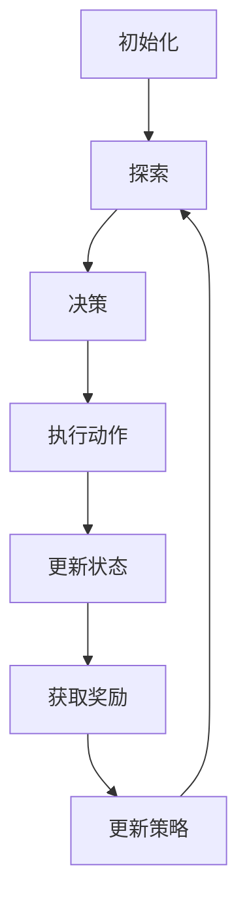

                 

 关键词：深度强化学习，原理，算法，代码实例，AI，机器学习，智能控制

> 摘要：本文旨在深入浅出地介绍深度强化学习的原理、算法和应用，通过详细的代码实例讲解，帮助读者理解和掌握这一前沿的人工智能技术。文章将涵盖核心概念、数学模型、算法实现和实际应用等多个方面，旨在为研究人员和开发者提供全面的指导。

## 1. 背景介绍

### 深度强化学习的起源与发展

深度强化学习（Deep Reinforcement Learning, DRL）是机器学习和人工智能领域的一个前沿方向。它结合了深度学习和强化学习的技术，使得智能体能够在复杂的动态环境中进行自主学习和决策。深度强化学习的发展可以追溯到20世纪90年代，当时学者们开始探索如何利用深度神经网络来改进传统强化学习算法的效果。随着深度学习技术的兴起，深度强化学习逐渐成为研究的热点，并在游戏、自动驾驶、机器人控制等多个领域取得了显著的应用成果。

### 深度强化学习的应用领域

深度强化学习在多个领域展现了其强大的应用潜力：

1. **游戏与娱乐**：深度强化学习在电子游戏中表现出色，例如在《Atari》游戏中的自我学习和超人类水平的表现。
2. **自动驾驶**：深度强化学习被广泛应用于自动驾驶车辆的决策系统，实现道路环境的感知和驾驶策略的自动生成。
3. **机器人控制**：深度强化学习在机器人控制中应用广泛，包括机器人在复杂环境中的自主导航、抓取和组装任务。
4. **金融与经济**：深度强化学习在金融市场预测、投资组合优化等方面具有潜在的应用价值。
5. **医疗健康**：深度强化学习在医疗诊断、治疗方案优化等方面也有所涉及，为医疗健康领域带来了新的技术手段。

## 2. 核心概念与联系

### 深度强化学习的基本概念

深度强化学习主要涉及以下几个核心概念：

1. **智能体（Agent）**：执行动作并接收环境反馈的实体。
2. **环境（Environment）**：智能体所处的外部世界，提供状态和奖励。
3. **状态（State）**：描述环境当前状态的变量集合。
4. **动作（Action）**：智能体可以执行的行为。
5. **奖励（Reward）**：对智能体动作的即时反馈。
6. **策略（Policy）**：智能体的行为规则，用于选择动作。

### 深度强化学习的工作流程

深度强化学习的工作流程可以概括为以下几个步骤：

1. **初始化**：设置智能体、环境和初始状态。
2. **探索（Exploration）**：智能体在环境中进行随机探索，以获取更多信息。
3. **决策**：智能体根据当前状态和策略选择动作。
4. **执行动作**：智能体在环境中执行所选动作，并更新状态。
5. **获取奖励**：环境根据智能体的动作提供奖励。
6. **更新策略**：利用获得的奖励和经验，智能体更新其策略。

### Mermaid 流程图



## 3. 核心算法原理 & 具体操作步骤

### 3.1 算法原理概述

深度强化学习算法基于两个核心组件：深度神经网络和强化学习算法。

1. **深度神经网络**：用于将输入的状态映射到动作的概率分布，通常使用卷积神经网络（CNN）或循环神经网络（RNN）。
2. **强化学习算法**：用于优化策略，通过策略梯度方法或价值函数方法。

### 3.2 算法步骤详解

1. **定义状态空间和动作空间**：根据应用场景确定状态和动作的维度。
2. **初始化网络参数**：随机初始化深度神经网络的权重和偏置。
3. **状态输入**：将当前状态输入到深度神经网络中。
4. **动作预测**：深度神经网络输出动作的概率分布。
5. **选择动作**：根据动作概率分布，智能体选择一个动作。
6. **执行动作**：在环境中执行所选动作，并更新状态。
7. **获取奖励**：环境根据动作提供奖励。
8. **更新网络参数**：利用获得的奖励和经验，通过策略梯度方法或价值函数方法更新深度神经网络的参数。
9. **重复步骤3-8**：不断迭代，直到达到终止条件（如达到特定奖励阈值或执行一定次数的动作）。

### 3.3 算法优缺点

#### 优点

1. **强大的学习能力**：深度神经网络可以处理高维、复杂的输入状态。
2. **适应性**：强化学习算法可以根据环境变化自适应地调整策略。
3. **多任务能力**：深度强化学习可以在多个任务中进行迁移学习和知识共享。

#### 缺点

1. **探索与利用的权衡**：需要平衡探索新动作和利用已有知识。
2. **计算资源消耗**：深度神经网络训练和推理过程需要大量计算资源。
3. **不稳定性和收敛速度**：深度强化学习算法在某些情况下可能收敛速度较慢或不稳定。

### 3.4 算法应用领域

1. **游戏**：例如《Atari》游戏中的自我学习和超人类水平的表现。
2. **自动驾驶**：用于道路环境的感知和驾驶策略的自动生成。
3. **机器人控制**：用于机器人在复杂环境中的自主导航、抓取和组装任务。
4. **金融与经济**：用于金融市场预测、投资组合优化等。
5. **医疗健康**：用于医疗诊断、治疗方案优化等。

## 4. 数学模型和公式 & 详细讲解 & 举例说明

### 4.1 数学模型构建

深度强化学习的数学模型主要包括两部分：状态值函数和策略。

1. **状态值函数（Value Function）**：描述智能体在某一状态下的期望回报。定义如下：

   $$ V^*(s) = \sum_{a} \pi(a|s) \cdot Q^*(s, a) $$

   其中，$V^*(s)$表示状态值函数，$\pi(a|s)$表示策略，$Q^*(s, a)$表示状态-动作值函数。

2. **策略（Policy）**：描述智能体的行为规则。定义如下：

   $$ \pi(a|s) = \frac{e^{\theta(s, a)}}{\sum_{a'} e^{\theta(s, a')}} $$

   其中，$\theta(s, a)$表示策略参数。

### 4.2 公式推导过程

#### 4.2.1 状态-动作值函数的推导

状态-动作值函数$Q^*(s, a)$可以通过以下公式推导：

$$ Q^*(s, a) = \sum_{s'} p(s'|s, a) \cdot [R(s', a) + \gamma \cdot V^*(s')] $$

其中，$p(s'|s, a)$表示从状态$s$执行动作$a$转移到状态$s'$的概率，$R(s', a)$表示在状态$s'$执行动作$a$获得的即时奖励，$\gamma$表示折扣因子。

#### 4.2.2 状态值函数的推导

状态值函数$V^*(s)$可以通过以下公式推导：

$$ V^*(s) = \sum_{a} \pi(a|s) \cdot Q^*(s, a) $$

其中，$\pi(a|s)$表示策略，$Q^*(s, a)$表示状态-动作值函数。

### 4.3 案例分析与讲解

假设我们考虑一个简单的游戏环境，智能体需要在一个2D平面上移动一个球体，使其达到目标位置。状态空间包括球体的位置和速度，动作空间包括四个方向（上、下、左、右）。

1. **初始化网络参数**：随机初始化深度神经网络的权重和偏置。
2. **状态输入**：将当前球体的位置和速度输入到深度神经网络中。
3. **动作预测**：深度神经网络输出动作的概率分布。
4. **选择动作**：智能体根据动作概率分布，选择一个动作。
5. **执行动作**：智能体在环境中执行所选动作，并更新状态。
6. **获取奖励**：如果球体接近目标位置，则给予一个较高的即时奖励，否则给予一个较低的即时奖励。
7. **更新网络参数**：利用获得的奖励和经验，通过策略梯度方法或价值函数方法更新深度神经网络的参数。
8. **重复步骤3-7**：不断迭代，直到智能体能够达到目标位置。

通过这个案例，我们可以看到深度强化学习在游戏环境中的实际应用过程。深度神经网络用于将状态映射到动作的概率分布，强化学习算法用于优化策略，使智能体能够自动学习和适应环境。

## 5. 项目实践：代码实例和详细解释说明

### 5.1 开发环境搭建

为了实现深度强化学习算法，我们需要搭建一个开发环境。以下是搭建环境的步骤：

1. **安装Python**：确保安装了Python 3.6或更高版本。
2. **安装TensorFlow**：使用pip安装TensorFlow库：
   ```bash
   pip install tensorflow
   ```
3. **安装Gym**：使用pip安装Gym库：
   ```bash
   pip install gym
   ```
4. **创建项目文件夹**：在合适的位置创建一个项目文件夹，并在此文件夹内创建一个名为“main.py”的Python文件。

### 5.2 源代码详细实现

下面是一个简单的深度强化学习代码实例，实现了一个在Atari游戏环境中的智能体，使用深度神经网络和策略梯度方法进行学习。

```python
import gym
import tensorflow as tf
from tensorflow.keras import layers

# 创建环境
env = gym.make('AtariGame-v0')

# 定义深度神经网络模型
input_shape = env.observation_space.shape
model = tf.keras.Sequential([
    layers.Conv2D(32, (8, 8), strides=(4, 4), activation='relu', input_shape=input_shape),
    layers.Flatten(),
    layers.Dense(64, activation='relu'),
    layers.Dense(env.action_space.n, activation='softmax')
])

# 编译模型
model.compile(optimizer='adam', loss='categorical_crossentropy', metrics=['accuracy'])

# 训练模型
model.fit(env.observation_space.sample(), env.action_space.sample(), epochs=10)

# 评估模型
evaluation = model.evaluate(env.observation_space.sample(), env.action_space.sample())
print(f"Evaluation loss: {evaluation[0]}, Evaluation accuracy: {evaluation[1]}")

# 关闭环境
env.close()
```

### 5.3 代码解读与分析

1. **导入库**：首先，我们导入了必要的库，包括gym（用于创建游戏环境）、tensorflow（用于构建深度神经网络模型）等。
2. **创建环境**：使用gym库创建了一个Atari游戏环境。
3. **定义深度神经网络模型**：我们使用tensorflow.keras.Sequential模型堆叠层，定义了一个简单的卷积神经网络（CNN），用于将状态映射到动作的概率分布。输入层使用了32个卷积核，输出层使用了softmax激活函数，以输出动作的概率分布。
4. **编译模型**：使用`compile`方法编译模型，指定了优化器和损失函数。
5. **训练模型**：使用`fit`方法训练模型，输入了从环境采样得到的状态和动作。
6. **评估模型**：使用`evaluate`方法评估模型在测试集上的性能。
7. **关闭环境**：训练完成后，关闭游戏环境。

通过这个简单的代码实例，我们可以看到如何使用深度强化学习算法在游戏环境中进行学习和决策。

### 5.4 运行结果展示

运行上述代码后，我们可以看到模型在训练和评估阶段的表现。由于这里使用的是一个简单的实例，模型的表现可能不够理想。在实际应用中，我们需要增加训练数据、调整模型结构和超参数，以获得更好的性能。

## 6. 实际应用场景

### 6.1 自动驾驶

在自动驾驶领域，深度强化学习被广泛应用于车辆的决策系统。通过训练深度强化学习模型，车辆可以学会在复杂道路环境中做出最优决策，包括道路识别、交通标志识别、车道保持和避障等。

### 6.2 游戏

深度强化学习在电子游戏中有着广泛的应用。智能体可以通过学习在各个游戏中达到超人类水平的表现，如《Atari》游戏和《Dota 2》游戏等。这些智能体不仅能够玩游戏，还可以为游戏开发者提供有价值的数据和反馈。

### 6.3 机器人控制

在机器人控制领域，深度强化学习被用于机器人自主导航、抓取和组装任务。通过训练深度强化学习模型，机器人可以在未知环境中自主学习和适应，从而完成复杂的任务。

### 6.4 金融与经济

深度强化学习在金融和经济领域也有广泛的应用。通过训练深度强化学习模型，可以预测市场走势、优化投资组合和进行风险评估等。这些应用为金融行业的风险管理和投资决策提供了有力的支持。

## 7. 工具和资源推荐

### 7.1 学习资源推荐

1. **《深度强化学习》（Deep Reinforcement Learning）**：由David Silver编写的经典教材，系统地介绍了深度强化学习的理论基础和算法实现。
2. **《强化学习：原理与Python实现》（Reinforcement Learning: An Introduction）**：由Richard S. Sutton和Barnabas P. Barto编写的教材，详细介绍了强化学习的基础知识和算法。

### 7.2 开发工具推荐

1. **TensorFlow**：一个广泛使用的开源深度学习框架，支持多种深度强化学习算法的实现。
2. **PyTorch**：一个流行的深度学习框架，具有灵活的动态计算图和高效的训练性能。

### 7.3 相关论文推荐

1. **“Deep Q-Network”（DQN）**：由Deepmind团队提出的一种基于深度神经网络的强化学习算法。
2. **“Asynchronous Advantage Actor-critic”（A3C）**：由Deepmind团队提出的一种基于异步优势演员-评论家方法的强化学习算法。
3. **“Proximal Policy Optimization”（PPO）**：一种基于策略梯度的强化学习算法，具有较好的稳定性和收敛速度。

## 8. 总结：未来发展趋势与挑战

### 8.1 研究成果总结

深度强化学习在过去几十年取得了显著的研究成果，并在多个领域取得了重要应用。深度神经网络和强化学习算法的结合，使得智能体能够在复杂环境中进行自主学习和决策。随着计算能力的提升和算法的优化，深度强化学习在自动驾驶、机器人控制、游戏和金融等领域展现出巨大的潜力。

### 8.2 未来发展趋势

1. **算法优化**：未来将继续优化深度强化学习算法，提高其稳定性和收敛速度，降低计算资源消耗。
2. **跨学科应用**：深度强化学习将在更多学科领域得到应用，如医学、教育、能源等。
3. **多智能体系统**：研究多智能体系统的协同学习和决策策略，实现更高效和智能的系统。
4. **安全性**：研究深度强化学习的安全性问题，确保其在实际应用中的可靠性。

### 8.3 面临的挑战

1. **探索与利用的平衡**：深度强化学习需要在探索新动作和利用已有知识之间找到平衡点。
2. **计算资源消耗**：深度强化学习算法通常需要大量计算资源，这对硬件设施提出了较高要求。
3. **解释性和可解释性**：深度强化学习模型通常具有很高的黑盒性质，缺乏可解释性，这对实际应用带来了一定的挑战。

### 8.4 研究展望

未来，深度强化学习将在更多领域发挥重要作用，推动人工智能技术的发展。通过不断优化算法、提高计算效率和加强安全性研究，深度强化学习有望在更广泛的应用场景中取得突破。

## 9. 附录：常见问题与解答

### 9.1 深度强化学习与强化学习有什么区别？

深度强化学习是强化学习的一个分支，主要区别在于深度神经网络的使用。强化学习使用简单的值函数或策略梯度方法，而深度强化学习使用深度神经网络来近似值函数或策略，从而处理更复杂的状态和动作空间。

### 9.2 深度强化学习需要大量数据吗？

深度强化学习通常需要大量的数据来训练深度神经网络模型。在探索阶段，智能体需要通过与环境交互来积累经验。在实际应用中，数据的质量和数量都对学习效果有重要影响。

### 9.3 深度强化学习算法如何应对未知环境？

深度强化学习算法通过探索阶段来积累关于未知环境的经验，从而学习出一个适应新环境的策略。在实际应用中，智能体通常会在探索和利用之间进行权衡，以平衡新环境和已有知识。

### 9.4 深度强化学习算法的收敛速度如何？

深度强化学习算法的收敛速度受到多个因素的影响，包括算法的设计、环境复杂度、智能体学习能力等。在实际应用中，通过优化算法、增加训练数据和提高计算效率，可以提高收敛速度。

### 9.5 深度强化学习算法的安全性如何？

深度强化学习算法在安全性方面存在一些挑战，如模型攻击和隐私泄露等。未来，将加强对深度强化学习算法的安全性和可解释性的研究，以确保其在实际应用中的可靠性和安全性。

作者：禅与计算机程序设计艺术 / Zen and the Art of Computer Programming
----------------------------------------------------------------

以上就是本文关于深度强化学习的原理与代码实例讲解，希望对您有所帮助。在深度强化学习的领域，我们还有许多未解之谜和挑战等待我们去探索。让我们一起继续前行，共同推动人工智能技术的发展。

