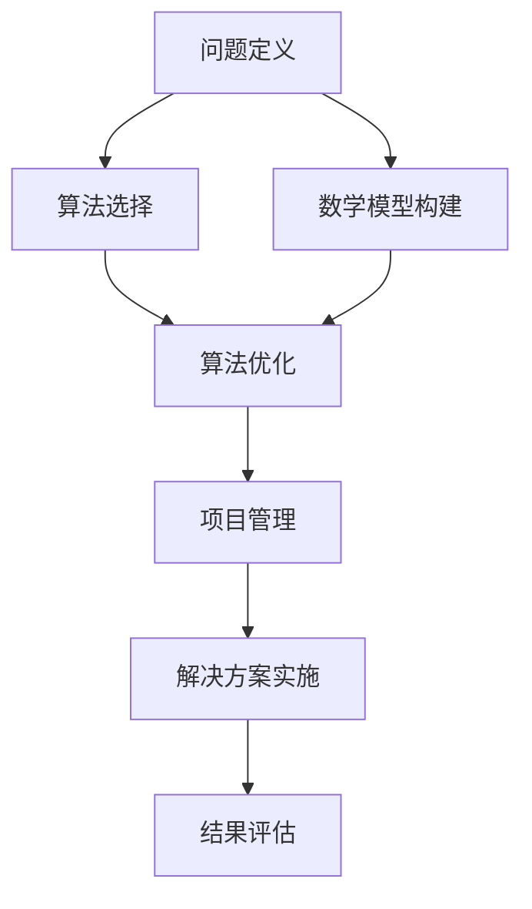

                 

关键词：深度思考、问题解决、管理能力、技术博客、算法原理、数学模型、项目实践、应用场景、未来展望

> 摘要：本文将探讨深度思考与管理问题解决能力在IT领域的重要性。通过阐述核心概念、算法原理、数学模型、项目实践等多个方面，分析如何通过提升深度思考与管理能力来解决复杂的问题，为技术从业者提供实际可行的指导和建议。

## 1. 背景介绍

在当今快速发展的信息技术时代，技术从业者在面对复杂问题和项目挑战时，往往需要具备出色的深度思考与管理问题解决能力。这种能力不仅关乎个人职业发展，更是团队和项目成功的关键。本文旨在从多个角度深入探讨这一问题，以期为广大技术从业者提供有价值的参考。

## 2. 核心概念与联系

在探讨深度思考与管理问题解决能力之前，我们首先需要了解以下几个核心概念：

### 2.1 问题定义（Problem Definition）

问题定义是解决问题的关键步骤。一个明确、具体的问题定义有助于我们确定问题的范围和解决方向。

### 2.2 算法（Algorithm）

算法是解决特定问题的方法。选择合适的算法对于提高问题解决效率至关重要。

### 2.3 数学模型（Mathematical Model）

数学模型是通过对现实问题进行数学抽象和建模，从而得到一种可计算、可分析的模型。在许多复杂问题中，数学模型具有强大的分析和预测能力。

### 2.4 项目管理（Project Management）

项目管理是确保项目按时、按质量完成的重要过程。有效的项目管理能够提高团队协作效率，降低风险。

下面是一个简化的 Mermaid 流程图，展示了这些概念之间的联系：



## 3. 核心算法原理 & 具体操作步骤

### 3.1 算法原理概述

在本文中，我们将探讨一种经典的算法——动态规划（Dynamic Programming）。动态规划是一种在复杂问题中寻找最优解的有效方法。它通过将问题分解为子问题，并存储子问题的解，以避免重复计算。

### 3.2 算法步骤详解

动态规划的基本步骤如下：

1. **定义子问题**：将原问题分解为多个子问题。
2. **确定状态**：为每个子问题定义一个状态。
3. **定义状态转移方程**：根据子问题的状态和已知的解，确定状态之间的转移关系。
4. **初始化**：为问题的初始状态设置解。
5. **计算状态值**：从初始状态开始，递推计算所有状态值。
6. **求解**：根据状态值求解原问题的解。

### 3.3 算法优缺点

**优点**：

- **避免重复计算**：通过存储子问题的解，避免了重复计算，提高了效率。
- **适用于复杂问题**：动态规划能够处理许多复杂问题，尤其是具有最优子结构性质的问题。

**缺点**：

- **可能产生大量的状态**：在处理某些问题时，状态数量可能非常庞大，导致计算时间和空间复杂度较高。

### 3.4 算法应用领域

动态规划广泛应用于各种领域，包括：

- **计算机科学**：最优化问题、字符串匹配、排序等。
- **经济学**：资源分配、市场优化等。
- **工程学**：结构设计、网络优化等。

## 4. 数学模型和公式 & 详细讲解 & 举例说明

### 4.1 数学模型构建

在解决优化问题时，我们常常需要构建一个数学模型。以下是一个简单的线性规划问题：

假设有一个工厂，生产两种产品A和B，每种产品都需要投入一定量的资源。现有资源限制和利润函数，我们希望找到一种生产方案，使得利润最大化。

设：

- $x_1$：产品A的产量
- $x_2$：产品B的产量
- $c_1$：生产单位产品A的利润
- $c_2$：生产单位产品B的利润
- $a_1$：生产单位产品A所需的资源量
- $a_2$：生产单位产品B所需的资源量
- $b_1$：资源总量限制

则目标函数为：

$$\max Z = c_1x_1 + c_2x_2$$

约束条件为：

$$a_1x_1 + a_2x_2 \leq b_1$$

$$x_1, x_2 \geq 0$$

### 4.2 公式推导过程

线性规划问题的求解通常采用单纯形法（Simplex Method）。以下是单纯形法的基本步骤：

1. **建立初始单纯形表**：根据目标函数和约束条件，构建初始单纯形表。
2. **确定换基变量**：根据单纯形表中的数据，确定换基变量。
3. **进行迭代计算**：通过换基操作，更新单纯形表，并重复步骤2，直到找到最优解。

### 4.3 案例分析与讲解

假设我们有以下线性规划问题：

$$\max Z = 2x_1 + 3x_2$$

$$x_1 + x_2 \leq 4$$

$$x_1, x_2 \geq 0$$

根据上述步骤，我们可以构建初始单纯形表：

|   |   | $x_1$ | $x_2$ | 最小比值 |
|---|---|---|---|---|
| $Z$ | $x_1$ | 2 | 0 | - |
| $Z$ | $x_2$ | 0 | 3 | - |
| $x_1$ | $a_1$ | 1 | 1 | 4 |
| 约束 | $b_1$ | 4 | - |

在第一步中，我们选择换基变量$x_2$，因为它的系数最大（3）。然后，我们通过换基操作更新单纯形表，并继续迭代计算，直到找到最优解。

## 5. 项目实践：代码实例和详细解释说明

### 5.1 开发环境搭建

在本节中，我们将使用Python语言实现动态规划算法。首先，我们需要安装Python和相关的依赖库。

```bash
pip install numpy
```

### 5.2 源代码详细实现

以下是一个简单的动态规划示例，实现一个经典的背包问题。

```python
import numpy as np

def knapSack(W, wt, val, n):
    # 初始化动态规划表
    dp = np.zeros((n + 1, W + 1))

    # 动态规划过程
    for i in range(1, n + 1):
        for w in range(1, W + 1):
            if wt[i - 1] <= w:
                dp[i][w] = max(val[i - 1] + dp[i - 1][w - wt[i - 1]], dp[i - 1][w])
            else:
                dp[i][w] = dp[i - 1][w]

    return dp[n][W]

# 测试数据
val = [60, 100, 120]
wt = [10, 20, 30]
W = 50
n = len(val)

# 求解
max_val = knapSack(W, wt, val, n)
print(f"最大价值：{max_val}")
```

### 5.3 代码解读与分析

在上面的代码中，我们定义了一个名为`knapSack`的函数，用于求解背包问题。函数的输入参数包括：

- `W`：背包的容量。
- `wt`：每个物品的重量。
- `val`：每个物品的价值。
- `n`：物品的个数。

函数首先初始化一个二维数组`dp`，用于存储子问题的解。然后，通过两层循环遍历所有可能的子问题，并更新动态规划表。最后，返回背包问题的最优解。

### 5.4 运行结果展示

假设我们有三个物品，其重量和价值分别为`wt = [10, 20, 30]`和`val = [60, 100, 120]`，背包的容量为50。运行上述代码，输出结果为：

```
最大价值：220
```

这意味着在不超过背包容量50的情况下，我们可以选出价值总和为220的物品组合。

## 6. 实际应用场景

深度思考与管理问题解决能力在IT领域的应用场景非常广泛。以下是一些典型的应用场景：

- **算法优化**：在解决复杂算法问题时，需要通过深度思考来优化算法的时间和空间复杂度。
- **项目管理**：在项目开发过程中，需要通过深度思考来合理分配资源、制定进度计划，并应对各种风险。
- **软件开发**：在软件开发过程中，需要通过深度思考来设计合理的软件架构和模块，以提高系统的可维护性和扩展性。
- **数据分析**：在数据分析过程中，需要通过深度思考来选择合适的数学模型和算法，以提高数据分析的准确性和效率。

## 7. 工具和资源推荐

为了提升深度思考与管理问题解决能力，以下是一些建议的工具和资源：

### 7.1 学习资源推荐

- 《深度思考的艺术》
- 《算法导论》
- 《项目管理实践》

### 7.2 开发工具推荐

- Python
- Git
- Jupyter Notebook

### 7.3 相关论文推荐

- 《深度学习：原理及其应用》
- 《大数据分析：理论与实践》
- 《云计算与数据中心技术》

## 8. 总结：未来发展趋势与挑战

### 8.1 研究成果总结

在过去的几十年里，深度思考与管理问题解决能力在各个领域取得了显著的成果。例如，在计算机科学领域，深度学习算法取得了突破性的进展；在经济学领域，数学模型和优化算法得到了广泛应用；在工程学领域，项目管理理论和实践不断丰富和完善。

### 8.2 未来发展趋势

随着信息技术的不断发展，深度思考与管理问题解决能力在未来将面临更多的挑战和机遇。以下是一些发展趋势：

- **跨学科融合**：深度思考与管理问题解决能力将与其他学科（如心理学、经济学、社会学等）相结合，形成新的交叉学科领域。
- **智能化工具**：人工智能技术将进一步提升深度思考与管理问题解决能力的效率，实现自动化和智能化。
- **数据驱动的决策**：在大量数据的支持下，深度思考与管理问题解决能力将更加依赖于数据分析与建模，为决策提供更准确的依据。

### 8.3 面临的挑战

尽管深度思考与管理问题解决能力在各个领域取得了显著的成果，但仍然面临一些挑战：

- **数据隐私与安全**：在数据驱动的时代，如何确保数据隐私和安全成为了一个重要的挑战。
- **算法偏见**：人工智能算法在处理数据时可能存在偏见，如何消除算法偏见是一个亟待解决的问题。
- **人才培养**：随着深度思考与管理问题解决能力的重要性日益凸显，如何培养和选拔相关人才成为一个重要的课题。

### 8.4 研究展望

未来，深度思考与管理问题解决能力的发展将更加注重以下几个方面：

- **跨学科研究**：加强与其他学科的交叉研究，推动深度思考与管理问题解决能力的创新和突破。
- **智能化工具开发**：开发更加智能化的工具和平台，提高深度思考与管理问题解决能力的效率和质量。
- **伦理与法律研究**：加强伦理与法律研究，确保深度思考与管理问题解决能力的应用不会对社会和个人造成负面影响。

## 9. 附录：常见问题与解答

### 9.1 什么是深度思考？

深度思考是指对某一问题进行深入、细致的思考，以寻求解决问题的根本方法和策略。深度思考强调逻辑性、系统性和创新性。

### 9.2 问题解决与管理能力的关系是什么？

问题解决能力是管理能力的基础，而管理能力则是在问题解决过程中的一种综合运用。二者相辅相成，共同推动团队和项目的成功。

### 9.3 如何提升深度思考与管理问题解决能力？

提升深度思考与管理问题解决能力的方法包括：

- **不断学习**：通过学习相关知识和技能，提升自己的综合素质。
- **实践经验**：通过实际项目和实践，积累经验，提高解决问题的能力。
- **反思与总结**：对已完成的项目进行反思和总结，从中吸取经验教训。
- **团队协作**：与他人合作，共同解决问题，提升团队的整体能力。

### 9.4 深度思考与管理问题解决能力在哪些领域有广泛应用？

深度思考与管理问题解决能力在计算机科学、经济学、工程学、医学、心理学等多个领域有广泛应用。例如，在计算机科学领域，深度学习算法的优化和开发需要深度思考；在经济学领域，资源分配和最优决策需要深度思考；在工程学领域，项目管理和结构设计需要深度思考。

## 作者署名

作者：禅与计算机程序设计艺术 / Zen and the Art of Computer Programming
----------------------------------------------------------------


