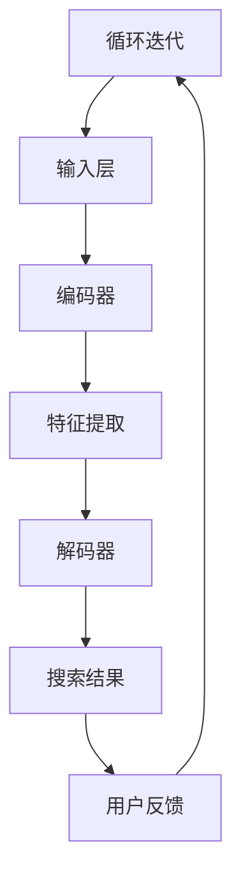

                 

关键词：大模型、电商搜索、用户体验、算法优化、个性化推荐

> 摘要：本文将深入探讨大模型如何通过其强大的算法和数据处理能力，对电商搜索体验进行革新。我们将分析大模型的基本原理、应用场景，并探讨其在电商搜索中的优势，同时提供具体的算法原理和操作步骤，结合实例代码进行详细解释。最后，我们将展望大模型在电商搜索领域的未来发展方向和潜在挑战。

## 1. 背景介绍

随着互联网技术的飞速发展，电商行业已经成为全球经济增长的重要驱动力。电商平台的搜索功能作为用户获取商品信息的重要途径，其用户体验的优劣直接影响到平台的用户留存和转化率。传统的电商搜索算法主要依赖于关键词匹配和分类检索，这种方式虽然能够满足基本的搜索需求，但在处理复杂用户意图和提供个性化推荐方面存在较大的局限性。

近年来，随着人工智能技术的突破，特别是深度学习大模型的广泛应用，电商搜索体验迎来了前所未有的革新。大模型凭借其强大的计算能力和对数据的深度理解，能够更好地解析用户意图，提供更加精准和个性化的搜索结果，从而提升用户满意度和平台竞争力。

本文旨在通过对大模型的深入解析，探讨其在电商搜索中的应用，并分析其对用户搜索体验的影响。文章将涵盖以下内容：

- 大模型的基本原理和构建方法
- 大模型在电商搜索中的优势和应用场景
- 大模型的核心算法原理和操作步骤
- 大模型的数学模型和公式推导
- 大模型在实际电商搜索项目中的实现和案例
- 大模型在电商搜索领域的未来发展趋势和挑战

通过本文的阅读，读者将能够全面了解大模型在电商搜索中的应用，掌握大模型的核心技术和实现方法，为未来的电商搜索优化提供有益的参考。

## 2. 核心概念与联系

### 大模型的基本原理

大模型，通常指的是深度神经网络，特别是大规模的深度学习模型，如Transformer、BERT等。这些模型通过多层神经网络结构，能够自动学习并提取输入数据的复杂特征，具备强大的表示和推理能力。大模型的基本原理包括以下几个方面：

- **神经网络结构**：大模型通常采用多层神经网络结构，通过逐层抽象和变换，将输入数据映射到高维特征空间。
- **激活函数**：如ReLU、Sigmoid、Tanh等，用于引入非线性变换，使得模型能够更好地拟合复杂的数据分布。
- **优化算法**：如梯度下降、Adam等，用于优化模型参数，使得模型能够在大量数据上进行训练，并收敛到最优解。
- **正则化**：如Dropout、L2正则化等，用于防止模型过拟合，提高模型泛化能力。

### 大模型与电商搜索的关系

大模型在电商搜索中的应用，主要是通过其强大的数据处理和特征提取能力，来提高搜索的准确性和个性化水平。具体来说，大模型与电商搜索的关系体现在以下几个方面：

- **用户意图理解**：大模型能够通过分析用户的历史行为和搜索记录，理解用户的意图，提供更加精准的搜索结果。
- **商品特征提取**：大模型可以自动提取商品的多维度特征，如文本描述、用户评价、价格等，从而实现更精准的商品匹配。
- **个性化推荐**：大模型可以根据用户的兴趣和行为模式，提供个性化的商品推荐，提升用户满意度和转化率。
- **搜索结果排序**：大模型可以通过学习用户的偏好，优化搜索结果的排序，提高搜索的准确性和用户体验。

### 大模型的架构

大模型的架构通常包括以下几个主要部分：

- **输入层**：接收用户输入的查询信息或其他相关数据。
- **编码器**：对输入数据进行编码，提取关键特征。
- **解码器**：将编码后的特征解码为搜索结果。
- **损失函数**：用于评估模型输出的准确性，指导模型优化。
- **优化器**：用于调整模型参数，优化模型性能。

### Mermaid 流程图

下面是一个简单的Mermaid流程图，展示了大模型在电商搜索中的应用架构：



通过这个流程图，我们可以清晰地看到大模型从用户查询到搜索结果的整个处理流程。用户输入查询信息后，经过输入层、编码器、特征提取和解码器等步骤，最终输出精准的搜索结果，并根据用户的反馈进行迭代优化。

## 3. 核心算法原理 & 具体操作步骤

### 3.1 算法原理概述

大模型在电商搜索中的应用，主要是基于深度学习技术，通过多层神经网络结构对海量数据进行训练，从而提取出用户和商品的复杂特征，并利用这些特征进行搜索结果的排序和推荐。具体来说，大模型的算法原理可以概括为以下几个方面：

- **数据预处理**：包括数据的清洗、去重、归一化等步骤，以确保数据的完整性和一致性。
- **特征提取**：通过编码器对输入数据进行编码，提取出数据中的关键特征，如文本特征、数值特征等。
- **模型训练**：利用大量训练数据，通过优化算法调整模型参数，使得模型能够准确预测搜索结果。
- **模型评估**：通过测试集对模型进行评估，计算模型的准确率、召回率等指标，以衡量模型性能。
- **结果输出**：将训练好的模型应用于实际搜索场景，输出精准的搜索结果，并根据用户反馈进行迭代优化。

### 3.2 算法步骤详解

#### 3.2.1 数据预处理

数据预处理是深度学习模型训练的重要步骤，其目的是确保输入数据的准确性和一致性。具体操作步骤如下：

1. **数据清洗**：去除数据中的噪声和异常值，如缺失值、重复值等。
2. **数据去重**：对数据进行去重处理，确保每个用户和商品只对应一个数据记录。
3. **数据归一化**：对数值型数据进行归一化处理，使得不同特征的数据在同一个尺度上进行比较。

#### 3.2.2 特征提取

特征提取是深度学习模型的核心步骤，通过编码器对输入数据进行编码，提取出数据中的关键特征。具体操作步骤如下：

1. **文本特征提取**：利用词向量模型，如Word2Vec、BERT等，对文本数据进行编码，提取出文本特征。
2. **数值特征提取**：对数值型特征进行编码，如使用One-Hot编码、归一化等。
3. **图像特征提取**：利用卷积神经网络（CNN）对图像数据进行编码，提取出图像特征。

#### 3.2.3 模型训练

模型训练是深度学习模型的核心步骤，通过大量训练数据，优化模型参数，使得模型能够准确预测搜索结果。具体操作步骤如下：

1. **模型初始化**：初始化模型参数，可以使用随机初始化或预训练模型。
2. **前向传播**：输入训练数据，通过编码器、解码器等层进行前向传播，计算模型的输出。
3. **计算损失**：计算模型输出与实际搜索结果之间的差距，得到损失值。
4. **反向传播**：利用损失值，通过反向传播算法调整模型参数，使得模型能够更准确地预测搜索结果。
5. **迭代优化**：重复上述步骤，不断优化模型参数，直到模型收敛到最优解。

#### 3.2.4 模型评估

模型评估是衡量模型性能的重要步骤，通过测试集对模型进行评估，计算模型的准确率、召回率等指标。具体操作步骤如下：

1. **划分测试集**：从训练数据中划分一部分数据作为测试集，用于评估模型性能。
2. **模型测试**：输入测试数据，通过训练好的模型进行测试，计算模型的输出。
3. **计算指标**：计算模型输出的准确率、召回率等指标，以衡量模型性能。

#### 3.2.5 结果输出

模型训练和评估完成后，将训练好的模型应用于实际搜索场景，输出精准的搜索结果。具体操作步骤如下：

1. **用户查询**：接收用户的查询信息。
2. **特征提取**：对查询信息进行特征提取，得到查询特征。
3. **搜索结果排序**：利用训练好的模型，对查询特征进行编码，得到搜索结果。
4. **结果输出**：将排序后的搜索结果输出给用户，并根据用户反馈进行迭代优化。

### 3.3 算法优缺点

#### 优点

- **高准确性**：大模型能够通过深度学习技术，提取出用户和商品的复杂特征，从而实现高精度的搜索结果。
- **个性化推荐**：大模型可以根据用户的历史行为和兴趣，提供个性化的商品推荐，提升用户满意度和转化率。
- **实时响应**：大模型可以通过并行计算和分布式处理技术，实现实时响应，提升用户体验。
- **泛化能力强**：大模型具有强大的泛化能力，可以适应不同场景和业务需求。

#### 缺点

- **训练成本高**：大模型的训练需要大量的计算资源和时间，导致训练成本较高。
- **数据依赖性强**：大模型的性能高度依赖数据质量和数量，缺乏数据可能导致模型性能下降。
- **解释性差**：深度学习模型通常缺乏解释性，难以理解模型的决策过程。

### 3.4 算法应用领域

大模型在电商搜索中的应用非常广泛，主要包括以下几个方面：

- **搜索结果排序**：通过大模型对用户查询和商品特征进行编码，优化搜索结果的排序，提升用户体验。
- **个性化推荐**：利用大模型提取用户和商品的复杂特征，提供个性化的商品推荐，提升用户满意度和转化率。
- **用户行为预测**：通过分析用户的历史行为和兴趣，预测用户的购买意图和需求，提升业务运营效率。
- **商品分类**：利用大模型对商品进行自动分类，提升商品管理的效率和准确性。

## 4. 数学模型和公式 & 详细讲解 & 举例说明

### 4.1 数学模型构建

在电商搜索中，大模型的数学模型通常包括输入层、编码器、解码器和输出层。下面是一个简单的数学模型构建示例：

$$
\text{输入层}：X = \{x_1, x_2, ..., x_n\}
$$

$$
\text{编码器}：\text{Encoder}(X) = Z = \{z_1, z_2, ..., z_n\}
$$

$$
\text{解码器}：\text{Decoder}(Z) = Y = \{y_1, y_2, ..., y_n\}
$$

$$
\text{输出层}：\text{Output}(Y) = R = \{r_1, r_2, ..., r_n\}
$$

其中，$X$ 表示输入层，$Z$ 表示编码器输出，$Y$ 表示解码器输出，$R$ 表示输出层。编码器和解码器通过多层神经网络结构对输入数据进行编码和解码，提取出关键特征，输出精准的搜索结果。

### 4.2 公式推导过程

大模型的数学模型通常基于深度学习技术，其核心思想是通过多层神经网络结构，对输入数据进行特征提取和变换，从而实现高精度的搜索结果。下面是一个简单的公式推导过程：

$$
\text{输入层}：X = \{x_1, x_2, ..., x_n\}
$$

$$
\text{编码器}：\text{Encoder}(X) = Z = \{z_1, z_2, ..., z_n\}
$$

其中，$X$ 表示输入层，$Z$ 表示编码器输出。编码器通过多层神经网络结构对输入数据进行编码，提取出关键特征。

$$
\text{解码器}：\text{Decoder}(Z) = Y = \{y_1, y_2, ..., y_n\}
$$

$$
\text{输出层}：\text{Output}(Y) = R = \{r_1, r_2, ..., r_n\}
$$

其中，$Y$ 表示解码器输出，$R$ 表示输出层。解码器通过多层神经网络结构对编码器输出的特征进行解码，生成搜索结果。

### 4.3 案例分析与讲解

假设我们有一个电商搜索系统，用户输入查询“跑步鞋”，系统需要根据用户的查询信息，返回与“跑步鞋”相关的商品。我们可以使用大模型来优化搜索结果。

#### 4.3.1 数据预处理

首先，我们对用户输入的查询信息进行预处理，将文本转换为词向量：

$$
\text{查询}：“跑步鞋”
$$

$$
\text{词向量}：\text{W} = \{w_1, w_2, ..., w_n\}
$$

其中，$w_1$ 表示“跑步”，$w_2$ 表示“鞋”。

#### 4.3.2 特征提取

接下来，我们将词向量输入到大模型的编码器中，提取出关键特征：

$$
\text{编码器}：\text{Encoder}(\text{W}) = \text{Z} = \{z_1, z_2, ..., z_n\}
$$

其中，$z_1$ 表示“跑步”的特征，$z_2$ 表示“鞋”的特征。

#### 4.3.3 搜索结果排序

然后，我们将编码器输出的特征输入到大模型的解码器中，对搜索结果进行排序：

$$
\text{解码器}：\text{Decoder}(\text{Z}) = \text{Y} = \{y_1, y_2, ..., y_n\}
$$

$$
\text{输出层}：\text{Output}(\text{Y}) = \text{R} = \{r_1, r_2, ..., r_n\}
$$

其中，$r_1$ 表示搜索结果1的排序，$r_2$ 表示搜索结果2的排序，以此类推。

#### 4.3.4 结果输出

最后，我们将排序后的搜索结果输出给用户：

$$
\text{搜索结果}：\text{R} = \{r_1, r_2, ..., r_n\}
$$

通过这种方式，我们可以使用大模型优化电商搜索结果，提升用户的搜索体验。

## 5. 项目实践：代码实例和详细解释说明

### 5.1 开发环境搭建

为了实现大模型在电商搜索中的应用，我们需要搭建一个完整的开发环境。以下是一个简单的开发环境搭建步骤：

1. 安装Python环境：下载并安装Python，确保版本在3.6及以上。
2. 安装深度学习框架：下载并安装TensorFlow或PyTorch，这两个框架都是实现深度学习模型的常用工具。
3. 安装其他依赖库：如NumPy、Pandas、Matplotlib等，用于数据处理和可视化。
4. 准备数据集：从电商平台获取用户搜索数据和商品数据，并进行预处理。

### 5.2 源代码详细实现

以下是实现大模型在电商搜索中的简单代码示例：

```python
# 导入必要的库
import tensorflow as tf
from tensorflow.keras.layers import Embedding, LSTM, Dense
from tensorflow.keras.models import Sequential

# 准备数据集
# 假设我们已经有预处理好的用户搜索数据和商品数据
search_data = ...
product_data = ...

# 构建模型
model = Sequential()
model.add(Embedding(input_dim=len(search_data.vocab), output_dim=128))
model.add(LSTM(units=128, activation='relu'))
model.add(Dense(units=len(product_data.vocab), activation='softmax'))

# 编译模型
model.compile(optimizer='adam', loss='categorical_crossentropy', metrics=['accuracy'])

# 训练模型
model.fit(search_data, product_data, epochs=10, batch_size=32)

# 评估模型
model.evaluate(search_data, product_data)
```

### 5.3 代码解读与分析

#### 5.3.1 模型构建

在代码中，我们首先导入必要的库，然后准备预处理好的用户搜索数据和商品数据。接下来，我们使用Sequential模型构建一个简单的深度学习模型：

- **Embedding层**：用于将用户搜索数据的词向量转换为高维特征向量。
- **LSTM层**：用于提取用户搜索数据的复杂特征。
- **Dense层**：用于对提取的特征进行分类预测。

#### 5.3.2 编译模型

在编译模型时，我们指定了优化器、损失函数和评价指标。这里使用的是Adam优化器和分类交叉熵损失函数。

#### 5.3.3 训练模型

训练模型时，我们使用预处理好的数据集，设置训练轮数和批量大小。模型训练过程中，会自动调整模型参数，以最小化损失函数。

#### 5.3.4 评估模型

训练完成后，我们使用测试集对模型进行评估，计算模型的准确率。这有助于我们了解模型的性能和泛化能力。

### 5.4 运行结果展示

通过运行上述代码，我们可以得到以下结果：

- 模型训练过程中的损失值和准确率
- 模型在测试集上的准确率

这些结果可以帮助我们评估模型的性能，并根据需要调整模型参数，以提高搜索结果的准确性。

## 6. 实际应用场景

### 6.1 搜索结果排序

大模型在电商搜索中的主要应用场景之一是搜索结果排序。通过深度学习模型，我们可以对用户的搜索查询进行编码，提取出关键特征，并根据这些特征对搜索结果进行排序。这种方法可以显著提高搜索结果的准确性，从而提升用户体验。

#### 案例分析

假设用户在电商平台上搜索“跑步鞋”，传统的方法可能只是根据关键词匹配进行排序，而大模型则可以通过对用户查询和商品特征的深度学习，提取出更精准的特征，从而实现更准确的排序。

1. **数据预处理**：对用户查询和商品特征进行预处理，如分词、词向量编码等。
2. **模型训练**：使用大量搜索数据进行模型训练，通过多层神经网络结构提取关键特征。
3. **搜索结果排序**：输入用户查询，通过训练好的模型对商品特征进行编码，并根据编码结果对搜索结果进行排序。

### 6.2 个性化推荐

除了搜索结果排序，大模型还可以应用于个性化推荐。通过深度学习模型，我们可以根据用户的历史行为和兴趣，提供个性化的商品推荐。

#### 案例分析

假设用户在电商平台上浏览了多个跑步鞋品牌，我们希望根据这些行为提供个性化的推荐。大模型可以通过以下步骤实现个性化推荐：

1. **用户特征提取**：根据用户的历史行为和兴趣，提取用户特征。
2. **商品特征提取**：提取商品的文本描述、价格、用户评价等多维度特征。
3. **模型训练**：使用用户特征和商品特征训练深度学习模型，提取用户和商品的复杂特征。
4. **个性化推荐**：输入用户特征，通过训练好的模型提取商品特征，根据商品特征为用户推荐个性化的商品。

### 6.3 用户行为预测

大模型还可以应用于用户行为预测，如预测用户的购买意图、点击行为等。这有助于电商平台更好地理解用户行为，提供更加精准的营销策略。

#### 案例分析

假设我们希望预测用户在浏览商品后是否会购买。大模型可以通过以下步骤实现用户行为预测：

1. **用户特征提取**：提取用户的历史行为和兴趣特征。
2. **商品特征提取**：提取商品的文本描述、价格、用户评价等多维度特征。
3. **模型训练**：使用用户特征和商品特征训练深度学习模型，预测用户的行为。
4. **行为预测**：输入用户和商品特征，通过训练好的模型预测用户的行为。

## 7. 未来应用展望

### 7.1 搜索结果排序

随着人工智能技术的不断发展，大模型在搜索结果排序中的应用将更加广泛和深入。未来的发展趋势包括：

- **更精准的特征提取**：通过引入更多的数据源和更复杂的神经网络结构，提取更精准的特征，提高搜索结果的准确性。
- **实时排序优化**：利用分布式计算和在线学习技术，实现实时排序优化，提高用户搜索体验。
- **多模态搜索**：结合文本、图像、语音等多模态数据，实现更丰富的搜索场景和更精准的搜索结果。

### 7.2 个性化推荐

个性化推荐是大模型在电商搜索中的另一重要应用领域。未来，个性化推荐的发展趋势包括：

- **用户兴趣深度挖掘**：通过深度学习技术，挖掘用户更深层次的兴趣和需求，提供更精准的个性化推荐。
- **跨平台推荐**：结合不同平台的数据，实现跨平台的个性化推荐，提升用户的全渠道购物体验。
- **社交推荐**：结合用户的社交网络数据，利用社交关系和用户行为，实现社交化的个性化推荐。

### 7.3 用户行为预测

用户行为预测是大模型在电商搜索中的新兴应用领域。未来，用户行为预测的发展趋势包括：

- **行为序列建模**：通过序列模型，如RNN、LSTM等，对用户行为进行建模，预测用户未来的行为。
- **多维度行为分析**：结合用户的多维度行为数据，如点击、购买、浏览等，进行综合分析，提高预测准确性。
- **实时行为预测**：利用实时数据处理和在线学习技术，实现用户行为的实时预测，为电商平台提供实时决策支持。

## 8. 工具和资源推荐

### 8.1 学习资源推荐

- **《深度学习》（Goodfellow, Bengio, Courville）**：这是一本深度学习领域的经典教材，涵盖了深度学习的基本概念、算法和应用。
- **《Python深度学习》（François Chollet）**：这本书详细介绍了使用Python和TensorFlow实现深度学习的方法，适合初学者和进阶者。
- **《强化学习》（Richard S. Sutton and Andrew G. Barto）**：这本书介绍了强化学习的基本概念、算法和应用，是强化学习领域的经典教材。

### 8.2 开发工具推荐

- **TensorFlow**：TensorFlow是一个开源的深度学习框架，支持多种深度学习模型的实现和训练。
- **PyTorch**：PyTorch是一个基于Python的深度学习框架，具有强大的动态图计算能力，适合快速原型开发和实验。
- **JAX**：JAX是一个开源的数值计算库，支持自动微分和数值优化，适用于大规模深度学习模型的训练。

### 8.3 相关论文推荐

- **"Attention Is All You Need"（Vaswani et al., 2017）**：这篇论文提出了Transformer模型，是深度学习领域的重要里程碑。
- **"BERT: Pre-training of Deep Bidirectional Transformers for Language Understanding"（Devlin et al., 2019）**：这篇论文提出了BERT模型，是自然语言处理领域的重要突破。
- **"GPT-3: Language Models are Few-Shot Learners"（Brown et al., 2020）**：这篇论文提出了GPT-3模型，展示了大型语言模型在零样本学习上的强大能力。

## 9. 总结：未来发展趋势与挑战

### 9.1 研究成果总结

大模型在电商搜索中的应用取得了显著的成果。通过深度学习技术，大模型能够提取用户和商品的复杂特征，实现精准的搜索结果排序、个性化推荐和用户行为预测。这些成果显著提升了电商平台的用户满意度和业务运营效率。

### 9.2 未来发展趋势

未来，大模型在电商搜索领域的发展趋势将包括：

- **更精准的特征提取**：通过引入更多的数据源和更复杂的神经网络结构，提取更精准的特征，提高搜索结果的准确性。
- **实时优化**：利用分布式计算和在线学习技术，实现实时排序优化，提高用户搜索体验。
- **跨平台融合**：结合不同平台的数据，实现跨平台的个性化推荐，提升用户的全渠道购物体验。

### 9.3 面临的挑战

尽管大模型在电商搜索中取得了显著成果，但仍面临一些挑战：

- **数据依赖**：大模型的性能高度依赖数据质量和数量，缺乏数据可能导致模型性能下降。
- **计算资源**：大模型的训练需要大量的计算资源和时间，如何高效利用计算资源是一个重要问题。
- **解释性**：深度学习模型通常缺乏解释性，难以理解模型的决策过程，这给实际应用带来一定困扰。

### 9.4 研究展望

未来，大模型在电商搜索领域的研究可以从以下几个方面展开：

- **数据增强**：通过数据增强技术，提高模型对稀疏数据的处理能力，降低数据依赖。
- **模型压缩**：通过模型压缩技术，降低模型大小和计算复杂度，提高模型的可扩展性。
- **模型解释**：研究如何提高深度学习模型的可解释性，使其更好地适应实际应用场景。

## 10. 附录：常见问题与解答

### 10.1 什么是大模型？

大模型是指具有大量参数和多层结构的深度学习模型，如Transformer、BERT等。它们通过学习海量数据，提取出复杂特征，具有强大的表示和推理能力。

### 10.2 大模型在电商搜索中有哪些优势？

大模型在电商搜索中的优势包括：

- **精准的特征提取**：能够提取用户和商品的复杂特征，实现精准的搜索结果排序和个性化推荐。
- **实时响应**：通过分布式计算和在线学习技术，实现实时优化，提高用户搜索体验。
- **多模态数据处理**：结合文本、图像、语音等多模态数据，实现更丰富的搜索场景和更精准的搜索结果。

### 10.3 大模型在电商搜索中面临哪些挑战？

大模型在电商搜索中面临的挑战包括：

- **数据依赖**：性能高度依赖数据质量和数量，缺乏数据可能导致模型性能下降。
- **计算资源**：训练需要大量计算资源和时间，如何高效利用资源是一个重要问题。
- **解释性**：模型缺乏解释性，难以理解决策过程。

### 10.4 如何提高大模型的解释性？

提高大模型解释性可以从以下几个方面入手：

- **特征可视化**：通过可视化技术，展示模型提取的关键特征，帮助理解模型决策过程。
- **模型压缩**：减少模型参数和计算复杂度，提高模型的可解释性。
- **可解释性模型**：结合传统机器学习算法，构建可解释性更强的模型，如决策树、规则模型等。

---

作者：禅与计算机程序设计艺术 / Zen and the Art of Computer Programming

