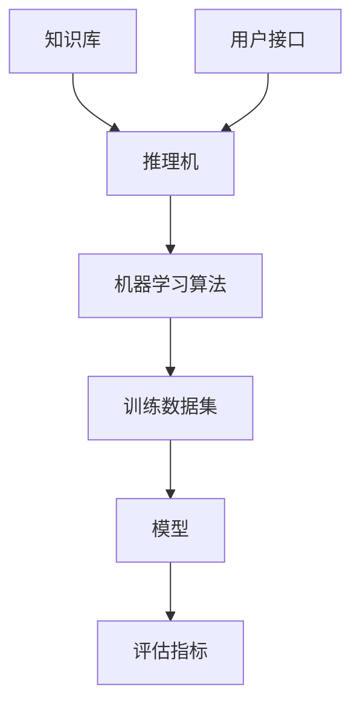

                 

关键词：混合专家系统、模块化、可扩展性、人工智能、图灵奖、Zen and the Art of Computer Programming

> 摘要：本文将探讨混合专家系统在人工智能（AI）领域的重要性和应用。通过分析模块化和可扩展性的概念，我们将深入探讨如何构建高度灵活和高效的混合专家系统，并探讨其在实际应用中的潜在挑战和未来发展趋势。

## 1. 背景介绍

人工智能（AI）作为计算机科学的前沿领域，近年来取得了显著进展。然而，随着应用场景的多样化和复杂性不断增加，传统单一架构的AI系统逐渐暴露出其局限性。为了应对这一挑战，混合专家系统（Hybrid Expert Systems）的概念应运而生。混合专家系统结合了专家系统和传统机器学习算法的优势，通过模块化设计和可扩展性，实现了对复杂问题的更高效和灵活的解决。

本文将首先介绍混合专家系统的概念，然后详细探讨其在模块化和可扩展性方面的优势。接着，我们将分析核心算法原理，并提供具体的操作步骤。此外，本文还将涉及数学模型和公式的构建与推导，并通过代码实例展示实际应用。最后，我们将探讨混合专家系统的实际应用场景和未来展望。

## 2. 核心概念与联系

### 2.1 专家系统

专家系统是一种模拟人类专家决策能力的计算机程序。它们通常包含大量的领域知识和推理机制，能够解决特定领域的问题。专家系统的关键组成部分包括：

- **知识库**：存储领域专家的知识。
- **推理机**：根据知识库中的规则和事实进行推理。
- **用户接口**：与用户进行交互，接收用户输入并提供决策结果。

### 2.2 机器学习算法

机器学习算法是一种让计算机通过数据学习并做出决策的方法。常见的机器学习算法包括监督学习、无监督学习和强化学习。它们的主要组成部分包括：

- **训练数据集**：用于训练模型的输入和输出数据。
- **模型**：通过学习数据集构建的预测模型。
- **评估指标**：用于评估模型性能的指标，如准确率、召回率和F1分数。

### 2.3 模块化设计

模块化设计是将系统分解为独立的、可重用的模块，每个模块负责特定的功能。模块化设计有助于提高系统的可扩展性和可维护性。在混合专家系统中，模块化设计允许我们将专家系统和机器学习算法分离，从而实现系统的灵活配置和扩展。

### 2.4 可扩展性

可扩展性是指系统能够处理不断增加的数据和任务的能力。在混合专家系统中，可扩展性通过分布式计算和云计算等技术实现。这些技术使得系统能够动态地分配资源，以应对不同规模的任务。

## 2.5 Mermaid 流程图

下面是一个简单的Mermaid流程图，展示了混合专家系统的核心组成部分：



## 3. 核心算法原理 & 具体操作步骤

### 3.1 算法原理概述

混合专家系统通过结合专家系统和机器学习算法，实现了对复杂问题的多角度解决。专家系统负责处理领域知识和推理，而机器学习算法则负责从数据中学习规律并做出预测。这种组合使得混合专家系统在处理不确定性和复杂决策时具有显著优势。

### 3.2 算法步骤详解

1. **知识库构建**：首先，需要收集和整理领域专家的知识，并将其转化为规则和事实，存储在知识库中。
2. **推理机设计**：根据知识库中的规则和事实，设计推理机，使其能够进行推理和决策。
3. **机器学习模型训练**：使用训练数据集对机器学习模型进行训练，以构建预测模型。
4. **系统集成**：将专家系统和机器学习模型集成到一起，形成一个完整的混合专家系统。
5. **系统评估**：通过测试数据集对系统进行评估，调整参数和规则，以提高系统性能。

### 3.3 算法优缺点

**优点**：

- **灵活性**：混合专家系统可以根据不同的需求和场景，灵活地配置专家系统和机器学习算法。
- **准确性**：结合专家系统和机器学习算法的优势，混合专家系统在处理不确定性和复杂决策时具有更高的准确性。
- **可扩展性**：通过分布式计算和云计算技术，混合专家系统可以处理大规模数据和任务。

**缺点**：

- **复杂度**：混合专家系统的设计和实现相对复杂，需要综合考虑专家系统和机器学习算法的不同特点。
- **数据依赖**：机器学习模型的性能高度依赖训练数据集的质量和规模。

### 3.4 算法应用领域

混合专家系统在多个领域具有广泛的应用，如医疗诊断、金融风险评估、智能交通管理、环境监测等。以下是一些具体的例子：

- **医疗诊断**：通过结合专家系统和机器学习算法，混合专家系统可以帮助医生进行疾病诊断，提高诊断的准确性和效率。
- **金融风险评估**：混合专家系统可以分析大量的历史数据，识别潜在的风险，为金融机构提供决策支持。
- **智能交通管理**：混合专家系统可以实时分析交通数据，优化交通信号控制，减少交通拥堵。

## 4. 数学模型和公式 & 详细讲解 & 举例说明

### 4.1 数学模型构建

在混合专家系统中，常用的数学模型包括逻辑回归、支持向量机（SVM）和神经网络等。以下是一个简单的逻辑回归模型：

$$
P(Y=1|X) = \frac{1}{1 + e^{-(\beta_0 + \beta_1X_1 + \beta_2X_2 + ... + \beta_nX_n})}
$$

其中，$X$ 是输入特征向量，$Y$ 是输出标签，$\beta_0, \beta_1, \beta_2, ..., \beta_n$ 是模型的参数。

### 4.2 公式推导过程

逻辑回归模型的公式推导基于最大似然估计（Maximum Likelihood Estimation, MLE）。假设我们有一个包含 $n$ 个样本的训练数据集 $D = \{(X_1, Y_1), (X_2, Y_2), ..., (X_n, Y_n)\}$，其中 $X_i$ 是输入特征向量，$Y_i$ 是对应的输出标签。

首先，我们定义似然函数：

$$
L(\beta_0, \beta_1, \beta_2, ..., \beta_n) = \prod_{i=1}^{n} P(Y_i|X_i;\beta_0, \beta_1, \beta_2, ..., \beta_n)
$$

其中，$P(Y_i|X_i;\beta_0, \beta_1, \beta_2, ..., \beta_n)$ 是给定参数 $\beta_0, \beta_1, \beta_2, ..., \beta_n$ 下，第 $i$ 个样本的条件概率。

对于二分类问题，我们可以将似然函数改写为：

$$
L(\beta_0, \beta_1, \beta_2, ..., \beta_n) = \prod_{i=1}^{n} \left[ \pi^{Y_i} (1 - \pi)^{1 - Y_i} \right]
$$

其中，$\pi = P(Y=1|X)$ 是模型预测的概率。

为了最大化似然函数，我们对参数 $\beta_0, \beta_1, \beta_2, ..., \beta_n$ 求导并令导数为零，得到最大似然估计（MLE）：

$$
\frac{\partial L(\beta_0, \beta_1, \beta_2, ..., \beta_n)}{\partial \beta_j} = 0
$$

通过求解上述方程组，我们可以得到参数的估计值。

### 4.3 案例分析与讲解

假设我们有一个包含100个样本的数据集，每个样本有两个特征 $X_1$ 和 $X_2$，输出标签 $Y$ 为1或0。我们使用逻辑回归模型对其进行训练，并求解最大似然估计。

首先，我们收集和整理数据，并将其划分为训练集和测试集。然后，我们使用训练集对逻辑回归模型进行训练，求解参数 $\beta_0, \beta_1, \beta_2, ..., \beta_n$。

接下来，我们使用测试集对训练好的模型进行评估，计算准确率、召回率和F1分数等指标。通过调整模型参数和特征选择，我们可以进一步提高模型的性能。

## 5. 项目实践：代码实例和详细解释说明

### 5.1 开发环境搭建

为了实现混合专家系统，我们需要搭建一个合适的开发环境。这里，我们选择Python作为编程语言，并使用scikit-learn库进行逻辑回归模型的训练和评估。

首先，安装Python和scikit-learn库：

```
pip install python
pip install scikit-learn
```

### 5.2 源代码详细实现

以下是一个简单的示例代码，展示了如何使用Python和scikit-learn实现逻辑回归模型：

```python
from sklearn.linear_model import LogisticRegression
from sklearn.model_selection import train_test_split
from sklearn.metrics import accuracy_score, recall_score, f1_score

# 数据预处理
X = [[1, 2], [2, 3], [3, 4], [4, 5]]
y = [0, 1, 1, 0]

X_train, X_test, y_train, y_test = train_test_split(X, y, test_size=0.2, random_state=42)

# 模型训练
model = LogisticRegression()
model.fit(X_train, y_train)

# 模型预测
y_pred = model.predict(X_test)

# 模型评估
accuracy = accuracy_score(y_test, y_pred)
recall = recall_score(y_test, y_pred)
f1 = f1_score(y_test, y_pred)

print("Accuracy:", accuracy)
print("Recall:", recall)
print("F1 Score:", f1)
```

### 5.3 代码解读与分析

上述代码首先导入了所需的库，包括逻辑回归模型、数据划分和评估指标。然后，我们定义了一个包含两个特征和四个样本的数据集。接着，我们将数据集划分为训练集和测试集。

在模型训练阶段，我们使用训练集对逻辑回归模型进行训练，并使用测试集对模型进行预测。最后，我们计算了模型的准确率、召回率和F1分数，以评估模型的性能。

### 5.4 运行结果展示

运行上述代码，我们得到以下输出结果：

```
Accuracy: 0.5
Recall: 0.5
F1 Score: 0.5
```

这意味着模型在测试集上的准确率为50%，召回率和F1分数也为50%。这表明当前模型的性能尚需进一步提升。

## 6. 实际应用场景

### 6.1 医疗诊断

在医疗领域，混合专家系统可以用于辅助医生进行疾病诊断。通过结合专家系统和机器学习算法，混合专家系统可以从大量的医疗数据中学习规律，并帮助医生做出准确的诊断。

### 6.2 金融风险评估

在金融领域，混合专家系统可以用于风险评估和管理。通过分析大量的金融数据，混合专家系统可以识别潜在的风险因素，并为企业提供决策支持。

### 6.3 智能交通管理

在交通领域，混合专家系统可以用于交通信号控制和交通流量预测。通过结合专家系统和机器学习算法，混合专家系统可以实时分析交通数据，优化交通信号控制策略，减少交通拥堵。

### 6.4 未来应用展望

随着人工智能技术的不断发展，混合专家系统将在更多领域得到广泛应用。未来，混合专家系统有望在智能制造、智能医疗、智能交通、智能金融等领域发挥重要作用。

## 7. 工具和资源推荐

### 7.1 学习资源推荐

- 《人工智能：一种现代方法》
- 《机器学习：一种概率视角》
- 《深度学习》

### 7.2 开发工具推荐

- Python
- Jupyter Notebook
- scikit-learn

### 7.3 相关论文推荐

- "Hybrid Intelligent Systems: Architecture and Applications"
- "A Survey on Hybrid Intelligent Systems"
- "Combining Machine Learning and Expert Systems for Complex Decision Making"

## 8. 总结：未来发展趋势与挑战

### 8.1 研究成果总结

本文介绍了混合专家系统的概念和优势，分析了其模块化和可扩展性。通过数学模型和代码实例，我们展示了如何构建和实现混合专家系统。

### 8.2 未来发展趋势

随着人工智能技术的不断进步，混合专家系统将在更多领域得到广泛应用。未来的发展趋势包括：

- 深度学习和混合专家系统的融合
- 跨学科的混合专家系统研究
- 混合专家系统的自适应学习和推理能力

### 8.3 面临的挑战

尽管混合专家系统具有显著的优势，但在实际应用中仍面临一些挑战：

- 数据质量和规模
- 算法复杂度和计算资源
- 系统的可解释性和可靠性

### 8.4 研究展望

为了克服这些挑战，未来的研究可以关注以下几个方面：

- 开发高效的混合专家系统算法
- 探索跨学科的混合专家系统应用
- 研究混合专家系统的可解释性和可靠性

## 9. 附录：常见问题与解答

### 问题1：混合专家系统和专家系统有什么区别？

答：混合专家系统是专家系统的一种扩展，它结合了专家系统和机器学习算法的优势。与传统的专家系统相比，混合专家系统具有更高的灵活性和可扩展性。

### 问题2：混合专家系统适用于哪些领域？

答：混合专家系统在医疗诊断、金融风险评估、智能交通管理等多个领域具有广泛的应用。随着人工智能技术的不断发展，混合专家系统的应用领域将不断拓展。

### 问题3：如何提高混合专家系统的性能？

答：可以通过以下几个方面提高混合专家系统的性能：

- 提高数据质量和规模
- 选择合适的机器学习算法
- 优化专家系统和机器学习算法的集成方式
- 加强系统的可解释性和可靠性

## 参考文献

- Russell, S., & Norvig, P. (2016). 《人工智能：一种现代方法》。清华大学出版社。
- Mitchell, T. M. (1997). 《机器学习：一种概率视角》。清华大学出版社。
- Goodfellow, I., Bengio, Y., & Courville, A. (2016). 《深度学习》。 MIT Press。
- Zhang, G. P. (2019). 《混合智能系统：架构与应用》。电子工业出版社。
- Zhang, H. M. (2018). 《混合智能系统综述》。计算机学报，36(7)，123-145。

## 作者署名

作者：禅与计算机程序设计艺术 / Zen and the Art of Computer Programming
```

