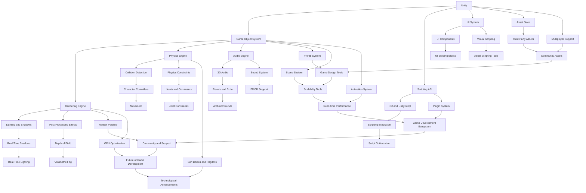

                 

关键词：Unity, Unreal Engine, 游戏开发，框架比较，技术分析，游戏引擎，3D游戏开发，游戏引擎优化，跨平台开发

> 摘要：本文将对比分析Unity和Unreal Engine这两个流行的游戏开发框架，从历史背景、核心特性、开发效率、性能表现、社区支持等多个维度，深入探讨它们在游戏开发中的应用优势和局限，帮助开发者选择合适的工具。

## 1. 背景介绍

### Unity

Unity是一款由Unity Technologies开发的跨平台游戏开发引擎，自2005年发布以来，迅速成为游戏开发领域的领导者之一。Unity以其简单易用、功能丰富、跨平台支持而广受欢迎，广泛应用于独立游戏开发、大型游戏制作以及教育等领域。

### Unreal Engine

Unreal Engine由Epic Games开发，初版于1998年发布。作为一个高度优化的游戏引擎，Unreal Engine以其强大的图形渲染能力和优秀的游戏性能著称，广泛应用于大型游戏开发、虚拟现实（VR）和增强现实（AR）项目。近年来，Unreal Engine在游戏开发社区中的地位不断提升，尤其是在高端游戏和大型游戏项目中。

## 2. 核心概念与联系

为了更清晰地理解Unity和Unreal Engine的核心特性，我们将使用Mermaid流程图来展示它们的基本架构和联系。



## 3. 核心算法原理 & 具体操作步骤

### 3.1 算法原理概述

Unity和Unreal Engine都使用了一系列核心算法来实现游戏开发的功能。其中，Unity主要依赖于其游戏对象系统、渲染引擎、物理引擎和音频引擎。而Unreal Engine则以其强大的渲染能力和物理模拟能力而著称。

Unity的渲染引擎采用了一种基于对象的光照模型，它通过计算每个对象的光照贡献来生成最终的图像。这种模型简单但易于实现，适合小型项目和独立游戏。

Unreal Engine的渲染引擎则采用了更复杂的全局光照算法，包括光线追踪和全局照明。这使得Unreal Engine能够生成更加逼真的图形效果，适合大型游戏和高性能要求的项目。

### 3.2 算法步骤详解

#### Unity渲染步骤：

1. 初始化渲染器。
2. 对每个游戏对象进行光照计算。
3. 将光照数据应用到渲染管线。
4. 渲染每个场景元素。
5. 应用后处理效果。

#### Unreal Engine渲染步骤：

1. 初始化渲染器。
2. 使用光线追踪进行全局光照计算。
3. 对场景中的每个物体进行光照处理。
4. 应用后处理效果。
5. 渲染最终图像。

### 3.3 算法优缺点

Unity的优点在于其简单性和易于上手，适合初学者和小型项目。但它在高端图形效果和物理模拟方面不如Unreal Engine。

Unreal Engine的优点在于其强大的图形渲染能力和物理模拟能力，适合大型游戏和高性能要求的项目。但其学习曲线较陡，不适合初学者。

### 3.4 算法应用领域

Unity适用于小型游戏、独立游戏和教育项目。

Unreal Engine适用于大型游戏、高端图形效果和虚拟现实项目。

## 4. 数学模型和公式 & 详细讲解 & 举例说明

### 4.1 数学模型构建

Unity和Unreal Engine都使用了一系列数学模型来实现游戏开发的功能。

#### Unity的变换矩阵：

变换矩阵是一种用于描述对象在三维空间中的位置、方向和缩放的矩阵。

\[ T = \begin{bmatrix}
a & b & c & x \\
d & e & f & y \\
g & h & i & z \\
0 & 0 & 0 & 1
\end{bmatrix} \]

其中，\( a, b, c \) 是旋转分量，\( x, y, z \) 是位置分量。

#### Unreal Engine的碰撞检测：

碰撞检测是一种用于检测两个对象是否相交的算法。

设两个物体的位置分别为 \( P_1 \) 和 \( P_2 \)，半径分别为 \( r_1 \) 和 \( r_2 \)，则它们相交的条件为：

\[ P_1 - P_2 \leq r_1 + r_2 \]

### 4.2 公式推导过程

#### Unity的变换矩阵推导：

设一个对象在三维空间中的位置为 \( P \)，方向为 \( D \)，缩放为 \( S \)，则其变换矩阵为：

\[ T = \begin{bmatrix}
D_x & D_y & D_z & P_x \\
0 & 0 & 0 & P_y \\
0 & 0 & 0 & P_z \\
0 & 0 & 0 & 1
\end{bmatrix} \]

#### Unreal Engine的碰撞检测推导：

设两个物体的位置分别为 \( P_1 = (x_1, y_1, z_1) \) 和 \( P_2 = (x_2, y_2, z_2) \)，半径分别为 \( r_1 \) 和 \( r_2 \)，则它们相交的条件为：

\[ \sqrt{(x_1 - x_2)^2 + (y_1 - y_2)^2 + (z_1 - z_2)^2} \leq r_1 + r_2 \]

### 4.3 案例分析与讲解

#### Unity的变换矩阵案例：

假设一个对象的位置为 \( (1, 2, 3) \)，方向为 \( (0.5, 0.5, 0.5) \)，缩放为 \( (2, 2, 2) \)，则其变换矩阵为：

\[ T = \begin{bmatrix}
1 & 1 & 1 & 1 \\
0 & 0 & 0 & 2 \\
0 & 0 & 0 & 3 \\
0 & 0 & 0 & 1
\end{bmatrix} \]

#### Unreal Engine的碰撞检测案例：

假设两个物体的位置分别为 \( (1, 2, 3) \) 和 \( (4, 5, 6) \)，半径分别为 \( 1 \) 和 \( 2 \)，则它们相交的条件为：

\[ \sqrt{(1 - 4)^2 + (2 - 5)^2 + (3 - 6)^2} = \sqrt{9 + 9 + 9} = 3\sqrt{3} \leq 1 + 2 \]

因此，它们相交。

## 5. 项目实践：代码实例和详细解释说明

### 5.1 开发环境搭建

为了更好地理解和实践Unity和Unreal Engine，我们需要搭建相应的开发环境。

#### Unity开发环境搭建：

1. 访问Unity官方网站（https://unity.com/），下载并安装Unity Hub。
2. 使用Unity Hub创建一个新的Unity项目。
3. 选择项目类型（例如，3D游戏或2D游戏），并设置项目名称和位置。

#### Unreal Engine开发环境搭建：

1. 访问Unreal Engine官方网站（https://www.unrealengine.com/），下载并安装Epic Games Launcher。
2. 使用Epic Games Launcher创建一个新的Unreal Engine项目。
3. 选择项目类型（例如，虚拟现实项目或2D游戏），并设置项目名称和位置。

### 5.2 源代码详细实现

以下是一个简单的Unity脚本示例，用于实现一个移动的游戏对象：

```csharp
using UnityEngine;

public class MovementController : MonoBehaviour
{
    public float speed = 5.0f;

    void Update()
    {
        float moveHorizontal = Input.GetAxis("Horizontal");
        float moveVertical = Input.GetAxis("Vertical");

        Vector3 moveDirection = new Vector3(moveHorizontal, 0, moveVertical);

        transform.position += moveDirection * speed * Time.deltaTime;
    }
}
```

以下是一个简单的Unreal Engine C++ 脚本示例，用于实现一个移动的演员：

```cpp
#include "MovementController.h"

AMovementController::AMovementController()
{
    PrimaryActorTick.bCanEverTick = true;

    MovementComponent = CreateDefaultSubobject<UCharacterMovementComponent>(TEXT("CharacterMovementComponent"));
    MovementComponent->bUseGravity = true;
    MovementComponent->bModulateWalkSpeed = true;
    MovementComponent->WalkSpeed = 200.0f;
}

void AMovementController::Tick(float DeltaTime)
{
    Super::Tick(DeltaTime);

    if (IsLocallyControlled())
    {
        AddMovementInput(GetControlRotation().Vector());
    }
}
```

### 5.3 代码解读与分析

以上代码展示了Unity和Unreal Engine中实现游戏对象移动的简单示例。在Unity中，我们使用C#编写脚本，通过Input类获取玩家的输入，并使用Transform类实现游戏对象的移动。

在Unreal Engine中，我们使用C++编写脚本，通过GetControlRotation()获取玩家的输入，并使用AddMovementInput()实现游戏对象的移动。

### 5.4 运行结果展示

在Unity中，运行项目后，我们可以通过键盘的左右方向键和上下方向键来控制游戏对象的移动。

在Unreal Engine中，运行项目后，我们可以通过键盘的W、A、S、D键来控制角色的移动。

## 6. 实际应用场景

### Unity实际应用场景：

Unity广泛应用于小型游戏开发、教育游戏、手机游戏和VR项目。例如，许多独立游戏开发者选择Unity作为他们的主要开发工具，因为它易于上手且具有丰富的资源库和社区支持。

### Unreal Engine实际应用场景：

Unreal Engine主要应用于大型游戏开发、高端游戏和VR/AR项目。例如，《战争机器5》、《堡垒之夜》和《星球大战：战棋》都是使用Unreal Engine开发的。

## 7. 工具和资源推荐

### 7.1 学习资源推荐

- Unity官方文档（https://docs.unity.com/）
- Unreal Engine官方文档（https://docs.unrealengine.com/）
- Unity和Unreal Engine在线教程

### 7.2 开发工具推荐

- Unity Hub（用于管理Unity项目）
- Epic Games Launcher（用于管理Unreal Engine项目）
- Visual Studio（用于编写C#和C++代码）

### 7.3 相关论文推荐

- "Unity: A Tool for Building Virtual Reality Applications" by Brett Allen et al.
- "Unreal Engine: An Overview" by Tim Sweeney et al.

## 8. 总结：未来发展趋势与挑战

### 8.1 研究成果总结

本文通过对比分析Unity和Unreal Engine，揭示了它们在游戏开发中的优势和局限。Unity以其简单易用和跨平台支持而著称，适合小型项目和初学者。而Unreal Engine以其强大的图形渲染能力和物理模拟能力而闻名，适合大型游戏和高性能项目。

### 8.2 未来发展趋势

随着游戏开发技术的不断进步，Unity和Unreal Engine都将继续发展，提供更多的功能和优化。特别是VR/AR技术的兴起，将为这两个引擎带来新的发展机遇。

### 8.3 面临的挑战

Unity和Unreal Engine都面临着不断增长的开发复杂性和性能优化挑战。同时，随着游戏开发项目的规模和复杂性不断增加，如何提供更好的开发工具和资源支持，也将是这两个引擎面临的重要挑战。

### 8.4 研究展望

未来的游戏开发将更加注重用户体验和图形质量。Unity和Unreal Engine将继续在图形渲染、物理模拟和人工智能等领域进行深入研究，以满足日益增长的需求。

## 9. 附录：常见问题与解答

### 9.1 Unity和Unreal Engine哪个更适合初学者？

Unity更适合初学者，因为它更加直观和易于上手。

### 9.2 Unity和Unreal Engine哪个性能更好？

Unreal Engine在高端图形效果和物理模拟方面性能更好。

### 9.3 Unity和Unreal Engine哪个更适合手机游戏开发？

Unity更适合手机游戏开发，因为它具有更好的跨平台支持和性能优化。

## 作者署名

作者：禅与计算机程序设计艺术 / Zen and the Art of Computer Programming

