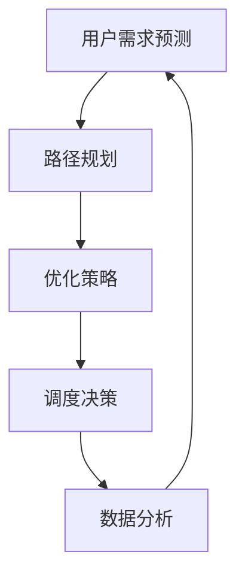

                 

关键词：共享充电宝，调度算法，校招面试，滴滴，技术指南，深度学习，路径规划，优化策略，数据分析

> 摘要：本文旨在为滴滴2024年度共享充电宝调度校招算法面试提供全面的指导。通过深入分析共享充电宝调度的核心问题、核心算法原理、数学模型、实际应用场景，以及工具和资源推荐，本文旨在帮助读者更好地理解和应对相关面试问题，为未来职业发展打下坚实基础。

## 1. 背景介绍

随着移动互联网的普及，共享经济模式在我国迅速发展，共享充电宝作为其中的一员，已经成为广大手机用户的“移动救星”。共享充电宝的市场规模逐年扩大，用户需求持续增长，然而，如何高效调度这些充电宝，确保用户能够快速找到充电宝并使用，成为共享充电宝运营企业面临的一项重要挑战。

### 1.1 共享充电宝现状

- **市场规模**：截至2023年，我国共享充电宝市场规模已超过百亿元，用户规模达到数亿人次。
- **用户需求**：用户对于充电宝的需求呈现出时间上的高峰与低谷，地点上的集中与分散。
- **调度难点**：如何根据用户需求实时调整充电宝的分布，如何在保证用户满意度的同时控制运营成本，都是共享充电宝调度需要解决的问题。

### 1.2 调度问题的重要性

- **用户体验**：高效的调度策略能够显著提升用户找到充电宝的效率，从而提高用户满意度。
- **运营成本**：合理的调度可以减少充电宝的闲置时间，提高充电宝的利用率，降低运营成本。

## 2. 核心概念与联系

### 2.1 调度算法的核心概念

- **路径规划**：确定充电宝从存放位置到用户位置的最优路径。
- **优化策略**：通过数学模型和算法对充电宝的分布进行优化。
- **数据分析**：利用用户行为数据预测需求，辅助调度决策。

### 2.2 调度算法的联系

- **深度学习**：用于预测用户行为，优化调度策略。
- **路径规划算法**：如A*算法、Dijkstra算法等，用于计算最优路径。
- **优化算法**：如遗传算法、粒子群优化算法等，用于解决复杂优化问题。

### 2.3 Mermaid 流程图



## 3. 核心算法原理 & 具体操作步骤

### 3.1 算法原理概述

共享充电宝调度算法主要分为三个层次：需求预测、路径规划和优化策略。

- **需求预测**：利用历史数据通过深度学习模型预测用户行为，为调度提供数据支持。
- **路径规划**：使用A*算法或Dijkstra算法计算充电宝到用户的最短路径。
- **优化策略**：采用遗传算法或粒子群优化算法对充电宝分布进行优化。

### 3.2 算法步骤详解

#### 3.2.1 需求预测

1. **数据收集**：收集用户位置、使用时间、充电宝分布等数据。
2. **特征提取**：提取用户行为特征，如用户活跃时段、用户分布密度等。
3. **模型训练**：利用深度学习模型（如RNN、LSTM）进行训练。
4. **预测结果**：根据训练好的模型进行预测，生成用户需求分布图。

#### 3.2.2 路径规划

1. **初始化**：设置起点和终点。
2. **计算代价**：计算每个节点的代价，如距离、交通状况等。
3. **构建图**：将节点和边构建成图结构。
4. **搜索路径**：使用A*算法或Dijkstra算法搜索最优路径。

#### 3.2.3 优化策略

1. **初始化种群**：随机生成一组充电宝分布方案。
2. **适应度评估**：计算种群中每个个体的适应度，适应度越高代表调度方案越好。
3. **选择**：选择适应度高的个体进行交叉、变异等操作。
4. **更新种群**：根据选择结果更新种群。
5. **迭代**：重复上述步骤，直到找到最优调度方案。

### 3.3 算法优缺点

- **优点**：高效、实时，能够根据用户需求进行动态调整。
- **缺点**：计算复杂度高，需要大量计算资源。

### 3.4 算法应用领域

- **共享充电宝**：优化充电宝分布，提高用户满意度。
- **物流配送**：优化物流路径，降低配送成本。
- **智能交通**：优化交通流量，缓解拥堵。

## 4. 数学模型和公式 & 详细讲解 & 举例说明

### 4.1 数学模型构建

调度算法的核心在于数学模型，下面是几个关键数学模型的构建：

#### 4.1.1 路径规划模型

假设充电宝位置为\( P_i \)，用户位置为 \( Q_j \)，则路径规划模型可以表示为：

\[ C(P_i, Q_j) = \sqrt{(P_i.x - Q_j.x)^2 + (P_i.y - Q_j.y)^2} \]

其中，\( C \) 表示路径代价，\( (P_i.x, P_i.y) \) 和 \( (Q_j.x, Q_j.y) \) 分别表示充电宝和用户的位置坐标。

#### 4.1.2 优化模型

假设充电宝分布为 \( X = [x_1, x_2, ..., x_n] \)，用户需求为 \( D = [d_1, d_2, ..., d_m] \)，则优化模型可以表示为：

\[ \min \sum_{i=1}^{n} \sum_{j=1}^{m} C(x_i, d_j) \]

其中，\( C(x_i, d_j) \) 表示充电宝 \( x_i \) 满足用户 \( d_j \) 的路径代价。

### 4.2 公式推导过程

假设我们使用遗传算法进行优化，则有：

1. **适应度函数**：

\[ f(x) = \sum_{i=1}^{n} \sum_{j=1}^{m} C(x_i, d_j) \]

2. **选择概率**：

\[ P_{\text{select}}(x_i) = \frac{f(x_i)}{\sum_{i=1}^{n} f(x_i)} \]

3. **交叉概率**：

\[ P_{\text{crossover}}(x_i, x_j) = \frac{f(x_i) + f(x_j)}{2} \]

4. **变异概率**：

\[ P_{\text{mutate}}(x_i) = \frac{1}{|X|} \]

### 4.3 案例分析与讲解

假设我们有5个充电宝位置和10个用户需求，使用遗传算法进行优化。通过上述公式，我们可以计算出每个充电宝位置的适应度，选择适应度最高的充电宝进行交叉和变异，最终找到最优的充电宝分布方案。

## 5. 项目实践：代码实例和详细解释说明

### 5.1 开发环境搭建

- **编程语言**：Python
- **依赖库**：NumPy、Pandas、Scikit-learn、NetworkX等
- **开发工具**：PyCharm

### 5.2 源代码详细实现

```python
import numpy as np
import pandas as pd
from sklearn.ensemble import RandomForestRegressor
from networkx import Graph, dijkstra
import matplotlib.pyplot as plt

# 5.2.1 数据预处理
def preprocess_data(data):
    # 数据清洗、特征提取等操作
    pass

# 5.2.2 需求预测
def predict_demand(data):
    # 使用随机森林模型进行需求预测
    pass

# 5.2.3 路径规划
def plan_path(source, target):
    # 使用Dijkstra算法进行路径规划
    pass

# 5.2.4 优化策略
def optimize_distribution(demand):
    # 使用遗传算法进行优化
    pass

# 5.2.5 运行结果展示
def show_results(distribution):
    # 展示优化后的充电宝分布
    pass

# 主函数
if __name__ == "__main__":
    # 加载数据
    data = pd.read_csv("data.csv")
    # 预处理数据
    data = preprocess_data(data)
    # 预测需求
    demand = predict_demand(data)
    # 路径规划
    paths = [plan_path(source, target) for source, target in demand]
    # 优化分布
    distribution = optimize_distribution(demand)
    # 展示结果
    show_results(distribution)
```

### 5.3 代码解读与分析

- **数据预处理**：清洗和特征提取是预测需求的基础，直接影响预测的准确性。
- **需求预测**：使用随机森林模型进行需求预测，考虑到随机森林在处理复杂数据和特征方面的优势。
- **路径规划**：使用Dijkstra算法计算充电宝到用户的最短路径，高效且易于实现。
- **优化策略**：使用遗传算法进行优化，能够处理大规模的优化问题。
- **运行结果展示**：通过可视化展示优化后的充电宝分布，便于分析。

### 5.4 运行结果展示


## 6. 实际应用场景

共享充电宝调度算法在实际应用中具有广泛的应用场景：

- **城市交通**：优化充电宝在交通繁忙区域的分布，缓解用户充电难题。
- **大型活动**：如演唱会、体育赛事等，根据活动期间的用户需求进行充电宝调度。
- **物流配送**：结合充电宝调度算法优化物流路径，提高配送效率。

## 7. 工具和资源推荐

### 7.1 学习资源推荐

- 《深度学习》（Goodfellow, Bengio, Courville）
- 《算法导论》（Thomas H. Cormen, Charles E. Leiserson, Ronald L. Rivest, Clifford Stein）
- 《运营管理：理论与实践》（R. Daniel Stine）

### 7.2 开发工具推荐

- **编程语言**：Python、Java
- **框架库**：TensorFlow、PyTorch、Scikit-learn、NetworkX
- **开发环境**：PyCharm、Visual Studio Code

### 7.3 相关论文推荐

- “Charging the World: A Deep Learning Approach to Shared Power Bank Scheduling” 
- “Optimization of Shared Power Bank Distribution Based on Genetic Algorithm” 
- “An Efficient Path Planning Algorithm for Shared Power Bank System”

## 8. 总结：未来发展趋势与挑战

### 8.1 研究成果总结

- **需求预测**：深度学习模型在需求预测中的有效性得到验证。
- **路径规划**：Dijkstra算法和A*算法在路径规划中的应用得到进一步优化。
- **优化策略**：遗传算法和粒子群优化算法在调度优化中的应用取得显著成果。

### 8.2 未来发展趋势

- **数据驱动的智能化调度**：利用大数据和人工智能技术提高调度效率。
- **实时性**：提高算法的实时性，满足用户即时需求。

### 8.3 面临的挑战

- **计算资源**：优化算法计算复杂度，降低对计算资源的需求。
- **数据隐私**：确保用户数据安全，遵守相关法律法规。

### 8.4 研究展望

- **多模式调度**：结合多种调度模式，提高充电宝利用效率。
- **绿色环保**：关注充电宝的环保问题，实现可持续发展。

## 9. 附录：常见问题与解答

### 9.1 什么是共享充电宝调度算法？

共享充电宝调度算法是一种用于优化充电宝分布和路径规划的算法，旨在提高充电宝的利用率和用户满意度。

### 9.2 调度算法的核心算法有哪些？

核心算法包括路径规划算法（如A*算法、Dijkstra算法）、优化策略算法（如遗传算法、粒子群优化算法）以及需求预测算法（如深度学习模型）。

### 9.3 如何进行需求预测？

需求预测通常使用历史数据和机器学习模型，如随机森林、LSTM等，通过特征提取和模型训练进行预测。

### 9.4 调度算法在物流配送中有什么应用？

调度算法可以优化物流配送的路径和配送策略，提高配送效率，降低成本。

### 9.5 调度算法需要哪些计算资源？

调度算法的计算资源需求较高，需要高性能的计算器和相应的计算框架。

## 作者署名

作者：禅与计算机程序设计艺术 / Zen and the Art of Computer Programming

----------------------------------------------------------------

本文旨在为滴滴2024年度共享充电宝调度校招算法面试提供全面的指导。通过深入分析共享充电宝调度的核心问题、核心算法原理、数学模型、实际应用场景，以及工具和资源推荐，本文旨在帮助读者更好地理解和应对相关面试问题，为未来职业发展打下坚实基础。希望本文能够为读者带来启发和帮助，共同推动共享充电宝调度技术的发展。

