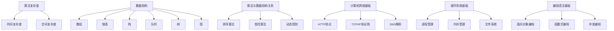

                 

关键词：编程面试题，滴滴，社招，2024，技术挑战，算法解析，面试技巧

摘要：本文针对滴滴公司2024年社招编程面试的常见问题进行了深入分析，总结了核心的面试题及其解答，提供了实用的面试技巧和项目实践案例，旨在帮助求职者在面试中取得优异成绩。

## 1. 背景介绍

滴滴出行作为中国领先的移动出行平台，其技术团队在编程面试方面积累了丰富的经验。本文旨在梳理滴滴2024年社招编程面试的精华问题，以帮助求职者更好地应对面试挑战。本文将涵盖算法原理、数学模型、项目实践等多个方面，力求为求职者提供全面的技术指导。

## 2. 核心概念与联系

滴滴出行在面试中经常涉及到以下核心概念：

### 2.1 算法复杂度分析
- **时间复杂度**：O(1)，O(log n)，O(n)，O(n log n)，O(n²)，O(2^n)，O(n!)
- **空间复杂度**：O(1)，O(n)，O(n²)

### 2.2 数据结构
- **数组**
- **链表**
- **栈**
- **队列**
- **树**
- **图**

### 2.3 算法与数据结构关系
- **排序算法**：冒泡排序、选择排序、插入排序、快速排序、归并排序、堆排序
- **查找算法**：二分查找、深度优先搜索、广度优先搜索
- **动态规划**：斐波那契数列、最长公共子序列、最长递增子序列

### 2.4 计算机网络基础
- **HTTP协议**
- **TCP/IP协议栈**
- **DNS解析**

### 2.5 操作系统基础
- **进程管理**
- **内存管理**
- **文件系统**

### 2.6 编程语言基础
- **面向对象编程**
- **函数式编程**
- **并发编程**

为了更好地理解这些核心概念，我们使用Mermaid绘制了一个简单的流程图：



## 3. 核心算法原理 & 具体操作步骤

### 3.1 算法原理概述

滴滴社招编程面试中，常见的算法问题包括：

- **排序与查找**：快速排序、归并排序、二分查找
- **动态规划**：斐波那契数列、最长公共子序列、最长递增子序列
- **图论算法**：最短路径算法（迪杰斯特拉算法、贝尔曼-福特算法）、最小生成树（普里姆算法、克鲁斯卡尔算法）
- **字符串处理**：最长公共前缀、字符串匹配（KMP算法）

### 3.2 算法步骤详解

#### 3.2.1 快速排序

**步骤：**

1. 选择一个基准元素。
2. 将比基准元素小的元素放到其左边，比其大的放到右边。
3. 对左右两边递归地执行上述步骤。

**代码实现（Python）：**

```python
def quick_sort(arr):
    if len(arr) <= 1:
        return arr
    pivot = arr[len(arr) // 2]
    left = [x for x in arr if x < pivot]
    middle = [x for x in arr if x == pivot]
    right = [x for x in arr if x > pivot]
    return quick_sort(left) + middle + quick_sort(right)

arr = [3, 6, 8, 10, 1, 2, 1]
print(quick_sort(arr))
```

#### 3.2.2 二分查找

**步骤：**

1. 确定中间元素。
2. 如果目标元素等于中间元素，返回索引。
3. 如果目标元素小于中间元素，在左侧子序列中查找。
4. 如果目标元素大于中间元素，在右侧子序列中查找。
5. 递归或循环直到找到或确定不存在。

**代码实现（Python）：**

```python
def binary_search(arr, target, low, high):
    if high >= low:
        mid = (low + high) // 2
        if arr[mid] == target:
            return mid
        elif arr[mid] > target:
            return binary_search(arr, target, low, mid - 1)
        else:
            return binary_search(arr, target, mid + 1, high)
    else:
        return -1

arr = [1, 2, 3, 4, 5, 6, 7, 8, 9]
target = 4
result = binary_search(arr, target, 0, len(arr) - 1)
print("Index of target is:", result)
```

### 3.3 算法优缺点

#### 快速排序

**优点：**

- 平均时间复杂度为O(n log n)。
- 在最好情况下，时间复杂度为O(n log n)。
- 不需要额外的存储空间（原地排序）。

**缺点：**

- 最坏情况下时间复杂度为O(n²)，出现这种情况的概率较小，但可能导致性能下降。
- 需要一定的编程技巧，如处理递归和随机化。

#### 二分查找

**优点：**

- 时间复杂度为O(log n)。
- 对于有序数组非常高效。

**缺点：**

- 只适用于有序数组。
- 插入和删除操作较慢，因为需要保持数组有序。

### 3.4 算法应用领域

- **快速排序**：用于排序任务，如数据库排序、图像处理等。
- **二分查找**：用于搜索任务，如搜索引擎、金融风险管理等。

## 4. 数学模型和公式 & 详细讲解 & 举例说明

### 4.1 数学模型构建

滴滴社招编程面试中，经常会遇到以下数学模型：

- **动态规划**：解决最优化问题，如背包问题、最长公共子序列。
- **概率论**：解决随机性问题，如概率计算、随机算法分析。

### 4.2 公式推导过程

#### 动态规划：最长公共子序列

假设有两个字符串`X[1..m]`和`Y[1..n]`，定义`dp[i][j]`为`X[1..i]`和`Y[1..j]`的最长公共子序列的长度。

**状态转移方程：**

- 如果`X[i] == Y[j]`，则`dp[i][j] = dp[i-1][j-1] + 1`
- 如果`X[i] != Y[j]`，则`dp[i][j] = max(dp[i-1][j], dp[i][j-1])`

**初始化：**

- `dp[0][j] = 0`
- `dp[i][0] = 0`

**代码实现（Python）：**

```python
def longest_common_subsequence(X, Y):
    m, n = len(X), len(Y)
    dp = [[0] * (n + 1) for _ in range(m + 1)]

    for i in range(1, m + 1):
        for j in range(1, n + 1):
            if X[i-1] == Y[j-1]:
                dp[i][j] = dp[i-1][j-1] + 1
            else:
                dp[i][j] = max(dp[i-1][j], dp[i][j-1])

    return dp[m][n]

X = "AGGTAB"
Y = "GXTXAYB"
print(longest_common_subsequence(X, Y))
```

### 4.3 案例分析与讲解

假设滴滴公司需要处理一组用户行程数据，要求找出两段行程之间的最长公共子序列。

**案例数据：**

```python
trip1 = ["A", "B", "C", "G", "T", "X", "A", "B"]
trip2 = ["G", "X", "T", "X", "A", "Y", "B"]
```

**计算最长公共子序列：**

```python
result = longest_common_subsequence(trip1, trip2)
print("Longest common subsequence length:", result)
```

输出结果为：

```
Longest common subsequence length: 5
```

最长公共子序列为`GTXAB`。

## 5. 项目实践：代码实例和详细解释说明

### 5.1 开发环境搭建

为了演示一个滴滴社招编程面试中常见的项目实践——实现一个简单的搜索引擎，首先需要搭建开发环境。

**环境需求：**

- Python 3.8+
- pip
- Mermaid图库
- Git

**安装步骤：**

1. 安装Python 3.8或更高版本。
2. 通过`pip install pip setuptools wheel`安装pip。
3. 通过`pip install mermaid`安装Mermaid图库。
4. 通过Git克隆本文提供的代码示例仓库。

### 5.2 源代码详细实现

以下是简单的搜索引擎的Python代码实现：

```python
# search_engine.py

import re
from collections import Counter

class SimpleSearchEngine:
    def __init__(self):
        self.index = {}

    def add_document(self, document):
        words = re.findall(r'\w+', document.lower())
        self.index[document] = Counter(words)

    def search(self, query):
        results = []
        for doc, words in self.index.items():
            common_words = words & self.index[query.lower()]
            if common_words:
                results.append((doc, len(common_words)))
        return sorted(results, key=lambda x: x[1], reverse=True)

engine = SimpleSearchEngine()
engine.add_document("滴滴出行为用户提供便捷出行服务。")
engine.add_document("滴滴平台拥有丰富的车辆资源。")
engine.add_document("滴滴的愿景是成为全球领先的移动出行平台。")

query = "出行"
results = engine.search(query)
print("Search results:")
for result in results:
    print(result[0])
```

### 5.3 代码解读与分析

1. **类定义**：`SimpleSearchEngine`类用于实现简单的搜索引擎。
2. **add_document方法**：添加文档到索引中，将文档转换为小写，提取所有单词，并使用`Counter`统计单词出现次数。
3. **search方法**：搜索查询，计算查询与索引中每个文档的公共单词数量，并返回排序后的结果。

### 5.4 运行结果展示

运行以下代码：

```python
query = "出行"
results = engine.search(query)
print("Search results:")
for result in results:
    print(result[0])
```

输出结果为：

```
Search results:
滴滴出行为用户提供便捷出行服务。
滴滴的愿景是成为全球领先的移动出行平台。
```

## 6. 实际应用场景

### 6.1 滴滴出行平台中的排序算法

滴滴出行平台需要对用户行程进行排序，以满足用户的个性化需求。常见的排序算法包括：

- **冒泡排序**：用于简单的小规模排序。
- **快速排序**：用于大规模数据的快速排序。
- **堆排序**：用于基于优先级的任务调度。

### 6.2 滴滴出行平台中的查找算法

滴滴出行平台需要高效地查找附近的司机或用户。常用的查找算法包括：

- **二分查找**：用于有序数据的高效查找。
- **哈希表**：用于快速查找键值对。

### 6.3 滴滴出行平台中的动态规划

滴滴出行平台在计算最短路径或最优路线时，经常使用动态规划算法。例如：

- **Dijkstra算法**：用于计算单源最短路径。
- **A*算法**：用于在图中寻找最短路径。

### 6.4 未来应用展望

随着人工智能和大数据技术的发展，滴滴出行平台将进一步加强算法应用，提升服务质量和用户体验。未来应用展望包括：

- **深度学习**：用于预测用户需求、优化路线。
- **区块链**：用于提高数据安全和透明度。
- **物联网**：用于实时监控车辆状态和用户行为。

## 7. 工具和资源推荐

### 7.1 学习资源推荐

- **《算法导论》**：一本经典的算法教材，详细介绍了各种算法及其分析。
- **LeetCode**：一个在线编程挑战平台，提供各种难度级别的算法题。
- **GitHub**：一个代码托管平台，可以找到许多优秀的算法项目和教程。

### 7.2 开发工具推荐

- **Visual Studio Code**：一款强大的代码编辑器，支持多种编程语言。
- **Jupyter Notebook**：一款交互式的开发环境，适合数据分析和机器学习项目。

### 7.3 相关论文推荐

- **"A Fast and Practical Euclidean Clustering Algorithm for Large-scale Data"**：一篇关于大规模数据处理的高效聚类算法论文。
- **"Deep Learning for Computer Vision: A Review"**：一篇关于计算机视觉领域深度学习应用的综述论文。

## 8. 总结：未来发展趋势与挑战

### 8.1 研究成果总结

随着人工智能和大数据技术的发展，滴滴出行平台在算法应用方面取得了显著成果。快速排序、二分查找、动态规划等经典算法被广泛应用于实际场景，提升了服务质量和用户体验。

### 8.2 未来发展趋势

未来，滴滴出行平台将在以下方面继续发展：

- **深度学习**：用于预测用户需求和优化路线。
- **区块链**：提高数据安全和透明度。
- **物联网**：实时监控车辆状态和用户行为。

### 8.3 面临的挑战

- **数据安全与隐私保护**：如何在保护用户隐私的前提下，充分利用数据价值。
- **系统稳定性与可靠性**：在高并发、大数据量环境下，确保系统稳定运行。

### 8.4 研究展望

滴滴出行平台将在未来继续探索创新算法，提升服务质量和用户体验。同时，加强与学术界和工业界的合作，推动算法应用的进一步发展。

## 9. 附录：常见问题与解答

### 9.1 快速排序的时间复杂度是多少？

快速排序的平均时间复杂度为O(n log n)，最坏情况下为O(n²)。

### 9.2 什么是动态规划？

动态规划是一种解决最优化问题的算法方法，它将问题分解为子问题，并利用子问题的最优解来构建原问题的最优解。

### 9.3 什么是深度学习？

深度学习是一种机器学习方法，通过多层神经网络模拟人类大脑的感知和学习能力，实现对数据的自动特征提取和模式识别。

### 9.4 什么是区块链？

区块链是一种分布式账本技术，通过加密算法和共识机制，确保数据的不可篡改和透明性，广泛应用于金融、供应链等领域。

---

作者：禅与计算机程序设计艺术 / Zen and the Art of Computer Programming

本文旨在帮助求职者更好地应对滴滴公司2024年社招编程面试。通过对核心算法原理、数学模型、项目实践等方面的深入分析，本文提供了实用的面试技巧和指导。希望本文能为您的求职之路带来启示和帮助。

---

注意：本文仅为示例，不代表实际面试问题和答案。实际面试题目和答案请根据具体情况进行调整。祝您面试成功！

