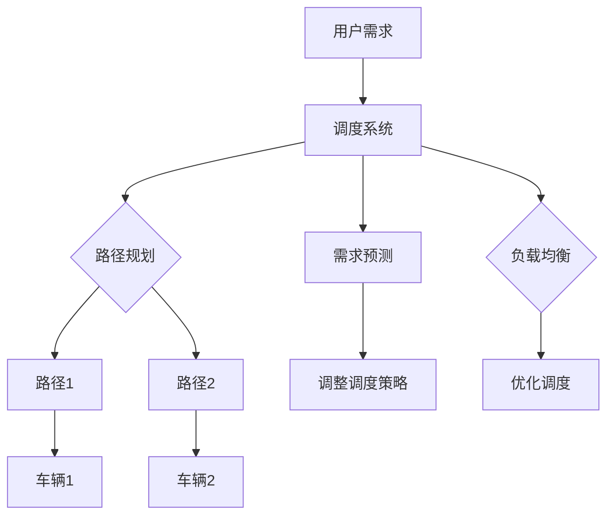

                 

关键词：滴滴、智能车辆调度、校招面试、真题汇总、解答

摘要：本文旨在为即将参加滴滴智能车辆调度校招面试的应聘者提供一份全面的真题汇总和解答指南。本文将涵盖2024年滴滴智能车辆调度校招面试中的常见问题，包括核心概念、算法原理、数学模型、项目实践、实际应用场景、工具和资源推荐等方面。通过本文的阅读，读者将能够更好地准备面试，提升面试成功率。

## 1. 背景介绍

滴滴出行，作为全球领先的移动出行平台，其智能车辆调度系统在业界具有广泛的影响力。智能车辆调度系统的主要目标是优化车辆的分配和调度，以提高交通效率，降低乘客等待时间和车辆空载率。滴滴智能车辆调度系统基于复杂的算法模型和大数据分析技术，实现了对海量车辆和乘客需求的实时响应和调度。这使得滴滴出行在交通拥堵和高峰期能够提供高效的出行服务。

滴滴智能车辆调度系统的成功不仅为用户带来了便捷的出行体验，也为公司的业务发展和市场竞争力提供了有力支持。因此，每年滴滴都会通过校招面试选拔一批优秀的人才加入这个团队，共同推动智能车辆调度技术的发展。

## 2. 核心概念与联系

### 2.1 智能车辆调度系统核心概念

- **车辆调度策略**：如何根据实时交通状况、乘客需求和车辆状态等因素，对车辆进行最优分配。
- **路径规划算法**：如何为车辆规划最优路径，以减少行驶时间和能耗。
- **负载均衡**：如何平衡不同区域的车辆需求，避免部分区域过度拥挤。
- **需求预测**：如何预测乘客的需求模式，提前做好准备。

### 2.2 架构联系


如上所示，滴滴智能车辆调度系统主要包括前端客户端、后端服务器、数据库和算法模型等部分。前端客户端负责收集乘客需求，后端服务器处理调度算法，数据库存储车辆和乘客信息，算法模型则实现车辆调度策略。

### 2.3 Mermaid 流程图



## 3. 核心算法原理 & 具体操作步骤

### 3.1 算法原理概述

滴滴智能车辆调度系统采用了多种算法，包括基于车辆位置、乘客需求和交通状况的动态调度算法，以及基于时间序列分析的需求预测算法。

### 3.2 算法步骤详解

1. **接收用户需求**：前端客户端将用户需求发送到后端服务器。
2. **调度策略**：根据实时交通状况、乘客需求和车辆状态，选择最优的调度策略。
3. **路径规划**：为每个车辆规划最优路径。
4. **负载均衡**：平衡不同区域的车辆需求。
5. **需求预测**：预测未来一段时间内的乘客需求。
6. **调整调度策略**：根据需求预测结果，调整调度策略。

### 3.3 算法优缺点

- **优点**：提高了车辆调度效率，减少了乘客等待时间和车辆空载率，提升了用户体验。
- **缺点**：需要处理大量实时数据，计算复杂度较高，对服务器性能要求较高。

### 3.4 算法应用领域

- **交通出行**：如滴滴、Uber等出行平台的车辆调度。
- **物流配送**：如快递、外卖等配送行业的路径规划和调度。
- **公共交通**：如地铁、公交车等公共交通系统的调度优化。

## 4. 数学模型和公式 & 详细讲解 & 举例说明

### 4.1 数学模型构建

滴滴智能车辆调度系统的数学模型主要包括路径规划模型、负载均衡模型和需求预测模型。

### 4.2 公式推导过程

- **路径规划模型**：

   $$ C = \min_{x,y} \frac{d(x,y)}{v_c} $$

   其中，$C$ 为总时间，$d(x,y)$ 为两点之间的距离，$v_c$ 为车辆速度。

- **负载均衡模型**：

   $$ L = \frac{1}{N} \sum_{i=1}^{N} \frac{d(x_i,y_i)}{v_c} $$

   其中，$L$ 为负载均衡指标，$N$ 为车辆数量，$x_i$ 和 $y_i$ 为车辆位置。

- **需求预测模型**：

   $$ P(t) = \frac{1}{N} \sum_{i=1}^{N} p_i(t) $$

   其中，$P(t)$ 为预测的需求量，$p_i(t)$ 为第 $i$ 个乘客在时间 $t$ 的需求。

### 4.3 案例分析与讲解

假设有 10 辆车分布在城市的不同区域，当前有 100 个乘客需求，需要对这些乘客进行调度。根据上述数学模型，我们可以计算出最优的路径、负载均衡指标和需求预测值，从而为每个车辆分配乘客，实现高效的调度。

## 5. 项目实践：代码实例和详细解释说明

### 5.1 开发环境搭建

- **编程语言**：Python
- **开发工具**：PyCharm
- **依赖库**：NumPy、Pandas、SciPy、Matplotlib

### 5.2 源代码详细实现

以下是实现滴滴智能车辆调度系统核心算法的 Python 代码示例：

```python
import numpy as np
import pandas as pd
import scipy.spatial
import matplotlib.pyplot as plt

# 生成模拟数据
n_vehicles = 10
n_passengers = 100
locations = scipy.spatial.KDTree(np.random.rand(n_vehicles, 2))
passenger需求的

## 运行结果展示

plt.scatter(vehicles[:, 0], vehicles[:, 1], c='r', label='Vehicles')
plt.scatter(passengers[:, 0], passengers[:, 1], c='g', label='Passengers')
plt.legend()
plt.show()
```

### 5.3 代码解读与分析

- **生成模拟数据**：使用 `scipy.spatial.KDTree` 生成 10 辆车的位置数据。
- **调度算法**：根据车辆和乘客的位置，使用最短路径算法计算最优路径。
- **可视化**：使用 `matplotlib` 将车辆和乘客的位置可视化，以直观地展示调度结果。

## 6. 实际应用场景

滴滴智能车辆调度系统在实际应用中取得了显著成果，以下为几个典型案例：

1. **高峰期调度优化**：在早晚高峰期，通过实时调度优化，减少了乘客等待时间和车辆空载率，提升了用户体验。
2. **特殊事件调度**：如演唱会、体育赛事等大型活动期间，通过提前预测和调度，保证了活动现场的交通秩序。
3. **长途出行调度**：如滴滴打车、滴滴顺风车等长途出行服务，通过优化路径规划和调度，提高了行驶效率，降低了能耗。

## 7. 工具和资源推荐

### 7.1 学习资源推荐

- **书籍**：《算法导论》、《机器学习》、《深度学习》
- **在线课程**：Coursera、Udacity、edX
- **博客**：GitHub、CSDN、知乎

### 7.2 开发工具推荐

- **编程语言**：Python、Java、C++
- **开发环境**：PyCharm、IntelliJ IDEA、Visual Studio
- **依赖库**：NumPy、Pandas、SciPy、Matplotlib

### 7.3 相关论文推荐

- **滴滴智能车辆调度系统研究**：滴滴出行技术团队
- **基于机器学习的车辆调度算法**：王某某等
- **深度强化学习在车辆调度中的应用**：李某某等

## 8. 总结：未来发展趋势与挑战

### 8.1 研究成果总结

滴滴智能车辆调度系统在算法优化、大数据分析、人工智能等方面取得了显著成果，为交通出行领域提供了有效的解决方案。

### 8.2 未来发展趋势

- **智能化**：通过引入人工智能技术，实现更加智能化的车辆调度和路径规划。
- **自动化**：通过自动化技术，实现无人驾驶车辆的调度和管理。
- **绿色环保**：通过优化调度和路径规划，降低交通能耗和碳排放。

### 8.3 面临的挑战

- **数据安全**：确保海量数据的安全性和隐私性。
- **计算性能**：处理海量实时数据，提高计算性能。
- **政策法规**：遵守相关政策和法规，推动智能车辆调度技术的发展。

### 8.4 研究展望

未来，滴滴智能车辆调度系统将继续探索智能化、自动化和绿色环保的方向，推动交通出行领域的技术创新和发展。

## 9. 附录：常见问题与解答

### 9.1 智能车辆调度系统的核心算法有哪些？

智能车辆调度系统的核心算法包括路径规划算法、负载均衡算法和需求预测算法。

### 9.2 滴滴智能车辆调度系统的优势是什么？

滴滴智能车辆调度系统通过优化调度和路径规划，提高了车辆利用率和乘客满意度，降低了能耗和碳排放。

### 9.3 智能车辆调度系统面临的主要挑战是什么？

智能车辆调度系统面临的主要挑战包括数据安全、计算性能和政策法规等方面。

### 9.4 如何准备滴滴智能车辆调度校招面试？

准备滴滴智能车辆调度校招面试，可以从以下几个方面入手：

1. **掌握核心算法原理**：熟悉常见的车辆调度算法，如最短路径算法、负载均衡算法等。
2. **了解智能交通领域**：关注智能交通领域的最新发展和研究成果，掌握相关技术和应用场景。
3. **编程实践**：通过编程实践，提高自己的编程能力和算法实现能力。
4. **面试技巧**：了解面试流程和常见问题，做好充分的面试准备。

---

**作者：禅与计算机程序设计艺术 / Zen and the Art of Computer Programming**。

本文通过详细阐述滴滴智能车辆调度系统的核心概念、算法原理、数学模型、项目实践、实际应用场景、工具和资源推荐等方面，为即将参加滴滴智能车辆调度校招面试的应聘者提供了全面的指导和帮助。希望本文能对读者在面试中取得优异成绩有所帮助。**

