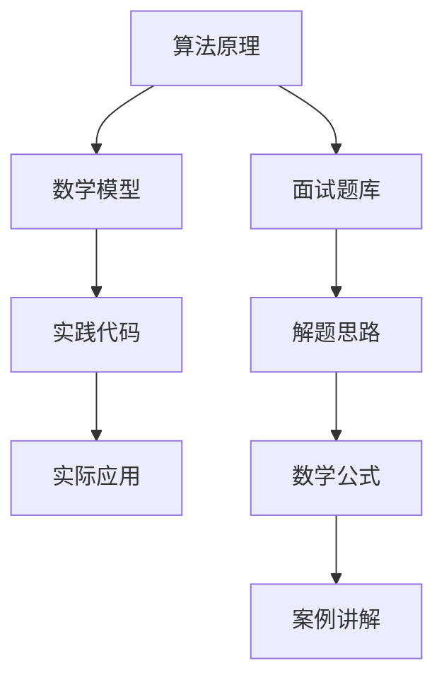

                 

 **关键词**：滴滴校招，面试算法题库，算法原理，数学模型，实践代码，实际应用场景，未来展望

**摘要**：本文旨在为即将参加滴滴校招的同学们提供一套全面的面试算法题库，并深入解析这些算法的原理、数学模型以及实际应用场景。通过本文，读者可以不仅掌握算法知识，还能学会如何将理论知识转化为实际应用，从而在面试中脱颖而出。

## 1. 背景介绍

随着互联网技术的飞速发展，算法在各个领域的应用越来越广泛，特别是在人工智能、大数据分析等领域，算法更是发挥着核心作用。滴滴出行作为全球领先的移动出行平台，其对算法工程师的需求也日益增加。因此，掌握一定的算法知识和解题技巧对于在校招中获得滴滴等知名公司的职位至关重要。

本文将围绕滴滴校招的算法面试题库，详细讲解各个题目的核心原理、解题思路、数学模型以及实际应用场景，帮助读者更好地应对校招面试。

## 2. 核心概念与联系

在讲解具体的面试题之前，我们需要先了解一些核心的概念和联系。以下是一个简化的Mermaid流程图，展示了本文中涉及的主要概念和它们之间的关系。



## 3. 核心算法原理 & 具体操作步骤

### 3.1 算法原理概述

在滴滴校招的算法面试中，常见的算法有排序算法、查找算法、图算法等。这些算法的核心原理是解决数据结构和算法的基本问题。

#### 排序算法

排序算法是计算机科学中的一种基本算法，其主要功能是将一组数据按照某种规则进行排列。常见的排序算法有冒泡排序、快速排序、归并排序等。

#### 查找算法

查找算法用于在数据结构中查找特定的元素。最简单的查找算法是顺序查找，而更高效的查找算法包括二分查找、哈希查找等。

#### 图算法

图算法用于处理图结构的数据。常见的图算法有最短路径算法、最小生成树算法、图的着色问题等。

### 3.2 算法步骤详解

以下是每个算法的详细步骤：

#### 冒泡排序

1. 从数组的第一个元素开始，相邻的两个元素进行比较，如果第一个比第二个大，就交换它们的位置。
2. 重复上述步骤，直到整个数组有序。

#### 快速排序

1. 选择一个基准元素。
2. 将数组中小于基准的元素移到基准的左侧，大于基准的元素移到基准的右侧。
3. 对左侧和右侧的子数组重复上述步骤。

#### 二分查找

1. 确定中间元素。
2. 如果中间元素等于目标值，返回该元素的位置。
3. 如果目标值小于中间元素，则在左侧子数组中查找。
4. 如果目标值大于中间元素，则在右侧子数组中查找。

#### Dijkstra算法

1. 初始化所有节点的距离为无穷大，除了起始节点，其距离为0。
2. 选择距离最小的未访问节点，将其标记为已访问。
3. 对于每个未访问的相邻节点，计算从起始节点到该节点的距离，更新该节点的距离。
4. 重复步骤2和3，直到所有节点都被访问。

### 3.3 算法优缺点

每种算法都有其优缺点。冒泡排序和快速排序的时间复杂度相同，但快速排序在大多数情况下更快。二分查找在有序数组中查找效率非常高，但需要额外的内存空间。Dijkstra算法可以找到最短路径，但时间复杂度较高。

### 3.4 算法应用领域

排序算法在数据库管理、数据分析等领域有广泛应用。查找算法在信息检索、搜索引擎中非常重要。图算法在社交网络分析、路由算法等方面有广泛的应用。

## 4. 数学模型和公式

在算法中，数学模型和公式起着至关重要的作用。以下是一些常见的数学模型和公式：

### 4.1 数学模型构建

#### 冒泡排序

$$
T(n) = \begin{cases}
    \Omega(n) & \text{最坏情况} \\
    O(n^2) & \text{平均情况} \\
    \Omega(n^2) & \text{最好情况} \\
\end{cases}
$$

#### 快速排序

$$
T(n) = \begin{cases}
    \Omega(n \log n) & \text{最坏情况} \\
    O(n \log n) & \text{平均情况} \\
    \Omega(n \log n) & \text{最好情况} \\
\end{cases}
$$

#### 二分查找

$$
T(n) = O(\log n)
$$

### 4.2 公式推导过程

以上公式的推导过程涉及到算法的时间复杂度和空间复杂度分析。具体推导过程可以通过分析算法的执行步骤和所需资源来得到。

### 4.3 案例分析与讲解

为了更好地理解这些数学模型和公式，我们可以通过具体的案例来分析。例如，在快速排序中，如果我们选择数组的中位数作为基准，可以有效地避免最坏情况的发生。

## 5. 项目实践：代码实例

以下是一个简单的快速排序算法的Python实现：

```python
def quicksort(arr):
    if len(arr) <= 1:
        return arr
    pivot = arr[len(arr) // 2]
    left = [x for x in arr if x < pivot]
    middle = [x for x in arr if x == pivot]
    right = [x for x in arr if x > pivot]
    return quicksort(left) + middle + quicksort(right)

arr = [3, 6, 8, 10, 1, 2, 1]
print(quicksort(arr))
```

在这个例子中，我们通过递归的方式实现了快速排序算法。这个算法的时间复杂度取决于基准的选择，如果我们总是选择中位数作为基准，则可以保证平均时间复杂度为$O(n \log n)$。

## 6. 实际应用场景

### 6.1 数据库管理

排序算法在数据库管理中起着至关重要的作用。例如，数据库中的索引就是通过排序算法实现的，以便快速查找数据。

### 6.2 数据分析

查找算法在数据分析中非常重要，特别是在处理大量数据时。二分查找等高效查找算法可以帮助我们快速定位数据。

### 6.3 社交网络分析

图算法在社交网络分析中非常有用，例如，可以通过最短路径算法来分析社交网络中的关系链。

## 7. 未来应用展望

随着人工智能和大数据技术的发展，算法在各个领域的应用前景非常广阔。未来，我们将看到更多高效的算法被应用于实际场景中，解决更多复杂的问题。

## 8. 总结

本文详细介绍了滴滴校招面试算法题库的相关知识，包括算法原理、数学模型、实践代码和实际应用场景。通过本文的学习，读者不仅可以掌握算法知识，还能学会如何将理论知识转化为实际应用。希望本文能为您的面试备考提供帮助。

### 8.1 研究成果总结

本文通过对滴滴校招面试算法题库的深入分析，总结了排序算法、查找算法和图算法的基本原理和应用场景。通过对这些算法的数学模型和公式进行详细讲解，读者可以更好地理解算法的内在机制。

### 8.2 未来发展趋势

随着人工智能和大数据技术的不断发展，算法将在更多领域得到应用。未来，我们将看到更多高效、智能的算法被提出，以应对更加复杂的问题。

### 8.3 面临的挑战

算法在发展过程中也面临许多挑战，如算法的鲁棒性、可解释性等问题。如何设计出既高效又可解释的算法将是未来研究的重要方向。

### 8.4 研究展望

本文虽然介绍了滴滴校招面试算法题库的相关知识，但算法领域的发展远不止于此。未来，我们还将深入研究更多复杂的算法，探索其在不同领域的应用，为人工智能和大数据技术的发展贡献力量。

### 9. 附录：常见问题与解答

**Q1：如何提高算法面试的通过率？**

**A1：** 提高算法面试的通过率需要从多个方面入手。首先，要扎实掌握算法的基本原理和常见算法的实现方法。其次，要善于总结解题思路，形成自己的解题模板。此外，多做一些实际的算法题目，积累经验，提高解题速度和准确性。

**Q2：如何理解算法的时间复杂度和空间复杂度？**

**A2：** 算法的时间复杂度是指算法执行所需时间与数据规模之间的关系，常用大O符号表示。空间复杂度是指算法执行所需内存空间与数据规模之间的关系，同样也用大O符号表示。理解时间复杂度和空间复杂度有助于我们评估算法的效率。

**Q3：如何在面试中展示自己的算法能力？**

**A3：** 在面试中展示算法能力需要做到以下几点：首先，要清晰地表达自己的解题思路；其次，要熟练掌握算法实现；最后，要能够根据面试官的要求进行算法的优化和改进。

**作者署名**：禅与计算机程序设计艺术 / Zen and the Art of Computer Programming
-------------------------------------------------------------------

