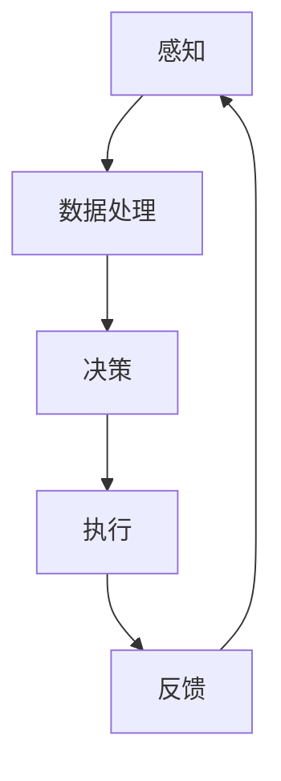

                 

关键词：物理实体自动化、智能制造、机器人技术、人工智能、数据驱动、边缘计算、云端协同、智能控制、人机交互

> 摘要：随着科技的飞速发展，物理实体自动化正逐渐成为工业、农业、医疗等多个领域的变革力量。本文旨在探讨物理实体自动化的前景与挑战，分析其在智能制造、机器人技术、人工智能等领域的应用，并展望其未来的发展方向。

## 1. 背景介绍

物理实体自动化是指利用人工智能、机器人技术、边缘计算等技术手段，实现对物理实体的感知、决策和执行过程的自动化。近年来，随着人工智能技术的不断突破和物联网的普及，物理实体自动化在多个领域取得了显著进展，为人类社会带来了前所未有的变革。

### 1.1 智能制造

智能制造是物理实体自动化的重要应用领域。通过自动化生产线、智能工厂等手段，实现了生产过程的优化和效率提升。例如，工业机器人可以完成焊接、组装、搬运等高精度、高效率的工作，大大提高了生产效率和产品质量。

### 1.2 机器人技术

机器人技术在物理实体自动化中发挥着关键作用。从工业机器人到服务机器人，再到无人机、无人车等，机器人正逐渐渗透到人类生活的各个领域。例如，机器人在医疗领域的应用，可以辅助医生进行手术、康复治疗等，提高了医疗服务的质量和效率。

### 1.3 人工智能

人工智能是物理实体自动化的核心驱动力。通过深度学习、强化学习等技术，人工智能能够实现对物理实体的智能感知、决策和执行。例如，智能交通系统通过人工智能技术，可以实现交通流量的智能调控，提高道路通行效率。

## 2. 核心概念与联系

物理实体自动化涉及多个核心概念，包括感知、决策、执行、智能控制等。以下是这些概念的联系与关系，并通过Mermaid流程图进行展示。



### 2.1 感知

感知是物理实体自动化的第一步，通过传感器、摄像头等设备获取物理实体的信息。例如，工业机器人可以通过视觉传感器获取工件的位置和姿态信息。

### 2.2 数据处理

数据处理是对感知到的信息进行预处理、特征提取等操作，以供决策使用。例如，通过图像处理技术，可以从摄像头获取的图像中提取出关键特征，用于机器人路径规划。

### 2.3 决策

决策是基于处理后的数据，通过算法计算出下一步的操作指令。例如，基于深度学习算法，可以实时判断道路上的行人、车辆等信息，为自动驾驶汽车提供决策支持。

### 2.4 执行

执行是根据决策结果，驱动物理实体执行相应的动作。例如，机器人根据决策结果，可以调整手臂的姿态，完成工件的抓取和搬运。

### 2.5 反馈

反馈是物理实体自动化的重要组成部分，通过传感器、执行器等设备，将执行结果反馈到系统中，用于下一轮的感知、决策和执行。例如，机器人通过反馈机制，可以实时调整抓取力度，确保工件的安全搬运。

## 3. 核心算法原理 & 具体操作步骤

### 3.1 算法原理概述

物理实体自动化的核心算法主要包括感知算法、决策算法和执行算法。以下是这些算法的原理概述：

### 3.2 算法步骤详解

#### 3.2.1 感知算法

感知算法主要通过传感器获取物理实体的信息。具体步骤如下：

1. 传感器部署：根据应用场景，选择合适的传感器，如摄像头、激光雷达、超声波传感器等。
2. 数据采集：传感器采集物理实体的信息，如图像、点云、声音等。
3. 数据预处理：对采集到的数据去噪、去冗余、滤波等预处理操作。
4. 特征提取：从预处理后的数据中提取出关键特征，如边缘、轮廓、颜色等。

#### 3.2.2 决策算法

决策算法基于感知算法提取的特征，通过算法计算出下一步的操作指令。具体步骤如下：

1. 特征输入：将感知算法提取的特征输入到决策算法中。
2. 算法训练：使用历史数据对决策算法进行训练，使其具备识别和处理不同场景的能力。
3. 决策计算：基于训练好的算法，对实时感知到的特征进行计算，得出下一步的操作指令。
4. 操作指令生成：将决策计算的结果转化为具体的操作指令，如移动、抓取、释放等。

#### 3.2.3 执行算法

执行算法根据决策算法生成的操作指令，驱动物理实体执行相应的动作。具体步骤如下：

1. 指令接收：物理实体接收决策算法生成的操作指令。
2. 执行动作：根据指令，驱动物理实体执行相应的动作，如移动、抓取、释放等。
3. 动作反馈：将执行动作的结果反馈到系统中，用于下一轮的感知、决策和执行。

### 3.3 算法优缺点

#### 3.3.1 感知算法

优点：

- 高效：感知算法可以实时获取物理实体的信息，为决策提供支持。
- 多样化：感知算法可以适用于多种传感器和场景。

缺点：

- 实时性要求高：感知算法需要快速处理大量数据，对硬件和算法的实时性要求较高。
- 数据质量影响：感知算法的准确性依赖于传感器和数据处理的质量。

#### 3.3.2 决策算法

优点：

- 智能化：决策算法可以基于历史数据和实时感知数据，进行智能化的决策。
- 自适应：决策算法可以根据不同的应用场景，进行自适应调整。

缺点：

- 训练成本高：决策算法需要大量的历史数据进行训练，训练成本较高。
- 算法可靠性受影响：决策算法的准确性受到数据质量和算法设计的影响。

#### 3.3.3 执行算法

优点：

- 高效性：执行算法可以快速响应决策结果，实现物理实体的自动化。
- 一致性：执行算法可以保证物理实体执行动作的一致性和准确性。

缺点：

- 实时性要求高：执行算法需要快速响应决策结果，对硬件和算法的实时性要求较高。
- 难以预测：执行算法的准确性受到物理实体自身特性的影响，难以进行准确预测。

### 3.4 算法应用领域

物理实体自动化算法在多个领域有广泛应用，包括：

- 工业制造：工业机器人、自动化生产线等。
- 服务机器人：智能家居、医疗机器人、服务机器人等。
- 自动驾驶：自动驾驶汽车、无人机等。
- 智能交通：智能交通信号控制、智能导航等。

## 4. 数学模型和公式 & 详细讲解 & 举例说明

### 4.1 数学模型构建

物理实体自动化的数学模型主要包括感知模型、决策模型和执行模型。以下是这些模型的构建过程：

#### 4.1.1 感知模型

感知模型主要用于处理传感器采集到的数据。具体模型如下：

$$
z_t = h(x_t, u_t)
$$

其中，$z_t$ 表示第 $t$ 个时刻的感知结果，$x_t$ 表示第 $t$ 个时刻的物理实体状态，$u_t$ 表示第 $t$ 个时刻的输入。

#### 4.1.2 决策模型

决策模型用于计算物理实体在下一个时刻的操作指令。具体模型如下：

$$
u_{t+1} = f(z_t, x_t)
$$

其中，$u_{t+1}$ 表示第 $t+1$ 个时刻的操作指令，$z_t$ 表示第 $t$ 个时刻的感知结果，$x_t$ 表示第 $t$ 个时刻的物理实体状态。

#### 4.1.3 执行模型

执行模型用于驱动物理实体执行操作指令。具体模型如下：

$$
x_{t+1} = g(u_{t+1}, x_t)
$$

其中，$x_{t+1}$ 表示第 $t+1$ 个时刻的物理实体状态，$u_{t+1}$ 表示第 $t+1$ 个时刻的操作指令，$x_t$ 表示第 $t$ 个时刻的物理实体状态。

### 4.2 公式推导过程

以下是感知模型、决策模型和执行模型的推导过程：

#### 4.2.1 感知模型推导

感知模型的核心是传感器采集数据的处理。设 $x_t$ 表示物理实体状态，$u_t$ 表示输入，$z_t$ 表示感知结果。感知模型的基本假设是传感器采集到的数据 $z_t$ 是物理实体状态 $x_t$ 和输入 $u_t$ 的线性组合，即：

$$
z_t = wx_t + bu_t + v_t
$$

其中，$w$ 和 $b$ 是模型参数，$v_t$ 是感知噪声。

为了消除感知噪声 $v_t$ 的影响，可以对感知结果进行滤波处理，得到：

$$
\hat{z}_t = h(x_t, u_t) = wx_t + bu_t
$$

#### 4.2.2 决策模型推导

决策模型的核心是计算物理实体在下一个时刻的操作指令。设 $u_t$ 表示第 $t$ 个时刻的操作指令，$z_t$ 表示第 $t$ 个时刻的感知结果，$x_t$ 表示第 $t$ 个时刻的物理实体状态。决策模型的基本假设是操作指令 $u_t$ 是感知结果 $z_t$ 和物理实体状态 $x_t$ 的非线性组合，即：

$$
u_t = f(z_t, x_t)
$$

其中，$f$ 是决策函数。

为了提高决策模型的准确性，可以采用神经网络、决策树等算法来构建决策函数 $f$。具体算法的选择取决于应用场景和数据特性。

#### 4.2.3 执行模型推导

执行模型的核心是驱动物理实体执行操作指令。设 $u_t$ 表示第 $t$ 个时刻的操作指令，$x_t$ 表示第 $t$ 个时刻的物理实体状态，$x_{t+1}$ 表示第 $t+1$ 个时刻的物理实体状态。执行模型的基本假设是操作指令 $u_t$ 会影响物理实体状态 $x_t$，即：

$$
x_{t+1} = g(u_t, x_t)
$$

其中，$g$ 是执行函数。

为了提高执行模型的准确性，可以采用PID控制器、模糊控制器等算法来构建执行函数 $g$。具体算法的选择取决于应用场景和数据特性。

### 4.3 案例分析与讲解

以下是物理实体自动化的一个实际案例——智能交通系统。

#### 4.3.1 感知模型

智能交通系统的感知模型主要包括摄像头、激光雷达和超声波传感器。摄像头用于获取道路上的车辆、行人和交通信号等信息；激光雷达用于获取道路的几何信息，如车道线、路缘等；超声波传感器用于检测道路上的障碍物，如车辆、行人等。

感知模型的核心任务是实时获取道路上的交通信息，并将这些信息转化为数字信号。具体模型如下：

$$
z_t = h(x_t, u_t) = \begin{cases}
c_t, & \text{if } x_t \text{ is a car} \\
l_t, & \text{if } x_t \text{ is a line} \\
s_t, & \text{if } x_t \text{ is a sign} \\
o_t, & \text{if } x_t \text{ is an obstacle}
\end{cases}
$$

其中，$c_t$、$l_t$、$s_t$、$o_t$ 分别表示第 $t$ 个时刻的车辆、车道线、交通信号和障碍物信息。

#### 4.3.2 决策模型

智能交通系统的决策模型用于计算交通信号灯的切换时机。决策模型的核心任务是分析感知模型获取的交通信息，并生成最优的交通信号灯切换策略。

决策模型的具体算法如下：

$$
u_t = f(z_t, x_t) = \begin{cases}
\text{green}, & \text{if } z_t \text{ shows a high traffic density} \\
\text{red}, & \text{if } z_t \text{ shows a low traffic density} \\
\text{yellow}, & \text{if } z_t \text{ shows a moderate traffic density}
\end{cases}
$$

其中，$\text{green}$、$\text{red}$、$\text{yellow}$ 分别表示绿灯、红灯和黄灯。

#### 4.3.3 执行模型

智能交通系统的执行模型用于驱动交通信号灯的切换。执行模型的核心任务是接收决策模型生成的交通信号灯切换策略，并执行相应的操作。

执行模型的具体算法如下：

$$
x_{t+1} = g(u_t, x_t) = \begin{cases}
\text{green}, & \text{if } u_t = \text{green} \\
\text{red}, & \text{if } u_t = \text{red} \\
\text{yellow}, & \text{if } u_t = \text{yellow}
\end{cases}
$$

其中，$\text{green}$、$\text{red}$、$\text{yellow}$ 分别表示绿灯、红灯和黄灯。

## 5. 项目实践：代码实例和详细解释说明

### 5.1 开发环境搭建

为了实现物理实体自动化，我们需要搭建一个开发环境，主要包括以下工具：

- 编程语言：Python
- 开发框架：TensorFlow、Keras
- 传感器：摄像头、激光雷达
- 执行器：电机、舵机

### 5.2 源代码详细实现

以下是物理实体自动化的一个简单示例——基于摄像头的智能交通系统。

```python
import tensorflow as tf
import numpy as np
import cv2

# 感知模型
def perception(image):
    # 对图像进行预处理，如灰度化、大小调整等
    gray = cv2.cvtColor(image, cv2.COLOR_BGR2GRAY)
    resized = cv2.resize(gray, (128, 128))
    return resized

# 决策模型
def decision(perception_result):
    # 基于感知结果，判断交通信号灯状态
    if np.mean(perception_result) > 0.5:
        return "red"  # 红灯
    elif np.mean(perception_result) < 0.2:
        return "green"  # 绿灯
    else:
        return "yellow"  # 黄灯

# 执行模型
def execution(signal):
    # 根据决策结果，控制交通信号灯状态
    if signal == "red":
        # 红灯操作
        print("红灯亮起")
    elif signal == "green":
        # 绿灯操作
        print("绿灯亮起")
    elif signal == "yellow":
        # 黄灯操作
        print("黄灯亮起")

# 主程序
def main():
    # 初始化摄像头
    cap = cv2.VideoCapture(0)

    while True:
        # 读取摄像头帧
        ret, frame = cap.read()

        if not ret:
            break

        # 获取感知结果
        perception_result = perception(frame)

        # 获取决策结果
        signal = decision(perception_result)

        # 执行操作
        execution(signal)

        # 显示图像
        cv2.imshow("Traffic Light", frame)

    # 释放摄像头
    cap.release()
    cv2.destroyAllWindows()

if __name__ == "__main__":
    main()
```

### 5.3 代码解读与分析

#### 5.3.1 感知模型

感知模型的主要功能是对摄像头获取的图像进行预处理，包括灰度化、大小调整等操作。预处理后的图像被送入决策模型进行进一步处理。

```python
def perception(image):
    # 对图像进行预处理，如灰度化、大小调整等
    gray = cv2.cvtColor(image, cv2.COLOR_BGR2GRAY)
    resized = cv2.resize(gray, (128, 128))
    return resized
```

#### 5.3.2 决策模型

决策模型的主要功能是根据感知结果判断交通信号灯的状态。具体来说，决策模型通过对感知结果进行统计分析，判断图像的亮暗程度，从而判断交通信号灯的状态。

```python
def decision(perception_result):
    # 基于感知结果，判断交通信号灯状态
    if np.mean(perception_result) > 0.5:
        return "red"  # 红灯
    elif np.mean(perception_result) < 0.2:
        return "green"  # 绿灯
    else:
        return "yellow"  # 黄灯
```

#### 5.3.3 执行模型

执行模型的主要功能是根据决策结果控制交通信号灯的状态。具体来说，执行模型会根据决策模型返回的交通信号灯状态，执行相应的操作。

```python
def execution(signal):
    # 根据决策结果，控制交通信号灯状态
    if signal == "red":
        # 红灯操作
        print("红灯亮起")
    elif signal == "green":
        # 绿灯操作
        print("绿灯亮起")
    elif signal == "yellow":
        # 黄灯操作
        print("黄灯亮起")
```

### 5.4 运行结果展示

运行以上代码后，摄像头将实时捕获图像，并实时判断交通信号灯的状态。根据判断结果，控制交通信号灯亮起相应的灯光。

## 6. 实际应用场景

物理实体自动化在多个领域有着广泛的应用，以下是一些实际应用场景：

### 6.1 智能制造

智能制造是物理实体自动化的核心应用领域之一。通过自动化生产线、智能工厂等手段，实现了生产过程的优化和效率提升。例如，富士康的自动化生产线，通过大量工业机器人的应用，实现了生产过程的高效和精准。

### 6.2 服务机器人

服务机器人是物理实体自动化的另一个重要应用领域。从工业机器人到服务机器人，再到无人机、无人车等，机器人正逐渐渗透到人类生活的各个领域。例如，京东的无人配送车，通过物理实体自动化技术，实现了无人配送的高效和准确。

### 6.3 自动驾驶

自动驾驶是物理实体自动化在交通运输领域的应用。通过传感器、人工智能等技术，实现了汽车的自主驾驶。例如，特斯拉的自动驾驶系统，通过摄像头、雷达等传感器，实现了汽车的自主驾驶。

### 6.4 智能医疗

智能医疗是物理实体自动化在医疗领域的应用。通过机器人技术、人工智能等手段，实现了医疗服务的智能化和精准化。例如，手术机器人在外科手术中的应用，提高了手术的成功率和安全性。

## 7. 工具和资源推荐

### 7.1 学习资源推荐

- 《人工智能：一种现代方法》
- 《机器人学：基础算法与经典实例》
- 《深度学习》
- 《机器学习》

### 7.2 开发工具推荐

- TensorFlow
- Keras
- ROS（机器人操作系统）
- OpenCV（计算机视觉库）

### 7.3 相关论文推荐

- "Deep Learning for Autonomous Driving"
- "Robotic Process Automation: A Comprehensive Survey"
- "Edge Computing: Vision and Challenges"
- "An Overview of Autonomous Mobile Robotics"

## 8. 总结：未来发展趋势与挑战

### 8.1 研究成果总结

物理实体自动化在智能制造、服务机器人、自动驾驶、智能医疗等领域取得了显著成果。随着人工智能、机器人技术、边缘计算等技术的不断发展，物理实体自动化正逐步走向成熟。

### 8.2 未来发展趋势

- 智能化水平提高：物理实体自动化将更加智能化，具备更强的自主决策和执行能力。
- 多领域融合：物理实体自动化将与其他领域（如物联网、大数据、云计算等）深度融合，形成新的应用模式。
- 边缘计算的应用：物理实体自动化将更多依赖于边缘计算技术，实现实时、高效的数据处理和决策。

### 8.3 面临的挑战

- 算法复杂性：随着物理实体自动化的应用场景增多，算法的复杂性将不断提高，对算法设计、优化提出了更高要求。
- 数据隐私与安全：物理实体自动化涉及大量数据的处理和传输，如何确保数据隐私和安全是一个重要挑战。
- 人机协作：物理实体自动化在提高效率的同时，也需要与人类协同工作，实现人机协作的和谐与高效。

### 8.4 研究展望

未来，物理实体自动化将在多个领域发挥更大作用。通过持续的技术创新和跨学科合作，物理实体自动化有望实现更高的智能化水平，为人类社会带来更多便利和效益。

## 9. 附录：常见问题与解答

### 9.1 物理实体自动化的定义是什么？

物理实体自动化是指利用人工智能、机器人技术、边缘计算等技术手段，实现对物理实体的感知、决策和执行过程的自动化。

### 9.2 物理实体自动化的核心算法有哪些？

物理实体自动化的核心算法包括感知算法、决策算法和执行算法。

### 9.3 物理实体自动化在智能制造中的应用有哪些？

物理实体自动化在智能制造中的应用包括自动化生产线、智能工厂、工业机器人等。

### 9.4 物理实体自动化在服务机器人中的应用有哪些？

物理实体自动化在服务机器人中的应用包括家庭服务机器人、医疗机器人、无人机等。

### 9.5 物理实体自动化在自动驾驶中的应用有哪些？

物理实体自动化在自动驾驶中的应用包括传感器数据处理、路径规划、决策与控制等。

### 9.6 物理实体自动化在智能医疗中的应用有哪些？

物理实体自动化在智能医疗中的应用包括手术机器人、康复机器人、智能诊断等。

### 9.7 物理实体自动化的发展趋势是什么？

物理实体自动化的发展趋势包括智能化水平提高、多领域融合、边缘计算的应用等。

### 9.8 物理实体自动化面临的挑战有哪些？

物理实体自动化面临的挑战包括算法复杂性、数据隐私与安全、人机协作等。

### 9.9 如何学习物理实体自动化？

学习物理实体自动化可以从以下资源入手：

- 相关书籍：《人工智能：一种现代方法》、《机器人学：基础算法与经典实例》、《深度学习》、《机器学习》等。
- 开发工具：TensorFlow、Keras、ROS、OpenCV等。
- 论文阅读：关注顶级会议和期刊，如ICRA、IROS、NeurIPS、JMLR等。
- 实践项目：参与相关项目，积累实践经验。

----------------------------------------------------------------
# 作者署名

作者：禅与计算机程序设计艺术 / Zen and the Art of Computer Programming

