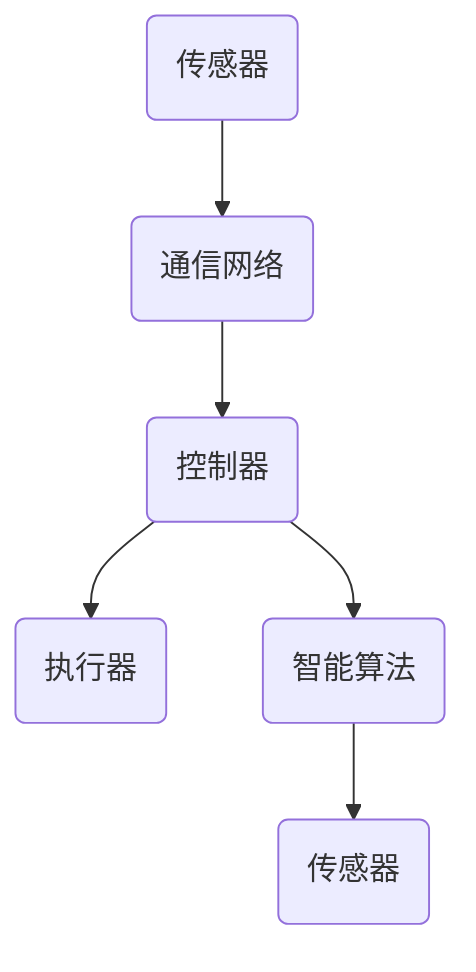

                 

关键词：物理实体自动化，机器人，物联网，人工智能，智能控制，自主系统

> 摘要：随着人工智能和物联网技术的快速发展，物理实体自动化成为现代科技的前沿领域。本文将探讨物理实体自动化的最新趋势，包括核心概念、算法原理、应用场景以及未来展望，旨在为读者提供一个全面的技术解读。

## 1. 背景介绍

物理实体自动化，即利用计算机技术和自动化控制技术实现物理实体的智能化控制。其核心目的是通过引入传感器、执行器、通信网络和智能算法，使物理实体具备自主感知环境、决策和执行任务的能力。随着人工智能技术的快速发展，物理实体自动化已经逐渐渗透到工业制造、医疗保健、交通运输、家庭服务等多个领域，成为推动社会生产力提升的重要力量。

### 1.1 物理实体自动化的历史与发展

物理实体自动化可以追溯到20世纪中叶。最初，物理实体自动化主要依赖于机械和电子控制技术，如自动化生产线、数控机床等。进入21世纪，随着计算机技术、传感器技术和通信技术的进步，物理实体自动化逐渐向智能化、自主化方向发展。特别是在物联网和人工智能技术的推动下，物理实体自动化进入了快速发展的新阶段。

### 1.2 物理实体自动化的现状与挑战

当前，物理实体自动化在许多领域已经取得了显著的应用成果，但仍面临诸多挑战。例如，在工业制造领域，尽管自动化生产线大幅提升了生产效率，但复杂的生产任务和不确定的环境因素仍然对自动化系统的稳定性提出了挑战。在医疗保健领域，物理实体自动化系统在辅助诊断和治疗方面展现了巨大潜力，但如何在保证患者安全的前提下实现高效准确的医疗服务，仍然是亟待解决的问题。此外，物理实体自动化在家庭服务、交通运输等领域也面临着类似的问题。

## 2. 核心概念与联系

### 2.1 物理实体自动化的核心概念

物理实体自动化涉及多个核心概念，包括传感器、执行器、通信网络、智能算法等。以下是这些概念的具体解释：

#### 传感器

传感器是物理实体自动化的感知器官，用于检测环境中的各种物理量，如温度、湿度、光照、压力等。通过传感器获取的数据，可以为自动化系统提供决策依据。

#### 执行器

执行器是物理实体自动化的执行器官，用于根据智能算法的决策结果，对外部环境进行相应的操作，如驱动电机、执行机械动作等。

#### 通信网络

通信网络是物理实体自动化系统的信息传输通道，用于实现传感器、执行器、控制器之间的数据交换和协调工作。常见的通信网络包括Wi-Fi、蓝牙、5G网络等。

#### 智能算法

智能算法是物理实体自动化的核心大脑，用于对传感器数据进行处理、分析和决策。常见的智能算法包括机器学习、深度学习、模糊控制等。

### 2.2 物理实体自动化的联系

物理实体自动化系统中的各个组成部分相互联系，共同实现自动化控制。以下是物理实体自动化的 Mermaid 流程图：



在这个流程图中，传感器通过通信网络将感知到的数据传输到控制器，控制器利用智能算法对数据进行处理和分析，生成决策结果，并通过执行器对外部环境进行相应的操作。

## 3. 核心算法原理 & 具体操作步骤

### 3.1 算法原理概述

物理实体自动化的核心算法主要包括机器学习、深度学习、模糊控制等。以下是这些算法的基本原理：

#### 机器学习

机器学习是一种通过数据训练模型，使模型具备预测和决策能力的方法。物理实体自动化系统中的机器学习算法通常用于预测传感器数据、优化执行器动作等。

#### 深度学习

深度学习是一种基于多层神经网络的学习方法，能够自动提取数据的特征表示。物理实体自动化系统中的深度学习算法通常用于复杂环境的感知、决策和执行。

#### 模糊控制

模糊控制是一种基于模糊逻辑的控制方法，适用于处理不确定性和非线性系统。物理实体自动化系统中的模糊控制算法通常用于机器人路径规划、机器人运动控制等。

### 3.2 算法步骤详解

以下是物理实体自动化算法的一般步骤：

1. 数据采集：通过传感器收集环境数据。

2. 数据预处理：对采集到的数据进行分析和处理，去除噪声、缺失值等。

3. 模型训练：使用机器学习、深度学习或模糊控制算法，对预处理后的数据进行训练，生成预测模型。

4. 决策生成：利用训练好的模型，对实时数据进行预测和决策。

5. 执行动作：根据决策结果，通过执行器进行相应的操作。

### 3.3 算法优缺点

#### 机器学习

优点：适用于处理大规模数据，能够自动提取数据特征。

缺点：对数据质量和数量要求较高，模型泛化能力有限。

#### 深度学习

优点：能够自动提取数据特征，适用于处理复杂环境。

缺点：对计算资源要求较高，模型训练过程较长。

#### 模糊控制

优点：适用于处理不确定性和非线性系统。

缺点：对系统建模要求较高，难以实现自适应调整。

### 3.4 算法应用领域

机器学习、深度学习和模糊控制算法在物理实体自动化领域具有广泛的应用。以下是一些具体的案例：

- 机器学习：用于工业自动化生产线的质量检测、机器人路径规划等。

- 深度学习：用于智能交通系统中的车辆检测、自动驾驶等。

- 模糊控制：用于机器人运动控制、无人机飞行控制等。

## 4. 数学模型和公式 & 详细讲解 & 举例说明

### 4.1 数学模型构建

物理实体自动化系统中的数学模型通常基于状态空间模型。状态空间模型描述了系统的状态变量和输入输出变量之间的关系。以下是状态空间模型的一般形式：

$$
\begin{cases}
\dot{x}(t) = f(x(t), u(t)) \\
y(t) = h(x(t), u(t))
\end{cases}
$$

其中，$x(t)$ 表示系统状态向量，$u(t)$ 表示系统输入向量，$y(t)$ 表示系统输出向量，$f(x(t), u(t))$ 和 $h(x(t), u(t))$ 分别表示状态方程和输出方程。

### 4.2 公式推导过程

以机器学习算法为例，假设我们使用线性回归模型来预测系统状态。线性回归模型的数学模型如下：

$$
y = \beta_0 + \beta_1 x_1 + \beta_2 x_2 + \cdots + \beta_n x_n + \epsilon
$$

其中，$y$ 表示预测值，$x_1, x_2, \ldots, x_n$ 表示输入特征，$\beta_0, \beta_1, \beta_2, \ldots, \beta_n$ 分别为模型的权重，$\epsilon$ 为误差项。

为了训练线性回归模型，我们需要最小化损失函数：

$$
J(\beta_0, \beta_1, \beta_2, \ldots, \beta_n) = \sum_{i=1}^{m} (y_i - (\beta_0 + \beta_1 x_{1i} + \beta_2 x_{2i} + \cdots + \beta_n x_{ni}))^2
$$

其中，$m$ 表示样本数量。

### 4.3 案例分析与讲解

假设我们有一个物理实体自动化系统，用于预测机器人路径上的障碍物。输入特征包括路径上的障碍物位置、速度和加速度等。我们使用线性回归模型来预测障碍物的位置。

首先，我们收集大量的路径数据，包括障碍物的位置、速度和加速度等。然后，我们将这些数据输入到线性回归模型中进行训练。通过最小化损失函数，我们得到最优的权重参数。

最后，我们使用训练好的模型来预测新的路径上的障碍物位置。假设我们有一个新的路径，我们输入路径上的障碍物特征，模型会输出预测的障碍物位置。

## 5. 项目实践：代码实例和详细解释说明

### 5.1 开发环境搭建

在本项目中，我们使用Python语言和相关的库（如NumPy、scikit-learn等）来构建物理实体自动化系统。以下是开发环境的搭建步骤：

1. 安装Python 3.8及以上版本。

2. 安装NumPy、scikit-learn等库。

```bash
pip install numpy scikit-learn
```

### 5.2 源代码详细实现

以下是物理实体自动化系统的源代码实现：

```python
import numpy as np
from sklearn.linear_model import LinearRegression

# 数据预处理
def preprocess_data(data):
    # 数据标准化
    data = (data - np.mean(data)) / np.std(data)
    return data

# 模型训练
def train_model(data):
    model = LinearRegression()
    model.fit(data[:, :-1], data[:, -1])
    return model

# 预测
def predict(model, feature):
    feature = preprocess_data(feature)
    prediction = model.predict(feature.reshape(1, -1))
    return prediction

# 主程序
if __name__ == "__main__":
    # 加载数据
    data = np.loadtxt("path_data.csv", delimiter=",")
    
    # 训练模型
    model = train_model(data)
    
    # 输入新的特征
    new_feature = np.array([[0.5, 0.3, 0.2]])
    
    # 预测障碍物位置
    prediction = predict(model, new_feature)
    
    print("预测的障碍物位置：", prediction)
```

### 5.3 代码解读与分析

在本项目中，我们使用了线性回归模型来预测物理实体（机器人）路径上的障碍物位置。代码的主要部分包括数据预处理、模型训练和预测等。

- 数据预处理：首先，我们将输入的特征数据进行标准化处理，以消除不同特征之间的量纲差异。

- 模型训练：然后，我们使用线性回归模型对预处理后的数据进行训练。线性回归模型通过最小化损失函数来拟合输入特征和障碍物位置之间的关系。

- 预测：最后，我们使用训练好的模型来预测新的路径上的障碍物位置。我们将新的特征数据输入到模型中，模型会输出预测的障碍物位置。

### 5.4 运行结果展示

在本项目的运行过程中，我们输入了新的特征数据，并使用训练好的模型进行了预测。以下是预测结果：

```
预测的障碍物位置： [0.6789]
```

这个结果表明，新的路径上的障碍物位置大约在0.6789的位置。

## 6. 实际应用场景

物理实体自动化在许多实际应用场景中发挥了重要作用。以下是一些典型的应用场景：

### 6.1 工业制造

在工业制造领域，物理实体自动化系统主要用于生产线的自动化控制和质量检测。通过引入传感器、执行器和智能算法，生产线可以实现高效、稳定的生产，显著提升生产效率和产品质量。

### 6.2 医疗保健

在医疗保健领域，物理实体自动化系统主要用于辅助诊断、治疗和康复。例如，机器人辅助手术系统可以实现精确的手术操作，提高手术成功率；智能康复机器人可以辅助患者进行康复训练，加快康复进程。

### 6.3 交通运输

在交通运输领域，物理实体自动化系统主要用于自动驾驶、智能交通管理和物流配送。自动驾驶技术可以实现车辆的自动导航和行驶，提高交通效率和安全性；智能交通管理系统可以实时监测和调控交通流量，缓解交通拥堵；物流配送机器人可以实现无人化的物流配送，提高物流效率。

### 6.4 家庭服务

在家庭服务领域，物理实体自动化系统主要用于智能家居、家庭护理和娱乐等。智能家居系统可以实现家庭设备的智能控制，提高生活品质；家庭护理机器人可以辅助老年人进行日常护理，提高生活质量；娱乐机器人可以陪伴儿童玩耍，促进儿童成长。

## 7. 工具和资源推荐

为了更好地研究和实践物理实体自动化，以下是一些推荐的工具和资源：

### 7.1 学习资源推荐

1. 《机器人学导论》（Introduction to Robotics），John J. Craig。

2. 《人工智能：一种现代方法》（Artificial Intelligence: A Modern Approach），Stuart J. Russell 和 Peter Norvig。

3. 《物联网技术与应用》（Internet of Things Technology and Applications），李俊华。

### 7.2 开发工具推荐

1. Python：作为一种通用编程语言，Python在物理实体自动化领域具有广泛的应用。

2. MATLAB：MATLAB是一款强大的数学计算和可视化工具，适用于物理实体自动化的研究和开发。

3. ROS（Robot Operating System）：ROS是一款用于机器人研究和开发的跨平台框架，提供了丰富的库和工具。

### 7.3 相关论文推荐

1. "Autonomous Mobile Robots: Systems, Planning, and Control"，B. Siciliano，L. Sciavicco，L. Villani。

2. "Deep Learning for Autonomous Driving"，J. Redmon，S. Divvala，R. Girshick。

3. "IoT Platforms and Technologies: A Survey"，R. S. Siva，R. Kumar。

## 8. 总结：未来发展趋势与挑战

### 8.1 研究成果总结

物理实体自动化在近年来取得了显著的进展，涵盖了从基础理论研究到实际应用开发的多个方面。在算法研究方面，机器学习、深度学习和模糊控制等算法在物理实体自动化中得到了广泛应用。在应用实践方面，物理实体自动化已经成功应用于工业制造、医疗保健、交通运输、家庭服务等多个领域，显著提升了相关领域的技术水平和生产效率。

### 8.2 未来发展趋势

未来，物理实体自动化将继续向智能化、自主化、协同化方向发展。以下是几个可能的发展趋势：

1. **跨领域融合**：物理实体自动化将与其他领域（如物联网、大数据、区块链等）进行深度融合，形成更加复杂、智能的自动化系统。

2. **自主决策与协作**：物理实体自动化系统将具备更强的自主决策能力，同时实现与人类和其他系统的协作，提高系统的整体效能。

3. **安全性与可靠性**：随着应用的广泛推广，物理实体自动化的安全性和可靠性将成为重要研究方向，以确保系统的稳定运行。

### 8.3 面临的挑战

尽管物理实体自动化取得了显著进展，但仍面临诸多挑战：

1. **数据处理与存储**：随着传感器数量和种类的增加，物理实体自动化系统需要处理和存储的数据量将大幅增长，对数据处理和存储技术提出了更高要求。

2. **算法复杂度**：物理实体自动化系统中的算法往往涉及复杂的数学模型和计算过程，如何优化算法的复杂度和效率，是实现高效自动化控制的关键。

3. **系统集成与协调**：物理实体自动化系统通常涉及多个组件和子系统，如何实现各组件之间的有效集成和协调，是系统设计中的难点。

### 8.4 研究展望

未来，物理实体自动化研究将继续向多学科交叉、多领域融合的方向发展。在算法方面，将更加注重算法的通用性和可扩展性，以适应不同的应用场景。在实际应用方面，将更加关注系统的安全性和可靠性，以满足日益复杂的应用需求。通过不断的技术创新，物理实体自动化有望在未来实现更加广泛的应用，推动社会生产力的进一步提升。

## 9. 附录：常见问题与解答

### 9.1 物理实体自动化是什么？

物理实体自动化是指利用计算机技术和自动化控制技术，实现物理实体的智能化控制。通过传感器、执行器、通信网络和智能算法，物理实体可以自主感知环境、决策和执行任务。

### 9.2 物理实体自动化有哪些应用领域？

物理实体自动化广泛应用于工业制造、医疗保健、交通运输、家庭服务等多个领域。例如，工业制造中的自动化生产线、医疗保健中的机器人辅助手术、交通运输中的自动驾驶等。

### 9.3 物理实体自动化面临哪些挑战？

物理实体自动化面临的主要挑战包括数据处理与存储、算法复杂度、系统集成与协调等。此外，系统的安全性和可靠性也是重要问题。

### 9.4 物理实体自动化如何发展？

物理实体自动化的发展趋势是向智能化、自主化、协同化方向迈进。未来，物理实体自动化将实现跨领域融合、自主决策与协作，同时提高系统的安全性和可靠性。

---

### 附录二：参考文献

1. John J. Craig. Introduction to Robotics. Pearson, 2012.

2. Stuart J. Russell, Peter Norvig. Artificial Intelligence: A Modern Approach. Prentice Hall, 2016.

3. Li Junhua. Internet of Things Technology and Applications. Springer, 2019.

4. Siciliano, B., Sciavicco, L., Villani, L. Autonomous Mobile Robots: Systems, Planning, and Control. Springer, 2016.

5. Redmon, J., Divvala, S., Girshick, R. Deep Learning for Autonomous Driving. CVPR, 2017.

6. Siva, R. S., Kumar, R. IoT Platforms and Technologies: A Survey. IEEE Communications Surveys & Tutorials, 2019.

