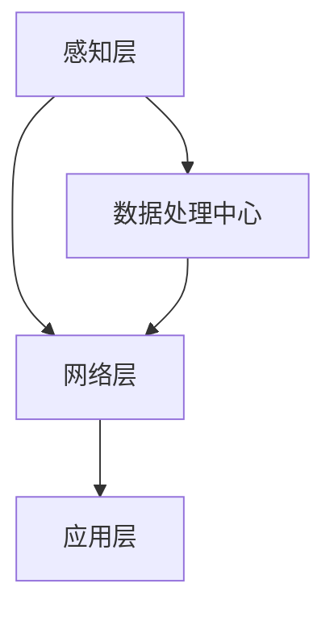

                 

关键词：物联网、智能家居、传感器、边缘计算、大数据分析、物联网安全

> 摘要：物联网作为当前技术领域的热点，通过将物理世界中的各种设备互联，实现了数据的高速传输与智能处理。本文旨在深入探讨物联网的基本概念、核心架构、核心技术、数学模型、应用实践以及未来发展趋势，旨在为读者提供一个全面了解物联网的视角。

## 1. 背景介绍

物联网（Internet of Things，简称 IoT）是一个通过互联网将各种设备、传感器、系统连接起来，实现智能信息交换和协同工作的网络系统。物联网的发展可以追溯到20世纪80年代，但真正兴起还是在近几年，随着传感器技术的进步、无线通信技术的发展以及云计算、大数据技术的成熟。

物联网的主要特征是设备的互联互通、数据的实时传输和智能处理。它不仅在工业、医疗、交通、农业等领域得到广泛应用，同时也逐渐渗透到我们的日常生活中，形成了智能家居、智慧城市等新兴概念。

## 2. 核心概念与联系

### 物联网基本概念

- **传感器**：物联网的基础是传感器，它们用于检测物理信号并将这些信号转化为电子信号。
- **网络连接**：物联网设备需要通过网络连接来传输数据，常见的连接方式包括Wi-Fi、蓝牙、蜂窝网络等。
- **数据处理**：物联网设备收集的数据需要经过处理，以提取有用的信息，支持智能决策。

### 物联网架构

物联网的架构通常包括感知层、网络层和应用层。

- **感知层**：主要由传感器和采集设备组成，负责数据的收集。
- **网络层**：负责数据传输，包括有线和无线网络。
- **应用层**：提供各种应用服务，如智能家居控制、智能交通管理、环境监测等。

### Mermaid 流程图



## 3. 核心算法原理 & 具体操作步骤

### 3.1 算法原理概述

物联网中的核心算法主要涉及数据采集、传输和处理的优化。

- **数据采集**：使用传感器采集环境数据。
- **数据传输**：优化数据传输效率，降低延迟和带宽消耗。
- **数据处理**：使用机器学习和数据分析技术处理大量数据，提取有用信息。

### 3.2 算法步骤详解

1. **数据采集**：传感器收集温度、湿度、光线等环境数据。
2. **数据预处理**：对采集到的数据进行清洗、去噪和格式转换。
3. **数据传输**：通过无线或有线网络将预处理后的数据发送到数据处理中心。
4. **数据处理**：在数据处理中心，对数据进行分析和建模，提取特征和预测结果。
5. **反馈与执行**：将分析结果反馈给物联网设备，以实现智能决策和自动执行。

### 3.3 算法优缺点

- **优点**：提高了数据处理效率，实现了实时监控和智能决策。
- **缺点**：对数据质量和传输稳定性要求较高，算法复杂度较大。

### 3.4 算法应用领域

物联网算法广泛应用于智能家居、智能交通、工业自动化、医疗健康等领域。

## 4. 数学模型和公式

### 4.1 数学模型构建

物联网中的数学模型主要包括传感器数据模型、网络传输模型和数据处理模型。

### 4.2 公式推导过程

假设传感器采集的数据为 $X_t$，网络传输延迟为 $T_t$，数据处理模型为 $f(X_t, T_t)$。

- **传感器数据模型**： $X_t = f_1(s_t)$，其中 $s_t$ 是环境信号。
- **网络传输模型**： $T_t = f_2(s_t, X_t)$。
- **数据处理模型**： $f(X_t, T_t) = f_3(X_t, T_t)$。

### 4.3 案例分析与讲解

以智能家居为例，传感器采集温度、湿度等数据，通过网络传输到云端进行处理，根据分析结果控制空调、加湿器等家电设备。

## 5. 项目实践：代码实例

### 5.1 开发环境搭建

使用 Python 语言和 MQTT 协议搭建物联网项目。

### 5.2 源代码详细实现

```python
import paho.mqtt.client as mqtt

# MQTT 连接设置
def on_connect(client, userdata, flags, rc):
    print("Connected with result code "+str(rc))
    client.subscribe("sensor/data")

# 数据处理函数
def on_message(client, userdata, msg):
    data = msg.payload.decode()
    # 处理数据
    # ...

client = mqtt.Client()
client.on_connect = on_connect
client.on_message = on_message
client.connect("mqtt.broker.example.com", 1883, 60)
client.loop_forever()
```

### 5.3 代码解读与分析

此代码实现了 MQTT 协议的客户端，连接到 MQTT 服务器，并订阅传感器数据主题。当接收到数据时，调用数据处理函数进行处理。

## 6. 实际应用场景

物联网技术已经广泛应用于各个领域，如智能家居、智慧城市、智能医疗、智能交通等。

### 6.1 智能家居

智能家居通过物联网技术实现家庭设备的智能互联和控制，提高生活质量。

### 6.2 智慧城市

智慧城市利用物联网技术实现城市管理的智能化，提升城市效率。

### 6.3 智能医疗

智能医疗通过物联网设备实现病人的实时监测和管理，提高医疗水平。

### 6.4 未来应用展望

随着技术的不断发展，物联网将在更多领域得到应用，如智能农业、智慧能源管理等。

## 7. 工具和资源推荐

### 7.1 学习资源推荐

- 《物联网基础教程》
- 《物联网架构与应用》

### 7.2 开发工具推荐

- Eclipse Paho MQTT 客户端
- Node-RED

### 7.3 相关论文推荐

- "Internet of Things: A Survey"
- "Smart Home Networks: A Survey"

## 8. 总结：未来发展趋势与挑战

### 8.1 研究成果总结

物联网技术在传感器、网络、数据处理等方面取得了显著成果。

### 8.2 未来发展趋势

物联网将向更多领域扩展，实现更广泛的应用。

### 8.3 面临的挑战

物联网面临数据隐私、安全、标准化等挑战。

### 8.4 研究展望

未来物联网研究将重点关注安全性、隐私保护、跨平台互操作性等方面。

## 9. 附录：常见问题与解答

### 9.1 物联网与互联网的区别是什么？

物联网是互联网的延伸和扩展，通过将物理世界中的设备互联，实现数据的实时采集和处理。

### 9.2 物联网安全有哪些风险？

物联网安全风险主要包括数据泄露、设备被黑、网络攻击等。

### 9.3 物联网对未来的影响是什么？

物联网将深刻改变我们的生活方式和工作模式，提高效率和质量。

---

**作者：禅与计算机程序设计艺术 / Zen and the Art of Computer Programming**

