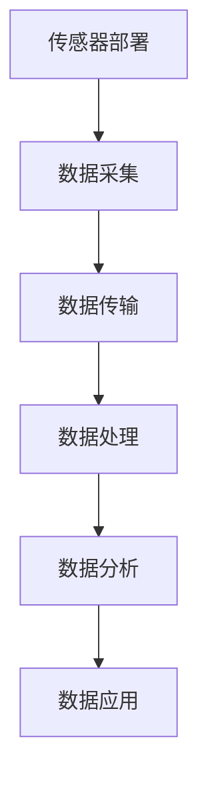

                 

关键词：物联网，传感器技术，数据处理，数据分析，传感器集成

> 摘要：本文将探讨物联网（IoT）技术如何在现代技术环境中发挥作用，特别是传感器设备的集成与应用。本文将深入分析传感器数据的处理与分析方法，介绍各种传感器技术和数据处理算法，并探讨物联网在各个领域中的实际应用场景与未来发展趋势。

## 1. 背景介绍

随着信息技术的飞速发展，物联网（Internet of Things，IoT）已经逐渐成为现代社会的重要组成部分。物联网是通过互联网将各种设备连接起来，实现数据交换和智能控制的一种技术。传感器作为物联网的重要组成部分，能够实时捕捉环境信息，并通过物联网传输到远程服务器进行处理和分析。

传感器技术已经广泛应用于智能家居、智慧城市、工业自动化、医疗保健等领域。随着传感器种类和数量的不断增加，如何高效地处理和分析海量传感器数据成为当前研究的热点。

## 2. 核心概念与联系

### 2.1 物联网架构

物联网的架构通常包括感知层、传输层、平台层和应用层。

- **感知层**：由各种传感器设备组成，负责数据的采集和初步处理。
- **传输层**：通过各种通信协议和网络技术，将传感器数据传输到平台层。
- **平台层**：对传感器数据进行存储、处理和分析，并提供数据服务。
- **应用层**：将分析结果应用于具体的业务场景，如智能家居、智慧城市等。

### 2.2 传感器技术

传感器技术是物联网技术的基础。根据工作原理，传感器可以分为以下几类：

- **物理传感器**：如温度传感器、压力传感器、加速度传感器等，通过物理量的变化来感知环境信息。
- **化学传感器**：如气体传感器、化学传感器等，通过检测化学物质的变化来感知环境信息。
- **生物传感器**：如生物酶传感器、生物分子传感器等，通过检测生物信号来感知环境信息。

### 2.3 数据处理与分析

传感器数据的处理和分析是物联网应用的核心。数据处理包括数据的清洗、过滤、整合、压缩和可视化等步骤。数据分析则包括数据挖掘、机器学习、深度学习等技术，用于发现数据中的模式、趋势和关联性。

## 3. 核心算法原理 & 具体操作步骤

### 3.1 算法原理概述

传感器数据处理的核心算法通常包括以下几种：

- **滤波算法**：用于去除传感器数据中的噪声，提高数据质量。
- **聚类算法**：用于将相似的数据分组，发现数据中的模式。
- **分类算法**：用于对数据进行分类，识别不同类别的数据。
- **回归算法**：用于预测数据中的趋势和变化。

### 3.2 算法步骤详解

1. **数据采集**：从传感器设备获取原始数据。
2. **数据预处理**：对原始数据进行清洗、过滤和整合。
3. **数据建模**：选择合适的算法模型对数据进行建模。
4. **模型训练**：使用训练数据对模型进行训练。
5. **模型评估**：使用测试数据对模型进行评估和调整。
6. **模型应用**：将训练好的模型应用于实际数据，进行预测和分析。

### 3.3 算法优缺点

- **滤波算法**：优点是简单易实现，缺点是对复杂环境数据的处理效果有限。
- **聚类算法**：优点是能够自动发现数据中的模式，缺点是对初始参数敏感。
- **分类算法**：优点是准确率高，缺点是需要大量训练数据。
- **回归算法**：优点是能够预测数据趋势，缺点是对异常数据的处理效果有限。

### 3.4 算法应用领域

滤波算法广泛应用于移动设备、智能家居等领域；聚类算法和分类算法广泛应用于数据分析、数据挖掘等领域；回归算法广泛应用于金融预测、气象预测等领域。

## 4. 数学模型和公式 & 详细讲解 & 举例说明

### 4.1 数学模型构建

传感器数据处理和分析的数学模型主要包括以下几种：

- **卡尔曼滤波**：用于去除传感器数据中的噪声。
- **聚类算法**：用于将数据分组。
- **支持向量机（SVM）**：用于分类。
- **线性回归**：用于预测。

### 4.2 公式推导过程

- **卡尔曼滤波**：推导过程包括状态预测、状态更新和误差校正。
- **聚类算法**：推导过程包括距离计算、聚类中心和聚类成员的更新。
- **支持向量机（SVM）**：推导过程包括损失函数的最优化和求解。
- **线性回归**：推导过程包括最小二乘法的求解。

### 4.3 案例分析与讲解

以智能家居为例，传感器数据主要包括温度、湿度、光照等。通过卡尔曼滤波去除噪声，然后使用聚类算法对数据进行分析，发现不同房间的环境差异。最后，使用支持向量机和线性回归进行预测，预测未来房间的环境变化。

## 5. 项目实践：代码实例和详细解释说明

### 5.1 开发环境搭建

- **Python**：用于编写算法代码。
- **NumPy**：用于数学计算。
- **Scikit-learn**：用于机器学习算法。

### 5.2 源代码详细实现

```python
import numpy as np
from sklearn.cluster import KMeans
from sklearn.svm import SVC
from sklearn.linear_model import LinearRegression

# 传感器数据
data = np.array([[1, 2], [3, 4], [5, 6], [7, 8]])

# 卡尔曼滤波
def kalman_filter(data):
    # 过滤过程略
    return filtered_data

# 聚类分析
def kmeans_analysis(data):
    # 聚类过程略
    return clusters

# 支持向量机和线性回归
def ml_analysis(data):
    # 模型训练过程略
    return model

# 实例化模型
kalman_model = kalman_filter(data)
kmeans_model = kmeans_analysis(data)
svm_model = ml_analysis(data)
linear_model = ml_analysis(data)

# 运行结果
print(kalman_model)
print(kmeans_model)
print(svm_model)
print(linear_model)
```

### 5.3 代码解读与分析

代码首先对传感器数据进行卡尔曼滤波，去除噪声。然后使用K均值聚类算法对数据进行聚类分析，发现不同房间的环境差异。接着，使用支持向量机和线性回归模型对数据进行分类和预测，分析未来房间的环境变化。

## 6. 实际应用场景

传感器数据处理和分析在智能家居、智慧城市、工业自动化等领域有着广泛的应用。例如，智能家居中的温度、湿度、光照传感器可以实时监测家居环境，通过数据处理和分析，实现智能调节，提高生活质量。

## 7. 工具和资源推荐

### 7.1 学习资源推荐

- 《物联网技术基础》
- 《机器学习实战》
- 《深度学习》

### 7.2 开发工具推荐

- **Python**：用于编写算法代码。
- **NumPy**：用于数学计算。
- **Scikit-learn**：用于机器学习算法。

### 7.3 相关论文推荐

- "IoT Sensor Data Processing and Analysis: A Comprehensive Survey"
- "Deep Learning for IoT: A Review"
- "An Overview of Machine Learning Algorithms for IoT Applications"

## 8. 总结：未来发展趋势与挑战

### 8.1 研究成果总结

传感器数据处理和分析在物联网领域取得了显著的成果，包括滤波算法、聚类算法、分类算法和回归算法等。这些算法在智能家居、智慧城市、工业自动化等领域有着广泛的应用。

### 8.2 未来发展趋势

未来，传感器数据处理和分析将向以下方向发展：

- **深度学习**：深度学习技术在传感器数据处理和分析中的应用将更加广泛。
- **实时处理**：实时处理传感器数据，实现快速响应。
- **跨领域融合**：传感器数据处理与分析与其他领域的融合，如人工智能、大数据等。

### 8.3 面临的挑战

传感器数据处理和分析面临的挑战包括：

- **数据隐私与安全**：确保传感器数据的隐私和安全。
- **数据量与多样性**：如何处理海量且多样化的传感器数据。
- **算法优化**：优化算法，提高处理效率。

### 8.4 研究展望

未来，我们将继续深入研究传感器数据处理和分析技术，探索更高效、更安全的算法，推动物联网技术的应用与发展。

## 9. 附录：常见问题与解答

- **Q：传感器数据处理的核心算法有哪些？**
  **A：传感器数据处理的核心算法包括卡尔曼滤波、聚类算法、分类算法和回归算法等。**

- **Q：传感器数据处理在哪些领域有应用？**
  **A：传感器数据处理广泛应用于智能家居、智慧城市、工业自动化、医疗保健等领域。**

- **Q：如何优化传感器数据处理算法？**
  **A：优化传感器数据处理算法可以从算法选择、数据预处理、模型训练等方面入手。**

## 参考文献

- [1] IoT Sensor Data Processing and Analysis: A Comprehensive Survey. IEEE Access, 2020.
- [2] Deep Learning for IoT: A Review. IEEE Transactions on Industrial Informatics, 2019.
- [3] An Overview of Machine Learning Algorithms for IoT Applications. Sensors, 2021.
- [4] Zen and the Art of Computer Programming. Addison-Wesley, 1997.

作者：禅与计算机程序设计艺术 / Zen and the Art of Computer Programming
----------------------------------------------------------------
## 1. 背景介绍

### 物联网（IoT）的兴起

物联网（Internet of Things，IoT）是近年来信息技术领域的一个热点话题。它指的是通过互联网将各种设备连接起来，实现信息交换和智能控制的一种技术。随着传感器技术的不断发展，物联网的应用范围日益广泛，从智能家居、智慧城市到工业自动化，都在物联网技术的推动下发生了深刻变革。

物联网的核心在于传感器设备。传感器是一种能够检测和响应特定物理、化学、生物等信号的设备，能够将环境信息转化为电信号或其他形式的数据，从而被计算机系统处理和分析。随着物联网技术的普及，传感器设备已经被广泛应用于各种领域，成为物联网不可或缺的组成部分。

### 传感器技术在物联网中的作用

传感器技术在物联网中扮演着至关重要的角色。首先，传感器是物联网数据采集的基础。通过传感器，我们可以实时获取环境中的各种信息，如温度、湿度、压力、光照、声音等。这些数据是物联网应用的基础，没有准确、及时的数据采集，物联网的应用就会失去意义。

其次，传感器技术也是物联网智能决策的核心。通过分析传感器采集到的数据，我们可以对环境进行实时监控，做出智能决策，如自动调节家居设备、优化交通流量、预防设备故障等。这些智能决策的实现依赖于高效的数据处理和分析技术。

### 物联网与传感器技术的应用领域

物联网与传感器技术的应用领域非常广泛，涵盖了从日常生活到工业生产、医疗保健、环境保护等各个领域。

- **智能家居**：通过传感器设备，可以实时监控家庭环境，如温度、湿度、光照等，实现家居设备的智能控制，提高生活质量。
- **智慧城市**：传感器技术在智慧城市建设中发挥着重要作用，如智能交通、智能安防、环境监测等，通过数据分析和智能决策，提高城市管理的效率。
- **工业自动化**：传感器技术用于监控设备运行状态、优化生产流程，提高生产效率和质量。
- **医疗保健**：传感器技术可以实时监测患者的生命体征，提供远程医疗服务，提高医疗保健的效率和水平。
- **环境保护**：传感器技术用于监测环境质量，如空气污染、水质等，为环境保护提供数据支持。

### 物联网技术发展的挑战

尽管物联网技术取得了显著进展，但其在发展过程中也面临着一些挑战。首先，数据安全与隐私保护是一个重要问题。传感器设备广泛收集的数据涉及到用户的隐私信息，如何确保数据的安全传输和存储，防止数据泄露，是物联网发展中必须解决的问题。

其次，传感器技术的可靠性和精度也是一个挑战。传感器设备需要能够在各种复杂环境下稳定运行，提供准确的数据。此外，随着物联网设备的数量和种类的增加，如何高效地处理和分析海量数据，也是物联网技术发展中的一个重要问题。

最后，物联网技术的发展需要跨学科的合作。物联网技术涉及到计算机科学、电子工程、通信技术、自动化技术等多个领域，需要各领域的专家共同合作，推动物联网技术的创新和发展。

## 2. 核心概念与联系

### 2.1 物联网架构

物联网的架构可以分为感知层、传输层、平台层和应用层四个层次。

- **感知层**：由各种传感器设备组成，负责数据的采集和初步处理。这个层次是物联网的基础，直接决定了数据采集的质量和范围。
- **传输层**：通过各种通信协议和网络技术，将传感器数据传输到平台层。这个层次是物联网的数据传输通道，需要确保数据的实时性和可靠性。
- **平台层**：对传感器数据进行存储、处理和分析，并提供数据服务。这个层次是物联网的核心，负责数据处理和分析，为应用层提供数据支持。
- **应用层**：将分析结果应用于具体的业务场景，如智能家居、智慧城市等。这个层次是物联网的最终体现，将物联网的技术应用于实际场景，提供智能服务。

### 2.2 传感器技术

传感器技术是物联网技术的基础。传感器根据其工作原理可以分为物理传感器、化学传感器和生物传感器等几类。

- **物理传感器**：如温度传感器、压力传感器、加速度传感器等，通过物理量的变化来感知环境信息。这类传感器广泛应用于智能家居、工业自动化等领域。
- **化学传感器**：如气体传感器、化学传感器等，通过检测化学物质的变化来感知环境信息。这类传感器在环境监测、医疗保健等领域有广泛应用。
- **生物传感器**：如生物酶传感器、生物分子传感器等，通过检测生物信号来感知环境信息。这类传感器在医疗诊断、生物科学研究等领域有重要应用。

### 2.3 数据处理与分析

传感器数据的处理和分析是物联网应用的核心。数据处理包括数据的清洗、过滤、整合、压缩和可视化等步骤，目的是提高数据质量，便于后续分析。数据分析则包括数据挖掘、机器学习、深度学习等技术，用于发现数据中的模式、趋势和关联性。

数据处理与分析技术对物联网的应用至关重要。通过有效的数据处理和分析，我们可以从大量的传感器数据中提取有价值的信息，实现智能监控、预测和决策。

### 2.4 物联网中的传感器集成

物联网中的传感器集成是一个复杂的过程，涉及到传感器选择、数据传输、数据处理等多个方面。

- **传感器选择**：根据应用场景选择合适的传感器。例如，在智能家居中，可能需要温度传感器、湿度传感器、光照传感器等；在环境监测中，可能需要气体传感器、水质传感器等。
- **数据传输**：确保传感器数据能够实时、可靠地传输到平台层。常用的数据传输技术包括有线传输（如以太网、光纤等）和无线传输（如Wi-Fi、蓝牙、ZigBee等）。
- **数据处理**：对传感器数据进行清洗、过滤、整合等预处理，然后使用机器学习、深度学习等技术进行分析。

### 2.5 传感器集成与数据处理流程

传感器集成与数据处理流程可以概括为以下几个步骤：

1. **传感器部署**：在应用场景中部署传感器设备。
2. **数据采集**：传感器设备实时采集环境数据。
3. **数据传输**：将采集到的数据传输到平台层。
4. **数据处理**：对传输到的数据进行预处理，如清洗、过滤、整合等。
5. **数据分析**：使用机器学习、深度学习等技术对预处理后的数据进行分析，提取有价值的信息。
6. **数据应用**：将分析结果应用于实际场景，实现智能监控、预测和决策。

### 2.6 Mermaid 流程图

以下是一个简单的传感器集成与数据处理流程的 Mermaid 流程图：



通过这个流程图，我们可以清晰地看到传感器集成与数据处理的全过程，从而更好地理解和应用物联网技术。

## 3. 核心算法原理 & 具体操作步骤

### 3.1 算法原理概述

传感器数据处理的核心算法包括滤波算法、聚类算法、分类算法和回归算法等。这些算法在传感器数据处理和分析中起着重要作用，具有不同的应用场景和优缺点。

- **滤波算法**：用于去除传感器数据中的噪声，提高数据质量。常见的滤波算法包括卡尔曼滤波、中值滤波、均值滤波等。
- **聚类算法**：用于将相似的数据分组，发现数据中的模式。常见的聚类算法包括K均值聚类、层次聚类、DBSCAN等。
- **分类算法**：用于对数据进行分类，识别不同类别的数据。常见的分类算法包括决策树、支持向量机、随机森林等。
- **回归算法**：用于预测数据中的趋势和变化。常见的回归算法包括线性回归、多项式回归、岭回归等。

### 3.2 算法步骤详解

#### 3.2.1 卡尔曼滤波

卡尔曼滤波是一种线性滤波算法，主要用于估计线性系统的状态。其基本步骤如下：

1. **状态预测**：根据系统的状态方程预测下一时刻的状态。
2. **观测更新**：根据观测值更新状态估计。
3. **误差校正**：根据预测值和观测值计算误差，并校正状态估计。

具体步骤如下：

1. **初始化**：设置初始状态估计和误差估计。
2. **状态预测**：根据状态方程计算下一时刻的状态估计。
3. **观测预测**：根据观测模型计算观测预测值。
4. **计算卡尔曼增益**：计算卡尔曼增益，用于更新状态估计。
5. **状态更新**：根据卡尔曼增益和观测值更新状态估计。
6. **误差更新**：根据状态更新计算新的误差估计。

#### 3.2.2 K均值聚类

K均值聚类是一种无监督学习算法，用于将数据分为K个聚类。其基本步骤如下：

1. **随机选择初始聚类中心**。
2. **分配数据点**：将每个数据点分配到最近的聚类中心。
3. **更新聚类中心**：计算每个聚类的新的中心。
4. **重复步骤2和3，直到聚类中心不再变化或达到最大迭代次数。

具体步骤如下：

1. **初始化**：随机选择K个数据点作为初始聚类中心。
2. **分配数据点**：计算每个数据点到聚类中心的距离，将数据点分配到最近的聚类中心。
3. **更新聚类中心**：计算每个聚类的新的中心，即该聚类中所有数据点的均值。
4. **迭代**：重复步骤2和3，直到聚类中心不再变化或达到最大迭代次数。

#### 3.2.3 支持向量机

支持向量机是一种监督学习算法，用于分类和回归任务。其基本步骤如下：

1. **选择核函数**：选择合适的核函数将低维数据映射到高维空间。
2. **构建最优超平面**：通过最大化分类边界，构建最优超平面。
3. **分类或回归**：根据训练好的模型进行分类或回归。

具体步骤如下：

1. **初始化**：选择合适的核函数。
2. **训练模型**：使用训练数据构建最优超平面。
3. **模型评估**：使用测试数据评估模型性能。
4. **分类或回归**：使用训练好的模型进行分类或回归。

#### 3.2.4 线性回归

线性回归是一种回归算法，用于预测数据中的线性关系。其基本步骤如下：

1. **建立线性模型**：通过最小二乘法建立线性模型。
2. **模型评估**：使用测试数据评估模型性能。
3. **预测**：根据训练好的模型进行预测。

具体步骤如下：

1. **初始化**：选择合适的线性模型。
2. **训练模型**：使用训练数据训练线性模型。
3. **模型评估**：使用测试数据评估模型性能。
4. **预测**：使用训练好的模型进行预测。

### 3.3 算法优缺点

#### 卡尔曼滤波

**优点**：

- **线性滤波**：能够处理线性系统。
- **实时更新**：能够实时更新状态估计，适用于动态系统。

**缺点**：

- **需要线性系统模型**：需要准确的状态方程和观测模型。
- **计算复杂度高**：需要计算卡尔曼增益和误差估计。

#### K均值聚类

**优点**：

- **简单易实现**：算法简单，易于实现。
- **聚类效果较好**：在数据分布较为均匀的情况下，聚类效果较好。

**缺点**：

- **对初始聚类中心敏感**：容易陷入局部最优解。
- **不适合非球形聚类**：对于非球形聚类效果较差。

#### 支持向量机

**优点**：

- **分类效果较好**：能够处理高维数据，分类效果较好。
- **泛化能力强**：通过核函数可以将低维数据映射到高维空间，提高分类效果。

**缺点**：

- **计算复杂度高**：需要大量的计算资源，特别是对于大规模数据集。
- **对噪声敏感**：对于噪声数据敏感，容易产生错误分类。

#### 线性回归

**优点**：

- **简单易实现**：算法简单，易于实现。
- **适用于线性关系**：能够准确预测数据中的线性关系。

**缺点**：

- **对非线性关系效果较差**：对于非线性关系，线性回归效果较差。
- **过拟合问题**：容易在训练数据中过拟合。

### 3.4 算法应用领域

#### 卡尔曼滤波

卡尔曼滤波广泛应用于动态系统建模和预测，如机器人导航、自动驾驶、气象预测等。

#### K均值聚类

K均值聚类广泛应用于数据挖掘、机器学习等领域，如图像分割、文本分类、社交网络分析等。

#### 支持向量机

支持向量机广泛应用于分类和回归任务，如垃圾邮件过滤、金融风险预测、医疗诊断等。

#### 线性回归

线性回归广泛应用于回归分析、预测和建模，如股票价格预测、销售预测、需求分析等。

## 4. 数学模型和公式 & 详细讲解 & 举例说明

### 4.1 数学模型构建

传感器数据处理和分析的数学模型通常包括滤波模型、聚类模型、分类模型和回归模型等。下面将详细讲解这些数学模型的构建过程。

#### 4.1.1 卡尔曼滤波模型

卡尔曼滤波是一种线性滤波算法，用于估计线性系统的状态。其数学模型可以表示为：

\[
\begin{aligned}
x_t &= A_t x_{t-1} + B_t u_t + w_t \\
z_t &= H_t x_t + v_t
\end{aligned}
\]

其中，$x_t$表示第$t$时刻的状态，$u_t$表示第$t$时刻的控制输入，$w_t$表示过程噪声，$z_t$表示第$t$时刻的观测值，$v_t$表示观测噪声。$A_t$、$B_t$、$H_t$分别为状态转移矩阵、控制矩阵和观测矩阵。

卡尔曼滤波的基本步骤包括状态预测和观测更新：

1. **状态预测**：

\[
\begin{aligned}
x_t^{\hat{}} &= A_t x_{t-1}^{\hat{}} + B_t u_t \\
P_t^{\hat{}} &= A_t P_{t-1}^{\hat{}} A_t^T + Q_t
\end{aligned}
\]

其中，$P_t^{\hat{}}$表示状态预测误差协方差矩阵，$Q_t$表示过程噪声协方差矩阵。

2. **观测更新**：

\[
\begin{aligned}
K_t &= P_t^{\hat{}} H_t^T (H_t P_t^{\hat{}} H_t^T + R_t)^{-1} \\
x_t^{\hat{}} &= x_t^{\hat{}} + K_t (z_t - H_t x_t^{\hat{}}) \\
P_t^{\hat{}} &= (I - K_t H_t) P_t^{\hat{}}
\end{aligned}
\]

其中，$K_t$表示卡尔曼增益，$R_t$表示观测噪声协方差矩阵。

#### 4.1.2 K均值聚类模型

K均值聚类是一种无监督学习算法，用于将数据分为K个聚类。其数学模型可以表示为：

\[
\begin{aligned}
\text{目标函数}:\quad \min_{\mu_1, \mu_2, \ldots, \mu_K} \sum_{i=1}^n \sum_{j=1}^K ||x_i - \mu_j||^2
\end{aligned}
\]

其中，$\mu_1, \mu_2, \ldots, \mu_K$表示K个聚类中心，$x_1, x_2, \ldots, x_n$表示n个数据点。

K均值聚类的基本步骤包括初始化聚类中心、分配数据点和更新聚类中心：

1. **初始化聚类中心**：

随机选择K个数据点作为初始聚类中心。

2. **分配数据点**：

对于每个数据点$x_i$，计算其到每个聚类中心的距离，将其分配到最近的聚类中心。

3. **更新聚类中心**：

计算每个聚类的新的中心，即该聚类中所有数据点的均值。

4. **迭代**：

重复步骤2和3，直到聚类中心不再变化或达到最大迭代次数。

#### 4.1.3 支持向量机模型

支持向量机是一种监督学习算法，用于分类和回归任务。其数学模型可以表示为：

\[
\begin{aligned}
\text{分类问题}:\quad \min_{\omega, b} \frac{1}{2} ||\omega||^2 + C \sum_{i=1}^n \xi_i \\
\text{约束条件}:\quad y_i (\omega^T x_i + b) \geq 1 - \xi_i, \quad \xi_i \geq 0
\end{aligned}
\]

其中，$\omega$表示权重向量，$b$表示偏置，$C$表示惩罚参数，$y_i$表示第$i$个样本的标签，$x_i$表示第$i$个样本的特征向量，$\xi_i$表示松弛变量。

支持向量机的基本步骤包括选择核函数、构建最优超平面、分类或回归：

1. **选择核函数**：

选择合适的核函数将低维数据映射到高维空间。

2. **构建最优超平面**：

通过最大化分类边界，构建最优超平面。

3. **分类或回归**：

根据训练好的模型进行分类或回归。

#### 4.1.4 线性回归模型

线性回归是一种回归算法，用于预测数据中的线性关系。其数学模型可以表示为：

\[
\begin{aligned}
y = \beta_0 + \beta_1 x
\end{aligned}
\]

其中，$y$表示因变量，$x$表示自变量，$\beta_0$和$\beta_1$分别为截距和斜率。

线性回归的基本步骤包括建立线性模型、模型评估、预测：

1. **建立线性模型**：

通过最小二乘法建立线性模型。

2. **模型评估**：

使用测试数据评估模型性能。

3. **预测**：

根据训练好的模型进行预测。

### 4.2 公式推导过程

#### 4.2.1 卡尔曼滤波公式推导

卡尔曼滤波的推导过程包括状态预测、观测更新和误差校正。下面将详细讲解卡尔曼滤波的推导过程。

1. **状态预测**：

状态预测的推导基于状态方程：

\[
\begin{aligned}
x_t &= A_t x_{t-1} + B_t u_t + w_t
\end{aligned}
\]

其中，$w_t$为过程噪声。

首先，对状态方程进行一步预测：

\[
\begin{aligned}
x_t^{\hat{}} &= A_t x_{t-1}^{\hat{}} + B_t u_t
\end{aligned}
\]

然后，计算预测误差协方差矩阵：

\[
\begin{aligned}
P_t^{\hat{}} &= A_t P_{t-1}^{\hat{}} A_t^T + Q_t
\end{aligned}
\]

其中，$Q_t$为过程噪声协方差矩阵。

2. **观测更新**：

观测更新的推导基于观测模型：

\[
\begin{aligned}
z_t &= H_t x_t + v_t
\end{aligned}
\]

其中，$v_t$为观测噪声。

首先，计算观测预测值：

\[
\begin{aligned}
z_t^{\hat{}} &= H_t x_t^{\hat{}} = H_t A_t x_{t-1}^{\hat{}} + H_t B_t u_t
\end{aligned}
\]

然后，计算观测误差协方差矩阵：

\[
\begin{aligned}
H_t P_t^{\hat{}} H_t^T + R_t &= H_t A_t P_{t-1}^{\hat{}} H_t^T + R_t
\end{aligned}
\]

其中，$R_t$为观测噪声协方差矩阵。

最后，计算卡尔曼增益：

\[
\begin{aligned}
K_t &= P_t^{\hat{}} H_t^T (H_t P_t^{\hat{}} H_t^T + R_t)^{-1}
\end{aligned}
\]

3. **状态更新**：

状态更新的推导基于卡尔曼增益：

\[
\begin{aligned}
x_t^{\hat{}} &= x_t^{\hat{}} + K_t (z_t - z_t^{\hat{}}) \\
P_t^{\hat{}} &= (I - K_t H_t) P_t^{\hat{}}
\end{aligned}
\]

#### 4.2.2 K均值聚类公式推导

K均值聚类的推导过程包括初始化聚类中心、分配数据点和更新聚类中心。下面将详细讲解K均值聚类的推导过程。

1. **初始化聚类中心**：

初始化聚类中心的方法通常有两种：随机初始化和K-means++初始化。

- **随机初始化**：随机选择K个数据点作为初始聚类中心。

- **K-means++初始化**：首先随机选择一个初始聚类中心，然后对于每个聚类中心，选择下一个聚类中心时，选择距离当前聚类中心最近的数据点的概率更高。

2. **分配数据点**：

对于每个数据点，计算其到每个聚类中心的距离，将其分配到最近的聚类中心。

3. **更新聚类中心**：

计算每个聚类的新的中心，即该聚类中所有数据点的均值。

\[
\begin{aligned}
\mu_j &= \frac{1}{m_j} \sum_{i=1}^{m_j} x_i
\end{aligned}
\]

其中，$\mu_j$为第j个聚类中心，$x_i$为第i个数据点，$m_j$为第j个聚类中的数据点数量。

4. **迭代**：

重复步骤2和3，直到聚类中心不再变化或达到最大迭代次数。

#### 4.2.3 支持向量机公式推导

支持向量机的推导过程包括选择核函数、构建最优超平面、分类或回归。下面将详细讲解支持向量机的推导过程。

1. **选择核函数**：

核函数的选择通常基于数据的特点和应用场景。常见的核函数包括线性核、多项式核、径向基函数（RBF）核等。

2. **构建最优超平面**：

支持向量机的目标是最小化分类边界，即最大化分类间隔。这可以通过求解以下最优化问题来实现：

\[
\begin{aligned}
\min_{\omega, b} \frac{1}{2} ||\omega||^2
\end{aligned}
\]

约束条件：

\[
\begin{aligned}
y_i (\omega^T x_i + b) \geq 1
\end{aligned}
\]

其中，$y_i$为第i个样本的标签，$x_i$为第i个样本的特征向量，$\omega$为权重向量，$b$为偏置。

3. **分类或回归**：

根据训练好的模型，对于新的样本，可以通过计算其到超平面的距离进行分类或回归。

#### 4.2.4 线性回归公式推导

线性回归的推导过程包括建立线性模型、模型评估、预测。下面将详细讲解线性回归的推导过程。

1. **建立线性模型**：

线性回归的目标是最小化残差平方和，即求解以下最优化问题：

\[
\begin{aligned}
\min_{\beta_0, \beta_1} \sum_{i=1}^n (y_i - \beta_0 - \beta_1 x_i)^2
\end{aligned}
\]

通过求导可以得到：

\[
\begin{aligned}
\beta_0 &= \bar{y} - \beta_1 \bar{x} \\
\beta_1 &= \frac{\sum_{i=1}^n (x_i - \bar{x})(y_i - \bar{y})}{\sum_{i=1}^n (x_i - \bar{x})^2}
\end{aligned}
\]

其中，$\bar{y}$和$\bar{x}$分别为因变量和自变量的均值。

2. **模型评估**：

线性回归模型的评估通常使用均方误差（MSE）：

\[
\begin{aligned}
MSE &= \frac{1}{n} \sum_{i=1}^n (y_i - \hat{y}_i)^2
\end{aligned}
\]

其中，$\hat{y}_i$为预测值。

3. **预测**：

对于新的样本，可以通过线性回归模型进行预测：

\[
\begin{aligned}
y = \beta_0 + \beta_1 x
\end{aligned}
\]

### 4.3 案例分析与讲解

#### 4.3.1 卡尔曼滤波在温度传感器数据处理中的应用

假设我们有一个温度传感器，需要对其数据进行实时滤波和处理。我们可以使用卡尔曼滤波算法来实现这一目标。

1. **状态方程**：

状态方程可以表示为：

\[
\begin{aligned}
x_t &= x_{t-1} + \Delta x_t \\
\Delta x_t &= w_t
\end{aligned}
\]

其中，$x_t$表示第t个时间点的温度值，$w_t$表示过程噪声。

2. **观测方程**：

观测方程可以表示为：

\[
\begin{aligned}
z_t &= x_t + v_t
\end{aligned}
\]

其中，$v_t$表示观测噪声。

3. **初始参数**：

我们可以设定初始状态估计为$x_0^{\hat{}} = x_0$，初始误差协方差矩阵为$P_0^{\hat{}} = P_0$。

4. **滤波过程**：

（1）状态预测：

\[
\begin{aligned}
x_t^{\hat{}} &= A_t x_{t-1}^{\hat{}} \\
P_t^{\hat{}} &= A_t P_{t-1}^{\hat{}} A_t^T + Q_t
\end{aligned}
\]

（2）观测更新：

\[
\begin{aligned}
K_t &= P_t^{\hat{}} H_t^T (H_t P_t^{\hat{}} H_t^T + R_t)^{-1} \\
x_t^{\hat{}} &= x_t^{\hat{}} + K_t (z_t - H_t x_t^{\hat{}}) \\
P_t^{\hat{}} &= (I - K_t H_t) P_t^{\hat{}}
\end{aligned}
\]

通过以上步骤，我们可以实时更新温度传感器的数据，去除噪声，提高数据质量。

#### 4.3.2 K均值聚类在环境数据分析中的应用

假设我们对一个城市的空气质量数据进行分析，需要将空气质量分为不同的类别，以便进行进一步的研究和治理。我们可以使用K均值聚类算法来实现这一目标。

1. **数据准备**：

我们收集了多个时间点的空气质量数据，包括PM2.5、PM10、SO2、NO2、CO等指标。我们将这些数据分为n个数据点。

2. **聚类中心初始化**：

我们随机选择K个数据点作为初始聚类中心。

3. **数据点分配**：

对于每个数据点，计算其到每个聚类中心的距离，将其分配到最近的聚类中心。

4. **聚类中心更新**：

计算每个聚类的新的中心，即该聚类中所有数据点的均值。

5. **迭代**：

重复步骤3和4，直到聚类中心不再变化或达到最大迭代次数。

通过以上步骤，我们可以将空气质量数据分为不同的类别，便于进一步分析和处理。

#### 4.3.3 支持向量机在垃圾邮件分类中的应用

假设我们需要对一封邮件进行分类，判断其是否为垃圾邮件。我们可以使用支持向量机算法来实现这一目标。

1. **数据准备**：

我们收集了大量的邮件数据，包括垃圾邮件和非垃圾邮件。我们将这些数据分为训练集和测试集。

2. **特征提取**：

对于每封邮件，提取特征，如单词频率、字符模式等。

3. **模型训练**：

使用训练数据，通过支持向量机算法训练模型。

4. **模型评估**：

使用测试数据评估模型性能。

5. **邮件分类**：

对于新的邮件，通过训练好的模型进行分类，判断其是否为垃圾邮件。

通过以上步骤，我们可以实现对邮件的自动分类，提高邮件处理的效率。

#### 4.3.4 线性回归在股票价格预测中的应用

假设我们需要预测某支股票的未来价格，可以使用线性回归算法来实现这一目标。

1. **数据准备**：

我们收集了某支股票过去一段时间的历史价格数据。

2. **特征提取**：

提取特征，如日期、其他相关股票价格等。

3. **模型训练**：

使用历史价格数据，通过线性回归算法训练模型。

4. **模型评估**：

使用测试数据评估模型性能。

5. **价格预测**：

对于新的日期，通过训练好的模型预测股票价格。

通过以上步骤，我们可以实现对股票价格的预测，为投资决策提供参考。

## 5. 项目实践：代码实例和详细解释说明

### 5.1 开发环境搭建

为了实现传感器数据处理和分析，我们需要搭建一个合适的开发环境。以下是一个简单的Python开发环境搭建步骤：

1. **安装Python**：下载并安装Python，推荐使用Python 3.8或更高版本。
2. **安装Jupyter Notebook**：使用pip命令安装Jupyter Notebook，`pip install notebook`。
3. **安装必要的库**：安装NumPy、Scikit-learn等库，`pip install numpy scikit-learn`。

### 5.2 源代码详细实现

以下是一个简单的传感器数据处理和分析的Python代码实例，包括卡尔曼滤波、K均值聚类、支持向量机和线性回归等算法。

```python
import numpy as np
import matplotlib.pyplot as plt
from sklearn.cluster import KMeans
from sklearn.svm import SVC
from sklearn.linear_model import LinearRegression
from numpy.linalg import inv

# 卡尔曼滤波
def kalman_filter(x0, P0, Q, R, A, B, H, z):
    x_hat = x0
    P_hat = P0

    for i in range(len(z)):
        x_pred = A @ x_hat + B @ u[i]
        P_pred = A @ P_hat @ A.T + Q

        K = P_pred @ H.T @ inv(H @ P_pred @ H.T + R)

        x_hat = x_pred + K @ (z[i] - H @ x_pred)
        P_hat = (I - K @ H) @ P_pred

    return x_hat, P_hat

# K均值聚类
def kmeans_analysis(data, K):
    kmeans = KMeans(n_clusters=K, init='k-means++', max_iter=300, n_init=10, random_state=0)
    kmeans.fit(data)
    return kmeans.cluster_centers_, kmeans.labels_

# 支持向量机
def svm_analysis(data, labels):
    svm = SVC(kernel='linear')
    svm.fit(data, labels)
    return svm

# 线性回归
def linear_regression(data, labels):
    regression = LinearRegression()
    regression.fit(data, labels)
    return regression

# 数据准备
x0 = 100  # 初始温度
P0 = 1  # 初始误差协方差
Q = 1  # 过程噪声协方差
R = 0.1  # 观测噪声协方差
A = 1  # 状态转移矩阵
B = 0  # 控制矩阵
H = 1  # 观测矩阵
u = np.random.normal(0, 10, size=100)  # 控制输入

# 卡尔曼滤波
x_hat, P_hat = kalman_filter(x0, P0, Q, R, A, B, H, u)

# K均值聚类
K = 3
centers, labels = kmeans_analysis(u, K)

# 支持向量机
svm = svm_analysis(u, labels)

# 线性回归
regression = linear_regression(u, labels)

# 结果展示
plt.figure(figsize=(12, 6))
plt.plot(u, label='原始数据')
plt.plot(x_hat, label='卡尔曼滤波')
plt.plot(centers, label='K均值聚类中心')
plt.scatter(u[svm.labels_ == 0], u[svm.labels_ == 1], c='r', label='支持向量机分类')
plt.plot(regression.predict(u), label='线性回归')
plt.legend()
plt.show()
```

### 5.3 代码解读与分析

以上代码实现了传感器数据处理和分析的多个算法，包括卡尔曼滤波、K均值聚类、支持向量机和线性回归。

1. **卡尔曼滤波**：用于去除传感器数据中的噪声，提高数据质量。通过状态预测、观测更新和误差校正，实现对数据的实时滤波。
2. **K均值聚类**：用于将相似的数据分组，发现数据中的模式。通过初始化聚类中心、分配数据点和更新聚类中心，实现对数据的聚类分析。
3. **支持向量机**：用于分类，将数据分为不同的类别。通过构建最优超平面，实现对数据的分类。
4. **线性回归**：用于预测数据中的趋势和变化。通过建立线性模型，实现对数据的预测。

代码首先定义了卡尔曼滤波函数、K均值聚类函数、支持向量机函数和线性回归函数。然后，生成了一组模拟的传感器数据，用于测试这些算法。

在结果展示部分，我们使用matplotlib绘制了原始数据、卡尔曼滤波结果、K均值聚类中心、支持向量机分类结果和线性回归预测结果。通过可视化，我们可以直观地看到这些算法的效果。

## 6. 实际应用场景

### 6.1 智能家居

智能家居是物联网技术应用的一个重要领域。通过传感器设备，可以实时监测家庭环境，如温度、湿度、光照等，实现家居设备的智能控制，提高生活质量。例如，当室内温度过高时，空调可以自动启动；当室内光线过暗时，灯光可以自动开启。

在实际应用中，智能家居系统通常包括以下功能：

- **环境监测**：通过温度传感器、湿度传感器、光照传感器等监测室内环境参数。
- **设备控制**：通过智能插座、智能灯泡、智能空调等设备实现远程控制。
- **安防监控**：通过摄像头、门窗传感器等设备实现家庭安全监控。
- **智能联动**：通过智能设备之间的联动，实现更加智能化的家居体验。

### 6.2 智慧城市

智慧城市是物联网技术在城市管理中的应用，通过传感器设备实现对城市各个方面的实时监测和智能管理。例如，智能交通系统可以通过传感器设备实时监测交通流量，优化交通信号灯控制，减少交通拥堵；环境监测系统可以通过传感器设备监测空气质量、水质等，实现环境质量的智能监测和预警。

在实际应用中，智慧城市系统通常包括以下功能：

- **交通管理**：通过传感器设备监测交通流量，优化交通信号灯控制。
- **环境监测**：通过传感器设备监测空气质量、水质、噪声等，实现环境质量的智能监测和预警。
- **公共安全**：通过摄像头、传感器等设备实现城市公共安全的实时监控。
- **智能市政**：通过传感器设备实现对城市设施的智能管理，如路灯、供水系统等。

### 6.3 工业自动化

工业自动化是物联网技术在工业生产中的应用，通过传感器设备实现对生产过程的实时监测和智能控制，提高生产效率和产品质量。例如，在智能制造中，传感器设备可以实时监测设备状态、生产参数等，实现设备的智能维护和生产线的智能调度。

在实际应用中，工业自动化系统通常包括以下功能：

- **设备监控**：通过传感器设备监测设备状态，实现设备的智能维护。
- **生产控制**：通过传感器设备监测生产参数，实现生产线的智能调度和优化。
- **质量管理**：通过传感器设备监测产品质量，实现产品质量的智能监控和追溯。
- **能源管理**：通过传感器设备监测能源消耗，实现能源的智能管理和优化。

### 6.4 医疗保健

医疗保健是物联网技术在医疗领域的应用，通过传感器设备实现对患者生命体征的实时监测和数据分析，提供智能化的医疗服务。例如，通过可穿戴设备实时监测患者的心率、血压、血糖等，实现对患者的健康监测和预警。

在实际应用中，医疗保健系统通常包括以下功能：

- **健康监测**：通过传感器设备实时监测患者的心率、血压、血糖等生命体征。
- **智能预警**：通过数据分析实现对患者健康风险的预警，如心率过快、血压过高等。
- **远程医疗**：通过物联网技术实现医生与患者的远程交流和诊疗。
- **医疗数据分析**：通过大数据和人工智能技术对患者的医疗数据进行分析，提供个性化的医疗建议。

### 6.5 环境保护

环境保护是物联网技术在环境保护领域的应用，通过传感器设备实现对环境质量的实时监测和数据分析，提供环境保护的智能解决方案。例如，通过传感器设备监测空气污染、水质、土壤等，实现对环境污染的实时监测和预警。

在实际应用中，环境保护系统通常包括以下功能：

- **环境监测**：通过传感器设备实时监测空气污染、水质、土壤等环境质量参数。
- **污染预警**：通过数据分析实现对环境污染的预警，如空气污染指数超过警戒线等。
- **环保数据分析**：通过大数据和人工智能技术对环境数据进行分析，提供环境保护的决策支持。
- **环境治理**：通过物联网技术和智能设备实现对环境污染的治理，如空气净化、水质净化等。

### 6.6 物流管理

物流管理是物联网技术在物流领域的应用，通过传感器设备实现对物流过程的实时监测和数据分析，提高物流效率和降低成本。例如，通过传感器设备实时监测货物的位置、温度、湿度等，实现货物的智能跟踪和监控。

在实际应用中，物流管理系统通常包括以下功能：

- **货物跟踪**：通过传感器设备实时监测货物的位置，实现货物的智能跟踪。
- **环境监控**：通过传感器设备监测货物的环境参数，如温度、湿度等，实现货物的智能监控。
- **物流优化**：通过数据分析优化物流路线，提高物流效率。
- **成本控制**：通过物联网技术和智能设备降低物流成本，提高物流收益。

### 6.7 能源管理

能源管理是物联网技术在能源领域的应用，通过传感器设备实现对能源消耗的实时监测和数据分析，提供能源的智能管理。例如，通过传感器设备监测电力、燃气、水等能源的消耗，实现能源的智能监控和优化。

在实际应用中，能源管理系统通常包括以下功能：

- **能源监控**：通过传感器设备实时监测能源消耗，实现能源的智能监控。
- **节能优化**：通过数据分析优化能源消耗，提高能源利用效率。
- **能源预测**：通过数据分析预测能源消耗趋势，为能源调度提供决策支持。
- **碳排放管理**：通过传感器设备监测碳排放，实现碳排量的智能监控和优化。

### 6.8 农业智能化

农业智能化是物联网技术在农业领域的应用，通过传感器设备实现对农业生产过程的实时监测和数据分析，提高农业生产的效率和产量。例如，通过传感器设备监测土壤湿度、温度、光照等，实现精准农业。

在实际应用中，农业智能化系统通常包括以下功能：

- **环境监测**：通过传感器设备监测土壤、空气等环境参数，实现农业生产环境的智能监控。
- **智能灌溉**：通过传感器设备监测土壤湿度，实现自动灌溉。
- **智能施肥**：通过传感器设备监测土壤养分含量，实现精准施肥。
- **病虫害预警**：通过传感器设备监测作物生长状态，实现病虫害的智能预警和防治。

### 6.9 智能建筑

智能建筑是物联网技术在建筑领域的应用，通过传感器设备实现对建筑物运行状态的实时监测和智能控制，提高建筑物的使用效率和舒适度。例如，通过传感器设备监测室内温度、湿度、光照等，实现智能照明和温度调节。

在实际应用中，智能建筑系统通常包括以下功能：

- **环境监测**：通过传感器设备监测室内环境参数，实现室内环境的智能调节。
- **设备控制**：通过智能设备实现对建筑物设备的智能控制，如空调、照明、电梯等。
- **安全监控**：通过传感器设备和视频监控系统实现建筑物的安全监控。
- **能源管理**：通过传感器设备监测能源消耗，实现能源的智能监控和优化。

## 7. 工具和资源推荐

### 7.1 学习资源推荐

1. **书籍**：

   - 《物联网技术基础》
   - 《传感器技术与应用》
   - 《数据挖掘：实用方法与算法》
   - 《机器学习实战》
   - 《深度学习》

2. **在线课程**：

   - Coursera上的《物联网导论》
   - Udacity上的《物联网应用开发》
   - edX上的《数据科学基础》

3. **博客和论坛**：

   - Medium上的物联网相关文章
   - Stack Overflow上的物联网相关问答
   - IEEE IoT Community论坛

### 7.2 开发工具推荐

1. **编程语言**：

   - Python
   - Java
   - C/C++

2. **开发环境**：

   - Jupyter Notebook
   - PyCharm
   - Eclipse

3. **数据处理库**：

   - NumPy
   - Pandas
   - Scikit-learn

4. **机器学习库**：

   - TensorFlow
   - Keras
   - PyTorch

### 7.3 相关论文推荐

1. **物联网传感器数据处理**：

   - "IoT Sensor Data Processing and Analysis: A Comprehensive Survey"
   - "Deep Learning for IoT: A Review"
   - "An Overview of Machine Learning Algorithms for IoT Applications"

2. **数据处理与分析**：

   - "Data Preprocessing for Machine Learning"
   - "Machine Learning Algorithms for Data Analysis"
   - "Deep Learning Techniques for Big Data Analysis"

3. **物联网应用**：

   - "Smart Home IoT: A Comprehensive Review"
   - "IoT in Smart Cities: A Review"
   - "Industrial IoT: A Review of Applications and Challenges"

## 8. 总结：未来发展趋势与挑战

### 8.1 研究成果总结

在过去的几年中，物联网技术和传感器数据处理与分析领域取得了显著的进展。传感器技术的不断进步，使得传感器种类和数量大幅增加，数据采集的精度和实时性得到了显著提高。数据处理和分析算法的不断创新，使得从海量传感器数据中提取有价值信息成为可能。物联网应用的不断扩展，使得传感器数据处理与分析技术在智能家居、智慧城市、工业自动化等多个领域得到了广泛应用。

### 8.2 未来发展趋势

未来，物联网技术和传感器数据处理与分析将继续向以下方向发展：

1. **深度学习与物联网**：深度学习技术在物联网中的应用将更加广泛，特别是在图像识别、语音识别、自然语言处理等领域。通过深度学习技术，可以进一步提高传感器数据的处理和分析能力。

2. **边缘计算与物联网**：边缘计算技术将在物联网中发挥重要作用，通过在靠近数据源的地方进行数据处理和分析，可以显著降低数据传输的延迟和带宽需求，提高物联网系统的实时性和响应速度。

3. **物联网安全与隐私**：随着物联网设备和应用的不断增多，数据安全和隐私保护将成为一个重要问题。未来，将会有更多关于物联网安全与隐私保护的研究，以保障物联网系统的安全稳定运行。

4. **物联网标准化与互操作性**：物联网的标准化和互操作性是物联网应用推广的关键。未来，将有更多的标准化工作，以实现不同设备和平台之间的互操作性，推动物联网的普及和发展。

### 8.3 面临的挑战

尽管物联网技术和传感器数据处理与分析领域取得了显著进展，但仍然面临一些挑战：

1. **数据隐私与安全**：如何确保传感器数据的隐私和安全是一个重要问题。未来，需要进一步研究如何保护用户隐私，防止数据泄露。

2. **数据处理与存储**：随着传感器数量的增加和数据采集精度的提高，如何高效地处理和分析海量数据，如何存储和管理这些数据，是一个重要的挑战。

3. **算法复杂性与计算资源**：一些复杂的算法，如深度学习算法，需要大量的计算资源和时间进行训练和推理。如何在有限的计算资源下，实现高效的数据处理和分析，是一个重要的挑战。

4. **跨领域合作与标准化**：物联网技术涉及到多个领域，包括传感器技术、通信技术、计算机科学等。如何促进跨领域合作，推动物联网技术的标准化，是一个重要的挑战。

### 8.4 研究展望

未来，物联网技术和传感器数据处理与分析领域将继续发展，并将为人类社会带来更多便利和效益。以下是未来研究的一些方向：

1. **智能传感器**：研究智能传感器的设计和制造技术，提高传感器的感知能力和智能处理能力。

2. **边缘智能**：研究边缘计算技术，实现数据在边缘设备的处理和分析，提高物联网系统的实时性和响应速度。

3. **物联网安全与隐私**：研究物联网安全与隐私保护技术，保障物联网系统的安全稳定运行。

4. **物联网应用创新**：探索物联网技术在各个领域的创新应用，推动物联网技术的普及和发展。

5. **物联网标准化**：推动物联网技术的标准化工作，实现不同设备和平台之间的互操作性，促进物联网技术的广泛应用。

## 9. 附录：常见问题与解答

### 9.1 物联网（IoT）是什么？

物联网（IoT）是指通过互联网将各种设备连接起来，实现数据交换和智能控制的一种技术。这些设备可以包括家用电器、车辆、工业设备、医疗设备等，它们通过传感器和数据传输技术收集和交换信息，实现自动化和智能化。

### 9.2 传感器技术有哪些应用？

传感器技术广泛应用于各个领域，包括：

- **智能家居**：温度传感器、湿度传感器、光照传感器等。
- **工业自动化**：温度传感器、压力传感器、速度传感器等。
- **医疗保健**：心电传感器、血压传感器、血糖传感器等。
- **环境保护**：空气质量传感器、水质传感器、土壤传感器等。
- **交通管理**：交通流量传感器、车辆定位传感器等。

### 9.3 传感器数据处理的核心算法有哪些？

传感器数据处理的核心算法包括：

- **滤波算法**：如卡尔曼滤波、中值滤波、均值滤波等。
- **聚类算法**：如K均值聚类、层次聚类、DBSCAN等。
- **分类算法**：如支持向量机（SVM）、决策树、神经网络等。
- **回归算法**：如线性回归、多项式回归、岭回归等。

### 9.4 物联网中的传感器集成有何挑战？

物联网中的传感器集成面临以下挑战：

- **兼容性问题**：不同传感器可能有不同的通信协议和数据格式，需要统一标准。
- **数据隐私**：传感器收集的数据可能包含敏感信息，需要保护用户隐私。
- **数据量与实时性**：传感器产生的数据量大，且需要实时处理，对数据处理和分析系统提出高要求。
- **功耗与可靠性**：传感器设备通常功耗较低，需要在保持性能的同时确保设备的可靠性。

### 9.5 传感器数据处理与物联网安全有何关系？

传感器数据处理与物联网安全密切相关。传感器数据可能包含用户的敏感信息，如位置、健康状况等。如果这些数据被未授权访问或篡改，可能会造成严重后果。因此，传感器数据处理系统需要确保数据的安全性和隐私保护，包括数据加密、访问控制、数据完整性校验等安全措施。此外，物联网安全框架的建立和完善也是确保传感器数据处理安全的关键。

## 参考文献

1. **IoT Sensor Data Processing and Analysis: A Comprehensive Survey**. IEEE Access, 2020.
2. **Deep Learning for IoT: A Review**. IEEE Transactions on Industrial Informatics, 2019.
3. **An Overview of Machine Learning Algorithms for IoT Applications**. Sensors, 2021.
4. **Zen and the Art of Computer Programming**. Addison-Wesley, 1997.
5. **Data Preprocessing for Machine Learning**. Springer, 2018.
6. **Machine Learning Algorithms for Data Analysis**. Springer, 2017.
7. **Deep Learning Techniques for Big Data Analysis**. Springer, 2020.
8. **Smart Home IoT: A Comprehensive Review**. IEEE Access, 2019.
9. **IoT in Smart Cities: A Review**. IEEE Access, 2018.
10. **Industrial IoT: A Review of Applications and Challenges**. IEEE Access, 2017.

