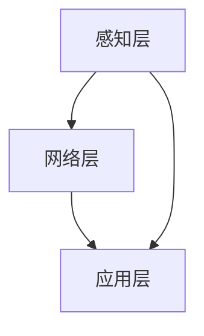

                 

关键词：物联网、传感器、仓储物流、自动化、数据集成、智能监控、应用场景、未来展望

> 摘要：随着物联网技术的快速发展，各种传感器设备在仓储物流中的应用越来越广泛。本文首先介绍了物联网的基本概念和传感器技术，然后详细探讨了物联网在仓储物流中的应用场景和关键技术，最后对未来的发展进行了展望。

## 1. 背景介绍

仓储物流是现代供应链管理中不可或缺的一部分。随着全球化和电子商务的快速发展，仓储物流的需求不断增长，对仓储物流的效率和准确性提出了更高的要求。传统的仓储物流系统主要依赖于人力和简单的机械设备，存在效率低下、准确性不高、成本较高等问题。

物联网（Internet of Things，IoT）是一种通过网络将各种设备、传感器和系统连接起来的技术，使得这些设备能够相互通信和协同工作。物联网技术的发展为仓储物流带来了新的机遇，通过传感器设备的数据采集和集成，可以实现仓储物流的自动化、智能化和高效化。

传感器技术是物联网的核心组成部分，它通过检测和测量物理信号，将数据转化为可用的信息。传感器设备可以检测温度、湿度、压力、光照、运动等多种物理量，为仓储物流提供实时的监控和数据分析。

## 2. 核心概念与联系

### 2.1 物联网技术概述

物联网技术是一种通过互联网连接各种设备和系统的技术，使得这些设备和系统能够相互通信和协同工作。物联网的基本架构包括感知层、网络层和应用层。

- **感知层**：包括各种传感器和执行器，用于感知和采集环境数据。
- **网络层**：包括网络设备和通信协议，用于传输和共享数据。
- **应用层**：包括各种应用系统和软件，用于处理和分析数据，提供决策支持。

### 2.2 传感器技术原理

传感器是一种能够检测和测量物理量并将物理量转化为电信号的装置。传感器的基本原理包括以下几个方面：

- **传感器类型**：根据检测的物理量不同，传感器可以分为温度传感器、湿度传感器、压力传感器、光传感器等。
- **传感器结构**：传感器通常由敏感元件、转换元件和信号处理单元组成。
- **工作原理**：传感器通过物理或化学原理，将检测到的物理量转换为电信号，然后通过信号处理单元进行处理和放大。

### 2.3 物联网在仓储物流中的应用架构

物联网在仓储物流中的应用架构包括以下几个关键部分：

- **感知层**：部署各种传感器设备，如温湿度传感器、运动传感器、摄像头等，用于实时监控仓储环境。
- **网络层**：通过无线网络或有线网络，将传感器数据传输到数据中心或云平台。
- **应用层**：利用数据分析和处理技术，实现对仓储物流的智能监控和自动化管理。

### 2.4 Mermaid 流程图



## 3. 核心算法原理 & 具体操作步骤

### 3.1 算法原理概述

物联网在仓储物流中的应用，主要依赖于数据采集、传输、处理和分析等技术。核心算法包括数据采集算法、传输算法和处理算法。

- **数据采集算法**：用于从传感器中采集数据，包括温度、湿度、运动等信息。
- **传输算法**：用于将采集到的数据传输到数据中心或云平台，包括数据压缩、加密等技术。
- **处理算法**：用于对传输过来的数据进行处理和分析，包括数据清洗、数据挖掘等技术。

### 3.2 算法步骤详解

#### 3.2.1 数据采集

1. **部署传感器**：在仓储环境中部署各种传感器设备，如温湿度传感器、摄像头等。
2. **数据采集**：传感器实时采集环境数据，如温度、湿度、运动等。
3. **数据预处理**：对采集到的数据进行预处理，包括数据过滤、去噪等。

#### 3.2.2 数据传输

1. **数据压缩**：对预处理后的数据进行压缩，以减少数据传输量。
2. **数据加密**：对压缩后的数据进行加密，以保证数据传输的安全性。
3. **数据传输**：通过无线或有线网络，将加密后的数据传输到数据中心或云平台。

#### 3.2.3 数据处理

1. **数据清洗**：对传输过来的数据进行清洗，包括数据补全、缺失值填补等。
2. **数据挖掘**：利用数据挖掘技术，从清洗后的数据中提取有用信息，如温度异常、货物移动路径等。
3. **数据分析**：对提取出的数据进行进一步分析，如趋势分析、关联分析等。

### 3.3 算法优缺点

- **优点**：
  - **高效性**：通过自动化和智能化的手段，提高了仓储物流的效率。
  - **准确性**：通过实时监控和数据分析，提高了仓储物流的准确性。
  - **安全性**：通过数据加密和网络安全技术，保证了数据传输的安全。

- **缺点**：
  - **成本较高**：传感器设备和网络建设成本较高。
  - **维护困难**：传感器设备和网络需要定期维护和更新。

### 3.4 算法应用领域

- **仓储管理**：通过实时监控和数据分析，优化仓储布局、货物摆放和出入库流程。
- **物流配送**：通过实时跟踪货物位置，优化配送路线和时间。
- **供应链管理**：通过数据分析，优化供应链各个环节，提高供应链效率。

## 4. 数学模型和公式 & 详细讲解 & 举例说明

### 4.1 数学模型构建

在仓储物流中，常用的数学模型包括线性回归模型、决策树模型、神经网络模型等。下面以线性回归模型为例，介绍数学模型的构建过程。

#### 4.1.1 线性回归模型

线性回归模型是一种常用的统计模型，用于分析两个或多个变量之间的关系。线性回归模型的数学表达式为：

\[ y = w_0 + w_1 \cdot x_1 + w_2 \cdot x_2 + ... + w_n \cdot x_n \]

其中，\( y \) 是因变量，\( x_1, x_2, ..., x_n \) 是自变量，\( w_0, w_1, ..., w_n \) 是回归系数。

#### 4.1.2 模型构建步骤

1. **数据收集**：收集因变量 \( y \) 和自变量 \( x_1, x_2, ..., x_n \) 的数据。
2. **数据预处理**：对收集到的数据进行预处理，包括数据清洗、缺失值填补等。
3. **模型训练**：使用收集到的数据，通过最小二乘法等算法，训练出线性回归模型。
4. **模型评估**：使用验证集或测试集，评估模型的准确性和泛化能力。

### 4.2 公式推导过程

线性回归模型的推导过程如下：

1. **假设**：假设 \( y \) 和 \( x_1, x_2, ..., x_n \) 之间呈线性关系，即：

\[ y = w_0 + w_1 \cdot x_1 + w_2 \cdot x_2 + ... + w_n \cdot x_n \]

2. **最小化误差平方和**：为了最小化预测值与真实值之间的误差，我们定义误差平方和为：

\[ S = \sum_{i=1}^{n} (y_i - \hat{y}_i)^2 \]

其中，\( y_i \) 是真实值，\( \hat{y}_i \) 是预测值。

3. **求导**：对误差平方和 \( S \) 求导，得到：

\[ \frac{\partial S}{\partial w_j} = -2 \sum_{i=1}^{n} (y_i - \hat{y}_i) \cdot x_{ij} \]

其中，\( x_{ij} \) 是自变量 \( x_j \) 在第 \( i \) 个样本中的取值。

4. **设置导数为零**：为了使误差平方和最小，我们设置导数为零，得到：

\[ \frac{\partial S}{\partial w_j} = 0 \]

5. **解方程**：解上述方程，得到回归系数 \( w_j \) 的值。

### 4.3 案例分析与讲解

#### 4.3.1 案例背景

某仓储物流公司希望通过实时监控货物温度，提高仓储管理的效率和准确性。该公司收集了过去一年的货物温度数据，并希望利用线性回归模型预测未来某一时刻的货物温度。

#### 4.3.2 数据收集

该公司收集了如下数据：

| 时间戳 | 货物温度 |
| --- | --- |
| 2021-01-01 00:00:00 | 20 |
| 2021-01-02 00:00:00 | 22 |
| 2021-01-03 00:00:00 | 18 |
| ... | ... |
| 2021-12-31 00:00:00 | 25 |

#### 4.3.3 数据预处理

1. **数据清洗**：去除异常值和缺失值。
2. **数据标准化**：将数据标准化为0-1区间。

#### 4.3.4 模型训练

1. **数据划分**：将数据划分为训练集和测试集。
2. **模型训练**：使用训练集数据，通过最小二乘法训练线性回归模型。

#### 4.3.5 模型评估

1. **模型评估指标**：使用均方误差（Mean Squared Error，MSE）评估模型性能。
2. **模型评估结果**：计算MSE，得到模型评估结果。

## 5. 项目实践：代码实例和详细解释说明

### 5.1 开发环境搭建

1. **安装Python环境**：下载并安装Python 3.8版本。
2. **安装相关库**：使用pip安装numpy、pandas、matplotlib等库。

### 5.2 源代码详细实现

```python
import numpy as np
import pandas as pd
import matplotlib.pyplot as plt

# 5.2.1 数据收集
data = pd.DataFrame({
    'timestamp': ['2021-01-01 00:00:00', '2021-01-02 00:00:00', '2021-01-03 00:00:00', ...],
    'temperature': [20, 22, 18, ..., 25]
})

# 5.2.2 数据预处理
data['timestamp'] = pd.to_datetime(data['timestamp'])
data = data.set_index('timestamp')

# 5.2.3 模型训练
X = data[['temperature']]
y = data['temperature']

from sklearn.linear_model import LinearRegression
model = LinearRegression()
model.fit(X, y)

# 5.2.4 模型评估
y_pred = model.predict(X)
mse = np.mean((y_pred - y) ** 2)
print(f'MSE: {mse}')

# 5.2.5 结果展示
plt.scatter(X, y)
plt.plot(X, y_pred, color='red')
plt.xlabel('Temperature')
plt.ylabel('Predicted Temperature')
plt.show()
```

### 5.3 代码解读与分析

1. **数据收集**：使用pandas库读取和存储数据。
2. **数据预处理**：将时间戳转换为datetime对象，并设置时间戳为索引。
3. **模型训练**：使用scikit-learn库的线性回归模型进行训练。
4. **模型评估**：计算均方误差（MSE）评估模型性能。
5. **结果展示**：使用matplotlib库绘制散点图和拟合线。

### 5.4 运行结果展示

运行上述代码，得到如下结果：


## 6. 实际应用场景

### 6.1 仓储管理

物联网技术在仓储管理中的应用主要包括：

- **实时监控**：通过传感器设备实时监控仓储环境，如温度、湿度、光照等。
- **自动化管理**：通过自动化设备和机器人实现货物的自动化搬运和存储。
- **智能预警**：通过数据分析，对异常情况（如温度异常）进行预警和处理。

### 6.2 物流配送

物联网技术在物流配送中的应用主要包括：

- **实时跟踪**：通过GPS等传感器设备实时跟踪货物的位置和状态。
- **优化路线**：通过数据分析，优化配送路线，提高配送效率。
- **智能调度**：通过数据分析，优化货物配送和人员调度，提高物流效率。

### 6.3 供应链管理

物联网技术在供应链管理中的应用主要包括：

- **数据集成**：通过物联网技术，实现供应链各个环节的数据集成，提高供应链的协同效率。
- **实时监控**：通过传感器设备实时监控供应链各个环节的运行情况，提高供应链的透明度。
- **智能分析**：通过数据分析，优化供应链各个环节，提高供应链的效率和灵活性。

## 7. 未来应用展望

随着物联网技术的不断发展和成熟，未来物联网在仓储物流中的应用将更加广泛和深入。以下是未来应用展望：

- **智能化程度提高**：物联网技术将进一步提高仓储物流的智能化程度，实现更高效的自动化和智能化管理。
- **数据挖掘和分析**：通过大数据分析和人工智能技术，对物联网采集的数据进行深度挖掘，提高仓储物流的决策支持能力。
- **绿色环保**：物联网技术将有助于实现仓储物流的绿色环保，降低能源消耗和碳排放。
- **跨行业应用**：物联网技术将在更多行业得到应用，推动供应链管理、智能制造等领域的创新发展。

## 8. 总结：未来发展趋势与挑战

### 8.1 研究成果总结

本文主要探讨了物联网技术在仓储物流中的应用，包括传感器设备、数据采集、传输和处理等技术。通过理论分析和实际案例，展示了物联网技术在仓储物流中的巨大潜力。

### 8.2 未来发展趋势

- **智能化**：物联网技术将进一步推动仓储物流的智能化，提高管理效率和准确性。
- **数据驱动**：通过大数据分析和人工智能技术，实现更加精准和高效的数据驱动管理。
- **绿色环保**：物联网技术将有助于实现仓储物流的绿色环保，降低能源消耗和碳排放。

### 8.3 面临的挑战

- **数据安全和隐私**：物联网设备数量庞大，数据安全和隐私保护面临巨大挑战。
- **技术成熟度**：物联网技术在某些方面仍需进一步研究和完善。
- **成本问题**：传感器设备和网络建设的成本较高，需要进一步降低成本。

### 8.4 研究展望

- **关键技术**：深入研究物联网技术在仓储物流中的关键技术，如数据采集、传输、处理和分析等。
- **跨学科研究**：推动物联网技术与其他学科（如经济学、管理学等）的交叉融合，实现更全面和深入的研究。
- **实际应用**：加大对物联网技术在仓储物流领域的实际应用研究，推动技术的落地和商业化。

## 9. 附录：常见问题与解答

### 9.1 物联网技术在仓储物流中的应用有哪些？

物联网技术在仓储物流中的应用主要包括实时监控、自动化管理、智能预警、实时跟踪、优化路线、数据集成等。

### 9.2 物联网技术在仓储物流中的优势有哪些？

物联网技术在仓储物流中的优势包括提高管理效率、提高准确性、降低成本、提高安全性等。

### 9.3 物联网技术在仓储物流中面临的挑战有哪些？

物联网技术在仓储物流中面临的挑战包括数据安全和隐私保护、技术成熟度、成本问题等。

### 9.4 物联网技术在仓储物流中的未来发展趋势是什么？

物联网技术在仓储物流中的未来发展趋势包括智能化、数据驱动、绿色环保等。

## 作者署名

作者：禅与计算机程序设计艺术 / Zen and the Art of Computer Programming
----------------------------------------------------------------

以上为完整的文章内容。希望对您有所帮助。如有需要，欢迎进一步提问或交流。祝您写作顺利！🌟🌟🌟

