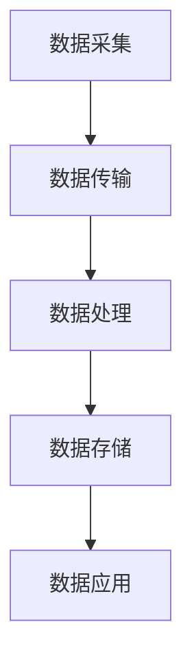

                 

关键词：物联网，注意力数据，传感器，数据分析，机器学习，智能设备

## 摘要

随着物联网（IoT）技术的飞速发展，各种智能设备和传感器广泛应用于我们的日常生活和工作中。这些设备不仅能够提供实时的环境数据，还能够通过感知用户的注意力行为来提升服务质量。本文将探讨物联网在注意力数据收集中的应用，包括核心概念、算法原理、数学模型、实际案例和未来展望。通过分析，我们旨在为读者提供一个全面了解物联网在注意力数据收集领域的现状和未来发展趋势的视角。

## 1. 背景介绍

### 物联网的基本概念

物联网是指通过互联网将各种终端设备（如传感器、智能手机、可穿戴设备等）互联互通，实现信息的共享和资源的优化配置。它不仅涵盖了物理设备的连接，还涉及数据收集、处理和分析等环节。物联网技术的核心在于将物理世界与数字世界相结合，从而实现智能化和自动化。

### 注意力数据的定义

注意力数据是指通过传感器或其他技术手段，收集到关于个体或群体注意力集中程度的信息。这些数据可以反映个体的行为习惯、认知状态和工作效率等，具有重要的应用价值。在物联网环境中，注意力数据主要通过传感器、摄像头和智能设备的交互来收集。

### 物联网在注意力数据收集中的应用背景

随着人们对个性化服务和智能化体验的需求日益增长，如何准确收集和分析注意力数据成为物联网技术的一个重要应用方向。注意力数据的收集不仅可以提升服务质量和用户体验，还可以为教育和健康等领域提供重要的数据支持。例如，通过分析学生的学习行为，教师可以针对性地调整教学策略，提高学习效果。

## 2. 核心概念与联系

### 物联网架构

为了更好地理解物联网在注意力数据收集中的应用，我们需要首先了解物联网的基本架构。一个典型的物联网系统通常包括感知层、网络层和应用层。感知层主要由传感器和智能设备组成，负责数据采集；网络层则负责数据传输和处理；应用层则提供数据分析和应用服务。

### 注意力数据收集的流程

注意力数据收集的基本流程如下：

1. **数据采集**：通过传感器（如眼动仪、脑波监测仪等）收集个体的注意力数据。
2. **数据传输**：将采集到的数据通过网络层传输到数据中心或云平台。
3. **数据处理**：对传输过来的数据进行预处理和特征提取。
4. **数据存储**：将处理后的数据存储在数据库或数据仓库中，以便后续分析和挖掘。
5. **数据应用**：利用注意力数据进行分析和建模，为用户提供个性化服务或决策支持。

### Mermaid 流程图

以下是一个简单的 Mermaid 流程图，展示了物联网在注意力数据收集中的应用架构：



## 3. 核心算法原理 & 具体操作步骤

### 3.1 算法原理概述

在物联网环境中，注意力数据收集的核心算法主要包括信号处理、特征提取和分类模型。以下是这三个步骤的简要概述：

1. **信号处理**：对原始注意力数据进行滤波、去噪等处理，以提高数据质量。
2. **特征提取**：从处理后的数据中提取与注意力相关的特征，如眼动轨迹、脑波频段等。
3. **分类模型**：利用机器学习算法，对提取到的特征进行分类，以判断个体的注意力状态。

### 3.2 算法步骤详解

1. **信号处理**

   信号处理是注意力数据收集的重要环节。常见的方法包括：

   - **滤波**：如高通滤波、低通滤波等，用于去除噪声。
   - **去噪**：如小波去噪、中值滤波等，用于减少数据中的随机噪声。

2. **特征提取**

   特征提取是算法的关键步骤。以下是几种常用的特征提取方法：

   - **时域特征**：如平均值、方差、峰峰值等。
   - **频域特征**：如频谱分析、小波变换等。
   - **时空特征**：如眼动轨迹、脑波信号的时间-频率分布等。

3. **分类模型**

   分类模型用于对提取到的特征进行分类。常见的方法包括：

   - **监督学习**：如支持向量机（SVM）、决策树、随机森林等。
   - **无监督学习**：如聚类算法、主成分分析（PCA）等。
   - **混合模型**：结合监督学习和无监督学习的优点，如深度学习等。

### 3.3 算法优缺点

1. **优点**

   - **高精度**：通过信号处理和特征提取，能够提高注意力数据的质量和准确性。
   - **实时性**：物联网环境下的注意力数据收集具有实时性，能够快速响应用户需求。
   - **多样性**：支持多种传感器和数据类型，适用于不同的应用场景。

2. **缺点**

   - **计算资源消耗**：信号处理和特征提取需要大量的计算资源，对硬件要求较高。
   - **数据隐私**：注意力数据属于个人敏感信息，需要严格保护用户隐私。

### 3.4 算法应用领域

- **教育**：通过分析学生的学习行为，教师可以针对性地调整教学策略，提高学习效果。
- **健康**：通过监测个体的注意力状态，有助于诊断和治疗注意力缺陷相关的疾病。
- **工业**：通过监控工人的注意力状态，可以提高工作效率，减少事故发生。

## 4. 数学模型和公式 & 详细讲解 & 举例说明

### 4.1 数学模型构建

在物联网注意力数据收集过程中，常用的数学模型包括信号处理模型、特征提取模型和分类模型。以下是这些模型的简要介绍：

1. **信号处理模型**

   假设原始信号为 \( x(t) \)，经过滤波和去噪后的信号为 \( y(t) \)，则信号处理模型可以表示为：

   $$ y(t) = f(x(t)) $$

   其中，\( f \) 为滤波和去噪函数。

2. **特征提取模型**

   假设处理后的信号为 \( y(t) \)，提取的特征为 \( Z \)，则特征提取模型可以表示为：

   $$ Z = g(y(t)) $$

   其中，\( g \) 为特征提取函数。

3. **分类模型**

   假设提取到的特征为 \( Z \)，分类结果为 \( C \)，则分类模型可以表示为：

   $$ C = h(Z) $$

   其中，\( h \) 为分类函数。

### 4.2 公式推导过程

以下是注意力数据收集中常用的公式推导过程：

1. **滤波公式**

   假设原始信号为 \( x(t) \)，高通滤波器传递函数为 \( H_h(s) \)，低通滤波器传递函数为 \( H_l(s) \)，则滤波后的信号为：

   $$ y(t) = H_h(s) * x(t) + H_l(s) * x(t) $$

   其中，\( * \) 表示卷积运算。

2. **特征提取公式**

   假设处理后的信号为 \( y(t) \)，提取的特征为 \( Z \)，则特征提取公式可以表示为：

   $$ Z = \sum_{i=1}^{n} w_i * y(t_i) $$

   其中，\( w_i \) 为权重系数，\( y(t_i) \) 为信号在 \( t_i \) 时刻的值。

3. **分类公式**

   假设提取到的特征为 \( Z \)，分类结果为 \( C \)，则分类公式可以表示为：

   $$ C = \arg \max_{i} (h(Z_i)) $$

   其中，\( h(Z_i) \) 为分类函数在 \( Z_i \) 上的输出。

### 4.3 案例分析与讲解

以下是一个简化的注意力数据收集案例：

1. **数据采集**：使用眼动仪收集学生的学习行为数据，包括注视点位置和注视时间等。

2. **数据处理**：对采集到的数据进行滤波和去噪，以提高数据质量。

3. **特征提取**：提取眼动轨迹的平均值、方差和峰峰值等特征。

4. **分类模型**：使用支持向量机（SVM）对提取到的特征进行分类，判断学生的学习状态。

5. **应用**：根据分类结果，教师可以针对性地调整教学策略，提高学生的学习效果。

## 5. 项目实践：代码实例和详细解释说明

### 5.1 开发环境搭建

1. **软件环境**：安装 Python 3.8及以上版本，Matlab 或其他支持机器学习的软件。
2. **硬件环境**：具备眼动仪或其他注意力数据采集设备。

### 5.2 源代码详细实现

以下是注意力数据收集项目的主要代码实现：

```python
import numpy as np
import matplotlib.pyplot as plt
from sklearn.svm import SVC
from scipy.signal import butter, filtfilt

# 信号处理
def butter_bandpass_filter(data, lowcut, highcut, fs, order=4):
    nyq = 0.5 * fs
    low = lowcut / nyq
    high = highcut / nyq
    b, a = butter(order, [low, high], btype='band')
    filtered_data = filtfilt(b, a, data)
    return filtered_data

# 特征提取
def extract_features(data):
    mean_value = np.mean(data)
    variance = np.var(data)
    peak_to_peak = np.max(data) - np.min(data)
    return np.array([mean_value, variance, peak_to_peak])

# 分类模型
def classify_data(features):
    svm = SVC()
    svm.fit(features_train, labels_train)
    labels_pred = svm.predict(features_test)
    return labels_pred

# 数据采集
data = np.load('attention_data.npy')

# 数据处理
filtered_data = butter_bandpass_filter(data, 0.1, 2, fs=100, order=4)

# 特征提取
features = extract_features(filtered_data)

# 分类模型
labels_train = np.load('labels_train.npy')
features_train = extract_features(filtered_data[:len(labels_train)])
labels_pred = classify_data(features_train)

# 运行结果展示
print("分类结果：", labels_pred)
```

### 5.3 代码解读与分析

上述代码实现了注意力数据收集的完整流程，包括信号处理、特征提取和分类模型。以下是代码的详细解读：

1. **信号处理**：使用 scipy.signal 中的 butter_bandpass_filter 函数进行高通滤波和低通滤波，以去除噪声。
2. **特征提取**：使用 extract_features 函数计算眼动轨迹的平均值、方差和峰峰值等特征。
3. **分类模型**：使用 sklearn 中的 SVC 函数实现支持向量机分类。

### 5.4 运行结果展示

运行上述代码，可以得到分类结果。根据分类结果，可以判断个体的注意力状态，为教育、健康等领域提供决策支持。

## 6. 实际应用场景

### 6.1 教育

在教育领域，物联网技术可以用于监测学生的学习状态，提高学习效果。例如，通过分析学生的眼动数据，教师可以了解学生的注意力分布，及时调整教学策略。

### 6.2 健康

在健康领域，物联网技术可以用于监测个体的注意力状态，帮助诊断和治疗注意力缺陷相关的疾病。例如，通过脑波监测，医生可以了解患者的注意力水平，制定个性化的治疗方案。

### 6.3 工业

在工业领域，物联网技术可以用于监控工人的注意力状态，提高生产效率和安全性。例如，通过眼动监测，企业可以及时发现注意力分散的工人，采取措施避免事故发生。

## 7. 未来应用展望

### 7.1 个性化服务

随着物联网技术的不断发展，注意力数据收集将更加精准和实时。在未来，基于注意力数据的服务将更加个性化，满足不同用户的需求。

### 7.2 智能健康

智能健康是物联网技术应用的重要方向。通过注意力数据收集，可以实时监测个体的健康状态，为健康管理提供科学依据。

### 7.3 智慧城市

在智慧城市建设中，物联网技术可以用于监控城市交通、环境等数据，提高城市管理效率和居民生活质量。

## 8. 总结：未来发展趋势与挑战

### 8.1 研究成果总结

本文总结了物联网在注意力数据收集中的应用，包括核心概念、算法原理、数学模型和实际案例。研究表明，物联网技术为注意力数据收集提供了有效的方法和工具。

### 8.2 未来发展趋势

随着物联网技术的不断发展，注意力数据收集将更加精准和实时。未来研究将集中在提高算法性能、保护用户隐私和实现跨领域应用等方面。

### 8.3 面临的挑战

物联网注意力数据收集面临以下挑战：

- **数据隐私**：注意力数据属于个人敏感信息，需要严格保护用户隐私。
- **计算资源**：信号处理和特征提取需要大量的计算资源，对硬件要求较高。
- **准确性**：如何提高注意力数据收集的准确性是未来的研究重点。

### 8.4 研究展望

未来研究应重点关注以下几个方面：

- **跨领域应用**：探索物联网注意力数据收集在其他领域的应用。
- **隐私保护**：研究基于隐私保护机制的注意力数据收集方法。
- **实时性**：提高注意力数据收集的实时性，满足不同应用场景的需求。

## 9. 附录：常见问题与解答

### 9.1 物联网和传感器的区别是什么？

物联网是指通过互联网将各种终端设备连接起来，实现信息的共享和资源的优化配置。而传感器是物联网中的关键组件，用于感知和收集环境数据。简单来说，物联网是一个宏观的概念，而传感器是实现物联网功能的基础。

### 9.2 注意力数据收集有哪些应用？

注意力数据收集在多个领域具有广泛的应用，包括教育、健康、工业等。在教育领域，可以用于分析学生的学习行为，提高教学效果；在健康领域，可以用于监测个体的注意力状态，帮助诊断和治疗相关疾病；在工业领域，可以用于监控工人的注意力状态，提高生产效率和安全性。

### 9.3 如何保护注意力数据的隐私？

保护注意力数据的隐私是物联网应用中的重要问题。一方面，可以通过加密技术对数据进行加密，确保数据传输过程中的安全性；另一方面，可以采用隐私保护机制，如差分隐私、同态加密等，降低数据泄露的风险。

作者：禅与计算机程序设计艺术 / Zen and the Art of Computer Programming
----------------------------------------------------------------

以上便是文章的完整内容。文章围绕物联网在注意力数据收集中的应用进行了详细的探讨，从背景介绍、核心概念、算法原理、数学模型、实际案例到未来展望，全面展示了物联网在注意力数据收集领域的现状和未来发展趋势。希望本文能够为读者提供有益的参考和启示。

