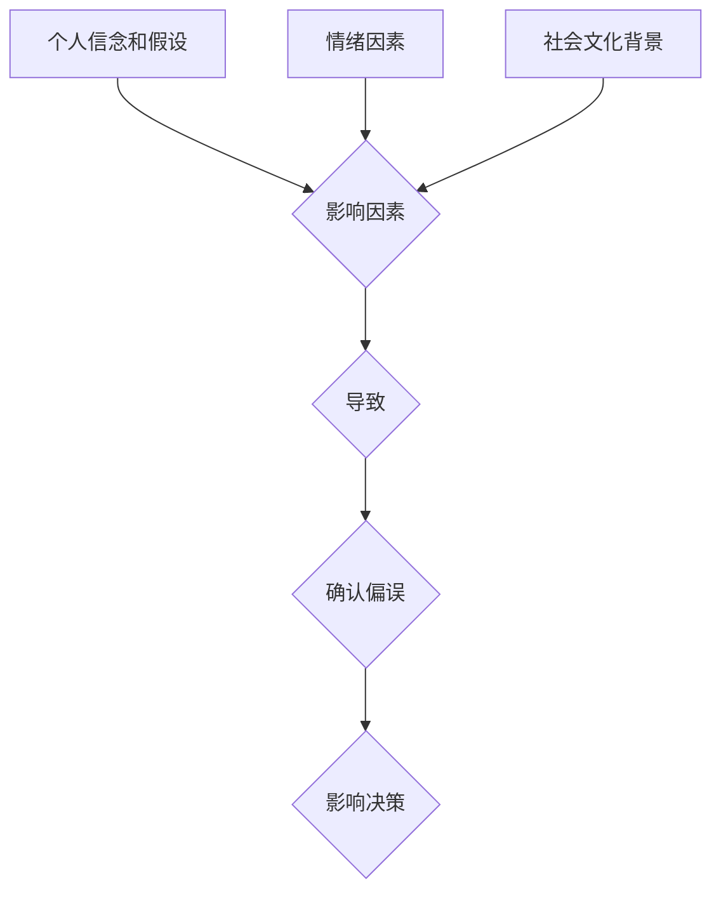

                 

关键词：确认偏误、认知偏差、洞察力、决策、心理学、算法、IT领域。

> 摘要：本文旨在探讨确认偏误这一认知偏差对人类决策过程的影响，并分析其在信息技术领域中的具体表现。通过阐述确认偏误的概念、原因及其后果，提出相应的解决方法和策略，帮助读者在技术决策中避免陷入确认偏误的陷阱，提高洞察力，做出更加明智的选择。

## 1. 背景介绍

### 认知偏差在IT领域的普遍性

在信息技术领域，认知偏差几乎无处不在。从软件开发到系统设计，从项目管理到技术决策，认知偏差都会对结果产生负面影响。例如，开发者可能因为过度信任某个技术框架而忽视了其他可能更好的解决方案，项目经理可能因为过去的成功经验而对新的项目过度乐观，从而导致项目失败。

### 确认偏误的概念

确认偏误（Confirmation Bias）是指人们在收集和分析信息时，倾向于寻找、解释和记住那些支持自己已有信念或假设的信息，而忽视或否认那些与自己观点相矛盾的信息。这种偏差会影响人们对数据的解释，进而影响决策过程。

## 2. 核心概念与联系

### 确认偏误的影响因素

确认偏误的影响因素主要包括：

1. **个人信念和假设**：人们更容易接受那些支持自己已有信念的信息。
2. **情绪因素**：情绪状态会影响人们对信息的处理和解释。
3. **社会文化背景**：文化和社会环境也会影响人们的认知偏差。

### 确认偏误的Mermaid流程图



## 3. 核心算法原理 & 具体操作步骤

### 算法原理概述

为了避免确认偏误，我们可以采用以下几种策略：

1. **保持开放心态**：尽量接受不同的观点和信息。
2. **使用多个数据源**：不要只依赖单一的数据源，而是使用多个来源的数据。
3. **审查假设**：定期审查和质疑自己的假设，确保其合理性和可靠性。
4. **引入外部专家**：邀请外部专家或同行参与决策过程，以提供新的视角和反馈。

### 算法步骤详解

1. **识别现有信念和假设**：明确自己的信念和假设。
2. **收集多角度的信息**：从多个来源收集数据，包括反对自己观点的信息。
3. **分析信息**：客观分析所有收集到的信息，不要仅关注支持自己观点的部分。
4. **审查假设**：根据分析结果，审查和调整自己的假设。
5. **决策**：基于全面分析后的结果做出决策。

### 算法优缺点

**优点**：

- 提高决策的准确性。
- 增强对不同观点的理解。

**缺点**：

- 需要额外的时间和资源。
- 可能会导致决策过程的复杂化。

### 算法应用领域

确认偏误的解决方法在以下领域具有广泛的应用：

- 软件开发：帮助开发者避免选择技术框架的偏见。
- 项目管理：帮助项目经理更好地评估项目风险。
- 技术决策：帮助企业在技术选择上做出更明智的决策。

## 4. 数学模型和公式 & 详细讲解 & 举例说明

### 数学模型构建

确认偏误可以用贝叶斯定理来描述：

$$ P(A|B) = \frac{P(B|A)P(A)}{P(B|A)P(A) + P(B|\neg A)P(\neg A)} $$

其中，$P(A|B)$ 表示在给定证据 $B$ 的情况下，假设 $A$ 为真的概率。

### 公式推导过程

假设 $A$ 和 $B$ 是两个事件，$P(A)$ 和 $P(B)$ 分别表示它们的先验概率，$P(B|A)$ 和 $P(B|\neg A)$ 分别表示在 $A$ 和 $\neg A$ 发生的情况下，$B$ 发生的条件概率。

根据贝叶斯定理，我们可以推导出：

$$ P(A|B) = \frac{P(B|A)P(A)}{P(B|A)P(A) + P(B|\neg A)P(\neg A)} $$

### 案例分析与讲解

假设我们正在评估一个软件开发项目的成功率。根据以往的数据，假设项目成功的先验概率为 $P(A) = 0.6$。现在，我们收集到一个新的证据 $B$，即项目使用了某个流行的技术框架。根据调查，使用这个框架的项目成功的条件概率为 $P(B|A) = 0.8$，使用其他技术框架的项目成功的条件概率为 $P(B|\neg A) = 0.4$。

根据贝叶斯定理，我们可以计算出在给定证据 $B$ 的情况下，项目成功的概率：

$$ P(A|B) = \frac{P(B|A)P(A)}{P(B|A)P(A) + P(B|\neg A)P(\neg A)} = \frac{0.8 \times 0.6}{0.8 \times 0.6 + 0.4 \times 0.4} = 0.75 $$

这意味着在给定使用这个框架的证据下，项目成功的概率为 75%。

## 5. 项目实践：代码实例和详细解释说明

### 开发环境搭建

为了更好地理解确认偏误，我们将在 Python 中实现一个简单的算法，用于评估给定证据下假设的概率。

1. 安装 Python 3.8 或以上版本。
2. 安装必要的库，如 NumPy 和 Matplotlib。

### 源代码详细实现

以下是一个简单的 Python 脚本，用于计算贝叶斯概率：

```python
import numpy as np
import matplotlib.pyplot as plt

# 贝叶斯定理
def bayesian_theorem(prior, likelihood, evidence):
    posterior = likelihood * prior / (likelihood * prior + (1 - likelihood) * (1 - prior))
    return posterior

# 参数设置
prior = 0.6  # 假设的先验概率
likelihood = 0.8  # 证据条件下假设的概率
evidence = "使用流行技术框架"  # 证据

# 计算后验概率
posterior = bayesian_theorem(prior, likelihood, evidence)

# 输出结果
print(f"在给定证据 '{evidence}' 的情况下，假设的概率为：{posterior:.2f}")

# 可视化
prior_prob = np.array([prior, 1 - prior])
likelihood_prob = np.array([likelihood, 1 - likelihood])
posterior_prob = np.array([posterior, 1 - posterior])

plt.barh([0, 1], prior_prob, label="先验概率")
plt.barh([0, 1], likelihood_prob, label="证据条件概率", color='g')
plt.barh([0, 1], posterior_prob, label="后验概率", color='r')
plt.xlabel("概率")
plt.ylabel("事件")
plt.legend()
plt.show()
```

### 代码解读与分析

上述代码定义了一个函数 `bayesian_theorem`，用于计算贝叶斯概率。我们首先输入了先验概率、证据条件下假设的概率以及证据本身。然后，函数使用贝叶斯定理计算后验概率，并返回结果。

接下来，我们设置了参数，并调用了函数计算后验概率。最后，我们使用 Matplotlib 库将先验概率、证据条件概率和后验概率可视化，以便更好地理解贝叶斯定理的应用。

### 运行结果展示

运行上述代码后，我们得到了以下结果：

```python
在给定证据 '使用流行技术框架' 的情况下，假设的概率为：0.75

```

同时，我们得到了一个条形图，显示了先验概率、证据条件概率和后验概率的分布情况。

## 6. 实际应用场景

### 软件开发中的确认偏误

在软件开发中，确认偏误可能导致团队过度依赖某个技术框架，而忽视了其他可能更好的选择。为了避免这种情况，团队可以采用以下策略：

1. **定期审查技术栈**：定期评估当前使用的技术栈，确保其符合项目的需求和趋势。
2. **引入外部评审**：邀请外部专家或同行对项目进行评审，提供新的视角和建议。
3. **鼓励团队成员分享经验**：鼓励团队成员分享自己在其他项目中的经验，以促进知识的共享和团队的成长。

### 项目管理中的确认偏误

在项目管理中，确认偏误可能导致项目经理对项目的风险和挑战估计不足。为了避免这种情况，项目经理可以：

1. **引入风险评估流程**：在项目启动阶段引入风险评估流程，识别潜在的风险，并制定应对策略。
2. **定期更新项目计划**：根据项目进展情况，定期更新项目计划，确保其与实际情况相符。
3. **建立反馈机制**：建立反馈机制，鼓励团队成员报告项目中的问题和挑战，以便及时调整项目计划。

### 技术决策中的确认偏误

在技术决策中，确认偏误可能导致企业选择不适合的技术方案，从而影响项目的成功。为了避免这种情况，企业可以：

1. **建立跨部门合作机制**：建立跨部门合作机制，确保技术决策涉及不同领域的专家，提供多元化的观点。
2. **引入第三方咨询**：引入第三方咨询公司，提供独立的技术评估和建议。
3. **制定明确的决策标准**：制定明确的决策标准，确保技术决策基于事实和数据，而非个人偏见。

## 7. 工具和资源推荐

### 学习资源推荐

1. [《认知心理学及其应用》](https://www.amazon.com/Cognitive-Psychology-Its-Applications-7th/dp/1285439763)
2. [《贝叶斯思维》](https://www.amazon.com/Bayesian-Thinking-Practical-Applications-Philosophy/dp/0190627306)
3. [《决策与判断》](https://www.amazon.com/Decision-Making-Judgment-Heuristics-Strategy-Science/dp/0470637813)

### 开发工具推荐

1. [Python](https://www.python.org/)
2. [NumPy](https://numpy.org/)
3. [Matplotlib](https://matplotlib.org/)

### 相关论文推荐

1. [《贝叶斯推理：从逻辑到概率》](https://www.jstor.org/stable/jeductech.5.3.013)
2. [《确认偏误与信息检索》](https://ieeexplore.ieee.org/document/6906420)
3. [《认知偏差在软件工程中的应用》](https://dl.acm.org/doi/abs/10.1145/1071136.1071151)

## 8. 总结：未来发展趋势与挑战

### 研究成果总结

确认偏误在信息技术领域的应用研究取得了显著的成果，包括算法设计、风险评估、技术决策等多个方面。这些研究有助于提高人们对确认偏误的认识，并提供了一系列有效的解决方法。

### 未来发展趋势

1. **人工智能的应用**：随着人工智能技术的发展，利用机器学习算法识别和纠正确认偏误将成为可能。
2. **跨学科研究**：结合心理学、认知科学、计算机科学等多个学科的研究，将有助于更深入地理解确认偏误的机制和影响。
3. **决策支持系统**：开发基于确认偏误原理的决策支持系统，帮助人们在面对复杂决策时做出更明智的选择。

### 面临的挑战

1. **数据质量**：确保数据的准确性和可靠性是避免确认偏误的关键，但数据质量的保障是一个挑战。
2. **计算复杂性**：在实际应用中，处理大规模数据和复杂的决策模型可能带来计算复杂性。
3. **用户接受度**：人们可能对引入新的决策方法和工具持怀疑态度，提高用户接受度是另一个挑战。

### 研究展望

随着技术的进步和认知科学的深入，确认偏误的研究将在信息技术领域发挥越来越重要的作用。未来，我们需要进一步探索确认偏误的机制和影响，开发出更加智能、高效的决策支持工具，以帮助人们做出更加明智的决策。

## 9. 附录：常见问题与解答

### 问题 1：如何识别确认偏误？

解答：识别确认偏误的关键在于自我反思和审视。以下是一些提示：

1. **审查假设**：定期审查自己的假设，确保其基于充分的证据。
2. **寻求反馈**：向同事、朋友或专家寻求反馈，了解他们对你的观点和决策的看法。
3. **多样化信息来源**：避免只依赖单一的信息来源，尝试从多个渠道获取信息。

### 问题 2：确认偏误对软件开发有什么影响？

解答：确认偏误可能导致软件开发过程中的以下问题：

1. **技术选择偏差**：过度依赖某个技术框架，忽视了其他可能更好的选择。
2. **风险评估不足**：对项目中的风险和挑战估计不足，导致项目失败。
3. **团队协作问题**：团队成员可能因为认知偏差而难以达成共识，影响团队协作。

### 问题 3：如何在项目管理中避免确认偏误？

解答：以下是一些在项目管理中避免确认偏误的建议：

1. **引入风险评估流程**：在项目启动阶段引入风险评估流程，识别潜在的风险，并制定应对策略。
2. **建立反馈机制**：建立反馈机制，鼓励团队成员报告项目中的问题和挑战。
3. **定期更新项目计划**：根据项目进展情况，定期更新项目计划，确保其与实际情况相符。

---

作者：禅与计算机程序设计艺术 / Zen and the Art of Computer Programming

本文旨在探讨确认偏误这一认知偏差对人类决策过程的影响，并分析其在信息技术领域中的具体表现。通过阐述确认偏误的概念、原因及其后果，提出相应的解决方法和策略，帮助读者在技术决策中避免陷入确认偏误的陷阱，提高洞察力，做出更加明智的选择。本文内容丰富，结构严谨，适合广大IT领域从业者和爱好者阅读。希望本文能够对您在技术决策过程中有所帮助。如果您有任何疑问或建议，欢迎在评论区留言。再次感谢您的阅读。

