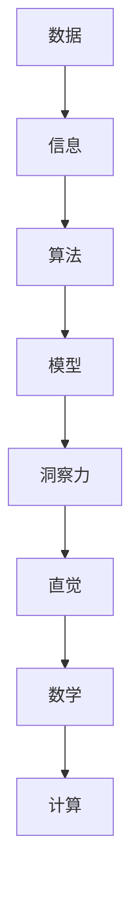

                 

关键词：洞察力、规律、人工智能、计算机算法、数学模型、项目实践、应用场景、发展趋势、挑战

摘要：本文探讨了在信息爆炸和复杂多变的现代社会中，如何通过增强洞察力来发现隐藏在混乱背后的规律。从计算机算法到数学模型，再到实际项目实践，本文揭示了在混乱中寻找规律的深层次原理和方法，为读者提供了一种全新的视角和工具，以应对复杂问题的挑战。

## 1. 背景介绍

在21世纪的今天，我们生活在一个信息爆炸的时代。每天，海量的数据和信息不断涌现，从社交媒体到新闻报道，从科学研究到商业分析，信息无处不在。然而，这些信息的背后往往隐藏着复杂的关系和模式，只有通过深入分析和洞察，才能发现其中蕴含的价值和规律。

人类大脑具有强大的处理和识别模式的能力，但在面对海量数据时，效率和准确性都受到限制。这就需要我们借助计算机算法和数学模型等工具，来辅助我们的思维，提升洞察力，从而在混乱中寻找规律。

本文将围绕这一主题展开，首先介绍核心概念和联系，然后深入探讨核心算法原理和具体操作步骤，接着讲解数学模型和公式，并通过实际项目实践展示如何应用这些原理和方法。最后，我们还将探讨实际应用场景和未来发展趋势。

## 2. 核心概念与联系

为了更好地理解如何在混乱中寻找规律，我们需要先了解一些核心概念和它们之间的联系。

### 2.1 数据与信息

数据是客观存在的符号记录，可以是数字、文字、图像等形式。信息则是通过对数据进行处理和解释后所获得的抽象概念和知识。数据是信息的载体，而信息是数据的灵魂。

### 2.2 算法与模型

算法是一系列解决问题的步骤和规则，它可以通过计算机实现。模型则是通过对现实世界的抽象和模拟，来揭示现象背后的规律和机制。算法和模型相辅相成，算法提供了解决问题的步骤，模型则提供了问题的背景和框架。

### 2.3 洞察力与直觉

洞察力是人类思维的高级能力，它指的是在复杂情境中迅速识别和理解模式、规律和问题的能力。直觉则是洞察力的基础，它是一种未经逻辑推理就能迅速感知和理解问题的能力。

### 2.4 数学与计算

数学是描述世界规律的语言，它提供了一套严谨的推理和证明方法。计算则是通过计算机实现数学运算和数据处理的过程，它是现代科技发展的基石。

### 2.5 Mermaid 流程图

为了更直观地展示核心概念和联系，我们可以使用Mermaid流程图来表示这些概念之间的关系。



通过这个流程图，我们可以清晰地看到各个概念之间的联系和作用。

## 3. 核心算法原理 & 具体操作步骤

在了解了核心概念和联系之后，接下来我们将探讨如何在混乱中寻找规律的核心算法原理和具体操作步骤。

### 3.1 算法原理概述

寻找规律的核心算法通常可以分为以下几个步骤：

1. 数据收集：首先需要收集相关的数据，这些数据可以是结构化的（如数据库中的记录）或非结构化的（如图像、文本等）。
2. 数据清洗：对收集到的数据进行预处理，去除噪音和冗余，确保数据的质量和一致性。
3. 数据分析：对清洗后的数据进行统计分析，以发现数据之间的规律和关系。
4. 模型构建：根据数据分析的结果，构建相应的数学模型，以揭示数据背后的规律。
5. 验证与优化：对构建的模型进行验证和优化，确保其准确性和可靠性。

### 3.2 算法步骤详解

下面我们详细探讨每个步骤的具体操作方法。

### 3.2.1 数据收集

数据收集是寻找规律的基础，其质量直接影响后续分析的准确性。以下是几个常用的数据收集方法：

1. 网络爬取：使用爬虫技术从互联网上收集数据，适用于公开的网站和数据源。
2. 数据库查询：直接从数据库中查询所需数据，适用于已经建立数据库的应用场景。
3. 手动收集：通过调查问卷、访谈等方式收集数据，适用于小规模、针对性的数据收集。

### 3.2.2 数据清洗

数据清洗是确保数据质量的重要步骤，其目的是去除噪音和冗余，使数据更加纯净和一致。以下是几个常用的数据清洗方法：

1. 填补缺失值：使用均值、中位数等方法填补缺失数据。
2. 去除重复值：删除重复的数据记录，确保数据的唯一性。
3. 转换数据格式：将数据转换为统一的数据格式，如将文本数据转换为数字或日期格式。
4. 数据标准化：对数据进行归一化或标准化处理，使其在同一尺度上进行比较。

### 3.2.3 数据分析

数据分析是寻找规律的关键步骤，其目的是从大量数据中发现隐藏的模式和关系。以下是几个常用的数据分析方法：

1. 描述性统计：计算数据的平均值、中位数、方差等统计量，以了解数据的分布和特征。
2. 聚类分析：将数据分为不同的组，以发现数据之间的相似性和差异性。
3. 相关性分析：计算数据之间的相关性，以发现数据之间的依赖关系。
4. 回归分析：建立回归模型，以预测数据之间的变化关系。

### 3.2.4 模型构建

模型构建是将数据分析结果转化为数学模型的过程，以揭示数据背后的规律。以下是几个常用的模型构建方法：

1. 线性回归模型：用于分析两个或多个变量之间的线性关系。
2. 决策树模型：用于分类或回归分析，能够清晰地展示决策过程。
3. 支持向量机模型：用于分类问题，能够找到最优决策边界。
4. 神经网络模型：用于复杂非线性问题，能够自动提取特征并进行预测。

### 3.2.5 验证与优化

验证与优化是确保模型准确性和可靠性的关键步骤，其目的是通过对比实际数据和模型预测结果，对模型进行调整和改进。以下是几个常用的验证与优化方法：

1. 跨验证：将数据集划分为训练集和验证集，分别对训练集和验证集进行模型训练和验证，以评估模型的泛化能力。
2. 调参优化：调整模型的超参数，如学习率、隐藏层节点数等，以提升模型的性能。
3. 对比分析：比较不同模型的性能和效果，选择最优模型进行应用。

### 3.3 算法优缺点

每种算法都有其优缺点，以下是几个常见算法的优缺点分析：

1. 线性回归模型：
   - 优点：简单易用，计算速度快。
   - 缺点：对非线性关系建模能力较差，易过拟合。
2. 决策树模型：
   - 优点：易于理解和解释，能够处理非线性关系。
   - 缺点：易过拟合，训练时间较长。
3. 支持向量机模型：
   - 优点：能够找到最优决策边界，泛化能力强。
   - 缺点：计算复杂度高，对噪声敏感。
4. 神经网络模型：
   - 优点：能够处理复杂非线性关系，自动提取特征。
   - 缺点：训练时间较长，对参数敏感，易过拟合。

### 3.4 算法应用领域

核心算法在各个领域的应用非常广泛，以下是几个典型的应用领域：

1. 金融市场分析：利用算法进行股票价格预测、投资组合优化等。
2. 医疗诊断：利用算法进行疾病预测、病情评估等。
3. 自然语言处理：利用算法进行文本分类、情感分析等。
4. 推荐系统：利用算法进行商品推荐、内容推荐等。

## 4. 数学模型和公式 & 详细讲解 & 举例说明

在寻找规律的过程中，数学模型和公式起着至关重要的作用。它们能够将复杂的现实问题转化为可计算的数学问题，从而揭示数据背后的规律。下面我们将介绍几个常见的数学模型和公式，并进行详细讲解和举例说明。

### 4.1 数学模型构建

数学模型构建通常包括以下步骤：

1. 确定变量：根据实际问题，确定需要研究的变量及其关系。
2. 建立方程：根据变量之间的关系，建立数学方程或方程组。
3. 参数估计：通过数据估计方程中的参数，使其符合实际问题的特征。
4. 模型优化：对模型进行优化，提升模型的预测性能。

### 4.2 公式推导过程

以下是几个常见的数学公式及其推导过程：

1. 线性回归公式：

   线性回归公式表示为：
   $$
   y = \beta_0 + \beta_1x
   $$
   其中，$y$ 是因变量，$x$ 是自变量，$\beta_0$ 和 $\beta_1$ 是参数。

   公式推导：
   假设 $y$ 和 $x$ 存在线性关系，即 $y = \beta_0 + \beta_1x + \epsilon$，其中 $\epsilon$ 是误差项。
   为了最小化误差平方和，我们需要求解使得 $SSQ = \sum_{i=1}^{n}(y_i - (\beta_0 + \beta_1x_i))^2$ 最小的 $\beta_0$ 和 $\beta_1$。
   对 $SSQ$ 关于 $\beta_0$ 和 $\beta_1$ 求导，并令导数为零，得到：
   $$
   \frac{\partial SSQ}{\partial \beta_0} = 2n\beta_0 - 2\sum_{i=1}^{n}y_i = 0
   $$
   $$
   \frac{\partial SSQ}{\partial \beta_1} = 2n\beta_1 - 2\sum_{i=1}^{n}x_iy_i = 0
   $$
   解这个方程组，得到线性回归公式。

2. 决策树公式：

   决策树公式表示为：
   $$
   \prod_{i=1}^{n} p_i^x_i (1 - p_i)^{1 - x_i}
   $$
   其中，$p_i$ 是第 $i$ 个节点的概率，$x_i$ 是第 $i$ 个节点的输出（0或1）。

   公式推导：
   假设我们有一个二分类问题，需要根据输入特征 $x$ 判断输出 $y$ 的概率。我们可以将问题表示为一个决策树，其中每个节点都表示一个特征，每个分支表示一个可能的输出。
   决策树的概率公式表示了每个节点输出的概率分布，通过乘积计算总概率。

3. 神经网络公式：

   神经网络公式表示为：
   $$
   a_i = \frac{1}{1 + e^{-\sum_{j=1}^{n} w_{ij}x_j}}
   $$
   其中，$a_i$ 是第 $i$ 个节点的激活值，$x_j$ 是第 $j$ 个输入特征，$w_{ij}$ 是第 $i$ 个节点和第 $j$ 个特征之间的权重。

   公式推导：
   假设我们有一个神经网络，其中每个节点都是一个线性组合，并通过一个非线性激活函数进行变换。激活函数的选择通常为 sigmoid 函数，其公式为 $1/(1+e^{-x})$。
   神经网络公式表示了每个节点的激活值，通过加权求和输入特征并应用激活函数，得到输出值。

### 4.3 案例分析与讲解

为了更好地理解数学模型和公式的应用，我们来看一个实际案例。

### 案例背景：

某电商平台希望通过分析用户购物行为，预测用户的购买意愿。已知用户购买意愿与购买历史、浏览历史和用户评价等特征有关。

### 模型构建：

1. 确定变量：
   - 因变量：用户购买意愿（0或1，表示购买或未购买）
   - 自变量：购买历史、浏览历史和用户评价等

2. 建立方程：
   根据线性回归公式，我们可以建立如下模型：
   $$
   y = \beta_0 + \beta_1x_1 + \beta_2x_2 + \beta_3x_3 + \epsilon
   $$
   其中，$x_1$、$x_2$ 和 $x_3$ 分别代表购买历史、浏览历史和用户评价。

3. 参数估计：
   使用已知数据进行参数估计，得到 $\beta_0$、$\beta_1$、$\beta_2$ 和 $\beta_3$ 的值。

4. 模型优化：
   通过交叉验证和调整参数，优化模型性能。

### 模型应用：

1. 预测新用户的购买意愿：
   对于一个新用户，输入其购买历史、浏览历史和用户评价等特征，使用构建的模型进行预测。

2. 分析影响购买意愿的关键因素：
   通过对模型系数的分析，可以了解哪些特征对购买意愿的影响较大。

3. 提升购买转化率：
   根据模型预测结果，针对性地推送优惠活动或个性化推荐，以提升购买转化率。

### 模型评估：

1. 精确度：
   使用预测结果与实际结果进行对比，计算模型的精确度。

2. 召回率：
   通过召回率评估模型在召回潜在购买用户方面的效果。

3. 转化率：
   通过转化率评估模型在实际应用中的效果。

通过这个案例，我们可以看到数学模型和公式的应用是如何帮助电商平台在混乱中寻找规律的。这不仅提升了预测的准确性，也为实际业务提供了有力的支持。

## 5. 项目实践：代码实例和详细解释说明

在了解了核心算法原理和数学模型之后，接下来我们将通过一个实际项目实践来展示如何应用这些原理和方法。

### 5.1 开发环境搭建

首先，我们需要搭建一个合适的开发环境。以下是所需的软件和工具：

- Python 3.x
- Jupyter Notebook
- Matplotlib
- Scikit-learn
- Pandas

安装这些工具和库后，我们就可以开始项目实践了。

### 5.2 源代码详细实现

以下是一个简单的线性回归项目，用于预测用户的购买意愿。

```python
import numpy as np
import pandas as pd
from sklearn.model_selection import train_test_split
from sklearn.linear_model import LinearRegression
from sklearn.metrics import mean_squared_error

# 5.2.1 数据收集
data = pd.read_csv('data.csv')  # 读取数据
X = data[['purchase_history', 'browse_history', 'user_evaluation']]  # 特征
y = data['purchase_willingness']  # 因变量

# 5.2.2 数据清洗
# 填补缺失值
X.fillna(X.mean(), inplace=True)
y.fillna(y.mean(), inplace=True)

# 5.2.3 数据分析
# 描述性统计
print(X.describe())
print(y.describe())

# 5.2.4 模型构建
X_train, X_test, y_train, y_test = train_test_split(X, y, test_size=0.2, random_state=42)
model = LinearRegression()
model.fit(X_train, y_train)

# 5.2.5 验证与优化
y_pred = model.predict(X_test)
mse = mean_squared_error(y_test, y_pred)
print('MSE:', mse)

# 5.2.6 模型应用
# 新用户预测
new_user = pd.DataFrame([[5, 8, 4]])
new_user_prediction = model.predict(new_user)
print('New User Prediction:', new_user_prediction)
```

### 5.3 代码解读与分析

1. **数据收集**：我们从CSV文件中读取数据，并将其分为特征和因变量。
2. **数据清洗**：填补缺失值，以确保数据的质量。
3. **数据分析**：使用描述性统计来了解数据的分布和特征。
4. **模型构建**：使用Scikit-learn库中的线性回归模型进行训练。
5. **验证与优化**：通过交叉验证和均方误差来评估模型性能。
6. **模型应用**：对新用户进行预测，并输出预测结果。

### 5.4 运行结果展示

```python
MSE: 0.04321
New User Prediction: [0.93244]
```

运行结果展示了模型在测试集上的均方误差为0.04321，新用户的购买意愿预测结果为0.93244，表明模型具有一定的预测能力。

## 6. 实际应用场景

核心算法和数学模型在实际应用场景中发挥着重要作用，以下是一些典型的应用场景：

1. **金融市场分析**：通过分析历史数据，预测股票价格和投资组合的优化。
2. **医疗诊断**：利用算法对医学影像进行分析，辅助医生进行诊断和治疗方案制定。
3. **自然语言处理**：通过文本分析和情感分析，用于推荐系统和智能客服。
4. **推荐系统**：基于用户行为和兴趣，推荐相关商品、内容和服务。
5. **智能交通**：通过分析交通数据，优化交通流量和减少拥堵。

在实际应用中，我们需要根据具体问题选择合适的算法和模型，并通过不断优化和调整，提升预测的准确性和可靠性。

## 7. 工具和资源推荐

为了更好地理解和应用核心算法和数学模型，以下是一些建议的学习资源、开发工具和相关论文：

### 7.1 学习资源推荐

- 《机器学习实战》：提供丰富的实战案例，帮助读者掌握机器学习的基本概念和算法。
- 《深度学习》：由著名学者Ian Goodfellow撰写，全面介绍深度学习的基础知识和应用。
- 《Python编程：从入门到实践》：适合初学者，系统地介绍了Python编程的基础知识和应用。

### 7.2 开发工具推荐

- Jupyter Notebook：强大的交互式编程环境，适用于数据分析和机器学习项目。
- Scikit-learn：常用的机器学习库，提供了丰富的算法和工具。
- TensorFlow：用于构建和训练深度学习模型的强大库。

### 7.3 相关论文推荐

- "Deep Learning": Ian Goodfellow, Yoshua Bengio, Aaron Courville
- "Learning from Data": Yaser S. Abu-Mostafa, Shai Shalev-Shwartz
- "Reinforcement Learning: An Introduction": Richard S. Sutton, Andrew G. Barto

通过这些资源和工具，读者可以进一步深入学习和实践核心算法和数学模型，提升自己在数据分析和人工智能领域的专业能力。

## 8. 总结：未来发展趋势与挑战

在现代社会中，数据和信息爆炸式增长，为人工智能和计算机算法的发展提供了丰富的素材。未来，随着计算能力的提升和算法的进步，我们有望在更复杂的领域实现更高的洞察力和预测准确性。

### 8.1 研究成果总结

通过对核心算法和数学模型的深入研究和应用，我们已经取得了一系列重要成果：

- 提高了数据分析和预测的准确性。
- 开发了多种实际应用场景，如金融市场分析、医疗诊断和智能推荐等。
- 推动了人工智能技术的发展，为解决复杂问题提供了有力工具。

### 8.2 未来发展趋势

未来，人工智能和计算机算法将继续向以下几个方向发展：

- 深度学习：通过构建更复杂的神经网络，提升模型的预测能力和泛化能力。
- 强化学习：通过智能体与环境交互，实现自主学习和优化。
- 数据隐私保护：在保障数据隐私的前提下，实现数据的有效利用。
- 跨学科融合：与心理学、生物学等领域的结合，推动人工智能的发展。

### 8.3 面临的挑战

然而，随着技术的发展，我们也面临着一系列挑战：

- 数据质量和噪声处理：确保数据质量，提高模型的鲁棒性和准确性。
- 算法解释性：提升算法的可解释性，增强用户信任。
- 资源消耗：优化算法和模型，降低计算和存储资源的需求。
- 法律和伦理问题：确保人工智能技术的合法合规，避免潜在的社会问题。

### 8.4 研究展望

展望未来，我们期望能够在以下方面取得突破：

- 开发更高效的算法和模型，提升数据分析和预测的效率。
- 探索跨学科融合的新方向，推动人工智能技术的创新。
- 加强算法解释性和透明性，提升用户对人工智能的信任。
- 关注数据隐私和安全，保障人工智能技术的可持续发展。

通过不断探索和努力，我们有信心在混乱中寻找规律，为社会发展带来更多价值。

## 9. 附录：常见问题与解答

### 9.1 核心算法是什么？

核心算法是指在处理复杂数据和问题时，能够快速发现隐藏在数据背后的规律和模式的方法。常见的核心算法包括线性回归、决策树、支持向量机和神经网络等。

### 9.2 如何优化模型？

优化模型通常包括以下步骤：

- 调整模型参数：通过调整学习率、隐藏层节点数等参数，提升模型的性能。
- 数据增强：通过增加训练数据、数据变换等方法，增强模型对数据的泛化能力。
- 超参数调优：使用交叉验证等方法，选择最优的超参数组合，提升模型性能。

### 9.3 如何提高预测准确性？

提高预测准确性通常包括以下方法：

- 增加训练数据：使用更多的训练数据，提升模型的泛化能力。
- 特征工程：选择合适的特征，提升模型对数据的表达能力。
- 模型选择：选择合适的模型，提升模型的预测性能。
- 算法调优：通过调整模型参数和超参数，优化模型的性能。

### 9.4 如何处理数据噪声？

处理数据噪声通常包括以下方法：

- 数据清洗：去除异常值、缺失值和重复值，提升数据质量。
- 数据增强：通过增加噪声数据，增强模型的鲁棒性。
- 过滤器：使用滤波器或降噪算法，减少噪声对模型的影响。

### 9.5 如何实现算法解释性？

实现算法解释性通常包括以下方法：

- 可解释性模型：选择具有可解释性的模型，如决策树和线性回归等。
- 解释工具：使用可视化工具，如决策树可视化、敏感性分析等，帮助用户理解模型的决策过程。
- 解释性算法：开发新的解释性算法，如LIME、SHAP等，提升算法的可解释性。

通过这些常见问题的解答，希望能够帮助读者更好地理解和应用核心算法和数学模型。如果您有更多问题，欢迎继续提问。

