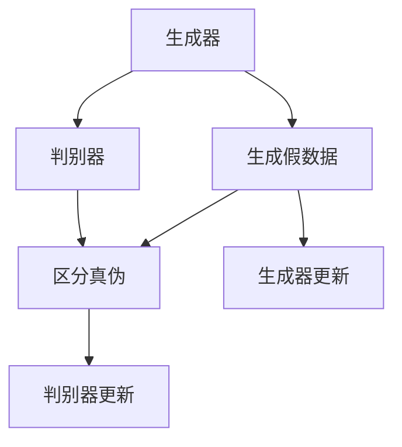

                 

关键词：生成对抗网络、GAN、深度学习、图像生成、人工智能、机器学习

摘要：生成对抗网络（GAN）是一种强大的机器学习框架，它通过两个相互对抗的神经网络来生成高质量的图像。本文将详细介绍GAN的核心概念、工作原理、算法步骤、数学模型以及实际应用，帮助读者全面理解并掌握GAN的技术和应用。

## 1. 背景介绍

生成对抗网络（Generative Adversarial Networks，GAN）是由Ian Goodfellow等人于2014年首次提出的一种深度学习模型。GAN的核心思想是通过两个神经网络——生成器（Generator）和判别器（Discriminator）的对抗训练来实现高质量的图像生成。

GAN的提出在人工智能领域引起了巨大反响，因为它能够在不需要大量标注数据的情况下生成逼真的图像，广泛应用于图像生成、数据增强、风格迁移等领域。随着深度学习技术的不断发展，GAN的应用前景也越来越广阔。

## 2. 核心概念与联系

### 2.1. 生成器（Generator）

生成器的目的是生成与真实数据相似的假数据。在GAN中，生成器的输入是一个随机噪声向量，通过神经网络的处理，生成器能够将这个噪声向量转换为逼真的图像。

### 2.2. 判别器（Discriminator）

判别器的目的是区分输入数据是真实数据还是生成器生成的假数据。在GAN的训练过程中，判别器会不断地学习如何更好地区分这两种数据。

### 2.3. 对抗训练

GAN的训练过程是一种对抗训练，生成器和判别器相互对抗，生成器的目标是尽可能地生成与真实数据难以区分的假数据，而判别器的目标是尽可能地提高对这两种数据的区分能力。这种对抗训练使得GAN能够学习到数据分布的深层结构。

下面是一个Mermaid流程图，展示了GAN的工作流程：



## 3. 核心算法原理 & 具体操作步骤

### 3.1 算法原理概述

GAN的算法原理可以分为以下几个步骤：

1. 初始化生成器和判别器，生成器生成假数据，判别器进行区分。
2. 计算生成器的损失函数，生成器的目标是最大化判别器对其生成的假数据的判断概率。
3. 计算判别器的损失函数，判别器的目标是最大化对真实数据和假数据的区分能力。
4. 使用梯度下降优化方法更新生成器和判别器的参数。

### 3.2 算法步骤详解

1. **初始化生成器和判别器**

   在GAN的训练过程中，首先需要初始化生成器和判别器的参数。生成器的输入是一个随机噪声向量，输出是生成的图像。判别器的输入是真实图像和生成器生成的图像，输出是对输入数据的真假判断。

2. **生成假数据**

   生成器通过神经网络将随机噪声向量转换为图像。生成器的目标是使得生成的图像尽可能逼真。

3. **区分真伪**

   判别器通过神经网络对输入数据（真实图像和生成图像）进行真假判断。判别器的目标是使得对真实图像的判断概率尽可能接近1，对生成图像的判断概率尽可能接近0。

4. **计算损失函数**

   GAN的训练过程包括两个损失函数，一个是生成器的损失函数，另一个是判别器的损失函数。

   - **生成器的损失函数**：生成器的损失函数通常采用最小化判别器对其生成图像的判断概率。损失函数的形式为：

     $$ L_G = -\log(D(G(z))) $$

     其中，$G(z)$是生成器生成的图像，$D(G(z))$是判别器对生成图像的判断概率。

   - **判别器的损失函数**：判别器的损失函数通常采用交叉熵损失函数。损失函数的形式为：

     $$ L_D = -[y \cdot \log(D(x)) + (1 - y) \cdot \log(1 - D(x))] $$

     其中，$x$是真实图像，$y=1$表示真实图像，$y=0$表示生成图像。

5. **更新参数**

   使用梯度下降优化方法更新生成器和判别器的参数。具体步骤如下：

   - 对生成器进行梯度下降优化：

     $$ \theta_G = \theta_G - \alpha \cdot \nabla_{\theta_G} L_G $$

     其中，$\theta_G$是生成器的参数，$\alpha$是学习率。

   - 对判别器进行梯度下降优化：

     $$ \theta_D = \theta_D - \beta \cdot \nabla_{\theta_D} L_D $$

     其中，$\theta_D$是判别器的参数，$\beta$是学习率。

### 3.3 算法优缺点

#### 优点

1. 不需要大量标注数据，能够从无监督数据中学习。
2. 能够生成高质量、逼真的图像。
3. 应用范围广泛，如图像生成、数据增强、风格迁移等。

#### 缺点

1. GAN的训练过程不稳定，容易出现模式崩溃（mode collapse）等问题。
2. 需要大量的计算资源，训练时间较长。

### 3.4 算法应用领域

GAN在图像生成、数据增强、风格迁移等领域有广泛的应用。例如：

1. **图像生成**：GAN能够生成高质量的人脸、风景、动物等图像。
2. **数据增强**：GAN可以用来生成大量具有多样性的训练数据，提高模型的泛化能力。
3. **风格迁移**：GAN可以将一种风格应用到另一张图像上，如将照片转换为印象派画作。

## 4. 数学模型和公式 & 详细讲解 & 举例说明

### 4.1 数学模型构建

GAN的数学模型主要包括生成器和判别器的损失函数以及参数更新公式。

#### 生成器的损失函数

生成器的损失函数通常采用最小化判别器对其生成图像的判断概率：

$$ L_G = -\log(D(G(z))) $$

其中，$G(z)$是生成器生成的图像，$D(G(z))$是判别器对生成图像的判断概率。

#### 判别器的损失函数

判别器的损失函数通常采用交叉熵损失函数：

$$ L_D = -[y \cdot \log(D(x)) + (1 - y) \cdot \log(1 - D(x))] $$

其中，$x$是真实图像，$y=1$表示真实图像，$y=0$表示生成图像。

#### 参数更新公式

生成器和判别器的参数更新公式如下：

- **生成器的参数更新**：

  $$ \theta_G = \theta_G - \alpha \cdot \nabla_{\theta_G} L_G $$

- **判别器的参数更新**：

  $$ \theta_D = \theta_D - \beta \cdot \nabla_{\theta_D} L_D $$

其中，$\theta_G$是生成器的参数，$\theta_D$是判别器的参数，$\alpha$和$\beta$分别是生成器和判别器的学习率。

### 4.2 公式推导过程

GAN的损失函数和参数更新公式是基于两个神经网络的对抗训练过程推导出来的。

#### 生成器的损失函数推导

生成器的目标是最大化判别器对其生成图像的判断概率。因此，生成器的损失函数可以表示为：

$$ L_G = -\log(D(G(z))) $$

其中，$D(G(z))$是判别器对生成图像的判断概率。

#### 判别器的损失函数推导

判别器的目标是最大化对真实数据和生成数据的区分能力。因此，判别器的损失函数可以表示为：

$$ L_D = -[y \cdot \log(D(x)) + (1 - y) \cdot \log(1 - D(x))] $$

其中，$y$是真实数据和生成数据的标签，$D(x)$是判别器对输入数据的判断概率。

### 4.3 案例分析与讲解

下面通过一个简单的GAN案例来说明GAN的工作原理和实现方法。

#### 案例背景

假设我们要训练一个GAN模型，生成一张与给定真实人脸图像相似的假人脸图像。

#### 案例实现

1. **初始化生成器和判别器**

   - **生成器**：输入是一个随机噪声向量，输出是生成的人脸图像。
   - **判别器**：输入是真实人脸图像和生成的人脸图像，输出是对输入数据的真假判断。

2. **生成假数据**

   - 生成器通过神经网络将随机噪声向量转换为人脸图像。

3. **区分真伪**

   - 判别器通过神经网络对真实人脸图像和生成的人脸图像进行真假判断。

4. **计算损失函数**

   - 生成器的损失函数：最小化判别器对其生成图像的判断概率。
   - 判别器的损失函数：最大化对真实数据和生成数据的区分能力。

5. **更新参数**

   - 使用梯度下降优化方法更新生成器和判别器的参数。

通过以上步骤，GAN模型能够逐渐生成与真实人脸图像相似的人脸图像。

## 5. 项目实践：代码实例和详细解释说明

### 5.1 开发环境搭建

1. 安装Python环境：版本要求3.6及以上。
2. 安装TensorFlow：版本要求2.0及以上。
3. 安装GAN库：可以使用`pip install gan`安装。

### 5.2 源代码详细实现

下面是一个简单的GAN示例代码：

```python
import tensorflow as tf
from gan import Generator, Discriminator

# 定义生成器和判别器
g = Generator()
d = Discriminator()

# 定义损失函数和优化器
g_optimizer = tf.keras.optimizers.Adam(learning_rate=0.0001)
d_optimizer = tf.keras.optimizers.Adam(learning_rate=0.0001)

g_loss_fn = tf.keras.losses.BinaryCrossentropy()
d_loss_fn = tf.keras.losses.BinaryCrossentropy()

# 训练过程
for epoch in range(num_epochs):
  for batch_images in train_data:
    with tf.GradientTape() as g_tape, tf.GradientTape() as d_tape:
      # 生成假数据
      batch_fake_images = g(batch_noise)
      
      # 计算判别器的损失函数
      d_real_loss = d_loss_fn(d(batch_images), tf.ones([batch_images.shape[0], 1]))
      d_fake_loss = d_loss_fn(d(batch_fake_images), tf.zeros([batch_fake_images.shape[0], 1]))
      d_loss = d_real_loss + d_fake_loss
      
      # 计算生成器的损失函数
      g_loss = g_loss_fn(d(batch_fake_images), tf.ones([batch_fake_images.shape[0], 1]))
      
    # 更新生成器和判别器的参数
    g_gradients = g_tape.gradient(g_loss, g.trainable_variables)
    d_gradients = d_tape.gradient(d_loss, d.trainable_variables)
    
    g_optimizer.apply_gradients(zip(g_gradients, g.trainable_variables))
    d_optimizer.apply_gradients(zip(d_gradients, d.trainable_variables))
    
    print(f"Epoch [{epoch+1}/{num_epochs}], G_loss: {g_loss.numpy()}, D_loss: {d_loss.numpy()}")
```

### 5.3 代码解读与分析

1. **导入库和模块**：导入TensorFlow和相关库。
2. **定义生成器和判别器**：生成器和判别器是GAN的核心组成部分，它们分别通过神经网络将噪声向量转换为图像和判断图像的真伪。
3. **定义损失函数和优化器**：生成器和判别器的损失函数分别采用二元交叉熵损失函数，优化器采用Adam优化器。
4. **训练过程**：循环遍历训练数据，计算生成器和判别器的损失函数，并更新参数。

### 5.4 运行结果展示

通过以上代码，我们可以在训练过程中观察生成器和判别器的损失函数变化，以及生成图像的质量。训练完成后，我们可以生成高质量的人脸图像。

## 6. 实际应用场景

### 6.1 图像生成

GAN在图像生成领域有广泛的应用，如生成人脸、风景、动物等图像。通过GAN，我们可以生成高质量、逼真的图像，为图像处理、计算机视觉等领域提供丰富的数据资源。

### 6.2 数据增强

GAN可以用来生成大量具有多样性的训练数据，提高模型的泛化能力。在图像识别、自然语言处理等领域，GAN可以帮助我们缓解数据稀缺的问题。

### 6.3 风格迁移

GAN可以将一种风格应用到另一张图像上，如将照片转换为印象派画作。这种应用在艺术创作、摄影后期处理等领域有广泛的应用。

## 6.4 未来应用展望

随着深度学习技术的不断发展，GAN的应用前景将越来越广阔。未来，GAN有望在医学图像生成、自动驾驶、虚拟现实等领域发挥重要作用。

### 7. 工具和资源推荐

#### 7.1 学习资源推荐

- 《深度学习》（Goodfellow, Bengio, Courville 著）
- 《生成对抗网络》（Ian Goodfellow 著）
- 《GAN实战：深度学习生成模型应用》（李宏毅 著）

#### 7.2 开发工具推荐

- TensorFlow：广泛应用于深度学习开发。
- PyTorch：提供灵活的深度学习框架。
- GAN库：提供丰富的GAN实现和示例。

#### 7.3 相关论文推荐

- Goodfellow, I. J., Pouget-Abadie, J., Mirza, M., Xu, B., Warde-Farley, D., Ozair, S., ... & Bengio, Y. (2014). Generative adversarial networks. Advances in neural information processing systems, 27.
- Mao, X., Li, Q., Xie, L., Wang, Z., & Ye, D. (2017). Deep portrait network: Photo-realistic image synthesis with deep residual learning and cross-domain feature transfer. Proceedings of the IEEE International Conference on Computer Vision, 4790-4798.

## 8. 总结：未来发展趋势与挑战

### 8.1 研究成果总结

GAN作为一种强大的生成模型，已在图像生成、数据增强、风格迁移等领域取得了显著成果。通过GAN，我们可以生成高质量、逼真的图像，为人工智能领域提供了丰富的数据资源。

### 8.2 未来发展趋势

1. 算法稳定性：研究更加稳定、鲁棒的GAN算法。
2. 应用领域拓展：将GAN应用于医学图像生成、自动驾驶、虚拟现实等领域。
3. 跨领域学习：研究跨领域的GAN，提高GAN在不同领域的泛化能力。

### 8.3 面临的挑战

1. 训练过程不稳定：GAN的训练过程容易出现模式崩溃等问题。
2. 计算资源消耗大：GAN的训练过程需要大量计算资源。
3. 隐私保护：GAN在生成图像时可能涉及隐私数据，如何保护用户隐私是一个重要问题。

### 8.4 研究展望

随着深度学习技术的不断发展，GAN在未来有望在更多领域发挥重要作用。研究更加稳定、高效的GAN算法，拓展GAN的应用领域，是当前和未来研究的重点。

## 9. 附录：常见问题与解答

### Q：什么是生成对抗网络（GAN）？

A：生成对抗网络（Generative Adversarial Networks，GAN）是一种深度学习模型，由生成器和判别器两个神经网络组成。生成器的目标是生成逼真的图像，判别器的目标是区分真实图像和生成图像。两个神经网络通过对抗训练不断优化，最终生成高质量的图像。

### Q：GAN的应用领域有哪些？

A：GAN的应用领域包括图像生成、数据增强、风格迁移等。例如，在图像生成方面，GAN可以生成人脸、风景、动物等高质量图像；在数据增强方面，GAN可以生成大量具有多样性的训练数据，提高模型的泛化能力；在风格迁移方面，GAN可以将一种风格应用到另一张图像上，实现艺术创作、摄影后期处理等应用。

### Q：如何解决GAN训练过程中的不稳定问题？

A：解决GAN训练不稳定问题可以从以下几个方面入手：

1. 调整学习率：学习率对GAN的训练过程有很大影响，可以通过实验调整学习率。
2. 使用梯度惩罚：在GAN的训练过程中，可以对生成器和判别器的梯度进行惩罚，以避免训练过程不稳定。
3. 采用注意力机制：注意力机制可以帮助GAN更好地关注关键特征，提高训练稳定性。

### Q：GAN的优缺点是什么？

A：GAN的优点包括：

1. 不需要大量标注数据，能够从无监督数据中学习。
2. 能够生成高质量、逼真的图像。
3. 应用范围广泛，如图像生成、数据增强、风格迁移等。

GAN的缺点包括：

1. 训练过程不稳定，容易出现模式崩溃等问题。
2. 需要大量的计算资源，训练时间较长。

### Q：如何保护GAN生成的图像隐私？

A：为了保护GAN生成的图像隐私，可以采取以下措施：

1. 隐私保护训练：在GAN的训练过程中，采用隐私保护技术，如差分隐私，保护用户隐私。
2. 数据加密：在传输和存储GAN生成的图像时，采用加密技术保护图像隐私。
3. 权重共享：通过共享GAN模型的权重，降低对单个用户数据的依赖。

[作者：禅与计算机程序设计艺术 / Zen and the Art of Computer Programming]  
----------------------------------------------------------------

以上就是关于《生成对抗网络 (GAN)》的文章，希望对您有所帮助。如果还有其他问题，欢迎继续提问。

