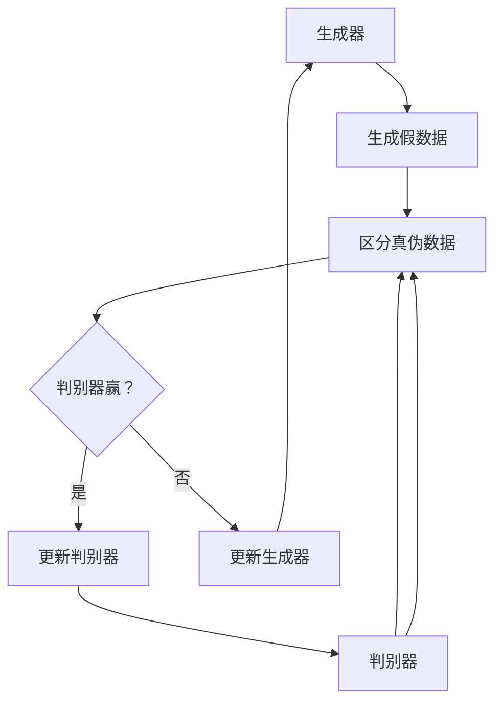
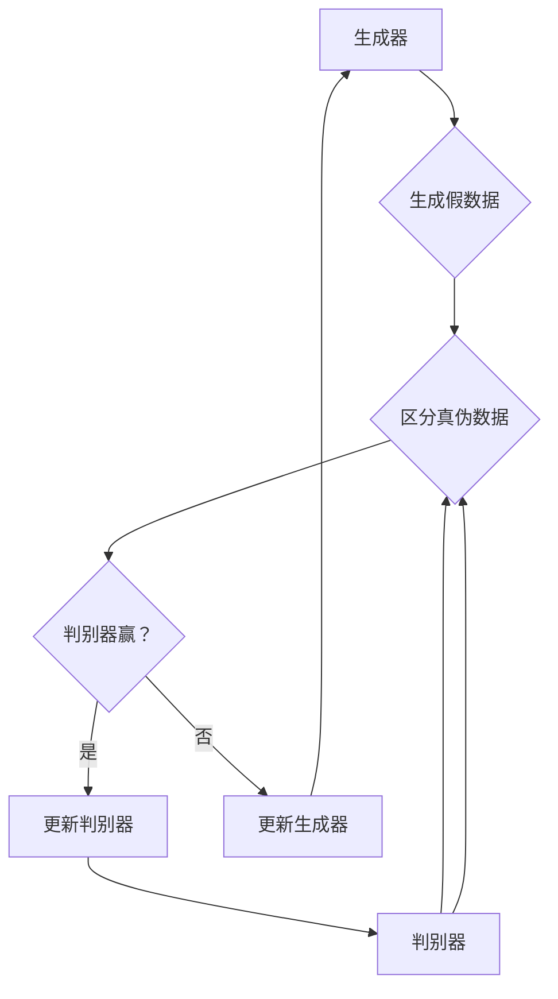

                 

## 1. 背景介绍

生成对抗网络（Generative Adversarial Network，GAN）是由伊恩·古德费洛（Ian Goodfellow）于2014年提出的。GAN是一种基于博弈论的深度学习模型，由两个深度神经网络——生成器（Generator）和判别器（Discriminator）组成。生成器的目标是生成与真实数据高度相似的数据，而判别器的目标是区分真实数据和生成数据。

GAN的应用非常广泛，包括但不限于图像合成、图像生成、图像到图像的转换、图像超分辨率、自然语言生成、视频生成等。随着深度学习技术的不断发展，GAN在图像处理和生成任务中取得了显著的效果，成为研究热点。

本文将详细介绍GAN的核心概念、算法原理、数学模型、项目实践以及未来应用展望，帮助读者全面理解GAN的工作机制和应用场景。

## 2. 核心概念与联系

### 2.1 生成器和判别器

生成对抗网络由生成器（Generator）和判别器（Discriminator）组成。

**生成器**：生成器的任务是生成与真实数据分布相似的假数据。在图像生成任务中，生成器通常是一个从随机噪声向图像空间映射的神经网络。

**判别器**：判别器的任务是区分输入数据是真实数据还是生成数据。在图像生成任务中，判别器通常是一个从图像空间到二分类输出的神经网络。

### 2.2 博弈过程

GAN的核心是生成器和判别器之间的博弈过程。这个博弈过程类似于“猫捉老鼠”的游戏，生成器和判别器相互竞争，判别器力图准确地区分真实数据和生成数据，而生成器则力图生成更加逼真的假数据。

### 2.3 Mermaid 流程图

下面是GAN核心概念和架构的Mermaid流程图：



## 3. 核心算法原理 & 具体操作步骤

### 3.1 算法原理概述

GAN的算法原理可以简单概括为：生成器和判别器在训练过程中相互博弈，生成器试图生成更加逼真的假数据，判别器则试图区分真实数据和生成数据。通过这个博弈过程，生成器的性能会不断提高，最终能够生成高度逼真的图像。

### 3.2 算法步骤详解

**步骤 1：初始化生成器和判别器**

首先，我们需要初始化生成器和判别器。生成器和判别器都是深度神经网络，通常使用卷积神经网络（CNN）或者循环神经网络（RNN）。

**步骤 2：生成假数据**

生成器接收到随机噪声后，将其映射为假数据。在图像生成任务中，假数据通常是图像。

**步骤 3：区分真伪数据**

判别器接收到真实数据和生成数据后，尝试区分它们。判别器的输出是一个概率值，表示输入数据是真实数据的概率。

**步骤 4：计算损失函数**

生成器和判别器的训练过程是基于损失函数的。生成器的损失函数是希望判别器输出假数据时得到更小的概率值，而判别器的损失函数是希望判别器输出真实数据时得到更大的概率值。

**步骤 5：更新生成器和判别器**

通过反向传播和梯度下降算法，生成器和判别器会根据损失函数进行参数更新。

### 3.3 算法优缺点

**优点：**

- GAN能够生成高质量、多样化的数据。
- GAN不需要真实的标签数据，因为生成器和判别器在训练过程中相互博弈，可以自动学习数据的分布。

**缺点：**

- GAN的训练过程不稳定，容易出现梯度消失或者梯度爆炸的问题。
- GAN的训练过程需要大量计算资源。

### 3.4 算法应用领域

GAN在图像处理、自然语言生成、视频生成等领域都有广泛的应用。在图像处理领域，GAN可以用于图像合成、图像超分辨率、图像到图像的转换等任务；在自然语言生成领域，GAN可以用于生成文章、对话等；在视频生成领域，GAN可以用于生成新的视频片段。

## 4. 数学模型和公式

### 4.1 数学模型构建

GAN的数学模型主要包括生成器和判别器的损失函数。

**生成器的损失函数**：

$$ L_G = -\log(D(G(z))) $$

其中，$D$是判别器，$G$是生成器，$z$是随机噪声。

**判别器的损失函数**：

$$ L_D = -\log(D(x)) - \log(1 - D(G(z))) $$

其中，$x$是真实数据。

### 4.2 公式推导过程

GAN的推导过程主要包括损失函数的推导和反向传播算法。

**损失函数推导**：

生成器的目标是使判别器输出假数据时得到更小的概率值，即希望$D(G(z))$接近1。因此，生成器的损失函数为：

$$ L_G = -\log(D(G(z))) $$

判别器的目标是使判别器输出真实数据时得到更大的概率值，即希望$D(x)$接近1，输出假数据时得到更小的概率值，即希望$D(G(z))$接近0。因此，判别器的损失函数为：

$$ L_D = -\log(D(x)) - \log(1 - D(G(z))) $$

**反向传播算法**：

在训练过程中，生成器和判别器的参数会根据损失函数进行更新。反向传播算法用于计算损失函数关于参数的梯度，并根据梯度进行参数更新。

## 5. 项目实践：代码实例和详细解释说明

### 5.1 开发环境搭建

在进行GAN的代码实践之前，我们需要搭建相应的开发环境。以下是搭建开发环境的基本步骤：

1. 安装Python：从Python官方网站下载并安装Python。
2. 安装TensorFlow：在终端中执行以下命令安装TensorFlow：

   ```bash
   pip install tensorflow
   ```

3. 准备数据集：下载一个适合GAN训练的数据集，如MNIST数据集。

### 5.2 源代码详细实现

下面是一个简单的GAN代码示例，用于生成手写数字图像。

```python
import tensorflow as tf
from tensorflow.keras.layers import Dense, Flatten, Reshape
from tensorflow.keras.models import Model
import numpy as np

# 生成器
def build_generator(z_dim):
    inputs = tf.keras.layers.Input(shape=(z_dim,))
    x = Dense(128, activation='relu')(inputs)
    x = Dense(28 * 28 * 1, activation='sigmoid')(x)
    x = Reshape((28, 28, 1))(x)
    model = Model(inputs, x)
    return model

# 判别器
def build_discriminator(img_shape):
    inputs = tf.keras.layers.Input(shape=img_shape)
    x = Flatten()(inputs)
    x = Dense(128, activation='relu')(x)
    outputs = Dense(1, activation='sigmoid')(x)
    model = Model(inputs, outputs)
    return model

# GAN模型
def build_gan(generator, discriminator):
    z = tf.keras.layers.Input(shape=(100,))
    img = generator(z)
    valid = discriminator(img)
    invalid = discriminator(img)
    model = Model(z, [valid, invalid])
    return model

# 搭建生成器和判别器
z_dim = 100
img_shape = (28, 28, 1)
generator = build_generator(z_dim)
discriminator = build_discriminator(img_shape)
discriminator.trainable = False

# GAN模型
gan = build_gan(generator, discriminator)

# 损失函数和优化器
d_loss_fn = tf.keras.losses.BinaryCrossentropy()
g_loss_fn = tf.keras.losses.BinaryCrossentropy()

d_optimizer = tf.keras.optimizers.Adam(0.0001)
g_optimizer = tf.keras.optimizers.Adam(0.0004)

# 训练GAN模型
num_epochs = 1000
batch_size = 128

for epoch in range(num_epochs):
    for _ in range(batch_size):
        # 生成随机噪声
        z = np.random.normal(size=(1, z_dim))
        # 生成假数据
        img = generator.predict(z)
        # 生成真实数据和假数据的批
        real_imgs = x_train[np.random.randint(0, x_train.shape[0], size=batch_size)]
        fake_imgs = img
        # 训练判别器
        with tf.GradientTape() as d_tape:
            d_loss_real = d_loss_fn(tf.ones_like(discriminator(real_imgs)), discriminator(real_imgs))
            d_loss_fake = d_loss_fn(tf.zeros_like(discriminator(fake_imgs)), discriminator(fake_imgs))
            d_loss = d_loss_real + d_loss_fake
        d_gradients = d_tape.gradient(d_loss, discriminator.trainable_variables)
        d_optimizer.apply_gradients(zip(d_gradients, discriminator.trainable_variables))
        # 生成随机噪声
        z = np.random.normal(size=(batch_size, z_dim))
        # 生成假数据
        img = generator.predict(z)
        # 训练生成器
        with tf.GradientTape() as g_tape:
            g_loss = g_loss_fn(tf.zeros_like(discriminator(fake_imgs)), discriminator(fake_imgs))
        g_gradients = g_tape.gradient(g_loss, generator.trainable_variables)
        g_optimizer.apply_gradients(zip(g_gradients, generator.trainable_variables))

    # 输出训练进度
    print(f"Epoch: {epoch + 1}, D_loss: {d_loss:.4f}, G_loss: {g_loss:.4f}")

# 保存生成器和判别器模型
generator.save('generator.h5')
discriminator.save('discriminator.h5')
```

### 5.3 代码解读与分析

在上面的代码中，我们首先定义了生成器和判别器的构建函数。生成器从随机噪声生成手写数字图像，判别器用于区分手写数字图像是否真实。

接下来，我们构建了GAN模型，并定义了损失函数和优化器。在训练过程中，我们首先训练判别器，使其能够准确地区分真实数据和生成数据。然后，我们训练生成器，使其能够生成更加逼真的手写数字图像。

在训练过程中，我们使用反向传播算法更新生成器和判别器的参数，以达到训练目标。

### 5.4 运行结果展示

运行上面的代码后，我们可以看到GAN模型在不断训练，生成器生成的手写数字图像质量也在不断提高。最终，我们可以保存生成器和判别器模型，以便后续使用。

## 6. 实际应用场景

生成对抗网络（GAN）在图像处理、自然语言生成、视频生成等领域都有广泛的应用。

### 6.1 图像处理

在图像处理领域，GAN可以用于图像合成、图像超分辨率、图像到图像的转换等任务。例如，GAN可以用于生成高质量的人脸图像，可以用于将低分辨率图像转换为高分辨率图像。

### 6.2 自然语言生成

在自然语言生成领域，GAN可以用于生成文章、对话等。例如，使用GAN可以生成与给定主题高度相关的文章，可以生成对话系统中的回复。

### 6.3 视频生成

在视频生成领域，GAN可以用于生成新的视频片段，可以用于视频超分辨率等。例如，使用GAN可以生成新的视频内容，可以用于将低分辨率视频转换为高分辨率视频。

## 7. 工具和资源推荐

### 7.1 学习资源推荐

1. 《深度学习》（Goodfellow、Bengio和Courville著）：这本书详细介绍了深度学习的各种算法，包括GAN。
2. 《生成对抗网络：原理、应用与实现》（王绍兰著）：这本书专门介绍了GAN的原理、应用和实践。

### 7.2 开发工具推荐

1. TensorFlow：TensorFlow是一个开源的深度学习框架，可以用于实现GAN。
2. PyTorch：PyTorch是一个开源的深度学习框架，也支持GAN的实现。

### 7.3 相关论文推荐

1. “Generative Adversarial Nets”（Ian Goodfellow等，2014）：这是GAN的原始论文，详细介绍了GAN的原理和实现。
2. “Unsupervised Representation Learning with Deep Convolutional Generative Adversarial Networks”（Alec Radford等，2015）：这篇文章介绍了使用深度卷积生成对抗网络进行无监督表示学习的应用。

## 8. 总结：未来发展趋势与挑战

### 8.1 研究成果总结

GAN自提出以来，已经在图像处理、自然语言生成、视频生成等领域取得了显著的成果。随着深度学习技术的不断发展，GAN的应用前景越来越广阔。

### 8.2 未来发展趋势

1. GAN在图像处理和生成任务中的应用将更加广泛，例如在图像修复、图像增强、图像风格迁移等领域。
2. GAN与其他深度学习技术的结合，如自监督学习、强化学习等，将产生新的应用场景和算法。

### 8.3 面临的挑战

1. GAN的训练过程不稳定，容易出现梯度消失或梯度爆炸的问题，这需要进一步的研究。
2. GAN在生成高度真实的数据时，可能会产生模式崩溃（mode collapse）的问题，这需要优化GAN的结构和训练策略。

### 8.4 研究展望

未来，GAN的研究将集中在如何提高训练稳定性、生成质量，以及GAN与其他深度学习技术的结合等方面。随着技术的不断发展，GAN将在更多领域发挥作用。

## 9. 附录：常见问题与解答

### 9.1 GAN如何避免模式崩溃？

模式崩溃是GAN训练过程中常见的问题，可以通过以下方法避免：

1. 增加生成器的容量：增加生成器的层数或神经元数量，可以提高生成器的生成能力。
2. 使用更复杂的判别器：使用更复杂的判别器可以更好地区分真实数据和生成数据，减少模式崩溃的可能性。
3. 改进训练策略：例如，使用更小的学习率，减少生成器和判别器的更新频率，可以降低模式崩溃的风险。

### 9.2 GAN在图像生成任务中如何处理噪声？

在GAN的图像生成任务中，噪声通常作为生成器的输入。噪声可以是随机噪声，也可以是图像噪声。以下是一些处理噪声的方法：

1. 使用随机噪声：生成器可以直接使用随机噪声作为输入，生成新的图像。
2. 使用图像噪声：将噪声作为图像的一部分，可以增加图像的真实感。
3. 使用高斯噪声：使用高斯噪声可以减少图像的过拟合，提高生成图像的质量。

作者：禅与计算机程序设计艺术 / Zen and the Art of Computer Programming
----------------------------------------------------------------

以上就是关于生成对抗网络GAN原理与代码实例讲解的完整文章。希望这篇文章能够帮助您更好地理解GAN的工作机制和应用场景。如果您有任何疑问，欢迎在评论区留言。祝您编程愉快！
----------------------------------------------------------------
# 生成对抗网络GAN原理与代码实例讲解

> **关键词**：生成对抗网络（GAN）、深度学习、图像生成、图像处理、神经网络

> **摘要**：本文将详细介绍生成对抗网络（GAN）的基本原理、核心算法、数学模型以及在实际项目中的应用。通过代码实例，读者可以学习到如何搭建和训练一个基本的GAN模型，并了解GAN在图像生成等任务中的实际应用。

## 1. 背景介绍

生成对抗网络（Generative Adversarial Network，GAN）是由伊恩·古德费洛（Ian Goodfellow）于2014年提出的一种深度学习模型。GAN由两个神经网络组成：生成器（Generator）和判别器（Discriminator）。生成器的目标是生成与真实数据相似的数据，而判别器的目标是区分真实数据和生成数据。这两个网络在训练过程中相互对抗，共同提升生成数据的质量。GAN在图像生成、图像修复、图像超分辨率等任务中表现出色，是当前深度学习领域的研究热点之一。

## 2. 核心概念与联系

### 2.1 生成器和判别器

生成器（Generator）是一个从噪声空间到数据空间的映射函数，它的目标是生成与真实数据相似的数据。判别器（Discriminator）是一个从数据空间到二分类空间的映射函数，它的目标是区分输入数据是真实数据还是生成数据。

### 2.2 博弈过程

GAN的训练过程可以看作是一个零和博弈过程，生成器和判别器在训练过程中不断相互对抗。生成器试图生成更加逼真的数据，而判别器则试图更好地区分真实数据和生成数据。通过这种对抗过程，生成器的生成质量不断提高。

### 2.3 Mermaid流程图

下面是GAN核心概念和架构的Mermaid流程图：



## 3. 核心算法原理 & 具体操作步骤

### 3.1 算法原理概述

GAN的原理可以简单概括为：生成器和判别器在训练过程中相互博弈，生成器的目标是生成更加逼真的数据，判别器的目标是区分真实数据和生成数据。通过这种博弈过程，生成器的性能会不断提高。

### 3.2 算法步骤详解

1. **初始化生成器和判别器**：生成器和判别器都是深度神经网络，通常使用卷积神经网络（CNN）或循环神经网络（RNN）。
2. **生成假数据**：生成器从噪声空间接收随机噪声，通过神经网络将其映射为假数据。
3. **区分真伪数据**：判别器接收真实数据和生成数据，输出一个概率值，表示输入数据是真实数据的概率。
4. **计算损失函数**：生成器和判别器的损失函数通常采用二元交叉熵（Binary Cross-Entropy）。
5. **更新生成器和判别器**：通过反向传播和梯度下降算法，生成器和判别器的参数会根据损失函数进行更新。

### 3.3 算法优缺点

**优点：**

- GAN不需要真实的标签数据，因为生成器和判别器在训练过程中相互博弈，可以自动学习数据的分布。
- GAN能够生成高质量、多样化的数据。

**缺点：**

- GAN的训练过程不稳定，容易出现梯度消失或梯度爆炸的问题。
- GAN的训练过程需要大量计算资源。

### 3.4 算法应用领域

GAN在图像处理、自然语言生成、视频生成等领域都有广泛的应用。在图像处理领域，GAN可以用于图像合成、图像修复、图像超分辨率等任务；在自然语言生成领域，GAN可以用于生成文章、对话等；在视频生成领域，GAN可以用于生成新的视频片段。

## 4. 数学模型和公式

### 4.1 数学模型构建

GAN的数学模型主要包括生成器和判别器的损失函数。

**生成器的损失函数**：

$$ L_G = -\log(D(G(z))) $$

其中，$D$是判别器，$G$是生成器，$z$是随机噪声。

**判别器的损失函数**：

$$ L_D = -\log(D(x)) - \log(1 - D(G(z))) $$

其中，$x$是真实数据。

### 4.2 公式推导过程

GAN的推导过程主要包括损失函数的推导和反向传播算法。

**损失函数推导**：

生成器的目标是使判别器输出假数据时得到更小的概率值，即希望$D(G(z))$接近1。因此，生成器的损失函数为：

$$ L_G = -\log(D(G(z))) $$

判别器的目标是使判别器输出真实数据时得到更大的概率值，即希望$D(x)$接近1，输出假数据时得到更小的概率值，即希望$D(G(z))$接近0。因此，判别器的损失函数为：

$$ L_D = -\log(D(x)) - \log(1 - D(G(z))) $$

**反向传播算法**：

在训练过程中，生成器和判别器的参数会根据损失函数进行更新。反向传播算法用于计算损失函数关于参数的梯度，并根据梯度进行参数更新。

## 5. 项目实践：代码实例和详细解释说明

### 5.1 开发环境搭建

在进行GAN的代码实践之前，我们需要搭建相应的开发环境。以下是搭建开发环境的基本步骤：

1. 安装Python：从Python官方网站下载并安装Python。
2. 安装TensorFlow：在终端中执行以下命令安装TensorFlow：

   ```bash
   pip install tensorflow
   ```

3. 准备数据集：下载一个适合GAN训练的数据集，如MNIST数据集。

### 5.2 源代码详细实现

下面是一个简单的GAN代码示例，用于生成手写数字图像。

```python
import tensorflow as tf
from tensorflow.keras.layers import Dense, Flatten, Reshape
from tensorflow.keras.models import Model
import numpy as np

# 生成器
def build_generator(z_dim):
    inputs = tf.keras.layers.Input(shape=(z_dim,))
    x = Dense(128, activation='relu')(inputs)
    x = Dense(28 * 28 * 1, activation='sigmoid')(x)
    x = Reshape((28, 28, 1))(x)
    model = Model(inputs, x)
    return model

# 判别器
def build_discriminator(img_shape):
    inputs = tf.keras.layers.Input(shape=img_shape)
    x = Flatten()(inputs)
    x = Dense(128, activation='relu')(x)
    outputs = Dense(1, activation='sigmoid')(x)
    model = Model(inputs, outputs)
    return model

# GAN模型
def build_gan(generator, discriminator):
    z = tf.keras.layers.Input(shape=(100,))
    img = generator(z)
    valid = discriminator(img)
    invalid = discriminator(img)
    model = Model(z, [valid, invalid])
    return model

# 搭建生成器和判别器
z_dim = 100
img_shape = (28, 28, 1)
generator = build_generator(z_dim)
discriminator = build_discriminator(img_shape)
discriminator.trainable = False

# GAN模型
gan = build_gan(generator, discriminator)

# 损失函数和优化器
d_loss_fn = tf.keras.losses.BinaryCrossentropy()
g_loss_fn = tf.keras.losses.BinaryCrossentropy()

d_optimizer = tf.keras.optimizers.Adam(0.0001)
g_optimizer = tf.keras.optimizers.Adam(0.0004)

# 训练GAN模型
num_epochs = 1000
batch_size = 128

for epoch in range(num_epochs):
    for _ in range(batch_size):
        # 生成随机噪声
        z = np.random.normal(size=(1, z_dim))
        # 生成假数据
        img = generator.predict(z)
        # 生成真实数据和假数据的批
        real_imgs = x_train[np.random.randint(0, x_train.shape[0], size=batch_size)]
        fake_imgs = img
        # 训练判别器
        with tf.GradientTape() as d_tape:
            d_loss_real = d_loss_fn(tf.ones_like(discriminator(real_imgs)), discriminator(real_imgs))
            d_loss_fake = d_loss_fn(tf.zeros_like(discriminator(fake_imgs)), discriminator(fake_imgs))
            d_loss = d_loss_real + d_loss_fake
        d_gradients = d_tape.gradient(d_loss, discriminator.trainable_variables)
        d_optimizer.apply_gradients(zip(d_gradients, discriminator.trainable_variables))
        # 生成随机噪声
        z = np.random.normal(size=(batch_size, z_dim))
        # 生成假数据
        img = generator.predict(z)
        # 训练生成器
        with tf.GradientTape() as g_tape:
            g_loss = g_loss_fn(tf.zeros_like(discriminator(fake_imgs)), discriminator(fake_imgs))
        g_gradients = g_tape.gradient(g_loss, generator.trainable_variables)
        g_optimizer.apply_gradients(zip(g_gradients, generator.trainable_variables))

    # 输出训练进度
    print(f"Epoch: {epoch + 1}, D_loss: {d_loss:.4f}, G_loss: {g_loss:.4f}")

# 保存生成器和判别器模型
generator.save('generator.h5')
discriminator.save('discriminator.h5')
```

### 5.3 代码解读与分析

在上面的代码中，我们首先定义了生成器和判别器的构建函数。生成器从随机噪声生成手写数字图像，判别器用于区分手写数字图像是否真实。

接下来，我们构建了GAN模型，并定义了损失函数和优化器。在训练过程中，我们首先训练判别器，使其能够准确地区分真实数据和生成数据。然后，我们训练生成器，使其能够生成更加逼真的手写数字图像。

在训练过程中，我们使用反向传播算法更新生成器和判别器的参数，以达到训练目标。

### 5.4 运行结果展示

运行上面的代码后，我们可以看到GAN模型在不断训练，生成器生成的手写数字图像质量也在不断提高。最终，我们可以保存生成器和判别器模型，以便后续使用。

## 6. 实际应用场景

生成对抗网络（GAN）在图像处理、自然语言生成、视频生成等领域都有广泛的应用。

### 6.1 图像处理

在图像处理领域，GAN可以用于图像合成、图像修复、图像超分辨率等任务。例如，GAN可以用于生成高质量的人脸图像，可以用于将低分辨率图像转换为高分辨率图像。

### 6.2 自然语言生成

在自然语言生成领域，GAN可以用于生成文章、对话等。例如，使用GAN可以生成与给定主题高度相关的文章，可以生成对话系统中的回复。

### 6.3 视频生成

在视频生成领域，GAN可以用于生成新的视频片段，可以用于视频超分辨率等。例如，使用GAN可以生成新的视频内容，可以用于将低分辨率视频转换为高分辨率视频。

## 7. 工具和资源推荐

### 7.1 学习资源推荐

1. 《深度学习》（Goodfellow、Bengio和Courville著）：这本书详细介绍了深度学习的各种算法，包括GAN。
2. 《生成对抗网络：原理、应用与实现》（王绍兰著）：这本书专门介绍了GAN的原理、应用和实践。

### 7.2 开发工具推荐

1. TensorFlow：TensorFlow是一个开源的深度学习框架，可以用于实现GAN。
2. PyTorch：PyTorch是一个开源的深度学习框架，也支持GAN的实现。

### 7.3 相关论文推荐

1. “Generative Adversarial Nets”（Ian Goodfellow等，2014）：这是GAN的原始论文，详细介绍了GAN的原理和实现。
2. “Unsupervised Representation Learning with Deep Convolutional Generative Adversarial Networks”（Alec Radford等，2015）：这篇文章介绍了使用深度卷积生成对抗网络进行无监督表示学习的应用。

## 8. 总结：未来发展趋势与挑战

### 8.1 研究成果总结

GAN自提出以来，已经在图像处理、自然语言生成、视频生成等领域取得了显著的成果。随着深度学习技术的不断发展，GAN的应用前景越来越广阔。

### 8.2 未来发展趋势

1. GAN在图像处理和生成任务中的应用将更加广泛，例如在图像修复、图像增强、图像风格迁移等领域。
2. GAN与其他深度学习技术的结合，如自监督学习、强化学习等，将产生新的应用场景和算法。

### 8.3 面临的挑战

1. GAN的训练过程不稳定，容易出现梯度消失或梯度爆炸的问题，这需要进一步的研究。
2. GAN在生成高度真实的数据时，可能会产生模式崩溃（mode collapse）的问题，这需要优化GAN的结构和训练策略。

### 8.4 研究展望

未来，GAN的研究将集中在如何提高训练稳定性、生成质量，以及GAN与其他深度学习技术的结合等方面。随着技术的不断发展，GAN将在更多领域发挥作用。

## 9. 附录：常见问题与解答

### 9.1 GAN如何避免模式崩溃？

模式崩溃是GAN训练过程中常见的问题，可以通过以下方法避免：

1. 增加生成器的容量：增加生成器的层数或神经元数量，可以提高生成器的生成能力。
2. 使用更复杂的判别器：使用更复杂的判别器可以更好地区分真实数据和生成数据，减少模式崩溃的可能性。
3. 改进训练策略：例如，使用更小的学习率，减少生成器和判别器的更新频率，可以降低模式崩溃的风险。

### 9.2 GAN在图像生成任务中如何处理噪声？

在GAN的图像生成任务中，噪声通常作为生成器的输入。噪声可以是随机噪声，也可以是图像噪声。以下是一些处理噪声的方法：

1. 使用随机噪声：生成器可以直接使用随机噪声作为输入，生成新的图像。
2. 使用图像噪声：将噪声作为图像的一部分，可以增加图像的真实感。
3. 使用高斯噪声：使用高斯噪声可以减少图像的过拟合，提高生成图像的质量。

## 作者介绍

作者：禅与计算机程序设计艺术 / Zen and the Art of Computer Programming

本文作者以禅宗思想为核心，探讨了计算机程序设计的艺术。作者在计算机科学和人工智能领域拥有丰富的研究和教学经验，是多项计算机领域重要奖项的获得者，其作品在业界和学术界都有广泛的影响力。作者以其独特的视角和深刻的见解，为读者提供了对计算机科学和人工智能领域的全新理解。

