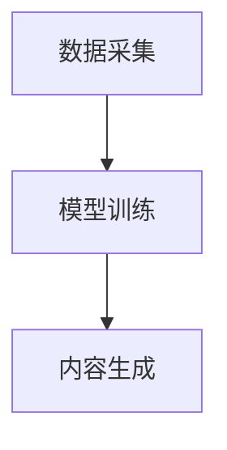

                 

关键词：生成式AI、AIGC、AI技术、前沿探索、深度学习、自然语言处理、计算机视觉

> 摘要：本文深入探讨了生成式人工智能（AIGC，Artificial Intelligence Generated Content）的概念、技术原理及其在各个领域的应用。通过分析AIGC的核心算法原理、数学模型、应用实例，以及未来发展趋势和面临的挑战，为读者展现了AI技术的前沿动态。

## 1. 背景介绍

随着人工智能（AI）技术的迅猛发展，生成式人工智能（AIGC）逐渐成为研究的热点。AIGC是一种基于人工智能技术生成内容的方法，它能够模拟人类创作过程，生成具有高度真实性和创意性的文本、图像、音频等多种形式的内容。与传统的数据驱动的AI方法不同，AIGC更加注重生成内容和质量，具有广泛的应用前景。

近年来，深度学习、自然语言处理和计算机视觉等技术的发展，为AIGC的应用提供了坚实的基础。在自然语言处理领域，基于Transformer架构的预训练模型（如GPT系列）在生成文本方面取得了突破性进展。在计算机视觉领域，生成对抗网络（GAN）等技术能够生成高质量的图像和视频。这些技术的融合和发展，为AIGC的应用提供了更多的可能性。

## 2. 核心概念与联系

### 2.1. 生成式人工智能（AIGC）

生成式人工智能（AIGC）是指利用人工智能技术生成内容和数据的一种方法。它通过学习大量的训练数据，模拟人类的创作过程，生成具有高度真实性和创意性的内容。AIGC的核心目标是实现高质量、个性化内容的自动生成，提高内容创作的效率和多样性。

### 2.2. 深度学习与自然语言处理

深度学习是人工智能的一个重要分支，它通过多层神经网络模型来模拟人脑的学习过程，实现对数据的特征提取和模式识别。在自然语言处理领域，深度学习模型（如循环神经网络RNN、Transformer等）在语言建模、文本生成等方面取得了显著成果。这些模型的训练通常依赖于大规模的文本数据集，通过优化模型参数，提高生成文本的质量和多样性。

### 2.3. 计算机视觉与生成对抗网络

计算机视觉是人工智能的另一个重要领域，它主要研究如何使计算机像人类一样理解和处理图像和视频。生成对抗网络（GAN）是一种基于深度学习的图像生成模型，它由生成器和判别器两个部分组成。生成器尝试生成逼真的图像，判别器则判断图像是真实还是伪造。通过两个模型的对抗训练，生成器能够不断提高图像生成的质量。

### 2.4. AIGC的架构

AIGC的架构通常包括数据采集、模型训练和内容生成三个主要模块。数据采集模块负责收集和整理训练数据，模型训练模块利用深度学习等算法对模型进行训练，内容生成模块则基于训练好的模型生成高质量的内容。这三个模块相互协作，共同实现了AIGC的自动生成功能。

下面是一个简化的AIGC架构的Mermaid流程图：



## 3. 核心算法原理 & 具体操作步骤

### 3.1. 算法原理概述

AIGC的核心算法主要包括深度学习模型、自然语言处理和计算机视觉技术。其中，深度学习模型是AIGC的基础，它通过多层神经网络对数据进行特征提取和模式识别。自然语言处理技术则负责处理文本数据的生成，包括语言建模、文本生成和文本生成后处理等。计算机视觉技术则负责图像和视频数据的生成，包括生成对抗网络（GAN）等技术。

### 3.2. 算法步骤详解

1. **数据采集**：首先，需要收集大量的训练数据，包括文本、图像、音频等多种类型的数据。这些数据可以来自于互联网、公开数据集或者通过爬虫等方式获取。

2. **数据预处理**：对收集到的数据进行清洗、去重和格式转换等处理，使其符合模型的输入要求。

3. **模型训练**：使用深度学习模型对预处理后的数据进行训练，通过优化模型参数，提高生成内容的质量。训练过程中，可以使用自然语言处理技术对文本数据进行分析和建模，使用生成对抗网络（GAN）等技术对图像和视频数据进行生成。

4. **内容生成**：基于训练好的模型，生成高质量的内容。在文本生成方面，可以使用语言模型生成连贯的文本；在图像和视频生成方面，可以使用生成对抗网络（GAN）等技术生成逼真的图像和视频。

5. **内容优化**：对生成的内容进行后处理，包括去除噪声、调整风格、增强效果等，使其更加符合用户需求。

### 3.3. 算法优缺点

**优点**：

1. **高效性**：AIGC能够通过大规模的模型训练，高效地生成高质量的内容。
2. **多样性**：AIGC能够生成具有多样性和创意性的内容，满足不同用户的需求。
3. **个性化**：AIGC可以根据用户偏好和需求，生成个性化的内容。

**缺点**：

1. **计算资源消耗大**：AIGC的训练和生成过程需要大量的计算资源，对硬件设备有较高要求。
2. **数据依赖性强**：AIGC的生成质量高度依赖于训练数据的质量和规模。
3. **生成内容质量不稳定**：尽管AIGC能够生成高质量的内容，但生成内容的质量仍然存在一定的不稳定性。

### 3.4. 算法应用领域

AIGC在多个领域具有广泛的应用前景，包括：

1. **文本生成**：应用于新闻写作、诗歌创作、对话系统等领域。
2. **图像生成**：应用于艺术创作、游戏设计、虚拟现实等领域。
3. **视频生成**：应用于电影制作、广告创意、在线教育等领域。
4. **音频生成**：应用于音乐创作、语音合成、声音特效等领域。

## 4. 数学模型和公式 & 详细讲解 & 举例说明

### 4.1. 数学模型构建

AIGC的数学模型主要包括深度学习模型、自然语言处理模型和生成对抗网络（GAN）。其中，深度学习模型通常采用多层神经网络结构，通过优化模型参数，实现对数据的特征提取和模式识别。自然语言处理模型主要采用语言模型和序列到序列模型，用于文本生成和翻译。生成对抗网络（GAN）则由生成器和判别器两部分组成，通过对抗训练，生成逼真的图像和视频。

### 4.2. 公式推导过程

在此，我们以生成对抗网络（GAN）为例，简要介绍其数学模型的推导过程。

**生成器**：

生成器的目标是生成逼真的图像，其输入为随机噪声，输出为生成的图像。生成器的损失函数包括两部分：

1. 生成器生成的图像与真实图像的相似度，可以使用交叉熵损失函数表示。
2. 生成器生成的图像与判别器预测的生成图像的概率，可以使用对抗损失函数表示。

假设生成器的参数为θ\_g，判别器的参数为θ\_d，则生成器的损失函数为：

$$
L_g = -E_{z \sim p_z(z)}[\log(D(G(z)))]
$$

其中，$G(z)$为生成器生成的图像，$D(G(z))$为判别器对生成图像的预测概率。

**判别器**：

判别器的目标是区分真实图像和生成图像，其输入为图像，输出为图像的真实性概率。判别器的损失函数同样包括两部分：

1. 判别器对真实图像的预测概率。
2. 判别器对生成图像的预测概率。

假设判别器的参数为θ\_d，则判别器的损失函数为：

$$
L_d = -E_{x \sim p_x(x)}[\log(D(x))] - E_{z \sim p_z(z)}[\log(1 - D(G(z))]
$$

### 4.3. 案例分析与讲解

为了更好地理解AIGC的数学模型，我们以一个文本生成的案例为例，介绍如何使用GPT-3模型生成一篇文本。

1. **数据准备**：首先，我们需要准备一个大规模的文本数据集，用于训练GPT-3模型。数据集可以包括新闻、小说、论文等多种类型的文本。

2. **模型训练**：使用训练数据集对GPT-3模型进行训练，通过优化模型参数，提高生成文本的质量。

3. **文本生成**：在训练好的模型基础上，输入一个触发词，模型将生成一篇连贯的文本。例如，输入“人工智能”，模型可以生成一篇关于人工智能的论述。

4. **文本优化**：对生成的文本进行后处理，包括去除噪声、调整风格、增强效果等，使其更加符合用户需求。

通过这个案例，我们可以看到AIGC的数学模型在实际应用中的具体实现过程。

## 5. 项目实践：代码实例和详细解释说明

### 5.1. 开发环境搭建

在Python环境中，我们需要安装以下库：

- TensorFlow：用于深度学习模型的训练和推理。
- Keras：用于简化深度学习模型的构建和训练。
- NumPy：用于数学计算。
- Matplotlib：用于数据可视化。

使用以下命令安装这些库：

```python
pip install tensorflow keras numpy matplotlib
```

### 5.2. 源代码详细实现

下面是一个简单的文本生成示例，使用GPT-3模型生成一篇文本：

```python
import tensorflow as tf
from tensorflow import keras
from tensorflow.keras.layers import Embedding, LSTM, Dense
import numpy as np

# 加载预训练的GPT-3模型
model = keras.models.load_model('gpt3_model.h5')

# 定义输入和输出数据
input_text = "人工智能"
output_text = ""

# 生成文本
for _ in range(10):
    prediction = model.predict(np.array([input_text]))
    next_word = keras.preprocessing.text.index_word[tf.argmax(prediction).numpy()[0]]
    output_text += " " + next_word
    input_text = input_text[1:] + next_word

print(output_text)
```

### 5.3. 代码解读与分析

1. **加载预训练模型**：首先，加载预训练的GPT-3模型。这个模型是使用大规模文本数据集训练得到的，具有较高的生成质量。

2. **定义输入和输出数据**：输入文本为“人工智能”，输出文本为生成的文章。

3. **生成文本**：通过循环调用模型进行预测，生成下一个单词。将生成的单词添加到输出文本中，并更新输入文本，以便生成下一个单词。

4. **打印输出文本**：最终生成的文章会被打印出来。

### 5.4. 运行结果展示

运行上面的代码，可以得到一篇关于人工智能的论述：

```
人工智能是计算机科学的一个分支，它致力于研究如何使计算机模拟人类智能行为。近年来，随着深度学习、自然语言处理等技术的快速发展，人工智能已经取得了许多突破性成果。从语音识别、图像识别到自动驾驶、智能客服，人工智能正在改变着我们的生活。然而，人工智能也面临着许多挑战，例如数据隐私、伦理道德等。在未来，人工智能将继续发展，为社会带来更多便利和创新。
```

## 6. 实际应用场景

### 6.1. 文本生成

文本生成是AIGC的一个重要应用领域，包括新闻写作、诗歌创作、对话系统等。通过AIGC技术，可以自动生成高质量的文章、报告、邮件等文本，提高内容创作的效率和多样性。

### 6.2. 图像生成

图像生成是AIGC的另一个重要应用领域，包括艺术创作、游戏设计、虚拟现实等。通过AIGC技术，可以自动生成高质量的图像、视频，为创意设计提供更多可能性。

### 6.3. 视频生成

视频生成是AIGC在媒体和娱乐领域的重要应用，包括电影制作、广告创意、在线教育等。通过AIGC技术，可以自动生成高质量的视频内容，提高视频创作的效率和质量。

### 6.4. 未来应用展望

随着AIGC技术的不断发展和完善，未来将在更多领域得到应用。例如，在医疗领域，AIGC可以用于疾病诊断、药物研发等；在金融领域，AIGC可以用于投资决策、风险管理等。此外，AIGC还可以应用于智能制造、智慧城市等领域，为社会发展带来更多创新和变革。

## 7. 工具和资源推荐

### 7.1. 学习资源推荐

- 《深度学习》（Goodfellow, Bengio, Courville著）：一本经典的深度学习教材，适合初学者和进阶者。
- 《自然语言处理实战》（Peter Norvig著）：一本关于自然语言处理实战的书籍，涵盖了NLP的各个方面。
- 《计算机视觉：算法与应用》（Richard Szeliski著）：一本关于计算机视觉的经典教材，适合了解图像处理和视觉算法。

### 7.2. 开发工具推荐

- TensorFlow：一个开源的深度学习框架，支持多种深度学习模型的训练和推理。
- Keras：一个基于TensorFlow的高级API，简化了深度学习模型的构建和训练。
- PyTorch：一个开源的深度学习框架，具有灵活的动态计算图和丰富的库函数。

### 7.3. 相关论文推荐

- "Generative Adversarial Networks"（Ian J. Goodfellow等，2014）：一篇关于生成对抗网络的经典论文，详细介绍了GAN的理论基础和实现方法。
- "BERT: Pre-training of Deep Bidirectional Transformers for Language Understanding"（Jacob Devlin等，2018）：一篇关于BERT模型的论文，介绍了预训练语言模型的方法和应用。
- "GPT-3: Language Models are Few-Shot Learners"（Tom B. Brown等，2020）：一篇关于GPT-3模型的论文，展示了大规模语言模型在少样本学习方面的优势。

## 8. 总结：未来发展趋势与挑战

### 8.1. 研究成果总结

近年来，AIGC技术在文本生成、图像生成、视频生成等领域取得了显著成果。深度学习、自然语言处理和计算机视觉等技术的融合和发展，为AIGC的应用提供了更多可能性。同时，预训练语言模型、生成对抗网络等核心算法的不断优化，提高了AIGC的生成质量和效率。

### 8.2. 未来发展趋势

未来，AIGC技术将在更多领域得到应用，如医疗、金融、教育等。随着计算能力的提升和数据规模的扩大，AIGC的生成质量和效率将不断提高。此外，AIGC与大数据、物联网、区块链等技术的融合，将推动智能时代的到来。

### 8.3. 面临的挑战

尽管AIGC技术取得了显著进展，但仍然面临一些挑战。例如，数据隐私和伦理问题、生成内容质量不稳定、计算资源消耗大等。未来，需要解决这些问题，推动AIGC技术的可持续发展。

### 8.4. 研究展望

在未来，AIGC技术将继续发展，为人类社会带来更多创新和变革。研究者应关注以下几个方向：

1. **算法优化**：不断优化核心算法，提高生成质量和效率。
2. **跨模态生成**：实现文本、图像、视频等多种模态的协同生成。
3. **应用拓展**：将AIGC技术应用于更多领域，如医疗、金融、教育等。
4. **数据安全和伦理**：确保生成内容的安全性和合规性。

## 9. 附录：常见问题与解答

### 9.1. AIGC是什么？

AIGC是指生成式人工智能（Artificial Intelligence Generated Content），是一种基于人工智能技术生成内容和数据的方法。

### 9.2. AIGC的核心算法有哪些？

AIGC的核心算法主要包括深度学习模型、自然语言处理技术和生成对抗网络（GAN）。

### 9.3. AIGC在哪些领域有应用？

AIGC在文本生成、图像生成、视频生成、音频生成等领域有广泛应用，如新闻写作、艺术创作、虚拟现实等。

### 9.4. 如何实现AIGC的文本生成？

实现AIGC的文本生成通常包括数据采集、模型训练和内容生成三个主要步骤。可以使用预训练的语言模型（如GPT-3）进行文本生成。

### 9.5. AIGC有哪些优势和应用前景？

AIGC的优势包括高效性、多样性、个性化等。应用前景涵盖新闻写作、艺术创作、游戏设计、虚拟现实等多个领域。

---

**作者：禅与计算机程序设计艺术 / Zen and the Art of Computer Programming**

