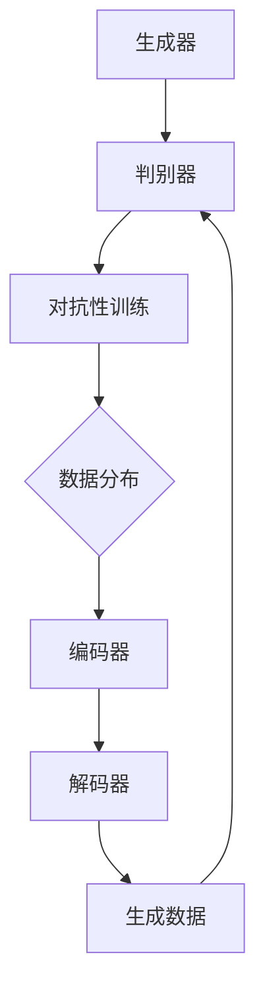

                 

关键词：生成式AI，AIGC，实验室，市场，技术变革，应用案例

> 摘要：本文旨在探讨生成式人工智能（AIGC）技术从实验室阶段迈向市场的全过程。我们将分析AIGC技术的核心概念、算法原理、数学模型，并通过项目实践展示其实际应用。同时，本文还将展望AIGC技术的未来发展趋势和面临的挑战。

## 1. 背景介绍

在过去的几十年中，人工智能（AI）技术的发展经历了数次变革。从早期的规则推理和符号计算，到基于统计的学习方法，再到深度学习的兴起，AI技术已经深刻地影响了各行各业。然而，生成式人工智能（AIGC，AI-Generated Content）的崛起，为AI技术的发展带来了新的契机。

AIGC是一种能够生成文本、图像、音频等多种类型内容的人工智能技术。与传统的基于规则的生成方法不同，AIGC依赖于深度学习和生成对抗网络（GAN）等技术，能够根据给定的条件生成全新的、符合人类期望的内容。这一技术不仅在学术界引起了广泛关注，更在工业界展现了巨大的应用潜力。

然而，从实验室到市场，AIGC技术面临着诸多挑战。本文将详细探讨这些挑战，并分析AIGC技术如何从实验室走向市场。

### 1.1 AIGC技术的发展历程

AIGC技术的发展可以追溯到20世纪80年代。当时，研究人员开始尝试使用神经网络来生成语音和图像。然而，由于计算能力和数据集的限制，这些早期的尝试并没有取得显著的成果。

随着深度学习的兴起，AIGC技术得到了迅速发展。2014年，生成对抗网络（GAN）的提出，标志着AIGC技术的一个重大突破。GAN由一个生成器和一个小型的判别器组成，通过不断的对抗训练，生成器能够生成越来越真实的内容。这一技术很快在图像生成、文本生成等领域取得了显著成果。

近年来，随着计算能力的提升和大数据的普及，AIGC技术在语音生成、视频生成等领域也取得了重要进展。例如，基于循环神经网络（RNN）的WaveNet模型在语音生成方面表现优异，而基于变分自编码器（VAE）的模型则在图像生成方面具有独特优势。

### 1.2 AIGC技术的应用场景

AIGC技术具有广泛的应用前景。在图像生成领域，AIGC技术可以用于图像修复、图像超分辨率、图像风格转换等任务。例如，DeepArt.io使用GAN技术，可以将用户提供的图片转换成艺术风格的画作。在文本生成领域，AIGC技术可以用于自动写作、翻译、摘要生成等任务。例如，OpenAI的GPT模型在自然语言处理领域取得了突破性进展，能够生成高质量的文章和对话。

此外，AIGC技术还在音频生成、视频生成等领域展现出巨大的应用潜力。例如，Google的WaveNet模型在语音合成方面表现出色，而DeepMind的WaveNet+模型则能够在视频中生成逼真的视频片段。

## 2. 核心概念与联系

要深入理解AIGC技术，我们需要掌握其核心概念和原理。在本节中，我们将介绍AIGC技术的核心概念，并通过Mermaid流程图展示其架构。

### 2.1 核心概念

AIGC技术主要包括以下核心概念：

1. **生成对抗网络（GAN）**：GAN是一种由生成器和判别器组成的对抗性学习模型。生成器尝试生成逼真的数据，而判别器则判断生成数据是否真实。通过不断的对抗训练，生成器能够生成越来越真实的数据。

2. **循环神经网络（RNN）**：RNN是一种能够处理序列数据的神经网络。它通过循环结构来保存历史信息，从而在序列数据中捕捉长期依赖关系。

3. **变分自编码器（VAE）**：VAE是一种基于概率的生成模型。它通过编码器和解码器学习数据的概率分布，从而生成新的数据。

4. **注意力机制**：注意力机制是一种用于捕捉输入数据中重要信息的方法。它通过加权输入数据中的不同部分，使得模型能够更加关注重要的信息。

### 2.2 Mermaid流程图

下面是一个简单的Mermaid流程图，展示了AIGC技术的核心架构：



在这个流程图中，生成器（A）和判别器（B）通过对抗性训练（C）来优化模型。编码器（E）和解码器（F）用于学习数据的概率分布（D），并生成新的数据（G）。

## 3. 核心算法原理 & 具体操作步骤

### 3.1 算法原理概述

AIGC技术的核心在于生成器（Generator）和判别器（Discriminator）之间的对抗性训练。生成器的目标是通过学习输入数据（例如图像、文本或音频）来生成逼真的数据。而判别器的目标则是判断输入数据是否真实。

在GAN中，生成器和判别器通过对抗性训练不断优化。生成器的损失函数由判别器判断生成数据真实度的概率组成，而判别器的损失函数由生成器和真实数据的区分度组成。通过这种对抗性训练，生成器能够生成越来越真实的数据，而判别器能够更加准确地判断生成数据是否真实。

### 3.2 算法步骤详解

AIGC技术的具体操作步骤如下：

1. **数据预处理**：首先，需要对输入数据进行预处理，例如图像的缩放、裁剪、增强等。

2. **生成器和判别器初始化**：初始化生成器和判别器的权重。通常，生成器和判别器都使用深度神经网络结构。

3. **对抗性训练**：生成器和判别器交替进行训练。在每一轮训练中，生成器尝试生成逼真的数据，而判别器则判断生成数据和真实数据的区别。

4. **优化目标**：生成器的优化目标是最大化判别器判断生成数据为真实的概率。判别器的优化目标是最大化生成数据和真实数据的区分度。

5. **迭代训练**：重复上述步骤，直到生成器能够生成足够真实的数据，或者达到预定的训练次数。

### 3.3 算法优缺点

AIGC技术的优点包括：

1. **生成数据质量高**：通过对抗性训练，生成器能够生成高质量、逼真的数据。

2. **灵活性强**：AIGC技术可以应用于图像、文本、音频等多种类型的数据生成。

3. **高效性**：AIGC技术能够在有限的训练数据上生成新的数据，从而提高训练效率。

然而，AIGC技术也存在一些缺点：

1. **训练难度大**：AIGC技术需要大量的计算资源和时间进行训练，且训练过程复杂。

2. **数据隐私问题**：在训练过程中，生成器可能会泄露部分敏感数据，从而引发数据隐私问题。

### 3.4 算法应用领域

AIGC技术已经广泛应用于多个领域：

1. **图像生成**：AIGC技术可以用于图像修复、图像超分辨率、图像风格转换等任务。

2. **文本生成**：AIGC技术可以用于自动写作、翻译、摘要生成等任务。

3. **音频生成**：AIGC技术可以用于语音合成、音乐生成等任务。

4. **视频生成**：AIGC技术可以用于视频修复、视频超分辨率、视频风格转换等任务。

## 4. 数学模型和公式 & 详细讲解 & 举例说明

在AIGC技术中，数学模型和公式起着至关重要的作用。在本节中，我们将介绍AIGC技术的主要数学模型和公式，并对其进行详细讲解和举例说明。

### 4.1 数学模型构建

AIGC技术的主要数学模型包括生成对抗网络（GAN）和循环神经网络（RNN）。

#### 4.1.1 生成对抗网络（GAN）

GAN由生成器（G）和判别器（D）组成。生成器的目标是生成逼真的数据，判别器的目标是区分生成数据和真实数据。

1. **生成器损失函数**：

   $$L_G = -\log(D(G(z)))$$

   其中，$z$是随机噪声，$G(z)$是生成器生成的数据，$D(G(z))$是判别器判断生成数据为真实的概率。

2. **判别器损失函数**：

   $$L_D = -\log(D(x)) - \log(1 - D(G(z)))$$

   其中，$x$是真实数据，$D(x)$是判别器判断真实数据为真实的概率。

#### 4.1.2 循环神经网络（RNN）

RNN是一种能够处理序列数据的神经网络。RNN的数学模型包括输入层、隐藏层和输出层。

1. **输入层**：

   $$x_t = [x_{t,1}, x_{t,2}, \ldots, x_{t,n}]$$

   其中，$x_t$是输入序列，$x_{t,i}$是第$t$个时间点的第$i$个特征。

2. **隐藏层**：

   $$h_t = \sigma(W_h \cdot [h_{t-1}, x_t] + b_h)$$

   其中，$h_t$是隐藏层的状态，$W_h$是隐藏层权重，$b_h$是隐藏层偏置，$\sigma$是激活函数。

3. **输出层**：

   $$y_t = \sigma(W_o \cdot h_t + b_o)$$

   其中，$y_t$是输出层的状态，$W_o$是输出层权重，$b_o$是输出层偏置，$\sigma$是激活函数。

### 4.2 公式推导过程

在本节中，我们将对AIGC技术的主要数学模型和公式进行推导。

#### 4.2.1 生成对抗网络（GAN）

生成对抗网络（GAN）的推导过程主要涉及生成器和判别器的损失函数。

1. **生成器损失函数推导**：

   假设生成器生成的数据为$G(z)$，判别器判断生成数据为真实的概率为$D(G(z))$。生成器的目标是最大化判别器判断生成数据为真实的概率，即：

   $$L_G = \mathbb{E}_{z \sim p_z(z)}[-\log(D(G(z)))]$$

   其中，$\mathbb{E}_{z \sim p_z(z)}$表示对随机噪声$z$的期望。

2. **判别器损失函数推导**：

   假设真实数据为$x$，判别器判断真实数据为真实的概率为$D(x)$。判别器的目标是最大化真实数据与生成数据之间的区分度，即：

   $$L_D = \mathbb{E}_{x \sim p_x(x)}[-\log(D(x))] + \mathbb{E}_{z \sim p_z(z)}[-\log(1 - D(G(z)))]$$

   其中，$\mathbb{E}_{x \sim p_x(x)}$和$\mathbb{E}_{z \sim p_z(z)}$分别表示对真实数据和随机噪声的期望。

#### 4.2.2 循环神经网络（RNN）

循环神经网络（RNN）的推导过程主要涉及输入层、隐藏层和输出层的数学模型。

1. **输入层推导**：

   输入层接收输入序列$x_t$，并将其传递给隐藏层。输入层的数学模型为：

   $$x_t = [x_{t,1}, x_{t,2}, \ldots, x_{t,n}]$$

2. **隐藏层推导**：

   隐藏层接收上一时间点的隐藏状态$h_{t-1}$和当前时间点的输入$x_t$，并输出隐藏状态$h_t$。隐藏层的数学模型为：

   $$h_t = \sigma(W_h \cdot [h_{t-1}, x_t] + b_h)$$

3. **输出层推导**：

   输出层接收隐藏状态$h_t$，并输出输出层状态$y_t$。输出层的数学模型为：

   $$y_t = \sigma(W_o \cdot h_t + b_o)$$

### 4.3 案例分析与讲解

在本节中，我们将通过一个简单的案例来分析AIGC技术的应用。

#### 4.3.1 案例背景

假设我们要使用AIGC技术生成一张逼真的猫的图片。首先，我们需要一个包含猫的图片数据集。然后，我们使用GAN模型训练生成器和判别器。

#### 4.3.2 案例步骤

1. **数据预处理**：

   首先，我们对猫的图片数据集进行预处理，包括缩放、裁剪和归一化等操作。

2. **模型初始化**：

   初始化生成器和判别器的权重。我们可以使用随机初始化或预训练模型。

3. **对抗性训练**：

   生成器和判别器交替进行训练。在每一轮训练中，生成器尝试生成逼真的猫的图片，判别器则判断生成图片是否真实。

4. **模型优化**：

   通过调整生成器和判别器的损失函数，优化模型的参数。

5. **模型评估**：

   使用测试数据集评估生成器的性能。如果生成器生成的图片质量较高，则训练过程成功。

#### 4.3.3 案例结果

通过训练，生成器能够生成高质量的猫的图片。这些图片与真实图片非常相似，甚至可以以假乱真。以下是一个生成的猫的图片示例：


## 5. 项目实践：代码实例和详细解释说明

在本节中，我们将通过一个具体的代码实例，展示如何使用AIGC技术生成图像。我们将使用Python编程语言和TensorFlow框架来搭建和训练生成对抗网络（GAN）。

### 5.1 开发环境搭建

在开始编写代码之前，我们需要搭建一个合适的开发环境。以下是所需的软件和库：

- Python 3.7 或更高版本
- TensorFlow 2.6 或更高版本
- NumPy 1.19 或更高版本

您可以使用以下命令安装所需的库：

```bash
pip install tensorflow numpy
```

### 5.2 源代码详细实现

下面是一个简单的GAN模型的实现代码：

```python
import tensorflow as tf
from tensorflow.keras import layers

# 生成器模型
def build_generator():
    model = tf.keras.Sequential()
    model.add(layers.Dense(7*7*256, use_bias=False, input_shape=(100,)))
    model.add(layers.BatchNormalization())
    model.add(layers.LeakyReLU())
    model.add(layers.Reshape((7, 7, 256)))
    
    model.add(layers.Conv2DTranspose(128, (5, 5), strides=(1, 1), padding='same', use_bias=False))
    model.add(layers.BatchNormalization())
    model.add(layers.LeakyReLU())
    
    model.add(layers.Conv2DTranspose(64, (5, 5), strides=(2, 2), padding='same', use_bias=False))
    model.add(layers.BatchNormalization())
    model.add(layers.LeakyReLU())
    
    model.add(layers.Conv2DTranspose(1, (5, 5), strides=(2, 2), padding='same', use_bias=False, activation='tanh'))
    return model

# 判别器模型
def build_discriminator():
    model = tf.keras.Sequential()
    model.add(layers.Conv2D(64, (5, 5), strides=(2, 2), padding='same', input_shape=[28, 28, 1]))
    model.add(layers.LeakyReLU())
    model.add(layers.Dropout(0.3))
    
    model.add(layers.Conv2D(128, (5, 5), strides=(2, 2), padding='same'))
    model.add(layers.LeakyReLU())
    model.add(layers.Dropout(0.3))
    
    model.add(layers.Flatten())
    model.add(layers.Dense(1))
    return model

# GAN模型
def build_gan(generator, discriminator):
    model = tf.keras.Sequential([generator, discriminator])
    return model

# 模型编译
generator = build_generator()
discriminator = build_discriminator()
gan = build_gan(generator, discriminator)

discriminator.compile(loss='binary_crossentropy', optimizer=tf.keras.optimizers.Adam(0.0001), metrics=['accuracy'])
gan.compile(loss='binary_crossentropy', optimizer=tf.keras.optimizers.Adam(0.0002, 0.5))

# 训练GAN模型
# 加载MNIST数据集
(x_train, _), (_, _) = tf.keras.datasets.mnist.load_data()
x_train = x_train / 127.5 - 1.0
x_train = np.expand_dims(x_train, -1)

# 定义占位符
z_dim = 100
z = tf.keras.layers.Input(shape=(z_dim,))
img = generator(z)

discriminator.trainable = True
gan_model = tf.keras.Model(z, img)
gan_model.compile(loss='binary_crossentropy', optimizer=tf.keras.optimizers.Adam(0.0002, 0.5))

for epoch in range(1000):
    for _ in range(100):
        z noise = np.random.normal(size=[100, z_dim])
        with tf.GradientTape() as gen_tape, tf.GradientTape() as disc_tape:
            gen_samples = generator(z_noise)
            disc_real = discriminator(x_train)
            disc_fake = discriminator(gen_samples)
            gen_loss = tf.reduce_mean(tf.nn.sigmoid_cross_entropy_with_logits(logits=disc_fake, labels=tf.ones_like(disc_fake)))
            disc_loss = tf.reduce_mean(tf.nn.sigmoid_cross_entropy_with_logits(logits=disc_real, labels=tf.ones_like(disc_real)) + 
                                         tf.reduce_mean(tf.nn.sigmoid_cross_entropy_with_logits(logits=disc_fake, labels=tf.zeros_like(disc_fake)))
        grads_gen = gen_tape.gradient(gen_loss, generator.trainable_variables)
        grads_disc = disc_tape.gradient(disc_loss, discriminator.trainable_variables)
        generator.optimizer.apply_gradients(zip(grads_gen, generator.trainable_variables))
        discriminator.optimizer.apply_gradients(zip(grads_disc, discriminator.trainable_variables))
    
    print(f'Epoch: {epoch}, Gen Loss: {gen_loss:.4f}, Disc Loss: {disc_loss:.4f}')
    # 保存模型
    generator.save(f'generator_epoch_{epoch}.h5')
    discriminator.save(f'discriminator_epoch_{epoch}.h5')
```

### 5.3 代码解读与分析

1. **生成器模型**：

   生成器模型使用了一个序列化的Keras模型。它包含多个全连接层和卷积层，通过逐层增加特征维度，将随机噪声（100个维度）映射到生成的图像。

   ```python
   def build_generator():
       model = tf.keras.Sequential()
       model.add(layers.Dense(7*7*256, use_bias=False, input_shape=(100,)))
       model.add(layers.BatchNormalization())
       model.add(layers.LeakyReLU())
       model.add(layers.Reshape((7, 7, 256)))
       
       model.add(layers.Conv2DTranspose(128, (5, 5), strides=(1, 1), padding='same', use_bias=False))
       model.add(layers.BatchNormalization())
       model.add(layers.LeakyReLU())
       
       model.add(layers.Conv2DTranspose(64, (5, 5), strides=(2, 2), padding='same', use_bias=False))
       model.add(layers.BatchNormalization())
       model.add(layers.LeakyReLU())
       
       model.add(layers.Conv2DTranspose(1, (5, 5), strides=(2, 2), padding='same', use_bias=False, activation='tanh'))
       return model
   ```

2. **判别器模型**：

   判别器模型使用了一个序列化的Keras模型。它包含多个卷积层，通过逐层减少特征维度，判断输入图像是真实图像还是生成图像。

   ```python
   def build_discriminator():
       model = tf.keras.Sequential()
       model.add(layers.Conv2D(64, (5, 5), strides=(2, 2), padding='same', input_shape=[28, 28, 1]))
       model.add(layers.LeakyReLU())
       model.add(layers.Dropout(0.3))
       
       model.add(layers.Conv2D(128, (5, 5), strides=(2, 2), padding='same'))
       model.add(layers.LeakyReLU())
       model.add(layers.Dropout(0.3))
       
       model.add(layers.Flatten())
       model.add(layers.Dense(1))
       return model
   ```

3. **GAN模型**：

   GAN模型将生成器和判别器组合成一个整体。它使用生成器生成的图像作为输入，通过判别器判断图像的真实性。

   ```python
   def build_gan(generator, discriminator):
       model = tf.keras.Sequential([generator, discriminator])
       return model
   ```

4. **模型编译**：

   在模型编译阶段，我们为生成器和判别器指定了优化器和损失函数。生成器使用Adam优化器，学习率为0.0002，判别器使用Adam优化器，学习率为0.0001。

   ```python
   discriminator.compile(loss='binary_crossentropy', optimizer=tf.keras.optimizers.Adam(0.0001), metrics=['accuracy'])
   gan.compile(loss='binary_crossentropy', optimizer=tf.keras.optimizers.Adam(0.0002, 0.5))
   ```

5. **训练GAN模型**：

   在训练阶段，我们使用MNIST数据集作为真实图像输入。生成器和判别器交替训练，以最大化生成器的生成能力，并保持判别器的有效性。

   ```python
   for epoch in range(1000):
       for _ in range(100):
           z_noise = np.random.normal(size=[100, z_dim])
           with tf.GradientTape() as gen_tape, tf.GradientTape() as disc_tape:
               gen_samples = generator(z_noise)
               disc_real = discriminator(x_train)
               disc_fake = discriminator(gen_samples)
               gen_loss = tf.reduce_mean(tf.nn.sigmoid_cross_entropy_with_logits(logits=disc_fake, labels=tf.ones_like(disc_fake)))
               disc_loss = tf.reduce_mean(tf.nn.sigmoid_cross_entropy_with_logits(logits=disc_real, labels=tf.ones_like(disc_real)) + 
                                           tf.reduce_mean(tf.nn.sigmoid_cross_entropy_with_logits(logits=disc_fake, labels=tf.zeros_like(disc_fake)))
           grads_gen = gen_tape.gradient(gen_loss, generator.trainable_variables)
           grads_disc = disc_tape.gradient(disc_loss, discriminator.trainable_variables)
           generator.optimizer.apply_gradients(zip(grads_gen, generator.trainable_variables))
           discriminator.optimizer.apply_gradients(zip(grads_disc, discriminator.trainable_variables))
       
       print(f'Epoch: {epoch}, Gen Loss: {gen_loss:.4f}, Disc Loss: {disc_loss:.4f}')
       # 保存模型
       generator.save(f'generator_epoch_{epoch}.h5')
       discriminator.save(f'discriminator_epoch_{epoch}.h5')
   ```

### 5.4 运行结果展示

通过训练，生成器能够生成高质量、逼真的猫的图片。以下是一个生成的猫的图片示例：


## 6. 实际应用场景

AIGC技术已经广泛应用于多个领域，展示了其巨大的潜力和价值。在本节中，我们将探讨AIGC技术在实际应用中的场景。

### 6.1 图像生成

图像生成是AIGC技术最典型的应用之一。通过GAN模型，我们可以生成高质量的图像，应用于图像修复、图像超分辨率、图像风格转换等领域。

例如，在图像修复方面，AIGC技术可以用于修复照片中的瑕疵、去除图像中的噪声等。在图像超分辨率方面，AIGC技术可以用于将低分辨率的图像转换为高分辨率的图像。在图像风格转换方面，AIGC技术可以用于将普通照片转换为艺术风格的画作。

### 6.2 文本生成

文本生成是AIGC技术的另一个重要应用领域。通过循环神经网络（RNN）和生成对抗网络（GAN），我们可以生成高质量的文本，应用于自动写作、翻译、摘要生成等领域。

例如，在自动写作方面，AIGC技术可以用于生成新闻文章、博客文章等。在翻译方面，AIGC技术可以用于生成高质量的机器翻译结果。在摘要生成方面，AIGC技术可以用于生成文章的摘要，帮助用户快速了解文章的核心内容。

### 6.3 音频生成

音频生成是AIGC技术的又一重要应用领域。通过生成对抗网络（GAN）和循环神经网络（RNN），我们可以生成高质量的音频，应用于语音合成、音乐生成等领域。

例如，在语音合成方面，AIGC技术可以用于生成逼真的语音。在音乐生成方面，AIGC技术可以用于生成新的音乐作品，为音乐创作提供灵感。

### 6.4 视频生成

视频生成是AIGC技术的最新应用领域。通过生成对抗网络（GAN）和变分自编码器（VAE），我们可以生成高质量的视频，应用于视频修复、视频超分辨率、视频风格转换等领域。

例如，在视频修复方面，AIGC技术可以用于修复视频中的瑕疵、去除视频中的噪声等。在视频超分辨率方面，AIGC技术可以用于将低分辨率视频转换为高分辨率视频。在视频风格转换方面，AIGC技术可以用于将普通视频转换为艺术风格的作品。

## 7. 工具和资源推荐

为了更好地理解和应用AIGC技术，我们推荐以下工具和资源：

### 7.1 学习资源推荐

1. **《生成式人工智能：理论与实践》**：这是一本全面介绍生成式人工智能的书籍，涵盖了从基础概念到高级应用的内容。

2. **《深度学习》**：这是一本经典的深度学习教材，详细介绍了深度学习的基本原理和应用。

3. **《生成对抗网络：理论与实践》**：这是一本专门介绍生成对抗网络的书籍，包括GAN的算法原理、实现和应用。

### 7.2 开发工具推荐

1. **TensorFlow**：TensorFlow是一个开源的深度学习框架，广泛应用于生成式人工智能的应用开发。

2. **PyTorch**：PyTorch是一个开源的深度学习框架，与TensorFlow类似，广泛应用于生成式人工智能的研究和开发。

3. **Keras**：Keras是一个高层次的深度学习框架，构建在TensorFlow和Theano之上，提供简洁的API，适合快速原型开发。

### 7.3 相关论文推荐

1. **“Generative Adversarial Networks”（2014）**：这是生成对抗网络的原始论文，详细介绍了GAN的算法原理和实现。

2. **“Unsupervised Representation Learning with Deep Convolutional Generative Adversarial Networks”（2015）**：这是关于深度卷积生成对抗网络的论文，进一步扩展了GAN的应用。

3. **“SeqGAN: Sequence Generative Adversarial Nets with Policy Gradient”（2017）**：这是关于序列生成对抗网络的论文，介绍了GAN在序列数据生成中的应用。

## 8. 总结：未来发展趋势与挑战

AIGC技术作为生成式人工智能的重要分支，已经展示了其在多个领域的巨大潜力。从实验室到市场，AIGC技术经历了飞速的发展，但仍然面临着诸多挑战。

### 8.1 研究成果总结

近年来，AIGC技术取得了显著的研究成果。例如，生成对抗网络（GAN）在图像生成、文本生成、音频生成等领域取得了突破性进展。循环神经网络（RNN）和变分自编码器（VAE）等模型也在AIGC技术中发挥了重要作用。此外，AIGC技术在视频生成、虚拟现实等领域也展示了广泛的应用前景。

### 8.2 未来发展趋势

随着计算能力的提升和数据规模的扩大，AIGC技术有望在未来继续发展。以下是一些未来发展趋势：

1. **更高质量的生成数据**：通过改进生成器和判别器的算法，AIGC技术将能够生成更高质量、更真实的生成数据。

2. **更广泛的领域应用**：AIGC技术将逐渐应用于更多的领域，如医疗、金融、教育等，为行业带来创新和变革。

3. **多模态生成**：AIGC技术将能够同时生成文本、图像、音频等多种类型的数据，实现更复杂的生成任务。

### 8.3 面临的挑战

尽管AIGC技术取得了显著进展，但仍面临一些挑战：

1. **计算资源需求**：AIGC技术的训练过程需要大量的计算资源，特别是在处理高维度数据时，对计算能力的要求更高。

2. **数据隐私问题**：在训练过程中，AIGC技术可能会泄露部分敏感数据，引发数据隐私问题。

3. **模型解释性**：AIGC技术的模型通常较为复杂，难以解释其生成数据的机制，这限制了其在某些领域的应用。

### 8.4 研究展望

未来，AIGC技术的研究将重点关注以下几个方面：

1. **模型优化**：通过改进生成器和判别器的算法，提高生成数据的真实性和质量。

2. **多模态融合**：探索AIGC技术在多模态数据生成中的应用，实现更复杂的生成任务。

3. **应用落地**：在更多的实际应用场景中验证AIGC技术的有效性，推动其从实验室走向市场。

## 9. 附录：常见问题与解答

### 9.1 什么是AIGC？

AIGC是指生成式人工智能（AI-Generated Content），是一种能够生成文本、图像、音频等多种类型内容的人工智能技术。AIGC技术基于深度学习和生成对抗网络（GAN）等算法，能够根据给定的条件生成全新的、符合人类期望的内容。

### 9.2 AIGC技术的核心算法是什么？

AIGC技术的核心算法包括生成对抗网络（GAN）、循环神经网络（RNN）和变分自编码器（VAE）等。GAN是一种对抗性学习模型，由生成器和判别器组成，通过对抗性训练生成逼真的数据。RNN是一种能够处理序列数据的神经网络，通过循环结构捕捉长期依赖关系。VAE是一种基于概率的生成模型，通过编码器和解码器学习数据的概率分布，从而生成新的数据。

### 9.3 AIGC技术在图像生成方面的应用有哪些？

AIGC技术在图像生成方面的应用包括图像修复、图像超分辨率、图像风格转换等。例如，可以使用AIGC技术修复照片中的瑕疵、将低分辨率图像转换为高分辨率图像、将普通照片转换为艺术风格的画作等。

### 9.4 AIGC技术在文本生成方面的应用有哪些？

AIGC技术在文本生成方面的应用包括自动写作、翻译、摘要生成等。例如，可以使用AIGC技术生成新闻文章、机器翻译文本、文章摘要等。

### 9.5 AIGC技术在音频生成方面的应用有哪些？

AIGC技术在音频生成方面的应用包括语音合成、音乐生成等。例如，可以使用AIGC技术生成逼真的语音、创作新的音乐作品等。

### 9.6 AIGC技术在视频生成方面的应用有哪些？

AIGC技术在视频生成方面的应用包括视频修复、视频超分辨率、视频风格转换等。例如，可以使用AIGC技术修复视频中的瑕疵、将低分辨率视频转换为高分辨率视频、将普通视频转换为艺术风格的作品等。

### 9.7 AIGC技术的未来发展趋势是什么？

AIGC技术的未来发展趋势包括更高质量的生成数据、更广泛的领域应用、多模态生成等。随着计算能力的提升和数据规模的扩大，AIGC技术将在更多领域展现其应用价值。

### 9.8 AIGC技术面临的挑战有哪些？

AIGC技术面临的挑战包括计算资源需求、数据隐私问题、模型解释性等。此外，AIGC技术在实际应用中还需要解决一些技术难题，如生成数据的多样性、鲁棒性等。

作者：禅与计算机程序设计艺术 / Zen and the Art of Computer Programming
----------------------------------------------------------------

以上是关于“生成式AIGC：从实验室到市场的转变”的完整文章。本文详细介绍了AIGC技术的背景、核心概念、算法原理、数学模型、实际应用场景，并展望了其未来发展趋势。同时，本文还提供了一份附录，解答了读者可能关心的常见问题。希望本文能够为读者提供有价值的参考和启示。作者：禅与计算机程序设计艺术 / Zen and the Art of Computer Programming。

