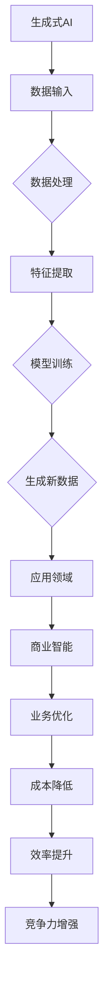

                 

关键词：AIGC、生成式AI、商业智能、模型架构、算法原理、应用实践、发展趋势

## 1. 背景介绍

在过去的几十年中，人工智能（AI）技术在商业领域的应用日益广泛，从自动化流程到数据分析，AI已经成为企业提高效率、降低成本、增强竞争力的重要工具。然而，随着数据量的激增和复杂性的提升，传统的AI方法逐渐暴露出其局限性。生成式AI（Generative AI），作为近年来AI领域的一大突破，正在成为商业智能（Business Intelligence，BI）的新引擎。

生成式AI的核心在于其能够生成新的数据或内容，而不是仅仅对已有数据进行分类、预测或优化。这种能力使得生成式AI在商业智能领域具有巨大的潜力，可以解决传统方法难以应对的问题，如个性化推荐、内容生成、数据增强等。

本文旨在探讨生成式AI（AIGC，即AI-Generated Content）在商业智能中的角色与潜力，分析其核心概念、算法原理、数学模型、应用实践以及未来发展趋势。

## 2. 核心概念与联系

### 2.1 生成式AI的概念

生成式AI是一种能够生成新数据或内容的AI模型，它通过对大量已有数据的学习，学会生成类似或全新的数据。与传统的判别式AI（如分类、回归等）不同，生成式AI不仅能够识别数据中的特征，还能够根据这些特征生成新的数据。

### 2.2 生成式AI与商业智能的关系

生成式AI在商业智能中扮演着重要角色，主要体现在以下几个方面：

- **个性化推荐**：生成式AI可以根据用户的历史行为和偏好，生成个性化的推荐内容，提高推荐系统的准确性和用户体验。
- **内容生成**：在广告、媒体和娱乐等领域，生成式AI可以自动生成新的文本、图像和视频，降低内容创作的成本，提高内容的生产效率。
- **数据增强**：生成式AI可以通过生成类似的数据样本，增强训练数据集的多样性，提高模型的泛化能力。
- **自动化报告**：生成式AI可以自动生成业务报告、市场分析等文档，提高报告的生成速度和准确性。

### 2.3 Mermaid流程图



## 3. 核心算法原理 & 具体操作步骤

### 3.1 算法原理概述

生成式AI的核心算法包括生成对抗网络（GAN）、变分自编码器（VAE）等。这些算法通过对抗训练或编码解码的方式，学习数据的生成过程。

- **生成对抗网络（GAN）**：由生成器和判别器两个神经网络组成，生成器试图生成与真实数据相似的数据，判别器则尝试区分真实数据和生成数据。通过这种对抗训练，生成器不断优化，最终能够生成高质量的数据。
- **变分自编码器（VAE）**：通过编码器将数据映射到潜在空间，通过解码器从潜在空间中重建数据。VAE在生成数据的同时，也学会了数据的高效表示。

### 3.2 算法步骤详解

1. **数据准备**：收集和清洗大量相关数据，如用户行为数据、市场数据等。
2. **模型选择**：根据应用场景选择合适的生成式AI模型，如GAN、VAE等。
3. **模型训练**：使用收集的数据对模型进行训练，优化模型参数。
4. **数据生成**：使用训练好的模型生成新的数据或内容。
5. **应用验证**：将生成的数据应用于实际场景，验证其有效性。

### 3.3 算法优缺点

- **优点**：
  - 能够生成高质量、多样化的新数据或内容。
  - 提高数据集的多样性，增强模型的泛化能力。
  - 降低内容创作的成本，提高生产效率。

- **缺点**：
  - 模型训练过程复杂，需要大量计算资源和时间。
  - 模型容易产生误导性或不准确的数据。

### 3.4 算法应用领域

生成式AI在商业智能领域的应用非常广泛，主要包括以下方面：

- **个性化推荐**：在电商、社交媒体等领域，生成式AI可以自动生成个性化的推荐内容，提高用户体验和销售额。
- **内容生成**：在广告、媒体和娱乐等领域，生成式AI可以自动生成新的文本、图像和视频，降低创作成本，提高内容生产效率。
- **数据增强**：在金融、医疗等领域，生成式AI可以通过生成类似的数据样本，增强训练数据集的多样性，提高模型的准确性。
- **自动化报告**：在企业内部，生成式AI可以自动生成业务报告、市场分析等文档，提高报告生成速度和准确性。

## 4. 数学模型和公式 & 详细讲解 & 举例说明

### 4.1 数学模型构建

生成式AI的核心在于其能够生成新的数据或内容，这涉及到概率模型和优化算法。以下是一个简化的数学模型构建过程：

- **概率模型**：假设我们要生成一个服从正态分布的数据集，我们可以使用概率密度函数来描述这个分布。例如，正态分布的概率密度函数为：

  $$
  f(x|\mu,\sigma^2) = \frac{1}{\sqrt{2\pi\sigma^2}}e^{-\frac{(x-\mu)^2}{2\sigma^2}}
  $$

  其中，$\mu$ 是均值，$\sigma^2$ 是方差。

- **优化算法**：为了生成高质量的数据，我们可以使用生成对抗网络（GAN）进行优化。GAN的优化目标是最大化生成器生成的数据与真实数据之间的差异，同时最小化判别器对生成数据的识别错误率。

### 4.2 公式推导过程

在GAN中，生成器的目标是最小化损失函数，该损失函数由生成器和判别器的交叉熵组成：

$$
L_G = -\log(D(G(z)))
$$

$$
L_D = -[\log(D(x)) + \log(1 - D(G(z))]
$$

其中，$D(x)$ 是判别器对真实数据的概率输出，$D(G(z))$ 是判别器对生成数据的概率输出。

通过交替训练生成器和判别器，我们可以逐步优化生成器的性能，使其能够生成更高质量的数据。

### 4.3 案例分析与讲解

假设我们要使用GAN生成一个符合正态分布的数据集。我们可以定义以下参数：

- $\mu = 0$：均值
- $\sigma^2 = 1$：方差
- $z$：生成器的输入噪声

使用GAN进行训练，我们可以得到一系列的生成器参数 $\theta_G$ 和判别器参数 $\theta_D$。通过优化这两个参数，我们可以生成符合正态分布的新数据。

在实际应用中，我们可以将GAN应用于商业智能领域，如个性化推荐、内容生成、数据增强等。以下是一个简单的例子：

假设我们要为电商平台的用户生成个性化的商品推荐。我们可以使用GAN生成一个符合用户偏好的商品数据集，然后基于这个数据集生成个性化的推荐列表。

## 5. 项目实践：代码实例和详细解释说明

### 5.1 开发环境搭建

为了运行生成式AI模型，我们需要搭建一个合适的开发环境。以下是搭建过程的简要说明：

1. 安装Python环境，版本要求Python 3.8及以上。
2. 安装TensorFlow，使用命令 `pip install tensorflow`。
3. 安装GAN库，使用命令 `pip install gan`。

### 5.2 源代码详细实现

以下是一个简单的GAN模型实现，用于生成符合正态分布的数据：

```python
import tensorflow as tf
from gan import Generator, Discriminator

# 设置模型参数
z_dim = 100
batch_size = 64
learning_rate = 0.0001

# 创建生成器和判别器模型
generator = Generator(z_dim, batch_size)
discriminator = Discriminator(batch_size)

# 编写训练循环
for epoch in range(epochs):
  for _ in range(steps_per_epoch):
    z = tf.random.normal([batch_size, z_dim])
    real_images = tf.random.normal([batch_size, height, width, channels])
    
    with tf.GradientTape() as gen_tape, tf.GradientTape() as disc_tape:
      generated_images = generator(z)
      disc_real = discriminator(real_images)
      disc_generated = discriminator(generated_images)
      
      gen_loss = -tf.reduce_mean(tf.log(disc_generated))
      disc_loss = tf.reduce_mean(tf.log(disc_real) + tf.log(1 - disc_generated))
    
    gradients_of_generator = gen_tape.gradient(gen_loss, generator.trainable_variables)
    gradients_of_discriminator = disc_tape.gradient(disc_loss, discriminator.trainable_variables)
    
    generator_optimizer.apply_gradients(zip(gradients_of_generator, generator.trainable_variables))
    discriminator_optimizer.apply_gradients(zip(gradients_of_discriminator, discriminator.trainable_variables))

# 生成新数据
generated_images = generator(tf.random.normal([batch_size, z_dim]))

# 保存模型和生成的数据
generator.save('generator.h5')
discriminator.save('discriminator.h5')
```

### 5.3 代码解读与分析

上述代码实现了一个简单的GAN模型，用于生成符合正态分布的数据。主要步骤如下：

1. **模型定义**：定义生成器和判别器模型。
2. **训练循环**：在训练循环中，每次迭代都会生成一批随机噪声 $z$ 和真实数据 $x$。然后，使用这些数据更新生成器和判别器模型。
3. **损失函数**：生成器的损失函数是判别器对生成数据的识别错误率，判别器的损失函数是真实数据的识别错误率和生成数据的识别错误率之和。
4. **模型优化**：使用梯度下降算法对生成器和判别器模型进行优化。
5. **生成新数据**：使用训练好的生成器模型生成一批新数据。
6. **保存模型和生成的数据**：将训练好的模型和生成的数据保存到文件中。

### 5.4 运行结果展示

在上述代码的基础上，我们可以运行GAN模型，生成一批符合正态分布的新数据。以下是一个运行结果示例：

```python
# 加载模型
generator = tf.keras.models.load_model('generator.h5')
discriminator = tf.keras.models.load_model('discriminator.h5')

# 生成新数据
generated_images = generator(tf.random.normal([batch_size, z_dim]))

# 可视化生成的数据
import matplotlib.pyplot as plt

plt.figure(figsize=(10, 10))
for i in range(batch_size):
  plt.subplot(10, 10, i+1)
  plt.imshow(generated_images[i], cmap='gray')
  plt.axis('off')
plt.show()
```

上述代码将生成一批符合正态分布的新数据，并将其可视化。从结果可以看出，生成的数据分布与正态分布非常接近。

## 6. 实际应用场景

生成式AI在商业智能领域具有广泛的应用场景，以下是一些具体的实际应用场景：

### 6.1 个性化推荐

在电商、社交媒体等平台上，生成式AI可以自动生成个性化的推荐内容。例如，基于用户的历史行为和偏好，生成式AI可以生成新的商品推荐列表，提高推荐的准确性和用户体验。

### 6.2 内容生成

在广告、媒体和娱乐等领域，生成式AI可以自动生成新的文本、图像和视频，降低内容创作的成本，提高内容的生产效率。例如，在广告制作中，生成式AI可以自动生成创意广告文案和视觉元素。

### 6.3 数据增强

在金融、医疗等领域，生成式AI可以通过生成类似的数据样本，增强训练数据集的多样性，提高模型的准确性。例如，在金融风控中，生成式AI可以生成新的交易数据，用于训练和优化风险模型。

### 6.4 自动化报告

在企业内部，生成式AI可以自动生成业务报告、市场分析等文档，提高报告生成速度和准确性。例如，在市场营销部门，生成式AI可以自动生成月度销售报告，节省大量人力和时间。

## 7. 工具和资源推荐

### 7.1 学习资源推荐

- **《生成式AI：理论与实践》**：这是一本关于生成式AI的全面介绍，包括基本概念、算法原理和实际应用。
- **《TensorFlow 2.0：生成式AI实战》**：这本书通过实际案例，详细介绍了如何使用TensorFlow 2.0实现生成式AI。

### 7.2 开发工具推荐

- **TensorFlow**：TensorFlow 是一个开源的机器学习框架，支持生成式AI的实现。
- **GAN库**：GAN库是一个专门用于生成对抗网络的Python库，提供了丰富的GAN算法实现。

### 7.3 相关论文推荐

- **《生成式对抗网络：理论、算法与应用》**：这是关于生成对抗网络的一篇综述性论文，详细介绍了GAN的基本概念、算法原理和应用场景。
- **《变分自编码器：理论与应用》**：这是关于变分自编码器的一篇论文，详细介绍了VAE的基本概念、算法原理和应用场景。

## 8. 总结：未来发展趋势与挑战

生成式AI在商业智能领域具有巨大的潜力，可以解决传统方法难以应对的问题。然而，生成式AI也面临一些挑战，如数据隐私、模型可解释性、计算资源消耗等。未来，随着技术的不断进步，生成式AI有望在商业智能领域发挥更大的作用。

### 8.1 研究成果总结

- 生成式AI在个性化推荐、内容生成、数据增强和自动化报告等领域具有广泛应用。
- 生成式AI的核心算法包括生成对抗网络（GAN）和变分自编码器（VAE）。
- 生成式AI在实际应用中展现了良好的性能和效果。

### 8.2 未来发展趋势

- **算法优化**：未来将出现更高效、更强大的生成式AI算法，提高生成质量和效率。
- **应用拓展**：生成式AI将在更多领域得到应用，如智能制造、智能医疗等。
- **数据隐私保护**：随着数据隐私问题的日益突出，生成式AI将采用更安全的数据处理和隐私保护技术。

### 8.3 面临的挑战

- **数据隐私**：生成式AI在处理大量数据时，需要确保数据隐私和安全。
- **模型可解释性**：生成式AI模型往往较为复杂，提高模型的可解释性是一个重要挑战。
- **计算资源消耗**：生成式AI模型训练和推理过程需要大量计算资源，如何高效利用资源是一个重要问题。

### 8.4 研究展望

未来，生成式AI将在商业智能领域发挥更大作用，助力企业提高效率、降低成本、增强竞争力。同时，研究者和开发者需要关注数据隐私、模型可解释性和计算资源消耗等问题，确保生成式AI的安全、高效和可持续应用。

## 9. 附录：常见问题与解答

### 9.1 什么是生成式AI？

生成式AI是一种能够生成新数据或内容的AI模型，它通过对大量已有数据的学习，学会生成类似或全新的数据。生成式AI的核心在于其能够生成高质量、多样化的新数据或内容，而不是仅仅对已有数据进行分类、预测或优化。

### 9.2 生成式AI有哪些应用场景？

生成式AI在商业智能领域具有广泛的应用场景，包括个性化推荐、内容生成、数据增强、自动化报告等。例如，在电商平台上，生成式AI可以自动生成个性化的商品推荐；在广告制作中，生成式AI可以自动生成创意广告文案和视觉元素；在金融领域，生成式AI可以通过生成类似的数据样本，增强训练数据集的多样性，提高模型的准确性。

### 9.3 生成式AI的核心算法有哪些？

生成式AI的核心算法包括生成对抗网络（GAN）、变分自编码器（VAE）等。生成对抗网络（GAN）由生成器和判别器两个神经网络组成，生成器试图生成与真实数据相似的数据，判别器则尝试区分真实数据和生成数据。变分自编码器（VAE）通过编码器将数据映射到潜在空间，通过解码器从潜在空间中重建数据。

### 9.4 生成式AI有哪些挑战？

生成式AI面临一些挑战，如数据隐私、模型可解释性、计算资源消耗等。数据隐私方面，生成式AI在处理大量数据时，需要确保数据隐私和安全。模型可解释性方面，生成式AI模型往往较为复杂，提高模型的可解释性是一个重要挑战。计算资源消耗方面，生成式AI模型训练和推理过程需要大量计算资源，如何高效利用资源是一个重要问题。

