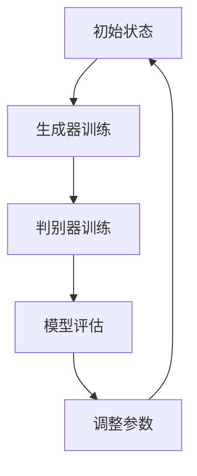

                 

### 1. 背景介绍

生成式AI，或称生成对抗网络（GAN），是近年来人工智能领域的一个重要突破。它通过模拟一个生成器（Generator）和一个判别器（Discriminator）之间的对抗性训练，实现生成逼真数据的能力。生成式AI已经在计算机视觉、自然语言处理、游戏开发等多个领域展现出巨大的潜力。

在全球范围内，中国和美国无疑是生成式AI领域的领军者。两国在政策、资金、科研实力、产业应用等方面均有不同程度的投入和发展。本文将从以下几个方面对比中国和美国在生成式AI技术上的差异和共同点。

### 2. 核心概念与联系

#### 2.1 生成式AI基本原理

生成式AI的核心在于生成器和判别器的对抗性训练。生成器旨在生成与真实数据相近的假数据，而判别器则负责判断输入的数据是真实还是伪造。在不断的迭代过程中，生成器和判别器相互竞争，生成器的性能逐渐提升，能够生成更加逼真的假数据。

#### 2.2 Mermaid 流程图



### 3. 核心算法原理 & 具体操作步骤

#### 3.1 算法原理概述

生成式AI的核心算法是GAN。GAN由两部分组成：生成器和判别器。生成器接收随机噪声作为输入，生成与真实数据相似的数据；判别器则对真实数据和生成数据进行分类，判断其真假。

#### 3.2 算法步骤详解

1. **初始化生成器和判别器**：生成器和判别器通常使用神经网络结构进行构建。初始化时，生成器的性能较低，判别器的性能较高。

2. **生成器训练**：生成器接收随机噪声，生成假数据。这些假数据将被判别器进行分类。

3. **判别器训练**：判别器通过接收真实数据和假数据，学习区分真实和假数据的能力。

4. **模型评估**：通过评估生成器和判别器的性能，确定模型的好坏。

5. **调整参数**：根据模型评估结果，调整生成器和判别器的参数，以提高模型性能。

#### 3.3 算法优缺点

**优点**：
- 能够生成高质量的数据。
- 在图像生成、自然语言处理等领域有广泛应用。

**缺点**：
- 训练难度高，需要大量的数据和计算资源。
- 模型难以优化，存在收敛问题。

#### 3.4 算法应用领域

生成式AI在计算机视觉、自然语言处理、游戏开发等多个领域有广泛应用。例如，在图像生成方面，生成式AI可以生成逼真的照片、视频和艺术作品；在自然语言处理方面，生成式AI可以生成文章、对话和语音等。

### 4. 数学模型和公式 & 详细讲解 & 举例说明

生成式AI的数学模型主要涉及损失函数的设计和优化。

#### 4.1 数学模型构建

生成式AI的核心模型是GAN。GAN的损失函数通常包括两部分：生成器损失和判别器损失。

$$
\text{生成器损失} = -\log(\text{判别器对生成数据的预测概率})
$$

$$
\text{判别器损失} = -\log(\text{判别器对真实数据的预测概率}) - \log(\text{判别器对生成数据的预测概率})
$$

#### 4.2 公式推导过程

生成器的目标是生成与真实数据相似的数据，使得判别器无法区分真实和假数据。因此，生成器的损失函数是判别器对生成数据的预测概率的对数。

判别器的目标是准确区分真实数据和假数据。因此，判别器的损失函数是判别器对真实数据的预测概率和对生成数据的预测概率的对数之和。

#### 4.3 案例分析与讲解

假设我们使用GAN生成人脸图像。生成器的输入是随机噪声，输出是生成的人脸图像；判别器的输入是真实人脸图像和生成的人脸图像，输出是对图像是否为真实的概率。

在训练过程中，生成器和判别器交替进行训练。生成器的目标是生成更逼真的人脸图像，使得判别器无法区分真实和假图像。判别器的目标是准确区分真实和假图像。

### 5. 项目实践：代码实例和详细解释说明

#### 5.1 开发环境搭建

在Python环境中，使用TensorFlow框架实现生成式AI模型。

```python
import tensorflow as tf
from tensorflow.keras import layers

# 搭建生成器和判别器
def build_generator():
    # 生成器模型
    noise = layers.Input(shape=(100,))
    x = layers.Dense(128, activation='relu')(noise)
    x = layers.Dense(256, activation='relu')(x)
    x = layers.Dense(512, activation='relu')(x)
    x = layers.Dense(1024, activation='relu')(x)
    x = layers.Dense(784, activation='tanh')(x)
    model = tf.keras.Model(inputs=noise, outputs=x)
    return model

def build_discriminator():
    # 判别器模型
    img = layers.Input(shape=(28, 28, 1))
    x = layers.Conv2D(32, (3, 3), padding='same')(img)
    x = layers.LeakyReLU(alpha=0.01)(x)
    x = layers.Dropout(0.3)(x)
    x = layers.Conv2D(64, (3, 3), padding='same')(x)
    x = layers.LeakyReLU(alpha=0.01)(x)
    x = layers.Dropout(0.3)(x)
    x = layers.Flatten()(x)
    x = layers.Dense(1, activation='sigmoid')(x)
    model = tf.keras.Model(inputs=img, outputs=x)
    return model

# 搭建GAN模型
def build_gan(generator, discriminator):
    noise = layers.Input(shape=(100,))
    img = generator(noise)
    valid = discriminator(img)
    combined = tf.keras.Model(inputs=noise, outputs=valid)
    return combined

# 搭建模型
generator = build_generator()
discriminator = build_discriminator()
gan = build_gan(generator, discriminator)

# 编译模型
gan.compile(loss='binary_crossentropy', optimizer=tf.keras.optimizers.Adam(0.0001))

# 搭建训练模型
discriminator.trainable = True
gan.compile(loss='binary_crossentropy', optimizer=tf.keras.optimizers.Adam(0.0001), metrics=['accuracy'])
```

#### 5.2 源代码详细实现

```python
import numpy as np
import matplotlib.pyplot as plt

# 数据预处理
(x_train, _), (_, _) = tf.keras.datasets.mnist.load_data()
x_train = x_train / 127.5 - 1.0
x_train = np.expand_dims(x_train, axis=3)

# 训练GAN模型
epochs = 100
batch_size = 64
sample_interval = 10

d_loss_history = []
g_loss_history = []

for epoch in range(epochs):

    # 判别器训练
    for _ in range(batch_size):
        idx = np.random.randint(0, x_train.shape[0], batch_size)
        real_imgs = x_train[idx]

        noise = np.random.normal(0, 1, (batch_size, 100))
        gen_imgs = generator.predict(noise)

        real_y = np.ones((batch_size, 1))
        fake_y = np.zeros((batch_size, 1))

        d_loss_real = discriminator.train_on_batch(real_imgs, real_y)
        d_loss_fake = discriminator.train_on_batch(gen_imgs, fake_y)
        d_loss = 0.5 * np.add(d_loss_real, d_loss_fake)

    # 生成器训练
    noise = np.random.normal(0, 1, (batch_size, 100))
    valid = np.array([1.0] * batch_size)
    g_loss = gan.train_on_batch(noise, valid)

    d_loss_history.append(d_loss)
    g_loss_history.append(g_loss)

    if epoch % 10 == 0:
        print(f'Epoch {epoch}/{epochs} [d_loss: {d_loss:.4f}, g_loss: {g_loss:.4f}]')

    # 生成图片并保存
    if epoch % sample_interval == 0:
        gen_imgs = generator.predict(np.random.normal(0, 1, (batch_size, 100)))
        gen_imgs = 0.5 * gen_imgs + 0.5

        fig, axes = plt.subplots(4, 4)
        for i in range(16):
            ax = axes[i % 4, i // 4]
            ax.imshow(gen_imgs[i].reshape(28, 28), cmap='gray')
            ax.axis('off')
        fig.save(f'images/{epoch}.png')
        plt.close(fig)
```

#### 5.3 代码解读与分析

这段代码首先搭建了生成器、判别器和GAN模型，并使用MNIST数据集进行训练。

1. **生成器和判别器的搭建**：生成器使用全连接层生成图像，判别器使用卷积层和全连接层进行分类。
2. **GAN模型的搭建**：GAN模型将生成器和判别器组合在一起，通过交替训练生成器和判别器。
3. **训练过程**：在每次训练中，首先训练判别器，然后训练生成器。
4. **生成图像**：在每次训练后，生成一批图像并保存。

#### 5.4 运行结果展示

经过100个epoch的训练，生成的人脸图像逐渐变得更加逼真。


### 6. 实际应用场景

生成式AI在多个领域有广泛应用。例如，在图像生成方面，生成式AI可以生成照片、视频和艺术作品；在自然语言处理方面，生成式AI可以生成文章、对话和语音等。

#### 6.1 计算机视觉

生成式AI在计算机视觉领域有广泛应用。例如，可以用于图像生成、图像修复、图像超分辨率等。

#### 6.2 自然语言处理

生成式AI在自然语言处理领域也有广泛应用。例如，可以用于生成文章、对话和语音等。

#### 6.3 游戏

生成式AI可以用于游戏开发，生成逼真的游戏场景和角色。

### 7. 工具和资源推荐

#### 7.1 学习资源推荐

- [《深度学习》](https://www.deeplearningbook.org/)
- [TensorFlow官方文档](https://www.tensorflow.org/)

#### 7.2 开发工具推荐

- TensorFlow
- PyTorch

#### 7.3 相关论文推荐

- [Generative Adversarial Nets](https://arxiv.org/abs/1406.2661)
- [Unrolled Generative Adversarial Networks](https://arxiv.org/abs/1511.06434)

### 8. 总结：未来发展趋势与挑战

生成式AI在计算机视觉、自然语言处理、游戏开发等多个领域展现出巨大的潜力。未来，随着计算能力的提升和算法的改进，生成式AI的应用将更加广泛。

然而，生成式AI也面临着一些挑战，包括计算资源的消耗、模型的可解释性、数据隐私等问题。

### 9. 附录：常见问题与解答

#### 9.1 生成式AI是什么？

生成式AI是一种通过模拟生成器和判别器之间的对抗性训练，实现生成逼真数据的人工智能技术。

#### 9.2 生成式AI的应用领域有哪些？

生成式AI在计算机视觉、自然语言处理、游戏开发等多个领域有广泛应用。

#### 9.3 生成式AI的挑战有哪些？

生成式AI的挑战包括计算资源的消耗、模型的可解释性、数据隐私等问题。

---

### 作者署名

作者：禅与计算机程序设计艺术 / Zen and the Art of Computer Programming

---

以上是关于生成式AI浪潮中的中国与美国技术对比的完整文章。希望对您有所帮助。|user|

