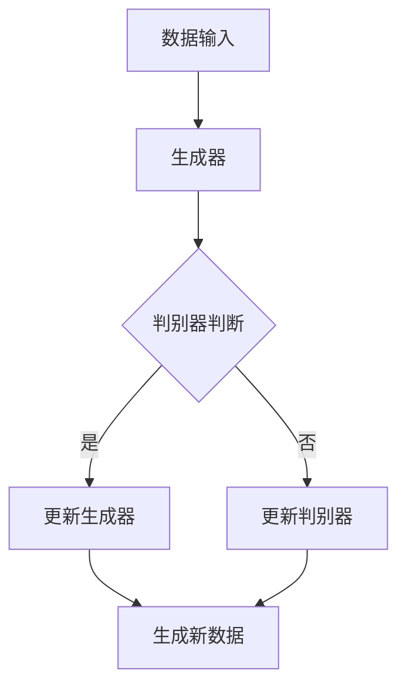

                 

关键词：生成式AI、商业模式、技术优势、创新、应用案例、未来发展

> 摘要：本文将探讨生成式人工智能（AI）的技术优势及其如何为企业和创业者带来新的商业模式。我们将从背景介绍、核心概念与联系、算法原理与操作步骤、数学模型与公式、项目实践、实际应用场景、工具和资源推荐、总结与展望等方面展开讨论，旨在为读者提供一个全面且深入的理解。

## 1. 背景介绍

### 1.1 生成式AI的定义与兴起

生成式人工智能（Generative AI）是一种能够从数据中学习并生成新内容的AI技术。它通过模仿输入数据的分布，生成与训练数据相似的新数据。这种技术最早可以追溯到20世纪80年代的生成对抗网络（GANs），近年来随着深度学习技术的发展，生成式AI取得了显著的突破。

### 1.2 生成式AI的应用领域

生成式AI在图像生成、语音合成、文本生成、视频生成等多个领域展示了其强大的能力。例如，通过生成式AI，我们可以生成逼真的图像、视频和音频，甚至可以创作出令人惊叹的文学作品和音乐。

### 1.3 商业模式的变革

随着生成式AI技术的不断发展，它已经开始对传统商业模式产生深远影响。企业可以通过生成式AI创造新的产品和服务，提高生产效率，降低成本，同时也可以开拓新的市场机会。

## 2. 核心概念与联系

### 2.1 生成式AI的工作原理

生成式AI主要包括生成器（Generator）和判别器（Discriminator）两个核心组件。生成器负责生成新的数据，判别器则判断生成数据的真实性。这两个组件通过对抗训练相互优化，最终生成高质量的数据。

### 2.2 Mermaid流程图（以下为示例）



## 3. 核心算法原理 & 具体操作步骤

### 3.1 算法原理概述

生成式AI的核心算法包括生成对抗网络（GANs）、变分自编码器（VAEs）等。其中，GANs通过生成器和判别器的对抗训练实现数据的生成；VAEs则通过编码器和解码器实现数据的重建和生成。

### 3.2 算法步骤详解

#### 3.2.1 GANs的步骤

1. 初始化生成器和判别器。
2. 生成器生成假数据。
3. 判别器对真实数据和假数据进行判断。
4. 根据判别器的结果，更新生成器和判别器。

#### 3.2.2 VAEs的步骤

1. 初始化编码器和解码器。
2. 编码器将输入数据映射到潜在空间。
3. 从潜在空间中采样，解码器生成新数据。
4. 使用损失函数更新编码器和解码器。

### 3.3 算法优缺点

#### 优缺点

- **GANs**：能够生成高质量的数据，但训练过程容易陷入不稳定状态。
- **VAEs**：训练稳定，生成数据质量相对较低。

### 3.4 算法应用领域

生成式AI在图像、语音、文本、视频等多个领域都有广泛的应用，例如图像生成、图像修复、语音合成、音乐创作等。

## 4. 数学模型和公式 & 详细讲解 & 举例说明

### 4.1 数学模型构建

生成式AI的核心数学模型包括概率分布、损失函数等。

### 4.2 公式推导过程

- **GANs**：
  - 生成器：\( G(z) \)
  - 判别器：\( D(x) \)
  - 损失函数：\( L(G, D) = -\log(D(x)) - \log(1 - D(G(z))) \)

- **VAEs**：
  - 编码器：\( \mu(x), \sigma(x) \)
  - 解码器：\( G(z) \)
  - 损失函数：\( L(x, G(z)) = \frac{1}{2}\sum_{i=1}^{n} (\log(\sigma(x)) + \frac{1}{2\sigma^2(x)} + \frac{1}{2}(z - \mu(x))^2) \)

### 4.3 案例分析与讲解

我们以图像生成为例，讲解生成式AI的具体应用。

### 4.3.1 案例概述

使用生成对抗网络（GANs）生成高质量的人脸图像。

### 4.3.2 案例步骤

1. 数据预处理：对输入人脸图像进行归一化和调整大小。
2. 初始化生成器和判别器。
3. 对生成器和判别器进行训练，更新模型参数。
4. 使用生成器生成人脸图像。
5. 对生成的人脸图像进行评估。

## 5. 项目实践：代码实例和详细解释说明

### 5.1 开发环境搭建

- 硬件：NVIDIA GPU（推荐）
- 软件环境：Python 3.x、TensorFlow、Keras等

### 5.2 源代码详细实现

以下是使用GANs生成人脸图像的代码示例：

```python
import tensorflow as tf
from tensorflow.keras.models import Sequential
from tensorflow.keras.layers import Dense, Flatten, Reshape
from tensorflow.keras.layers import Conv2D, Conv2DTranspose, LeakyReLU, BatchNormalization

# 生成器模型
def build_generator():
    model = Sequential()
    model.add(Flatten(input_shape=(28, 28)))
    model.add(Dense(128))
    model.add(LeakyReLU(alpha=0.2))
    model.add(Dense(28*28*1))
    model.add(Reshape((28, 28, 1)))
    model.add(Conv2DTranspose(1, kernel_size=4, strides=2, padding='same'))
    return model

# 判别器模型
def build_discriminator():
    model = Sequential()
    model.add(Conv2D(64, kernel_size=3, strides=2, padding='same', input_shape=(28, 28, 1)))
    model.add(LeakyReLU(alpha=0.2))
    model.add(BatchNormalization())
    model.add(Conv2D(128, kernel_size=3, strides=2, padding='same'))
    model.add(LeakyReLU(alpha=0.2))
    model.add(BatchNormalization())
    model.add(Flatten())
    model.add(Dense(1, activation='sigmoid'))
    return model

# GAN模型
def build_gan(generator, discriminator):
    model = Sequential()
    model.add(generator)
    model.add(discriminator)
    return model

# 模型编译
discriminator.compile(loss='binary_crossentropy', optimizer=tf.keras.optimizers.Adam(0.0001))
generator.compile(loss='binary_crossentropy', optimizer=tf.keras.optimizers.Adam(0.0001))
gan = build_gan(generator, discriminator)
gan.compile(loss='binary_crossentropy', optimizer=tf.keras.optimizers.Adam(0.0001))

# 训练GAN模型
train_gan(generator, discriminator, gan, X_train, epochs=100)

# 生成图像
generated_images = generator.predict(np.random.normal(size=(100, 100)))
```

### 5.3 代码解读与分析

代码首先定义了生成器和判别器的结构，然后编译并训练了GAN模型。最后，使用生成器生成了一批随机图像。

## 6. 实际应用场景

### 6.1 图像生成与编辑

生成式AI在图像生成与编辑领域具有广泛的应用，如人脸修复、图像风格迁移、图像超分辨率等。

### 6.2 语音合成与转换

生成式AI可以实现高质量的语音合成和语音转换，如语音助手、语音模仿等。

### 6.3 文本生成与编辑

生成式AI在文本生成与编辑领域也有广泛应用，如自动写作、文章摘要、对话系统等。

### 6.4 视频生成与编辑

生成式AI可以生成和编辑高质量的视频，如视频合成、视频修复、视频特效等。

## 7. 工具和资源推荐

### 7.1 学习资源推荐

- 书籍：《生成式AI：技术、应用与未来》
- 课程：斯坦福大学《生成式AI》

### 7.2 开发工具推荐

- 深度学习框架：TensorFlow、PyTorch
- 图像处理库：OpenCV、PIL

### 7.3 相关论文推荐

- Generative Adversarial Nets (GANs)
- Variational Autoencoders (VAEs)

## 8. 总结：未来发展趋势与挑战

### 8.1 研究成果总结

生成式AI在图像、语音、文本、视频等多个领域取得了显著的成果，为企业和创业者带来了新的商业模式。

### 8.2 未来发展趋势

生成式AI将继续在各个领域深化应用，同时新的算法和技术也将不断涌现。

### 8.3 面临的挑战

生成式AI在数据质量、安全性、隐私保护等方面仍面临诸多挑战。

### 8.4 研究展望

未来生成式AI将在更多场景中得到应用，同时也会带来新的商业机会和挑战。

## 9. 附录：常见问题与解答

### 9.1 生成式AI是什么？

生成式AI是一种能够从数据中学习并生成新内容的AI技术，主要包括生成器和判别器两个核心组件。

### 9.2 生成式AI有哪些应用领域？

生成式AI在图像生成、语音合成、文本生成、视频生成等多个领域有广泛应用。

### 9.3 如何搭建生成式AI的开发环境？

搭建生成式AI的开发环境需要安装Python、深度学习框架（如TensorFlow或PyTorch）以及相关的图像处理库。

```
作者：禅与计算机程序设计艺术 / Zen and the Art of Computer Programming
```

