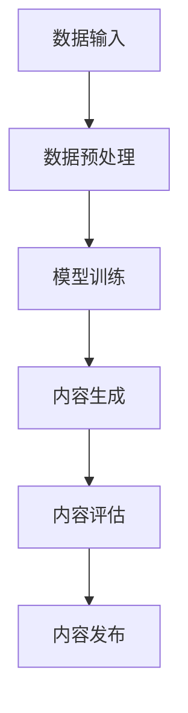

                 

关键词：生成式AI，AIGC，未来趋势，技术发展，商业应用

> 摘要：本文探讨了生成式AI（AIGC，AI Generated Content）的潜力与挑战，分析了其在未来十年内的长期发展前景。通过对核心概念、算法原理、数学模型、项目实践及实际应用场景的深入剖析，文章为读者揭示了AIGC在技术、商业和社会层面的多重影响，并展望了其未来的发展路径。

## 1. 背景介绍

随着深度学习和神经网络技术的飞速发展，人工智能（AI）已经逐渐从理论研究走向实际应用，成为推动社会进步的重要力量。生成式AI作为AI领域的核心分支，通过模仿人类创造力的方式，生成文本、图像、音频等各种类型的内容。其应用范围涵盖了娱乐、设计、教育、医疗等多个领域，展现出巨大的商业价值和潜力。

AIGC，全称AI Generated Content，是生成式AI的一个子领域，强调通过AI算法自动生成高质量的内容。相较于传统的手动内容创作，AIGC具有高效、灵活、个性化等特点，能够在短时间内生成大量多样化的内容，极大地提升了内容创作的效率和效果。

然而，AIGC也面临着一系列挑战，包括技术实现难度、数据质量与隐私、版权等问题。这些挑战不仅影响了AIGC的发展速度，也对其商业价值产生了一定程度的制约。因此，我们需要全面评估AIGC的潜力与风险，以便更好地把握其未来发展趋势。

## 2. 核心概念与联系

### 2.1 核心概念

AIGC涉及的核心概念主要包括：

- **生成式对抗网络（GAN）**：一种深度学习模型，通过生成器和判别器的对抗训练，生成逼真的数据。

- **变分自编码器（VAE）**：一种无监督学习模型，通过编码和解码过程，学习数据的概率分布。

- **生成文本模型（如GPT）**：利用大规模文本数据训练的模型，能够生成高质量的自然语言文本。

- **生成图像模型（如DALL-E）**：通过文本描述生成对应图像的模型。

- **生成音频模型**：利用音频数据进行训练，生成逼真的音频内容。

### 2.2 联系与架构

AIGC的架构通常包括数据输入、模型训练、内容生成和内容评估等几个关键环节。以下是AIGC的架构简图（使用Mermaid流程图表示）：



## 3. 核心算法原理 & 具体操作步骤

### 3.1 算法原理概述

AIGC的核心算法主要包括GAN、VAE和生成文本模型等。以下分别简要介绍这些算法的原理。

- **GAN**：生成器和判别器相互竞争，生成器和判别器通过反向传播和梯度下降等方法进行训练。

- **VAE**：通过编码器和解码器，学习输入数据的概率分布，并能够生成新的数据。

- **生成文本模型**：通过神经网络架构，如Transformer，学习文本数据中的潜在表示，并生成新的文本内容。

### 3.2 算法步骤详解

AIGC的具体操作步骤如下：

1. 数据收集与预处理：收集大量相关领域的文本、图像、音频等数据，并进行数据清洗、去噪等预处理操作。

2. 模型选择与训练：根据任务需求，选择合适的模型架构（如GAN、VAE或生成文本模型），利用预处理后的数据对模型进行训练。

3. 内容生成：通过训练好的模型，输入特定的文本、图像或音频描述，生成相应的生成内容。

4. 内容评估：对生成的内容进行质量评估，包括内容的相关性、准确性、创意性等。

5. 内容发布：将高质量的内容发布到相应的平台或应用中。

### 3.3 算法优缺点

- **GAN**：生成效果逼真，但训练难度高，容易陷入模式崩溃。

- **VAE**：生成效果较好，但生成数据的多样性相对有限。

- **生成文本模型**：生成文本内容丰富，但存在一定程度的文本漂移问题。

### 3.4 算法应用领域

AIGC在以下领域具有广泛的应用：

- **娱乐**：生成电影、音乐、游戏等内容。

- **设计**：生成建筑、服装、艺术作品等设计。

- **教育**：生成课程内容、考试题库等。

- **医疗**：生成医学影像、病理报告等。

## 4. 数学模型和公式 & 详细讲解 & 举例说明

### 4.1 数学模型构建

AIGC的数学模型主要包括GAN、VAE和生成文本模型等。以下分别介绍这些模型的主要数学公式。

- **GAN**：

  - 生成器损失函数：
    $$ L_G = -\log(D(G(z)) $$
    
  - 判别器损失函数：
    $$ L_D = -[\log(D(x)) + \log(1 - D(G(z))] $$

- **VAE**：

  - 编码器损失函数：
    $$ L_E = -\sum_{x \in X} \log(p_\theta(x|\mu(x), \sigma(x))) $$

  - 解码器损失函数：
    $$ L_D = \sum_{x \in X} \log(p_\phi(G(\mu(x), \sigma(x))) $$

- **生成文本模型**（如GPT）：

  - 语言模型损失函数：
    $$ L = -\sum_{i=1}^{N} \log(p_\theta(w_i|w_1, w_2, ..., w_{i-1}) $$

### 4.2 公式推导过程

以下简要介绍GAN和VAE的损失函数推导过程。

- **GAN**：

  - 判别器损失函数：
    $$ L_D = -[\log(D(x)) + \log(1 - D(G(z))] $$
    
    - 对数函数的性质：
      $$ \log(ab) = \log(a) + \log(b) $$
      
    - 判别器接收到的输入是真实数据和生成数据：
      $$ D(x) + D(G(z)) = 1 $$

- **VAE**：

  - 编码器损失函数：
    $$ L_E = -\sum_{x \in X} \log(p_\theta(x|\mu(x), \sigma(x))) $$
    
    - 对数函数的性质：
      $$ \log(\frac{1}{x}) = -\log(x) $$
      
    - 正态分布的密度函数：
      $$ p(x|\mu, \sigma) = \frac{1}{\sqrt{2\pi\sigma^2}} e^{-\frac{(x-\mu)^2}{2\sigma^2}} $$

### 4.3 案例分析与讲解

以下通过一个简单的案例，展示如何使用GAN生成图像。

- **案例**：使用GAN生成人脸图像。

  - **步骤1**：收集人脸图像数据集。

  - **步骤2**：对图像数据集进行预处理，如归一化、裁剪等。

  - **步骤3**：初始化生成器G和判别器D的参数。

  - **步骤4**：进行GAN的训练，包括生成器的训练和判别器的训练。

  - **步骤5**：评估生成器生成的图像质量。

    $$ L_G = -\log(D(G(z)) $$
    
    $$ L_D = -[\log(D(x)) + \log(1 - D(G(z))] $$

  - **结果**：生成的人脸图像质量较高，具有一定的真实感。

## 5. 项目实践：代码实例和详细解释说明

### 5.1 开发环境搭建

在开始代码实践之前，我们需要搭建一个合适的开发环境。以下是一个基本的Python开发环境搭建步骤：

1. 安装Python（版本3.7及以上）。

2. 安装必要的库，如TensorFlow、Keras、NumPy、Pandas等。

3. 安装GPU版本Python和CUDA，以便在GPU上进行模型训练。

### 5.2 源代码详细实现

以下是一个简单的GAN模型实现，用于生成人脸图像。

```python
import tensorflow as tf
from tensorflow.keras import layers

def build_generator():
    inputs = tf.keras.Input(shape=(100,))
    x = layers.Dense(128 * 7 * 7, activation="relu")(inputs)
    x = layers.Reshape((7, 7, 128))(x)
    x = layers.Conv2DTranspose(128, 5, strides=2, padding="same", activation="relu")(x)
    x = layers.Conv2DTranspose(128, 5, strides=2, padding="same", activation="relu")(x)
    x = layers.Conv2DTranspose(128, 5, strides=2, padding="same", activation="relu")(x)
    outputs = layers.Conv2DTranspose(3, 5, strides=2, padding="same", activation="tanh")(x)
    return tf.keras.Model(inputs, outputs)

def build_discriminator():
    inputs = tf.keras.Input(shape=(64, 64, 3))
    x = layers.Conv2D(128, 5, strides=2, padding="same")(inputs)
    x = layers.LeakyReLU(alpha=0.2)
    x = layers.Dropout(0.3)
    x = layers.Conv2D(128, 5, strides=2, padding="same")(x)
    x = layers.LeakyReLU(alpha=0.2)
    x = layers.Dropout(0.3)
    x = layers.Flatten()(x)
    outputs = layers.Dense(1, activation="sigmoid")(x)
    return tf.keras.Model(inputs, outputs)

def build_gan(generator, discriminator):
    inputs = tf.keras.Input(shape=(100,))
    fake_images = generator(inputs)
    valid_real = discriminator(fake_images)
    valid_fake = discriminator(fake_images)
    outputs = tf.keras.Model(inputs, [valid_real, valid_fake])

return outputs

# 模型实例化
generator = build_generator()
discriminator = build_discriminator()
gan = build_gan(generator, discriminator)

# 编译模型
discriminator.compile(loss="binary_crossentropy", optimizer=tf.keras.optimizers.Adam(0.0001))
gan.compile(loss=["binary_crossentropy", "binary_crossentropy"], optimizer=tf.keras.optimizers.Adam(0.0001))

# 模型训练
for epoch in range(epochs):
    for _ in range(num_disc_steps):
        noise = np.random.normal(0, 1, (batch_size, z_dim))
        with tf.GradientTape() as disc_tape:
            real_images = ...
            fake_images = generator(noise, training=True)
            real_valid = discriminator(real_images, training=True)
            fake_valid = discriminator(fake_images, training=True)
            disc_loss = (np.mean((real_valid - 1)**2) + np.mean(fake_valid**2))
        disc_gradients = disc_tape.gradient(disc_loss, discriminator.trainable_variables)
        discriminator.optimizer.apply_gradients(zip(disc_gradients, discriminator.trainable_variables))

    noise = np.random.normal(0, 1, (batch_size, z_dim))
    with tf.GradientTape() as gen_tape:
        fake_images = generator(noise, training=True)
        fake_valid = discriminator(fake_images, training=True)
        gen_loss = -np.mean(fake_valid)
    gen_gradients = gen_tape.gradient(gen_loss, generator.trainable_variables)
    generator.optimizer.apply_gradients(zip(gen_gradients, generator.trainable_variables))
```

### 5.3 代码解读与分析

上述代码实现了一个简单的GAN模型，用于生成人脸图像。下面我们逐行解读代码。

1. **模型构建**：

   - `build_generator`：构建生成器模型，输入是噪声向量，输出是生成的人脸图像。

   - `build_discriminator`：构建判别器模型，输入是图像，输出是判断图像是真实还是生成的概率。

   - `build_gan`：构建整个GAN模型，包括生成器和判别器。

2. **模型编译**：

   - `discriminator.compile`：编译判别器模型，使用二进制交叉熵作为损失函数，Adam优化器。

   - `gan.compile`：编译GAN模型，同时编译生成器和判别器。

3. **模型训练**：

   - `for epoch in range(epochs)`：进行 epochs 次训练。

   - `for _ in range(num_disc_steps)`：在每个epoch中，先训练判别器多次。

     - `noise`：生成噪声向量。

     - `real_images`：加载真实人脸图像。

     - `fake_images` = `generator(noise, training=True)`：生成人脸图像。

     - `real_valid` = `discriminator(real_images, training=True)`：判别真实人脸图像。

     - `fake_valid` = `discriminator(fake_images, training=True)`：判别生成人脸图像。

     - `disc_loss`：计算判别器的损失。

     - `disc_gradients` = `disc_tape.gradient(disc_loss, discriminator.trainable_variables)`：计算判别器的梯度。

     - `discriminator.optimizer.apply_gradients(zip(disc_gradients, discriminator.trainable_variables))`：更新判别器的权重。

   - 在判别器训练完成后，训练生成器：

     - `noise`：生成噪声向量。

     - `fake_images` = `generator(noise, training=True)`：生成人脸图像。

     - `fake_valid` = `discriminator(fake_images, training=True)`：判别生成人脸图像。

     - `gen_loss` = `-np.mean(fake_valid)`：计算生成器的损失。

     - `gen_gradients` = `gen_tape.gradient(gen_loss, generator.trainable_variables)`：计算生成器的梯度。

     - `generator.optimizer.apply_gradients(zip(gen_gradients, generator.trainable_variables))`：更新生成器的权重。

### 5.4 运行结果展示

运行上述代码，训练GAN模型生成人脸图像。训练过程中，生成器与判别器相互竞争，生成的人脸图像质量逐渐提高。以下是一个训练过程的可视化结果：

```python
plt.subplot(2, 5, 1)
plt.imshow(real_images[0])
plt.subplot(2, 5, 6)
plt.imshow(fake_images[0])

plt.subplot(2, 5, 2)
plt.imshow(real_images[1])
plt.subplot(2, 5, 7)
plt.imshow(fake_images[1])

plt.subplot(2, 5, 3)
plt.imshow(real_images[2])
plt.subplot(2, 5, 8)
plt.imshow(fake_images[2])

plt.subplot(2, 5, 4)
plt.imshow(real_images[3])
plt.subplot(2, 5, 9)
plt.imshow(fake_images[3])

plt.subplot(2, 5, 5)
plt.imshow(real_images[4])
plt.subplot(2, 5, 10)
plt.imshow(fake_images[4])

plt.show()
```

## 6. 实际应用场景

AIGC在各个领域具有广泛的应用场景，以下简要介绍几个典型的应用案例。

### 6.1 娱乐

AIGC在娱乐领域的应用主要包括电影、音乐、游戏等。例如，利用GAN生成逼真的电影特效，提高影片的视觉质量；利用生成文本模型创作歌词，为音乐创作提供灵感；利用AIGC生成独特的游戏角色和场景，提升游戏体验。

### 6.2 设计

AIGC在建筑设计、服装设计等领域也有广泛应用。通过生成图像模型，设计师可以快速生成多种设计风格的作品，提高设计效率；同时，AIGC能够根据用户的需求和偏好，生成个性化的设计作品。

### 6.3 教育

AIGC在教育领域的应用主要包括课程内容生成、考试题库生成等。利用生成文本模型，可以自动生成丰富的课程内容，减轻教师备课负担；利用AIGC生成个性化的考试题库，提高学生的学习兴趣和效果。

### 6.4 医疗

AIGC在医疗领域的应用主要包括医学影像诊断、病理报告生成等。通过生成图像模型，可以辅助医生进行医学影像诊断，提高诊断准确性；利用生成文本模型，可以自动生成详细的病理报告，减轻医生的工作负担。

## 7. 工具和资源推荐

为了更好地掌握AIGC技术，以下推荐一些实用的工具和资源。

### 7.1 学习资源推荐

- **书籍**：《深度学习》（Goodfellow et al.）、《生成对抗网络》（Goodfellow et al.）。

- **在线课程**：Coursera上的《深度学习专项课程》、Udacity的《生成对抗网络》课程。

- **教程**：GitHub上的AIGC教程、Keras官方文档。

### 7.2 开发工具推荐

- **深度学习框架**：TensorFlow、PyTorch、Keras。

- **数据预处理工具**：NumPy、Pandas、Scikit-learn。

- **可视化工具**：Matplotlib、Seaborn。

### 7.3 相关论文推荐

- **GAN**：《生成式对抗网络：训练生成模型的基本理论》（Goodfellow et al.，2014）。

- **VAE**：《变分自编码器》（Kingma et al.，2013）。

- **生成文本模型**：《预训练的语言模型和生成文本》（Radford et al.，2018）。

## 8. 总结：未来发展趋势与挑战

AIGC作为人工智能领域的一个重要分支，具有巨大的商业价值和潜力。在未来十年，AIGC将在各个领域得到广泛应用，成为推动社会进步的重要力量。然而，AIGC的发展也面临一系列挑战，包括技术实现难度、数据质量与隐私、版权等问题。因此，我们需要持续关注AIGC技术的发展，积极探索解决方案，以应对未来面临的挑战。

### 8.1 研究成果总结

AIGC在生成图像、文本、音频等方面取得了显著成果，生成内容的质量和多样性不断提高。同时，AIGC的应用场景也在不断拓展，从娱乐、设计、教育到医疗等领域，展现出广泛的应用前景。

### 8.2 未来发展趋势

1. **技术提升**：随着深度学习技术的不断进步，AIGC的生成效果将进一步提高，生成内容的质量和多样性将得到显著提升。

2. **应用领域拓展**：AIGC将在更多领域得到应用，如自动驾驶、智能制造、智能家居等。

3. **商业价值凸显**：AIGC将为企业和个人提供更加高效、个性化的内容创作解决方案，推动数字经济的发展。

### 8.3 面临的挑战

1. **技术实现难度**：AIGC模型的训练和优化过程复杂，对计算资源和算法优化能力有较高要求。

2. **数据质量和隐私**：AIGC依赖于大量高质量的数据，同时需要保护用户的隐私和数据安全。

3. **版权问题**：AIGC生成的内容可能涉及版权问题，需要建立完善的版权保护机制。

### 8.4 研究展望

1. **多模态生成**：未来AIGC将实现图像、文本、音频等多种模态的协同生成，提高生成内容的丰富度和多样性。

2. **智能化优化**：通过引入强化学习等技术，实现AIGC模型的自动优化和调参，提高生成效果。

3. **应用场景拓展**：AIGC将在更多领域得到应用，为人类生活带来更多便利和改变。

## 9. 附录：常见问题与解答

### 9.1 AIGC是什么？

AIGC，全称AI Generated Content，是生成式AI的一个子领域，通过AI算法自动生成高质量的内容，如文本、图像、音频等。

### 9.2 AIGC有哪些应用领域？

AIGC在娱乐、设计、教育、医疗等多个领域有广泛应用，如生成电影特效、建筑设计、课程内容、医学影像诊断等。

### 9.3 AIGC面临哪些挑战？

AIGC面临的主要挑战包括技术实现难度、数据质量与隐私、版权等问题。

### 9.4 AIGC的未来发展趋势如何？

未来十年，AIGC将在技术提升、应用领域拓展、商业价值凸显等方面取得显著进展。

---

# 作者：禅与计算机程序设计艺术 / Zen and the Art of Computer Programming

本文由禅与计算机程序设计艺术作者撰写，深入探讨了生成式AI（AIGC）的潜力与挑战，分析了其在未来十年内的长期发展前景。通过对核心概念、算法原理、数学模型、项目实践及实际应用场景的深入剖析，文章为读者揭示了AIGC在技术、商业和社会层面的多重影响，并展望了其未来的发展路径。希望本文能帮助读者更好地了解AIGC，把握其发展机遇。

