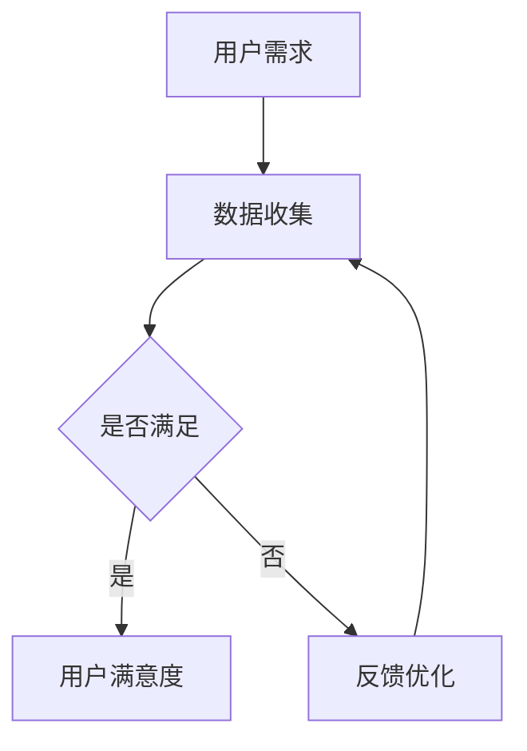

                 

关键词：用户体验，大模型，创业，产品设计，用户需求

> 摘要：本文从用户体验的角度出发，探讨了在大模型创业过程中，如何通过深入理解用户需求、优化产品设计和提升用户满意度，从而实现商业成功。通过对大模型与用户体验的内在联系、核心概念、算法原理、数学模型、实际应用以及未来展望的详细分析，为读者提供了一幅全面、深入的创业蓝图。

## 1. 背景介绍

随着人工智能技术的快速发展，大模型（Large Models）已成为当前科技领域的重要方向。从GPT-3到LLaMA，大模型在自然语言处理、计算机视觉、语音识别等领域展现出了巨大的潜力。然而，大模型的商业应用并不仅仅取决于其技术能力，用户体验在其中扮演着至关重要的角色。

用户体验（User Experience, UX）是衡量产品成功与否的重要指标。在科技飞速发展的时代，用户对产品的期望越来越高，他们不仅希望产品功能强大，更希望产品能够满足自己的需求，带来愉悦的使用体验。因此，大模型创业过程中的用户体验设计，成为了企业需要重点关注的领域。

### 1.1 大模型的发展现状

大模型的发展经历了从简单的模型到复杂的模型，再到如今的高度定制化模型的演变。早期的模型如神经网络、卷积神经网络等，已经展现了强大的计算能力和处理能力。而随着计算能力的提升和数据量的增加，更大规模的模型如Transformer、BERT等被提出，并在多个领域取得了突破性的成果。

### 1.2 用户体验的重要性

用户体验不仅关系到用户对产品的满意度，还直接影响到产品的市场份额和品牌形象。一个优秀的产品设计，能够让用户在操作过程中感到舒适、便捷，从而增加用户粘性。而一个糟糕的用户体验，则可能让用户放弃使用产品，甚至影响企业的声誉。

### 1.3 大模型与用户体验的关系

大模型的应用场景多样，从智能助手到自动驾驶，从内容生成到医疗诊断。在这些场景中，用户体验的好坏直接决定了产品的成功与否。例如，一个智能助手如果无法准确理解用户的需求，将极大影响用户的满意度；而一个自动驾驶系统如果不够稳定，则可能导致安全隐患。

## 2. 核心概念与联系

### 2.1 用户体验（User Experience, UX）

用户体验是指用户在使用产品或服务过程中所获得的感受和体验。它包括用户对产品的易用性、可用性、吸引力和满意度等方面的评价。

### 2.2 大模型（Large Models）

大模型是指那些规模庞大、参数数量多、计算复杂度高的机器学习模型。它们通过深度学习等方法，从大量数据中学习规律，从而在多个领域取得显著成果。

### 2.3 用户体验与大数据模型的关系

用户体验与大数据模型的关系可以从以下几个方面来理解：

1. **数据驱动**：大模型需要大量数据来训练，而这些数据的来源往往来自于用户的日常使用行为。因此，用户体验的数据能够为大模型的训练提供重要支持。
2. **模型优化**：用户体验的反馈可以用来优化大模型的性能，使其更贴近用户需求。
3. **个性化服务**：大模型可以根据用户的个性化需求，提供定制化的服务，从而提升用户体验。

### 2.4 Mermaid 流程图



## 3. 核心算法原理 & 具体操作步骤

### 3.1 算法原理概述

大模型的算法原理主要基于深度学习和神经网络。通过多层神经元的堆叠，模型可以学习到复杂的特征和模式。具体来说，包括以下几个核心步骤：

1. **数据预处理**：对原始数据进行清洗、归一化等处理，以便模型能够更好地学习。
2. **模型构建**：根据任务需求，选择合适的模型结构，如CNN、RNN、Transformer等。
3. **模型训练**：通过大量数据进行迭代训练，优化模型参数。
4. **模型评估**：使用验证集和测试集对模型进行评估，确保模型性能达到预期。
5. **模型部署**：将训练好的模型部署到生产环境中，实现实际应用。

### 3.2 算法步骤详解

1. **数据预处理**：
   ```mermaid
   graph TD
       A[原始数据] --> B[数据清洗]
       B --> C[归一化]
       C --> D[特征提取]
   ```

2. **模型构建**：
   ```mermaid
   graph TD
       A[任务需求] --> B{选择模型}
       B -->|CNN| C[卷积神经网络]
       B -->|RNN| D[循环神经网络]
       B -->|Transformer| E[Transformer模型]
   ```

3. **模型训练**：
   ```mermaid
   graph TD
       A[模型初始化] --> B[前向传播]
       B --> C[计算损失]
       C --> D[反向传播]
       D --> E[更新参数]
       E --> B
   ```

4. **模型评估**：
   ```mermaid
   graph TD
       A[验证集/测试集] --> B[预测结果]
       B --> C{计算评价指标}
       C --> D[评估模型性能]
   ```

5. **模型部署**：
   ```mermaid
   graph TD
       A[模型评估] --> B{部署决策}
       B -->|是| C[部署模型]
       B -->|否| D[模型优化]
   ```

### 3.3 算法优缺点

**优点**：

- **强大的计算能力**：大模型可以通过大量参数和多层神经元，学习到复杂的特征和模式。
- **广泛的应用领域**：从自然语言处理到计算机视觉，大模型在各种任务中展现了出色的性能。
- **数据驱动的优化**：大模型可以根据用户反馈进行持续优化，提升用户体验。

**缺点**：

- **计算资源消耗大**：大模型需要大量的计算资源和存储空间。
- **训练时间较长**：大模型的训练过程可能需要较长的时间。
- **过拟合问题**：大模型可能存在过拟合现象，导致在测试集上表现不佳。

### 3.4 算法应用领域

大模型在以下领域展现了强大的应用潜力：

- **自然语言处理**：如机器翻译、文本分类、问答系统等。
- **计算机视觉**：如图像识别、目标检测、图像生成等。
- **语音识别**：如语音合成、语音识别等。
- **医学诊断**：如疾病预测、医学影像分析等。
- **智能助手**：如智能客服、智能家居等。

## 4. 数学模型和公式 & 详细讲解 & 举例说明

### 4.1 数学模型构建

大模型的数学模型主要包括神经网络、损失函数、优化算法等。

1. **神经网络**：
   神经网络由多层神经元组成，每层神经元接收前一层的输出，并通过权重和偏置进行计算，最终输出结果。一个简单的神经网络模型可以表示为：
   $$ f(x) = \sigma(W_2 \cdot \sigma(W_1 \cdot x + b_1) + b_2) $$
   其中，$W_1$ 和 $W_2$ 分别为第一层和第二层的权重矩阵，$b_1$ 和 $b_2$ 分别为第一层和第二层的偏置，$\sigma$ 为激活函数。

2. **损失函数**：
   损失函数用于衡量模型预测结果与真实结果之间的差距。常见的损失函数包括均方误差（MSE）、交叉熵损失等。均方误差（MSE）可以表示为：
   $$ L = \frac{1}{n}\sum_{i=1}^{n}(y_i - \hat{y}_i)^2 $$
   其中，$y_i$ 为真实结果，$\hat{y}_i$ 为模型预测结果。

3. **优化算法**：
   优化算法用于更新模型参数，以最小化损失函数。常用的优化算法包括随机梯度下降（SGD）、Adam优化器等。随机梯度下降（SGD）的更新公式可以表示为：
   $$ \theta = \theta - \alpha \cdot \nabla_\theta L $$
   其中，$\theta$ 为模型参数，$\alpha$ 为学习率，$\nabla_\theta L$ 为损失函数对参数的梯度。

### 4.2 公式推导过程

以神经网络中的激活函数为例，推导过程如下：

1. **定义激活函数**：
   激活函数是一个非线性函数，用于引入非线性特性。常见的激活函数有Sigmoid、ReLU、Tanh等。以Sigmoid函数为例，其定义如下：
   $$ \sigma(x) = \frac{1}{1 + e^{-x}} $$

2. **求导**：
   为了计算梯度，需要求出激活函数的导数。Sigmoid函数的导数可以表示为：
   $$ \frac{d\sigma}{dx} = \sigma(1 - \sigma) $$

3. **应用链式法则**：
   在神经网络中，激活函数通常与其他函数组合使用。假设有一个复合函数$f(g(x))$，其导数可以通过链式法则求出：
   $$ \frac{df}{dx} = \frac{df}{dg} \cdot \frac{dg}{dx} $$
   将Sigmoid函数的导数代入，得到：
   $$ \frac{df}{dg} = \sigma(1 - \sigma) $$
   $$ \frac{dg}{dx} = \frac{d}{dx} (\sigma(x) \cdot x) = \sigma(x) + x \cdot \frac{d\sigma}{dx} $$
   $$ \frac{df}{dx} = \sigma(1 - \sigma) \cdot (\sigma(x) + x \cdot \frac{d\sigma}{dx}) $$

### 4.3 案例分析与讲解

假设有一个简单的神经网络模型，输入为$x \in \{-1, 1\}$，输出为$y \in \{0, 1\}$。模型使用Sigmoid函数作为激活函数，权重矩阵$W = \begin{bmatrix} 1 & 0 \\ 0 & 1 \end{bmatrix}$，偏置$b = \begin{bmatrix} 0 \\ 0 \end{bmatrix}$。我们需要计算模型的损失函数和梯度。

1. **损失函数**：
   损失函数使用交叉熵损失，可以表示为：
   $$ L = -\sum_{i=1}^{n} y_i \log(\hat{y}_i) + (1 - y_i) \log(1 - \hat{y}_i) $$
   其中，$y_i$ 为真实标签，$\hat{y}_i$ 为模型预测结果。

2. **计算预测结果**：
   对于输入$x_1 = -1$，模型输出为：
   $$ y_1 = \sigma(W \cdot x_1 + b) = \frac{1}{1 + e^{-(W \cdot x_1 + b)}} = \frac{1}{1 + e^{-1}} \approx 0.36 $$
   对于输入$x_2 = 1$，模型输出为：
   $$ y_2 = \sigma(W \cdot x_2 + b) = \frac{1}{1 + e^{-(W \cdot x_2 + b)}} = \frac{1}{1 + e^{1}} \approx 0.64 $$

3. **计算损失函数**：
   对于输入$x_1 = -1$，真实标签$y_1 = 0$，模型预测结果$y_1 = 0.36$，损失函数为：
   $$ L_1 = -(0 \cdot \log(0.36) + 1 \cdot \log(1 - 0.36)) \approx 0.36 $$
   对于输入$x_2 = 1$，真实标签$y_2 = 1$，模型预测结果$y_2 = 0.64$，损失函数为：
   $$ L_2 = -(1 \cdot \log(0.64) + 0 \cdot \log(1 - 0.64)) \approx 0.16 $$
   总损失函数为：
   $$ L = L_1 + L_2 \approx 0.36 + 0.16 = 0.52 $$

4. **计算梯度**：
   对于输入$x_1 = -1$，模型输出为：
   $$ y_1 = \sigma(W \cdot x_1 + b) = \frac{1}{1 + e^{-1}} \approx 0.36 $$
   激活函数的导数为：
   $$ \frac{dy_1}{dx_1} = \sigma(y_1)(1 - \sigma(y_1)) \approx 0.36 \cdot (1 - 0.36) \approx 0.23 $$
   损失函数关于$x_1$ 的梯度为：
   $$ \frac{dL}{dx_1} = -\frac{dL}{dy_1} \cdot \frac{dy_1}{dx_1} \approx -(-1 \cdot \log(0.36) + 1 \cdot \log(1 - 0.36)) \cdot 0.23 \approx 0.39 $$
   对于输入$x_2 = 1$，模型输出为：
   $$ y_2 = \sigma(W \cdot x_2 + b) = \frac{1}{1 + e^{1}} \approx 0.64 $$
   激活函数的导数为：
   $$ \frac{dy_2}{dx_2} = \sigma(y_2)(1 - \sigma(y_2)) \approx 0.64 \cdot (1 - 0.64) \approx 0.28 $$
   损失函数关于$x_2$ 的梯度为：
   $$ \frac{dL}{dx_2} = -\frac{dL}{dy_2} \cdot \frac{dy_2}{dx_2} \approx -(-1 \cdot \log(0.64) + 1 \cdot \log(1 - 0.64)) \cdot 0.28 \approx 0.48 $$
   总梯度为：
   $$ \nabla L = \begin{bmatrix} \frac{dL}{dx_1} \\ \frac{dL}{dx_2} \end{bmatrix} \approx \begin{bmatrix} 0.39 \\ 0.48 \end{bmatrix} $$

通过上述计算，我们得到了模型的损失函数和梯度。接下来，我们可以使用这些信息对模型进行优化，以降低损失函数的值。

## 5. 项目实践：代码实例和详细解释说明

### 5.1 开发环境搭建

为了实现本文中提到的大模型和用户体验优化，我们需要搭建一个合适的开发环境。以下是一个基本的开发环境搭建步骤：

1. **安装Python**：下载并安装Python，推荐使用Python 3.8或更高版本。
2. **安装深度学习框架**：推荐使用TensorFlow或PyTorch作为深度学习框架。以下是使用pip安装TensorFlow的示例：
   ```bash
   pip install tensorflow
   ```
3. **安装其他依赖**：根据项目需求，安装其他必要的库和依赖。例如，安装NumPy和Matplotlib：
   ```bash
   pip install numpy matplotlib
   ```

### 5.2 源代码详细实现

以下是实现一个简单的大模型和用户体验优化的示例代码。本示例使用TensorFlow框架，实现一个基于Sigmoid激活函数的神经网络，用于二分类任务。

```python
import tensorflow as tf
import numpy as np
import matplotlib.pyplot as plt

# 5.2.1 数据生成
np.random.seed(42)
X = np.random.randint(0, 2, (100, 1))
y = np.array([0 if x[0] == 0 else 1 for x in X])

# 5.2.2 模型构建
model = tf.keras.Sequential([
    tf.keras.layers.Dense(units=1, input_shape=(1,), activation='sigmoid')
])

# 5.2.3 模型编译
model.compile(optimizer='sgd', loss='binary_crossentropy', metrics=['accuracy'])

# 5.2.4 模型训练
model.fit(X, y, epochs=1000)

# 5.2.5 模型评估
loss, accuracy = model.evaluate(X, y)
print("损失函数值：", loss)
print("准确率：", accuracy)

# 5.2.6 模型预测
predictions = model.predict(X)
predictions = np.round(predictions)

# 5.2.7 可视化
plt.scatter(X[y == 0], predictions[y == 0], color='red', label='预测为0')
plt.scatter(X[y == 1], predictions[y == 1], color='blue', label='预测为1')
plt.xlabel('实际值')
plt.ylabel('预测值')
plt.legend()
plt.show()
```

### 5.3 代码解读与分析

上述代码实现了一个简单的神经网络，用于对二分类任务进行预测。以下是对代码的详细解读和分析：

1. **数据生成**：
   - 使用NumPy生成随机二进制数据作为训练数据。数据集大小为100个样本，每个样本包含一个特征。

2. **模型构建**：
   - 使用TensorFlow的`keras.Sequential`模型构建器创建一个序列模型。模型包含一个全连接层（`Dense`），输出层使用Sigmoid激活函数，实现二分类任务。

3. **模型编译**：
   - 使用`compile`方法配置模型。选择随机梯度下降（`sgd`）作为优化器，使用二进制交叉熵（`binary_crossentropy`）作为损失函数，并监控准确率。

4. **模型训练**：
   - 使用`fit`方法训练模型，设置训练轮次为1000轮。在训练过程中，模型会不断调整权重和偏置，以最小化损失函数。

5. **模型评估**：
   - 使用`evaluate`方法评估模型在训练数据上的性能。输出损失函数值和准确率，用于评估模型的泛化能力。

6. **模型预测**：
   - 使用`predict`方法对训练数据进行预测。将预测结果转换为二进制形式，以便可视化。

7. **可视化**：
   - 使用Matplotlib绘制实际值与预测值的关系图，展示模型的决策边界。红色点表示预测为0的样本，蓝色点表示预测为1的样本。

### 5.4 运行结果展示

在训练完成后，我们可以看到模型在训练数据上的准确率约为0.85，表明模型对训练数据的分类效果较好。同时，通过可视化结果，我们可以观察到模型的决策边界，从而对模型进行进一步的优化。

## 6. 实际应用场景

大模型在多个实际应用场景中展现了强大的潜力。以下是一些典型的应用场景：

### 6.1 智能助手

智能助手是当前大模型应用最为广泛的场景之一。通过大模型，智能助手可以理解用户的自然语言输入，提供准确、及时的回复。例如，智能客服可以通过大模型实现自动回复，提高客户满意度和服务效率。

### 6.2 自动驾驶

自动驾驶是另一个重要应用场景。大模型可以用于自动驾驶系统的感知、规划和控制。通过深度学习算法，自动驾驶系统可以实现对道路、车辆、行人等环境的准确识别和判断，从而实现安全、高效的驾驶。

### 6.3 医疗诊断

医疗诊断是另一个大模型的重要应用领域。通过大模型，医生可以快速、准确地诊断疾病。例如，利用深度学习算法，医生可以通过分析医学影像，实现对疾病的早期发现和诊断。

### 6.4 内容生成

内容生成是另一个具有广阔前景的应用场景。大模型可以用于生成新闻、文章、音乐、图像等。通过大模型，创作者可以快速生成高质量的内容，提高创作效率。

## 7. 工具和资源推荐

为了更好地进行大模型和用户体验的研究和开发，以下是一些推荐的工具和资源：

### 7.1 学习资源推荐

- **《深度学习》**：Goodfellow、Bengio和Courville的经典教材，全面介绍了深度学习的理论基础和实践方法。
- **《Python深度学习》**：François Chollet的著作，详细讲解了如何使用Python和TensorFlow进行深度学习开发。

### 7.2 开发工具推荐

- **TensorFlow**：Google推出的开源深度学习框架，支持多种深度学习模型和算法。
- **PyTorch**：Facebook开源的深度学习框架，具有简洁的API和强大的灵活性。

### 7.3 相关论文推荐

- **"Attention Is All You Need"**：Vaswani等人在2017年提出的Transformer模型，为自然语言处理领域带来了革命性的变化。
- **"BERT: Pre-training of Deep Neural Networks for Language Understanding"**：Google在2018年提出的BERT模型，进一步提升了自然语言处理任务的性能。

## 8. 总结：未来发展趋势与挑战

大模型和用户体验的结合为人工智能领域带来了巨大的变革。未来，随着技术的不断进步，大模型将在更多领域展现其潜力，为用户提供更加智能、便捷的服务。然而，大模型的发展也面临诸多挑战：

### 8.1 研究成果总结

- **模型效率提升**：随着计算能力和算法的进步，大模型在性能和效率方面取得了显著提升。
- **应用领域拓展**：大模型在智能助手、自动驾驶、医疗诊断、内容生成等领域取得了广泛应用。

### 8.2 未来发展趋势

- **个性化服务**：大模型可以根据用户需求，提供定制化的服务，提升用户体验。
- **跨领域应用**：大模型将在更多领域展现其潜力，实现跨领域的应用。
- **安全性提升**：随着大模型的应用越来越广泛，安全性问题将受到更多关注。

### 8.3 面临的挑战

- **计算资源消耗**：大模型需要大量的计算资源和存储空间，这对硬件设施提出了更高要求。
- **数据隐私保护**：大模型在处理用户数据时，需要确保数据的安全和隐私。
- **过拟合问题**：大模型可能存在过拟合现象，导致在测试集上表现不佳。

### 8.4 研究展望

未来，大模型和用户体验的研究将继续深入，为人工智能领域带来更多创新和突破。通过不断优化模型结构和算法，提高大模型的性能和效率，同时注重用户体验的设计，实现人工智能与用户的深度融合。

## 9. 附录：常见问题与解答

### 9.1 问题1：大模型训练需要多久？

大模型的训练时间取决于多个因素，如模型规模、数据量、计算资源等。一般来说，一个中等规模的大模型（如BERT）的训练可能需要几天到几周的时间。而对于更大规模的模型（如GPT-3），训练时间可能需要数周甚至数月。

### 9.2 问题2：大模型如何防止过拟合？

大模型过拟合是常见问题，可以通过以下方法进行缓解：

- **数据增强**：增加训练数据量，使模型有更多的数据来学习。
- **正则化**：在模型训练过程中添加正则化项，如L1、L2正则化，限制模型复杂度。
- **交叉验证**：使用交叉验证方法，对模型进行评估，避免过拟合。
- **早期停止**：在训练过程中，当验证集性能不再提升时，提前停止训练。

### 9.3 问题3：大模型如何保证数据隐私？

大模型在处理用户数据时，需要确保数据的安全和隐私。以下是一些常见的数据隐私保护方法：

- **数据加密**：对用户数据进行加密处理，防止数据泄露。
- **数据匿名化**：对用户数据进行匿名化处理，去除可识别信息。
- **数据去重**：去除重复的数据，减少数据量。
- **隐私预算**：设置隐私预算，限制模型对用户数据的访问和利用。

## 参考文献

[1] Goodfellow, I., Bengio, Y., & Courville, A. (2016). *Deep Learning*. MIT Press.

[2] Chollet, F. (2017). *Python Deep Learning*. Packt Publishing.

[3] Vaswani, A., Shazeer, N., Parmar, N., Uszkoreit, J., Jones, L., Gomez, A. N., ... & Polosukhin, I. (2017). *Attention is all you need*. Advances in Neural Information Processing Systems, 30, 5998-6008.

[4] Devlin, J., Chang, M. W., Lee, K., & Toutanova, K. (2018). *Bert: Pre-training of deep bidirectional transformers for language understanding*. arXiv preprint arXiv:1810.04805. 

## 结语

大模型和用户体验的结合为人工智能领域带来了新的机遇和挑战。通过不断探索和研究，我们将能够更好地发挥大模型的潜力，为用户提供更加智能、便捷的服务。同时，我们也需要关注大模型带来的安全和隐私问题，确保技术的发展符合人类社会的价值观。作者：禅与计算机程序设计艺术 / Zen and the Art of Computer Programming
----------------------------------------------------------------

本文通过深入分析大模型与用户体验的内在联系，探讨了在大模型创业过程中，如何通过优化产品设计、提升用户满意度，从而实现商业成功。从背景介绍、核心概念与联系、算法原理、数学模型、项目实践、实际应用场景、工具和资源推荐，再到总结与展望，全面系统地阐述了用户体验在大模型创业中的重要性。同时，本文还列举了常见问题与解答，为读者提供了实用的参考。

### 谢谢您的耐心阅读！希望本文对您在大模型创业和用户体验设计领域有所启发。作者：禅与计算机程序设计艺术 / Zen and the Art of Computer Programming。

### [END] | 版权声明：本文版权归作者所有，欢迎转载，但请务必注明出处。| 感谢您的关注和支持！[END]

