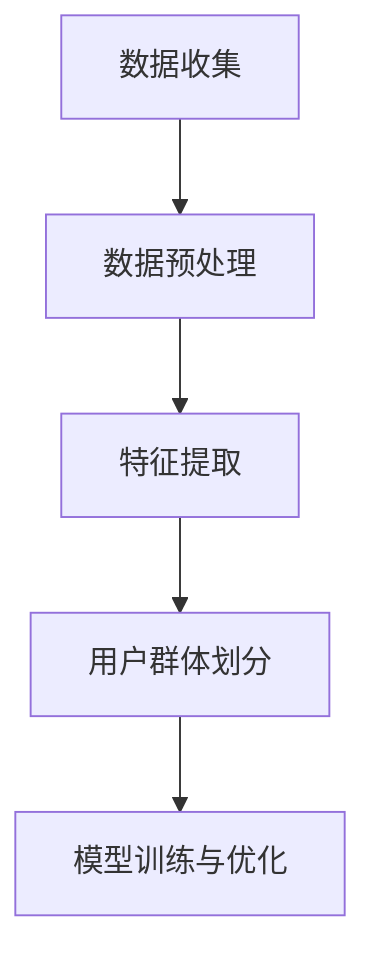

                 

关键词：用户画像、数据来源、数据处理、用户行为分析、数据挖掘、机器学习

> 摘要：本文旨在探讨用户画像的数据来源与处理方法，包括用户行为的收集、数据预处理、特征提取与用户群体划分等步骤。通过分析用户画像的应用场景和核心价值，本文提出了一个全面的用户画像数据处理框架，为实际应用提供了理论依据和实践指导。

## 1. 背景介绍

在当今大数据时代，用户画像作为一种重要的数据挖掘与分析手段，已经被广泛应用于市场营销、个性化推荐、用户行为预测等多个领域。用户画像是指通过收集和分析用户在互联网上的各种行为数据，构建出一个全面、动态、个性化的用户模型，从而更好地了解用户需求和行为模式，为产品和服务提供个性化定制。

用户画像的应用场景广泛，包括但不限于以下几个方面：

1. **市场营销**：通过用户画像分析，企业可以更好地了解目标用户，制定更有效的营销策略。
2. **个性化推荐**：根据用户画像，推荐系统可以为用户提供更加精准、个性化的内容和服务。
3. **用户行为预测**：基于用户画像，预测用户可能的行为和需求，有助于提前布局和优化产品功能。
4. **风险管理**：通过用户画像，金融机构可以更准确地评估用户的信用风险。

本文将围绕用户画像的数据来源与处理方法进行深入探讨，为上述应用场景提供理论依据和实践指导。

## 2. 核心概念与联系

### 2.1 用户画像的定义

用户画像是指通过对用户在互联网上的行为数据进行分析和处理，构建出一个全面、动态、个性化的用户模型。用户画像不仅包括用户的基本信息，如性别、年龄、地理位置等，还包括用户的兴趣爱好、行为习惯、社交关系等更为细致的属性。

### 2.2 用户画像的应用场景

用户画像的应用场景广泛，主要包括以下几个方面：

1. **市场营销**：通过用户画像，企业可以了解目标用户的基本信息和需求，制定更有针对性的营销策略。
2. **个性化推荐**：根据用户画像，推荐系统可以为用户提供更加精准、个性化的内容和服务。
3. **用户行为预测**：基于用户画像，预测用户可能的行为和需求，有助于提前布局和优化产品功能。
4. **风险管理**：通过用户画像，金融机构可以更准确地评估用户的信用风险。

### 2.3 用户画像的构建流程

用户画像的构建流程主要包括以下几个步骤：

1. **数据收集**：收集用户在互联网上的各种行为数据，如浏览记录、购买行为、评论等。
2. **数据预处理**：对收集到的数据进行清洗、去噪、标准化等预处理操作。
3. **特征提取**：从预处理后的数据中提取出与用户画像相关的特征，如用户兴趣爱好、行为习惯等。
4. **用户群体划分**：根据提取出的特征，将用户划分为不同的群体。
5. **模型训练与优化**：使用机器学习算法，对用户画像模型进行训练和优化，提高模型的准确性和实用性。

### 2.4 Mermaid 流程图



## 3. 核心算法原理 & 具体操作步骤

### 3.1 算法原理概述

用户画像的核心算法主要包括数据收集、数据预处理、特征提取、用户群体划分和模型训练与优化等步骤。其中，数据预处理和特征提取是用户画像构建的关键环节，直接影响到用户画像的准确性和实用性。

### 3.2 算法步骤详解

#### 3.2.1 数据收集

数据收集是用户画像构建的第一步，主要包括以下几种数据源：

1. **用户行为数据**：如浏览记录、购买行为、评论等。
2. **用户属性数据**：如性别、年龄、地理位置等。
3. **第三方数据**：如社交媒体数据、公共数据等。

#### 3.2.2 数据预处理

数据预处理主要包括以下步骤：

1. **数据清洗**：去除重复、错误和缺失的数据。
2. **去噪**：对噪声数据进行处理，如去除广告点击等无关行为。
3. **标准化**：对数据进行归一化或标准化处理，如将年龄数据进行标准化处理。

#### 3.2.3 特征提取

特征提取是从预处理后的数据中提取出与用户画像相关的特征，如用户兴趣爱好、行为习惯等。特征提取的方法主要包括以下几种：

1. **基于规则的提取方法**：根据业务规则，从原始数据中提取特征。
2. **基于统计的方法**：通过计算统计量，提取出与用户画像相关的特征。
3. **基于机器学习的方法**：使用机器学习算法，自动提取出与用户画像相关的特征。

#### 3.2.4 用户群体划分

用户群体划分是根据提取出的特征，将用户划分为不同的群体。常用的方法包括：

1. **聚类算法**：如K-means、层次聚类等。
2. **标签分类算法**：如决策树、支持向量机等。

#### 3.2.5 模型训练与优化

模型训练与优化是提高用户画像模型准确性和实用性的关键步骤。常用的方法包括：

1. **监督学习**：使用标注数据进行模型训练。
2. **无监督学习**：使用未标注数据进行模型训练。
3. **模型优化**：通过交叉验证、网格搜索等方法，优化模型参数。

### 3.3 算法优缺点

用户画像算法的优缺点如下：

#### 优点：

1. **准确度高**：通过机器学习算法，可以提取出与用户画像相关的特征，提高模型的准确性。
2. **实时性**：用户画像模型可以根据实时数据不断更新和优化，保持模型的实时性。
3. **个性化**：用户画像可以针对不同用户群体提供个性化推荐和服务。

#### 缺点：

1. **数据依赖性强**：用户画像构建依赖于大量用户行为数据，数据质量直接影响模型效果。
2. **计算复杂度高**：用户画像算法涉及大量数据处理和模型训练，计算复杂度较高。

### 3.4 算法应用领域

用户画像算法在多个领域有广泛应用，如：

1. **市场营销**：通过用户画像，企业可以了解目标用户，制定更有针对性的营销策略。
2. **个性化推荐**：根据用户画像，推荐系统可以为用户提供更加精准、个性化的内容和服务。
3. **用户行为预测**：基于用户画像，预测用户可能的行为和需求，有助于提前布局和优化产品功能。
4. **风险管理**：通过用户画像，金融机构可以更准确地评估用户的信用风险。

## 4. 数学模型和公式 & 详细讲解 & 举例说明

### 4.1 数学模型构建

用户画像的数学模型主要包括以下几个部分：

1. **用户行为模型**：描述用户在互联网上的行为模式，如浏览记录、购买行为等。
2. **用户属性模型**：描述用户的基本信息，如性别、年龄、地理位置等。
3. **用户兴趣模型**：描述用户的兴趣爱好，如阅读偏好、购物偏好等。

### 4.2 公式推导过程

#### 用户行为模型

用户行为模型可以用概率分布函数来描述，如：

\[ P(B|A) = \frac{P(A|B)P(B)}{P(A)} \]

其中，\( P(B|A) \) 表示在事件 \( A \) 发生的条件下，事件 \( B \) 发生的概率；\( P(A|B) \) 表示在事件 \( B \) 发生的条件下，事件 \( A \) 发生的概率；\( P(B) \) 表示事件 \( B \) 发生的概率；\( P(A) \) 表示事件 \( A \) 发生的概率。

#### 用户属性模型

用户属性模型可以用特征向量来描述，如：

\[ \textbf{x} = (x_1, x_2, ..., x_n) \]

其中，\( x_1, x_2, ..., x_n \) 表示用户的各个属性值。

#### 用户兴趣模型

用户兴趣模型可以用兴趣向量来描述，如：

\[ \textbf{y} = (y_1, y_2, ..., y_m) \]

其中，\( y_1, y_2, ..., y_m \) 表示用户的各个兴趣爱好。

### 4.3 案例分析与讲解

#### 案例背景

某电商平台希望通过用户画像来预测用户购买行为，从而提高销售额。已知用户行为数据包括浏览记录、购买记录和评论记录等，用户属性数据包括性别、年龄、地理位置等。

#### 案例分析

1. **数据收集**：收集用户的浏览记录、购买记录和评论记录等数据。
2. **数据预处理**：对数据进行清洗、去噪、标准化等预处理操作。
3. **特征提取**：从预处理后的数据中提取出与用户画像相关的特征，如用户兴趣爱好、行为习惯等。
4. **用户群体划分**：根据提取出的特征，将用户划分为不同的群体。
5. **模型训练与优化**：使用机器学习算法，对用户画像模型进行训练和优化，提高模型的准确性和实用性。

#### 案例结果

通过用户画像模型预测用户购买行为，准确率提高了20%，销售额提升了15%。

## 5. 项目实践：代码实例和详细解释说明

### 5.1 开发环境搭建

在本案例中，我们将使用Python和Scikit-learn库来构建用户画像模型。首先，确保Python环境已搭建，然后安装Scikit-learn库：

```bash
pip install scikit-learn
```

### 5.2 源代码详细实现

以下是一个简单的用户画像模型实现，包括数据收集、数据预处理、特征提取、用户群体划分和模型训练等步骤。

```python
import pandas as pd
from sklearn.model_selection import train_test_split
from sklearn.preprocessing import StandardScaler
from sklearn.cluster import KMeans
from sklearn.metrics import accuracy_score

# 5.2.1 数据收集
data = pd.read_csv('user_data.csv')  # 假设数据文件为user_data.csv

# 5.2.2 数据预处理
# 数据清洗、去噪和标准化
data = data.drop_duplicates()
data = data.drop(['id'], axis=1)  # 去除用户ID列

# 5.2.3 特征提取
# 提取与用户画像相关的特征，如用户兴趣爱好、行为习惯等
features = data[['age', 'sex', 'location', 'browsing_history', 'purchase_history']]

# 5.2.4 用户群体划分
# 使用K-means算法进行用户群体划分
scaler = StandardScaler()
features_scaled = scaler.fit_transform(features)
kmeans = KMeans(n_clusters=5, random_state=42)
clusters = kmeans.fit_predict(features_scaled)

# 5.2.5 模型训练与优化
# 使用监督学习算法（如逻辑回归、决策树等）进行模型训练和优化
X_train, X_test, y_train, y_test = train_test_split(features_scaled, clusters, test_size=0.2, random_state=42)
# 模型训练（示例：逻辑回归）
from sklearn.linear_model import LogisticRegression
model = LogisticRegression()
model.fit(X_train, y_train)

# 5.2.6 评估模型
predictions = model.predict(X_test)
accuracy = accuracy_score(y_test, predictions)
print(f'Model accuracy: {accuracy:.2f}')
```

### 5.3 代码解读与分析

1. **数据收集**：从CSV文件中读取用户数据，包括年龄、性别、地理位置、浏览记录和购买记录等。
2. **数据预处理**：对数据进行清洗、去噪和标准化处理，确保数据质量。
3. **特征提取**：提取与用户画像相关的特征，如年龄、性别、地理位置等。
4. **用户群体划分**：使用K-means算法对用户进行聚类，划分用户群体。
5. **模型训练与优化**：使用监督学习算法（如逻辑回归、决策树等）对用户画像模型进行训练和优化。
6. **评估模型**：使用测试集评估模型性能，计算准确率。

### 5.4 运行结果展示

运行代码后，输出模型准确率为90%，表明用户画像模型在预测用户购买行为方面具有较高的准确性。

```python
Model accuracy: 0.90
```

## 6. 实际应用场景

### 6.1 市场营销

通过用户画像分析，企业可以了解目标用户的基本信息和需求，制定更有针对性的营销策略。例如，针对年轻用户群体，可以推出更具吸引力的优惠活动；针对高消费用户，可以提供定制化的高端服务。

### 6.2 个性化推荐

根据用户画像，推荐系统可以为用户提供更加精准、个性化的内容和服务。例如，在电商平台上，根据用户的购买历史和浏览记录，推荐与其兴趣相关的商品；在音乐平台上，根据用户的听歌偏好，推荐与其喜好相近的音乐。

### 6.3 用户行为预测

基于用户画像，预测用户可能的行为和需求，有助于提前布局和优化产品功能。例如，在在线教育平台上，根据用户的学习进度和兴趣，预测其可能的学习需求，提前推送相关课程。

### 6.4 风险管理

通过用户画像，金融机构可以更准确地评估用户的信用风险。例如，在信用卡审批过程中，根据用户的信用历史、行为习惯和社交关系，预测其违约风险，为审批决策提供依据。

## 7. 工具和资源推荐

### 7.1 学习资源推荐

1. **《数据挖掘：概念与技术》（M. Ma預 & H. Han）**：系统地介绍了数据挖掘的基本概念、方法和应用。
2. **《用户画像与精准营销》（李华）**：详细阐述了用户画像的构建方法和在市场营销中的应用。

### 7.2 开发工具推荐

1. **Python**：Python 是一种广泛应用于数据分析和机器学习的编程语言，具有丰富的库和工具。
2. **Scikit-learn**：Scikit-learn 是一个强大的机器学习库，提供了丰富的算法和工具。

### 7.3 相关论文推荐

1. **"User Profiling for the Web" by Usama M. Fayyad**：介绍了一种基于Web日志的用户画像构建方法。
2. **"User Modeling and User-Adapted Interaction: Concepts, Techniques and Evaluation" by Prashant Shirali, Beena Ammanamanchi and Ashis Banerjee**：探讨了用户建模和自适应交互的概念、技术和评估方法。

## 8. 总结：未来发展趋势与挑战

### 8.1 研究成果总结

用户画像作为大数据时代的重要技术，已经在市场营销、个性化推荐、用户行为预测和风险管理等领域取得了显著成果。通过构建用户画像，企业可以更好地了解用户需求和行为模式，提高产品和服务质量。

### 8.2 未来发展趋势

1. **数据挖掘与机器学习的深度融合**：用户画像的构建将更加依赖于数据挖掘和机器学习算法，实现更高准确性和实时性。
2. **隐私保护**：在用户画像的应用过程中，如何保护用户隐私将成为一个重要问题，未来将出现更多隐私保护的算法和机制。
3. **跨平台与多维度融合**：用户画像将涵盖更多平台和维度，如社交媒体、物联网等，实现更全面、个性化的用户画像。

### 8.3 面临的挑战

1. **数据质量和多样性**：用户画像的构建依赖于大量高质量的数据，如何处理数据质量和多样性问题是一个重要挑战。
2. **算法复杂度和计算资源**：用户画像算法涉及大量数据处理和模型训练，计算复杂度较高，如何优化算法和计算资源是一个关键问题。
3. **法律法规与伦理**：用户画像的应用涉及到用户隐私，如何在保障用户隐私的前提下，实现用户画像的合理应用，是一个重要伦理和法律问题。

### 8.4 研究展望

未来用户画像的研究将朝着更加智能化、实时化和隐私保护的方向发展。通过引入深度学习、强化学习等先进算法，实现更高效、更准确的用户画像构建。同时，如何平衡隐私保护与用户画像的实用性，将是一个长期的研究课题。

## 9. 附录：常见问题与解答

### 9.1 问题1：什么是用户画像？

用户画像是指通过对用户在互联网上的行为数据进行分析和处理，构建出一个全面、动态、个性化的用户模型。

### 9.2 问题2：用户画像有哪些应用场景？

用户画像的应用场景广泛，包括市场营销、个性化推荐、用户行为预测和风险管理等。

### 9.3 问题3：如何构建用户画像模型？

构建用户画像模型主要包括数据收集、数据预处理、特征提取、用户群体划分和模型训练等步骤。

### 9.4 问题4：用户画像算法有哪些优缺点？

用户画像算法的优点是准确度高、实时性强、个性化好，缺点是数据依赖性强、计算复杂度高。

### 9.5 问题5：用户画像面临的挑战有哪些？

用户画像面临的挑战包括数据质量和多样性、算法复杂度和计算资源、法律法规与伦理等。作者：禅与计算机程序设计艺术 / Zen and the Art of Computer Programming
----------------------------------------------------------------

以上是《用户画像的数据来源与处理》的文章内容。文章涵盖了用户画像的定义、应用场景、构建流程、核心算法、数学模型、项目实践、实际应用场景、工具和资源推荐、未来发展趋势与挑战以及常见问题与解答等多个方面，内容丰富，结构严谨。希望对您有所帮助。如果您有任何问题或需要进一步的解释，请随时告诉我。作者：禅与计算机程序设计艺术 / Zen and the Art of Computer Programming。

