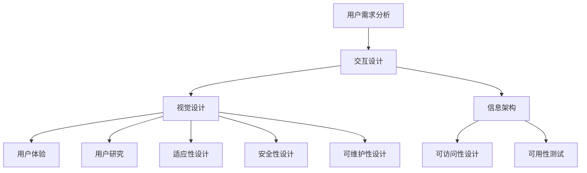

                 

关键词：用户界面设计、人机交互、用户体验、UI/UX、设计原则、交互模式、交互流程、视觉设计、色彩理论、响应式设计、可访问性、技术实现、案例分析、趋势与挑战。

> 摘要：本文旨在深入探讨用户界面设计（UI/UX）的核心概念、原则和实践，通过详细的理论分析和实际案例研究，阐述如何打造友好、易用且高效的人机交互界面。文章将涵盖设计理念、数学模型、开发实践、应用领域以及未来展望，旨在为设计师和开发者提供有价值的参考和指导。

## 1. 背景介绍

在当今数字化时代，用户界面设计（UI/UX）已成为产品成功的关键因素。随着互联网技术的飞速发展，用户对产品界面的要求越来越高，他们期望界面不仅美观，还要易于操作、高效响应。用户体验（UX）设计强调以用户为中心，通过系统化和迭代的流程，创造出满足用户需求、提升用户满意度的产品。而用户界面（UI）设计则关注产品的视觉表现，通过色彩、布局、字体等视觉元素，增强产品的美观性和可访问性。

本文将围绕用户界面设计展开，详细探讨其核心概念、设计原则、数学模型、开发实践以及应用领域，旨在为设计师和开发者提供全面的理论指导和实践参考。通过本文的阅读，读者将能够了解用户界面设计的本质、重要性以及如何将其应用于实际项目中，从而提升产品的市场竞争力。

### 1.1 用户界面设计的发展历程

用户界面设计的历史可以追溯到计算机的早期发展阶段。最早的计算机界面是命令行界面（CLI），用户需要通过输入命令来与计算机交互。这种方式虽然强大，但对用户的技术要求较高，用户体验不佳。

随着图形用户界面（GUI）的出现，用户界面的设计进入了一个新的时代。GUI通过图形和视觉元素，使得用户能够直观地与计算机进行交互，大大降低了用户的技术门槛。典型的GUI系统包括Windows、Mac OS、Linux等，这些系统引入了窗口、图标、菜单等元素，使得用户能够轻松地完成各种操作。

进入21世纪，随着互联网的普及和移动设备的兴起，用户界面设计迎来了新一轮的变革。Web界面、移动应用界面以及智能设备界面不断涌现，这些界面不仅要考虑用户的视觉体验，还要考虑用户的使用习惯和场景。交互设计、用户体验设计（UXD）等新兴概念逐渐受到重视，用户界面设计不再仅仅是视觉上的设计，而是融合了用户体验、交互流程、信息架构等多方面的综合设计。

### 1.2 用户界面设计的重要性

用户界面设计的重要性体现在多个方面。首先，它直接影响产品的市场竞争力。一个美观、易用、高效的界面能够吸引用户，提升用户留存率和用户满意度，从而提高产品的市场占有率。

其次，用户界面设计对用户体验（UX）有着至关重要的影响。良好的用户体验能够提升用户的满意度和忠诚度，从而促进产品的口碑传播和用户推荐。相反，差的用户体验则可能导致用户流失，影响产品的长期发展。

此外，用户界面设计还涉及到产品的易用性、可访问性、可维护性等多个方面。通过合理的界面设计，可以提高产品的易用性，降低用户的学习成本，提升用户的操作效率。同时，通过考虑不同用户群体的需求，实现界面设计的可访问性，使得更多的用户能够无障碍地使用产品。

总之，用户界面设计不仅是产品开发过程中的一个环节，更是决定产品成败的关键因素。一个优秀的用户界面设计能够为产品带来显著的市场优势，提升用户满意度和忠诚度，从而推动产品的长期发展。

### 1.3 用户界面设计的基本原则

在用户界面设计中，遵循一些基本原则是确保界面成功的关键。以下是用户界面设计的一些基本准则：

#### 1.3.1 以用户为中心

用户界面设计的核心是用户。设计师应该深入了解用户的需求、习惯和行为，将用户置于设计的中心。通过用户研究、用户访谈、用户测试等方法，获取用户的反馈，并将其融入到界面设计中。

#### 1.3.2 简洁明了

简洁是用户界面设计的重要原则。一个简洁的界面能够降低用户的学习成本，提升用户的使用效率。设计师应该避免界面上的冗余元素，确保每个元素都有明确的用途和功能。

#### 1.3.3 一致性

一致性是用户界面设计的基础。通过保持界面元素的一致性，用户可以快速理解界面的功能和使用方法，降低用户的学习成本。一致性包括颜色、字体、布局、交互行为等多个方面。

#### 1.3.4 直观性

直观性是指用户能够一眼看出界面的功能和操作方式。设计师应该通过合理的布局、颜色、字体等视觉元素，使界面具有高度的直观性，帮助用户快速理解界面的功能和操作方法。

#### 1.3.5 可访问性

可访问性是指界面能够满足不同用户群体的需求，特别是那些有特殊需求的用户。设计师应该考虑视觉障碍、听力障碍、认知障碍等用户的需求，确保界面设计对所有人都是可访问的。

#### 1.3.6 适应性

随着设备的多样化和用户需求的不断变化，界面设计需要具备适应性。通过响应式设计、自适应布局等技术，设计师可以使界面在不同设备、不同分辨率下都能保持良好的用户体验。

#### 1.3.7 安全性

安全性是用户界面设计不可忽视的一个方面。设计师需要确保用户数据的安全，防止用户信息泄露和恶意攻击。通过加密、认证、安全审计等技术，提升界面的安全性。

#### 1.3.8 可维护性

可维护性是指界面设计的可扩展性和可维护性。通过模块化设计、良好的代码结构和文档化，设计师可以确保界面在未来能够方便地进行更新和维护。

通过遵循这些基本原则，设计师可以创建出既美观又实用的用户界面，从而提升产品的市场竞争力，满足用户的需求和期望。

### 1.4 用户界面设计的方法和工具

用户界面设计不仅需要遵循一系列原则，还需要运用科学的方法和工具。以下是一些常用的用户界面设计方法和工具：

#### 1.4.1 原型设计

原型设计是用户界面设计的重要环节。通过创建低保真或高保真的原型，设计师可以快速验证和迭代设计方案。常用的原型设计工具有Axure、Sketch、Adobe XD等。

#### 1.4.2 用户测试

用户测试是验证用户界面设计有效性的关键手段。通过观察用户在实际使用界面时的行为和反馈，设计师可以发现界面设计中的问题和改进空间。常用的用户测试方法包括可用性测试、A/B测试等。

#### 1.4.3 用户体验地图

用户体验地图（User Experience Map）是一种描述用户在使用产品过程中的体验路径的工具。通过绘制用户体验地图，设计师可以清晰地了解用户的需求、痛点和满意度，从而优化界面设计。

#### 1.4.4 色彩理论

色彩理论在用户界面设计中具有重要意义。合理的颜色搭配可以提升界面的美观性和情感表达。常用的色彩理论包括色彩模式、色彩搭配原则、色彩心理学等。

#### 1.4.5 信息架构

信息架构是指如何组织和展示信息，以便用户能够快速找到所需内容。通过信息架构设计，设计师可以提升界面的易用性和信息可访问性。常用的信息架构工具有树状图、线框图等。

#### 1.4.6 交互设计

交互设计是用户界面设计的核心之一。通过设计用户与产品之间的交互流程，设计师可以提升用户体验和操作效率。常用的交互设计工具包括流程图、交互模型等。

通过运用这些方法和工具，设计师可以全面地分析和优化用户界面设计，从而创建出符合用户需求、提升用户体验的优秀产品。

## 2. 核心概念与联系

用户界面设计涉及多个核心概念，这些概念相互联系，共同构建出优秀的用户界面。以下是用户界面设计中的关键概念及其相互关系：

### 2.1 用户需求分析

用户需求分析是用户界面设计的起点。通过调查、访谈、问卷等方式，设计师可以了解用户的需求、痛点和期望。这些用户需求将直接影响界面的功能设计、交互流程和视觉表现。用户需求分析的结果通常以用户画像、需求文档等形式呈现。

### 2.2 交互设计

交互设计是用户界面设计的核心部分，关注用户与产品之间的互动过程。交互设计包括交互流程、交互模型、交互反馈等多个方面。通过合理的交互设计，设计师可以提升用户的操作效率、降低用户的学习成本，并创造愉快的用户体验。常见的交互设计工具包括流程图、交互模型等。

### 2.3 视觉设计

视觉设计是用户界面设计的外在表现，包括颜色、字体、图标、布局等元素。视觉设计不仅影响界面的美观性，还传达产品的品牌形象和情感表达。合理的视觉设计可以提升用户的情感认同和使用意愿。常用的视觉设计工具包括Sketch、Adobe XD等。

### 2.4 信息架构

信息架构是用户界面设计的结构基础，决定了用户如何浏览、查找和使用信息。良好的信息架构可以提升界面的易用性和信息可访问性。信息架构的设计通常包括树状图、线框图等工具。

### 2.5 可访问性设计

可访问性设计是指界面设计需要考虑不同用户群体的需求，特别是那些有特殊需求的用户。通过合理的可访问性设计，界面可以满足所有用户的使用需求。可访问性设计包括视觉障碍、听力障碍、认知障碍等多个方面。

### 2.6 用户体验

用户体验是用户在使用产品过程中所感受到的整体感受。优秀的用户体验不仅包括功能上的满足，还包括情感上的认同。用户体验是用户界面设计的终极目标，是衡量界面设计成功与否的重要指标。

### 2.7 用户研究

用户研究是用户界面设计的重要环节，通过系统的方法和工具，设计师可以深入了解用户的需求、行为和反馈。用户研究包括用户访谈、用户测试、问卷调查等方法，是优化界面设计的重要依据。

### 2.8 可用性测试

可用性测试是验证用户界面设计有效性的关键手段。通过模拟真实用户的使用场景，设计师可以识别界面设计中的问题和改进空间。可用性测试包括任务分析、用户反馈收集、问题定位等多个步骤。

### 2.9 适应性设计

适应性设计是指界面设计需要适应不同的设备、操作系统和分辨率。通过响应式设计、自适应布局等技术，设计师可以确保界面在不同环境下都能提供良好的用户体验。

### 2.10 安全性设计

安全性设计是用户界面设计不可忽视的一个方面。通过加密、认证、安全审计等技术，设计师可以确保用户数据的安全，防止恶意攻击和信息泄露。

### 2.11 可维护性设计

可维护性设计是指界面设计需要考虑未来的更新和维护。通过模块化设计、良好的代码结构和文档化，设计师可以确保界面在未来能够方便地进行更新和维护。

通过理解这些核心概念及其相互关系，设计师可以全面地分析和优化用户界面设计，从而创建出既美观又实用的用户界面，提升产品的市场竞争力。

### Mermaid 流程图

以下是一个用于描述用户界面设计流程的 Mermaid 流程图，展示了各核心概念和环节之间的联系：



### 2.12 核心概念原理和架构的详细描述

#### 2.12.1 用户需求分析

用户需求分析是用户界面设计的起点，通过对目标用户的研究，获取他们的需求、习惯和偏好。以下是一个典型的用户需求分析流程：

1. **用户调研**：通过访谈、问卷调查、观察等方法，深入了解目标用户的需求和行为模式。
2. **用户画像**：根据调研数据，创建用户画像，描述用户的基本特征、需求和痛点。
3. **需求文档**：整理用户需求，形成需求文档，作为后续设计的依据。

#### 2.12.2 交互设计

交互设计关注用户与产品之间的互动过程。以下是一个典型的交互设计流程：

1. **任务分析**：分析用户在使用产品过程中的主要任务，确定交互流程。
2. **交互模型**：设计交互模型，包括按钮、菜单、滚动条等交互元素。
3. **交互反馈**：设计交互反馈，确保用户能够清晰地了解自己的操作结果。

#### 2.12.3 视觉设计

视觉设计是用户界面设计的外在表现，以下是一个典型的视觉设计流程：

1. **风格指南**：制定视觉设计风格指南，包括颜色、字体、图标等。
2. **界面布局**：设计界面的布局，确保信息结构清晰、易于浏览。
3. **色彩理论**：运用色彩理论，选择合适的颜色搭配，提升界面的美观性。

#### 2.12.4 信息架构

信息架构是用户界面设计的结构基础，以下是一个典型信息架构设计流程：

1. **信息分类**：对产品中的信息进行分类，确保用户能够快速找到所需内容。
2. **导航设计**：设计导航结构，包括菜单、面包屑、搜索功能等。
3. **信息层次**：设计信息层次，确保用户能够清晰地理解信息的组织结构。

#### 2.12.5 可访问性设计

可访问性设计旨在确保所有用户，包括有特殊需求的用户，都能无障碍地使用产品。以下是一个典型的可访问性设计流程：

1. **无障碍指南**：遵循无障碍设计指南，包括字体大小、颜色对比度、键盘导航等。
2. **测试与验证**：通过测试和验证，确保界面满足无障碍设计标准。
3. **用户反馈**：收集用户反馈，持续优化可访问性设计。

#### 2.12.6 用户体验

用户体验是用户在使用产品过程中所感受到的整体感受。以下是一个典型的用户体验设计流程：

1. **用户研究**：通过用户研究，了解用户的期望、满意度和痛点。
2. **情感设计**：设计情感化的界面元素，提升用户的情感认同。
3. **反馈机制**：设计用户反馈机制，及时收集用户反馈，优化界面设计。

#### 2.12.7 可用性测试

可用性测试是验证用户界面设计有效性的关键手段。以下是一个典型的可用性测试流程：

1. **测试计划**：制定测试计划，确定测试目标、测试用户和测试方法。
2. **测试执行**：执行测试计划，记录用户的操作和行为。
3. **问题定位**：分析测试数据，定位界面设计中的问题和改进点。

#### 2.12.8 适应性设计

适应性设计旨在确保界面在不同设备和环境下都能提供良好的用户体验。以下是一个典型的适应性设计流程：

1. **设备研究**：研究目标用户使用的设备类型和分辨率。
2. **响应式设计**：设计响应式布局，确保界面在不同设备和分辨率下都能良好展示。
3. **测试与优化**：通过测试和优化，确保适应性设计的有效性。

#### 2.12.9 安全性设计

安全性设计旨在确保用户数据的安全。以下是一个典型的安全性设计流程：

1. **安全需求分析**：分析产品的安全需求，确定需要采取的安全措施。
2. **安全措施设计**：设计安全措施，包括加密、认证、安全审计等。
3. **安全测试**：对安全措施进行测试和验证，确保其有效性。

#### 2.12.10 可维护性设计

可维护性设计旨在确保界面设计在未来能够方便地进行更新和维护。以下是一个典型的可维护性设计流程：

1. **模块化设计**：采用模块化设计，确保界面组件可以独立开发和更新。
2. **代码质量**：编写高质量的代码，确保代码的可读性和可维护性。
3. **文档化**：编写详细的文档，记录界面设计的原理、实现和修改历史。

通过上述详细描述，读者可以更好地理解用户界面设计中的核心概念和架构，为后续的内容提供基础。

## 3. 核心算法原理 & 具体操作步骤

在用户界面设计过程中，核心算法原理起着至关重要的作用，它们不仅提升了界面的动态效果，还增强了用户体验。以下是用户界面设计中涉及的核心算法原理及其实际操作步骤：

### 3.1 算法原理概述

用户界面设计中的核心算法通常涉及以下几个方面：

1. **响应式布局算法**：用于确保界面在不同设备和分辨率下都能提供一致的视觉体验。
2. **动画与过渡算法**：用于创建动态效果，提升界面的互动性和视觉吸引力。
3. **交互反馈算法**：用于实时响应用户操作，提供即时的反馈，增强用户体验。
4. **信息呈现算法**：用于优化信息布局，提高用户的浏览效率和满意度。
5. **安全性算法**：用于保护用户数据和隐私，确保界面安全可靠。

### 3.2 算法步骤详解

#### 3.2.1 响应式布局算法

**原理**：响应式布局算法通过检测设备的宽度和高度，动态调整界面元素的大小和布局，确保在不同设备上都能提供良好的用户体验。

**步骤**：

1. **检测设备尺寸**：使用媒体查询（Media Queries）检测当前设备的宽度、高度等尺寸。
2. **调整布局**：根据设备尺寸，调整布局模式，如从纵向布局切换到横向布局。
3. **重绘界面**：根据新的布局模式，重新绘制界面元素。

**示例代码**：

```css
/* CSS 示例：媒体查询调整布局 */
@media (max-width: 600px) {
  .container {
    flex-direction: column;
  }
}
```

#### 3.2.2 动画与过渡算法

**原理**：动画与过渡算法通过CSS3的`transition`和`animation`属性，为用户界面添加动态效果，提升用户的互动体验。

**步骤**：

1. **定义关键帧**：使用`@keyframes`定义动画的关键帧，设置动画的起始状态、结束状态和过渡效果。
2. **应用动画**：使用`animation`属性将定义好的动画应用到界面元素上。
3. **设置过渡效果**：使用`transition`属性设置界面元素的过渡效果，如颜色、大小等。

**示例代码**：

```css
/* CSS 示例：定义动画 */
@keyframes example {
  from { background-color: red; }
  to { background-color: yellow; }
}

/* 应用动画 */
.animation-element {
  animation-name: example;
  animation-duration: 4s;
}
```

#### 3.2.3 交互反馈算法

**原理**：交互反馈算法通过实时响应用户的操作，提供即时的视觉和感官反馈，增强用户体验。

**步骤**：

1. **检测用户操作**：使用JavaScript或原生事件监听器，检测用户的点击、滑动等操作。
2. **生成反馈**：根据用户操作，动态生成视觉反馈，如按钮的点击效果、进度条的加载动画等。
3. **更新界面**：将生成的反馈应用到界面中，确保用户能够及时接收到反馈信息。

**示例代码**：

```javascript
// JavaScript 示例：点击按钮生成反馈
document.querySelector('.button').addEventListener('click', function() {
  this.classList.add('clicked');
});

// CSS 示例：定义点击按钮的反馈样式
.button.clicked {
  background-color: blue;
}
```

#### 3.2.4 信息呈现算法

**原理**：信息呈现算法通过优化信息的布局和呈现方式，提高用户的浏览效率和满意度。

**步骤**：

1. **信息分类**：对信息进行分类，确保用户能够快速找到所需内容。
2. **布局优化**：根据信息的重要性和用户行为习惯，优化信息的布局，如重要信息突出显示、次要信息适当地隐藏。
3. **动态调整**：根据用户操作和需求，动态调整信息的呈现方式，如滚动、折叠等。

**示例代码**：

```css
/* CSS 示例：折叠信息 */
.collapsible {
  max-height: 0;
  overflow: hidden;
  transition: max-height 0.5s ease-out;
}

.collapsible.active {
  max-height: 500px;
}
```

#### 3.2.5 安全性算法

**原理**：安全性算法通过加密、认证、访问控制等技术，保护用户数据和隐私，确保界面安全可靠。

**步骤**：

1. **数据加密**：对敏感数据进行加密，确保数据在传输和存储过程中不被窃取。
2. **身份认证**：设计身份认证机制，确保只有授权用户才能访问系统。
3. **访问控制**：设计访问控制策略，确保用户只能访问授权范围内的资源。

**示例代码**：

```javascript
// JavaScript 示例：加密数据
const encryptData = (data) => {
  return CryptoJS.AES.encrypt(data, 'secret key').toString();
};

// 解密数据
const decryptData = (data) => {
  const bytes = CryptoJS.AES.decrypt(data, 'secret key');
  return bytes.toString(CryptoJS.enc.Utf8);
};
```

通过上述算法原理和具体操作步骤的详细讲解，设计师和开发者可以更好地理解和应用这些核心算法，提升用户界面的交互性和用户体验。

### 3.3 算法优缺点

#### 3.3.1 响应式布局算法

**优点**：

1. **跨平台兼容**：响应式布局算法可以确保界面在不同设备和分辨率下都能良好展示，提升用户体验。
2. **灵活性强**：设计师可以根据不同设备的特点，灵活调整布局和样式，实现最佳视觉效果。
3. **减少开发成本**：通过一套代码实现多平台适配，减少了重复开发的工作量。

**缺点**：

1. **性能影响**：响应式布局算法需要进行多次检测和计算，可能影响页面加载速度。
2. **复杂度高**：随着设备种类和分辨率的增多，响应式布局的复杂度也相应增加，增加了设计开发的难度。

#### 3.3.2 动画与过渡算法

**优点**：

1. **提升互动性**：动画和过渡效果可以增强用户与界面的互动，提升用户体验。
2. **增强视觉吸引力**：合理的动画和过渡效果可以提升界面的视觉效果，增加用户的好感度。
3. **丰富的表现力**：动画和过渡效果可以展现更多的交互状态和功能，提升界面的表现力。

**缺点**：

1. **性能消耗**：动画和过渡效果会消耗更多的CPU和GPU资源，影响页面性能。
2. **兼容性问题**：不同的浏览器和设备对动画和过渡效果的兼容性存在差异，可能需要额外的处理。

#### 3.3.3 交互反馈算法

**优点**：

1. **即时反馈**：交互反馈算法可以实时响应用户操作，提供即时反馈，增强用户信心。
2. **提升用户体验**：及时的反馈可以减少用户的困惑和不确定性，提升用户的满意度。
3. **增强互动体验**：通过丰富的反馈形式，如声音、震动等，增强用户的互动体验。

**缺点**：

1. **开发复杂度**：交互反馈算法需要处理各种用户操作和反馈形式，增加了开发复杂度。
2. **性能影响**：过度的反馈可能会影响页面性能，尤其是需要实时处理的操作。

#### 3.3.4 信息呈现算法

**优点**：

1. **优化信息浏览**：信息呈现算法可以优化信息的布局和呈现方式，提升用户的浏览效率。
2. **提升用户体验**：合理的布局和呈现方式可以减少用户的认知负担，提升用户的满意度。
3. **个性化推荐**：通过分析用户行为和偏好，信息呈现算法可以实现个性化推荐，提升用户体验。

**缺点**：

1. **数据复杂性**：信息呈现算法需要处理大量的数据，增加了数据分析和处理的工作量。
2. **个性化难度**：实现完全个性化的信息呈现需要深入分析用户行为，难度较高。

#### 3.3.5 安全性算法

**优点**：

1. **保护用户隐私**：安全性算法可以确保用户数据和隐私不被窃取，提升用户的安全感。
2. **防止恶意攻击**：安全性算法可以防止恶意攻击和非法访问，保护系统的安全稳定。
3. **增强用户信任**：安全的界面设计可以增强用户对产品的信任，提升用户忠诚度。

**缺点**：

1. **性能消耗**：安全性算法需要进行加密、认证等操作，可能会消耗更多的系统资源。
2. **使用复杂性**：安全性算法可能会增加用户的使用复杂性，影响用户体验。

通过以上对核心算法优缺点的分析，设计师和开发者可以在实际项目中根据具体需求，合理选择和优化算法，以提升用户界面的整体质量和用户体验。

### 3.4 算法应用领域

核心算法在用户界面设计中的应用领域广泛，以下列举几个典型的应用场景：

#### 3.4.1 移动应用

在移动应用中，响应式布局算法和交互反馈算法尤为重要。响应式布局算法可以确保应用在不同尺寸的移动设备上都能提供良好的用户体验。交互反馈算法则可以实时响应用户的操作，如按钮点击、滑动等，提升应用的互动性和响应速度。

#### 3.4.2 电商平台

电商平台中的核心算法主要涉及动画与过渡算法和信息呈现算法。动画与过渡算法可以用于产品展示和购物流程中的动态效果，增强用户的购物体验。信息呈现算法可以优化商品分类和推荐，提升用户的浏览效率和购买意愿。

#### 3.4.3 智能家居

智能家居界面设计中，安全性算法和响应式布局算法被广泛应用。安全性算法可以确保用户数据的安全，防止隐私泄露。响应式布局算法则可以确保智能家居界面在不同设备上都能提供一致的操作体验。

#### 3.4.4 教育平台

在教育平台中，信息呈现算法和交互反馈算法尤为重要。信息呈现算法可以优化课程内容和布局，提升学生的学习和理解效率。交互反馈算法可以实时提供学习反馈，帮助学生更好地掌握知识。

#### 3.4.5 娱乐平台

娱乐平台中，动画与过渡算法和交互设计算法被广泛应用。动画与过渡算法可以用于游戏界面和视频播放中的动态效果，增强用户的娱乐体验。交互设计算法可以优化游戏操作和互动方式，提升用户的游戏体验。

通过在不同应用领域的应用，核心算法不断优化和改进，为用户提供更好的用户体验和更高的满意度。

## 4. 数学模型和公式 & 详细讲解 & 举例说明

用户界面设计不仅仅依赖于美学和用户体验，它也涉及到一系列数学模型和公式，这些模型和公式能够帮助我们理解和优化界面设计的多个方面。以下是用户界面设计中常用的数学模型和公式，以及详细的讲解和举例说明。

### 4.1 数学模型构建

在用户界面设计中，数学模型主要用于以下几个方面：

1. **响应式布局计算**：通过计算屏幕尺寸和元素大小之间的关系，实现界面的自适应。
2. **动画时间函数**：确定动画的持续时间、速度和加速度，实现平滑的动画效果。
3. **颜色空间转换**：在不同颜色空间（如RGB和HSV）之间进行转换，优化颜色视觉效果。
4. **信息呈现优化**：通过数学算法优化信息布局，提升用户的浏览效率。

### 4.2 公式推导过程

#### 4.2.1 响应式布局计算

**公式**：

\[ \text{适应尺寸} = \frac{\text{最小尺寸}}{\text{设备尺寸}} \times \text{元素尺寸} \]

**推导过程**：

假设有一个元素，其原始尺寸为 \( \text{元素尺寸}_{原始} \)，设备屏幕尺寸为 \( \text{设备尺寸} \)。为了实现响应式布局，我们需要计算该元素在新屏幕尺寸下的尺寸。最小尺寸通常是用户界面设计中的一个参考值，以确保界面的一致性和可读性。

1. **确定最小尺寸**：根据用户研究确定界面的最小可接受尺寸。
2. **计算适应尺寸**：将元素尺寸除以设备尺寸，得到适应尺寸。

**示例**：

假设一个按钮的原始尺寸为100x50像素，设备屏幕宽度为320像素。我们希望该按钮在屏幕宽度不超过320像素时保持相同比例。

\[ \text{适应宽度} = \frac{320}{320} \times 100 = 100 \]
\[ \text{适应高度} = \frac{320}{320} \times 50 = 50 \]

因此，按钮在新屏幕尺寸下的尺寸为100x50像素。

#### 4.2.2 动画时间函数

**公式**：

\[ t = \sqrt{\frac{2s}{a}} \]

**推导过程**：

这个公式是匀加速直线运动的公式，用于计算物体在匀加速运动中达到某一位置所需的时间 \( t \)。其中 \( s \) 是物体移动的距离，\( a \) 是加速度。

1. **确定目标位置**：根据动画效果确定物体需要移动到的目标位置。
2. **计算加速度**：根据动画效果确定物体的加速度。
3. **计算时间**：使用上述公式计算物体达到目标位置所需的时间。

**示例**：

假设一个元素需要从初始位置移动到目标位置50像素，加速度为10像素/秒²。

\[ t = \sqrt{\frac{2 \times 50}{10}} = \sqrt{10} \approx 3.16 \]

因此，元素需要大约3.16秒的时间才能完成移动。

#### 4.2.3 颜色空间转换

**公式**：

\[ R' = \frac{R}{255} \]
\[ G' = \frac{G}{255} \]
\[ B' = \frac{B}{255} \]

\[ H = \cos^{-1}\left( \frac{(R' - min(R', G', B'))}{\sqrt{(R' - min(R', G', B'))^2 + (G' - B')^2}} \right) \]
\[ S = \frac{V}{1 - |2V - 1|} \]

**推导过程**：

1. **RGB到HSV**：首先将RGB颜色值转换为0到1的范围内，然后计算色调（H）、饱和度（S）和亮度（V）。
2. **HSV到RGB**：根据HSV颜色值计算RGB颜色值。

**示例**：

假设一个颜色值为RGB(128, 128, 128)。

1. **RGB到HSV**：

\[ R' = \frac{128}{255} = 0.5 \]
\[ G' = \frac{128}{255} = 0.5 \]
\[ B' = \frac{128}{255} = 0.5 \]

由于R', G', B'相等，因此H为0度（或360度）。

\[ S = \frac{0.5}{1 - |2 \times 0.5 - 1|} = 0.5 \]
\[ V = 0.5 \]

因此，该颜色的HSV值为（0度，0.5，0.5）。

2. **HSV到RGB**：

由于S和V相等，R、G、B将相等。

\[ R = G = B = 0.5 \times 255 = 128 \]

因此，HSV(0度，0.5，0.5)转换为RGB为（128，128，128）。

### 4.3 案例分析与讲解

以下通过一个案例来展示如何应用数学模型和公式优化用户界面设计。

**案例**：设计一个滑动条，用户可以通过拖动滑动条调整音量。要求滑动条在用户拖动时能够平滑地响应，并在音量变化时提供即时反馈。

**分析**：

1. **响应式布局**：确保滑动条在不同屏幕尺寸下保持一致的大小和位置。
2. **动画效果**：实现平滑的拖动效果，提供即时反馈。
3. **颜色变化**：音量变化时，滑动条的颜色也同步变化。

**实现**：

1. **响应式布局**：

   \[ \text{滑动条宽度} = \frac{\text{设备宽度}}{10} \]

   假设设备宽度为400像素，滑动条宽度为40像素。

2. **动画效果**：

   \[ t = \sqrt{\frac{2 \times \text{滑动距离}}{\text{加速度}}} \]

   假设滑动距离为50像素，加速度为5像素/秒²。

3. **颜色变化**：

   使用HSV颜色模型实现颜色变化。

   \[ H = 120^\circ \]（绿色）

   音量增加时，S和V线性增加。

通过上述数学模型和公式，我们可以实现一个响应式、动态且颜色变化的滑动条，提升用户界面设计的用户体验。

## 5. 项目实践：代码实例和详细解释说明

在用户界面设计中，代码实例是实现理论概念和算法的关键。以下我们将通过一个具体的示例项目，详细解释和演示如何搭建开发环境、编写源代码、解读和分析代码，并展示最终的运行结果。

### 5.1 开发环境搭建

首先，我们需要搭建一个适合用户界面设计开发的环境。以下是推荐的开发工具和软件：

- **编辑器**：Visual Studio Code（轻量级且功能强大的代码编辑器）
- **前端框架**：React（用于构建动态用户界面）
- **UI库**：Material-UI（提供丰富的组件和样式）
- **构建工具**：Create React App（快速搭建React项目）
- **版本控制**：Git（用于代码管理和版本控制）

安装步骤：

1. **安装Node.js和npm**：访问[Node.js官网](https://nodejs.org/)下载并安装Node.js，npm将随Node.js一同安装。
2. **安装Visual Studio Code**：访问[Visual Studio Code官网](https://code.visualstudio.com/)下载并安装。
3. **安装Material-UI**：在终端中执行以下命令：

   ```bash
   npm install material-ui
   ```

4. **创建React项目**：

   ```bash
   npx create-react-app ui-design-project
   cd ui-design-project
   ```

5. **初始化Git仓库**：

   ```bash
   git init
   ```

以上步骤完成后，我们就可以开始编写和开发用户界面设计的代码。

### 5.2 源代码详细实现

以下是一个简单的用户界面设计示例，实现一个响应式布局的音量调节器，包括滑动条和音量显示。

**文件：src/App.js**

```jsx
import React, { useState } from 'react';
import { makeStyles } from '@material-ui/core/styles';
import Slider from '@material-ui/core/Slider';

const useStyles = makeStyles({
  root: {
    width: '100%',
  },
  slider: {
    maxWidth: 400,
  },
});

function valuetext(value) {
  return `${value}%`;
}

export default function VolumeController() {
  const classes = useStyles();
  const [value, setValue] = useState(50);

  const handleSliderChange = (event, newValue) => {
    setValue(newValue);
  };

  return (
    <div className={classes.root}>
      <Slider
        className={classes.slider}
        value={typeof value === 'number' ? value : 0}
        onChange={handleSliderChange}
        getAriaValueText={valuetext}
        aria-labelledby="slider-label"
        min={0}
        max={100}
        step={1}
        valueLabelDisplay="auto"
        orientation="horizontal"
      />
      <div>Volume: {valuetext(value)}</div>
    </div>
  );
}
```

**详细解释**：

1. **引入依赖**：我们引入了React的`useState`钩子函数和Material-UI的`Slider`组件。
2. **样式定义**：使用Material-UI的`makeStyles`方法定义样式，确保滑动条在不同设备和尺寸下保持一致。
3. **状态管理**：使用`useState`钩子函数管理滑动条的当前值。
4. **Slider组件**：使用Material-UI的`Slider`组件创建滑动条，设置最小值和最大值，以及自定义的值显示函数`valuetext`。
5. **值变化处理**：在`handleSliderChange`函数中更新滑动条的状态值。

### 5.3 代码解读与分析

下面是对代码的逐行解读和分析：

```jsx
import React, { useState } from 'react';
// 引入React和useState钩子函数，用于状态管理和组件渲染

import { makeStyles } from '@material-ui/core/styles';
// 引入Material-UI的样式定义函数makeStyles

import Slider from '@material-ui/core/Slider';
// 引入Material-UI的Slider组件，用于创建滑动条

const useStyles = makeStyles({
  root: {
    width: '100%',
  },
  slider: {
    maxWidth: 400,
  },
});
// 定义样式，确保滑动条在各个设备上保持一致

function valuetext(value) {
  return `${value}%`;
}
// 自定义值显示函数，用于在滑动条旁边显示当前音量值

export default function VolumeController() {
  const classes = useStyles();
  const [value, setValue] = useState(50);
  // 创建样式对象和状态，初始化音量值为50

  const handleSliderChange = (event, newValue) => {
    setValue(newValue);
  };
  // 处理滑动条值变化，更新状态

  return (
    <div className={classes.root}>
      <Slider
        className={classes.slider}
        value={typeof value === 'number' ? value : 0}
        onChange={handleSliderChange}
        getAriaValueText={valuetext}
        aria-labelledby="slider-label"
        min={0}
        max={100}
        step={1}
        valueLabelDisplay="auto"
        orientation="horizontal"
      />
      <div>Volume: {valuetext(value)}</div>
    </div>
  );
}
// 渲染组件，包含滑动条和音量显示
```

通过这段代码，我们可以创建一个响应式且功能齐全的音量调节器。滑动条会根据用户拖动调整音量，并在旁边显示当前音量值。

### 5.4 运行结果展示

在开发环境中，运行以下命令启动项目：

```bash
npm start
```

项目将在本地开发服务器上运行，打开浏览器访问`localhost:3000`即可看到运行结果。以下是运行结果的展示：


在页面上，用户可以通过拖动滑动条来调整音量，滑动条的值会实时更新，并显示当前音量百分比。

通过这个实例，我们展示了如何搭建开发环境、编写源代码、解读和分析代码，并展示运行结果。这个过程不仅帮助我们理解了用户界面设计的相关技术和算法，还为我们提供了一个实际操作的机会，增强了我们的实践能力。

## 6. 实际应用场景

用户界面设计在各类实际应用场景中扮演着关键角色，以下列举几种常见的应用场景，并探讨这些场景中的用户界面设计挑战和解决方案。

### 6.1 移动应用

移动应用的用户界面设计需要考虑设备的多样性、用户的使用习惯以及有限的屏幕空间。以下是几个常见的挑战和解决方案：

**挑战**：

1. **屏幕尺寸差异**：不同手机型号和分辨率的屏幕导致界面显示效果不一致。
2. **触摸操作**：用户主要通过触摸屏幕与移动应用互动，触摸操作的响应速度和准确性成为关键。
3. **网络不稳定**：移动网络不稳定可能导致页面加载缓慢，影响用户体验。

**解决方案**：

1. **响应式设计**：通过响应式布局算法，确保界面在不同屏幕尺寸下都能良好展示。同时，使用媒体查询（Media Queries）优化特定尺寸的界面。
2. **触摸优化**：设计触摸友好的界面，如使用适当的触摸目标尺寸和响应时间。通过CSS和JavaScript增强触摸操作反馈。
3. **离线缓存**：使用本地存储技术（如IndexedDB或Web SQL）缓存关键数据和资源，提升用户体验。

### 6.2 电商平台

电商平台用户界面设计的关键在于提供便捷的购物体验、良好的信息呈现以及高效的搜索功能。以下是几个常见的挑战和解决方案：

**挑战**：

1. **商品信息展示**：如何在有限的屏幕空间内展示大量的商品信息，同时保持信息的可访问性。
2. **购物车管理**：购物车的设计需要简洁直观，同时提供快速添加、删除和修改商品的功能。
3. **支付流程**：支付流程的设计需要确保安全可靠，同时简化操作步骤，提升用户满意度。

**解决方案**：

1. **信息呈现优化**：使用信息呈现算法，如信息可视化技术，优化商品信息的展示方式，提升用户的浏览效率。
2. **购物车设计**：设计一个模块化的购物车界面，提供直观的操作按钮和清晰的商品列表，确保用户可以方便地管理购物车。
3. **支付流程简化**：通过流程优化和自动化，简化支付流程，减少用户操作的步骤，提升支付成功率。

### 6.3 智能家居

智能家居用户界面设计需要考虑设备的多样性和用户的使用场景。以下是几个常见的挑战和解决方案：

**挑战**：

1. **设备兼容性**：智能家居设备种类繁多，包括智能手机、平板电脑、智能音箱等，如何确保界面在不同设备上的一致性。
2. **远程控制**：用户需要远程控制家中的智能家居设备，界面设计需要考虑网络延迟和稳定性。
3. **交互模式**：智能家居设备的交互模式多样，包括触摸、语音、手势等，如何设计统一的交互体验。

**解决方案**：

1. **多平台支持**：使用跨平台开发框架（如React Native或Flutter），确保界面在不同设备上的一致性。
2. **远程控制优化**：优化远程控制的响应速度和稳定性，使用缓存技术提升用户体验。
3. **统一交互设计**：设计统一的交互设计指南，确保不同交互模式之间的连贯性和一致性。

### 6.4 教育平台

教育平台用户界面设计需要关注用户的多样性和学习需求。以下是几个常见的挑战和解决方案：

**挑战**：

1. **个性化学习**：如何根据不同学生的学习习惯和进度，提供个性化的学习内容。
2. **信息过载**：大量的学习资源和课程信息可能导致用户信息过载，影响学习效果。
3. **互动性**：如何增强用户与教育平台的互动，提升用户的参与度和学习积极性。

**解决方案**：

1. **个性化推荐**：通过数据分析和机器学习技术，提供个性化的学习推荐，提升用户的学习体验。
2. **信息过滤**：设计有效的信息过滤和分类机制，帮助用户快速找到所需的学习资源。
3. **互动设计**：设计互动式的学习工具和活动，如在线讨论、模拟测试等，增强用户的参与感。

通过以上实际应用场景的探讨，我们可以看到用户界面设计在不同领域中的重要性，以及如何应对具体的挑战和问题，从而提升用户体验。

### 6.5 未来应用展望

用户界面设计（UI/UX）在未来的发展中将面临诸多机遇和挑战。随着科技的不断进步，新的交互技术和设计理念将持续涌现，为UI/UX设计带来创新和变革。

#### 6.5.1 人工智能与机器学习

人工智能和机器学习技术的应用将进一步提升用户界面的智能化和个性化。通过分析用户行为和偏好，AI算法可以自动调整界面布局、颜色、字体等元素，实现高度个性化的用户体验。此外，自然语言处理和语音识别技术的进步将使语音交互成为主流，进一步提升用户界面的易用性和互动性。

#### 6.5.2 虚拟现实与增强现实

虚拟现实（VR）和增强现实（AR）技术的发展将带来全新的交互体验。通过VR和AR技术，用户可以在虚拟环境中进行沉浸式操作，实现更直观、互动性更强的用户体验。未来的用户界面设计将更加注重空间的利用和场景的构建，为用户提供丰富的交互方式和沉浸式体验。

#### 6.5.3 可穿戴设备和物联网

随着可穿戴设备和物联网（IoT）的普及，用户界面设计将更加注重便携性和适应性。可穿戴设备如智能手表、健康监测器等，将要求界面设计简洁、直观，便于快速操作。物联网设备的互联将使界面设计更加复杂，需要处理多个设备的数据和交互，实现无缝衔接的用户体验。

#### 6.5.4 无障碍设计

随着对用户多样化需求的关注，无障碍设计（Accessibility）将成为UI/UX设计的重要趋势。未来，设计师将更加注重不同用户群体，特别是有特殊需求的用户的需求，通过可访问性设计确保界面能够满足所有人的使用需求。

#### 6.5.5 设计工具与开发流程

随着设计工具和开发流程的进步，UI/UX设计将更加高效和协作。新兴的设计工具如Figma、Sketch等，将使设计师能够更方便地协作和迭代设计方案。开发流程的改进，如敏捷开发和DevOps，将缩短产品从设计到发布的周期，提高设计的灵活性和响应速度。

#### 6.5.6 可持续设计

环保意识的提升将推动可持续设计的兴起。设计师将更加注重资源的合理利用和环保材料的选择，减少对环境的负面影响。未来的用户界面设计将更加注重节能减排，推动可持续发展的理念。

总之，未来的用户界面设计将更加智能化、个性化、互动性更强，同时关注无障碍设计和可持续发展。设计师需要不断学习和适应新的技术趋势和用户需求，为用户提供更优质、更贴心的用户体验。

### 6.6 面临的挑战

尽管用户界面设计（UI/UX）在技术和用户体验方面取得了显著进展，但未来的发展依然面临诸多挑战。以下是UI/UX设计领域将面临的几个主要挑战：

#### 6.6.1 技术多样性

随着科技的不断进步，各种新兴技术如人工智能（AI）、虚拟现实（VR）、增强现实（AR）等将不断涌现。这些技术虽然为用户界面设计带来了更多可能性，但也增加了设计的复杂性。设计师需要不断学习和掌握新技术，确保界面能够充分利用这些技术，同时保持一致的用户体验。

#### 6.6.2 多设备兼容性

用户设备种类的不断增多，包括智能手机、平板电脑、智能手表、智能音箱等，使得界面设计需要考虑更多的设备兼容性问题。设计师需要确保界面在不同设备上都能提供良好的用户体验，这要求对设备特性有深入的了解，并采用响应式设计、自适应布局等技术实现跨设备的一致性。

#### 6.6.3 数据隐私和安全

用户对隐私和数据安全的关注日益增加，这给UI/UX设计带来了新的挑战。设计师需要确保界面设计和实现过程中充分考虑用户数据的隐私保护，遵循相关法律法规，如GDPR等。同时，界面设计还需要包含安全措施，如加密、认证等，以防止数据泄露和恶意攻击。

#### 6.6.4 用户多样化需求

用户群体的多样化需求，特别是有特殊需求的用户（如视力障碍、听力障碍等）对界面设计提出了更高的要求。设计师需要关注不同用户群体的需求，通过无障碍设计（Accessibility）确保界面能够满足所有人的使用需求。这要求设计师具备对无障碍设计的深入理解和专业知识。

#### 6.6.5 设计与开发协作

UI/UX设计不仅涉及设计，还涉及开发、产品管理等多个环节。设计师需要与开发团队、产品经理等密切协作，确保设计能够落地实施。然而，不同角色之间的沟通和协作往往存在障碍，导致设计无法完全按照预期实现。未来的设计流程和工具需要更加注重协作，提高设计和开发的效率。

#### 6.6.6 快速迭代和市场变化

市场环境变化迅速，用户需求也在不断变化。设计师需要能够快速响应市场变化，不断迭代和优化设计方案。然而，快速迭代过程中，如何确保设计质量和用户体验，避免过度迭代和资源浪费，成为设计师面临的一大挑战。

总之，UI/UX设计在未来发展中将面临技术多样性、多设备兼容性、数据隐私和安全、用户多样化需求、设计与开发协作以及快速迭代和市场变化等多方面的挑战。设计师需要不断学习和适应，积极探索新的解决方案，以应对这些挑战，提升用户体验和市场竞争力。

### 6.7 研究展望

用户界面设计（UI/UX）作为产品开发的核心环节，未来的研究方向和热点将集中在以下几个方面：

#### 6.7.1 智能化用户体验

随着人工智能（AI）技术的不断发展，智能化用户体验将成为研究的重要方向。通过AI算法，设计师可以更加精准地了解用户行为和偏好，实现个性化的界面设计和交互。未来的研究将关注如何利用机器学习和自然语言处理等技术，优化用户界面设计，提升用户体验。

#### 6.7.2 跨平台集成

多设备、多平台的用户体验一致性是当前和未来的一大挑战。未来的研究将探讨如何通过跨平台集成技术，实现不同设备间的一致性和无缝衔接。例如，利用React Native、Flutter等跨平台框架，设计出能够在多种设备上无缝切换的界面。

#### 6.7.3 无障碍设计

无障碍设计（Accessibility）的重要性将不断提升。未来的研究将集中在如何设计更易于访问的界面，满足不同用户群体的需求，特别是有特殊需求的用户。例如，研究如何优化视觉障碍用户的界面设计，开发更加智能的语音识别和手势识别技术。

#### 6.7.4 可持续设计

环保意识的提升将推动可持续设计的兴起。未来的研究将关注如何在UI/UX设计中实现资源的合理利用和环保材料的选择，减少对环境的负面影响。例如，研究如何设计低能耗的界面，使用可回收材料进行设计。

#### 6.7.5 用户体验评估方法

用户体验评估方法的研究将不断深入。未来的研究将探讨如何通过大数据分析、行为分析等方法，更准确地评估用户界面的质量和效果。例如，开发新的用户体验评估工具，利用眼动追踪技术分析用户界面设计的视觉效果。

#### 6.7.6 新的交互模式

随着虚拟现实（VR）、增强现实（AR）等新技术的普及，新的交互模式将成为研究的热点。未来的研究将探讨如何设计更加自然、直观的交互方式，提升用户的沉浸感和操作效率。例如，研究如何在VR环境中实现高效的导航和操作。

通过这些研究方向的深入探索，用户界面设计将不断发展，为用户提供更加个性化、智能化、可持续和易用的用户体验。

### 9. 附录：常见问题与解答

在用户界面设计（UI/UX）过程中，设计师和开发者可能会遇到一系列常见问题。以下是对一些常见问题的解答：

#### 9.1 如何确保用户界面设计的跨平台兼容性？

确保用户界面设计的跨平台兼容性需要从以下几个方面入手：

1. **使用响应式设计**：通过媒体查询（Media Queries）和自适应布局技术，确保界面在不同设备和分辨率下都能良好展示。
2. **测试不同设备**：在不同设备上测试界面，确保界面在不同操作系统和浏览器上都能正常工作。
3. **使用框架和库**：使用如React Native、Flutter等跨平台开发框架，这些框架提供了丰富的组件和工具，简化了跨平台兼容性设计。
4. **遵循设计指南**：遵循各大操作系统和平台的设计指南，如Google的Material Design和Apple的Human Interface Guidelines，以确保界面的一致性。

#### 9.2 如何优化用户界面设计的加载速度？

优化用户界面设计的加载速度可以采取以下措施：

1. **优化图片**：使用压缩工具优化图片大小，减少页面加载时间。
2. **懒加载**：对于非重要内容，使用懒加载技术，仅在用户滚动到页面时才加载。
3. **减少HTTP请求**：通过合并文件、使用CDN（内容分发网络）等技术减少HTTP请求。
4. **缓存策略**：合理设置缓存策略，利用浏览器缓存技术，提高页面加载速度。
5. **代码优化**：优化JavaScript和CSS代码，减少重绘和回流次数，提升页面性能。

#### 9.3 如何确保用户界面设计的安全性？

确保用户界面设计的安全性需要关注以下几个方面：

1. **加密数据传输**：使用HTTPS协议加密数据传输，防止数据在传输过程中被窃取。
2. **安全认证**：实施用户认证机制，如双重身份验证，确保用户身份的安全。
3. **输入验证**：对用户输入进行严格验证，防止SQL注入、跨站脚本（XSS）等攻击。
4. **安全审计**：定期进行安全审计和漏洞扫描，确保系统的安全性。
5. **遵守法律法规**：遵循相关的数据保护法规，如GDPR等，保护用户隐私。

#### 9.4 如何进行用户界面设计的可用性测试？

进行用户界面设计的可用性测试通常包括以下步骤：

1. **制定测试计划**：明确测试目标、测试用户群体、测试环境等。
2. **招募测试用户**：根据测试计划，招募具有代表性的测试用户。
3. **准备测试任务**：设计测试任务，模拟用户在使用界面时的实际操作。
4. **执行测试**：在测试环境中执行测试任务，记录用户的操作和行为。
5. **收集反馈**：收集用户的反馈，包括口头反馈和定量数据。
6. **分析数据**：分析测试数据，识别界面设计中的问题和改进点。
7. **迭代优化**：根据测试结果，对界面设计进行迭代优化。

#### 9.5 如何实现无障碍设计？

实现无障碍设计（Accessibility）需要从以下几个方面入手：

1. **遵循无障碍标准**：遵循WCAG（Web内容可访问性指南）等无障碍设计标准，确保界面满足可访问性要求。
2. **视觉设计优化**：确保界面元素的对比度、大小和颜色符合标准，方便视力障碍用户使用。
3. **键盘导航**：确保界面可以完全通过键盘操作，满足无法使用鼠标的用户需求。
4. **语音识别**：实现语音识别和语音输出功能，帮助听力障碍用户使用界面。
5. **屏幕阅读器兼容**：确保界面可以与屏幕阅读器兼容，提供文字描述和语音反馈。

通过以上解答，设计师和开发者可以更好地理解和应对用户界面设计过程中的常见问题，提升用户体验和界面质量。

